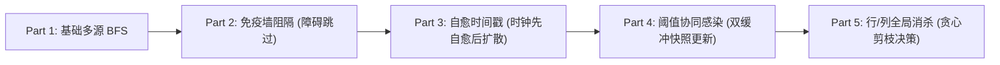
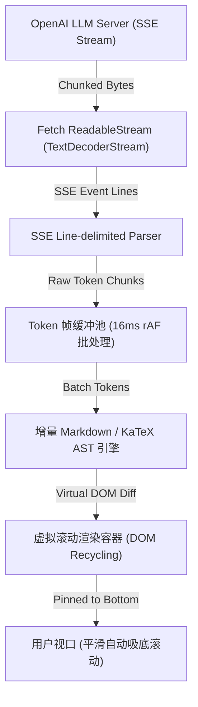

# OpenAI✅

- **业务领域**: 通用人工智能（AGI）、大语言模型（GPT-4o、o1、o3）、ChatGPT、Sora、开发者 API 平台
- **技术栈**: Next.js、React 19、TypeScript、Python、PyTorch、Rust、WebAssembly、WebGPU
- **团队规模**: 全球约 1500+ 人（前端应用与平台工程团队约 100+ 人）
- **办公地点**: 旧金山、纽约、伦敦、东京、西雅图（支持 Remote / Hybrid）
- **公司性质**: 外企 / 全球顶级 AI 实验室与科技独角兽
- **薪资水平**: 社招年薪 $400,000 - $1,200,000+（包含基础薪资与高额 PPU 股权激励）

## 岗位类型

- **Web Frontend Platform Engineer** - 负责 ChatGPT Web 端海量并发流式交互架构、低延迟渲染管线与 Generative UI 动态组件安全沙箱
- **Full-Stack AI Application Engineer** - 负责 OpenAI Platform 开发者控制台、API 聚合网关、模型微调监控中台与企业级安全合规体系
- **Client Foundation Architect** - 负责端侧推理加速、WebGPU / WASM 模型轻量化运行时集成、Canvas/WebGL 复杂流式动画与数据可视化

## 技术特色

- **极致的流式交互与渐进式排版**: 基于 SSE / WebSocket 的低延迟 Token 流式渲染，增量 AST 语法树解析（Markdown / KaTeX / Mermaid / 代码高亮），实现 60FPS 平滑流式输出与零布局抖动。
- **高弹性与防御性算法设计**: 面试极其严苛，推崇 60 分钟高频演进连问（如经典 Infection Spread 5 连问），全面考察候选人在需求持续剧烈突变时的代码解耦、架构弹性与数学严谨性。
- **全链路 AI Agent 前端载体**: 深度集成 Model Context Protocol (MCP) 与 Function Calling，探索结构化 JSON Schema 驱动的 Generative UI 动态表单与可控交互。

## 面试流程概览

### 社会招聘

1. **HR / Recruiter Screen**（30分钟）：过往背景、AI 研发热情、技术匹配度与团队文化了解。
2. **Technical Screen**（60分钟）：在线实时 Coding，通常为复杂状态演进算法题或分布式流式处理小系统（考察代码重构与解耦能力）。
3. **Virtual Onsite（4-5 轮，每轮 60 分钟）**：
   - **Coding 1**：核心数据结构、图论搜索、状态机模拟或高并发异步调度。
   - **Coding 2（前端/系统实操）**：流式协议解析、增量组件渲染树、长列表虚拟化或复杂前端状态管理。
   - **System Design**：大规模分布式前端/AI Agent 交互系统设计（如设计下一代 ChatGPT 协同工作台、流式日志排版监控系统）。
   - **Architecture Deep Dive**：针对候选人过往最具挑战性的生产架构与技术难题进行极限深挖。
   - **Behavioral & Culture Fit**：Alignment 价值观考核、跨职能沟通协作、面对极端技术分歧与高压交付时的决策原则。

## 题库

### P0 必考知识点

#### 网格多源扩散传播问题（Infection Spread 5 连问）与状态机演进？ {#p0-openai-infection-spread-multi-source-bfs}

<Answer>

**核心结论**

Infection Spread 是 OpenAI 极为经典的 60 分钟 5 连问压轴 Coding 真题。该题表面上是 LeetCode 994（腐烂的橘子）的多源广度优先搜索（Multi-Source BFS），但在面试进程中通过层层递进的真实业务场景约束突变，考核候选人的**防御性编码风格、状态机设计与双缓冲（Double Buffering）并发演化思维**。

通关核心脉络：
- **Part 1 基础传播**：标准分层多源 BFS，以所有初始感染者为波前推进，时间复杂度 $O(R \times C)$；
- **Part 2 免疫障碍**：引入免疫墙（2=immune），BFS 遇障碍跳过；死区检测判定健康格是否不可达；
- **Part 3 自愈生命周期**：节点在感染 $D$ 天后转为免疫并不再传播。关键坑点在于 **时钟时序（Off-by-one 陷阱）**：在当天传播判定前，必须先结算自愈（`currentDay - infectedAt >= D` 立即转为 2），剥夺当天传播权；
- **Part 4 阈值协同感染与死亡**：健康格必须周围至少有 $K$ 个感染邻居才会被激活，伴随死亡倒计时。此时纯队列 BFS 骨架被打破，必须采用**双缓冲快照（Double Buffering）机制**，避免 in-place 就地修改产生的后向时序脏读污染；
- **Part 5 全局灭火消杀决策**：每天允许消杀整行或整列，通过贪心边际收益评估与剪枝策略最小化受损规模。

---

**算法演化架构拓扑**



---

**核心架构代码示范**

完整带自动化测试沙箱实现可直接跳转查阅 [图论专题：网格多源扩散传播问题](/docs/algorithm/graph#p0-multi-source-bfs-infection-spread)。以下为 Part 3（时钟解耦）与 Part 4（双缓冲同步演化）的核心范式：

```typescript
// Part 3: 自愈时序规避 Off-by-one 陷阱
function tickPart3(grid: Cell[][], currentDay: number, D: number): boolean {
  // 步骤 1: 当天启动瞬间，先结算自愈，失去当日感染权
  for (let r = 0; r < rows; r++) {
    for (let c = 0; c < cols; c++) {
      if (grid[r][c].state === 1 && currentDay - grid[r][c].infectedAt >= D) {
        grid[r][c].state = 2; // 自愈为免疫
      }
    }
  }
  // 步骤 2: 剩余具备活跃传染力的节点向 4 邻域波前扩散
  return performWavefrontSpread(grid, currentDay);
}

// Part 4: 双缓冲快照 (Double Buffering) 规避状态脏读
function tickPart4(currentGrid: Cell[][], K: number): Cell[][] {
  const nextGrid = currentGrid.map(row => row.map(cell => ({ ...cell })));
  
  for (let r = 0; r < rows; r++) {
    for (let c = 0; c < cols; c++) {
      if (currentGrid[r][c].state === 0) {
        // 读取只读快照 currentGrid 计算周围感染邻居
        const activeNeighbors = countActiveNeighbors(currentGrid, r, c);
        if (activeNeighbors >= K) {
          nextGrid[r][c].state = 1; // 写入下一帧 nextGrid
        }
      }
    }
  }
  return nextGrid; // 原子替换
}
```

---

**面试官视角**

OpenAI 工程师考察该题的核心并非考背诵模板，而是观察：
1. **代码韧性（Resilience）**：在第 15 分钟得知要追加 Part 3 和 Part 4 时，候选人是痛苦推倒重写，还是此前就编写了高内聚的模块？
2. **状态机一致性**：能否一眼看出“先扩散后自愈”会导致传染期多算 1 天的逻辑缺陷；
3. **评价标准**：在 60 分钟内完成前 3 部分即可拿到 Strong 信号，能够清晰给出 Part 4 双缓冲与 Part 5 剪枝思路者属于 Top 1% 候选人。

</Answer>

#### ChatGPT 亿级用户流式响应架构：SSE 增量解析、Markdown/LaTeX 渐进排版与长会话 DOM 虚拟化？ {#p0-openai-chatgpt-streaming-rendering}

<Answer>

**核心结论**

ChatGPT Web 端的核心技术壁垒在于面对超长 Token 流式输出时的**端到端低延迟、防抖平滑排版与恒定内存占用**。全链路架构由四层紧密啮合构成：
1. **传输层**：基于 HTTP/2 或 HTTP/3 的 Server-Sent Events (SSE) 协议，采用 `fetch` + `ReadableStream` 细粒度消费字节流；
2. **解析层**：基于状态机的增量流式 Tokenizer，规避每次新 Token 到达时对全文执行 $O(N)$ 重复 Markdown / KaTeX 解析；
3. **渲染调度层**：结合 `requestAnimationFrame` 动态缓冲池，对高频 Token 实施 16ms 渲染帧对齐合并，消除微小文本重排引起的 Layout Thrashing；
4. **视口与内存治理层**：采用可变高度虚拟列表（Dynamic Virtualized List）对长历史会话实行离屏 DOM 回收与挂起，确保页面运行时内存稳定在安全阈值（小于 150MB）。

---

**全链路流式渲染管线拓扑**



---

**生产级核心架构实现**

```typescript
// 1. 流式响应渐进式消费与缓冲区合并控制器
export class StreamRenderingController {
  private buffer: string[] = '';
  private rafId: number | null = null;
  private onRenderCallback: (content: string) => void;
  private fullText: string = '';

  constructor(onRender: (content: string) => void) {
    this.onRenderCallback = onRender;
  }

  // 消费 SSE ReadableStream
  async consumeStream(response: Response, signal?: AbortSignal): Promise<void> {
    const reader = response.body?.pipeThrough(new TextDecoderStream()).getReader();
    if (!reader) throw new Error('ReadableStream not supported');

    try {
      while (true) {
        if (signal?.aborted) {
          await reader.cancel();
          break;
        }
        const { done, value } = await reader.read();
        if (done) break;

        this.appendChunk(value);
      }
    } finally {
      this.flush();
      reader.releaseLock();
    }
  }

  // 16ms 帧对齐节流，避免高频 Token 触发主线程卡顿
  private appendChunk(chunk: string): void {
    this.buffer += chunk;
    if (this.rafId === null) {
      this.rafId = requestAnimationFrame(() => {
        this.fullText += this.buffer;
        this.buffer = '';
        this.rafId = null;
        this.onRenderCallback(this.fullText);
      });
    }
  }

  private flush(): void {
    if (this.buffer.length > 0) {
      this.fullText += this.buffer;
      this.buffer = '';
      this.onRenderCallback(this.fullText);
    }
    if (this.rafId !== null) {
      cancelAnimationFrame(this.rafId);
      this.rafId = null;
    }
  }
}
```

---

**关键瓶颈与优化攻坚点**

1. **增量语法解析（Avoid Full AST Rebuild）**：
   - 传统方案：每来一个字符，对全部已有文字重新跑一遍 `marked.parse(fullText)`，在长回答（如生成 2000 行代码）时，单次解析耗时从 1ms 暴增至 150ms+，主线程彻底掉帧卡死；
   - 工业级方案：采用**分块块级缓存（Block-level Cache）**。已闭合的 Markdown 段落、代码块或公式块生成静态 AST 节点并冻结（Memoized），仅对末尾处于“未完结（Incomplete）”状态的 Block 进行局部流式编译。
2. **代码块与高亮渐进着色**：
   - 针对超长代码块，若在流式输出中逐字高亮会导致巨大 CPU 开销。采用轻量 Lexer 在流式传输期仅作普通纯文本显示，待代码块闭合标记（如 ` ``` `）到达后，或流结束后才交由 Web Worker / Prism / Shiki 进行语法高亮着色。
3. **滚动锚定与吸底机制（Scroll Pinning）**：
   - 当用户处于视口底部时，内容增长自动触发平滑向下滚动；
   - 若用户主动向上滚轮查看历史回答，必须立即解绑“吸底锁定”，避免因新 Token 插入强行将用户视口扯回底部的恶劣交互体验。

---

**面试官视角**

此题考察候选人从网络协议、浏览器主线程渲染管线到复杂组件架构的全链路把控能力。下探追问链：
- “如何排查流式输出过程中由 KaTeX 公式未闭合符号（如单个 `$ `）引发的页面闪烁与语法崩溃？”（回答要点：未闭合状态标记与降级占位节点）；
- “如果网络产生背压（Backpressure），客户端如何告知服务端降速？”（回答要点：Fetch 流式读取器的拉取（Pull）模型与 TCP 接收窗口反馈）。

</Answer>

