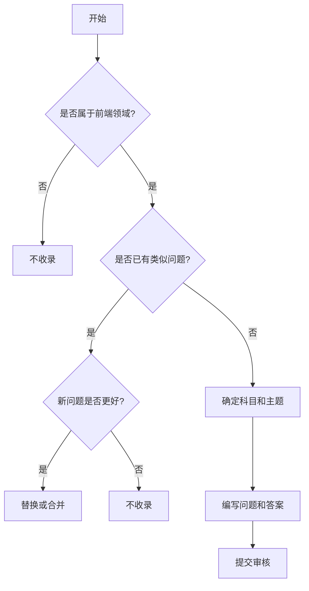

# 前端面试题库工作流程

## 项目概述 {#overview}

- **面向前端面试者**： 基于面向知识点的问题组织方式，"以练带学"，辅助建立完整的前端知识体系框架
- **面向面试官**：基于问题的详细解析，提供完整的评估体系，帮助客观评价候选人能力

**核心原则**：

- **问题导向，面向体系** 摒弃题海战术，确保每个问题具代表性可以映射到核心知识点，帮助面试者构建结构化知识体系
- **理论结合实践，注重应用** 确保选题具有实际应用价值，基于问题，帮助面试者理解知识点的实际应用场景
- **标准化评估** 提供明确的考察点与期望答案，帮助面试官客观评价候选人能力，同时帮助面试者明确学习方向

## 项目结构

内容组织结构分为三个层级：

1. **知识科目 (Subject)** 对应一级目录
   - 与其他领域有明确的界限
   - 可以独立学习和评估
   > 示例：JavaScript、HTML、CSS、Node、Vue、网络基础
2. **知识主题 (Topic)** 对应一级目录文件
   - 同一知识领域下的相关集合
   - 包含多个相关知识点
   > 示例：作用域、事件循环、类型系统
3. **问题 (Knowledge)** 对应文件中的二级标题内容
   - 必须是可以清晰定义的概念
   - 有具体的考察点
   > 示例：闭包、原型链、变量提升

:::info

最顶层还存在 **domain** 领域，用来区分不同岗位对应的知识域，例如后端、产品、设计、运维、测试等，目前只聚焦于前端领域，但是对于其他领域的知识科目也可以进行类似的组织。比如数据库等

:::

顶层目录结构如下：

```
.
├── README.md // 项目 readme
├── _draft // 草稿
├── company // 公司面试题,包含公司面试流程
├── contributors // 贡献者指南
├── docs // 题库文档
├── docusaurus.config.ts // docusaurus 配置文件
├── jest.config.js // jest 配置文件
├── package.json // 项目依赖
├── scripts // 脚本
├── sidebars.ts // 侧边栏配置
├── sidebarsCompany.ts // 公司面试题侧边栏配置
├── sidebarsContributors.ts // 贡献者指南侧边栏配置
├── src // 源码和 docusaurus 扩展的组件
├── static // 静态资源
└── tsconfig.json // typescript 配置文件
```

核心的 docs 目录按照如下结构组织：

```md
├── <subject>  # 知识科目目录
│  ├── README.md # 科目概述和知识点索引
│  ├── <00-topic0>.md // 知识主题关联的考题
│  ├── <01-topic1>.md // 知识主题关联的考题
│  ├── ... // 其他知识点
│  ├── answers // 对于编程类问题的或者需要详细说明的问题答案
│  │   ├── <question id> // 问题 id
│  │   │   ├── README.md // 答案解析
│  │   │   ├── ...
│  │   ├── <question id>.js // 直接对应问题的 id 的答案
│  │   ├── <question id>.test.js // 直接对应问题的 id 的答案的测试用例，如果有的话
├── ... // 其他知识域
```

**文件命名规范**

- 科目目录：使用全小写单词，如 `javascript、html_css`
- 主题文件：使用数字前缀确保顺序，如 `00.basics.md、01.scope.md`
- 答案文件或目录：与对应知识点 hash id 匹配，如 `closure.js、prototype.test.js`

## 内容贡献流程

### 选题标准与流程

1. 阅读现有问题：熟悉已有内容，避免重复
2. 确认问题元信息：包括难度级别、所属主题、考察点等，详见 [问题元信息](./02-question.md#meta)
3. 对比现有问题：
   - 若现有问题已包含该考察点，不收录
   - 若新问题优于现有问题，替换或合并，详见 [问题收录标准](./02-question.md#standard)
4. 提供答案解析：按照规定模板编写，详见 [问题模版](./02-question.md#template)

选题决策流程图


