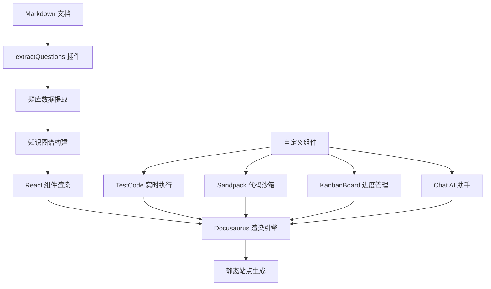

# 项目说明

## 项目概述 {#overview}

- **面向前端面试者**： 基于面向知识点的问题组织方式，"以练带学"，辅助建立完整的前端知识体系框架
- **面向面试官**：基于问题的详细解析，提供完整的评估体系，帮助客观评价候选人能力

**核心原则**：

- **问题导向，面向体系** 摒弃题海战术，确保每个问题具代表性可以映射到核心知识点，帮助面试者构建结构化知识体系
- **理论结合实践，注重应用** 确保选题具有实际应用价值，基于场景问题，帮助面试者理解知识点的实际应用场景
- **标准化评估** 提供明确的考察点与期望答案，帮助面试官客观评价候选人能力，同时帮助面试者明确学习方向

## 技术栈与项目架构 {#tech-stack}

### 核心技术栈

| 技术分类 | 技术选型 | 版本 | 用途说明 |
|:-------|:--------|:-----|:-------|
| **前端框架** | React | 19.0.0 | 构建交互式用户界面 |
| **文档框架** | Docusaurus | 3.8.1 | 静态站点生成与文档管理 |
| **开发语言** | TypeScript | ~5.6.2 | 提供类型安全的开发体验 |
| **包管理器** | pnpm | 9.15.4 | 快速、节省磁盘空间的包管理 |
| **测试框架** | Jest | 29.7.0 | 代码答案的单元测试 |
| **核心框架** | React | 18.2.0 | 构建用户界面的基础库 |
| **构建工具** | Webpack | 5.88.2 | 模块打包与构建优化 |
| **代码沙箱** | Sandpack | 2.20.0 | 在线代码编辑与执行环境 |
| **交互式可视化** | Custom Visualizers | 自研 React | 架构/时序/全链路动态演示组件库（详见 [实战指南](./07.interactive-sandpack-guide.md)） |

### 架构设计原则

1. **插件化扩展** - 基于 Docusaurus 插件系统，实现自定义功能模块化
2. **内容与展示分离** - Markdown 内容存储与 React 组件展示分离
3. **自动化数据提取** - 通过自定义插件自动解析文档结构生成数据
4. **组件化开发** - 可复用的 React 组件库，支持主题定制
5. **渐进式增强** - 基础文档阅读 + 高级交互功能

### 核心架构模块



**核心数据流：**

1. **内容管理层** - Markdown 文档 → 插件解析 → 结构化数据
2. **业务逻辑层** - 题库索引 → 知识图谱 → 交互组件
3. **展示层** - React 组件 → Docusaurus 主题 → 静态页面

### 关键特性实现

- **智能题库索引** - 自动解析文档目录结构，生成可搜索的题库数据
- **实时代码执行** - 集成 TestCode 和 Sandpack，支持在线编程练习
- **学习进度跟踪** - KanbanBoard 组件实现个性化学习路径管理  
- **AI 学习助手** - 集成 Ollama API 的智能问答功能
- **响应式设计** - 适配移动端和桌面端的阅读体验

## 整体项目结构

```
.
├── README.md // 项目说明
├── _draft // 存放草稿
├── company // 存放各公司前端面试信息
├── contributors // 存放项目和流程说明
├── docs // 存放题库文档
├── docusaurus.config.ts // docusaurus 配置
├── jest.config.js // 答案测试配置
├── package.json // npm 配置
├── scripts // 脚本文件
├── sidebars.ts // docs 边栏配置
├── sidebarsCompany.ts // company 边栏配置
├── sidebarsContributors.ts  // contributor 栏配置
├── src // 源码和 docusaurus 扩展组件
├── static // 静态资源
└── tsconfig.json // typescript 配置
```

### docs {#docs}

该目录存放题库，目录结构如下

```
docs
├── 01.01.js // js 科目
│   ├── 01.type.md // 类型
│   ├── ...
│   ├── coding.md // 编程题
│   ├── other.md // 其他无法归类的主题，用于兜底
│   └──answers // 编程题，或者相关需要编码问题答案
├── 01.02.typescript // ts 科目
├── 02.html // html 科目
│   ├── 01-attributes.md // 属性
│   ├── ...
│   ├── answers
│   ├── coding.md
│   └── worker.md
├── subjectxx.md // 其他前端科目
│   ├── topic1xx.md // 该科目下主题
│   ├── ... // 其他主题
│   ├── coding.md // 科目中的编程题
│   ├── other.md // 其他无法归类的主题，用于兜底
│   └── answers // 编程题，或者相关需要编码问题答案
├── ... // 其他前端科目
```

基于上述目录结构整体， docs 下组织规范如下

1. **知识科目 (Subject)** 对应一级目录
   - 与其他领域有明确的界限
   - 可以独立学习和评估
   - 科目按照 `<序号>.<科目名>`
      - 序号为从 00 到 99 的两位数字，比如 `02.html`
      - 科目名为全小写单词
      - 若存在关联科目可通过 `<序号>.<子序号>.<科目名>` 进行细分，比如 `01.01.javascript`，`01.02.typescript`
   > 示例：JavaScript、HTML、CSS、Node、Vue、网络基础
2. **知识主题 (Topic)** 对应一级目录下文件, 主题模版详见 [topic](./template/02.topic.md)
   - 关联某一科目下的相关子章节
   - 主题按照 `<序号>.<主题名>`
      - 序号为从 00 到 99 的两位数字，比如 `01.type.md` 类型主题
      - 对于相互关联的主题，可以通过 `<序号>.<子序号>.<主题名>` 进行细分，比如 `01.01.bundler-webpack.md、01.02.bundler-vite.md`
      - 主题支持嵌套比如 `02.html` 学科下 `04.webapi` 主题为一个目录下面在细分 `00.bom.md、01.dom.md` 等
      - 主题嵌套支持任意深度
3. **问题 (Knowledge)** 对应主题文件中的二级标题内容， 问题模版详见 [question](./template/01.question.md)
   - 必须是该主题下一个明确的问题
   - 有具体的考察点
   > 示例：闭包、原型链、变量提升

:::info
最顶层还存在 **domain** 领域，用来区分不同岗位对应的知识域，例如后端、产品、设计、运维、测试等，目前只聚焦于前端领域，但是对于其他领域的知识科目也可以进行类似的组织。比如数据库等
:::

基于上面的规则，docs 下题库目录可以抽象如下

```md
├── <subject>  # 知识科目目录
│  ├── README.md # 科目概述和知识点索引
│  ├── <00.topic0>.md // 知识主题关联的考题
│  ├── <01.01.topic1>.md // 知识主题关联的考题
│  ├── <01.02.relative-topic1>.md // 知识主题关联的考题
│  ├── <02.topic2> // 嵌套主题
│  │   ├── <01-nest-topic>.md // 嵌套主题 1
│  │   ├── <02-nest-topic2>.md // 嵌套主题 2
│  ├── ... // 其他知识点
│  ├── answers // 对于编程类问题的或者需要详细说明的问题答案
│  │   ├── <question id> // 问题 id
│  │   │   ├── README.md // 答案解析
│  │   │   ├── ...
│  │   ├── <question id>.js // 直接对应问题的 id 的答案
│  │   ├── <question id>.test.js // 直接对应问题的 id 的答案的测试用例，如果有的话
├── ... // 其他知识域
```

### company

该目录放置各公司的题目，目录结构如下

```
company
├── 公司1.md
├── 公司2.md
├── ...
```

具体公司中内容组织模版详见 [company](./template/03.company.md)

### contributors

存放贡献指南，文件目录说明

```
contributors
├── 01-summary.md // 项目概述
├── 02-question.md // 问题模版详细说明
└── index.md // 待办事项

```

### src

存放源码和 Docusaurus 扩展组件，目录结构如下

```
src
├── components // React 组件库
│   ├── chat // AI 聊天悬浮窗组件，基于 chatui 和 ollama API
│   ├── KanbanBoard // 看板管理组件，用于题目进度跟踪
│   ├── HomepageFeatures // 主页特性展示组件
│   ├── HomeQuestionsSummary // 题库概览组件，动态展示各科目题目数量
│   ├── QuestionList // 题目列表组件，支持筛选和搜索
│   ├── Progress // 学习进度跟踪组件
│   ├── templates // 模板组件
│   │   ├── Answer.mdx // 答案模板组件
│   │   ├── TestCode.tsx // 实时代码执行组件
│   │   └── CustomSandPack.tsx // 自定义代码沙箱组件
│   ├── Layout // 布局组件
│   └── ... // 其他功能组件
├── plugins // Docusaurus 自定义插件
│   ├── extractQuestions // 题目提取插件，自动解析 markdown 文件生成题库索引
│   ├── devProxy // 开发环境代理插件
│   └── imageViewer // 图片查看插件
├── theme // 主题定制
│   ├── MDXComponents.tsx // MDX 组件映射，注册自定义组件
│   └── DocRoot // 文档根组件定制
├── pages // 页面组件
│   ├── index.tsx // 主页
│   └── ... // 其他页面
└── css // 全局样式
    └── custom.css // 自定义样式
```

## 日常操作

### 常用命令

```bash
# 本地启动服务
pnpm i # 初始化项目
pnpm start # 启动本地调试


# 部署文档
pnpm deploy
```

### 日常工作流

详见 [workflow](./02.workflow.md)
