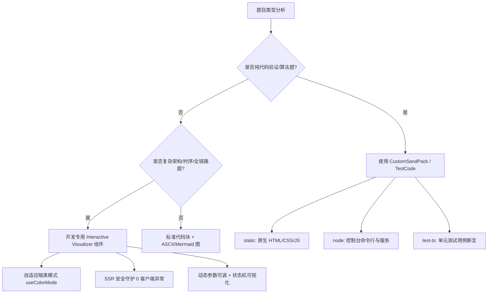

# 交互式组件与 Sandpack 沙盒实战指南

本指南系统化阐述在 Web-Interview 题库中构建高质量答案、可交互架构演示及可运行代码沙盒的标准与最佳实践。

---

## 一、核心设计哲学：以实例与组件代替纯文本

> **铁律**：如果一个复杂的原理、时序、状态流转或架构设计能够通过**交互式组件**或**可运行沙盒**直观说明，绝不堆砌大段抽象晦涩的纯文本。



---

## 二、交互沙箱组件规范

### 1. 增强型 `CustomSandPack`
基于 `@codesandbox/sandpack-react`（当前版本 2.20.0）封装，支持以下核心特性：
- **明暗主题动态无缝联动**：已打通 Docusaurus `useColorMode()`，根据整站模式自动切换 `dark` 或 `light`。
- **自适应高度与响应式**：默认 `editorHeight: 480`，避免小屏溢出。
- **模板自由透传**：支持 `static`、`node`、`react`、`vanilla`、`test-ts`。

#### 标准用法：
```tsx
import myHtml from '!!raw-loader!./answers/p0-my-question/index.html'
import myModule from '!!raw-loader!./answers/p0-my-question/module.js'

<CustomSandPack
  template="static"
  options={{
    showConsole: true,
    editorHeight: 400
  }}
  files={{
    "/index.html": myHtml,
    "/module.js": myModule
  }}
/>
```

### 2. 单元测试沙盒 `TestCode`
适用于算法题与核心工具函数的输入输出断言验证。
- 必须提供最小实现与 1–2 条清晰断言；
- 避免与题目无关的繁琐样板代码。

---

## 三、架构级可视化组件（Interactive Visualizers）开发规范

对于系统设计、构建工具链、跨端桌面端与 AI Agent 等宏观架构题目，推荐沉淀为专用 React 组件：

| 组件名 | 适用场景 | 核心交互特性 |
| :--- | :--- | :--- |
| `<ViteHmrVisualizer />` | 模块热更新 (HMR)、构建工具链 | 依赖图拓扑、脏模块标记、冒泡向上查找 accept 边界、局部替换 vs Full Reload |
| `<StranglerVisualizer />` | 遗留系统重构、微前端、微服务拆分 | 灰度进度滑块、网关切流比例条、新老系统共存拓扑、圈复杂度下降曲线 |
| `<ElectronProcessVisualizer />` | 桌面端、多进程架构、跨进程通信 | 进程拓扑框、渲染进程崩溃与 OOM 模拟、主进程守护、minidump 收集与自动恢复 |
| `<AgentTraceVisualizer />` | AI 前端工程、智能体、流式交互 | SSE 流式逐字吐字、ReAct 思考展开、MCP 工具调用与人机卡口确认 (Human-in-the-Loop) |
| `<InpVisualizer />` | 核心性能指标 (CWV)、长任务归因 | INP 交互延迟分解（输入排队 + 处理耗时 + 渲染呈现）、任务切片优化对比 |

### 组件工程规范
1. **暗色模式兼容**：所有组件必须通过 `const { colorMode } = useColorMode()` 处理颜色与边框，确保在深色模式下对比度清晰，不刺眼。
2. **SSR / SSG 安全**：严禁在组件模块顶层直接访问 `window`、`document` 或 `localStorage`，所有浏览器端 API 必须包裹在 `useEffect` 或事件回调中。
3. **全局注册**：所有通用可视化组件均在 `src/theme/MDXComponents.tsx` 中注册，MDX 文档内无需重复 import 即可直接调用。

---

## 四、MDX v3 兼容性铁律（零破坏构建）

1. **尖括号安全转义**：
   - 严禁书写裸 `<数字`（如 `< 100ms`），MDX v3 会将其误判为非法 JSX 标签。请始终写为 `< 100ms`（加空格）或中文 `小于 100ms`。
2. **反引号与模板字符串**：
   - 严禁在模板字符串反引号中嵌套未转义的 `${...}`。
3. **数学公式保护**：
   - LaTeX 大括号如 `\text{...}` 严禁裸露在正文，必须用反引号包裹或置于数学块中。
