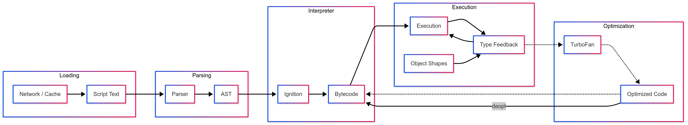
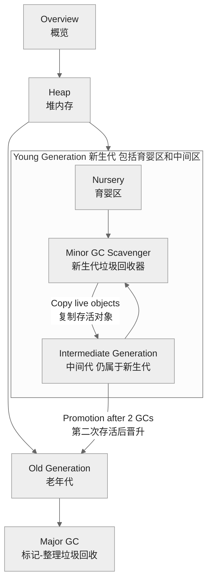

# js 引擎原理

## 解释性语言和编译型语言的区别 {#p0-explain-compile}

<Answer>

| 区别           | 编译型语言                         | 解释型语言                         |
| -------------- | ---------------------------------- | ---------------------------------- |
| 执行方式       | 运行前整体编译为机器码              | 运行时逐行解释执行                 |
| 生成文件       | 生成独立可执行文件                  | 不生成可执行文件，需解释器运行     |
| 执行速度       | 通常较快（已是机器码）              | 通常较慢（边解释边执行）           |
| 跨平台性       | 需针对不同平台分别编译              | 跨平台性好，只需相应解释器         |
| 错误发现时机   | 编译阶段发现大部分语法/类型错误     | 运行时才发现错误                   |
| 代表语言       | C、C++、Go、Rust                   | JavaScript、Python、Ruby、PHP      |

</Answer>

## 说一下 v8 是如何执行 javascript 语句的 ？{#p0-v8}

<Answer>

整个流程如下图



1. **加载(loading)** 从网络或者本地缓存等读取代码的字符流，转换为 UTF-16 的字符编码。
2. **解析(parser)** 将读取的字符流转换为抽象语法树 [`(AST)`](https://github.com/v8/v8/blob/0e0431b66576df51cd4c9270ccbfa89e70317c6e/src/ast/ast.h)。同时生成作用域相关信息, 进一步又可细分为
   1. **scan** 将字符流转换为 词法单元（token），解析包括标识符、关键字、运算符等信息
   2. **preparser** 对于非执行的代码会做预解析，用于检查语法错误等,这个阶段在 V8 内部又叫做，**lazy parsing**，因为它不会立即生成完整的 AST，而是延迟到真正需要执行时才进行完整解析。
   3. **parse** 对于会执行的代码会完全解析生成 AST 和对应的作用域关系。这个阶段又被叫做 **eager parsing**，因为它会生成完整的 AST 和作用域信息。
3. **解释(interpreter)** 会将 AST 转换为字节码，之所以需要字节码是为了解决直接编译为机器码导致的内存消耗过大和启动速度慢的问题。
4. **运行(execution)** 运行字节码，在运行中会生成一些额外的信息用来作为优化的输入
5. **优化(optimization)** 基于字节码和运行的信息，会对热点代码进行优化，V8 使用 TurboFan 来将字节码转换为机器码。
6. **去优化(deoptimization)** 代码执行过程中，如果发现某些优化不再适用，V8 会回退到未优化的字节码或解释器执行。

:::tip
此外 V8 也支持 wasm 的解释和运行，wasm 代码会被转换为 V8 的内部表示形式，然后经过与 JavaScript 相似的管道进行处理。
:::

**延伸阅读**

* [Life of a Script 2020](https://www.youtube.com/watch?v=veYjbF1rt5o) 讲解 v8 主流程
* [V8 blog](https://v8.dev/blog) 包含了 V8 的最新动态和技术细节

</Answer>

## Strict Mode?

<Answer>

`"use strict"` 是 JavaScript 中的一个编译指示（directive），用于启用严格模式（strict mode）。严格模式是 JavaScript 的一种执行模式，它增强了代码的健壮性、可维护性和安全性，并减少了一些常见的错误。通过在代码或函数顶部声明 `'use strict'` 开启 Strict Mode 模式。通过 strcict 来解决一些不安全的语言特性带来的安全或者其他问题。开启后的限制，详见 [The Strict Mode of ECMAScript](https://tc39.es/ecma262/#sec-strict-mode-of-ecmascript)。

1. 严格模式禁止使用一些不安全或不推荐的语法和行为，例如使用未声明的变量、删除变量或函数、对只读属性赋值等。它会抛出更多的错误，帮助开发者发现并修复潜在的问题。
2. 严格模式禁止使用一些不严谨的语法解析和错误容忍行为，例如不允许在全局作用域中定义变量时省略 `var` 关键字。
3. 严格模式对函数的处理更加严格，要求函数内部的 `this` 值为 `undefined`，而非在非严格模式下默认指向全局对象。
4. 严格模式禁止使用一些具有歧义性的特性，例如禁止使用八进制字面量、重复的函数参数名。

需要注意的是，严格模式不兼容一些旧版本的 JavaScript 代码，可能会导致一些旧有的代码产生错误。因此，在使用严格模式之前，需要确保代码中不会出现与严格模式不兼容的语法和行为。

**延伸阅读**

* [JavaScript二十年 严格模式章节](https://cn.history.js.org/part-4.html#%E4%B8%A5%E6%A0%BC%E6%A8%A1%E5%BC%8F) 讲解了，为什么会设计成这样的语法

</Answer>

## V8 里面的 JIT 是指什么？ {#P0-jit}

<Answer>

JIT（Just-In-Time，即时编译）是 V8 引擎中提升 JavaScript 执行效率的核心技术。它的作用是：**在代码运行期间，将热点 JavaScript 代码动态编译为本地机器码，从而大幅提升执行速度**。

V8 的 JIT 机制主要包括以下流程：

1. **解释执行**：V8 首先用解释器（Ignition）将 JS 代码编译为字节码并执行，启动快，适合冷代码。
2. **热点检测与即时编译**：当某段代码被频繁执行（成为“热点”），JIT 编译器（TurboFan）会将其优化为本地机器码，后续直接运行机器码，速度远超解释执行。
3. **优化与去优化**：JIT 编译会基于运行时收集的信息进行激进优化。如果后续发现假设不成立（如类型变化），会触发“去优化”，回退到字节码或重新优化。

</Answer>

## JavaScript 如何做内存管理？ {#p0-memory}

<Answer>

V8 的内存管理主要解决三个问题

1. 标识存活和死掉的对象
2. 清理死掉的对象，重用内存
3. 压缩和去碎片化提高内存使用率（可选）

可以在 node 中采用 [`v8.getHeapSpaceStatistics()`](https://nodejs.org/api/v8.html#v8getheapspacestatistics) 获取堆信息，V8 的内存结构如图

import Memory from './answers/memory/memory.tsx'

<Memory/>

| 空间 | 说明 | 特点 | GC 相关性 |
| :--- | :--- | :--- | :--- |
| Stack (栈空间) | 存储基本类型值、局部变量、函数参数及对象引用。函数调用创建栈帧，返回时销毁。 | 后进先出 (LIFO)，分配/回收快，空间小，操作系统自动管理。 | 不由 V8 GC 直接管理，但栈上的引用是 GC 判断堆对象可达性的起点。 |
| New Space (新生代) 1MB | 存放新建、生命周期短的对象，V8 频繁快速回收（Scavenge）。 | 空间小，分为 From/To 两半区，Scavenge 算法复制存活对象。 | 经一两次回收仍存活的对象晋升到老生代。 |
| Old Space (老生代) 动态增加 | 存放生命周期长或晋升的对象。 | 空间大，回收频率低但耗时长，采用 Mark-Sweep/Mark-Compact 算法。 | 存放常驻对象，满时触发主 GC。 |
| Large Object Space (大对象空间) | 存放体积大（通常 >1MB）的对象。 | 每个大对象独立分配内存块。 | GC 不移动大对象，参与 Mark-Sweep 回收。 |
| Code Space (代码空间) | 存放 JIT 编译后的机器码。 | 存储可执行代码。 | 可被 GC 清理未引用的编译代码。 |
| Map Space (Map 空间) | 存放对象的隐藏类（Maps）及转换信息。 | 包含对象元数据。 | Map 对象由 GC 管理。 |
| Read-Only Space (只读空间) | 存放运行时不会变的内置对象和数据。 | 启动后内容固定，不可修改。 | 不进行 GC，内容永久。 |
| Code Large Object Space (大代码对象空间) | 存放非常大的已编译代码块。 | 针对大型代码对象优化。 | 管理方式类似大对象空间。 |
| New Large Object Space (新生代大对象空间) | 新生代分配较大对象，生命周期短但体积大。 | 优化大短期对象，减少直接进入老生代大对象空间。 | 参与新生代回收，存活则晋升。 |

V8 gc 收集器叫做 [orinoco](https://v8.dev/blog/orinoco), 整个核心流程如下

<Column title="GC 说明">

<ColumnItem  >

1. **Minor GC** 新生代的垃圾回收，使用 Scavenge 算法。
   1. 对象首相分配到 ****Nursery Space****
   2. **marking** 会有单独对新生代区执行标记过程
   3. **evacuating**
      1. 利用 [semi-space](https://www.memorymanagement.org/glossary/s.html#term-semi-space) 移动
      2. 如果经过首次 GC 后仍然存活的对象会被标记为 Intermediate Generation, 移动到 TO Space，通过这一步实现了内存的对齐，减少了碎片
      3. 如果经过两次 GC 后仍然存活的对象会被直接移动到 Old Generation
   4. **pointer-updating** 更新指针，指向新对象的地址，用于循环执行步骤 2，3
   5. 如果经过两次 GC 后仍然存活，则会晋升到 **Old Generation**
2. **Major GC** 负责老生代的垃圾回收，
   1. **Marking** 从全局根对象开始，标记所有可达对象。对于不可达对象会记录在 free-list
   2. **Sweeping** 会在进程空闲的时候执行清除操作
   3. **Compacting** 压缩内存，移动存活对象，减少碎片化。

此外在进程模型上上述操作可以并行执行，具体的逻辑可以参考 [state of gc](https://v8.dev/blog/trash-talk#state)

:::tip

参考 [Understanding and Tuning Memory](https://nodejs.org/en/learn/diagnostics/memory/understanding-and-tuning-memory#understanding-and-tuning-memory)，V8 的内存管理基于 [分代假说(generational hypothesis)](https://www.memorymanagement.org/glossary/g.html#term-generational-hypothesis)，即大多数对象生命周期很短。因此，V8 将堆划分为不同的代，以优化垃圾回收效率

:::

</ColumnItem>

<ColumnItem >



</ColumnItem>

</Column>

**延伸资料**

* [Visualizing memory management in V8](https://deepu.tech/memory-management-in-v8/) 了解 V8 内存结构
* [A tour of V8: Garbage Collection](https://jayconrod.com/posts/55/a-tour-of-v8--garbage-collection) 讲解 V8 的垃圾回收机制
* [Trash talk](https://v8.dev/blog/trash-talk) 了解 V8 新老生代的内存管理
* [young generation garbage collection](https://v8.dev/blog/orinoco-parallel-scavenger) 了解新生代垃圾回收
* [Memory management](https://developer.mozilla.org/en-US/docs/Web/JavaScript/Guide/Memory_management) MDN 描述 V8 内存管理
* [v8 gc](https://github.com/thlorenz/v8-perf/blob/master/gc.md) 了解 V8 的垃圾回收机制

</Answer>

## 内联缓存 {#p2-inline-cache}

## 引擎调试与性能分析

* 如何使用Chrome DevTools分析V8性能
* 常见性能问题的识别方法
* 实用的优化技巧

## JS 中的数组和函数在内存中是如何存储的？{#p0-object-model}

在JavaScript中，数组和函数在内存中的存储方式有一些不同。

1. 数组（Array）的存储：

* 数组是一种线性数据结构，它可以存储多个值，并且这些值可以是不同类型的。在内存中，数组的存储通常是连续的。当创建一个数组时，JavaScript引擎会为其分配一段连续的内存空间来存储数组的元素。数组的每个元素都会被存储在这段内存空间中的相应位置。数组的长度可以动态改变，当向数组添加或删除元素时，JavaScript引擎会重新分配内存空间并移动元素的位置。

2. 函数（Function）的存储：

* 函数在JavaScript中被视为一种特殊的对象。函数的定义实际上是创建一个函数对象，并将其存储在内存中。函数对象本身包含了函数的代码以及其他相关信息，例如函数的名称、参数和闭包等。函数对象的代码部分通常是一段可执行的JavaScript代码，它被存储在内存中的某个位置。当调用函数时，JavaScript引擎会查找该函数对象的存储位置，并执行其中的代码。

需要注意的是，数组和函数的存储方式是由JavaScript引擎决定的，不同的引擎可能会有一些微小的差异。此外，JavaScript引擎还会使用一些优化技术，如垃圾回收和内存管理，来优化内存的使用和回收。

在JavaScript中，变量的存储方式是基于所存储值的数据类型。JavaScript有7种内置数据类型：undefined、null、boolean、number、string、symbol和object。

对于基础数据类型（除了object），变量值会直接存储在内存中。具体来说，这些数据类型的变量在内存中的存储形式如下：

* undefined和null：这两个数据类型都只有一个值，每个值有一个特殊的内存地址。存储它们的变量会被赋予对应的内存地址。
* boolean：这个数据类型的值只需要存储一个比特位（0或1），它们通常被存储在栈中，而不是堆中。
* number：根据规范，数字类型在内存中占用8个字节的空间（64位），它们通常被存储在栈中，而不是堆中。
* string：字符串实际上是一组字符数组，它们通常被存储在堆中，并通过引用地址存储在栈中。
* symbol：每个symbol对应于唯一的标识符。它们通常被存储在堆中，并通过引用地址存储在栈中。

而对于对象类型（包括对象、数组等），变量存储了一个指向存储对象的内存地址的指针。JavaScript采用引用计数内存管理，因此它会对每个对象进行引用计数，当一个对象不再被引用时，JavaScript会自动回收这个对象的内存空间。

总的来说，在JavaScript中，变量的存储方式基于值类型的数据类型，对于对象型变量，存储指向对象的内存地址的指针以及对象的值，而对于基础类型的变量，直接存储变量的值。

在JavaScript中，对象是一种无序的键值对集合，可以保存和传递信息。对象是一种非常重要的数据类型，在JavaScript中，几乎所有东西都是对象。

在底层，JavaScript对象的数据结构是哈希表（Hash Table），也可以称为散列表。哈希表是一种使用哈希函数将键值映射到数据中的位置的数据结构。它允许效率高且快速地插入、查找和删除数据，这些操作在算法的平均情况下都需要常数时间。哈希表的主要思想是将键值对转换为索引的方式在常数时间内获取值，因此哈希表非常适合用于大量的键值对数据存储。

在JavaScript中，对象的键值对存储使用了类似哈希表的技术。JavaScript引擎使用一个称为哈希表种子的随机数字来计算键的哈希值，然后使用头插法（链表或树）将键和值存储在桶中，以实现高效的插入和查询操作。因此，JavaScript对象在实现上使用了哈希表来存储和访问键值对，从而提供了非常高效的数据存储和查找操作，使之成为了编写JavaScript代码的强大工具。

## 隐藏类是什么概念？ {#p0-hidden-class}

<Answer>

隐藏类（Hidden Class，也称为 Shape 或 Map）是 JavaScript 引擎（如 V8）为优化对象属性访问速度而引入的一种内部数据结构。它类似于静态语言中的“类”，但会在运行时动态生成，用于描述对象的属性布局（属性名、顺序、偏移等）。这样，访问对象属性时可以通过偏移量直接定位，而不是每次都查找属性名。

* **动态生成**：当你用相同顺序为对象添加属性时，引擎会为这些对象复用同一个隐藏类。每次添加新属性，都会基于当前隐藏类生成一个新的隐藏类，并建立“转换链”。
* **属性顺序敏感**：属性添加顺序不同会导致不同的隐藏类。例如：

   ```js
   // 产生相同隐藏类
   function Foo() {
      this.a = 1
      this.b = 2
   }
   const o1 = new Foo()
   const o2 = new Foo()

   // 产生不同隐藏类
   const o3 = {}
   o3.a = 1
   o3.b = 2

   const o4 = {}
   o4.b = 2
   o4.a = 1
   ```

   o1 和 o2 共享隐藏类，o3 和 o4 因属性顺序不同，隐藏类也不同。

* **属性变化触发隐藏类切换**：删除属性、为对象动态添加新属性、属性类型变化等操作都会导致隐藏类切换（deopt），影响性能。
* **优化对象访问**：隐藏类让引擎能像访问 C++ 结构体那样，通过偏移量直接访问属性，避免哈希查找。

基于隐藏类业务侧的优化建议：

* **统一对象结构**：尽量让同一类对象的属性初始化顺序和数量一致，避免动态增删属性。例如，构造函数中一次性初始化所有属性。
* **避免动态添加/删除属性**：不要在对象创建后随意增删属性，尤其是在性能敏感代码中。
* **预分配属性**：即使某些属性暂时用不到，也可以先赋值为 null 或 undefined，保证对象结构一致。
* **数组稀疏性**：数组稀疏（索引不连续）也会导致隐藏类退化，影响性能。

**延伸阅读**

* [V8 官方文档 Hidden Classes](https://v8.dev/blog/fast-properties)
* [深入理解 V8 隐藏类](https://juejin.cn/post/6844904066412154893)

</Answer>

## 尾调优化

[es6 JavaScript 尾调用](https://blog.csdn.net/qq_30100043/article/details/53406001)
[深入理解JavaScript中的尾调用(Tail Call)](https://www.jb51.net/article/104875.htm)

 1、什么是尾调用

尾调用是函数式编程里比较重要的一个概念，尾调用的概念非常简单，
一句话就能说清楚，它的意思是在函数的执行过程中，如果最后一个动作是一个函数的调用，
即这个调用的返回值被当前函数直接返回，则称为尾调用。

```js
function f (x) {
  return g(x)
}
```

上面代码中，函数 f 的最后一步是调用函数 g ，这就叫尾调用。**以下三种情况，都不属于尾调用。**

```js
// 情况一
function f (x) {
  const y = g(x)
  return y
}
// 情况二

function f1 (x) {
  return g(x) + 1
}
// 情况三
function f2 (x) {
  g(x)
}
```

上面代码中，情况一是调用函数 g 之后，还有赋值操作，所以不属于尾调用，即使语义完全一样。情况二也属于调用后还有操作，即使写在一行内。情况三等同于下面的代码。

```js
function f (x) {
  g(x)
  return undefined
}
```

尾调用不一定出现在函数尾部，只要是最后一步操作即可。

```js
function f (x) {
  if (x > 0) {
    return m(x)
  }
  return n(x)
}
```

上面代码中，函数 m 和 n 都属于尾调用，因为它们都是函数 f 的最后一步操作。

 2、尾调用优化

尾调用之所以与其他调用不同，就在于它的特殊的调用位置。

我们知道，函数调用会在内存形成一个 “ 调用记录 ” ，又称 “ 调用帧 ” （ call frame ），保存调用位置和内部变量等信息。
如果在函数 A 的内部调用函数 B ，那么在 A 的调用帧上方，还会形成一个 B 的调用帧。
等到 B 运行结束，将结果返回到 A ， B 的调用帧才会消失。
如果函数 B 内部还调用函数 C ，那就还有一个 C 的调用帧，以此类推。
所有的调用帧，就形成一个 “ 调用栈 ” （ call stack ）。

尾调用由于是函数的最后一步操作，所以不需要保留外层函数的调用帧，
因为调用位置、内部变量等信息都不会再用到了，只要直接用内层函数的调用帧，取代外层函数的调用帧就可以了。

```js
function f () {
  const m = 1
  const n = 2
  return g(m + n)
}
f()
// 等同于
function f1 () {
  return g(3)
}
f()
// 等同于
g(3)
```

上面代码中，如果函数 g 不是尾调用，函数 f 就需要保存内部变量 m 和 n 的值、 g 的调用位置等信息。
但由于调用 g 之后，函数 f 就结束了，所以执行到最后一步，完全可以删除 f(x) 的调用帧，只保留 g(3) 的调用帧。

这就叫做 “ 尾调用优化 ” （ Tail call optimization ），即只保留内层函数的调用帧。
如果所有函数都是尾调用，那么完全可以做到每次执行时，调用帧只有一项，这将大大节省内存。这就是 “ 尾调用优化 ” 的意义。

注意，只有不再用到外层函数的内部变量，内层函数的调用帧才会取代外层函数的调用帧，否则就无法进行 “ 尾调用优化 ” 。

```js
function addOne (a) {
  const one = 1
  function inner (b) {
    return b + one
  }
  return inner(a)
}
```

上面的函数不会进行尾调用优化，因为内层函数inner用到了外层函数addOne的内部变量one。

 3、尾递归

函数调用自身，称为递归。如果尾调用自身，就称为尾递归。
递归非常耗费内存，因为需要同时保存成千上百个调用帧，很容易发生 “ 栈溢出 ” 错误（ stack overflow ）。
但对于尾递归来说，由于只存在一个调用帧，所以永远不会发生 “ 栈溢出 ” 错误。

```js
function factorial (n) {
  if (n === 1) return 1
  return nfactorial(n - 1)
}
factorial(5) // 120
```

上面代码是一个阶乘函数，计算 n 的阶乘，最多需要保存 n 个调用记录，复杂度 O(n) 。

如果改写成尾递归，只保留一个调用记录，复杂度 O(1) 。

```js
function factorial (n, total) {
  if (n === 1) return total
  return factorial(n - 1, ntotal)
}
factorial(5, 1) // 120
```

还有一个比较著名的例子，就是计算 fibonacci（斐波那契） 数列，也能充分说明尾递归优化的重要性
如果是非尾递归的 fibonacci 递归方法

```js
function Fibonacci (n) {
  if (n <= 1) { return 1 }
  return Fibonacci(n - 1) + Fibonacci(n - 2)
}
Fibonacci(10) // 89
// Fibonacci(100)
// Fibonacci(500)
// 堆栈溢出了
```

如果我们使用尾递归优化过的 fibonacci 递归算法

```js
function Fibonacci2 (n, ac1 = 1, ac2 = 1) {
  if (n <= 1) { return ac2 }
  return Fibonacci2(n - 1, ac2, ac1 + ac2)
}
Fibonacci2(100) // 573147844013817200000
Fibonacci2(1000) // 7.0330367711422765e+208
Fibonacci2(10000) // Infinity
```

由此可见， “ 尾调用优化 ” 对递归操作意义重大，所以一些函数式编程语言将其写入了语言规格。
ES6 也是如此，第一次明确规定，所有 ECMAScript 的实现，都必须部署 “ 尾调用优化 ” 。这就是说，在 ES6 中，只要使用尾递归，就不会发生栈溢出，相对节省内存。

 4、递归函数的改写

尾递归的实现，往往需要改写递归函数，确保最后一步只调用自身。做到这一点的方法，就是把所有用到的内部变量改写成函数的参数。
比如上面的例子，阶乘函数 factorial 需要用到一个中间变量 total ，那就把这个中间变量改写成函数的参数。
这样做的缺点就是不太直观，第一眼很难看出来，为什么计算 5 的阶乘，需要传入两个参数 5 和 1 ？

两个方法可以解决这个问题。
**方法一是在尾递归函数之外，再提供一个正常形式的函数。**

```js
function tailFactorial (n, total) {
  if (n === 1) return total
  return tailFactorial(n - 1, ntotal)
}
function factorial (n) {
  return tailFactorial(n, 1)
}
factorial(5) // 120
```

上面代码通过一个正常形式的阶乘函数 factorial ，调用尾递归函数 tailFactorial ，看起来就正常多了。

函数式编程有一个概念，**叫做柯里化（ currying ）**，意思是将多参数的函数转换成单参数的形式。这里也可以使用柯里化。

```js
function currying (fn, n) {
  return function (m) {
    return fn.call(this, m, n)
  }
}
function tailFactorial (n, total) {
  if (n === 1) return total
  return tailFactorial(n - 1, ntotal)
}
const factorial = currying(tailFactorial, 1)
factorial(5) // 120
```

上面代码通过柯里化，将尾递归函数 tailFactorial 变为只接受 1 个参数的 factorial 。

**第二种方法就简单多了，就是采用 ES6 的函数默认值。**

```js
function factorial (n, total = 1) {
  if (n === 1) return total
  return factorial(n - 1, ntotal)
}
factorial(5) // 120
```

上面代码中，参数 total 有默认值 1 ，所以调用时不用提供这个值。

总结一下，递归本质上是一种循环操作。纯粹的函数式编程语言没有循环操作命令，所有的循环都用递归实现，这就是为什么尾递归对这些语言极其重要。
对于其他支持 “ 尾调用优化 ” 的语言（比如 Lua ， ES6 ），只需要知道循环可以用递归代替，而一旦使用递归，就最好使用尾递归。

 5、严格模式

ES6 的尾调用优化只在严格模式下开启，正常模式是无效的。
这是因为在正常模式下，函数内部有两个变量，可以跟踪函数的调用栈。
func.arguments：返回调用时函数的参数。
func.caller：返回调用当前函数的那个函数。
尾调用优化发生时，函数的调用栈会改写，因此上面两个变量就会失真。严格模式禁用这两个变量，所以尾调用模式仅在严格模式下生效。

```js
function restricted () {
  'use strict'
  restricted.caller // 报错
  restricted.arguments // 报错
}
restricted()
```

 6、尾递归优化的实现

尾递归优化只在严格模式下生效，那么正常模式下，或者那些不支持该功能的环境中，有没有办法也使用尾递归优化呢？回答是可以的，就是自己实现尾递归优化。
它的原理非常简单。尾递归之所以需要优化，原因是调用栈太多，造成溢出，那么只要减少调用栈，就不会溢出。
怎么做可以减少调用栈呢？就是采用 “ 循环 ” 换掉 “ 递归 ” 。

下面是一个正常的递归函数。

```js
function sum (x, y) {
  if (y > 0) {
    return sum(x + 1, y - 1)
  } else {
    return x
  }
}
sum(1, 100000)
// Uncaught RangeError: Maximum call stack size exceeded(…)
```

上面代码中，sum是一个递归函数，参数x是需要累加的值，参数y控制递归次数。
一旦指定sum递归 100000 次，就会报错，提示超出调用栈的最大次数。
**蹦床函数(trampoline)** 可以将递归执行转为循环执行。

```js
function trampoline (f) {
  while (f && f instanceof Function) {
    f = f()
  }
  return f
}
```

上面就是蹦床函数的一个实现，它接受一个函数f作为参数。只要f执行后返回一个函数，就继续执行。
注意，这里是返回一个函数，然后执行该函数，而不是函数里面调用函数，这样就避免了递归执行，从而就消除了调用栈过大的问题。

然后，要做的就是将原来的递归函数，改写为每一步返回另一个函数。

```js
function sum (x, y) {
  if (y > 0) {
    return sum.bind(null, x + 1, y - 1)
  } else {
    return x
  }
}
```

上面代码中，sum函数的每次执行，都会返回自身的另一个版本。
现在，使用蹦床函数执行sum，就不会发生调用栈溢出。

```js
// eslint-disable-next-line
trampoline(sum(1, 100000))
// 100001
// 蹦床函数并不是真正的尾递归优化，下面的实现才是。
function tco (f) {
  let value
  let active = false
  const accumulated = []
  return function accumulator () {
    accumulated.push(arguments)
    if (!active) {
      active = true
      while (accumulated.length) {
        value = f.apply(this, accumulated.shift())
      }
      active = false
      return value
    }
  }
}
var sum = tco(function (x, y) {
  if (y > 0) {
    return sum(x + 1, y - 1)
  } else {
    return x
  }
})
sum(1, 100000)
// 100001
```

上面代码中，tco函数是尾递归优化的实现，它的奥妙就在于状态变量active。
默认情况下，这个变量是不激活的。一旦进入尾递归优化的过程，这个变量就激活了。
然后，每一轮递归sum返回的都是undefined，所以就避免了递归执行；
而accumulated数组存放每一轮sum执行的参数，总是有值的，这就保证了accumulator函数内部的while循环总是会执行。
这样就很巧妙地将 “ 递归 ” 改成了 “ 循环 ” ，而后一轮的参数会取代前一轮的参数，保证了调用栈只有一层。

## for 循环的性能远远高于 forEach 的性能？{#p1-for-foreach}

 首先问题说"for循环优于forEach"并不完全正确

循环次数不够多的时候， forEach 性能优于 for

```js
// 循环十万次
const arrs = new Array(100000)

console.time('for')
// eslint-disable-next-line
for (let i = 0; i < arrs.length; i++) {}
console.timeEnd('for') // for: 2.36474609375 ms

console.time('forEach')
arrs.forEach((arr) => {})
console.timeEnd('forEach') // forEach: 0.825927734375 ms
```

循环次数越大， for 的性能优势越明显

```js
// 循环 1 亿次
const arrs = new Array(100000000)

console.time('for')
// eslint-disable-next-line
for (let i = 0; i < arrs.length; i++) {}
console.timeEnd('for') // for: 72.7099609375 ms

console.time('forEach')
arrs.forEach((arr) => {})
console.timeEnd('forEach') // forEach: 923.77392578125 ms
```

 先做一下对比

|对比类型|for|forEach|
|:---|:---|:---|
|遍历|for循环按顺序遍历|forEach 使用 iterator 迭代器遍历|
|数据结构|for循环是随机访问元素|forEach 是顺序链表访问元素|
|性能上|对于arraylist，是顺序表，使用for循环可以顺序访问，速度较快；使用foreach会比for循环稍慢一些|对于linkedlist，是单链表，使用for循环每次都要从第一个元素读取next域来读取，速度非常慢；使用foreach可以直接读取当前结点，数据较快|

 结论

for 性能优于 forEach ， 主要原因如下：

1. foreach相对于for循环，代码减少了，但是foreach依赖IEnumerable。在运行的时候效率低于for循环。
2. for循环没有额外的函数调用栈和上下文，所以它的实现最为简单。forEach：对于forEach来说，它的函数签名中包含了参数和上下文，所以性能会低于 for 循环。

 参考文档

* [资料](https://zhuanlan.zhihu.com/p/461523927)
* [JavaScript 中 for 的性能比 forEach 的性能要好，为何还要使用 forEach？ - 李十三的回答 - 知乎](https://www.zhihu.com/question/556786869/answer/2706658837)
* [资料](https://juejin.cn/post/6844904159938887687)
