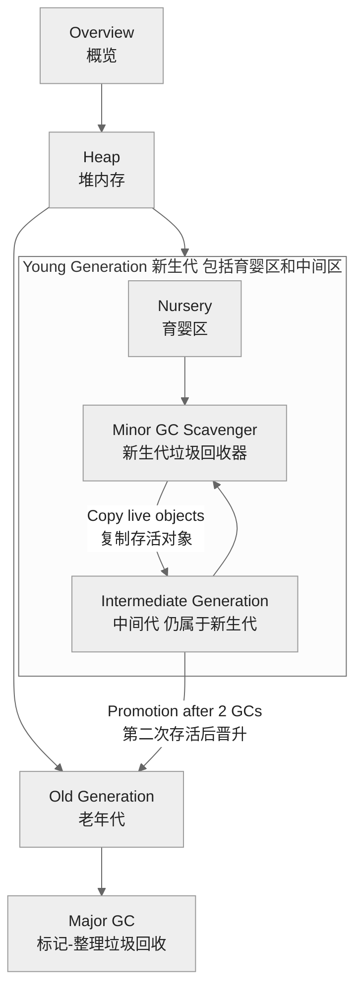

# js 引擎原理✅

## JavaScript、ECMAScript、BOM、DOM、Node.js 之间是什么关系？ {#P0-object-concept}

<Answer>

- **ECMAScript** 是 JavaScript 的标准化规范，定义了语法、数据类型、控制流等，是 JS 的“语言核心”。
- **JavaScript** 是实现了 ECMAScript 标准的编程语言，实际开发中还包含 BOM、DOM 等能力。
- **BOM**（浏览器对象模型）是浏览器提供的 API，如 window、location、history 等，允许 JS 操作浏览器环境。
- **DOM**（文档对象模型）是浏览器提供的 API，允许 JS 操作网页结构和内容。
- **Node.js** 是基于 V8 引擎的 JS 运行时，让 JS 能在服务器端运行，提供文件、网络等 API，不包含 BOM/DOM。

**答案解析**  

JS 语言核心由 ECMAScript 定义，BOM/DOM/Node.js 提供不同运行环境的扩展能力。

**面试官视角**  

- 核心考察点：能否区分 JS 语言核心与运行环境
- 评分标准：
  - 差：混淆 ECMAScript、BOM、DOM
  - 优：能清晰描述各自作用和关系
</Answer >

## 如何将JavaScript代码解析成抽象语法树(AST) {#ast}

<Answer>

**方案对比**

| 解析器 | 生态/定位 | 语法覆盖 | 常用配置要点 | 适用场景 |
|:--|:--|:--|:--|:--|
| Esprima | 早期流行解析器 | ES 标准为主，提案语法支持有限 | `parseScript(code, { tolerant: true })` | 教学、标准语法解析 |
| Acorn | 轻量可扩展 | 通过 `ecmaVersion` 与插件扩展 | `acorn.parse(code, { ecmaVersion: 2024 })` | 通用解析、工具链底层 |
| Babel Parser | 生态最广 | 提案支持齐全，配合插件 | `babelParser.parse(code, { plugins: [...] })` | 转译链路、复杂语法 |

**示例说明**

import astStatic from '!!raw-loader!./answers/ast/ast-static.html'

<Sandpack
  template="static"
  options={{
    showConsole: true,
    editorHeight: 520
  }}
  files={{
    "/index.html": astStatic,
  }}
/>

**原理简述**

1. 词法分析：把源码切成 token 序列（标识符、关键字、运算符等）
2. 语法分析：依据语法规则把 token 构造成 AST（递归下降、LR 等）
3. 产出 AST：树结构表达代码语义，供后续转换/优化/代码生成

</Answer>

## 解释性语言和编译型语言的区别 {#p0-explain-compile}

<Answer>

| 区别           | 编译型语言                         | 解释型语言                         |
| -------------- | ---------------------------------- | ---------------------------------- |
| 执行方式       | 运行前整体编译为机器码              | 运行时逐行解释执行                 |
| 生成文件       | 生成独立可执行文件                  | 不生成可执行文件，需解释器运行     |
| 执行速度       | 通常较快（已是机器码）              | 通常较慢（边解释边执行）           |
| 跨平台性       | 需针对不同平台分别编译              | 跨平台性好，只需相应解释器         |
| 错误发现时机   | 编译阶段发现大部分语法/类型错误     | 运行时才发现错误                   |
| 代表语言       | C、C++、Go、Rust                   | JavaScript、Python、Ruby、PHP      |

</Answer>

## 说一下 v8 是如何执行 javascript 语句的 ？{#p0-v8}

<Answer>

整个流程如下图


1. **加载(loading)** 从网络或者本地缓存等读取代码的字符流，转换为 UTF-16 的字符编码。
2. **解析(parser)** 将读取的字符流转换为抽象语法树 [`(AST)`](https://github.com/v8/v8/blob/0e0431b66576df51cd4c9270ccbfa89e70317c6e/src/ast/ast.h)。同时生成作用域相关信息, 进一步又可细分为
   1. **scan** 将字符流转换为 词法单元（token），解析包括标识符、关键字、运算符等信息
   2. **preparser** 对于非执行的代码会做预解析，用于检查语法错误等,这个阶段在 V8 内部又叫做，**lazy parsing**，因为它不会立即生成完整的 AST，而是延迟到真正需要执行时才进行完整解析。
   3. **parse** 对于会执行的代码会完全解析生成 AST 和对应的作用域关系。这个阶段又被叫做 **eager parsing**，因为它会生成完整的 AST 和作用域信息。
3. **解释(interpreter)** 会将 AST 转换为字节码，之所以需要字节码是为了解决直接编译为机器码导致的内存消耗过大和启动速度慢的问题。
4. **运行(execution)** 运行字节码，在运行中会生成一些额外的信息用来作为优化的输入
5. **优化(optimization)** 基于字节码和运行的信息，会对热点代码进行优化，V8 使用 TurboFan 来将字节码转换为机器码。
6. **去优化(deoptimization)** 代码执行过程中，如果发现某些优化不再适用，V8 会回退到未优化的字节码或解释器执行。

:::tip
此外 V8 也支持 wasm 的解释和运行，wasm 代码会被转换为 V8 的内部表示形式，然后经过与 JavaScript 相似的管道进行处理。
:::

**延伸阅读**

- [Life of a Script 2020](https://www.youtube.com/watch?v=veYjbF1rt5o) 讲解 v8 主流程
- [V8 blog](https://v8.dev/blog) 包含了 V8 的最新动态和技术细节

</Answer>

## Strict Mode?

<Answer>

`"use strict"` 是 JavaScript 中的一个编译指示（directive），用于启用严格模式（strict mode）。严格模式是 JavaScript 的一种执行模式，它增强了代码的健壮性、可维护性和安全性，并减少了一些常见的错误。通过在代码或函数顶部声明 `'use strict'` 开启 Strict Mode 模式。通过 strcict 来解决一些不安全的语言特性带来的安全或者其他问题。开启后的限制，详见 [The Strict Mode of ECMAScript](https://tc39.es/ecma262/#sec-strict-mode-of-ecmascript)。

1. 严格模式禁止使用一些不安全或不推荐的语法和行为，例如使用未声明的变量、删除变量或函数、对只读属性赋值等。它会抛出更多的错误，帮助开发者发现并修复潜在的问题。
2. 严格模式禁止使用一些不严谨的语法解析和错误容忍行为，例如不允许在全局作用域中定义变量时省略 `var` 关键字。
3. 严格模式对函数的处理更加严格，要求函数内部的 `this` 值为 `undefined`，而非在非严格模式下默认指向全局对象。
4. 严格模式禁止使用一些具有歧义性的特性，例如禁止使用八进制字面量、重复的函数参数名。

需要注意的是，严格模式不兼容一些旧版本的 JavaScript 代码，可能会导致一些旧有的代码产生错误。因此，在使用严格模式之前，需要确保代码中不会出现与严格模式不兼容的语法和行为。

**延伸阅读**

- [JavaScript二十年 严格模式章节](https://cn.history.js.org/part-4.html#%E4%B8%A5%E6%A0%BC%E6%A8%A1%E5%BC%8F) 讲解了，为什么会设计成这样的语法

</Answer>

## V8 里面的 JIT 是指什么？ {#P0-jit}

<Answer>

JIT（Just-In-Time，即时编译）是 V8 引擎中提升 JavaScript 执行效率的核心技术。它的作用是：**在代码运行期间，将热点 JavaScript 代码动态编译为本地机器码，从而大幅提升执行速度**。

V8 的 JIT 机制主要包括以下流程：

1. **解释执行**：V8 首先用解释器（Ignition）将 JS 代码编译为字节码并执行，启动快，适合冷代码。
2. **热点检测与即时编译**：当某段代码被频繁执行（成为“热点”），JIT 编译器（TurboFan）会将其优化为本地机器码，后续直接运行机器码，速度远超解释执行。
3. **优化与去优化**：JIT 编译会基于运行时收集的信息进行激进优化。如果后续发现假设不成立（如类型变化），会触发“去优化”，回退到字节码或重新优化。

</Answer>

## JavaScript 如何做内存管理？ {#p0-memory}

<Answer>

V8 的内存管理主要解决三个问题

1. **标记** 识别存活对象与垃圾对象
2. **重用** 释放不可达对象，回收内存
3. **压缩** 压缩活跃对象，减少碎片

可以在 node 中采用 [`v8.getHeapSpaceStatistics()`](https://nodejs.org/api/v8.html#v8getheapspacestatistics) 获取堆信息，V8 的内存结构如图

import Memory from './answers/memory/memory.tsx'

<Memory/>

| 空间 | 说明 | 特点 | GC 相关性 |
| :--- | :--- | :--- | :--- |
| Stack (栈空间) | 存储基本类型值、局部变量、函数参数及对象引用。函数调用创建栈帧，返回时销毁。 | 后进先出 (LIFO)，分配/回收快，空间小，操作系统自动管理。 | 不由 V8 GC 直接管理，但栈上的引用是 GC 判断堆对象可达性的起点。 |
| New Space (新生代) 1MB | 存放新建、生命周期短的对象，V8 频繁快速回收（Scavenge）。 | 空间小，分为 From/To 两半区，Scavenge 算法复制存活对象。 | 经两次回收仍存活的对象晋升到老生代。 |
| Old Space (老生代) 动态增加 | 存放生命周期长或晋升的对象。 | 空间大，回收频率低但耗时长，采用 Mark-Sweep/Mark-Compact 算法。 | 存放常驻对象，满时触发主 GC。 |
| Large Object Space (大对象空间) | 存放体积大（通常 >1MB）的对象。 | 每个大对象独立分配内存块。 | GC 不移动大对象，参与 Mark-Sweep 回收。 |
| Code Space (代码空间) | 存放 JIT 编译后的机器码。 | 存储可执行代码。 | 可被 GC 清理未引用的编译代码。 |
| Map Space (Map 空间) | 存放对象的隐藏类（Maps）及转换信息。 | 包含对象元数据。 | Map 对象由 GC 管理。 |
| Read-Only Space (只读空间) | 存放运行时不会变的内置对象和数据。 | 启动后内容固定，不可修改。 | 不进行 GC，内容永久。 |
| Code Large Object Space (大代码对象空间) | 存放非常大的已编译代码块。 | 针对大型代码对象优化。 | 管理方式类似大对象空间。 |
| New Large Object Space (新生代大对象空间) | 新生代分配较大对象，生命周期短但体积大。 | 优化大短期对象，减少直接进入老生代大对象空间。 | 参与新生代回收，存活则晋升。 |

V8 gc 收集器历史使用 [orinoco](https://v8.dev/blog/orinoco), 目前主 gc 复用
[blink OilPan](https://github.com/v8/v8/blob/2243f90dedd71bcc1e998817db335f5c5a08903d/include/cppgc/README.md)

<Column title="GC 说明">

<ColumnItem  >

1. **Minor GC** 新生代的垃圾回收，使用 Scavenge 算法。
   1. 对象首相分配到 ****Nursery Space****
   2. **marking** 会有单独对新生代区执行标记过程
   3. **evacuating**
      1. 利用 [semi-space](https://www.memorymanagement.org/glossary/s.html#term-semi-space) 移动
      2. 如果经过首次 GC 后仍然存活的对象会被标记为 Intermediate Generation, 移动到 TO Space，通过这一步实现了内存的对齐，减少了碎片
      3. 如果经过两次 GC 后仍然存活的对象会被直接移动到 Old Generation
   4. **pointer-updating** 更新指针，指向新对象的地址，用于循环执行步骤 2，3
   5. 如果经过两次 GC 后仍然存活，则会晋升到 **Old Generation**
2. **Major GC** 负责老生代的垃圾回收，
   1. **Marking** 从全局根对象开始，标记所有可达对象。对于不可达对象会记录在 free-list
   2. **Sweeping** 会在进程空闲的时候执行清除操作
   3. **Compacting** 压缩内存，移动存活对象，减少碎片化。

此外在进程模型上上述操作可以并行执行，具体的逻辑可以参考 [state of gc](https://v8.dev/blog/trash-talk#state)

:::tip

参考 [Understanding and Tuning Memory](https://nodejs.org/en/learn/diagnostics/memory/understanding-and-tuning-memory#understanding-and-tuning-memory)，V8 的内存管理基于 [分代假说(generational hypothesis)](https://www.memorymanagement.org/glossary/g.html#term-generational-hypothesis)，即大多数对象生命周期很短。因此，V8 将堆划分为不同的代，以优化垃圾回收效率

:::

</ColumnItem>

<ColumnItem >



</ColumnItem>

</Column>

V8 并不是定时 GC，而是根据堆的实时状态和多种信号「自动」决定何时启动 GC。由于前端无法控制此行为，这里只做了解即可，主要机制包括：

1. 分配失败时触发, 若分配新对象时空间不足，会根据空间类型（新生代、老生代）分别触发 Minor GC 或 Major GC。 [Heap::AllocateRawWithRetryOrFail](https://github.com/v8/v8/blob/2243f90dedd71bcc1e998817db335f5c5a08903d/src/heap/heap-allocator.cc#L144)
2. 堆空间达到阈值时触发：当分配后即将超过堆上限则主动触发 GC。 如 [Heap::CheckHeapLimitReached](https://github.com/v8/v8/blob/2243f90dedd71bcc1e998817db335f5c5a08903d/src/heap/heap.cc#L1830)
3. 内存压力/外部内存增长：比如 C++ 层有大量外部数组/对象时，V8 也会主动回收。 [Heap::CollectGarbageOnMemoryPressure](https://github.com/v8/v8/blob/2243f90dedd71bcc1e998817db335f5c5a08903d/src/heap/heap.cc#L4328)
4. 显式触发：如 global.gc()（需启动 Node 携带 `--expose-gc` 参数），或者在调试页面内存面板点击清理。最终会调用 [Heap::CollectAllGarbage](https://github.com/v8/v8/blob/2243f90dedd71bcc1e998817db335f5c5a08903d/src/heap/heap.cc#L1282)
5. 空闲时增量 GC：主线程空闲（idle）时会触发闲时 GC [IdleTaskOnContextDispose](https://github.com/v8/v8/blob/2243f90dedd71bcc1e998817db335f5c5a08903d/src/heap/heap.cc#L1855)

:::tip

在 node 下可以使用 `--trace_gc` 查看 gc 日志，细节可以参考 [Tracing garbage collection](https://nodejs.org/en/learn/diagnostics/memory/using-gc-traces)。

通过 Chrome Devtools Performance 面板，可以看到 [GC EVENT](https://developer.chrome.com/docs/devtools/performance/reference#bottom-up) 会显示是 `Minor GC 还是 Major GC`, 此外
[Memory](https://developer.chrome.com/docs/devtools/memory) 工具用来分析内存细节

:::

**延伸资料**

- [Visualizing memory management in V8](https://deepu.tech/memory-management-in-v8/) 了解 V8 内存结构
- [A tour of V8: Garbage Collection](https://jayconrod.com/posts/55/a-tour-of-v8--garbage-collection) 讲解 V8 的垃圾回收机制
- [Trash talk](https://v8.dev/blog/trash-talk) 了解 V8 新老生代的内存管理
- [young generation garbage collection](https://v8.dev/blog/orinoco-parallel-scavenger) 了解新生代垃圾回收
- [Memory management](https://developer.mozilla.org/en-US/docs/Web/JavaScript/Guide/Memory_management) MDN 描述 V8 内存管理
- [v8 gc](https://github.com/thlorenz/v8-perf/blob/master/gc.md) 了解 V8 的垃圾回收机制
- [oilpan](https://v8.dev/blog/oilpan-library) v8 blog 说明 oilpan 在 V8 中的集成
- [Universal Garbage Collection for V8](https://docs.google.com/document/d/1ylZ25WF82emOwmi_Pg-uU6BI1A-mIbX_MG9V87OFRD8/edit?tab=t.0) V8 使用 Bink OilPan 的设计文档
- [Getting garbage collection for free](https://v8.dev/blog/free-garbage-collection) 文章较早但是图片说明 gc 闲时调度的能力

</Answer>

## 内联缓存 {#p2-inline-cache}

<Answer>

内联缓存（Inline Cache，简称 IC）是 V8 等 JavaScript 引擎中用于优化属性访问和方法调用性能的一种技术。

内联缓存是一种记录对象属性访问模式的机制。当 JavaScript 代码多次访问对象的同一属性时，V8 会在第一次访问时记录下对象的“形状”（即隐藏类/Map）和属性的偏移位置。后续访问时，如果对象的形状没有变化，V8 就可以直接通过缓存快速定位属性，而无需再次查找。

1. **加速属性访问**  
   JavaScript 是动态类型语言，对象的结构可以随时变化。每次访问属性都去查找会很慢。内联缓存通过记录之前的访问模式，让后续相同模式的访问变得非常快。

2. **减少查找开销**  
   如果对象的结构（隐藏类）没有变化，V8 可以直接用缓存的偏移量读取属性，避免了原本的原型链查找和动态解析。

3. **优化方法调用**  
   方法调用本质上也是属性访问。内联缓存同样可以加速方法查找和调用。

- **第一次访问**：V8 记录下对象的隐藏类和属性位置，生成一条慢路径（miss）。
- **后续访问**：如果对象的隐藏类没变，直接命中缓存，走快路径（hit）。
- **对象结构变化**：如果对象的隐藏类变了，缓存失效，重新走慢路径并更新缓存。

```javascript
function foo (obj) {
  return obj.x
}

const a = { x: 1 }
const b = { x: 2 }

foo(a) // 第一次访问，建立缓存
foo(b) // 对象结构相同，命中缓存，加速访问
```

如果 `b` 的结构和 `a` 不同（比如 `b` 多了个属性），就会触发缓存失效。

内联缓存通过记录和复用对象属性的访问模式，大幅提升了 JavaScript 代码的执行效率，是现代 JS 引擎性能优化的核心技术之一。

</Answer>

## 引擎调试与性能分析

<Answer>

JavaScript 引擎调试和性能分析是开发者优化代码性能和排查问题的重要工具。以下是一些常用的调试和性能分析方法：

1. **Chrome DevTools**：Chrome 浏览器内置的开发者工具，提供了强大的调试和性能分析功能。可以设置断点、查看调用栈、监控内存使用情况、分析网络请求等。
2. **Node.js 调试器**：Node.js 提供了内置的调
3. 试器，可以通过 `node --inspect` 启动应用，然后在 Chrome DevTools 中连接调试。支持断点、变量查看、性能分析等功能。
3. **Performance**：使用 Chrome DevTools 的 Performance 面板，可以录制应用的运行情况，分析 CPU 使用率、内存分配、函数调用等。可以帮助识别性能瓶颈和内存泄漏。
4. **Memory**：在 Chrome DevTools 中，可以拍摄堆快照，查看内存分配情况，分析对象的引用关系，帮助识别内存泄漏和不必要的内存占用。
5. **Console API**：使用 `console.log`、`console.time`、`console.timeEnd` 等 API，可以在代码中插入日志，帮助调试和性能分析。可以输出变量值、执行时间等信息。

</Answer>

## JS 中的数组和函数在内存中是如何存储的？{#p0-object-model}

<Answer>

在 JavaScript 中，数组和函数的内存存储方式如下：

- **本质**：数组是对象的一种特殊形式，底层实现通常为稠密数组（连续存储）或稀疏数组（哈希表存储），由引擎根据实际使用自动选择。
- **稠密数组**：当数组索引连续且类型一致时，V8 等引擎会将其存储为类似 C 语言的连续内存块，访问和遍历速度快。
- **稀疏数组**：如果数组索引不连续或类型混杂，存储会退化为哈希表结构，性能下降。
- **动态扩容**：数组长度可变，添加/删除元素时，可能触发内存重新分配或结构切换。
- **引用存储**：数组本身在栈上存储引用，实际元素内容存储在堆上。

```js
const arr = [1, 2, 3] // 连续稠密存储
arr[100] = 42 // 变为稀疏数组，底层切换为哈希表
```

**函数的存储**

- **函数是对象**：函数在 JS 中是一等对象，存储在堆内存中。
- **结构**：函数对象包含可执行代码（字节码/机器码）、作用域链（闭包）、参数信息等元数据。
- **引用存储**：变量保存的是指向函数对象的引用（指针），而不是函数本身。
- **闭包**：函数对象会持有其创建时的作用域链，保证闭包变量不会被回收。

```js
function foo (a) { return a + 1 }
// foo 变量在栈上，指向堆中的函数对象
```

- **基础类型**（number、boolean、undefined、null、symbol）：值直接存储在栈上。
- **引用类型**（对象、数组、函数）：变量在栈上存储引用，实际内容在堆上分配。
- **对象/数组底层**：通常用哈希表实现键值对存储，数组在条件允许时优化为稠密存储。
- **内存管理**：JS 引擎通过垃圾回收自动管理堆内存，未被引用的对象会被回收。

**延伸阅读**

- [V8 官方博客：数组存储优化](https://v8.dev/blog/elements-kinds)
- [MDN：内存管理](https://developer.mozilla.org/en-US/docs/Web/JavaScript/Memory_Management)

</Answer>

## JS 是如何表示对象的?

<Answer>

1. JS 对象在内部会被映射到隐藏类实例，当动态追加属性时会生成新的隐藏类
2. 属性存储会分为
   1. 快属性（Fast Properties）：属性存储在连续内存块中，访问速度快
   2. 慢属性（Slow Properties）：属性存储在哈希表中，访问速度较慢

:::tip

你可以定义一个对象，在 Chrome Memory 面板快照抓取后，看到对象在 V8 内部实际的存储结构，
进一步阅读 [录制堆快照](https://developer.chrome.com/docs/devtools/memory-problems/heap-snapshots?utm_source=devtools&utm_campaign=stable&hl=zh-cn#array) 对于如何在内存快照查找属性可以参考 [How to find a particular object in DevTools memory snapshot](https://stackoverflow.com/questions/56311832/how-to-find-a-particular-object-in-devtools-memory-snapshot-if-the-type-of-the-o)

:::

**延伸阅读**

- [快速属性](https://v8.dev/blog/fast-properties)

</Answer>

## 隐藏类是什么概念？ {#p0-hidden-class}

<Answer>

隐藏类（Hidden Class，也称为 Shape 或 Map）是 JavaScript 引擎（如 V8）为优化对象属性访问速度而引入的一种内部数据结构。它类似于静态语言中的“类”，但会在运行时动态生成，用于描述对象的属性布局（属性名、顺序、偏移等）。这样，访问对象属性时可以通过偏移量直接定位，而不是每次都查找属性名。

- **动态生成**：当你用相同顺序为对象添加属性时，引擎会为这些对象复用同一个隐藏类。每次添加新属性，都会基于当前隐藏类生成一个新的隐藏类，并建立“转换链”。
- **属性顺序敏感**：属性添加顺序不同会导致不同的隐藏类。例如：

   ```js
   // 产生相同隐藏类
   function Foo () {
     this.a = 1
     this.b = 2
   }
   const o1 = new Foo()
   const o2 = new Foo()

   // 产生不同隐藏类
   const o3 = {}
   o3.a = 1
   o3.b = 2

   const o4 = {}
   o4.b = 2
   o4.a = 1
   ```

   o1 和 o2 共享隐藏类，o3 和 o4 因属性顺序不同，隐藏类也不同。

- **属性变化触发隐藏类切换**：删除属性、为对象动态添加新属性、属性类型变化等操作都会导致隐藏类切换（deopt），影响性能。
- **优化对象访问**：隐藏类让引擎能像访问 C++ 结构体那样，通过偏移量直接访问属性，避免哈希查找。

基于隐藏类业务侧的优化建议：

- **统一对象结构**：尽量让同一类对象的属性初始化顺序和数量一致，避免动态增删属性。例如，构造函数中一次性初始化所有属性。
- **避免动态添加/删除属性**：不要在对象创建后随意增删属性，尤其是在性能敏感代码中。
- **预分配属性**：即使某些属性暂时用不到，也可以先赋值为 null 或 undefined，保证对象结构一致。
- **数组稀疏性**：数组稀疏（索引不连续）也会导致隐藏类退化，影响性能。

**延伸阅读**

- [V8 官方文档 Hidden Classes](https://v8.dev/blog/fast-properties)
- [深入理解 V8 隐藏类](https://juejin.cn/post/6844904066412154893)

</Answer>

## 尾调优化

<Answer>

尾调优化（Tail Call Optimization, TCO）是指：**当函数的最后一步是调用另一个函数（或自身），并且直接返回其结果时，JS 引擎可以复用当前的调用帧，不再额外增加栈空间，从而避免栈溢出、提升性能。** 例如：

```js
function f (x) {
  return g(x) // g(x) 是尾调用
}
```

只有在 return 语句中直接返回函数调用结果，才属于尾调用。若调用后还有其他操作（如赋值、加法等），则不是尾调用。

尾调优化优点

- **节省内存**：尾调优化只保留当前调用帧，避免递归导致的调用栈过深。
- **防止栈溢出**：递归场景下，尾调优化可让递归像循环一样高效，避免“Maximum call stack size exceeded”错误。
- **提升性能**：减少函数调用栈的维护开销。

业务侧编码时

1. **确保尾调用位置**：函数的最后一步是 return 另一个函数的调用结果。
2. **递归时参数携带中间状态**：将所有中间变量通过参数传递，避免依赖外层作用域。
3. **严格模式下生效**：ES6 规定尾调优化只在 `'use strict'` 模式下启用。

**阶乘尾递归示例：**

```js
'use strict'
function factorial (n, total = 1) {
  if (n === 1) return total
  return factorial(n - 1, n * total) // 尾调用
}
factorial(5) // 120
```

**斐波那契尾递归示例：**

```js
'use strict'
function fib (n, a = 1, b = 1) {
  if (n <= 1) return b
  return fib(n - 1, b, a + b)
}
fib(10) // 89
```

**注意事项**

- **严格模式**：尾调优化仅在严格模式下生效，普通模式下不会优化。
- **不能引用外层变量**：尾调用函数不能引用当前函数的局部变量，否则无法优化。
- **并非所有 JS 引擎都实现了 TCO**：目前主流浏览器（如 Chrome、Firefox）并未实现 ES6 的尾调优化规范，Node.js 也未支持。理论上 ES6 规范要求支持，但实际需查阅引擎实现情况。
- **递归参数设计**：尾递归通常需要将中间状态作为参数传递，初次使用时可通过包装函数或默认参数简化调用。

蹦床函数（trampoline）手动优化

若运行环境不支持 TCO，可用“蹦床函数”将递归转为循环，避免栈溢出：

```js
function trampoline (fn) {
  while (typeof fn === 'function') {
    fn = fn()
  }
  return fn
}

function sum (x, y) {
  if (y > 0) {
    return () => sum(x + 1, y - 1)
  }
  return x
}

trampoline(() => sum(1, 100000)) // 100001
```

- 尾调优化让递归像循环一样高效，避免栈溢出。
- 使用时需确保 return 语句直接返回函数调用结果，且在严格模式下。
- 递归参数需传递所有中间状态，避免依赖外层变量。
- 若引擎不支持 TCO，可用蹦床函数手动优化。

**参考资料：**

- [es6 JavaScript 尾调用](https://blog.csdn.net/qq_30100043/article/details/53406001)
- [深入理解JavaScript中的尾调用(Tail Call)](https://www.jb51.net/article/104875.htm)

</Answer>

## 理解 V8 里 Isolate 、Context 等概念么？{#p2-isolate-context}

<Answer>

- Isolate 是 V8 引擎中的“隔离环境”，每个 Isolate 拥有独立的堆和垃圾回收，保证多线程/多实例间内存安全。
- Context 是 Isolate 内的执行上下文，包含变量、作用域、全局对象等，支持同一 Isolate 下多环境并行运行。
- 一个 Isolate 可包含多个 Context，常用于沙箱、插件、iframe 等场景，实现代码隔离与安全执行。

import isolateContextDemo from '!!raw-loader!./answers/isolate-context.js';

<Sandpack
   template="node"
   options={{ editorHeight: 320 }}
   files={{ 'index.js': isolateContextDemo, }}
/>

**延伸阅读**

- [V8: Isolate and Context](https://v8.dev/docs/embed#isolate-and-context) — 官方嵌入式文档
- [Design of V8 bindings](https://chromium.googlesource.com/chromium/src/+/master/third_party/blink/renderer/bindings/core/v8/V8BindingDesign.md) — V8 设计细节
- [Node.js vm 模块](https://nodejs.org/api/vm.html) — Node 沙箱与上下文隔离

</Answer>
