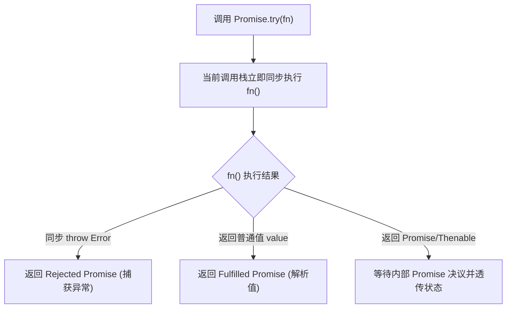
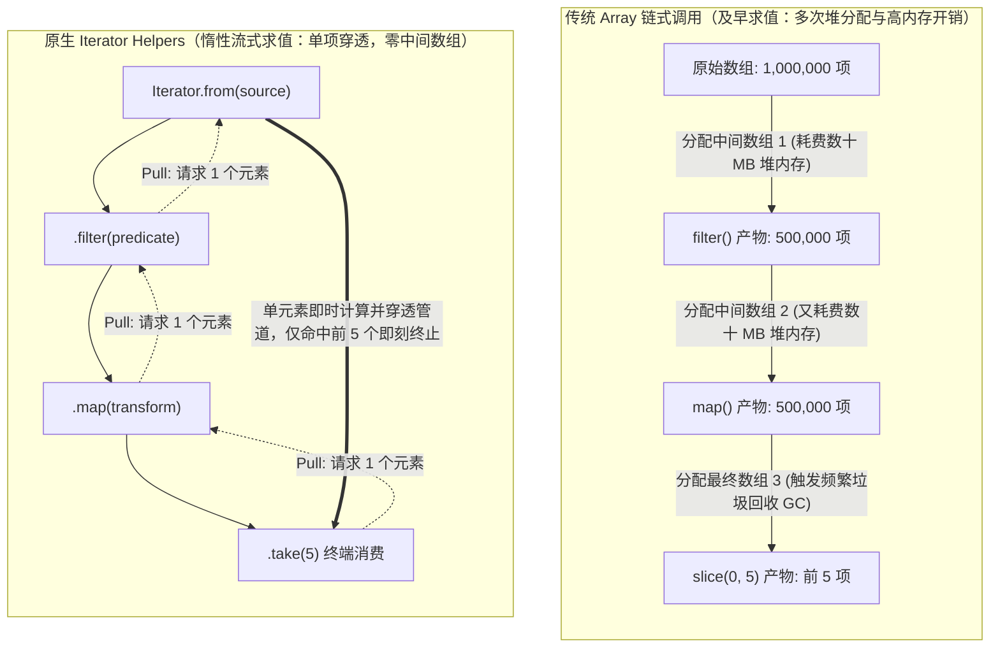
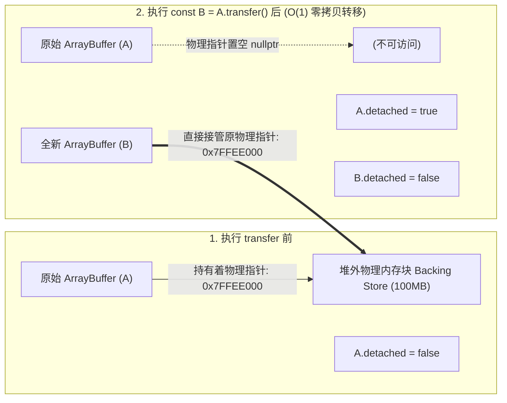
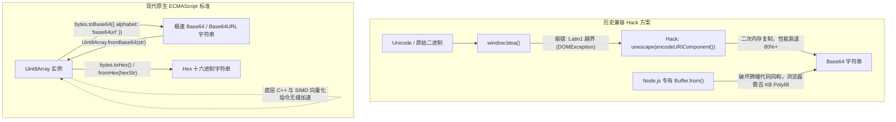
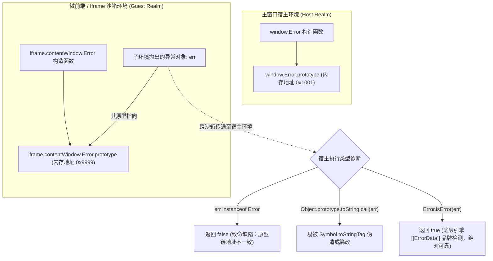
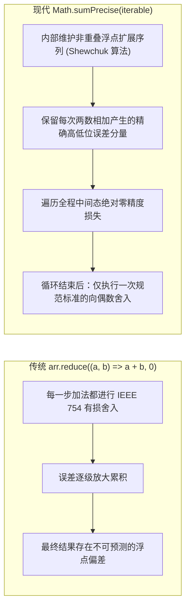
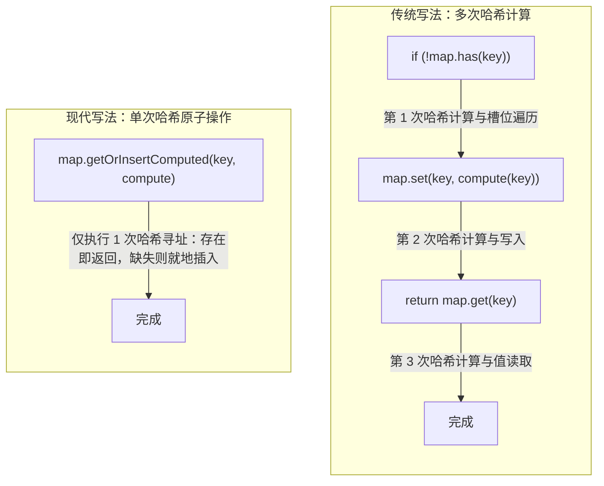
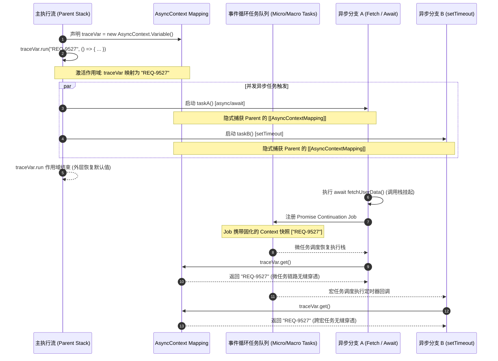
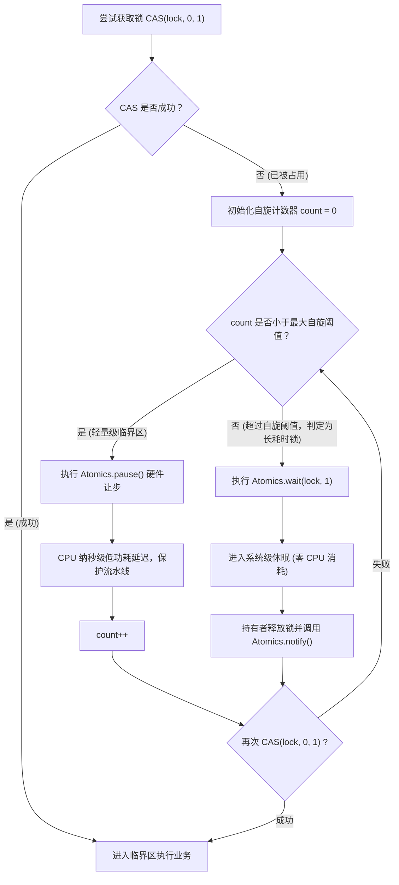
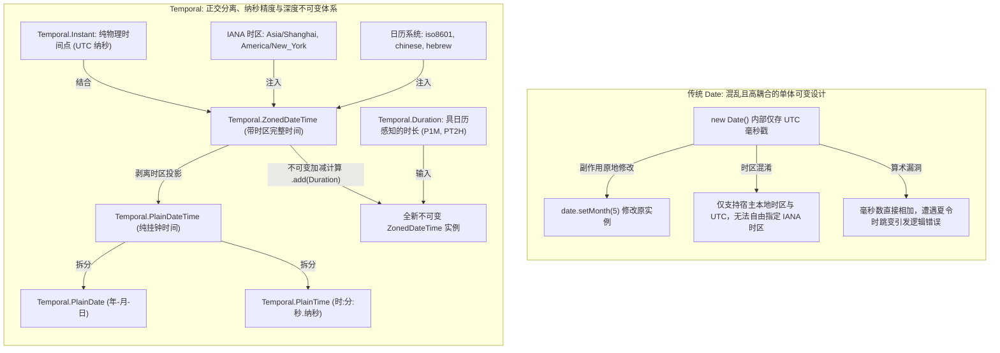

# 现代 ECMAScript 前沿特性 (ES2024 - ES2026)✅

本模块系统性梳理 ECMAScript 在 2024 至 2026 年间达成 Stage 4 并落地标准的工业级核心演进特性。重点涵盖异步控制与集合流式处理（Promise.try / withResolvers / Iterator Helpers / Set 集合代数）、底层二进制内存操作与零拷贝转移（ArrayBuffer.prototype.transfer / Uint8Array Base64-Hex / Float16Array），以及跨环境运行时诊断与高精度算术（Error.isError / Math.sumPrecise / Map.prototype.getOrInsert）。

---

## ECMAScript 2024-2026 核心前沿特性全景：Promise.try()、Promise.withResolvers()、原生 Iterator Helpers 与 Set 集合代数？ {#p0-es-modern-features}

<Answer>

### 核心结论

现代 ECMAScript 在异步编程范式与流式数据处理领域迎来了系统性升级，彻底终结了以往依赖用户态三方库或反模式（Userland Hacks）的历史痛点：
- **`Promise.try()`**：实现“同步立即求值 + 异常统一提升为 Rejected Promise”，抹平了高阶函数中同步抛错与异步拒绝的处理鸿沟，既能安全包裹可能同步报错的代码，又避免了 `Promise.resolve().then(fn)` 额外引入的微任务入队延迟。
- **`Promise.withResolvers()`**：将传统 `new Promise((resolve, reject) => ...)` 的闭包执行器反转（Inversion of Control），直接解耦为包含 `{ promise, resolve, reject }` 的独立控制三元组对象，彻底根除可变外部变量捕获的样板代码。
- **原生 Iterator Helpers**：为 `Iterator.prototype` 引入 `.map()`, `.filter()`, `.take()`, `.drop()`, `.flatMap()` 等流式管道算子，提供基于 Pull 机制的惰性流式计算（Lazy Stream Evaluation），杜绝了数组链式调用创建大量中间临时数组的内存与 GC 损耗，空间复杂度从 $O(N)$ 锐降至 $O(1)$，并原生支持无限序列。
- **Set 原生集合代数**：规范新增 `union()`, `intersection()`, `difference()`, `symmetricDifference()`, `isSubsetOf()`, `isSupersetOf()`, `isDisjointFrom()` 七大原子化集合运算方法，支持任意符合 Set-like 协议的对象，引擎底层自动选择规模较小的集合进行遍历优化，算法复杂度达到最优。

---

### 原理解析

#### 1. Promise.try() 的双重保障与即时调度机制

在处理可能返回普通值、也可能返回 Promise、甚至可能在执行前置校验时同步抛出异常的未知函数（如第三方插件或用户回调）时，以往通常存在以下两种模式：

| 调用模式 | 同步异常处理 | 首次执行时序 | 评价与缺陷 |
| :--- | :--- | :--- | :--- |
| `Promise.resolve().then(fn)` | 被 catch 捕获 | **延迟到微任务** | 无法立即同步启动代码，破坏同步初始化的执行顺序 |
| `new Promise(r => r(fn()))` | 被 catch 捕获 | **当前调用栈同步执行** | 语法繁琐冗长，闭包可读性差，类型推断易受干扰 |
| **`Promise.try(fn, ...args)`** | **被 catch 捕获** | **当前调用栈同步执行** | **最佳实践**：兼具同步立即调用的确定性与全链路异步错误捕获 |



`Promise.try` 的核心价值在于建立**统一调用入口**，它保证在当前 Tick 立即执行传入函数体，一旦该函数同步抛出 `throw new Error()`，引擎会自动拦截该调用栈异常并将其提升为 Rejected Promise，防止同步调用栈崩溃中断外层代码。

#### 2. Promise.withResolvers() 的状态控制解耦

在实现超时竞态、任务队列（Job Queue）、流式通道缓冲区以及基于事件的异步等待时，开发者此前必须依赖“延迟对象（Deferred Pattern）”的闭包技巧：

```typescript
// 传统历史写法：样板冗余，需要外部变量暂存与非空断言
let resolve!: (value: string) => void;
let reject!: (reason?: unknown) => void;
const promise = new Promise<string>((res, rej) => {
  resolve = res;
  reject = rej;
});
```

`Promise.withResolvers()` 规范由引擎在 C++ 底层调用 Promise 构造函数并拦截执行器参数，直接返回具有强类型签名的 `{ promise, resolve, reject }` 普通对象：
1. **解耦状态变更能力**：`resolve` 与 `reject` 成为第一公民函数，能够自由注入事件监听器、工作线程消息回调或取消令牌中。
2. **生命周期分离**：只暴露 `promise` 给调用方以维持单向只读契约，由内部持有 `resolve` 触发控制。

#### 3. 原生 Iterator Helpers 惰性迭代管道 vs 数组及早求值

传统 JavaScript 对集合处理严重依赖 `Array.prototype` 上的高阶函数。数组方法采用**及早求值（Eager Evaluation）**模型：每调用一次 `.map()` 或 `.filter()`，V8 引擎都必须在堆内存中完整分配一个新的连续数组，并将全量计算结果写入其中。

当数据规模达到几十万项或在移动端低内存环境中，频繁的多阶段链式调用会触发严重的内存激增与 GC Stop-The-World（STW）停顿。



`Iterator Helpers` 引入的标准方法包含：
- **流式变换**：`.map(mapper)`、`.filter(predicate)`、`.flatMap(mapper)`
- **流式截断与切片**：`.take(limit)`、`.drop(limit)`
- **终端消费与聚合**：`.reduce(reducer, initial)`、`.toArray()`、`.forEach(fn)`、`.some(fn)`、`.every(fn)`、`.find(fn)`
- **提升工厂**：`Iterator.from(iterable)`，可将任意原生 `Set`、`Map`、生成器（Generator）或自定义 Iterable 包装为标准 Iterator Helper 实例。

惰性管道遵循 **Pull 机制**：终端方法每请求一次 `.next()`，数据才从源头拉取一个元素穿透整条流水线；一旦满足条件（如 `.take(5)` 达到上限），上游迭代器立即停止拉取并调用可选的 `.return()` 清理资源，达到真正的 **$O(1)$ 中间辅助空间复杂度**。

#### 4. Set 集合代数规范方法与 Set-like 协议

以往计算集合运算需要借助 `[...setA].filter(x => setB.has(x))` 等黑魔法，经过“Set 到 Array 再回 Set”的多次解构和哈希重建，耗时且增加无谓内存。

现代标准提供了 7 个原生数学集合方法：
1. **`setA.union(setB)`**：并集 $A \cup B$。
2. **`setA.intersection(setB)`**：交集 $A \cap B$。
3. **`setA.difference(setB)`**：差集 $A \setminus B$（属于 A 但不属于 B 的元素）。
4. **`setA.symmetricDifference(setB)`**：对称差集 $A \triangle B$（属于 A 或 B 但不同时属于两者的元素）。
5. **`setA.isSubsetOf(setB)`**：子集判定 $A \subseteq B$。
6. **`setA.isSupersetOf(setB)`**：超集判定 $A \supseteq B$。
7. **`setA.isDisjointFrom(setB)`**：互斥判定 $A \cap B = \emptyset$。

**性能优化与 Set-like 协议**：
所有方法入参不仅限于原生 `Set` 实例，任何具有 `size` 属性以及 `has()` 和 `keys()` 方法的对象（如自定义布隆过滤器、只读视图）均可作为入参。引擎内部会对较小集合进行遍历：例如在计算 `intersection` 时，若 `setA.size > setB.size`，算法内部会自动遍历较小的 `setB` 并查询 `setA.has()`，保证运算效率达到最优。

---

### 规范 TypeScript / JavaScript 代码实现

#### 1. 混合同步/异步 SDK 统一错误边界 (Promise.try)

```typescript
// 安全包裹未知插件/用户配置，统一生命周期
interface PluginConfig {
  setup: () => void | Promise<void>;
  name: string;
}

export async function bootstrapPlugin(plugin: PluginConfig): Promise<{ success: boolean; name: string }> {
  // Promise.try 同步执行 plugin.setup()
  // 若 setup() 内同步 throw new Error('Invalid config')，自动转化为 Rejected Promise
  // 若 setup() 返回一个挂起的 Promise，则等待其决议
  return Promise.try(() => plugin.setup())
    .then(() => {
      return { success: true, name: plugin.name };
    })
    .catch((err: unknown) => {
      const message = err instanceof Error ? err.message : String(err);
      console.error('插件 [' + plugin.name + '] 初始化失败:', message);
      return { success: false, name: plugin.name };
    });
}
```

#### 2. 解耦超时竞态与事件通道缓冲 (Promise.withResolvers)

```typescript
// 基于 withResolvers 构建可取消、支持外部决议的异步任务控制单元
export class AsyncDeferredTask<T> {
  public readonly promise: Promise<T>;
  public readonly resolve: (value: T | PromiseLike<T>) => void;
  public readonly reject: (reason?: unknown) => void;
  private timer: ReturnType<typeof setTimeout> | null = null;

  constructor(timeoutMs?: number) {
    const { promise, resolve, reject } = Promise.withResolvers<T>();
    this.promise = promise;
    this.resolve = resolve;
    this.reject = reject;

    if (timeoutMs !== undefined && timeoutMs > 0) {
      this.timer = setTimeout(() => {
        this.reject(new Error('任务在等待 ' + timeoutMs + 'ms 后超时'));
      }, timeoutMs);
    }
  }

  public complete(value: T): void {
    if (this.timer) clearTimeout(this.timer);
    this.resolve(value);
  }

  public fail(err: unknown): void {
    if (this.timer) clearTimeout(this.timer);
    this.reject(err);
  }
}
```

#### 3. 大数据流式惰性管道计算 (Iterator Helpers)

```typescript
// 模拟无限数字序列生成器
function* naturalNumbers(): Generator<number, void, unknown> {
  let n = 1;
  while (true) {
    yield n++;
  }
}

// 基于 Iterator Helpers 构建低内存流式分析管道
export function computeTopEvenSquares(): number[] {
  // Iterator.from 可包装生成器或任何可迭代对象
  return Iterator.from(naturalNumbers())
    .filter((x: number) => x % 2 === 0)   // 仅过滤偶数
    .map((x: number) => x * x)            // 计算平方
    .drop(10)                             // 跳过前 10 个命中项
    .take(5)                              // 截取接下来 5 项后立即终止流
    .toArray();                           // 终端求值：输出结果数组
}

// 实际执行仅拉取并运算了前 30 个自然数，无额外中间数组开销
```

#### 4. 基于原生 Set 集合代数的细粒度权限校验系统

```typescript
type Permission = 'read' | 'write' | 'delete' | 'audit' | 'export';

export class RBACEngine {
  // 用户拥有的权限集合
  private userPermissions: Set<Permission>;

  constructor(permissions: Iterable<Permission>) {
    this.userPermissions = new Set(permissions);
  }

  // 校验用户是否满足执行目标操作的所有必需权限 (子集判定)
  public hasAllPermissions(required: Set<Permission>): boolean {
    return required.isSubsetOf(this.userPermissions);
  }

  // 计算多角色叠加合并后的最终有效权限 (并集)
  public static mergeRoles(roleA: Set<Permission>, roleB: Set<Permission>): Set<Permission> {
    return roleA.union(roleB);
  }

  // 获取用户缺失的权限清单 (差集)
  public getMissingPermissions(required: Set<Permission>): Set<Permission> {
    return required.difference(this.userPermissions);
  }

  // 审计分析：找出两个权限版本间的变更点 (对称差集：新增或删除的权限)
  public static auditDiff(prev: Set<Permission>, next: Set<Permission>): Set<Permission> {
    return prev.symmetricDifference(next);
  }
}
```

---

### 面试官视角

- **核心考察点**：
  1. 能否从 JavaScript 语言规范与底层事件循环时序（Microtask 队列入队时机）讲透 `Promise.try` 与 `Promise.resolve().then` 的根本差异；
  2. 理解“控制反转（IoC）”在异步控制中的意义，以及 `Promise.withResolvers` 如何消除样板闭包；
  3. 对比“及早求值（Eager）”与“惰性流（Lazy Pull）”在内存拓扑、中间分配与 GC 压力上的本质区别；
  4. 掌握 Set 集合运算的时间复杂度优化原理及 Set-like 鸭子类型的规范契约。
- **加分项**：
  - 指出 `Iterator Helpers` 在执行 `.take(n)` 完成后，会调用底层迭代器的 `.return()` 方法（如果存在），以此确保文件句柄、数据库游标或网络流连接等底层资源得到确定性关闭；
  - 阐述原生 Set 运算与旧版解构（`[...set]`）在内存占用方面的巨大优势，能够说出引擎对于尺寸不平衡集合（如 10 元素集合交集 100 万元素集合）的自动遍历优化策略。
- **下探追问链**：
  - *追问 1*：为什么说 `Promise.resolve().then(fn)` 无法完全替代 `Promise.try(fn)`？在哪些真实工程场景下这种微任务时序差异会导致严重的 Bug？
    - *回答要点*：若 `fn` 内部包含对调用时刻敏感的操作（如记录精确性能打点 `performance.now()`、检查当前 DOM 焦点状态、或者与同步执行的宿主流程进行强时序校验），`Promise.resolve().then` 会将 `fn` 的执行延后至下一个微任务周期。此时外部的同步代码已经执行完毕，执行环境可能已发生变更；而 `Promise.try(fn)` 确保了 `fn` 的同步部分立即在当前调用栈原位执行。
  - *追问 2*：原生 `Iterator Helpers` 与 RxJS / Lodash 的流处理库相比，核心差异是什么？它能替代 RxJS 吗？
    - *回答要点*：不能完全替代。原生 `Iterator Helpers` 基于同步/异步迭代器协议，是**拉取模型（Pull-based）**，适用于确定性序列、分页数据、数据分析管道等按需拉取场景；而 RxJS 是基于观察者模式的**推送模型（Push-based）**，核心能力在于处理随时间推移由外部主动触发的异步离散事件流（如 UI 连续输入防抖、WebSocket 消息路由、多事件时间窗口合并等）。两者定位互补。
  - *追问 3*：原生 Set 集合运算对于对象的比较，是按值比较还是按引用比较？
    - *回答要点*：沿用 JavaScript 原生 Set 的 `SameValueZero` 算法，对对象类型一律基于引用比较，不进行深度属性相等性对比；对 `NaN` 与 `NaN` 视为相等，`+0` 与 `-0` 视为相等。

---

### 延伸阅读

- [TC39 Proposal: Promise.try](https://github.com/tc39/proposal-promise-try)（Stage 4）
- [TC39 Proposal: Promise.withResolvers](https://github.com/tc39/proposal-promise-with-resolvers)（Stage 4, ES2024）
- [TC39 Proposal: Iterator Helpers](https://github.com/tc39/proposal-iterator-helpers)（Stage 4, ES2025）
- [TC39 Proposal: New Set Methods](https://github.com/tc39/proposal-set-methods)（Stage 4, ES2025）

</Answer>

---

## JavaScript 底层二进制与内存操作演化：ArrayBuffer.prototype.transfer() 零拷贝转移、Uint8Array 原生 Base64/Hex 编解码与 Float16Array？ {#p0-js-binary-memory-transfer}

<Answer>

### 核心结论

现代 ECMAScript 正在经历从“纯高级抽象脚本”向“系统级低开销内存操控与硬件异构加速语言”的深刻演化：
- **`ArrayBuffer.prototype.transfer()` 与 `transferToFixedLength()`**：正式确立了原子级的内存所有权转移（Ownership Transfer）与原地扩缩容机制。转移后原 ArrayBuffer 瞬间处于 Detached（已分离）状态，其底层物理内存驻留块（Backing Store）指针直接移交新对象。将过去需要分配新空间并逐字节深拷贝的 $O(N)$ 耗时与双倍瞬时内存峰值，降为真正的 **$O(1)$ 指针级零拷贝移动**。
- **Uint8Array 原生 Base64 / Hex 编解码**：新增 `Uint8Array.fromBase64()`、`bytes.toBase64()`、`Uint8Array.fromHex()` 与 `bytes.toHex()`。终结了历史遗留方案依赖 `btoa`/`atob` 的 Latin1 乱码与性能瓶颈，摆脱了 Node.js 专有 `Buffer` 造成的生态割裂，由底层 C++ 与 SIMD 向量化指令直接加速。
- **`Float16Array`**：引入遵循 IEEE 754-2008 的 16 位半精度浮点 TypedArray，单元素仅占 2 字节（相比 `Float32Array` 的 4 字节节省 50% 内存）。在 WebGPU（WGSL `f16`）图形管线通信与端侧大模型推理（WebLLM、ONNX Runtime Web）中，直接将显存占用与总线传输带宽减半，有效规避移动端 32 位堆内存上限与 OOM。

---

### 原理解析

#### 1. ArrayBuffer 内存所有权模型与 DetachedBuffer 状态

在 V8 或 JavaScriptCore 等现代引擎内部，一个 `ArrayBuffer` 由两部分组成：
1. **JS 封装对象（Wrapper Object）**：位于 V8 堆内的小型对象头，记录 byteLength、配置标记以及指向堆外真实内存的指针。
2. **底层支撑存储区（Backing Store）**：由操作系统的虚拟内存分配器（如 `malloc` / `mmap`）在堆外分配的连续物理字节块。



**传统深拷贝 vs `transfer()` 底层性能与内存机制对比**：

| 对比维度 | 传统深拷贝 (`slice` + `set`) | 原生 `transfer()` 零拷贝 |
| :--- | :--- | :--- |
| **底层实现机制** | `malloc` 新建完全相同的内存块，执行 `memcpy` 逐字节物理搬运 | 复用原 `BackingStore`，仅转移所有权指针；或调用系统级 `realloc` |
| **时间复杂度** | $O(N)$（随 Buffer 容量线性增长，数百 MB 数据产生秒级卡顿） | **$O(1)$**（微秒级完成指针移交） |
| **内存峰值（High Water Mark）** | **200%**（原数据与新分配数据同时驻留，极易诱发 OOM 崩溃） | **100%**（无额外物理内存瞬时膨胀） |
| **原 Buffer 状态** | 依然存活，继续持有原内存，需等待 V8 垃圾回收垃圾标记 | **立即进入 Detached 状态**，原内存指针被置为 `nullptr` |

**Detached 状态安全检查**：
- 规范提供了 `buffer.detached` 只读布尔属性（ES2024）。
- 一旦 ArrayBuffer 变为 Detached，任何尝试通过其派生的 TypedArray（如 `Uint8Array`）或 `DataView` 读取或写入索引的操作，均会立即抛出不可捕获的规范级 `TypeError: Cannot perform ... on a detached ArrayBuffer`，杜绝了 C/C++ 中典型的“释放后使用（Use-After-Free）”安全漏洞。

#### 2. Uint8Array 原生 Base64 / Hex 编解码的技术代差

在 Web 开发中，二进制数据（图片、加密哈希、文件分片、WebAuthn 凭证）与文本传输格式之间的序列化极其频繁。历史演进过程中的方案存在诸多硬伤：



原生方法的规范优势：
1. **跨运行时完全同构**：浏览器、Node.js 22+、Deno、Bun、Cloudflare Workers 全平台统一。
2. **规范级选项支持**：
   - `alphabet: 'base64' | 'base64url'`：原生支持无缝切换 URL 安全字符集（将 `+` 和 `/` 替换为 `-` 和 `_`）。
   - `omitPadding: true`：直接省略末尾的 `=` 填充符，契合现代 JWT 与 WebAuthn 标准。
   - `lastChunkHandling: 'loose' | 'strict' | 'stop-before-partial'`：严格校验尾部填充有效性。
3. **SIMD 硬件加速**：各大引擎直接在底层挂载 AVX2 / NEON 向量指令集，吞吐速率比纯 JS 实现提升数倍至数十倍。

#### 3. Float16Array 在图形学与端侧 AI 的工程价值

`Float16Array` 遵循 IEEE 754-2008 标准的半精度浮点格式（16-bit Floating Point）：
- **1 位符号位 (Sign)**
- **5 位指数位 (Exponent)**，偏移量（Bias）为 15
- **10 位尾数/有效数字位 (Mantissa)**

```txt
 15  14          10 9                               0
+---+--------------+---------------------------------+
| S |   Exponent   |            Mantissa             |
+---+--------------+---------------------------------+
 1位       5位                       10位
```

**与 Float32Array 的工业指标对照**：

| 指标 | Float16Array | Float32Array |
| :--- | :--- | :--- |
| **单元素字节开销** | **2 Bytes (16 bits)** | 4 Bytes (32 bits) |
| **有效十进制精度** | 约 3 ~ 4 位有效数字 | 约 7 ~ 8 位有效数字 |
| **绝对值数值范围** | 约 `$6.10 \times 10^{-5}$` 至 65504 | 约 `$1.18 \times 10^{-38}$` 至 `$3.40 \times 10^{38}$` |
| **典型显存/内存带宽占用** | **基线 50%（直接节省一半显存）** | 基线 100% |

**工程落地场景**：
1. **端侧大模型推理（WebLLM / Transformers.js / ONNX Runtime Web）**：神经网络权重矩阵通常可在 FP16 下无损运行。将模型权重以 `Float16Array` 直接加载，一个原本在 FP32 下需占用 4GB 内存的模型，直接压缩至 2GB，打破浏览器标签页 4GB 虚拟内存的绝对物理限制。
2. **WebGPU 管线通信（WGSL `f16` 扩展）**：在 GPU 着色器启用 `enable f16;` 时，CPU 端直接构建 `Float16Array` 并通过 `device.queue.writeBuffer()` 上传至 GPU 缓冲区，PCIe 总线数据传输耗时直接减半，帧率稳定性大幅提升。

---

### 规范 TypeScript / JavaScript 代码实现

#### 1. 零内存膨胀的动态扩容字节缓冲区 (ArrayBuffer.transfer)

```typescript
// 实现一个类似系统级 ArrayList 的高性能动态字节扩容容器
export class FastDynamicByteBuffer {
  private buffer: ArrayBuffer;
  private length: number = 0;

  constructor(initialCapacity: number = 1024) {
    this.buffer = new ArrayBuffer(initialCapacity);
  }

  public append(data: Uint8Array): void {
    const requiredCapacity = this.length + data.byteLength;

    // 当现有容量不足时，进行扩容
    if (requiredCapacity > this.buffer.byteLength) {
      // 采用 2 倍扩容策略
      const newCapacity = Math.max(this.buffer.byteLength * 2, requiredCapacity);

      // 原生 transfer 零拷贝：底噪不变，直接在堆外移交或扩展内存块指针
      // 旧 this.buffer 自动 Detached，杜绝悬挂引用
      this.buffer = this.buffer.transfer(newCapacity);
    }

    // 写入新数据
    const view = new Uint8Array(this.buffer);
    view.set(data, this.length);
    this.length += data.byteLength;
  }

  // 收缩至实际使用尺寸，释放闲置内存
  public trimToFit(): Uint8Array {
    if (this.buffer.byteLength !== this.length) {
      this.buffer = this.buffer.transfer(this.length);
    }
    return new Uint8Array(this.buffer);
  }

  public get isDetached(): boolean {
    return this.buffer.detached;
  }
}
```

#### 2. 跨平台标准 JWT 签名与安全哈希解析 (Uint8Array Base64/Hex)

```typescript
// 使用原生 Base64URL 与 Hex API 解析与验证数据包
export interface JWTParts {
  header: Record<string, unknown>;
  payload: Record<string, unknown>;
  rawSignature: Uint8Array;
}

export function parseAndAuditJWT(jwtString: string): JWTParts {
  const parts = jwtString.split('.');
  if (parts.length !== 3) {
    throw new Error('非法 JWT 格式');
  }

  const [headerB64, payloadB64, signatureB64] = parts;

  // 使用原生 Uint8Array.fromBase64 直接按 base64url 解码为二进制字节
  const headerBytes = Uint8Array.fromBase64(headerB64, { alphabet: 'base64url' });
  const payloadBytes = Uint8Array.fromBase64(payloadB64, { alphabet: 'base64url' });
  const signatureBytes = Uint8Array.fromBase64(signatureB64, { alphabet: 'base64url' });

  // 跨平台文本解码
  const decoder = new TextDecoder();
  const header = JSON.parse(decoder.decode(headerBytes));
  const payload = JSON.parse(decoder.decode(payloadBytes));

  // 输出可供安全审计的 Hex 字符串，完全不依赖 Node.js Buffer
  console.log('签名特征 Hex:', signatureBytes.toHex());

  return {
    header,
    payload,
    rawSignature: signatureBytes
  };
}
```

#### 3. 端侧 AI / WebGPU 权重高密度装载管线 (Float16Array)

```typescript
// 演示在端侧大模型加载中，使用 Float16Array 减半内存传输
export function createWebGPUWeightBuffer(
  device: GPUDevice,
  rawWeightsFloat16: Float16Array
): GPUBuffer {
  // 分配 WebGPU 缓冲区，尺寸精确匹配 Float16 紧凑字节数
  const weightBuffer = device.createBuffer({
    size: rawWeightsFloat16.byteLength,
    usage: GPUBufferUsage.STORAGE | GPUBufferUsage.COPY_DST,
  });

  // 直接将 16 位半精度浮点数据推送至 GPU 显存
  // 传输数据量比传统 Float32 减少整整 50%
  device.queue.writeBuffer(
    weightBuffer,
    0,
    rawWeightsFloat16.buffer,
    rawWeightsFloat16.byteOffset,
    rawWeightsFloat16.byteLength
  );

  return weightBuffer;
}
```

---

### 面试官视角

- **核心考察点**：
  1. 能否从操作系统虚拟内存（Virtual Memory）、堆外内存（Off-heap Backing Store）和 C++ 引擎架构视角，剖析 `ArrayBuffer.transfer` 如何做到真正的 $O(1)$ 零拷贝；
  2. 深刻理解 DetachedBuffer 状态存在的安全与内存防护意义，知道为什么原视图必须被强制失效；
  3. 能否清晰梳理 Web 平台处理 Base64 的技术演进史，说明原生 `Uint8Array` 编解码方法对跨端生态一体化的重要意义；
  4. 掌握 IEEE 754 半精度浮点（FP16）的存储格式，并能结合 WebGPU 与端侧 AI 场景解释其节约带宽与显存的核心价值。
- **加分项**：
  - 能够指出 `transferToFixedLength()` 的特殊应用场景：当将由 `new ArrayBuffer(len, { maxByteLength: maxLen })` 创建的 ResizableArrayBuffer（可调大小缓冲）锁定为不可调尺寸的固定物理缓冲区时使用；
  - 清楚解释 `buffer.transfer()` 在扩容时若底层依赖操作系统的 `mremap` / `VirtualAlloc`，可能就地扩展物理映射页，甚至完全无需移动虚拟基地址。
- **下探追问链**：
  - *追问 1*：Web Worker 间通信 `worker.postMessage(buffer, [buffer])` 也是转移所有权，这和同线程调用 `buffer.transfer()` 有何异同？
    - *回答要点*：两者底层机制完全共享相同的“Detached 原理”。`postMessage` 的转移列表（Transfer List）跨越两个独立的执行环境或线程，将原线程的 Backing Store 卸除并挂载给目标线程的 ArrayBuffer；而 `buffer.transfer()` 是在**同一个执行环境内**对内存所有权与容量进行生命周期管理，允许原位扩缩容、裁剪释放冗余内存。
  - *追问 2*：在什么场景下不能使用 `Float16Array` 替代 `Float32Array`？它的数值风险是什么？
    - *回答要点*：数值范围窄（最大值仅 65504，大于此值会直接发生数值溢出变为 `Infinity`；最小值仅约 `$6.1 \times 10^{-5}$`，容易发生下溢变为零）；有效精度仅 3 ~ 4 位有效数字。因此在金融金额核算、高精度物理仿真碰撞检测、需要极大动态范围的高光 HDR 图形着色中绝对不能使用，仅适用于容忍细微误差的神经网络权重和标准化渲染纹理。
  - *追问 3*：若 `Uint8Array.fromBase64` 传入含有非法字符（如换行符或非 Base64 字符）的字符串，默认行为是什么？如何调整控制策略？
    - *回答要点*：规范默认配置是严格模式（`alphabet: 'base64'`），遇到非法字符或错误填充会抛出 `SyntaxError`；但可通过传入 `{ lastChunkHandling: 'loose' }` 宽容模式来忽略尾部填充缺失，实现对不规范三方报文的弹性解析。

---

### 延伸阅读

- [TC39 Proposal: ArrayBuffer.prototype.transfer](https://github.com/tc39/proposal-arraybuffer-transfer)（Stage 4, ES2024）
- [TC39 Proposal: Uint8Array to/from base64 and hex](https://github.com/tc39/proposal-arraybuffer-base64)（Stage 4, ES2025）
- [TC39 Proposal: Float16Array](https://github.com/tc39/proposal-float16array)（Stage 4, ES2025）
- [MDN Web Docs: ArrayBuffer.prototype.transfer()](https://developer.mozilla.org/en-US/docs/Web/JavaScript/Reference/Global_Objects/ArrayBuffer/transfer)

</Answer>

---

## ECMAScript 跨环境诊断与高精度计算：Error.isError() 跨 Realm 判别机制与 Math.sumPrecise() 浮点累加？ {#p1-js-cross-realm-math}

<Answer>

### 核心结论

面对现代前端微前端隔离（Microfrontends）、Worker 多线程计算、ShadowRealm 安全沙箱以及严苛金融数据结算等复杂系统架构，ECMAScript 在语言标准层提供了精准的诊断与高精度算术基础：
- **`Error.isError()`**：语言级首个跨 Realm 错误判别标准方法（地位等同于 `Array.isArray()`）。彻底终结了以往在 `<iframe>`、Web Worker、ShadowRealm、Node.js `node:vm` 等隔离环境间通信时，传统 `instanceof Error` 必定失效的历史顽疾；且底层采用引擎内部插槽品牌检测（Brand Check），不受 `Symbol.toStringTag` 伪造或原型篡改影响。
- **`Math.sumPrecise()`**：基于浮点扩展与误差补偿机制（Shewchuk 任意精度浮点累加算法）的原生算术标准。彻底解决经典 IEEE 754 64 位浮点数在求和过程中误差扩散积累的问题（如 `0.1 + 0.2` 精度缺陷），以纯原生 $O(N)$ 复杂度实现“中间过程零精度损失，最终单一标准舍入（Round to nearest, ties to even）”，终结了在求和场景中为了精度不得不引入庞大外部 Decimal 库的困境。
- **`Map.prototype.getOrInsert()` 与 `getOrInsertComputed()`**：为 `Map` 带来原子级“查询或插入（Upsert）”语义。将以往由 `has`、`set`、`get` 组成的 2 到 3 次重复哈希计算压缩为**单次哈希寻址（Single Hash Lookup）**，并支持惰性回调求值，消除了样板代码与潜在的竞态条件。

---

### 原理解析

#### 1. 跨 Realm 判别困境与 Error.isError() 的底层机制

**何为 Realm（执行领域）？**
在 ECMAScript 规范中，一个 Realm 由一个独占的全局作用域（Global Scope）与一整套独立的固有内置对象原型系统（Intrinsics，如独立的 `Object.prototype`、`Array.prototype`、`Error.prototype`）构成。
浏览器中的子 `<iframe>`、Web Worker、ShadowRealm，以及 Node.js 的 `node:vm` 模块，都会各自实例化全新的独立 Realm。



**历史检测方案的缺陷分析**：
1. **`err instanceof Error` 彻底失效**：`instanceof` 运算符的本质是遍历对象的原型链，判断其是否存在 `HostError.prototype`。由于跨 Realm 对象的原型指向的是 `GuestError.prototype`（物理内存地址截然不同），计算结果恒为 `false`。这在微前端沙箱与全局错误监控 SDK 中经常引发“明明是 Error 却被当作普通对象丢弃”的严重缺陷。
2. **`Object.prototype.toString.call(err) === '[object Error]'` 易受伪造**：在 ES6 及以后，该方法会优先检查对象的 `[Symbol.toStringTag]`。恶意代码只需声明 `{ [Symbol.toStringTag]: 'Error' }` 即可假冒错误对象；反之，若继承自 Error 的自定义类重写了该属性，判别就会误判为 `false`。

**`Error.isError()` 内部规范机制**：
规范规定，引擎在实现 `Error.isError(value)` 时，直接检查参数对象内部是否存在内置专用插槽 **`[[ErrorData]]`**（Brand Check）。该插槽是在 `new Error()` 执行时由引擎在底层直接赋予的内部元数据，无法被用户态 JavaScript 注入、修改或伪造。无论该对象来自哪一个 Realm，判别均能在 $O(1)$ 时间内精准确立。

#### 2. Math.sumPrecise() 原理与浮点误差补偿机制

经典 IEEE 754 双精度浮点运算中，每个浮点数只有 53 位有效二进制精度（Significand）。在进行多数累加运算时（如 `0.1 + 0.2`），由于二进制无法精确表示十进制有限小数，低位会被无情截断。

在长序列（如上万笔交易记录金额或工程坐标点）顺序累加中，微小的截断误差会伴随对齐阶码的过程发生**级联扩散与吞没（Catastrophic Cancellation / Error Accumulation）**，最终导致结算金额出现分钱级的巨大偏差。



**`Math.sumPrecise` 算法工作流程**：
1. **惰性遍历序列**：接受任意可迭代对象，将其项逐个转换为 Number。
2. **无损误差分量吸收（Shewchuk 浮点扩展）**：内部维护一个增长型的高低位非重叠浮点数组。每次加入一个新数字时，利用类似于 `TwoSum` 的无损加法原理，计算出当前两数相加的近似和与其产生的微小精度损失差值，将这两部分精确存入扩展槽位中。
3. **最终单一归约舍入**：在所有元素消费完毕后，才将内部非重叠扩展序列压缩为一个 64 位双精度浮点数，并严格执行一次 **向最接近的偶数舍入（Round to nearest, ties to even）**。
4. **特殊值规范处理**：
   - 包含 `NaN` 时，直接返回 `NaN`；
   - 包含同号无穷大（如纯 `+Infinity`）时，返回 `+Infinity`；
   - 同时包含 `+Infinity` 与 `-Infinity` 时，返回 `NaN`；
   - 正确保持 `-0` 与 `+0` 的符号位。

#### 3. Map.prototype.getOrInsert / getOrInsertComputed 的原子化优化

经典的“查找并在缺失时插入”模式长期困扰着代码简洁度与运行时性能：



规范提供了两个变体：
- **`map.getOrInsert(key, defaultValue)`**：用于轻量级值（如基础字面量、默认空数组）。如果存在则直接返回；如果不存在，将 `defaultValue` 存入 Map 并返回。
- **`map.getOrInsertComputed(key, callbackFn)`**：用于计算成本高昂的对象（如复杂实例、解析 AST）。仅在 `key` 缺失时，才以惰性方式执行 `callbackFn(key)`，将返回值存入 Map 并返回。

核心工程收益：
1. **哈希查找性能直接翻倍**：将原先多次哈希散列计算与链表/红黑树寻址压缩为底层 C++ 级别的单次寻址。
2. **消除重复计算与竞态**：惰性回调杜绝了不必要的内存分配，避免在值已经存在时依然执行了昂贵的高开销计算。

---

### 规范 TypeScript / JavaScript 代码实现

#### 1. 微前端 / 沙箱环境统一安全错误分发中台 (Error.isError)

```typescript
// 模拟来自跨 Realm（iframe 或 Worker 沙箱）的数据包
export interface TelemetryPayload {
  sourceRealm: string;
  payload: unknown;
}

export class CrossRealmErrorInterceptor {
  // 生产级跨环境错误捕获与结构化解析
  public static processTelemetry(data: TelemetryPayload): {
    isErrorObject: boolean;
    name?: string;
    message?: string;
    stack?: string;
  } {
    const candidate = data.payload;

    // 使用原生 Error.isError() 进行规范级跨 Realm 判定
    // 即使 candidate 来自于其他 iframe、Worker 或 VM 上下文，依然精准返回 true
    if (Error.isError(candidate)) {
      return {
        isErrorObject: true,
        name: candidate.name,
        message: candidate.message,
        stack: candidate.stack,
      };
    }

    // 处理假冒的伪造错误对象（例如仅仅具备 { message: 'err' } 的普通对象）
    return {
      isErrorObject: false,
      message: typeof candidate === 'string' ? candidate : JSON.stringify(candidate),
    };
  }
}
```

#### 2. 金融级无累积误差结算系统 (Math.sumPrecise)

```typescript
// 模拟大量含有细微浮点误差的商品交易明细
const orderItems = [
  { name: '云服务实例小时费', amount: 0.1 },
  { name: '存储附加包', amount: 0.2 },
  { name: '弹性公网 IP', amount: 0.3 },
  { name: '流量包优惠抵扣', amount: -0.6 },
];

export function executeFinancialSettlement(): {
  traditionalReduce: number;
  preciseResult: number;
} {
  // 提取账单金额迭代序列
  const amounts = orderItems.map(item => item.amount);

  // 1. 传统 reduce 累加：存在经典的 IEEE 754 精度漂移
  const traditionalReduce = amounts.reduce((acc, curr) => acc + curr, 0);
  // 结果可能为 5.551115123125783e-17，而非精确的 0

  // 2. 原生 Math.sumPrecise 高精度无损累加
  // 规范算法在中间计算中完全不丢失精度，仅在最后一次性执行精确偶数舍入
  const preciseResult = Math.sumPrecise(amounts);
  // 结果精确为 0

  return {
    traditionalReduce,
    preciseResult,
  };
}
```

#### 3. 高并发资源池与请求单例缓存 (Map.prototype.getOrInsertComputed)

```typescript
// 基于 getOrInsertComputed 构建单次哈希寻址的高性能缓存池
export class AsyncResourcePool<K, V> {
  private cache = new Map<K, V>();

  // 获取或惰性创建资源
  public getOrCreate(key: K, factory: (key: K) => V): V {
    // 仅进行单次哈希查找
    // 若 key 存在，直接返回对应实例，绝不调用 factory
    // 若 key 缺失，就地执行 factory(key) 将返回值写入 Map 并返回
    return this.cache.getOrInsertComputed(key, factory);
  }

  // 获取分组列表：缺失时初始化空数组并就地追加
  public appendToGroup(key: K, item: V): void {
    const list = this.cache.getOrInsert(key, [] as unknown as V) as unknown as V[];
    list.push(item);
  }

  public get size(): number {
    return this.cache.size;
  }
}
```

---

### 面试官视角

- **核心考察点**：
  1. 能否从 ECMAScript 核心规范维度解释 Realm（执行领域）与 Execution Context 的架构定义，讲透为什么跨 Realm 会导致 `instanceof` 失效；
  2. 深入理解内部插槽（Internal Slot 如 `[[ErrorData]]`）与外部属性（如 `Symbol.toStringTag`）在安全性和防篡改维度的本质分野；
  3. 能否解释清楚 IEEE 754 双精度浮点数为什么会在连续加法中误差滚雪球，以及 `Math.sumPrecise` 所采用的 Shewchuk 误差补偿算法的设计思想；
  4. 明白哈希表寻址在热点循环下的性能开销，掌握 `getOrInsertComputed` 在降低散列计算次数与惰性求值层面的双重收益。
- **加分项**：
  - 能够列举出已支持跨 Realm 原生判别的三大家族成员：`Array.isArray()`、`Error.isError()` 以及 `Promise.resolve` 中对 Promise 内部插槽 `[[PromiseState]]` 的检测；
  - 能够指出 `Math.sumPrecise` 尽管在中间过程保持任意精度，但其**最终返回值仍然是一个 64 位浮点数（Number）**，若求和真实值超过了 Number 的最大安全范围（如大于 `$2^{53} - 1$`），依然需要配合 `BigInt` 或外部高精度 Arbitrary-precision 库使用。
- **下探追问链**：
  - *追问 1*：如果使用现有的纯 JavaScript 代码模拟 `Error.isError()` 的效果，该如何尽可能严密地实现？
    - *回答要点*：如果无法依赖原生 `Error.isError()`，最接近的健壮兼容方案是综合特征检查：首先判断参数必须是对象且非 null；其次检查 `Object.prototype.toString.call(val) === '[object Error]'`；再次为了防止 `Symbol.toStringTag` 伪造，应使用 `try...catch` 检查访问其核心属性（如 `name`、`message`）时的特征，或尝试调用 `Error.prototype.toString.call(val)` 是否正常执行而不抛出 TypeError。但任何纯用户态模拟都无法在规范层面百分之百达到内部插槽 `[[ErrorData]]` 的原生安全性。
  - *追问 2*：在 `Map.prototype.getOrInsertComputed(key, callback)` 执行期间，如果 `callback` 内部再次对同一个 `map` 递归调用了 `getOrInsertComputed` 且传入了相同的 `key`，会发生死循环还是异常？
    - *回答要点*：规范规定其行为是确定性的：在执行 `callback` 时，该 `key` 尚未正式写入完成。如果回调函数内部递归尝试对同一个 `key` 进行操作，会再次触发回调执行，从而导致最大调用栈溢出（`RangeError: Maximum call stack size exceeded`）。因此在编写惰性初始化逻辑时，必须杜绝循环递归依赖。
  - *追问 3*：`Math.sumPrecise` 在处理含有无限循环小数或无理数浮点时，会不会导致内存无限增长？
    - *回答要点*：不会。因为所有输入到 `Math.sumPrecise` 的项本身都已经是 JavaScript 的双精度浮点数（即都是分母为 2 的幂次方的有理二进分数）。有限个双精度浮点数相加，其精确和一定也是一个有限长度的二进分数。Shewchuk 算法中非重叠浮点扩展数组的项数上限是受到输入项数与双精度阶码跨度（最多几十个分量）严格约束的，内存开销为确定性的极低常数级别，计算完毕后立即释放。

---

### 延伸阅读

- [TC39 Proposal: Error.isError](https://github.com/tc39/proposal-is-error)（Stage 4, ES2025）
- [TC39 Proposal: Math.sumPrecise](https://github.com/tc39/proposal-math-sum)（Stage 4, ES2025）
- [TC39 Proposal: Map.prototype.getOrInsert](https://github.com/tc39/proposal-upsert)（Stage 3 / 4, ES2025）
- [Jonathan Richard Shewchuk: Adaptive Precision Floating-Point Arithmetic and Fast Robust Geometric Predicates](https://people.eecs.berkeley.edu/~jrs/papers/robustr.pdf)

</Answer>

---

## ECMAScript 跨异步调用栈上下文隐式传递：AsyncContext 原理机制（Zone.js 终结者）与 Atomics.pause() 原语？ {#p0-es-async-context-atomics}

<Answer>

### 核心结论

在现代高性能分布式微服务与复杂单页应用中，异步执行流跨越宏任务、微任务及 `await` 恢复点时的“上下文隐式延续”与“多线程共享内存并发同步”是底层运行时的两大核心诉求：
- **`AsyncContext`（异步上下文传播）**：ECMAScript 官方提供的语言级上下文隐式透传机制，包含 `AsyncContext.Variable`（上下文变量定义与作用域绑定）与 `AsyncContext.Snapshot`（上下文快照捕获与重放）。它通过在引擎内部执行上下文（Execution Context）与 Job Callback 中引入隐式映射，彻底终结了以往依赖 Zone.js 暴力猴子补丁（Monkey Patching）所导致的运行时退化与原型污染，跨平台（浏览器、Node.js、Deno、Bun、Edge Workers）统一了类似 Node.js `AsyncLocalStorage` 的全链路追踪（TraceId/SpanId）、用户会话穿透与并发上下文隔离能力。
- **`Atomics.pause()`（CPU 自旋节能与指令级让步）**：在 SharedArrayBuffer 多 Worker 共享内存高并发场景中，为用户态自旋锁（Spinlock）提供了直接映射底层 CPU 硬件指令（x86 `PAUSE`、ARM `YIELD`、RISC-V `PAUSE`）的原语。它在不引发 `Atomics.wait()` 内核级上下文切换沉重开销的前提下，避免了忙等（Busy Loop）造成的 CPU 核心 100% 满载高耗电发热，并消除了现代超标量乱序执行 CPU 上的内存流水线推测违规清空（Pipeline Stall）惩罚，是实现超低延迟自适应混合锁的核心基石。

---

### 原理解析

#### 1. 异步调用栈上下文断裂的本质与传统方案困境

JavaScript 的运行基石是“单线程事件循环（Event Loop）+ 调用栈（Call Stack）+ 任务队列（Task/Microtask Queue）”。在同步代码执行时，函数的执行上下文严格遵循栈帧（Stack Frame）的推入与弹出，局部变量与作用域链得以完整保持。

然而，一旦进入异步边界（如 `setTimeout`、`Promise.then`、`await`、`fetch`、事件监听）：
1. 当前同步调用栈执行完毕后被完全清空并退回事件循环；
2. 异步回调被包装为微任务或宏任务进入调度队列；
3. 当事件循环重新取出并调度该任务时，一个全新的物理调用栈被创建。

这种物理调用栈的断裂，导致传统多线程模型中的“线程局部存储（Thread Local Storage, TLS）”在 JavaScript 中直接失效。若要在全链路中传递日志 `TraceId`、请求租户上下文或当前用户会话，开发者面临两难抉择：
- **显式参数传递（Prop Drilling）**：在调用链路上的每一个函数、每一个工具类方法中强行增加 `context` 参数。这不仅严重污染业务接口签名，而且面对第三方开源库或不可控框架层代码时完全无能为力。
- **Zone.js 暴力猴子补丁（Monkey Patching）**：Angular 早期采用的解决方案。Zone.js 在页面初始化时强行重写浏览器全部异步 API（包括 `setTimeout`、`Promise`、`EventTarget.prototype.addEventListener`、`fetch` 等近百个原生原型方法）。

##### Zone.js 猴子补丁方案的致命缺陷：
1. **破坏引擎底层优化**：重写全局 `window.Promise` 会导致 V8 引擎精心优化的 Promise Fast-Path（内联缓存与 C++ 快速路径）完全失效，使原生 `async/await` 的执行吞吐大幅下跌数倍；
2. **全局作用域污染与生态冲突**：篡改全局原型导致三方库、WebAssembly、原生 ESM 模块行为难以预测，且根本无法拦截底层宿主环境或 C++ 模块直接触发的内部异步微任务；
3. **内存泄漏隐患**：为了维持父子 Zone 的闭包链条，Zone.js 会在全局保留大量长时间无法被 GC 回收的强引用。

| 评估维度 | 传统参数显式透传 (Prop Drilling) | Zone.js 猴子补丁 (Angular) | Node.js AsyncLocalStorage | **ECMAScript AsyncContext** |
| :--- | :--- | :--- | :--- | :--- |
| **侵入性** | 极高（污染所有函数签名） | 极高（全局重写近百种原生 API） | 无侵入（基于内部 async_hooks） | **完全零侵入（引擎原生语言级标准）** |
| **性能损耗** | 零引擎损耗，但开发心智成本高 | 极大（破坏 V8 Promise fast-path） | 中等（早期 hook 存在 GC 损耗） | **极低（引擎内联 C++ 优化、零猴子补丁）** |
| **跨环境通用** | 全环境通用 | 仅部分浏览器与 Node 前端支持 | 仅限 Node.js 与部分服务端运行时 | **全环境统一标准（Browser/Worker/Node/Edge）** |
| **与原生 async/await 兼容** | 良好 | 存在底层冲突与边界断裂漏洞 | 良好 | **原生天衣无缝集成** |

#### 2. AsyncContext 核心架构：Variable 与 Snapshot

TC39 `proposal-async-context` 规范通过两个核心类构筑了完整的上下文传播体系：

##### (1) AsyncContext.Variable
`AsyncContext.Variable` 用于声明一个可跨越异步调用链的隐式上下文变量。它具备以下生命周期特征：
- **`variable.run(value, fn, ...args)`**：在 `fn` 的同步以及所有由它派生的异步执行作用域内，将当前变量的值绑定为 `value`。当 `fn` 返回的 Promise 决议完毕后，该绑定关系自动解绑，不影响外层上下文。
- **`variable.get()`**：随时读取当前正在执行的代码所处的隐式上下文值。若当前未处于任何 `.run()` 作用域内，则返回初始化时设定的 `defaultValue`。

##### (2) AsyncContext.Snapshot
在事件总线（Event Bus）、消息队列、连接池等“生产者-消费者”解耦场景中，任务的触发点与执行点在时间与调用流上完全分离。
`AsyncContext.Snapshot` 提供了**显式快照捕获与重放**能力：
- `const snapshot = new AsyncContext.Snapshot();`：在任务创建或分发时刻，完整捕获当前线程所激活的全部 `AsyncContext.Variable` 映射状态；
- `snapshot.run(callback, ...args)`：在任务被异步消费或跨 Worker 回调执行时，将保存的快照恢复到当前调用栈中，使回调函数能够“穿越时空”无缝读取原始的上下文环境。

#### 3. ECMAScript 引擎底层机制：[[AsyncContextMapping]] 与 Job 传播

在规范底层，ECMAScript 为每个执行上下文（Execution Context）与作业回调（Job Callback）增加了内部插槽：
- `[[AsyncContextMapping]]`：一个逻辑上的不可变持久化字典（Persistent Map-like Structure），存储着当前所有激活变量的 Key-Value 映射。

每当发生以下异步边界操作时，引擎自动执行上下文传递：
1. **Promise 实例化与链式调用**：在调用 `.then(onFulfilled, onRejected)` 时，规范内部会触发 `HostMakeJobCallback`，自动将当前的 `[[AsyncContextMapping]]` 打包入 Promise Reaction Job；
2. **Await 表达式暂停与恢复**：当执行 `await promise` 挂起时，当前异步函数的执行状态记录当前的 `[[AsyncContextMapping]]`；当 Promise 决议且微任务调度该异步函数继续执行时，引擎自动恢复该上下文映射；
3. **分叉传播（Forking）**：当并发执行 `Promise.all([taskA(), taskB()])` 时，两个子任务分别独立继承父级上下文映射，子任务内部即使调用 `.run()` 重新赋值，也仅仅在自己的子树分支中生效，父级与并行兄弟分支彼此完全隔离。

#### 4. Atomics.pause() 原理解析：自旋锁的硬件级节能与微架构优化

在现代 Web 平台中，随着 `SharedArrayBuffer` 与高并发多 Worker 架构的普及（如多线程音视频编解码、WebAssembly 物理碰撞仿真、离屏渲染 OffscreenCanvas），线程间同步不可避免地引入了互斥锁（Mutex）机制。

实现互斥锁通常有两种截然不同的策略：
1. **挂起等待（Blocking Wait via `Atomics.wait()`）**：
   - 线程未获取到锁时，通过 `Atomics.wait()` 将当前 Worker 沉睡挂起，由操作系统底层 Futex 介入，直到持有者调用 `Atomics.notify()` 唤醒。
   - **痛点**：陷入操作系统内核并发生上下文切换（Context Switch）的开销极高（通常需要数微秒至数十微秒）。如果锁的临界区非常短（例如仅仅修改几个数值，耗时不到 100 纳秒），挂起与唤醒的系统损耗将远远超过临界区本身。
2. **纯自旋忙等（Spinlock Busy Loop via `Atomics.compareExchange()`）**：
   - 线程在一个 `while` 循环中不断执行原子 CAS 操作，直到成功抢占锁。
   - **痛点**：CPU 核心将以 100% 的满载睿频空转，造成电量急剧消耗与设备严重发热。更严重的是，现代超标量 CPU 具备激进的分支预测与内存乱序执行能力，在紧凑的自旋循环中，流水线会推测性填充大量的内存读取操作。一旦锁被释放，先前所有的推测读取全部失效，导致 CPU 产生**流水线清空（Pipeline Flush/Stall）**，造成数十个 CPU 周期停顿惩罚。

##### Atomics.pause() 的底层硬件救赎
`Atomics.pause()` 原语正是为此而生。它直接向下穿透映射到 CPU 芯片级指令：
- **x86/x64**：映射为汇编 `PAUSE` 指令（延迟数十个时钟周期，降低动态功耗，向 CPU 声明当前正处于自旋状态以优化同核心超线程的流水线资源，并完全规避退出循环时的内存违规流水线清空）；
- **ARM / ARM64**：映射为 `YIELD` 或 `ISB` 提示指令；
- **RISC-V**：映射为 `PAUSE` 提示指令。

在自旋循环内部加入 `Atomics.pause()` 后：
- **动态功耗降低**：空转核心功耗显著下降，消除移动端设备发热降频风险；
- **吞吐量提升**：释放超线程（Hyper-Threading/SMT）计算单元给同核心的另一个线程；
- **消除流水线重排停顿**：锁释放后立即以最少时延退出循环，相比纯自旋具有更快的锁响应速度。

---

### Mermaid 流程与时序图

#### 1. AsyncContext 跨异步调用树与 Promise 微任务链的生命周期传播



#### 2. 自适应混合锁架构（Atomics.pause 自旋与 Atomics.wait 沉睡的协同）



---

### 生产级代码实现

#### 1. 工业级全链路 APM 异步上下文追踪器（基于 AsyncContext）

```typescript
// 说明：AsyncContext 属于 ECMAScript 标准 API
// 在尚未全面内置的环境中，可引入官方参考 Polyfill 或使用对应 Runtime 标志

export interface TelemetrySpan {
  traceId: string;
  spanId: string;
  parentId?: string;
  userId?: string;
  timestamp: number;
}

export class TracingContextManager {
  // 定义隐式异步上下文变量，配置默认未追踪状态
  private static currentSpanVariable = new AsyncContext.Variable<TelemetrySpan | undefined>({
    defaultValue: undefined,
    name: 'telemetry-span-context',
  });

  /**
   * 启动一个全新根追踪链
   */
  public static runWithRootTrace<T>(
    userId: string,
    operation: () => Promise<T> | T
  ): Promise<T> | T {
    const rootSpan: TelemetrySpan = {
      traceId: `trace-${crypto.randomUUID()}`,
      spanId: `span-${Math.random().toString(36).slice(2, 10)}`,
      userId,
      timestamp: Date.now(),
    };

    // 在隐式上下文作用域内运行
    return this.currentSpanVariable.run(rootSpan, operation);
  }

  /**
   * 衍生子 Span（自动继承当前上下文的 traceId 与父 spanId）
   */
  public static async runChildSpan<T>(
    name: string,
    operation: (span: TelemetrySpan) => Promise<T>
  ): Promise<T> {
    const parentSpan = this.currentSpanVariable.get();
    if (!parentSpan) {
      throw new Error(`[APM] 无法在未激活的 TracingContext 下衍生子 Span: ${name}`);
    }

    const childSpan: TelemetrySpan = {
      traceId: parentSpan.traceId,
      spanId: `span-${Math.random().toString(36).slice(2, 10)}`,
      parentId: parentSpan.spanId,
      userId: parentSpan.userId,
      timestamp: Date.now(),
    };

    console.log(`[Trace Enter] [${name}] TraceID=${childSpan.traceId} Parent=${childSpan.parentId}`);
    
    // 子 Span 自动覆盖当前作用域，执行完毕后自动出栈恢复
    return await this.currentSpanVariable.run(childSpan, async () => {
      try {
        return await operation(childSpan);
      } finally {
        console.log(`[Trace Exit] [${name}] 耗时: ${Date.now() - childSpan.timestamp}ms`);
      }
    });
  }

  /**
   * 业务埋点处无感获取当前 Trace 信息，完全无需层层传参
   */
  public static getActiveTraceInfo(): { traceId?: string; spanId?: string; userId?: string } {
    const span = this.currentSpanVariable.get();
    return {
      traceId: span?.traceId,
      spanId: span?.spanId,
      userId: span?.userId,
    };
  }

  /**
   * 捕获上下文快照，用于跨 EventEmitter 或消息订阅解耦传递
   */
  public static captureSnapshot(): AsyncContext.Snapshot {
    return new AsyncContext.Snapshot();
  }
}

// 模拟端到端复杂异步业务流
export async function simulateEndToEndRequest(): Promise<void> {
  await TracingContextManager.runWithRootTrace('user_8848', async () => {
    console.log('1. Controller 接收请求:', TracingContextManager.getActiveTraceInfo());

    // 跨越复杂微任务与 await 链条
    await TracingContextManager.runChildSpan('AuthService.validate', async () => {
      await new Promise(r => setTimeout(r, 10)); // 宏任务穿透
      console.log('2. 鉴权通过:', TracingContextManager.getActiveTraceInfo());
    });

    // 跨事件队列与解耦调度：使用 Snapshot 保障上下文延续
    const snapshot = TracingContextManager.captureSnapshot();
    
    setTimeout(() => {
      // 在脱离原始 Promise 链条的宏任务回调中，通过快照恢复上下文
      snapshot.run(() => {
        console.log('3. 异步解耦任务执行中:', TracingContextManager.getActiveTraceInfo());
      });
    }, 50);

    await TracingContextManager.runChildSpan('Database.query', async () => {
      await Promise.resolve(); // 微任务穿透
      console.log('4. 数据库写入完成:', TracingContextManager.getActiveTraceInfo());
    });
  });
}
```

#### 2. 基于 SharedArrayBuffer 与 Atomics.pause 的高性能自适应互斥锁（AdaptiveMutex）

```typescript
/**
 * 基于 SharedArrayBuffer 的自适应互斥锁
 * 状态定义: 0 = 无锁, 1 = 已上锁 (无等待者), 2 = 已上锁 (有休眠等待者)
 */
export class AdaptiveMutex {
  private readonly state: Int32Array;
  private readonly lockIndex: number;
  private static readonly UNLOCKED = 0;
  private static readonly LOCKED = 1;
  private static readonly WAITING = 2;

  // 自旋重试阈值：兼顾极短临界区的极速获取与长临界区的 CPU 节能
  private static readonly MAX_SPIN_CYCLES = 64;

  constructor(sharedBuffer: SharedArrayBuffer, byteOffset: number = 0) {
    this.state = new Int32Array(sharedBuffer, byteOffset, 1);
    this.lockIndex = 0;
  }

  /**
   * 加锁：两阶段混合自适应锁
   */
  public lock(): void {
    // 快速路径 (Fast Path)：若当前无锁，一步 CAS 即可零开销获取
    if (Atomics.compareExchange(this.state, this.lockIndex, AdaptiveMutex.UNLOCKED, AdaptiveMutex.LOCKED) === AdaptiveMutex.UNLOCKED) {
      return;
    }

    // 第一阶段：低功耗自旋等待 (Short-term Adaptive Spin with Atomics.pause)
    for (let i = 0; i < AdaptiveMutex.MAX_SPIN_CYCLES; i++) {
      // 硬件级 pause 指令：延迟数十时钟周期、降低 CPU 功耗并防止流水线清空
      if (typeof Atomics.pause === 'function') {
        Atomics.pause();
      }

      // 如果发现锁已被释放，立即尝试抢锁
      if (this.state[this.lockIndex] === AdaptiveMutex.UNLOCKED) {
        if (Atomics.compareExchange(this.state, this.lockIndex, AdaptiveMutex.UNLOCKED, AdaptiveMutex.LOCKED) === AdaptiveMutex.UNLOCKED) {
          return;
        }
      }
    }

    // 第二阶段：慢速路径 (Slow Path) - 升级为系统级内核休眠 (Futex)
    while (true) {
      // 标记当前存在挂起等待者 (状态 2)
      if (Atomics.exchange(this.state, this.lockIndex, AdaptiveMutex.WAITING) === AdaptiveMutex.UNLOCKED) {
        // 在尝试标记等待的过程中锁刚好被释放
        return;
      }

      // 线程进入真正的内核休眠，等待持有者通过 Atomics.notify 唤醒，避免持续空转 CPU
      // 若当前值仍为 2，则沉睡；若值已变，则立即重试
      Atomics.wait(this.state, this.lockIndex, AdaptiveMutex.WAITING);
    }
  }

  /**
   * 解锁
   */
  public unlock(): void {
    // 将状态重置为无锁，并获取前置状态
    const prevState = Atomics.exchange(this.state, this.lockIndex, AdaptiveMutex.UNLOCKED);

    // 如果先前存在处于 Atomics.wait 休眠状态的线程，唤醒其中 1 个
    if (prevState === AdaptiveMutex.WAITING) {
      Atomics.notify(this.state, this.lockIndex, 1);
    }
  }

  /**
   * 安全执行临界区
   */
  public withLock<T>(criticalSection: () => T): T {
    this.lock();
    try {
      return criticalSection();
    } finally {
      this.unlock();
    }
  }
}
```

---

### 面试官视角

- **核心考察点**：
  1. 能否从事件循环与调用栈底层的视角，讲透为什么异步代码跨越微任务/宏任务时传统上下文会丢失，以及为什么显式传参（Prop Drilling）在系统架构上难以规模化；
  2. 深入理解 Zone.js 的猴子补丁机制与缺陷（破坏 V8 Promise fast-path、原型污染、跨环境冲突），并清晰阐述 `AsyncContext` 如何依托引擎内部的 `[[AsyncContextMapping]]` 实现原生高性能穿透；
  3. 掌握 `AsyncContext.Variable` 与 `AsyncContext.Snapshot` 的职责边界与适用场景（自动级联 vs 显式解耦捕获回放）；
  4. 深刻理解多线程共享内存（SharedArrayBuffer）中自旋锁的微架构痛点（CPU 满载、乱序流水线清空），以及 `Atomics.pause()` 在硬件指令层（x86 `PAUSE`、ARM `YIELD`）带来的节能与性能跃升。
- **加分项**：
  - 能够指出 `AsyncContext` 规范与 W3C Trace Context 标准的自然契合，以及它是 OpenTelemetry 在全平台 JavaScript 环境实现标准自动插桩（Auto-instrumentation）的基石；
  - 能够对比 `Atomics.wait()`、纯自旋、与 `Atomics.pause()` 三者的延迟量级：内核态 Futex 唤醒约数微秒（Microseconds），纯自旋占用 100% 算力并惩罚超线程，而带 `Atomics.pause()` 的自适应锁在几十纳秒（Nanoseconds）内即可低功耗响应轻量临界区。
- **下探追问链**：
  - *追问 1*：如果使用第三方非标准事件库（如一个纯手写的自定义任务调度器），`AsyncContext.Variable` 是否会自动穿透？若断裂该如何拯救？
    - *回答要点*：如果第三方调度器仅仅是在其内部使用了标准 `Promise`、`queueMicrotask` 或 `setTimeout`，那么由于引擎在这些宿主 API 内部已经注入了上下文继承，`AsyncContext` 会自动穿透。但如果该调度器采用了将回调保存在全局数组并脱离当前异步作用域在另一个独立生命周期中调度的模式，自动链路就会断裂。此时必须在注册/提交任务时调用 `new AsyncContext.Snapshot()` 捕获当前上下文，在真正执行回调时调用 `snapshot.run(callback)` 恢复上下文。
  - *追问 2*：Node.js 原生自带的 `AsyncLocalStorage`（ALS）与 TC39 `AsyncContext` 提案是什么关系？两者在语义上有无重大差异？
    - *回答要点*：`AsyncContext` 规范在设计时高度吸收了 Node.js `AsyncLocalStorage` 经过多年生产验证的宝贵实践，两者核心理念完全一致。区别在于：ALS 是 Node.js 单一运行时的专有模块，依赖早期 `async_hooks` 机制，在边缘计算和浏览器端无法直接使用；而 `AsyncContext` 是 TC39 语言核心规范，跨浏览器、Node.js、Deno、Bun 及 Cloudflare Workers 完全标准化。并且在未来，Node.js 的 `AsyncLocalStorage` 内部将直接基于底层的 `AsyncContext` 引擎原语进行重构，从而彻底卸下 `async_hooks` 的历史性能包袱。
  - *追问 3*：为什么在浏览器主线程（UI 线程）上禁止调用 `Atomics.wait()`，但通常允许调用 `Atomics.pause()`？
    - *回答要点*：`Atomics.wait()` 会导致线程彻底进入操作系统级阻塞挂起。如果在主线程执行，将直接挂起浏览器的主事件循环，导致页面渲染停滞、用户输入无响应、引发页面假死，因此规范强制要求 `Atomics.wait()` 只能在 Dedicated Worker 中执行。相反，`Atomics.pause()` 仅仅是一条纳秒级的 CPU 硬件提示指令（让出数十个时钟周期并立即返回），它不会挂起事件循环，因此在支持原子操作的环境中执行是完全安全无害的。

---

### 延伸阅读

- [TC39 Proposal: AsyncContext](https://github.com/tc39/proposal-async-context)（Stage 2.7 / Stage 3）
- [TC39 Proposal: Atomics.pause](https://github.com/tc39/proposal-atomics-pause)（Stage 3）
- [Intel 64 and IA-32 Architectures Software Developer's Manual: PAUSE Instruction](https://www.intel.com/content/www/us/en/developer/articles/technical/intel-sdm.html)
- [W3C Distributed Tracing Working Group](https://www.w3.org/groups/wg/distributed-tracing/)

</Answer>

---

## ECMAScript 结构化与不可变数据演进：Records & Tuples、Temporal 原生时间日期引擎对 Date 的全面替代？ {#p1-es-records-tuples-temporal}

<Answer>

### 核心结论

ECMAScript 正在经历从“浅层引用模型与隐式副作用”向“深度结构化不可变与类型安全”的历史性范式迁移，其中最具里程碑意义的两大基石是：
- **Records & Tuples（复合不可变原始值类型）**：为 JavaScript 首次引入了深度不可变（Deeply Immutable）的原始复合类型——记录 `#{}` 与元组 `#[]`。它们突破了传统 Object 和 Array 必须绑定内存引用地址（Identity-based）的限制，赋予了复杂结构按内容深度全等比较（Structural Equality / `===` 按值判断）的语言原生能力。配合底层符号驻留（Interning）与哈希结构共享，彻底消除了深比较（Deep Equality）的递归遍历开销，为 React/Vue 响应式 Diff、状态管理以及作为 `Map`/`Set` 复合键提供了语言级基石。
- **`Temporal` 现代化原生时间引擎**：彻底终结了具有 30 年历史包袱的残疾 `Date` 对象（可变副作用、月份 0 索引歧义、缺乏跨时区支持、无纳秒精度、混淆挂钟时间与绝对时间戳）。`Temporal` 构筑了一套由不可变对象（Immutable）、纳秒级精度（Nanosecond Precision）、类型系统正交（`Instant`、`ZonedDateTime`、`PlainDate`、`PlainTime`、`Duration`）以及完备夏令时（DST）和多日历系统支撑的工业级时间日期中枢。

---

### 原理解析

#### 1. Records & Tuples：打破引用鸿沟的深度不可变值类型

在 JavaScript 发展史中，所有类型被严格二分为“原始类型（Primitives，按值传递）”与“对象类型（Objects，按引用传递）”。这一二分法长期困扰着现代前端应用开发：

```javascript
// 传统对象的引用比较困境
const userA = { id: 1, role: 'admin' };
const userB = { id: 1, role: 'admin' };
console.log(userA === userB); // false！即便字段与值完全一致，因为指向不同堆内存引用地址
```

为解决该痛点，TC39 推出了 `Records & Tuples` 规范，定义了两种全新的原始类型：
- **Record**：键值不可变对，语法为 `#{ key: value }`（或工厂函数 `Record({ ... })`）；
- **Tuple**：有序不可变列表，语法为 `#[item1, item2]`（或工厂函数 `Tuple(...)`）。

##### (1) 深度不可变（Deep Immutability）与可变封禁原则
规范制定了极其严密的封闭性约束：**Record 和 Tuple 中绝对不允许嵌套任何可变引用类型（Object、Array、Function、Map 等）**。
- 如果尝试在 Record 或 Tuple 中放入普通对象，引擎将直接抛出 `TypeError: Cannot use an object as a value in a record or tuple`；
- 它们内部只能包含原始类型（string, number, boolean, bigint, symbol）以及嵌套的其他 Records 和 Tuples；
- 这种“深度纯净性”从规范层面杜绝了通过外部引用修改内部数据的后门，确保了绝对的状态确定性。

##### (2) 结构化全等比较（Structural Equality）与引擎优化
两个 Record 只要其包含的属性名相同且对应的值 `===` 相等，无论属性声明顺序如何，`===` 运算均返回 `true`：
```javascript
#{ a: 1, b: 2 } === #{ b: 2, a: 1 }; // true！属性声明顺序不影响结构相等性
#[1, 2, 3] === #[1, 2, 3];             // true！
```
在引擎底层实现中，采用 **Hash Consing（哈希结构共享）** 与 **Interning（符号驻留池）** 技术：
- 当创建相同的 Record/Tuple 时，引擎会基于内容生成确定性哈希，复用已有的底层只读结构；
- 使得两个庞大复杂的数据结构进行 `===` 比较时，复杂度不必总是递归遍历属性，在理想状态下可直接在常数时间 $O(1)$ 内通过底层内部指针或哈希值比对完成。

| 比较维度 | 传统 Object / Array + Object.freeze() | Immutable.js / Immer | **ECMAScript Records & Tuples** |
| :--- | :--- | :--- | :--- |
| **底层类型** | 引用类型（Object） | 引用类型（包装对象） | **语言核心原始类型（Primitive Type）** |
| **全等比较 `===`** | 仅比较引用地址，不同实例恒为 `false` | 必须调用 `.equals()` 方法 | **原生 `===` 直接支持深度按值比较** |
| **可变性** | 浅层冻结（内层仍可变），且有性能惩罚 | 库层约束，存在解包心智负担 | **深度原生不可变，嵌套对象直接报 TypeError** |
| **作为 Map 键** | 必须同一引用才能命中 | 需特殊 `Immutable.Map` 才能按值查找 | **原生 `Map` / `Set` 天然支持作为复合值键查找** |
| **打包体积** | 0 KB | 额外引入 15-50 KB 运行时依赖 | **0 KB（引擎原生底层实现）** |

#### 2. 传统 Date 的历史缺陷 vs Temporal 现代架构体系

JavaScript 原生 `Date` 诞生于 1995 年 Netscape 浏览器时期，系直接从早期 Java 1.1 的 `java.util.Date` 仓促移植而来。它在现代工程开发中暴露出致命的系统性缺陷：
1. **可变副作用（Mutating Methods）**：`date.setFullYear(2026)` 直接修改原始对象。若将 `Date` 传递给子组件或工具函数，极易引发难以排查的“幽灵修改”；
2. **反直觉的 0 索引月份**：`date.getMonth()` 中 0 代表 1 月，11 代表 12 月，而日期（`getDate()`）却从 1 开始，违背认知规律；
3. **缺乏完整时区与日历支持**：`Date` 本质上只存储一个基于 UTC 的毫秒级戳，所有格式化只能局限于 UTC 或客户端操作系统当前时区，无法原生直接表达“东京时区的当前挂钟时间”或处理非公历日历；
4. **夏令时（DST）静默漂移**：在跨越夏令时边界（如跳过 1 小时或重复 1 小时）进行日期加减运算时，`Date` 经常由于毫秒数直接算术偏移导致时间出现偏差；
5. **精度仅限毫秒**：在高频金融交易、音视频同步和纳秒级性能剖析中捉襟见肘。

##### Temporal 规范的体系化革新
`Temporal` 彻底废除了以单一单体对象容纳所有时间概念的设计，将其拆解为正交完备的类型层级：

```
                              [ Temporal.Instant ]
                            (绝对物理时间点, UTC纳秒)
                                     |
                     +---------------+---------------+
                     | 绑定 IANA 时区 (TimeZone)      |
                     v                               v
         [ Temporal.ZonedDateTime ]      [ 转换/丢弃时区 ]
      (带时区与日历的完整确定时间点)                      |
                     |                               |
                     +---------------+---------------+
                                     |
                +--------------------+--------------------+
                v                                         v
     [ Temporal.PlainDate ]                    [ Temporal.PlainTime ]
      (纯公历日期, 无时区)                       (纯挂钟时间, 无时区)
        例: 2026-09-12                            例: 14:30:00.000
                |                                         |
                +--------------------+--------------------+
                                     v
                        [ Temporal.PlainDateTime ]
                          (纯本地日期时间, 无时区)
                            例: 2026-09-12T14:30:00
```

- **不可变性保障**：所有 Temporal 实例均为深度只读不可变，任何修改操作（`.add()`, `.subtract()`, `.with()`, `.round()`）都会返回全新实例；
- **纳秒级精度（Nanosecond）**：时间基准采用从 1970-01-01 起的 BigInt 纳秒计数，完全支持高精度运算；
- **显式夏令时歧义裁决**：当设置的时间落入夏令时跳跃区间（Gap）或重复区间（Overlap）时，提供 `disambiguation` 选项（`'compatible'`, `'earlier'`, `'later'`, `'reject'`）供开发者精准控制。

---

### Mermaid 架构与数据流对比图

#### 传统 Date 混杂模型 vs Temporal 正交解耦模型



---

### 生产级代码实现与边界对比

#### 1. 基于 Records & Tuples 的高性能状态存储与复合键缓存

```typescript
// 说明：Records & Tuples 为 ECMAScript 新型原始值语法
// 在 TypeScript 与现代运行环境中，采用规范标准语法书写

export interface QueryFilter {
  category: string;
  tags: #[string, string];
  pagination: #{ page: number; pageSize: number };
}

export class StructuralCacheManager<T> {
  // 由于 Record 和 Tuple 属于原始值，可直接作为 Map 的键，且按值比较自动命中！
  private cache = new Map<#{ category: string; page: number }, T>();

  public set(category: string, page: number, data: T): void {
    // 构造不可变 Record 作为复合键
    const key = #{ category, page };
    this.cache.set(key, data);
  }

  public get(category: string, page: number): T | undefined {
    // 即使在这里重新创建全新的 Record 实例，只要结构相同，就能精准命中缓存！
    // 彻底消除了传统将对象序列化为 JSON.stringify 作为缓存键的性能浪费与字符串开销
    const lookupKey = #{ category, page };
    return this.cache.get(lookupKey);
  }
}

// 深度不可变状态与 React/Vue 渲染对比验证
export function demonstrateStructuralEquality(): void {
  const stateSnapshot1 = #{
    user: #{ id: 101, name: 'Alice' },
    permissions: #['read', 'write'],
    config: #{ theme: 'dark', notifications: true }
  };

  const stateSnapshot2 = #{
    user: #{ id: 101, name: 'Alice' },
    permissions: #['read', 'write'],
    config: #{ notifications: true, theme: 'dark' } // 属性书写顺序颠倒
  };

  // 1. 原生全等比较：瞬时完成深度按值对比，返回 true！
  console.log('结构化对比结果:', stateSnapshot1 === stateSnapshot2); // true

  // 2. 封禁可变引用边界测试
  try {
    // 尝试在 Record 中嵌入可变普通数组
    const invalidRecord = #{
      title: 'Bug',
      items: [1, 2, 3] as unknown as number[] // 抛出 TypeError
    };
    console.log(invalidRecord);
  } catch (err) {
    console.error('拦截可变对象嵌入:', err instanceof TypeError); // true
  }
}
```

#### 2. Temporal 跨国金融与跨时区调度系统（夏令时与纳秒精度处理）

```typescript
// 基于 Temporal 构建跨国结算与会议调度中心
export class InternationalSchedulingService {
  /**
   * 计算跨时区跨国会议时间，并精准处理目标时区的夏令时跳跃
   */
  public static scheduleGlobalMeeting(
    organizerDate: string,      // 例如 '2026-03-08'
    organizerTime: string,      // 例如 '14:00:00'
    organizerTimeZone: string,  // 例如 'America/New_York' (当天正值夏令时跳变日)
    attendeeTimeZone: string    // 例如 'Asia/Shanghai'
  ): {
    nyTime: string;
    shanghaiTime: string;
    durationToMeeting: string;
  } {
    // 1. 创建发起地的本地挂钟时间
    const plainDateTime = Temporal.PlainDateTime.from(`${organizerDate}T${organizerTime}`);

    // 2. 将挂钟时间绑定至发起地时区，生成绝对精确的 ZonedDateTime
    // 若当天 02:00 跳跃至 03:00，disambiguation 默认的 'compatible' 自动安全处理
    const nyZoned = plainDateTime.toZonedDateTime(organizerTimeZone, {
      disambiguation: 'compatible',
    });

    // 3. 转换至参会者时区（保持同一绝对物理时间点，仅转换挂钟表现形式）
    const shanghaiZoned = nyZoned.withTimeZone(attendeeTimeZone);

    // 4. 计算当前时刻距离会议还有多久（纳秒级物理时间差，转化为结构化 Duration）
    const now = Temporal.Now.zonedDateTimeISO(organizerTimeZone);
    const timeUntilMeeting = nyZoned.since(now, {
      largestUnit: 'day',
      smallestUnit: 'minute',
      roundingMode: 'halfExpand',
    });

    return {
      nyTime: nyZoned.toString(),             // 例如 '2026-03-08T14:00:00-04:00[America/New_York]'
      shanghaiTime: shanghaiZoned.toString(), // 例如 '2026-03-09T02:00:00+08:00[Asia/Shanghai]'
      durationToMeeting: timeUntilMeeting.toString(), // 例如 'P2DT5H30M'
    };
  }

  /**
   * 日历感知的持续时间计算：彻底纠正传统毫秒计算中 "1个月 != 30天" 的数学痛点
   */
  public static calculateAccurateBillingPeriod(): void {
    const start = Temporal.PlainDate.from('2026-01-31');
    
    // 传统方式直接加 30 天会算出 2026-03-02，完全违背金融自然月账单定义
    // Temporal 具备完整的日历上下文，自动执行月末截断
    const nextMonth = start.add({ months: 1 }); 
    console.log('2026年1月31日加1个月:', nextMonth.toString()); // '2026-02-28' (平年2月自动靠拢最后一天)

    const nextYear = start.add({ years: 1 });
    console.log('2026年1月31日加1年:', nextYear.toString());     // '2027-01-31'
  }
}
```

#### 3. 传统 Date vs Temporal 夏令时边界处理终极对比

```javascript
// 对比场景：美国东部时间在夏令时结束日（Fall Back），凌晨 01:00 至 02:00 的这 1 个小时会重复出现两次
// 目标：为系统排程任务安排在重复小时内执行

// ❌ 传统 Date：产生无法控制的歧义，开发者完全无法指定是夏令时还是标准时的 01:30
const dateStr = '2026-11-01T01:30:00';
const badDate = new Date(`${dateStr}-04:00`); // 必须手动硬编码偏移量，极易写错

// ✅ Temporal：通过 disambiguation 参数提供确定性的语义控制
// 1. 默认 compatible：与常见实践保持一致
const zonedCompatible = Temporal.PlainDateTime.from(dateStr).toZonedDateTime('America/New_York', {
  disambiguation: 'compatible', // 自动选择重复小时中的较早者（夏令时偏移 -04:00）
});

// 2. 显式选择较迟者（即标准时偏移 -05:00）
const zonedLater = Temporal.PlainDateTime.from(dateStr).toZonedDateTime('America/New_York', {
  disambiguation: 'later',
});

// 3. 严格模式：一旦存在夏令时重叠或跳跃，直接抛出 RangeError 强制开发者显式介入
try {
  Temporal.PlainDateTime.from(dateStr).toZonedDateTime('America/New_York', {
    disambiguation: 'reject',
  });
} catch (err) {
  console.log('成功拦截夏令时歧义，拒绝隐式猜测:', err instanceof RangeError); // true
}
```

---

### 面试官视角

- **核心考察点**：
  1. 能否从内存寻址模型解释引用类型（Identity-based）与复合值类型（Value-based）的本质分界，讲清为什么 JavaScript 长期以来需要 `Immutable.js` 等外部抽象；
  2. 深刻掌握 Records & Tuples 规范中“严禁包含可变对象”的防污染设计哲学，以及引擎底层通过 Interning（符号驻留）与 Hash Consing 带来的 $O(1)$ 级别 `===` 判定优势；
  3. 能够条理分明地列举传统 `Date` 对象的五大核心罪状（可变副作用、月份 0 索引、缺乏多时区、夏令时漂移、毫秒精度缺失）；
  4. 深入掌握 `Temporal` 的正交类型分层体系，清晰区分 `Temporal.Instant`（物理时间点）与 `Temporal.PlainDateTime`（挂钟时间）的概念边界，并能讲清楚为什么计算持续时长（`Temporal.Duration`）必须感知具体的日历上下文（如平闰年与大小月）。
- **加分项**：
  - 能够指出 `Records & Tuples` 在 React Compiler（React 忘却编译器）及现代前端响应式架构中的巨大潜力：当组件 Props 为 Record 时，`Object.is()` / `===` 的比对开销从递归遍历降低到极致，几乎使所有记忆化（Memoization）开销降为零；
  - 能够说出 Temporal 在处理夏令时跳跃时的四种裁决策略（`compatible`、`earlier`、`later`、`reject`），体现出对生产级跨时区业务边缘场景的深刻掌控力。
- **下探追问链**：
  - *追问 1*：在 Record 或 Tuple 中，是否允许包含 `Symbol` 类型的键或值？为什么？
    - *回答要点*：允许包含已注册的 Symbol（Registered Symbol，如 `Symbol.for(...)`）或内建知名 Symbol（如 `Symbol.hasInstance`），但对于独一无二的普通未注册 Symbol（如 `Symbol('foo')`），其本身具备唯一的引用标识（Unique Identity）。规范允许 Symbol 作为值存在，但为了维护“深度按值比较”的一致性，使用不同的 Symbol 实例自然会导致全等比较判定为 `false`。同时，Record 的键目前限定必须为字符串（String），不支持以 Symbol 作为键，以保持与 JSON 语义的高度互操作性。
  - *追问 2*：为什么 `Temporal.Duration` 不能直接转为一个固定且绝对的毫秒数进行加减？为什么 `duration.total({ unit: 'day' })` 需要提供一个 `relativeTo` 基准时间对象？
    - *回答要点*：因为时间的物理持续性并不等于日历的均匀性。“1 个月”可能包含 28、29、30 或 31 天；“1 天”在夏令时跳变日可能只有 23 小时或 25 小时。因此，如果不指定基准时间点（`relativeTo`），“增加 1 天”或“增加 1 个月”在物理时间轴上是不具备唯一确定长度的。Temporal 强制要求涉及日历单位（天、周、月、年）的运算必须依赖 `relativeTo` 上下文，从数学模型上根除了传统时间库的累加漂移 Bug。
  - *追问 3*：既然 Records & Tuples 优势如此显著，为什么推进到 Stage 4 的时间跨度比其他特性长得多？引擎实现上面临哪些核心挑战？
    - *回答要点*：主要难点在于：（1）**引擎垃圾回收（GC）与符号驻留池的内存权衡**：如果过度使用 Interning 驻留池，长期持有复杂 Record 会导致内存无法释放；若不驻留，每次比较都需计算深层哈希，性能大打折扣；（2）**与既有规范生态的交互**：JSON 序列化、Web API（如 `structuredClone`、IndexedDB 存储）、Proxy 代理支持等都需要全局同步修改规范；（3）**动态边界校验开销**：在运行时严格保证不可变性需要对嵌套结构进行深度检查，如何通过 JIT 编译器在内联缓存（Inline Cache）中消除这一开销是各主流引擎攻关的难点。

---

### 延伸阅读

- [TC39 Proposal: Records & Tuples](https://github.com/tc39/proposal-record-tuple)（Stage 2）
- [TC39 Proposal: Temporal](https://github.com/tc39/proposal-temporal)（Stage 3 / Stage 4 标准落地）
- [MDN Web Docs: Temporal Documentation](https://developer.mozilla.org/en-US/docs/Web/JavaScript/Reference/Global_Objects/Temporal)
- [IETF RFC 5545: Internet Calendaring and Scheduling Core Object Specification (iCalendar)](https://datatracker.ietf.org/doc/html/rfc5545)

</Answer>
