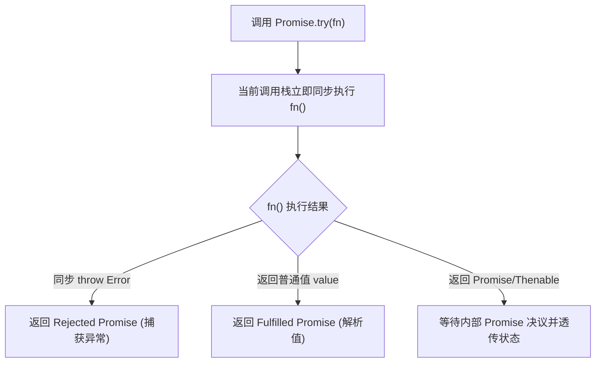
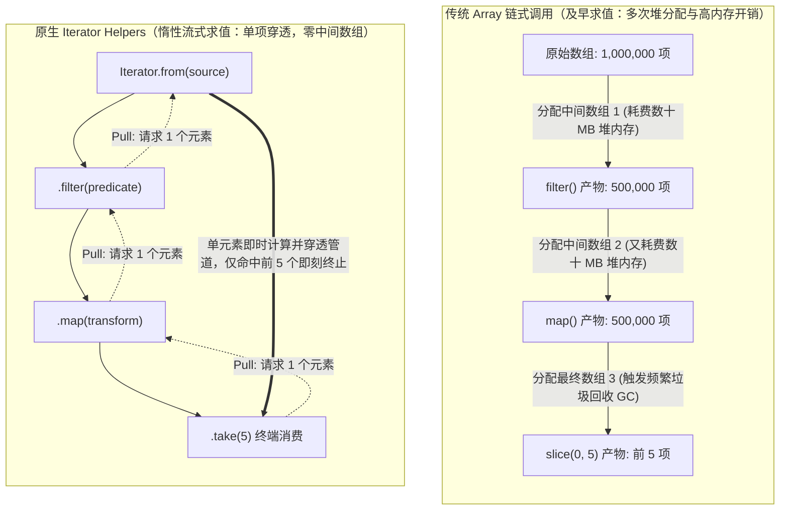
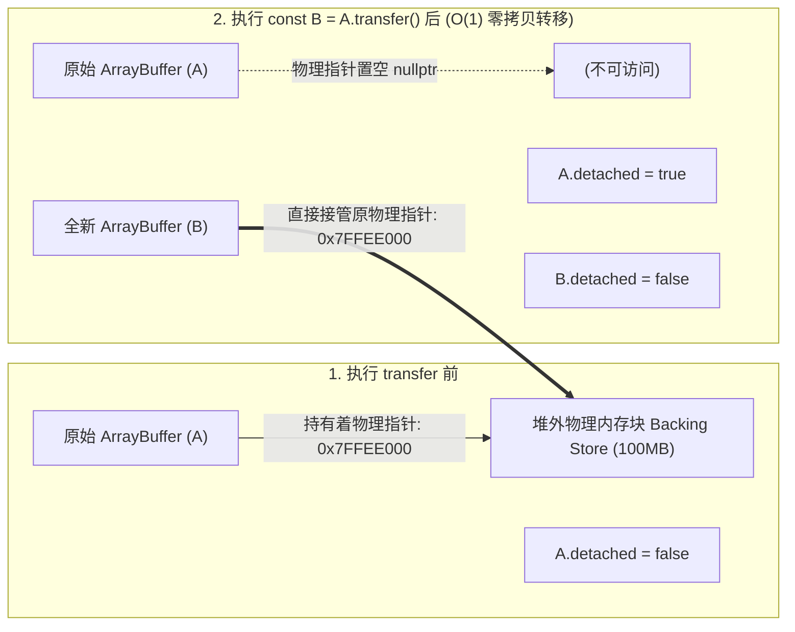
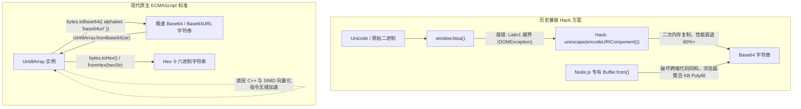
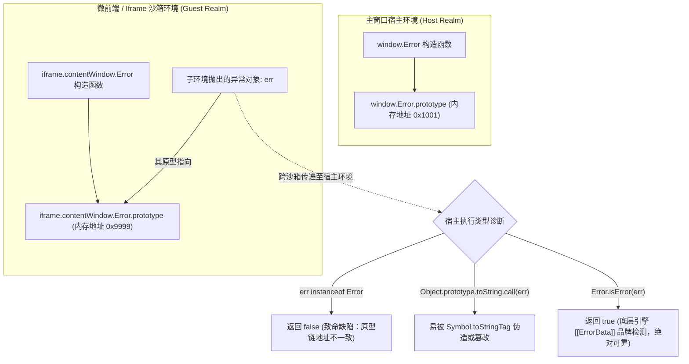
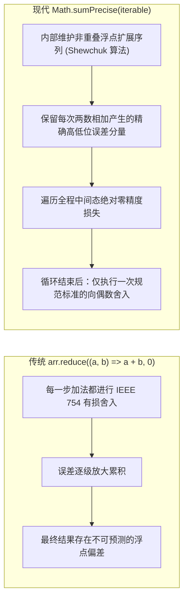
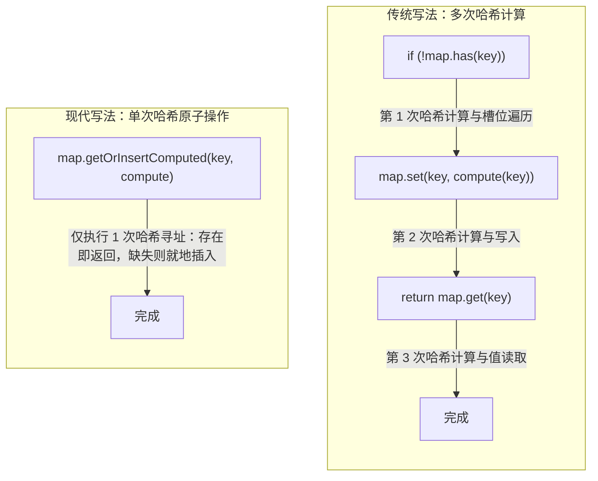

# 现代 ECMAScript 前沿特性 (ES2024 - ES2026)✅

本模块系统性梳理 ECMAScript 在 2024 至 2026 年间达成 Stage 4 并落地标准的工业级核心演进特性。重点涵盖异步控制与集合流式处理（Promise.try / withResolvers / Iterator Helpers / Set 集合代数）、底层二进制内存操作与零拷贝转移（ArrayBuffer.prototype.transfer / Uint8Array Base64-Hex / Float16Array），以及跨环境运行时诊断与高精度算术（Error.isError / Math.sumPrecise / Map.prototype.getOrInsert）。

---

## ECMAScript 2024-2026 核心前沿特性全景：Promise.try()、Promise.withResolvers()、原生 Iterator Helpers 与 Set 集合代数？ {#p0-es-modern-features}

<Answer>

### 核心结论

现代 ECMAScript 在异步编程范式与流式数据处理领域迎来了系统性升级，彻底终结了以往依赖用户态三方库或反模式（Userland Hacks）的历史痛点：
- **`Promise.try()`**：实现“同步立即求值 + 异常统一提升为 Rejected Promise”，抹平了高阶函数中同步抛错与异步拒绝的处理鸿沟，既能安全包裹可能同步报错的代码，又避免了 `Promise.resolve().then(fn)` 额外引入的微任务入队延迟。
- **`Promise.withResolvers()`**：将传统 `new Promise((resolve, reject) => ...)` 的闭包执行器反转（Inversion of Control），直接解耦为包含 `{ promise, resolve, reject }` 的独立控制三元组对象，彻底根除可变外部变量捕获的样板代码。
- **原生 Iterator Helpers**：为 `Iterator.prototype` 引入 `.map()`, `.filter()`, `.take()`, `.drop()`, `.flatMap()` 等流式管道算子，提供基于 Pull 机制的惰性流式计算（Lazy Stream Evaluation），杜绝了数组链式调用创建大量中间临时数组的内存与 GC 损耗，空间复杂度从 $O(N)$ 锐降至 $O(1)$，并原生支持无限序列。
- **Set 原生集合代数**：规范新增 `union()`, `intersection()`, `difference()`, `symmetricDifference()`, `isSubsetOf()`, `isSupersetOf()`, `isDisjointFrom()` 七大原子化集合运算方法，支持任意符合 Set-like 协议的对象，引擎底层自动选择规模较小的集合进行遍历优化，算法复杂度达到最优。

---

### 原理解析

#### 1. Promise.try() 的双重保障与即时调度机制

在处理可能返回普通值、也可能返回 Promise、甚至可能在执行前置校验时同步抛出异常的未知函数（如第三方插件或用户回调）时，以往通常存在以下两种模式：

| 调用模式 | 同步异常处理 | 首次执行时序 | 评价与缺陷 |
| :--- | :--- | :--- | :--- |
| `Promise.resolve().then(fn)` | 被 catch 捕获 | **延迟到微任务** | 无法立即同步启动代码，破坏同步初始化的执行顺序 |
| `new Promise(r => r(fn()))` | 被 catch 捕获 | **当前调用栈同步执行** | 语法繁琐冗长，闭包可读性差，类型推断易受干扰 |
| **`Promise.try(fn, ...args)`** | **被 catch 捕获** | **当前调用栈同步执行** | **最佳实践**：兼具同步立即调用的确定性与全链路异步错误捕获 |



`Promise.try` 的核心价值在于建立**统一调用入口**，它保证在当前 Tick 立即执行传入函数体，一旦该函数同步抛出 `throw new Error()`，引擎会自动拦截该调用栈异常并将其提升为 Rejected Promise，防止同步调用栈崩溃中断外层代码。

#### 2. Promise.withResolvers() 的状态控制解耦

在实现超时竞态、任务队列（Job Queue）、流式通道缓冲区以及基于事件的异步等待时，开发者此前必须依赖“延迟对象（Deferred Pattern）”的闭包技巧：

```typescript
// 传统历史写法：样板冗余，需要外部变量暂存与非空断言
let resolve!: (value: string) => void;
let reject!: (reason?: unknown) => void;
const promise = new Promise<string>((res, rej) => {
  resolve = res;
  reject = rej;
});
```

`Promise.withResolvers()` 规范由引擎在 C++ 底层调用 Promise 构造函数并拦截执行器参数，直接返回具有强类型签名的 `{ promise, resolve, reject }` 普通对象：
1. **解耦状态变更能力**：`resolve` 与 `reject` 成为第一公民函数，能够自由注入事件监听器、工作线程消息回调或取消令牌中。
2. **生命周期分离**：只暴露 `promise` 给调用方以维持单向只读契约，由内部持有 `resolve` 触发控制。

#### 3. 原生 Iterator Helpers 惰性迭代管道 vs 数组及早求值

传统 JavaScript 对集合处理严重依赖 `Array.prototype` 上的高阶函数。数组方法采用**及早求值（Eager Evaluation）**模型：每调用一次 `.map()` 或 `.filter()`，V8 引擎都必须在堆内存中完整分配一个新的连续数组，并将全量计算结果写入其中。

当数据规模达到几十万项或在移动端低内存环境中，频繁的多阶段链式调用会触发严重的内存激增与 GC Stop-The-World（STW）停顿。



`Iterator Helpers` 引入的标准方法包含：
- **流式变换**：`.map(mapper)`、`.filter(predicate)`、`.flatMap(mapper)`
- **流式截断与切片**：`.take(limit)`、`.drop(limit)`
- **终端消费与聚合**：`.reduce(reducer, initial)`、`.toArray()`、`.forEach(fn)`、`.some(fn)`、`.every(fn)`、`.find(fn)`
- **提升工厂**：`Iterator.from(iterable)`，可将任意原生 `Set`、`Map`、生成器（Generator）或自定义 Iterable 包装为标准 Iterator Helper 实例。

惰性管道遵循 **Pull 机制**：终端方法每请求一次 `.next()`，数据才从源头拉取一个元素穿透整条流水线；一旦满足条件（如 `.take(5)` 达到上限），上游迭代器立即停止拉取并调用可选的 `.return()` 清理资源，达到真正的 **$O(1)$ 中间辅助空间复杂度**。

#### 4. Set 集合代数规范方法与 Set-like 协议

以往计算集合运算需要借助 `[...setA].filter(x => setB.has(x))` 等黑魔法，经过“Set 到 Array 再回 Set”的多次解构和哈希重建，耗时且增加无谓内存。

现代标准提供了 7 个原生数学集合方法：
1. **`setA.union(setB)`**：并集 $A \cup B$。
2. **`setA.intersection(setB)`**：交集 $A \cap B$。
3. **`setA.difference(setB)`**：差集 $A \setminus B$（属于 A 但不属于 B 的元素）。
4. **`setA.symmetricDifference(setB)`**：对称差集 $A \triangle B$（属于 A 或 B 但不同时属于两者的元素）。
5. **`setA.isSubsetOf(setB)`**：子集判定 $A \subseteq B$。
6. **`setA.isSupersetOf(setB)`**：超集判定 $A \supseteq B$。
7. **`setA.isDisjointFrom(setB)`**：互斥判定 $A \cap B = \emptyset$。

**性能优化与 Set-like 协议**：
所有方法入参不仅限于原生 `Set` 实例，任何具有 `size` 属性以及 `has()` 和 `keys()` 方法的对象（如自定义布隆过滤器、只读视图）均可作为入参。引擎内部会对较小集合进行遍历：例如在计算 `intersection` 时，若 `setA.size > setB.size`，算法内部会自动遍历较小的 `setB` 并查询 `setA.has()`，保证运算效率达到最优。

---

### 规范 TypeScript / JavaScript 代码实现

#### 1. 混合同步/异步 SDK 统一错误边界 (Promise.try)

```typescript
// 安全包裹未知插件/用户配置，统一生命周期
interface PluginConfig {
  setup: () => void | Promise<void>;
  name: string;
}

export async function bootstrapPlugin(plugin: PluginConfig): Promise<{ success: boolean; name: string }> {
  // Promise.try 同步执行 plugin.setup()
  // 若 setup() 内同步 throw new Error('Invalid config')，自动转化为 Rejected Promise
  // 若 setup() 返回一个挂起的 Promise，则等待其决议
  return Promise.try(() => plugin.setup())
    .then(() => {
      return { success: true, name: plugin.name };
    })
    .catch((err: unknown) => {
      const message = err instanceof Error ? err.message : String(err);
      console.error('插件 [' + plugin.name + '] 初始化失败:', message);
      return { success: false, name: plugin.name };
    });
}
```

#### 2. 解耦超时竞态与事件通道缓冲 (Promise.withResolvers)

```typescript
// 基于 withResolvers 构建可取消、支持外部决议的异步任务控制单元
export class AsyncDeferredTask<T> {
  public readonly promise: Promise<T>;
  public readonly resolve: (value: T | PromiseLike<T>) => void;
  public readonly reject: (reason?: unknown) => void;
  private timer: ReturnType<typeof setTimeout> | null = null;

  constructor(timeoutMs?: number) {
    const { promise, resolve, reject } = Promise.withResolvers<T>();
    this.promise = promise;
    this.resolve = resolve;
    this.reject = reject;

    if (timeoutMs !== undefined && timeoutMs > 0) {
      this.timer = setTimeout(() => {
        this.reject(new Error('任务在等待 ' + timeoutMs + 'ms 后超时'));
      }, timeoutMs);
    }
  }

  public complete(value: T): void {
    if (this.timer) clearTimeout(this.timer);
    this.resolve(value);
  }

  public fail(err: unknown): void {
    if (this.timer) clearTimeout(this.timer);
    this.reject(err);
  }
}
```

#### 3. 大数据流式惰性管道计算 (Iterator Helpers)

```typescript
// 模拟无限数字序列生成器
function* naturalNumbers(): Generator<number, void, unknown> {
  let n = 1;
  while (true) {
    yield n++;
  }
}

// 基于 Iterator Helpers 构建低内存流式分析管道
export function computeTopEvenSquares(): number[] {
  // Iterator.from 可包装生成器或任何可迭代对象
  return Iterator.from(naturalNumbers())
    .filter((x: number) => x % 2 === 0)   // 仅过滤偶数
    .map((x: number) => x * x)            // 计算平方
    .drop(10)                             // 跳过前 10 个命中项
    .take(5)                              // 截取接下来 5 项后立即终止流
    .toArray();                           // 终端求值：输出结果数组
}

// 实际执行仅拉取并运算了前 30 个自然数，无额外中间数组开销
```

#### 4. 基于原生 Set 集合代数的细粒度权限校验系统

```typescript
type Permission = 'read' | 'write' | 'delete' | 'audit' | 'export';

export class RBACEngine {
  // 用户拥有的权限集合
  private userPermissions: Set<Permission>;

  constructor(permissions: Iterable<Permission>) {
    this.userPermissions = new Set(permissions);
  }

  // 校验用户是否满足执行目标操作的所有必需权限 (子集判定)
  public hasAllPermissions(required: Set<Permission>): boolean {
    return required.isSubsetOf(this.userPermissions);
  }

  // 计算多角色叠加合并后的最终有效权限 (并集)
  public static mergeRoles(roleA: Set<Permission>, roleB: Set<Permission>): Set<Permission> {
    return roleA.union(roleB);
  }

  // 获取用户缺失的权限清单 (差集)
  public getMissingPermissions(required: Set<Permission>): Set<Permission> {
    return required.difference(this.userPermissions);
  }

  // 审计分析：找出两个权限版本间的变更点 (对称差集：新增或删除的权限)
  public static auditDiff(prev: Set<Permission>, next: Set<Permission>): Set<Permission> {
    return prev.symmetricDifference(next);
  }
}
```

---

### 面试官视角

- **核心考察点**：
  1. 能否从 JavaScript 语言规范与底层事件循环时序（Microtask 队列入队时机）讲透 `Promise.try` 与 `Promise.resolve().then` 的根本差异；
  2. 理解“控制反转（IoC）”在异步控制中的意义，以及 `Promise.withResolvers` 如何消除样板闭包；
  3. 对比“及早求值（Eager）”与“惰性流（Lazy Pull）”在内存拓扑、中间分配与 GC 压力上的本质区别；
  4. 掌握 Set 集合运算的时间复杂度优化原理及 Set-like 鸭子类型的规范契约。
- **加分项**：
  - 指出 `Iterator Helpers` 在执行 `.take(n)` 完成后，会调用底层迭代器的 `.return()` 方法（如果存在），以此确保文件句柄、数据库游标或网络流连接等底层资源得到确定性关闭；
  - 阐述原生 Set 运算与旧版解构（`[...set]`）在内存占用方面的巨大优势，能够说出引擎对于尺寸不平衡集合（如 10 元素集合交集 100 万元素集合）的自动遍历优化策略。
- **下探追问链**：
  - *追问 1*：为什么说 `Promise.resolve().then(fn)` 无法完全替代 `Promise.try(fn)`？在哪些真实工程场景下这种微任务时序差异会导致严重的 Bug？
    - *回答要点*：若 `fn` 内部包含对调用时刻敏感的操作（如记录精确性能打点 `performance.now()`、检查当前 DOM 焦点状态、或者与同步执行的宿主流程进行强时序校验），`Promise.resolve().then` 会将 `fn` 的执行延后至下一个微任务周期。此时外部的同步代码已经执行完毕，执行环境可能已发生变更；而 `Promise.try(fn)` 确保了 `fn` 的同步部分立即在当前调用栈原位执行。
  - *追问 2*：原生 `Iterator Helpers` 与 RxJS / Lodash 的流处理库相比，核心差异是什么？它能替代 RxJS 吗？
    - *回答要点*：不能完全替代。原生 `Iterator Helpers` 基于同步/异步迭代器协议，是**拉取模型（Pull-based）**，适用于确定性序列、分页数据、数据分析管道等按需拉取场景；而 RxJS 是基于观察者模式的**推送模型（Push-based）**，核心能力在于处理随时间推移由外部主动触发的异步离散事件流（如 UI 连续输入防抖、WebSocket 消息路由、多事件时间窗口合并等）。两者定位互补。
  - *追问 3*：原生 Set 集合运算对于对象的比较，是按值比较还是按引用比较？
    - *回答要点*：沿用 JavaScript 原生 Set 的 `SameValueZero` 算法，对对象类型一律基于引用比较，不进行深度属性相等性对比；对 `NaN` 与 `NaN` 视为相等，`+0` 与 `-0` 视为相等。

---

### 延伸阅读

- [TC39 Proposal: Promise.try](https://github.com/tc39/proposal-promise-try)（Stage 4）
- [TC39 Proposal: Promise.withResolvers](https://github.com/tc39/proposal-promise-with-resolvers)（Stage 4, ES2024）
- [TC39 Proposal: Iterator Helpers](https://github.com/tc39/proposal-iterator-helpers)（Stage 4, ES2025）
- [TC39 Proposal: New Set Methods](https://github.com/tc39/proposal-set-methods)（Stage 4, ES2025）

</Answer>

---

## JavaScript 底层二进制与内存操作演化：ArrayBuffer.prototype.transfer() 零拷贝转移、Uint8Array 原生 Base64/Hex 编解码与 Float16Array？ {#p0-js-binary-memory-transfer}

<Answer>

### 核心结论

现代 ECMAScript 正在经历从“纯高级抽象脚本”向“系统级低开销内存操控与硬件异构加速语言”的深刻演化：
- **`ArrayBuffer.prototype.transfer()` 与 `transferToFixedLength()`**：正式确立了原子级的内存所有权转移（Ownership Transfer）与原地扩缩容机制。转移后原 ArrayBuffer 瞬间处于 Detached（已分离）状态，其底层物理内存驻留块（Backing Store）指针直接移交新对象。将过去需要分配新空间并逐字节深拷贝的 $O(N)$ 耗时与双倍瞬时内存峰值，降为真正的 **$O(1)$ 指针级零拷贝移动**。
- **Uint8Array 原生 Base64 / Hex 编解码**：新增 `Uint8Array.fromBase64()`、`bytes.toBase64()`、`Uint8Array.fromHex()` 与 `bytes.toHex()`。终结了历史遗留方案依赖 `btoa`/`atob` 的 Latin1 乱码与性能瓶颈，摆脱了 Node.js 专有 `Buffer` 造成的生态割裂，由底层 C++ 与 SIMD 向量化指令直接加速。
- **`Float16Array`**：引入遵循 IEEE 754-2008 的 16 位半精度浮点 TypedArray，单元素仅占 2 字节（相比 `Float32Array` 的 4 字节节省 50% 内存）。在 WebGPU（WGSL `f16`）图形管线通信与端侧大模型推理（WebLLM、ONNX Runtime Web）中，直接将显存占用与总线传输带宽减半，有效规避移动端 32 位堆内存上限与 OOM。

---

### 原理解析

#### 1. ArrayBuffer 内存所有权模型与 DetachedBuffer 状态

在 V8 或 JavaScriptCore 等现代引擎内部，一个 `ArrayBuffer` 由两部分组成：
1. **JS 封装对象（Wrapper Object）**：位于 V8 堆内的小型对象头，记录 byteLength、配置标记以及指向堆外真实内存的指针。
2. **底层支撑存储区（Backing Store）**：由操作系统的虚拟内存分配器（如 `malloc` / `mmap`）在堆外分配的连续物理字节块。



**传统深拷贝 vs `transfer()` 底层性能与内存机制对比**：

| 对比维度 | 传统深拷贝 (`slice` + `set`) | 原生 `transfer()` 零拷贝 |
| :--- | :--- | :--- |
| **底层实现机制** | `malloc` 新建完全相同的内存块，执行 `memcpy` 逐字节物理搬运 | 复用原 `BackingStore`，仅转移所有权指针；或调用系统级 `realloc` |
| **时间复杂度** | $O(N)$（随 Buffer 容量线性增长，数百 MB 数据产生秒级卡顿） | **$O(1)$**（微秒级完成指针移交） |
| **内存峰值（High Water Mark）** | **200%**（原数据与新分配数据同时驻留，极易诱发 OOM 崩溃） | **100%**（无额外物理内存瞬时膨胀） |
| **原 Buffer 状态** | 依然存活，继续持有原内存，需等待 V8 垃圾回收垃圾标记 | **立即进入 Detached 状态**，原内存指针被置为 `nullptr` |

**Detached 状态安全检查**：
- 规范提供了 `buffer.detached` 只读布尔属性（ES2024）。
- 一旦 ArrayBuffer 变为 Detached，任何尝试通过其派生的 TypedArray（如 `Uint8Array`）或 `DataView` 读取或写入索引的操作，均会立即抛出不可捕获的规范级 `TypeError: Cannot perform ... on a detached ArrayBuffer`，杜绝了 C/C++ 中典型的“释放后使用（Use-After-Free）”安全漏洞。

#### 2. Uint8Array 原生 Base64 / Hex 编解码的技术代差

在 Web 开发中，二进制数据（图片、加密哈希、文件分片、WebAuthn 凭证）与文本传输格式之间的序列化极其频繁。历史演进过程中的方案存在诸多硬伤：



原生方法的规范优势：
1. **跨运行时完全同构**：浏览器、Node.js 22+、Deno、Bun、Cloudflare Workers 全平台统一。
2. **规范级选项支持**：
   - `alphabet: 'base64' | 'base64url'`：原生支持无缝切换 URL 安全字符集（将 `+` 和 `/` 替换为 `-` 和 `_`）。
   - `omitPadding: true`：直接省略末尾的 `=` 填充符，契合现代 JWT 与 WebAuthn 标准。
   - `lastChunkHandling: 'loose' | 'strict' | 'stop-before-partial'`：严格校验尾部填充有效性。
3. **SIMD 硬件加速**：各大引擎直接在底层挂载 AVX2 / NEON 向量指令集，吞吐速率比纯 JS 实现提升数倍至数十倍。

#### 3. Float16Array 在图形学与端侧 AI 的工程价值

`Float16Array` 遵循 IEEE 754-2008 标准的半精度浮点格式（16-bit Floating Point）：
- **1 位符号位 (Sign)**
- **5 位指数位 (Exponent)**，偏移量（Bias）为 15
- **10 位尾数/有效数字位 (Mantissa)**

```txt
 15  14          10 9                               0
+---+--------------+---------------------------------+
| S |   Exponent   |            Mantissa             |
+---+--------------+---------------------------------+
 1位       5位                       10位
```

**与 Float32Array 的工业指标对照**：

| 指标 | Float16Array | Float32Array |
| :--- | :--- | :--- |
| **单元素字节开销** | **2 Bytes (16 bits)** | 4 Bytes (32 bits) |
| **有效十进制精度** | 约 3 ~ 4 位有效数字 | 约 7 ~ 8 位有效数字 |
| **绝对值数值范围** | 约 `$6.10 \times 10^{-5}$` 至 65504 | 约 `$1.18 \times 10^{-38}$` 至 `$3.40 \times 10^{38}$` |
| **典型显存/内存带宽占用** | **基线 50%（直接节省一半显存）** | 基线 100% |

**工程落地场景**：
1. **端侧大模型推理（WebLLM / Transformers.js / ONNX Runtime Web）**：神经网络权重矩阵通常可在 FP16 下无损运行。将模型权重以 `Float16Array` 直接加载，一个原本在 FP32 下需占用 4GB 内存的模型，直接压缩至 2GB，打破浏览器标签页 4GB 虚拟内存的绝对物理限制。
2. **WebGPU 管线通信（WGSL `f16` 扩展）**：在 GPU 着色器启用 `enable f16;` 时，CPU 端直接构建 `Float16Array` 并通过 `device.queue.writeBuffer()` 上传至 GPU 缓冲区，PCIe 总线数据传输耗时直接减半，帧率稳定性大幅提升。

---

### 规范 TypeScript / JavaScript 代码实现

#### 1. 零内存膨胀的动态扩容字节缓冲区 (ArrayBuffer.transfer)

```typescript
// 实现一个类似系统级 ArrayList 的高性能动态字节扩容容器
export class FastDynamicByteBuffer {
  private buffer: ArrayBuffer;
  private length: number = 0;

  constructor(initialCapacity: number = 1024) {
    this.buffer = new ArrayBuffer(initialCapacity);
  }

  public append(data: Uint8Array): void {
    const requiredCapacity = this.length + data.byteLength;

    // 当现有容量不足时，进行扩容
    if (requiredCapacity > this.buffer.byteLength) {
      // 采用 2 倍扩容策略
      const newCapacity = Math.max(this.buffer.byteLength * 2, requiredCapacity);

      // 原生 transfer 零拷贝：底噪不变，直接在堆外移交或扩展内存块指针
      // 旧 this.buffer 自动 Detached，杜绝悬挂引用
      this.buffer = this.buffer.transfer(newCapacity);
    }

    // 写入新数据
    const view = new Uint8Array(this.buffer);
    view.set(data, this.length);
    this.length += data.byteLength;
  }

  // 收缩至实际使用尺寸，释放闲置内存
  public trimToFit(): Uint8Array {
    if (this.buffer.byteLength !== this.length) {
      this.buffer = this.buffer.transfer(this.length);
    }
    return new Uint8Array(this.buffer);
  }

  public get isDetached(): boolean {
    return this.buffer.detached;
  }
}
```

#### 2. 跨平台标准 JWT 签名与安全哈希解析 (Uint8Array Base64/Hex)

```typescript
// 使用原生 Base64URL 与 Hex API 解析与验证数据包
export interface JWTParts {
  header: Record<string, unknown>;
  payload: Record<string, unknown>;
  rawSignature: Uint8Array;
}

export function parseAndAuditJWT(jwtString: string): JWTParts {
  const parts = jwtString.split('.');
  if (parts.length !== 3) {
    throw new Error('非法 JWT 格式');
  }

  const [headerB64, payloadB64, signatureB64] = parts;

  // 使用原生 Uint8Array.fromBase64 直接按 base64url 解码为二进制字节
  const headerBytes = Uint8Array.fromBase64(headerB64, { alphabet: 'base64url' });
  const payloadBytes = Uint8Array.fromBase64(payloadB64, { alphabet: 'base64url' });
  const signatureBytes = Uint8Array.fromBase64(signatureB64, { alphabet: 'base64url' });

  // 跨平台文本解码
  const decoder = new TextDecoder();
  const header = JSON.parse(decoder.decode(headerBytes));
  const payload = JSON.parse(decoder.decode(payloadBytes));

  // 输出可供安全审计的 Hex 字符串，完全不依赖 Node.js Buffer
  console.log('签名特征 Hex:', signatureBytes.toHex());

  return {
    header,
    payload,
    rawSignature: signatureBytes
  };
}
```

#### 3. 端侧 AI / WebGPU 权重高密度装载管线 (Float16Array)

```typescript
// 演示在端侧大模型加载中，使用 Float16Array 减半内存传输
export function createWebGPUWeightBuffer(
  device: GPUDevice,
  rawWeightsFloat16: Float16Array
): GPUBuffer {
  // 分配 WebGPU 缓冲区，尺寸精确匹配 Float16 紧凑字节数
  const weightBuffer = device.createBuffer({
    size: rawWeightsFloat16.byteLength,
    usage: GPUBufferUsage.STORAGE | GPUBufferUsage.COPY_DST,
  });

  // 直接将 16 位半精度浮点数据推送至 GPU 显存
  // 传输数据量比传统 Float32 减少整整 50%
  device.queue.writeBuffer(
    weightBuffer,
    0,
    rawWeightsFloat16.buffer,
    rawWeightsFloat16.byteOffset,
    rawWeightsFloat16.byteLength
  );

  return weightBuffer;
}
```

---

### 面试官视角

- **核心考察点**：
  1. 能否从操作系统虚拟内存（Virtual Memory）、堆外内存（Off-heap Backing Store）和 C++ 引擎架构视角，剖析 `ArrayBuffer.transfer` 如何做到真正的 $O(1)$ 零拷贝；
  2. 深刻理解 DetachedBuffer 状态存在的安全与内存防护意义，知道为什么原视图必须被强制失效；
  3. 能否清晰梳理 Web 平台处理 Base64 的技术演进史，说明原生 `Uint8Array` 编解码方法对跨端生态一体化的重要意义；
  4. 掌握 IEEE 754 半精度浮点（FP16）的存储格式，并能结合 WebGPU 与端侧 AI 场景解释其节约带宽与显存的核心价值。
- **加分项**：
  - 能够指出 `transferToFixedLength()` 的特殊应用场景：当将由 `new ArrayBuffer(len, { maxByteLength: maxLen })` 创建的 ResizableArrayBuffer（可调大小缓冲）锁定为不可调尺寸的固定物理缓冲区时使用；
  - 清楚解释 `buffer.transfer()` 在扩容时若底层依赖操作系统的 `mremap` / `VirtualAlloc`，可能就地扩展物理映射页，甚至完全无需移动虚拟基地址。
- **下探追问链**：
  - *追问 1*：Web Worker 间通信 `worker.postMessage(buffer, [buffer])` 也是转移所有权，这和同线程调用 `buffer.transfer()` 有何异同？
    - *回答要点*：两者底层机制完全共享相同的“Detached 原理”。`postMessage` 的转移列表（Transfer List）跨越两个独立的执行环境或线程，将原线程的 Backing Store 卸除并挂载给目标线程的 ArrayBuffer；而 `buffer.transfer()` 是在**同一个执行环境内**对内存所有权与容量进行生命周期管理，允许原位扩缩容、裁剪释放冗余内存。
  - *追问 2*：在什么场景下不能使用 `Float16Array` 替代 `Float32Array`？它的数值风险是什么？
    - *回答要点*：数值范围窄（最大值仅 65504，大于此值会直接发生数值溢出变为 `Infinity`；最小值仅约 `$6.1 \times 10^{-5}$`，容易发生下溢变为零）；有效精度仅 3 ~ 4 位有效数字。因此在金融金额核算、高精度物理仿真碰撞检测、需要极大动态范围的高光 HDR 图形着色中绝对不能使用，仅适用于容忍细微误差的神经网络权重和标准化渲染纹理。
  - *追问 3*：若 `Uint8Array.fromBase64` 传入含有非法字符（如换行符或非 Base64 字符）的字符串，默认行为是什么？如何调整控制策略？
    - *回答要点*：规范默认配置是严格模式（`alphabet: 'base64'`），遇到非法字符或错误填充会抛出 `SyntaxError`；但可通过传入 `{ lastChunkHandling: 'loose' }` 宽容模式来忽略尾部填充缺失，实现对不规范三方报文的弹性解析。

---

### 延伸阅读

- [TC39 Proposal: ArrayBuffer.prototype.transfer](https://github.com/tc39/proposal-arraybuffer-transfer)（Stage 4, ES2024）
- [TC39 Proposal: Uint8Array to/from base64 and hex](https://github.com/tc39/proposal-arraybuffer-base64)（Stage 4, ES2025）
- [TC39 Proposal: Float16Array](https://github.com/tc39/proposal-float16array)（Stage 4, ES2025）
- [MDN Web Docs: ArrayBuffer.prototype.transfer()](https://developer.mozilla.org/en-US/docs/Web/JavaScript/Reference/Global_Objects/ArrayBuffer/transfer)

</Answer>

---

## ECMAScript 跨环境诊断与高精度计算：Error.isError() 跨 Realm 判别机制与 Math.sumPrecise() 浮点累加？ {#p1-js-cross-realm-math}

<Answer>

### 核心结论

面对现代前端微前端隔离（Microfrontends）、Worker 多线程计算、ShadowRealm 安全沙箱以及严苛金融数据结算等复杂系统架构，ECMAScript 在语言标准层提供了精准的诊断与高精度算术基础：
- **`Error.isError()`**：语言级首个跨 Realm 错误判别标准方法（地位等同于 `Array.isArray()`）。彻底终结了以往在 `<iframe>`、Web Worker、ShadowRealm、Node.js `node:vm` 等隔离环境间通信时，传统 `instanceof Error` 必定失效的历史顽疾；且底层采用引擎内部插槽品牌检测（Brand Check），不受 `Symbol.toStringTag` 伪造或原型篡改影响。
- **`Math.sumPrecise()`**：基于浮点扩展与误差补偿机制（Shewchuk 任意精度浮点累加算法）的原生算术标准。彻底解决经典 IEEE 754 64 位浮点数在求和过程中误差扩散积累的问题（如 `0.1 + 0.2` 精度缺陷），以纯原生 $O(N)$ 复杂度实现“中间过程零精度损失，最终单一标准舍入（Round to nearest, ties to even）”，终结了在求和场景中为了精度不得不引入庞大外部 Decimal 库的困境。
- **`Map.prototype.getOrInsert()` 与 `getOrInsertComputed()`**：为 `Map` 带来原子级“查询或插入（Upsert）”语义。将以往由 `has`、`set`、`get` 组成的 2 到 3 次重复哈希计算压缩为**单次哈希寻址（Single Hash Lookup）**，并支持惰性回调求值，消除了样板代码与潜在的竞态条件。

---

### 原理解析

#### 1. 跨 Realm 判别困境与 Error.isError() 的底层机制

**何为 Realm（执行领域）？**
在 ECMAScript 规范中，一个 Realm 由一个独占的全局作用域（Global Scope）与一整套独立的固有内置对象原型系统（Intrinsics，如独立的 `Object.prototype`、`Array.prototype`、`Error.prototype`）构成。
浏览器中的子 `<iframe>`、Web Worker、ShadowRealm，以及 Node.js 的 `node:vm` 模块，都会各自实例化全新的独立 Realm。



**历史检测方案的缺陷分析**：
1. **`err instanceof Error` 彻底失效**：`instanceof` 运算符的本质是遍历对象的原型链，判断其是否存在 `HostError.prototype`。由于跨 Realm 对象的原型指向的是 `GuestError.prototype`（物理内存地址截然不同），计算结果恒为 `false`。这在微前端沙箱与全局错误监控 SDK 中经常引发“明明是 Error 却被当作普通对象丢弃”的严重缺陷。
2. **`Object.prototype.toString.call(err) === '[object Error]'` 易受伪造**：在 ES6 及以后，该方法会优先检查对象的 `[Symbol.toStringTag]`。恶意代码只需声明 `{ [Symbol.toStringTag]: 'Error' }` 即可假冒错误对象；反之，若继承自 Error 的自定义类重写了该属性，判别就会误判为 `false`。

**`Error.isError()` 内部规范机制**：
规范规定，引擎在实现 `Error.isError(value)` 时，直接检查参数对象内部是否存在内置专用插槽 **`[[ErrorData]]`**（Brand Check）。该插槽是在 `new Error()` 执行时由引擎在底层直接赋予的内部元数据，无法被用户态 JavaScript 注入、修改或伪造。无论该对象来自哪一个 Realm，判别均能在 $O(1)$ 时间内精准确立。

#### 2. Math.sumPrecise() 原理与浮点误差补偿机制

经典 IEEE 754 双精度浮点运算中，每个浮点数只有 53 位有效二进制精度（Significand）。在进行多数累加运算时（如 `0.1 + 0.2`），由于二进制无法精确表示十进制有限小数，低位会被无情截断。

在长序列（如上万笔交易记录金额或工程坐标点）顺序累加中，微小的截断误差会伴随对齐阶码的过程发生**级联扩散与吞没（Catastrophic Cancellation / Error Accumulation）**，最终导致结算金额出现分钱级的巨大偏差。



**`Math.sumPrecise` 算法工作流程**：
1. **惰性遍历序列**：接受任意可迭代对象，将其项逐个转换为 Number。
2. **无损误差分量吸收（Shewchuk 浮点扩展）**：内部维护一个增长型的高低位非重叠浮点数组。每次加入一个新数字时，利用类似于 `TwoSum` 的无损加法原理，计算出当前两数相加的近似和与其产生的微小精度损失差值，将这两部分精确存入扩展槽位中。
3. **最终单一归约舍入**：在所有元素消费完毕后，才将内部非重叠扩展序列压缩为一个 64 位双精度浮点数，并严格执行一次 **向最接近的偶数舍入（Round to nearest, ties to even）**。
4. **特殊值规范处理**：
   - 包含 `NaN` 时，直接返回 `NaN`；
   - 包含同号无穷大（如纯 `+Infinity`）时，返回 `+Infinity`；
   - 同时包含 `+Infinity` 与 `-Infinity` 时，返回 `NaN`；
   - 正确保持 `-0` 与 `+0` 的符号位。

#### 3. Map.prototype.getOrInsert / getOrInsertComputed 的原子化优化

经典的“查找并在缺失时插入”模式长期困扰着代码简洁度与运行时性能：



规范提供了两个变体：
- **`map.getOrInsert(key, defaultValue)`**：用于轻量级值（如基础字面量、默认空数组）。如果存在则直接返回；如果不存在，将 `defaultValue` 存入 Map 并返回。
- **`map.getOrInsertComputed(key, callbackFn)`**：用于计算成本高昂的对象（如复杂实例、解析 AST）。仅在 `key` 缺失时，才以惰性方式执行 `callbackFn(key)`，将返回值存入 Map 并返回。

核心工程收益：
1. **哈希查找性能直接翻倍**：将原先多次哈希散列计算与链表/红黑树寻址压缩为底层 C++ 级别的单次寻址。
2. **消除重复计算与竞态**：惰性回调杜绝了不必要的内存分配，避免在值已经存在时依然执行了昂贵的高开销计算。

---

### 规范 TypeScript / JavaScript 代码实现

#### 1. 微前端 / 沙箱环境统一安全错误分发中台 (Error.isError)

```typescript
// 模拟来自跨 Realm（iframe 或 Worker 沙箱）的数据包
export interface TelemetryPayload {
  sourceRealm: string;
  payload: unknown;
}

export class CrossRealmErrorInterceptor {
  // 生产级跨环境错误捕获与结构化解析
  public static processTelemetry(data: TelemetryPayload): {
    isErrorObject: boolean;
    name?: string;
    message?: string;
    stack?: string;
  } {
    const candidate = data.payload;

    // 使用原生 Error.isError() 进行规范级跨 Realm 判定
    // 即使 candidate 来自于其他 iframe、Worker 或 VM 上下文，依然精准返回 true
    if (Error.isError(candidate)) {
      return {
        isErrorObject: true,
        name: candidate.name,
        message: candidate.message,
        stack: candidate.stack,
      };
    }

    // 处理假冒的伪造错误对象（例如仅仅具备 { message: 'err' } 的普通对象）
    return {
      isErrorObject: false,
      message: typeof candidate === 'string' ? candidate : JSON.stringify(candidate),
    };
  }
}
```

#### 2. 金融级无累积误差结算系统 (Math.sumPrecise)

```typescript
// 模拟大量含有细微浮点误差的商品交易明细
const orderItems = [
  { name: '云服务实例小时费', amount: 0.1 },
  { name: '存储附加包', amount: 0.2 },
  { name: '弹性公网 IP', amount: 0.3 },
  { name: '流量包优惠抵扣', amount: -0.6 },
];

export function executeFinancialSettlement(): {
  traditionalReduce: number;
  preciseResult: number;
} {
  // 提取账单金额迭代序列
  const amounts = orderItems.map(item => item.amount);

  // 1. 传统 reduce 累加：存在经典的 IEEE 754 精度漂移
  const traditionalReduce = amounts.reduce((acc, curr) => acc + curr, 0);
  // 结果可能为 5.551115123125783e-17，而非精确的 0

  // 2. 原生 Math.sumPrecise 高精度无损累加
  // 规范算法在中间计算中完全不丢失精度，仅在最后一次性执行精确偶数舍入
  const preciseResult = Math.sumPrecise(amounts);
  // 结果精确为 0

  return {
    traditionalReduce,
    preciseResult,
  };
}
```

#### 3. 高并发资源池与请求单例缓存 (Map.prototype.getOrInsertComputed)

```typescript
// 基于 getOrInsertComputed 构建单次哈希寻址的高性能缓存池
export class AsyncResourcePool<K, V> {
  private cache = new Map<K, V>();

  // 获取或惰性创建资源
  public getOrCreate(key: K, factory: (key: K) => V): V {
    // 仅进行单次哈希查找
    // 若 key 存在，直接返回对应实例，绝不调用 factory
    // 若 key 缺失，就地执行 factory(key) 将返回值写入 Map 并返回
    return this.cache.getOrInsertComputed(key, factory);
  }

  // 获取分组列表：缺失时初始化空数组并就地追加
  public appendToGroup(key: K, item: V): void {
    const list = this.cache.getOrInsert(key, [] as unknown as V) as unknown as V[];
    list.push(item);
  }

  public get size(): number {
    return this.cache.size;
  }
}
```

---

### 面试官视角

- **核心考察点**：
  1. 能否从 ECMAScript 核心规范维度解释 Realm（执行领域）与 Execution Context 的架构定义，讲透为什么跨 Realm 会导致 `instanceof` 失效；
  2. 深入理解内部插槽（Internal Slot 如 `[[ErrorData]]`）与外部属性（如 `Symbol.toStringTag`）在安全性和防篡改维度的本质分野；
  3. 能否解释清楚 IEEE 754 双精度浮点数为什么会在连续加法中误差滚雪球，以及 `Math.sumPrecise` 所采用的 Shewchuk 误差补偿算法的设计思想；
  4. 明白哈希表寻址在热点循环下的性能开销，掌握 `getOrInsertComputed` 在降低散列计算次数与惰性求值层面的双重收益。
- **加分项**：
  - 能够列举出已支持跨 Realm 原生判别的三大家族成员：`Array.isArray()`、`Error.isError()` 以及 `Promise.resolve` 中对 Promise 内部插槽 `[[PromiseState]]` 的检测；
  - 能够指出 `Math.sumPrecise` 尽管在中间过程保持任意精度，但其**最终返回值仍然是一个 64 位浮点数（Number）**，若求和真实值超过了 Number 的最大安全范围（如大于 `$2^{53} - 1$`），依然需要配合 `BigInt` 或外部高精度 Arbitrary-precision 库使用。
- **下探追问链**：
  - *追问 1*：如果使用现有的纯 JavaScript 代码模拟 `Error.isError()` 的效果，该如何尽可能严密地实现？
    - *回答要点*：如果无法依赖原生 `Error.isError()`，最接近的健壮兼容方案是综合特征检查：首先判断参数必须是对象且非 null；其次检查 `Object.prototype.toString.call(val) === '[object Error]'`；再次为了防止 `Symbol.toStringTag` 伪造，应使用 `try...catch` 检查访问其核心属性（如 `name`、`message`）时的特征，或尝试调用 `Error.prototype.toString.call(val)` 是否正常执行而不抛出 TypeError。但任何纯用户态模拟都无法在规范层面百分之百达到内部插槽 `[[ErrorData]]` 的原生安全性。
  - *追问 2*：在 `Map.prototype.getOrInsertComputed(key, callback)` 执行期间，如果 `callback` 内部再次对同一个 `map` 递归调用了 `getOrInsertComputed` 且传入了相同的 `key`，会发生死循环还是异常？
    - *回答要点*：规范规定其行为是确定性的：在执行 `callback` 时，该 `key` 尚未正式写入完成。如果回调函数内部递归尝试对同一个 `key` 进行操作，会再次触发回调执行，从而导致最大调用栈溢出（`RangeError: Maximum call stack size exceeded`）。因此在编写惰性初始化逻辑时，必须杜绝循环递归依赖。
  - *追问 3*：`Math.sumPrecise` 在处理含有无限循环小数或无理数浮点时，会不会导致内存无限增长？
    - *回答要点*：不会。因为所有输入到 `Math.sumPrecise` 的项本身都已经是 JavaScript 的双精度浮点数（即都是分母为 2 的幂次方的有理二进分数）。有限个双精度浮点数相加，其精确和一定也是一个有限长度的二进分数。Shewchuk 算法中非重叠浮点扩展数组的项数上限是受到输入项数与双精度阶码跨度（最多几十个分量）严格约束的，内存开销为确定性的极低常数级别，计算完毕后立即释放。

---

### 延伸阅读

- [TC39 Proposal: Error.isError](https://github.com/tc39/proposal-is-error)（Stage 4, ES2025）
- [TC39 Proposal: Math.sumPrecise](https://github.com/tc39/proposal-math-sum)（Stage 4, ES2025）
- [TC39 Proposal: Map.prototype.getOrInsert](https://github.com/tc39/proposal-upsert)（Stage 3 / 4, ES2025）
- [Jonathan Richard Shewchuk: Adaptive Precision Floating-Point Arithmetic and Fast Robust Geometric Predicates](https://people.eecs.berkeley.edu/~jrs/papers/robustr.pdf)

</Answer>
