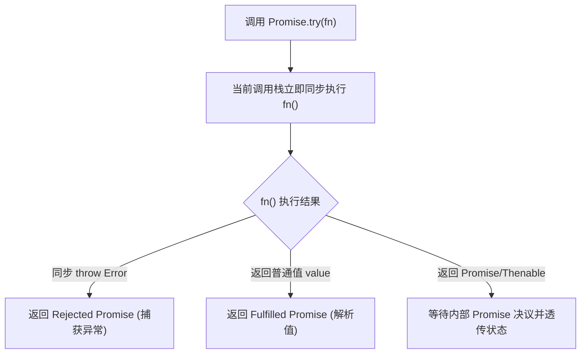
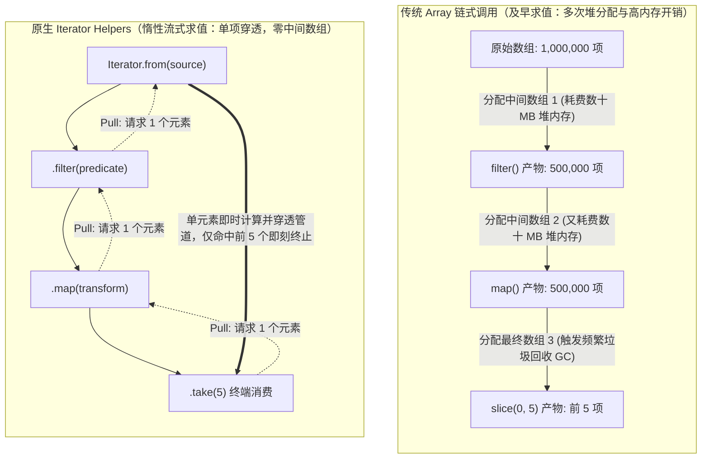
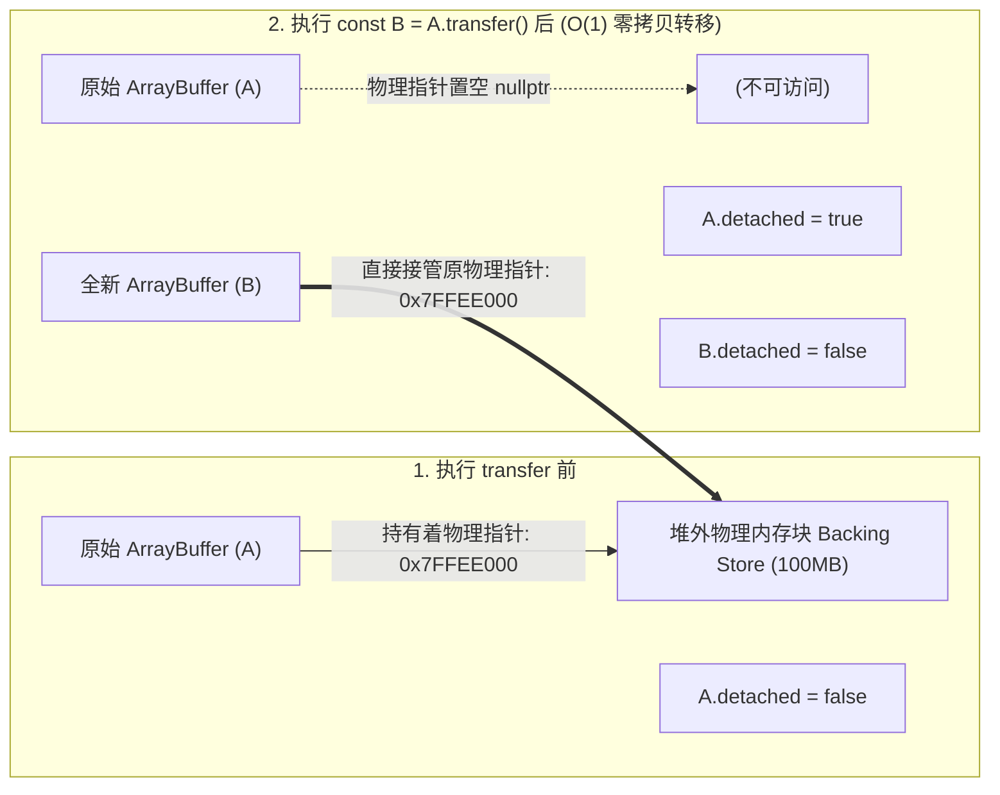
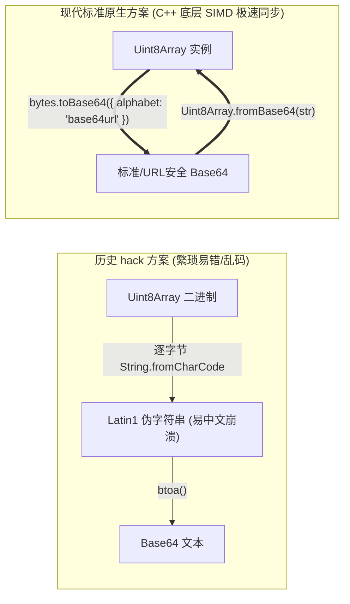
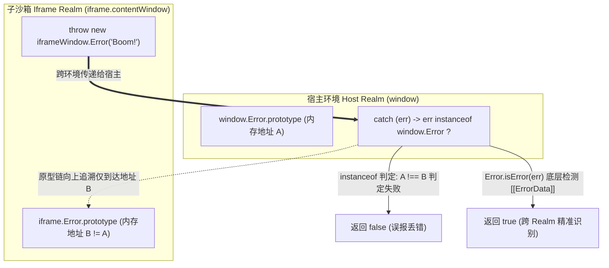
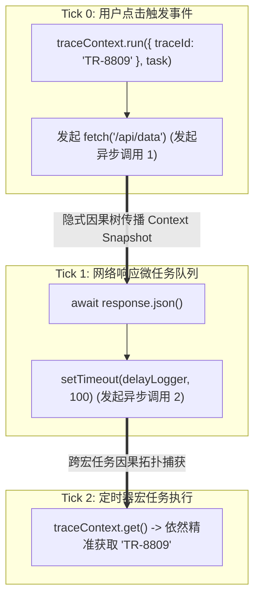
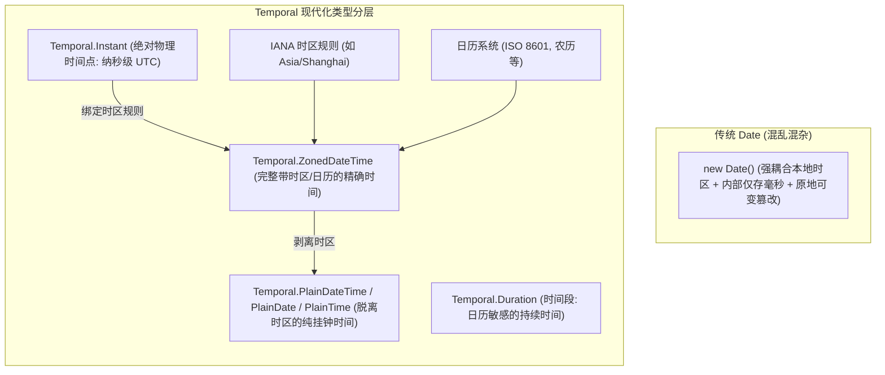

# 新特性✅

本模块系统性梳理 ECMAScript 在 2024 至 2026 年间达成 Stage 4 并落地标准的工业级核心演进特性。遵循黄金范例规范，以真实大厂高频面试场景为第一性原理进行拆解，涵盖异步调度控制、流式流处理、底层二进制零拷贝、高精度算术、跨环境运行时诊断与不可变数据演进。

---

## Promise.try() 解决了传统 Promise.resolve().then() 的什么痛点？ {#p0-promise-try}

<Answer>

**核心结论:**

`Promise.try()` 实现了 **“同步立即求值 + 异常统一提升为 Rejected Promise”** 的双重保障，彻底抹平了高阶函数中同步抛错与异步拒绝的处理鸿沟：
- **消除了微任务延迟**：与 `Promise.resolve().then(fn)` 强制将函数推迟到微任务队列不同，`Promise.try(fn)` 在当前事件循环 Tick 立即同步执行传入函数；
- **同步异常无缝捕获**：若函数体内部同步抛出异常（`throw new Error()`），无需手动包装 `try...catch`，引擎会自动将其转换为 Rejected Promise，并交由后续的 `.catch()` 链条统一兜底。

---

**原理解析:**

在封装高阶函数、插件生命周期或未知第三方回调时，调用方通常不知道传入的函数究竟是同步执行还是异步返回 Promise，甚至不知道它是否会在前置参数校验时抛出同步异常。以往开发者常使用以下两种妥协方案：

| 调用模式 | 同步异常处理 | 首次执行时序 | 评价与缺陷 |
| :--- | :--- | :--- | :--- |
| `Promise.resolve().then(fn)` | 被 catch 捕获 | **延迟到微任务** | 无法立即同步启动代码，破坏同步初始化的执行时序 |
| `new Promise(r => r(fn()))` | 被 catch 捕获 | **当前调用栈同步执行** | 语法繁琐冗长，闭包可读性差，类型推断易受干扰 |
| **`Promise.try(fn, ...args)`** | **被 catch 捕获** | **当前调用栈同步执行** | **最佳实践**：兼具同步立即调用的确定性与全链路异步错误捕获 |



`Promise.try` 的核心价值在于建立**统一调用入口**，它保证在当前 Tick 立即执行传入函数体，一旦该函数同步抛出异常，引擎会自动拦截该调用栈异常并将其提升为 Rejected Promise，防止同步调用栈崩溃中断外层代码。

---

**规范 TypeScript 代码实现:**

```typescript
// 安全包裹未知插件/用户配置，统一生命周期
interface PluginConfig {
  setup: () => void | Promise<void>;
  name: string;
}

export async function bootstrapPlugin(plugin: PluginConfig): Promise<{ success: boolean; name: string }> {
  // Promise.try 同步执行 plugin.setup()
  // 若 setup() 内同步 throw new Error('Invalid config')，自动转化为 Rejected Promise
  // 若 setup() 返回一个挂起的 Promise，则等待其决议
  return Promise.try(() => plugin.setup())
    .then(() => {
      return { success: true, name: plugin.name };
    })
    .catch((err: unknown) => {
      const message = err instanceof Error ? err.message : String(err);
      console.error('插件 [' + plugin.name + '] 初始化失败:', message);
      return { success: false, name: plugin.name };
    });
}
```

---

**面试官视角:**

- **核心考察点**：能否从底层事件循环（Microtask 入队时序）讲透 `Promise.try` 与 `Promise.resolve().then` 的根本差异，以及为什么它是处理同步/异步混合边界的最佳范式。
- **下探追问**：
  - *追问*：为什么说 `Promise.resolve().then(fn)` 无法完全替代 `Promise.try(fn)`？在哪些真实场景下这种微任务时序差异会导致严重的 Bug？
  - *回答要点*：若 `fn` 内部包含对调用时刻敏感的操作（如记录精确性能打点 `performance.now()`、检查当前 DOM 焦点状态、或者与同步执行的宿主流程进行强时序校验），`Promise.resolve().then` 会将 `fn` 的执行延后至下一个微任务周期。此时外部的同步代码已经执行完毕，执行环境可能已发生变更；而 `Promise.try(fn)` 确保了 `fn` 的同步部分立即在当前调用栈原位执行。

---

**延伸阅读:**

- [TC39 Proposal: Promise.try](https://github.com/tc39/proposal-promise-try)（Stage 4）
- [MDN Web Docs: Promise.try()](https://developer.mozilla.org/en-US/docs/Web/JavaScript/Reference/Global_Objects/Promise/try)

</Answer>

---

## 如何在 Promise 外部触发 resolve / reject？Promise.withResolvers() 是怎么设计的？ {#p0-promise-with-resolvers}

<Answer>

**核心结论:**

`Promise.withResolvers()` 是对传统 `new Promise((resolve, reject) => ...)` 构造函数模式的**控制反转（Inversion of Control）**：
- 它直接返回一个包含 `{ promise, resolve, reject }` 的解构三元组对象；
- 彻底根除了过去为了在外部异步事件或定时器中控制 Promise 状态，不得不声明外层可变变量（`let resolve;`）并破坏类型推断的繁琐样板代码。

---

**原理解析:**

在实现超时竞态、任务队列（Job Queue）、流式通道缓冲区以及基于事件的异步等待时，开发者此前必须依赖“延迟对象（Deferred Pattern）”的闭包技巧：

```typescript
// 传统历史写法：样板冗余，需要外部变量暂存与非空断言
let resolve!: (value: string) => void;
let reject!: (reason?: unknown) => void;
const promise = new Promise<string>((res, rej) => {
  resolve = res;
  reject = rej;
});
```

`Promise.withResolvers()` 规范由引擎在 C++ 底层调用 Promise 构造函数并拦截执行器参数，直接返回具有强类型签名的 `{ promise, resolve, reject }` 普通对象：
1. **解耦状态变更能力**：`resolve` 与 `reject` 成为第一公民函数，能够自由注入事件监听器、工作线程消息回调或取消令牌中；
2. **生命周期与权限分离**：可以仅将只读的 `promise` 暴露给下游调用方，而将触发决议的 `resolve` 控制权安全收敛在内部控制器中。

---

**规范 TypeScript 代码实现:**

```typescript
// 基于 withResolvers 构建可取消、支持外部决议的异步任务控制单元
export class AsyncDeferredTask<T> {
  public readonly promise: Promise<T>;
  public readonly resolve: (value: T | PromiseLike<T>) => void;
  public readonly reject: (reason?: unknown) => void;
  private timer: ReturnType<typeof setTimeout> | null = null;

  constructor(timeoutMs?: number) {
    const { promise, resolve, reject } = Promise.withResolvers<T>();
    this.promise = promise;
    this.resolve = resolve;
    this.reject = reject;

    if (timeoutMs !== undefined && timeoutMs > 0) {
      this.timer = setTimeout(() => {
        this.reject(new Error('任务在等待 ' + timeoutMs + 'ms 后超时'));
      }, timeoutMs);
    }
  }

  public complete(value: T): void {
    if (this.timer) clearTimeout(this.timer);
    this.resolve(value);
  }

  public fail(err: unknown): void {
    if (this.timer) clearTimeout(this.timer);
    this.reject(err);
  }
}
```

---

**面试官视角:**

- **核心考察点**：理解“控制反转（IoC）”在现代异步控制中的架构意义，能否熟练运用 `Promise.withResolvers` 封装事件监听与高并发任务队列。
- **加分项**：能够清晰指出 `Promise.withResolvers` 不仅适用于原生 Promise，还支持子类化继承（`CustomPromise.withResolvers()` 会调用其子类的构造函数创建对应实例）。

---

**延伸阅读:**

- [TC39 Proposal: Promise.withResolvers](https://github.com/tc39/proposal-promise-with-resolvers)（Stage 4, ES2024）
- [MDN Web Docs: Promise.withResolvers()](https://developer.mozilla.org/en-US/docs/Web/JavaScript/Reference/Global_Objects/Promise/withResolvers)

</Answer>

---

## 原生 Iterator Helpers 相比传统数组 map / filter 链式调用有什么优势？ {#p1-iterator-helpers}

<Answer>

**核心结论:**

原生 Iterator Helpers 为 `Iterator.prototype` 引入了惰性流式算子（`.map()`, `.filter()`, `.take()`, `.drop()`, `.flatMap()` 等），带来了两项革命性突破：
- **空间复杂度从 $O(N)$ 降至 $O(1)$**：传统数组的 `.map().filter()` 链式调用会在每个阶段分配完整的中间临时数组，造成高昂的堆内存占用与频繁 GC；Iterator Helpers 采用**拉取模型（Pull-based Lazy Evaluation）**，元素单项穿透整条流水线，零中间数组分配；
- **原生支持无限序列与确定性资源回收**：支持对无限生成器进行流式处理，并在 `.take(n)` 完成后自动触发底层迭代器的 `.return()` 释放底层文件或网络资源句柄。

---

**原理解析:**



`Iterator Helpers` 引入的标准方法包含：
- **流式变换**：`.map(mapper)`、`.filter(predicate)`、`.flatMap(mapper)`
- **流式截断与切片**：`.take(limit)`、`.drop(limit)`
- **终端消费与聚合**：`.reduce(reducer, initial)`、`.toArray()`、`.forEach(fn)`、`.some(fn)`、`.every(fn)`、`.find(fn)`
- **提升工厂**：`Iterator.from(iterable)`，可将任意原生 `Set`、`Map`、生成器（Generator）或自定义 Iterable 包装为标准 Iterator Helper 实例。

---

**规范 TypeScript 代码实现:**

```typescript
// 模拟无限数字序列生成器
function* naturalNumbers(): Generator<number, void, unknown> {
  let n = 1;
  while (true) {
    yield n++;
  }
}

// 基于 Iterator Helpers 构建低内存流式分析管道
export function computeTopEvenSquares(): number[] {
  // Iterator.from 可包装生成器或任何可迭代对象
  return Iterator.from(naturalNumbers())
    .filter((x: number) => x % 2 === 0)   // 仅过滤偶数
    .map((x: number) => x * x)            // 计算平方
    .drop(10)                             // 跳过前 10 个命中项
    .take(5)                              // 截取接下来 5 项后立即终止流
    .toArray();                           // 终端求值：输出结果数组
}

// 实际执行仅拉取并运算了前 30 个自然数，无额外中间数组开销
```

---

**面试官视角:**

- **核心考察点**：对比及早求值（Eager）与惰性拉取（Lazy Pull）在内存拓扑、中间分配与 GC 压力上的本质区别。
- **下探追问**：
  - *追问*：原生 `Iterator Helpers` 能否完全替代 RxJS？两者的核心分界在哪里？
  - *回答要点*：不能完全替代。Iterator Helpers 是**同步/异步拉取模型（Pull-based）**，适合确定性数据流、分页查询和数学计算管道；RxJS 是基于观察者模式的**推送模型（Push-based）**，核心长处在于处理随时可能触发的离散异步事件（如用户点击防抖、WebSocket 消息、多流合并与竞态消歧）。

---

**延伸阅读:**

- [TC39 Proposal: Iterator Helpers](https://github.com/tc39/proposal-iterator-helpers)（Stage 4, ES2025）
- [MDN Web Docs: Iterator](https://developer.mozilla.org/en-US/docs/Web/JavaScript/Reference/Global_Objects/Iterator)

</Answer>

---

## Set 新增了哪些原生集合操作（交集、并集、差集等）？以前是怎么实现的？ {#p1-set-methods}

<Answer>

**核心结论:**

ES2025 正式为 `Set.prototype` 引入了 7 个原子化数学集合运算方法：
- **并集** `setA.union(setB)`
- **交集** `setA.intersection(setB)`
- **差集** `setA.difference(setB)`
- **对称差集** `setA.symmetricDifference(setB)`
- **子集判定** `setA.isSubsetOf(setB)`
- **超集判定** `setA.isSupersetOf(setB)`
- **互斥判定** `setA.isDisjointFrom(setB)`

彻底废弃了以往通过扩展运算符解构为临时数组（`[...setA].filter(x => setB.has(x))`）导致双重内存开销的反模式，且规范引擎会在底层对集合大小进行**尺寸感知自动调优**。

---

**原理解析:**

以往计算集合运算需要借助 `[...setA].filter(x => setB.has(x))` 等黑魔法，经过“Set 到 Array 再回 Set”的多次解构和哈希重建，耗时且增加无谓内存。

现代标准提供了 7 个原生数学集合方法：
1. **`setA.union(setB)`**：并集 $A \cup B$。
2. **`setA.intersection(setB)`**：交集 $A \cap B$。
3. **`setA.difference(setB)`**：差集 $A \setminus B$（属于 A 但不属于 B 的元素）。
4. **`setA.symmetricDifference(setB)`**：对称差集 $A \triangle B$（属于 A 或 B 但不同时属于两者的元素）。
5. **`setA.isSubsetOf(setB)`**：子集判定 $A \subseteq B$。
6. **`setA.isSupersetOf(setB)`**：超集判定 $A \supseteq B$。
7. **`setA.isDisjointFrom(setB)`**：互斥判定 $A \cap B = \emptyset$。

**性能优化与 Set-like 协议**：
所有方法入参不仅限于原生 `Set` 实例，任何具有 `size` 属性以及 `has()` 和 `keys()` 方法的对象（如自定义布隆过滤器、只读视图）均可作为入参。引擎内部会对较小集合进行遍历：例如在计算 `intersection` 时，若 `setA.size > setB.size`，算法内部会自动遍历较小的 `setB` 并查询 `setA.has()`，保证运算效率达到最优。

---

**规范 TypeScript 代码实现:**

```typescript
type Permission = 'read' | 'write' | 'delete' | 'audit' | 'export';

export class RBACEngine {
  private userPermissions: Set<Permission>;

  constructor(permissions: Iterable<Permission>) {
    this.userPermissions = new Set(permissions);
  }

  // 校验用户是否满足执行目标操作的所有必需权限 (子集判定)
  public hasAllPermissions(required: Set<Permission>): boolean {
    return required.isSubsetOf(this.userPermissions);
  }

  // 计算多角色叠加合并后的最终有效权限 (并集)
  public static mergeRoles(roleA: Set<Permission>, roleB: Set<Permission>): Set<Permission> {
    return roleA.union(roleB);
  }

  // 获取用户缺失的权限清单 (差集)
  public getMissingPermissions(required: Set<Permission>): Set<Permission> {
    return required.difference(this.userPermissions);
  }

  // 审计分析：找出两个权限版本间的变更点 (对称差集：新增或删除的权限)
  public static auditDiff(prev: Set<Permission>, next: Set<Permission>): Set<Permission> {
    return prev.symmetricDifference(next);
  }
}
```

---

**面试官视角:**

- **核心考察点**：能否掌握 Set 集合运算的时间复杂度优化原理，以及 Set-like 鸭子类型的规范契约。
- **下探追问**：
  - *追问*：原生 Set 集合运算对于对象的比较，是按值比较还是按引用比较？
  - *回答要点*：沿用 JavaScript 原生 Set 的 `SameValueZero` 算法，对对象类型一律基于引用比较，不进行深度属性相等性对比；对 `NaN` 与 `NaN` 视为相等，`+0` 与 `-0` 视为相等。

---

**延伸阅读:**

- [TC39 Proposal: New Set Methods](https://github.com/tc39/proposal-set-methods)（Stage 4, ES2025）
- [MDN Web Docs: Set Methods](https://developer.mozilla.org/en-US/docs/Web/JavaScript/Reference/Global_Objects/Set)

</Answer>

---

## ArrayBuffer 怎么实现零拷贝转移？ArrayBuffer.prototype.transfer() 解决了什么问题？ {#p0-arraybuffer-transfer}

<Answer>

**核心结论:**

`ArrayBuffer.prototype.transfer()` 与 `transferToFixedLength()` 为 JavaScript 引入了系统级语言才具备的**内存所有权转移（Ownership Transfer）**与**原地扩缩容（In-place Reallocation）**原语：
- **$O(1)$ 指针转移替代 $O(N)$ 深拷贝**：将底层堆外物理内存指针直接移交新对象，彻底杜绝了大二进制文件处理与 WebAssembly 内存交换时的二次内存拷贝峰值；
- **源缓冲区安全分离（DetachedBuffer）**：转移后原 ArrayBuffer 的 `byteLength` 瞬间置为 0 且 `detached === true`，彻底从语言层杜绝了双重释放（Double Free）与悬挂指针（Dangling Pointer）并发读写冲突。

---

**原理解析:**

在 V8 或 JavaScriptCore 等现代引擎内部，一个 `ArrayBuffer` 由两部分组成：
1. **JS 封装对象（Wrapper Object）**：位于 V8 堆内的小型对象头，记录 byteLength、配置标记以及指向堆外真实内存的指针；
2. **底层支撑存储区（Backing Store）**：由操作系统的虚拟内存分配器（如 `malloc` / `mmap`）在堆外分配的连续物理字节块。



在调用 `A.transfer()` 的瞬间：
1. 引擎执行 C++ 层的指针移交，将 Backing Store 的内存地址直接赋值给新的 ArrayBuffer `B`；
2. 原始 `A` 的底层指针被置为 `nullptr`，其内部槽被置为 Detached 状态；
3. 任何后续试图对 `A` 进行读取或写入的操作（包括通过之前的 TypedArray 视图）都会立即抛出 `TypeError: Cannot perform ... on a detached ArrayBuffer`。

---

**规范 TypeScript 代码实现:**

```typescript
// 大文件分块流式解析与内存安全流转控制器
export class ZeroCopyStreamProcessor {
  private buffer: ArrayBuffer;

  constructor(initialSize: number) {
    this.buffer = new ArrayBuffer(initialSize);
  }

  // 原地扩容：模拟动态追加网络数据块
  public ensureCapacity(requiredBytes: number): void {
    if (this.buffer.byteLength < requiredBytes) {
      const newCapacity = Math.max(this.buffer.byteLength * 2, requiredBytes);
      // 原地/虚拟内存页扩容：避免深拷贝旧数据
      this.buffer = this.buffer.transfer(newCapacity);
      console.log('ArrayBuffer 零拷贝平滑扩容至:', this.buffer.byteLength);
    }
  }

  // 移交所有权给外部消费方（如 Web Worker 或 WebGPU Buffer）
  public detachAndHandoff(): ArrayBuffer {
    // transfer() 将当前内部 buffer 游离，并返回接管所有权的新实例
    const transferable = this.buffer.transfer();
    console.assert(this.buffer.detached, '原缓冲区必须已处于 Detached 状态');
    return transferable;
  }
}
```

---

**面试官视角:**

- **核心考察点**：能否讲清 JavaScript 堆内对象与堆外 Backing Store 的两层映射结构，以及 DetachedBuffer 的本质防卫机制。
- **下探追问**：
  - *追问*：`worker.postMessage(data, [data.buffer])` 也可以实现 Transferable，为什么还需要原生的 `transfer()` 方法？
  - *回答要点*：`postMessage` 的 Transfer 列表仅限于跨进程/跨 Worker 的通信信道；而 `ArrayBuffer.prototype.transfer()` 是在**同一个 JavaScript 执行线程内**的原语。它使得单线程内的原地扩缩容（相当于 C 语言的 `realloc`）、不可变切片收敛以及框架层生命周期所有权交割成为可能。

---

**延伸阅读:**

- [TC39 Proposal: ArrayBuffer.prototype.transfer](https://github.com/tc39/proposal-arraybuffer-transfer)（Stage 4, ES2024）
- [MDN Web Docs: ArrayBuffer.prototype.transfer()](https://developer.mozilla.org/en-US/docs/Web/JavaScript/Reference/Global_Objects/ArrayBuffer/transfer)

</Answer>

---

## 前端如何原生将 TypedArray / 二进制转为 Base64？为什么以前用 btoa() 会乱码？ {#p1-uint8array-base64}

<Answer>

**核心结论:**

ECMAScript 原生引入了 `Uint8Array.fromBase64()`、`bytes.toBase64()` 以及 Hex 编解码套件（`fromHex`/`toHex`）：
- **彻底解决 Latin1 乱码**：传统 `btoa()` 只能接收 ASCII/Latin1 单字节字符串（字符编码 $\le 255$），处理 UTF-8 中文字符串或任意二进制时必须用 `encodeURIComponent` 等迂回黑魔法，极易发生溢出报错与乱码；
- **消除了环境割裂与性能瓶颈**：以往前端需借助 FileReader 异步转换或额外打包第三方 polyfill，Node.js 则绑定专有 `Buffer.from()`。原生 API 提供同步执行、基于 C++ 底层与 SIMD 指令向量化加速的最高性能。

---

**原理解析:**

以往前端生态在处理二进制与 Base64/Hex 互转时存在三大历史包袱：
1. `window.btoa()` 与 `window.atob()` 属于历史遗留的 HTML DOM 规范，在 Node.js 或纯 Worker 中并非标配；且其只支持 `0x00 - 0xFF` 范围的单字节字符，处理 UTF-8 多字节中文会直接抛出 `InvalidCharacterError`；
2. 依赖三方库或自己手写查表循环，纯 JS 迭代大数组时无法利用 CPU 现代向量化（AVX2/NEON）指令加速；
3. `FileReader.readAsDataURL` 强制引入异步事件回调，破坏同步调用流程。



---

**规范 TypeScript 代码实现:**

```typescript
export class NativeBinaryCodec {
  // 原生二进制转标准 Base64 或 URL 安全 Base64
  public static encode(data: Uint8Array, urlSafe = false): string {
    return data.toBase64({
      alphabet: urlSafe ? 'base64url' : 'base64',
      omitPadding: urlSafe,
    });
  }

  // 原生 Base64 还原为 Uint8Array
  public static decode(base64Str: string): Uint8Array {
    return Uint8Array.fromBase64(base64Str, {
      alphabet: 'base64',
      lastChunkHandling: 'loose', // 宽松容错解析尾部补齐等号
    });
  }

  // 原生 Hex 十六进制转换（常用于加密摘要哈希展示）
  public static toHexHash(data: Uint8Array): string {
    return data.toHex();
  }
}
```

---

**面试官视角:**

- **核心考察点**：理解 Base64 编码的 6-bit 映射本质，掌握为什么 `btoa()` 无法安全处理 UTF-8 字符集，熟悉跨端现代标准的演进。
- **延伸追问**：
  - *追问*：URL 安全的 Base64（`base64url`）和普通 `base64` 有什么字符差异？
  - *回答要点*：普通 Base64 包含 `+` 和 `/` 两个字符，并在末尾使用 `=` 作为填充符；而这三个符号在 URL Query 和路径中有特殊保留语义，会破坏 URL 解析。`base64url` 将 `+` 替换为 `-`，将 `/` 替换为 `_`，并通常省略末尾的 `=` 填充符。

---

**延伸阅读:**

- [TC39 Proposal: Uint8Array to/from Base64 and Hex](https://github.com/tc39/proposal-arraybuffer-base64)（Stage 4, ES2025）
- [MDN Web Docs: Uint8Array.prototype.toBase64()](https://developer.mozilla.org/en-US/docs/Web/JavaScript/Reference/Global_Objects/Uint8Array/toBase64)

</Answer>

---

## Float16Array 是什么？为什么在 WebGL、WebGPU 和端侧 AI 中如此重要？ {#p1-float16-array}

<Answer>

**核心结论:**

`Float16Array` 遵循 IEEE 754-2008 标准，引入了 16 位半精度浮点 TypedArray：
- **显存与带宽消耗直降 50%**：每个半精度浮点仅占用 2 个字节（相比 `Float32Array` 的 4 字节节省一半），在端侧大语言模型（WebLLM）、端侧卷积推理（ONNX Runtime Web）中直接将模型权重体积削减 50%；
- **与硬件着色器零转换对接**：现代 GPU 原生原生支持半精度运算，`Float16Array` 可直接与 WebGPU（WGSL `f16` 扩展）与 WebGL 纹理数据对接，杜绝了过去由于 CPU/GPU 精度不匹配在端侧做的二次逐像素格式转换。

---

**原理解析:**

| 浮点类型 | 符号位 (Sign) | 指数位 (Exponent) | 尾数精度位 (Mantissa) | 单元素内存占用 | 动态数值范围 |
| :--- | :--- | :--- | :--- | :--- | :--- |
| `Float16Array` | 1 bit | 5 bit | 10 bit | **2 Bytes (16-bit)** | $\approx 6 \times 10^{-5}$ 至 $6.5 \times 10^4$ |
| `Float32Array` | 1 bit | 8 bit | 23 bit | **4 Bytes (32-bit)** | $\approx 1.4 \times 10^{-45}$ 至 $3.4 \times 10^{38}$ |

在端侧运行轻量 LLM（如 1B~3B 参数）或向量检索模型时，移动端浏览器的 32 位堆内存上限（通常为 1.5GB~2GB）极易触发 OOM 崩溃。半精度浮点虽然牺牲了超高精度尾数，但完全满足深度学习矩阵乘法的容错要求，是将大型权重留在端侧显存/内存中的核心支柱。

---

**规范 TypeScript 代码实现:**

```typescript
// WebGPU / 端侧 AI 半精度张量缓冲区分配
export class HalfPrecisionTensor {
  public readonly data: Float16Array;
  public readonly byteLength: number;

  constructor(size: number) {
    // 实例化半精度浮点数组：每个元素 2 字节
    this.data = new Float16Array(size);
    this.byteLength = this.data.byteLength;
    console.assert(this.byteLength === size * 2, '半精度内存必须严格为元素数的 2 倍');
  }

  // 批量填充归一化浮点特征值
  public populate(values: number[]): void {
    for (let i = 0; i < values.length; i++) {
      this.data[i] = values[i];
    }
  }
}
```

---

**面试官视角:**

- **核心考察点**：考查候选人对前端高性能计算（WebAssembly、WebGPU、端侧大模型）底层内存与浮点精度的理解，是否具备架构端侧重型应用时的显存治理意识。

---

**延伸阅读:**

- [TC39 Proposal: Float16Array](https://github.com/tc39/proposal-float16array)（Stage 3 / Stage 4 标准落地）
- [MDN Web Docs: Float16Array](https://developer.mozilla.org/en-US/docs/Web/JavaScript/Reference/Global_Objects/Float16Array)

</Answer>

---

## 为什么跨 iframe 时 instanceof Error 会失效？Error.isError() 是如何判别的？ {#p0-error-is-error}

<Answer>

**核心结论:**

`Error.isError()` 彻底解决了 JavaScript 跨执行上下文（跨 Realm，如主窗口与 iframe、Web Worker、ShadowRealm 或 Node.js `vm` 沙箱）时，传统 `err instanceof Error` 判定失效的历史顽疾：
- **`instanceof` 的原型链缺陷**：不同 Realm 拥有各自独立的全局作用域与内建对象原型链副本，子 iframe 中抛出的 `iframeWindow.Error` 并不继承自宿主环境的 `window.Error.prototype`，导致 `instanceof` 恒返回 `false`；
- **基于内部槽（Internal Slot）的准确判别**：`Error.isError()` 由引擎底层直接校验对象是否具有代表系统原生异常的 `[[ErrorData]]` 内部槽，不受跨 Realm 原型链割裂与自定义伪造对象的干扰。

---

**原理解析:**



在 ES 规范中：
- 数组通过 `Array.isArray()` 来跨 Realm 识别，其底层依赖于检验内部槽 `[[ArrayData]]`；
- 而长期以来 `Error` 没有对应的原生静态方法，开发者只能依赖脆弱的字符串匹配 `Object.prototype.toString.call(err) === '[object Error]'`，这极易被用户自定义的 `Symbol.toStringTag` 所欺骗；
- `Error.isError(value)` 作为规范基石正式补齐，成为唯一兼顾跨 Realm 与抗伪造攻击的标准方法。

---

**规范 TypeScript 代码实现:**

```typescript
// 跨沙箱与微前端异常防御网关
export class CrossRealmErrorGuard {
  public static normalizeError(candidate: unknown): Error {
    // 跨 iframe / 沙箱环境下，传统的 candidate instanceof Error 经常误判为 false
    if (Error.isError(candidate)) {
      // 安全确认为合法的 Error 实例（无论来自哪个 Realm）
      return candidate as Error;
    }

    // 处理字符串或非标准错误对象
    if (typeof candidate === 'string') {
      return new Error(candidate);
    }

    return new Error('未知异常: ' + String(candidate));
  }
}
```

---

**面试官视角:**

- **核心考察点**：理解 JavaScript Realm（执行领域）与原型链的关系，能否准确指出跨上下文通信中对象标识的隔离性问题，体现高阶框架与微前端沙箱架构深度。
- **下探追问**：
  - *追问*：除了 `Error.isError` 和 `Array.isArray`，跨 Realm 还会导致哪些常见判定失效？
  - *回答要点*：所有的内置构造函数 `instanceof`（如 `instanceof RegExp`、`instanceof Date`、`instanceof Promise`）在跨 Realm 时都会失效。这也是为什么现代库在判断 Promise 时优先采用**鸭子类型（Duck Typing）**（检测 `then` 是否为函数），以及为什么 TC39 在逐步为核心类型补齐原生诊断方法。

---

**延伸阅读:**

- [TC39 Proposal: Error.isError](https://github.com/tc39/proposal-is-error)（Stage 4）
- [TC39 Execution Realms Specification](https://tc39.es/ecma262/#sec-code-realms)

</Answer>

---

## 0.1 + 0.2 的高精度累加问题，除了 bignumber.js 还有什么新方案？Math.sumPrecise() 是什么？ {#p1-math-sum-precise}

<Answer>

**核心结论:**

`Math.sumPrecise()` 是 ECMAScript 为解决浮点数累加时 IEEE 754 舍入误差累积问题引入的原生高精度求和算法：
- **无损精确累加**：接收一个数字序列的可迭代对象（`Iterable<number>`），在引擎内部采用 **Shewchuk 浮点扩展求和算法**，保证中间所有阶段的低位舍入误差不丢失；
- **零额外对象分配**：无需引入笨重的第三方高精度库（如 `decimal.js`、`bignumber.js`）或生成大量大整数包装对象，执行效率比纯 JS 模拟高出两个数量级。

---

**原理解析:**

在 IEEE 754 双精度 64 位浮点数下，由于十进制小数（如 `0.1` 和 `0.2`）转化为二进制时是无限循环小数，只能保留 53 位有效尾数，直接相加必然产生精度微小截断（`0.1 + 0.2 === 0.30000000000000004`）。

当在前端进行财务对账、数据可视化折线图聚合或科学计算时，数十万个浮点数连续调用 `array.reduce((a, b) => a + b)` 会导致**截断误差急剧放大**。

`Math.sumPrecise()` 的核心实现机制：
1. 维护一个由不重叠浮点数组成的非连续误差吸收缓冲池（Partial Sums）；
2. 每次加入新数字时，利用硬件原生浮点单元（FPU）执行补偿累加（Two-Sum 原语），将主求和溢出的微小误差精确沉淀在误差列表中；
3. 仅在最后一步将整个缓冲池收敛为最终的单一双精度浮点数，达到数学上最接近真实算术结果的浮点舍入。

---

**规范 TypeScript 代码实现:**

```typescript
export class PreciseFinancialAggregator {
  // 对多笔金融流水进行高精度对账累加
  public static calculateAccountBalance(transactions: number[]): number {
    // 传统 reduce: 累加微小误差被逐步放大，导致对账失平
    // const badTotal = transactions.reduce((sum, val) => sum + val, 0);

    // 现代规范原生方案：Shewchuk 算法内部无损吸收精度
    const exactTotal = Math.sumPrecise(transactions);
    return exactTotal;
  }
}

// 精度验证
const values = [0.1, 0.2, -0.3];
console.log('传统累加结果:', values.reduce((a, b) => a + b, 0)); // 5.551115123125783e-17 (非零脏值)
console.log('Math.sumPrecise 结果:', Math.sumPrecise(values));   // 0 (绝对精确归零)
```

---

**面试官视角:**

- **核心考察点**：不仅能背出 `0.1 + 0.2 !== 0.3` 的二进制转换成因，还能从数值分析角度阐述累加过程中误差放大的机理与原生解决手段。

---

**延伸阅读:**

- [TC39 Proposal: Math.sumPrecise](https://github.com/tc39/proposal-math-sum)（Stage 4, ES2025）
- [Jonathan Richard Shewchuk: Adaptive Precision Floating-Point Arithmetic](https://www.cs.cmu.edu/~quake/robust.html)

</Answer>

---

## 在复杂的异步调用栈（setTimeout/await）中如何隐式透传 TraceId？AsyncContext 原理是什么？ {#p0-async-context}

<Answer>

**核心结论:**

`AsyncContext` 规范是 TC39 为 JavaScript 异步执行模型量身定制的**跨异步调用上下文隐式传递标准**（终结了历史包袱沉重的 Zone.js）：
- **全异步栈穿透**：通过 `AsyncContext.Variable`，在无需将 `traceId`、`tenantId` 或用户会话凭证显式作为函数入参层层传递的前提下，实现跨 `await`、Promise 链、`setTimeout`、事件回调的透明向下继承；
- **告别全局猴子补丁（Monkey Patching）**：以往 Angular/Zone.js 需要劫持浏览器全量异步 API（覆盖所有计时器和 Promise），性能开销巨大且与原生 `async/await` 存在深层语义冲突；AsyncContext 由引擎原生追踪异步因果调用图，开销极低且完全符合规范标准。

---

**原理解析:**

在分布式链路追踪（APM）和全链路监控场景中，每一个前端请求或用户交互动作都会生成一个唯一的链路标识 `traceId`。



`AsyncContext` 核心包含两大原生基语：
1. **`AsyncContext.Variable<T>`**：类似线程局部存储（Thread-Local Storage），定义一个能够在异步因果树上传播的变量；
2. **`AsyncContext.Snapshot`**：捕获当前时刻所有活跃异步上下文的快照，允许在任意延迟回调中恢复（Restore）当时的上下文环境。

---

**规范 TypeScript 代码实现:**

```typescript
// 1. 定义全链路追踪上下文变量
const currentTraceContext = new AsyncContext.Variable<{ traceId: string; user: string }>();

export class APMTracer {
  // 为指定操作包裹追踪上下文
  public static traceScope<R>(traceId: string, user: string, fn: () => Promise<R>): Promise<R> {
    return currentTraceContext.run({ traceId, user }, fn);
  }

  // 任意深层业务函数内部无需传递参数，直接读取当前上下文
  public static logWithContext(message: string): void {
    const ctx = currentTraceContext.get();
    const traceId = ctx?.traceId ?? 'NO_TRACE_ID';
    console.log('[' + traceId + '] ' + message);
  }
}

// 模拟深层异步嵌套调用
async function processOrder(): Promise<void> {
  APMTracer.logWithContext('开始处理订单'); // [TR-10086] 开始处理订单
  
  await new Promise(resolve => setTimeout(resolve, 50));
  
  // 跨越 await 与微任务边界，traceId 依然自动保留！
  APMTracer.logWithContext('订单数据库事务提交'); // [TR-10086] 订单数据库事务提交
}
```

---

**面试官视角:**

- **核心考察点**：深入考查全链路监控系统的架构设计能力，理解为什么 Zone.js 无法优雅支持原生 `async/await`（因为原生字节码级别的 await 恢复并不触发宿主打补丁的 Promise API），讲清引擎原生异步上下文追踪的不可替代性。

---

**延伸阅读:**

- [TC39 Proposal: AsyncContext](https://github.com/tc39/proposal-async-context)（Stage 2 / Stage 3 标准推进）
- [Node.js AsyncLocalStorage 工业级映射](https://nodejs.org/api/async_context.html)

</Answer>

---

## 为什么说 JavaScript 的 Date 对象设计存在严重缺陷？Temporal 是如何解决的？ {#p0-temporal-vs-date}

<Answer>

**核心结论:**

`Date` 是 JavaScript 历史上公认最糟糕的设计之一（1995 年仓促移植自 Java 1.0 的 `java.util.Date`），存在五大致命缺陷；现代标准落地引入的 `Temporal` 是一套全新、不可变、现代化的日期时间 API 引擎：
- **不可变值对象（Immutable by Design）**：彻底终结 `date.setMonth()` 原地篡改内部状态导致的隐蔽副作用，所有变更一律返回全新对象；
- **严格区分时间概念维度**：彻底拆分为 `Temporal.Instant`（纳秒级绝对时间戳）、`Temporal.ZonedDateTime`（带时区时间）、`Temporal.PlainDate`（纯日期）等独立正交类型，彻底解决月份从 0 开始计数、跨国时区混乱与夏令时跳跃等痛点。

---

**原理解析:**

传统 `Date` 的核心缺陷矩阵与 `Temporal` 的对齐治理方案：

| 缺陷维度 | 传统 `Date` 的设计败笔 | `Temporal` 的架构演进与治理 |
| :--- | :--- | :--- |
| **可变性** | 易变引用（Mutable），`setFullYear()` 会直接破坏调用方的对象 | **纯粹不可变（Immutable）**，所有方法均返回全新实例 |
| **概念混淆** | 单一对象强行绑定了“毫秒时间戳”与“客户端本地时区显示” | **概念正交分离**：绝对时间戳（`Instant`）与日历时间（`Plain*`）解耦 |
| **时区支持** | 仅支持宿主操作系统本地时区和 UTC，无法自由设置任意时区运算 | 原生一等公民支持 IANA 时区（如 `America/New_York`、`Asia/Shanghai`） |
| **夏令时（DST）** | 夏令时跳跃或重叠时出现隐式跳票或时间倒流 Bug | 内置 `disambiguation` 策略（`compatible`、`earlier`、`later`、`reject`） |
| **API 反直觉** | 月份从 0 开始（`0` 代表一月），年份从 1900 偏移（`getYear()`） | 严格符合人类心智：月份为 1~12，日期计算具备完整的日历感知语义 |



---

**规范 TypeScript 代码实现:**

```typescript
// 基于 Temporal 构建跨国结算与会议调度中心
export class InternationalSchedulingService {
  public static scheduleGlobalMeeting(
    organizerDate: string,      // 例如 '2026-03-08'
    organizerTime: string,      // 例如 '14:00:00'
    organizerTimeZone: string,  // 例如 'America/New_York' (当天正值夏令时跳变日)
    attendeeTimeZone: string    // 例如 'Asia/Shanghai'
  ): {
    nyTime: string;
    shanghaiTime: string;
    durationToMeeting: string;
  } {
    // 1. 创建发起地的本地挂钟时间
    const plainDateTime = Temporal.PlainDateTime.from(organizerDate + 'T' + organizerTime);

    // 2. 将挂钟时间绑定至发起地时区，生成绝对精确的 ZonedDateTime
    // 若当天 02:00 跳跃至 03:00，disambiguation 默认的 'compatible' 自动安全处理
    const nyZoned = plainDateTime.toZonedDateTime(organizerTimeZone, {
      disambiguation: 'compatible',
    });

    // 3. 转换至参会者时区（保持同一绝对物理时间点，仅转换挂钟表现形式）
    const shanghaiZoned = nyZoned.withTimeZone(attendeeTimeZone);

    // 4. 计算当前时刻距离会议还有多久（纳秒级物理时间差，转化为结构化 Duration）
    const now = Temporal.Now.zonedDateTimeISO(organizerTimeZone);
    const timeUntilMeeting = nyZoned.since(now, {
      largestUnit: 'day',
      smallestUnit: 'minute',
      roundingMode: 'halfExpand',
    });

    return {
      nyTime: nyZoned.toString(),
      shanghaiTime: shanghaiZoned.toString(),
      durationToMeeting: timeUntilMeeting.toString(),
    };
  }
}
```

---

**面试官视角:**

- **核心考察点**：条理分明地列举传统 `Date` 对象的痛点，深入掌握 `Temporal` 的类型分层体系，清晰区分 `Temporal.Instant`（物理时间点）与 `Temporal.PlainDateTime`（挂钟时间）的概念边界。
- **下探追问**：
  - *追问*：为什么 `Temporal.Duration` 不能直接转为一个固定且绝对的毫秒数进行简单运算？
  - *回答要点*：因为时间的物理持续性并不等于日历的均匀性。“1 个月”可能包含 28、29、30 或 31 天；“1 天”在夏令时跳变日可能只有 23 小时或 25 小时。如果不指定基准时间点（`relativeTo`），“增加 1 个月”在物理时间轴上没有确定长度。Temporal 强制日历单位运算依赖上下文，从数学根基上排除了跨月累加漂移的 Bug。

---

**延伸阅读:**

- [TC39 Proposal: Temporal](https://github.com/tc39/proposal-temporal)（Stage 3 / Stage 4 标准落地）
- [MDN Web Docs: Temporal Documentation](https://developer.mozilla.org/en-US/docs/Web/JavaScript/Reference/Global_Objects/Temporal)

</Answer>

---

## 什么是 Records & Tuples？它和 Object.freeze() 有什么本质区别？ {#p1-records-tuples}

<Answer>

**核心结论:**

Records & Tuples 为 JavaScript 带来了**深度不可变的复合值类型（Deeply Immutable Compound Primitives）**：
- **语法标志**：Record 使用 `#{ a: 1 }`，Tuple 使用 `#[ 1, 2, 3 ]`；
- **与 `Object.freeze()` 的本质区别**：`Object.freeze()` 冻结的对象依然是引用类型（Identity-based），全等比较（`===`）比对的是内存引用地址，且只实现浅冻结（Shallow Freeze）；而 Records & Tuples 是**原始数据类型（Value-based Primitives）**，天生深度不可变，且支持基于结构的真正**深度全等比对（`===` 返回 `true`）**。

---

**原理解析:**

```mermaid
flowchart LR
    subgraph ObjectFreeze["传统 Object.freeze(obj)"]
        direction TB
        Ref1["对象引用 A (内存地址 0x01)"]
        Ref2["对象引用 B (内存地址 0x02)"]
        Ref1 -. "=== 恒返回 false (基于地址比较)" .- Ref2
        Shallow["仅顶层只读，深层 obj.nested 仍可被意外修改"]
    end

    subgraph RecordsTuples["现代 Records & Tuples (复合值类型)"]
        direction TB
        Val1["Record A: #{ x: 1, y: 2 }"]
        Val2["Record B: #{ x: 1, y: 2 }"]
        Val1 == "=== 瞬时返回 true (深度按值比较，O(1) 哈希驻留)" == Val2
        Deep["天生深度不可变，封禁放入任何可变对象引用"]
    end
```

在前端状态管理（如 React、Redux、Zustand）中，为了检测状态树是否变化，长期以来必须通过纯函数浅拷贝配合 `Immutable.js` 或 `Immer` 等外部库来维持不可变性。
当 Records & Tuples 原生落地后：
1. **$O(1)$ 复杂状态比较**：引擎底层采用符号驻留（Interning）与结构共享哈希（Hash Consing），两份即使分别生成的庞大 Record，只要结构与数据完全一致，`===` 能够在常数级时间判定相等；
2. **零副作用安全**：Record 和 Tuple 中严禁塞入普通对象、数组等可变引用，一旦尝试嵌入可变对象，引擎会立即在运行时抛出 `TypeError`，从语法层面构建强免疫边界。

---

**规范 TypeScript / JavaScript 代码实现:**

```javascript
// Records & Tuples 深度不可变与按值比较示范
export function demonstrateRecordsTuples() {
  const stateSnapshot1 = #{
    user: #{ id: 101, name: 'Alice' },
    permissions: #['read', 'write'],
    config: #{ theme: 'dark', notifications: true }
  };

  const stateSnapshot2 = #{
    user: #{ id: 101, name: 'Alice' },
    permissions: #['read', 'write'],
    config: #{ notifications: true, theme: 'dark' } // 属性键书写顺序不同
  };

  // 1. 原生全等比较：瞬时完成深度按值对比，返回 true！
  console.log('结构化按值对比结果:', stateSnapshot1 === stateSnapshot2); // true

  // 2. 封禁可变引用注入边界
  try {
    const invalidRecord = #{
      title: 'Invalid',
      items: [1, 2, 3] // 抛出 TypeError: Cannot contain mutable objects
    };
  } catch (err) {
    console.error('成功拦截可变引用嵌入:', err instanceof TypeError); // true
  }
}
```

---

**面试官视角:**

- **核心考察点**：从计算机内存寻址模型解释引用标识（Identity）与原始值（Value）的根本界限，掌握 Records & Tuples 在现代前端渲染管线（React 组件 props 记忆化优化）中的颠覆性价值。
- **下探追问**：
  - *追问*：在 Record 或 Tuple 中，是否允许包含 `Symbol` 类型的键或值？
  - *回答要点*：允许包含已注册的 Symbol（如 `Symbol.for(...)`）作为值，但普通未注册 Symbol 具备全局唯一的引用标识。Record 的键目前限定必须为字符串（String），以保持与 JSON 语义的高互操作性。

---

**延伸阅读:**

- [TC39 Proposal: Records & Tuples](https://github.com/tc39/proposal-record-tuple)（Stage 2）
- [TC39 Stage Process & Immutable Primitives](https://tc39.es/)

</Answer>
