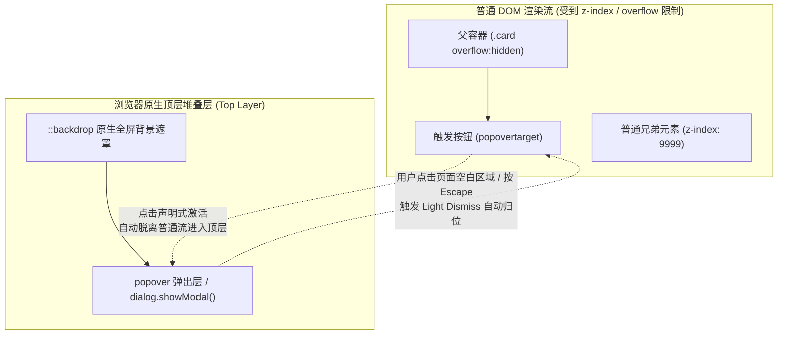
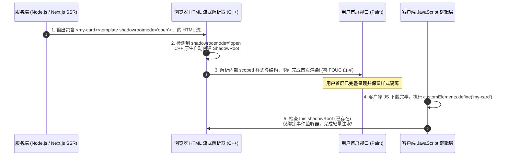

# 内容元素✅

## 简述 `<iframe>` 的优缺点及常见应用场景 {#p1-iframe-usage}

<Answer>

`<iframe>` 是 HTML 中用于在当前页面嵌入其他独立文档的标签，具备内容隔离、并行加载等特性，但也带来性能和安全等方面的挑战。

- 优点  
  - **内容分隔与代码隔离**：每个 `<iframe>` 拥有独立的文档上下文，主页面与其内容互不干扰，便于模块化和维护。
  - **并行加载**：`<iframe>` 可独立于主页面并行加载资源，提升部分场景下的加载效率。
  - **安全隔离**：可用于加载不可信内容，通过同源策略和沙箱属性（`sandbox`）增强安全性，降低主页面被攻击风险。
- 缺点  
  - **SEO 不友好**：搜索引擎通常不会索引 `<iframe>` 内的内容，影响页面整体 SEO 表现。
  - **高度与布局控制难**：内容高度动态变化时，主页面难以自适应，需额外脚本处理。
  - **性能开销**：每个 `<iframe>` 都会增加额外的网络请求和渲染负担，过多使用会拖慢页面性能。
  - **安全风险**：加载第三方内容时，若未妥善配置，可能引入 XSS 等安全隐患。

**代码示例**


```html
<!-- 基本用法 -->
<iframe src="https://example.com" width="400" height="300" sandbox></iframe>
```

- 嵌入第三方网页（如地图、视频、社交组件）
- 广告投放与隔离
- 加载不可信内容实现安全隔离
- 早期无刷新文件上传
- 跨域通信（配合 postMessage）

**延伸阅读**

- [MDN: `<iframe>`](https://developer.mozilla.org/zh-CN/docs/Web/HTML/Element/iframe) - 官方文档与属性详解
- [HTML5 Rocks: Using postMessage](https://www.html5rocks.com/en/tutorials/security/postmessage/) - 跨域通信实践
- [Google Web Fundamentals: Security with iframes](https://web.dev/iframe-security/) - iframe 安全最佳实践

:::tip
实际开发中，建议为 `<iframe>` 添加 `sandbox` 属性，并限制其权限，减少安全风险。对于动态高度内容，可结合 postMessage 实现自适应。
:::

</Answer>

## a 标签如何保存文件？ {#p2-a-tag-save-file}

<Answer>

`<a>` 标签本身用于跳转链接，但结合 download 属性或 JavaScript，可以实现文件下载功能。常见方式有两类：服务端生成下载、前端生成文件并触发下载。

- 服务端下载：后端设置响应头（如 `Content-Disposition: attachment`），前端 `<a href="下载地址">` 即可下载文件。适用于大文件或需鉴权的场景。
- 前端生成：利用 JavaScript 创建 Blob 对象，生成临时 URL，设置 `<a>` 的 `href` 和 `download` 属性，模拟点击触发下载。适合导出文本、表格等前端可生成的数据。

**1. 服务端下载（Node.js/Express）**

```js
// Node.js 示例
app.get('/download', (req, res) => {
  res.setHeader('Content-Disposition', 'attachment; filename=demo.txt')
  res.send('File content here')
})
```

前端：

```html
<a href="/download">下载文件</a>
```

**2. 前端生成并下载文件**

```js
const data = 'Hello, world!'
const blob = new Blob([data], { type: 'text/plain' })
const url = URL.createObjectURL(blob)
const a = document.createElement('a')
a.href = url
a.download = 'hello.txt'
a.click()
URL.revokeObjectURL(url)
```

- 仅设置 `<a href="xxx">` 不会自动下载，需配合 `download` 属性或服务端响应头。
- 前端 Blob 下载不适合大文件，且部分移动端浏览器支持有限。
- 用户数据导出优先用前端 Blob，敏感或大文件用服务端生成。
- 文件名可通过 `download` 属性自定义，提升用户体验。

**参考资料**

- [MDN: `<a>` download 属性](https://developer.mozilla.org/zh-CN/docs/Web/HTML/Element/a#download) - 官方文档
- [Blob 对象介绍](https://developer.mozilla.org/zh-CN/docs/Web/API/Blob) - MDN
- [Node.js 响应文件下载](https://expressjs.com/zh-cn/api.html#res.download) - Express 文档

:::tip
如果要导出表格数据为 Excel，可用第三方库如 SheetJS，结合 Blob 和 `<a>` 标签实现一键下载。
:::

</Answer>

## HTML 表格的基本结构有哪些元素？ {#p0-table-structure}

<Answer>

**核心概念:**

HTML表格由以下核心元素构成：

- `<table>` - 表格容器，定义整个表格
- `<thead>` - 表头区域，包含列标题
- `<tbody>` - 表格主体，包含数据行
- `<tfoot>` - 表尾区域，包含汇总信息
- `<tr>` - 表格行，定义水平行
- `<th>` - 表头单元格，语义化的列/行标题
- `<td>` - 数据单元格，包含实际数据

**示例说明:**

import tableStructure from '!!raw-loader!./answers/table-structure.html';

<Sandpack
  template="static"
  options={{
    editorHeight: 400
  }}
  files={{
    "/index.html": tableStructure,
  }}
/>

**面试官视角:**

要点清单：

- 能说出7个核心表格元素及其语义
- 理解thead、tbody、tfoot的作用和必要性
- 知道th和td的区别，特别是语义化作用

加分项：

- 提及scope属性对可访问性的重要性
- 了解caption元素的作用
- 知道colgroup和col元素的用途

常见失误：

- 混淆th和td的使用场景
- 忽略表格的语义化结构
- 不了解表格可访问性的基本要求

**延伸阅读:**

- [HTML Table Element - MDN](https://developer.mozilla.org/en-US/docs/Web/HTML/Element/table) — 表格元素完整参考
- [Tables - HTML Standard](https://html.spec.whatwg.org/#tables) — WHATWG规范中的表格定义
- [Web Accessibility and Tables](https://webaim.org/techniques/tables/) — 表格可访问性指南

</Answer>

## 如何实现表格的可访问性最佳实践？ {#p1-table-accessibility}

<Answer>

**核心概念:**

表格可访问性的核心原则：

- 使用`<caption>`提供表格描述
- 通过`<th>`元素标记表头
- 使用`scope`属性明确表头范围
- 为复杂表格提供`headers`属性
- 确保表格有清晰的逻辑结构

**示例说明:**

import accessibleTable from '!!raw-loader!./answers/accessible-table.html';

<Sandpack
  template="static"
  options={{
    editorHeight: 500
  }}
  files={{
    "/index.html": accessibleTable,
  }}
/>

**面试官视角:**

要点清单：

- 了解caption、scope、headers属性的作用
- 知道表头单元格应使用th而非td
- 理解col、colgroup、row等scope值的区别

加分项：

- 提及ARIA标签在复杂表格中的应用
- 了解表格线性化的概念
- 知道如何为表格提供替代文本

常见失误：

- 所有单元格都使用td元素
- 忽略为表格提供标题和描述
- 复杂表格缺少headers属性关联

**延伸阅读:**

- [Tables Tutorial - W3C WAI](https://www.w3.org/WAI/tutorials/tables/) — W3C可访问性教程
- [ARIA: table role - MDN](https://developer.mozilla.org/en-US/docs/Web/Accessibility/ARIA/Roles/table_role) — ARIA表格角色
- [Screen Reader Testing](https://webaim.org/articles/screenreader_testing/) — 屏幕阅读器测试指南

</Answer>

## 如何处理复杂表格的合并单元格？ {#p2-table-colspan-rowspan}

<Answer>

**核心概念:**

复杂表格合并单元格的实现：

- `colspan` - 水平合并单元格，跨越多列
- `rowspan` - 垂直合并单元格，跨越多行
- 合并后需要删除被覆盖的单元格
- 保持表格结构的完整性和可访问性
- 合理使用scope和headers属性

**示例说明:**

import complexTable from '!!raw-loader!./answers/complex-table.html';

<Sandpack
  template="static"
  options={{
    editorHeight: 600
  }}
  files={{
    "/index.html": complexTable,
  }}
/>

**面试官视角:**

要点清单：

- 正确理解colspan和rowspan的计算方式
- 知道合并后要删除多余的单元格
- 能处理复杂的表头和数据关联

加分项：

- 了解如何为合并单元格设置合适的scope
- 知道使用headers属性建立复杂关联
- 考虑响应式设计下的表格处理

常见失误：

- 合并后忘记删除被覆盖的单元格
- colspan/rowspan计算错误导致表格错位
- 忽略合并单元格的可访问性处理

**延伸阅读:**

- [Colspan and Rowspan - MDN](https://developer.mozilla.org/en-US/docs/Web/HTML/Element/td#attr-colspan) — 单元格合并属性
- [Complex Tables - W3C](https://www.w3.org/WAI/tutorials/tables/multi-level/) — 复杂表格处理指南
- [CSS Table Layout](https://developer.mozilla.org/en-US/docs/Web/CSS/CSS_Table) — CSS表格布局参考

</Answer>

## input 类型有哪些？ {#p2-input-tag-type}

<Answer>

HTML `<input>` 标签的 `type` 属性支持多种类型，决定了输入控件的表现和用途。常见类型如下：

- 文本输入
  - `text`：单行文本输入
  - `password`：密码输入，内容以掩码显示
  - `search`：搜索框，样式略有不同
- 数值输入
  - `number`：数值输入，可限制范围和步长
  - `range`：滑块选择数值
- 日期与时间
  - `date`：日期选择器
  - `time`：时间选择器
  - `datetime-local`：本地日期时间选择
  - `month`、`week`：选择月份或周
- 选择类型
  - `checkbox`：复选框，可多选
  - `radio`：单选按钮，配合 name 属性实现单选
- 按钮类型
  - `submit`：提交表单
  - `reset`：重置表单
  - `button`：普通按钮
- 其他
  - `email`：邮箱输入，带格式校验
  - `url`：网址输入，带格式校验
  - `tel`：电话号码输入
  - `file`：文件上传，可多选
  - `color`：颜色选择器
  - `hidden`：隐藏字段，不显示但可提交

```html
<input type="text">
<input type="password">
<input type="number" min="0" max="100">
<input type="date">
<input type="checkbox">
<input type="file" multiple>
```

:::tip
实际开发中，合理选择 `type` 能提升表单体验和数据校验准确性。例如，`email` 和 `url` 会自动校验格式，`number` 可用原生控件限制输入范围。
:::

:::warning
部分类型如 `date`、`color` 在旧版浏览器或部分移动端兼容性有限，需注意回退方案。
:::

**延伸阅读**

- [MDN: `<input>` - HTML](https://developer.mozilla.org/zh-CN/docs/Web/HTML/Element/input) — 官方文档，详细介绍所有类型及属性
- [HTML Living Standard: Input types](https://html.spec.whatwg.org/multipage/input.html#input-type-attr-summary) — HTML 标准原文
- [Can I use input types](https://caniuse.com/?search=input%20type) — 各类型兼容性查询

</Answer>

## `<details>` 和 `<summary>` 元素如何使用？ {#p0-details-summary}

<Answer>

**核心概念:**

`<details>` 和 `<summary>` 是HTML5提供的原生折叠/展开组件：

- `<details>` - 创建可展开的内容区域容器
- `<summary>` - 定义折叠区域的标题/摘要，点击可切换显示状态
- `open` 属性 - 控制初始展开状态
- 原生支持键盘导航和无障碍访问
- 可通过CSS自定义样式，JavaScript监听toggle事件

**示例说明:**

import detailsDemo from '!!raw-loader!./answers/details-summary.html';

<Sandpack
  template="static"
  options={{
    editorHeight: 500
  }}
  files={{
    "/index.html": detailsDemo,
  }}
/>

**面试官视角:**

要点清单：

- 了解details/summary的基本语法和语义
- 知道open属性的作用和控制方式
- 理解原生元素相比自定义实现的优势

加分项：

- 提及无障碍访问的内置支持
- 了解toggle事件的使用
- 知道如何通过CSS自定义展开/折叠图标

常见失误：

- 在summary外部放置可点击元素
- 忽略键盘导航的支持
- 不了解浏览器兼容性问题

**延伸阅读:**

- [Details Element - MDN](https://developer.mozilla.org/en-US/docs/Web/HTML/Element/details) — details元素完整参考
- [Summary Element - MDN](https://developer.mozilla.org/en-US/docs/Web/HTML/Element/summary) — summary元素说明
- [Can I use: Details Element](https://caniuse.com/details) — 浏览器兼容性支持

</Answer>

## `<dialog>` 元素的功能和使用场景？ {#p1-dialog-element}

<Answer>

**核心概念:**

`<dialog>` 是HTML5.2引入的原生对话框元素：

- 提供模态和非模态对话框功能
- `showModal()` 方法创建模态对话框，阻止与背景页面交互
- `show()` 方法创建非模态对话框
- `close()` 方法关闭对话框，可传递返回值
- 内置焦点管理和键盘导航支持
- 原生支持ESC键关闭和背景点击关闭

**示例说明:**

import dialogDemo from '!!raw-loader!./answers/dialog-element.html';

<Sandpack
  template="static"
  options={{
    editorHeight: 600
  }}
  files={{
    "/index.html": dialogDemo,
  }}
/>

**面试官视角:**

要点清单：

- 区分模态和非模态对话框的使用场景
- 了解show()、showModal()、close()方法
- 知道如何处理对话框的返回值

加分项：

- 理解对话框的焦点管理机制
- 了解::backdrop伪元素的样式定制
- 知道浏览器的Polyfill解决方案

常见失误：

- 混淆show()和showModal()的使用
- 忽略对话框的无障碍访问
- 不处理对话框外部点击的逻辑

**延伸阅读:**

- [Dialog Element - MDN](https://developer.mozilla.org/en-US/docs/Web/HTML/Element/dialog) — dialog元素完整参考
- [HTML Dialog Element](https://web.dev/dialog-element/) — 现代对话框最佳实践
- [Dialog Polyfill](https://github.com/GoogleChrome/dialog-polyfill) — 兼容性解决方案

</Answer>

## 如何创建现代化的交互式组件？ {#p2-modern-interactive-components}

<Answer>

**核心概念:**

现代HTML交互式组件设计原则：

- 语义化优先 - 使用原生HTML元素作为基础
- 渐进增强 - 从基础功能逐步添加交互特性
- 无障碍友好 - 支持键盘导航、屏幕阅读器
- 响应式设计 - 适配不同设备和交互方式
- 可定制样式 - 通过CSS自定义外观
- 事件驱动 - 合理使用JavaScript增强交互

**示例说明:**

import modernComponents from '!!raw-loader!./answers/modern-interactive.html';

<Sandpack
  template="static"
  options={{
    editorHeight: 700
  }}
  files={{
    "/index.html": modernComponents,
  }}
/>

**面试官视角:**

要点清单：

- 了解原生HTML交互元素的优势
- 知道如何结合CSS和JavaScript增强功能
- 理解渐进增强的设计理念

加分项：

- 提及Web Components的应用
- 了解ARIA属性在自定义组件中的作用
- 知道如何处理触摸设备的交互

常见失误：

- 完全依赖JavaScript实现基础功能
- 忽略键盘用户的操作需求
- 不考虑屏幕阅读器的兼容性

**延伸阅读:**

- [Interactive Elements - HTML Standard](https://html.spec.whatwg.org/#interactive-content) — 交互式内容规范
- [WAI-ARIA Authoring Practices](https://www.w3.org/WAI/ARIA/apg/) — 无障碍交互组件指南
- [Web Components](https://developer.mozilla.org/en-US/docs/Web/Web_Components) — 自定义元素开发

</Answer>

## web components 了解多少? {#p0-web-components}

<Answer>

Web Components 是一套原生前端技术标准，允许开发者创建可复用、封装良好的自定义元素。其核心包括三大要素：

- **Custom Elements（自定义元素）**  
  通过 JavaScript API 定义新标签及其行为。例如：

  ```js
  class MyElement extends HTMLElement {
    connectedCallback () { /* ... */ }
  }
  window.customElements.define('my-element', MyElement)
  ```

  支持生命周期钩子（如 `connectedCallback`、`disconnectedCallback`、`adoptedCallback`、`attributeChangedCallback`），便于管理元素挂载、卸载、属性变化等。

- **Shadow DOM（影子 DOM）**  
  为元素创建独立的 DOM 子树，实现样式和结构的隔离，避免外部样式污染。通过 `this.attachShadow({mode: 'open'})` 启用。  
  :::tip
  使用 Shadow DOM 可实现样式隔离，适合开发 UI 组件库。
  :::

- **HTML Templates & Slot**  
  `<template>` 标签可声明可复用的 DOM 结构，`<slot>` 用于分发内容。简化组件开发，提升灵活性。

- 属性传递：通过设置属性或 property 传递数据，复杂数据可用 JSON 字符串。
- 事件通信：自定义事件（如 `this.dispatchEvent(new CustomEvent('change', {...}))`）实现父子通信。
- 双向绑定：可监听 input 事件并同步属性，实现数据回流。

- 直接在自定义标签或 Shadow DOM 内部添加 `<style>`。
- 也可通过 JS 动态插入 `<style>` 或 `<link>`，支持外部样式文件。

```js
const style = document.createElement('style')
style.textContent = '.header{color:red}'
shadow.appendChild(style)
```

**常见误区**

- 并非所有场景都需用 Shadow DOM，简单组件可只用 Custom Elements。
- 兼容性：IE 不支持，部分高级特性需 polyfill。
- 复杂数据建议用 property 传递，属性变化监听有限。

**延伸阅读**

- [MDN: Web Components](https://developer.mozilla.org/zh-CN/docs/Web/Web_Components) — 官方文档
- [Web Components 标准](https://html.spec.whatwg.org/multipage/custom-elements.html) — WHATWG 标准
- [深入理解 Shadow DOM](https://web.dev/shadowdom-v1/) — 样式隔离原理与实践
- [shadow DOM](https://web.dev/articles/shadowdom-v1)
- [Web Components 实战视频](https://www.bilibili.com/video/BV1hE411x7h7) — B 站教程

:::note
Web Components 适合开发可复用、跨框架的 UI 组件，已被主流框架和浏览器广泛支持。
:::

</Answer>

## 原生 Popover API 是如何工作的？它与 `<dialog>` 模态弹窗有什么本质区别与选型考量？ {#p0-html-popover-api}

<Answer>

**核心结论**

Popover API 是现代 HTML 规范正式推出的**零 JavaScript、声明式弹出层标准**。它使任意 HTML 元素都能升级为弹出层，并原生享有**顶层渲染层（Top Layer）**特权，彻底终结了前端长久以来的 `z-index` 层叠上下文灾难：
1. **声明式触发与无侵入绑定**：通过给触发按钮添加 `popovertarget="my-popover"`，目标元素添加 `popover="auto"` 或 `popover="manual"`，浏览器自动处理点击展开、失焦关闭（Light Dismiss）以及键盘 `Escape` 键监听，无需编写任何事件监听逻辑。
2. **Top Layer 顶层堆叠上下文**：Popover 元素激活时自动移入浏览器的独立顶层渲染层（高于页面所有普通 DOM 树与哪怕是 `z-index: 999999` 的元素），父容器的 `overflow: hidden` 或 `position: relative` 永远无法对其产生裁剪遮挡。
3. **与 `<dialog>` 的本质差异与互补选型**：
   - `<dialog>` 定位为**模态与结构化对话流**：调用 `showModal()` 时会锁定页面背景（Inert 状态），拥有默认半透明遮罩（`::backdrop`），强制用户先做出决策（如确认删除、填写关键表单），不支持默认轻触外部关闭；
   - `popover` 定位为**瞬态上下文信息呈现（Transient Overlay）**：默认非模态（Non-modal，背景仍可自由交互），原生支持轻触外部或失去焦点自动平滑收起（Light Dismiss），天生适配 Tooltip、下拉气泡菜单、Toast 通知与上下文操作卡片。

---

**Top Layer 渲染层级与交互状态机拓扑**



---

**生产级规范代码实战**

```html
<!-- 1. 纯声明式零 JS Popover 气泡菜单 -->
<button popovertarget="profile-menu" class="btn">
  个人中心 ▾
</button>

<div id="profile-menu" popover="auto" class="dropdown-panel">
  <ul>
    <li><a href="/profile">个人资料</a></li>
    <li><a href="/settings">安全偏好设置</a></li>
    <li class="divider"></li>
    <li><button popovertarget="profile-menu" popovertargetaction="hide">退出菜单</button></li>
  </ul>
</div>

<!-- 2. 与 CSS 伪元素结合的精美动画控制 -->
<style>
/* 目标弹出层基础样式 */
#profile-menu {
  margin: auto;
  border-radius: 8px;
  border: 1px solid #e2e8f0;
  box-shadow: 0 10px 25px -5px rgba(0, 0, 0, 0.1);
  padding: 12px 16px;
  /* 支持平滑展开动效 (配合 starting-style) */
  opacity: 0;
  transform: translateY(-8px);
  transition: opacity 0.2s ease, transform 0.2s ease, display 0.2s allow-discrete;
}

/* 当处于激活展示状态时 */
#profile-menu:popover-open {
  opacity: 1;
  transform: translateY(0);
}

/* CSS 原生遮罩定制 */
#profile-menu::backdrop {
  background: rgba(0, 0, 0, 0.15);
  backdrop-filter: blur(2px);
}
</style>
```

```typescript
// 3. 编程式 API 精细控制
const popover = document.getElementById('profile-menu') as HTMLElement;

// 手动切换状态并监听事件
function toggleMenu() {
  popover.togglePopover();
}

// 原生生命周期事件监听 (beforetoggle / toggle)
popover.addEventListener('toggle', (event: any) => {
  if (event.newState === 'open') {
    console.log('Popover 已展开并位于 Top Layer');
  } else {
    console.log('Popover 已失焦收起');
  }
});
```

---

**面试官视角与下探考察点**

1. **Top Layer 机制与传统 Portal（如 React createPortal）的对比**：
   - 很多候选人习惯在 React 中使用 `createPortal(jsx, document.body)` 解决层叠问题。面试官会追问：“为什么 `createPortal` 依然会被祖先元素的 `transform` / `filter` 创建的新层叠上下文（Stacking Context）影响？Popover 的 Top Layer 有何质的跃升？”
   - 核心洞察：`createPortal` 仅仅改变了虚拟 DOM 挂载点到 body，本质仍在普通文档流中，若 body 或祖先应用了 `transform`，依然会重置固定定位与层叠顺序；而 Popover 的 Top Layer 是浏览器内核直接管理的独立硬件渲染平面，脱离了整棵普通 DOM 树的 CSS 层叠规范。
2. **Popover 与 `<dialog>` 的混合使用**：
   - 如果一个 `<dialog>` 元素本身声明了 `popover="auto"`，它默认会作为非模态弹窗打开，同时兼备两者的能力与便利性。

---

**延伸阅读**

- [MDN: Popover API 完整规范](https://developer.mozilla.org/zh-CN/docs/Web/API/Popover_API)
- [W3C WHATWG Popover 规范定义](https://html.spec.whatwg.org/multipage/popover.html)
- 浏览器原生顶层堆叠层（Top Layer）与 CSS `@starting-style` 入场过渡

</Answer>

## Web Components 现代演进：Declarative Shadow DOM（声明式 Shadow DOM）如何突破 SSR 服务端渲染与首屏 SEO 瓶颈？ {#p0-declarative-shadow-dom-ssr}

<Answer>

**核心结论**

自 Web Components（Custom Elements + Shadow DOM）诞生以来，其最大的工业级软肋始终是**无法直接参与服务端渲染（SSR）与首屏严重闪烁（FOUC）**。传统 Shadow DOM 必须等待客户端 JavaScript 下载并执行 `this.attachShadow()` 才能挂载节点，导致页面在 JS 执行前为空白，且搜索引擎爬虫无法抓取封闭隔离的内容。

**Declarative Shadow DOM（声明式 Shadow DOM）** 彻底攻克了这一历史死结：
1. **浏览器原生 HTML 语法**：引入 `<template shadowrootmode="open">` 属性。
2. **流式构建与零 JS 解析**：浏览器原生 HTML 解析器在解析到该标签时，会**立即就地创建 Shadow Root** 并将其子节点直接挂载进 Shadow DOM，整个过程完全由 C++ 原生解析管线完成，在任何 JavaScript 代码执行之前就已经完成了带有样式隔离的完整首屏像素渲染！
3. **无缝 Hydration（注水激活）**：客户端 Custom Element 类在挂载时，直接通过 `this.shadowRoot` 获得现有已经渲染好的 DOM 节点，不再需要重复调用 `attachShadow()`，实现了与 React / Vue 顶尖 SSR 架构对齐的客户端轻量注水。

---

**服务端渲染与流式渲染管线拓扑**



---

**生产级服务端渲染与客户端注水代码实战**

```html
<!-- 1. 服务端直出的声明式 Shadow DOM HTML 结构 -->
<user-card user-id="8848">
  <template shadowrootmode="open">
    <style>
      :host {
        display: block;
        padding: 16px;
        background: #f8fafc;
        border-radius: 8px;
        font-family: system-ui, sans-serif;
      }
      .name {
        font-weight: 600;
        color: #0f172a;
      }
      .role {
        color: #64748b;
        font-size: 14px;
      }
    </style>
    <div class="name">张工程师</div>
    <div class="role">资深前端架构师</div>
    <slot name="badge"></slot>
  </template>
  
  <!-- 外部 Light DOM 插槽内容 -->
  <span slot="badge" class="badge">PRO</span>
</user-card>
```

```typescript
// 2. 客户端 Custom Element 声明与安全注水
export class UserCardElement extends HTMLElement {
  connectedCallback(): void {
    // 关键分支: 判断是否已经通过声明式 Shadow DOM 预渲染完成
    let shadow = this.shadowRoot;
    
    if (!shadow) {
      // 客户端降级分支 (如果不支持或未通过 SSR 渲染)
      shadow = this.attachShadow({ mode: 'open' });
      this.renderFallback(shadow);
    }

    // 执行纯事件绑定与业务状态激活，完全避免重复构建 DOM 树
    this.hydrateEventListeners(shadow);
  }

  private hydrateEventListeners(shadow: ShadowRoot): void {
    const nameEl = shadow.querySelector('.name');
    nameEl?.addEventListener('click', () => {
      this.dispatchEvent(new CustomEvent('user-select', {
        detail: { userId: this.getAttribute('user-id') },
        bubbles: true,
        composed: true // 允许跨穿透 Shadow DOM 边界冒泡
      }));
    });
  }

  private renderFallback(shadow: ShadowRoot): void {
    shadow.innerHTML = `<div class="name">Loading...</div>`;
  }
}

// 注册自定义元素
if (!customElements.get('user-card')) {
  customElements.define('user-card', UserCardElement);
}
```

---

**关键配套规范与现代应用场景**

1. **CSS `::part` 暴露安全样式接口**：
   - Shadow DOM 虽然提供了完美的样式沙箱，但也带来了“外部无法定制内部样式”的弊端。现代标准结合 `part="custom-btn"` 与外部 CSS `user-card::part(custom-btn) { background: red; }`，实现**受控的主题穿透**。
2. **Form-Associated Custom Elements（表单关联组件）**：
   - 过去 Custom Elements 内部包裹的 `<input>` 无法参与外部 `<form>` 的原生提交和校验；结合 `static formAssociated = true` 和 `ElementInternals` API，使自研的组件库能原生集成到浏览器的 FormData 序列化中。

---

**面试官视角与下探考察点**

1. **SSR 框架选型思考**：
   - 面试官通常会追问：“在微前端（Micro-frontends）跨框架共享组件（如跨 React/Vue/Angular）时，为什么 Declarative Shadow DOM 是唯一能做到无技术栈绑定且支持 SSR 的方案？”
   - 答题核心：传统方案将 React 组件编译为 Vue 只能通过客户端 wrapper；而 Custom Elements 是浏览器级公共契约，结合 Declarative Shadow DOM 后，React 服务端可以直接拼接包含 `<template shadowrootmode="open">` 的标准 HTML 字符串，下游 Vue 客户端无需任何适配器即可直接消费。

---

**延伸阅读**

- [MDN: Declarative Shadow DOM 规范与指南](https://developer.mozilla.org/zh-CN/docs/Web/HTML/Element/template#shadowrootmode)
- [web.dev: Declarative Shadow DOM 深度解析](https://web.dev/articles/declarative-shadow-dom)
- Web Components 样式穿透 API：CSS `::part()` 与 `::slotted()` 规范

</Answer>

