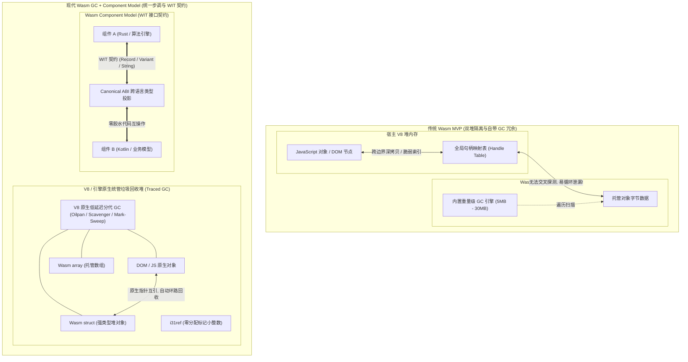
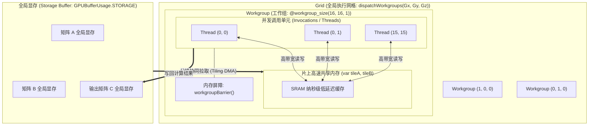
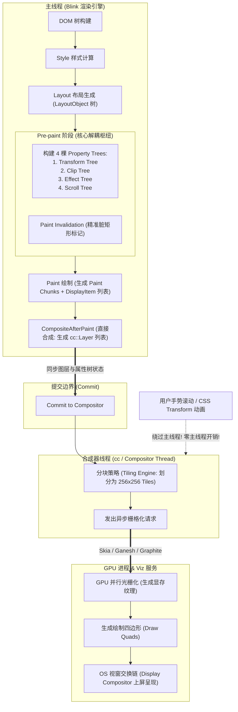

# 现代硬件底座与内核运行时 ✅

本专题深入探讨现代浏览器底座硬件与运行时架构的前沿演进，聚焦 WebAssembly 垃圾回收扩展（Wasm GC）与组件模型、WebGPU 硬件抽象与计算着色器（Compute Shader），以及 Chromium 现代渲染管线（RenderingNG / Pre-paint / Direct Compositing）的底层工业级实现。

## WebAssembly 垃圾回收扩展（Wasm GC）与组件模型（Component Model）如何重构前端多语言混合架构？ {#p0-wasm-gc-component-model}

<Answer>

**核心结论:**

1. **Wasm GC 终结自带运行时包袱**：传统 WebAssembly MVP 仅支持平坦的一维线性内存（Linear Memory），高级托管语言（Dart、Kotlin、Java、Go）编译为 Wasm 时必须自带完整的垃圾回收器实现，导致体积暴增数十兆且启动极慢。Wasm GC 扩展允许 Wasm 模块直接创建并操作由宿主引擎（如 V8）管理的堆对象，实现宿主与 Wasm 共享统一垃圾回收器。
2. **根除跨堆循环引用泄漏**：在旧架构中，Wasm 线性内存与 JavaScript 堆对象交互只能通过外部 handle 表间接映射，极易形成跨引擎边界的循环引用孤岛导致内存泄漏。Wasm GC 引入原生托管类型（`struct`、`array`、`anyref`），使 Wasm 堆对象直接纳入浏览器同一张垃圾回收跟踪图（Traced GC Graph）。
3. **组件模型打破单二进制孤岛**：Wasm 组件模型（Component Model）与 WIT（WebAssembly Interface Types）定义了标准化的 Canonical ABI，打破了传统 Wasm 仅能传递原始数值（i32/i64/f32/f64）的壁垒，实现跨语言（Rust/Go/Kotlin/TypeScript）复杂数据结构（String、Record、Variant、List）的安全、零深拷贝或高效交互。
4. **跨端框架性能蜕变**：Flutter Web 从早期捆绑庞大自研 GC 与 Skia 的 CanvasKit 升级到 Wasm GC 后，产物体积缩减 50%~70%，首屏交互时间（TTI）提升 2~3 倍；Kotlin Multiplatform (KMP) Web 端亦全面基于 Wasm GC 获得近乎原生的执行帧率。

---

**原理解析:**

**1. 传统 Wasm 线性内存痛点 vs Wasm GC 共享堆机制**

在 Wasm 1.0 时代，Wasm 实例的内存是一个单一的 `WebAssembly.Memory`（本质是 JavaScript 中的 `ArrayBuffer`）。这种线性连续字节数组对 C/C++、Rust 等手动管理内存的语言非常高效，但对垃圾回收语言极为低效：
- **GC 运行时开销**：Go（Go Wasm）或 Dart（早期 Flutter Web）必须将自己的 Mark-Sweep / Compact 收集器编进二进制文件，增加数十 MB 体积；
- **双堆隔离断层**：宿主 JS 垃圾回收器根本无法穿透感知 Wasm 线性内存中的对象指针。如果 JS 持有一个 Wasm 对象的包装引用，而该 Wasm 对象又引用了 JS 的 DOM 节点，两套独立的 GC 无法探测交叉环路，导致严重的内存驻留泄漏；
- **Wasm GC 核心类型**：Wasm GC 规范向类型系统注入了高级托管类型：
  - `struct`：强类型的固定字段结构体；
  - `array`：强类型的可变长度数组；
  - `i31ref`：直接利用指针的最后 1 位作为标记（Tagged Pointer），就地存储 31 位无符号或有符号整数，完全不需要发生堆分配（Zero-Allocation）；
  - `externref` / `anyref`：宿主任意对象的直接引用，让 Wasm 能够像操作原生指针一样操作 DOM 元素和 JS 对象。

**传统 Wasm 架构 vs Wasm GC 现代架构拓扑对比**



**2. Wasm 组件模型（Component Model）的架构价值**

- **模块（Module）到组件（Component）的跃迁**：传统 Wasm 模块仅定义了低级函数导入导出和原始数字类型，模块间强耦合于共享的线性内存空间，任何一个模块的越界写（Out-of-Bounds Write）都会破坏同一内存空间的全部模块。
- **WIT（WebAssembly Interface Types）声明**：组件模型引入 `.wit` 描述文件，支持语义级类型：`record`、`enum`、`variant`、`list`、`string` 和 `resource`。
- **沙箱隔离与能力模型（Capability-based Security）**：每个组件拥有完全独立的线性内存或托管堆，跨组件调用通过 Canonical ABI 实现强隔离。一个组件如果未被赋予显式导入权限，则无法访问文件、网络或主线程全局环境。

---

**规范实现:**

**1. WAT（WebAssembly 文本格式）中的 Wasm GC 结构体定义示例**

以下展示了 Wasm GC 原生定义的双向链表节点，直接使用 `struct` 与宿主引用类型：

```wat
;; 声明类型索引与结构体
(module
  ;; 定义链表节点结构体类型: 包含 32 位整数字段与指向下一节点的引用
  (type $Node (struct 
    (field $val i32)
    (field $next (ref null $Node))
    (field $domRef (ref null extern)) ;; 直接持有宿主 DOM 引用
  ))

  ;; 构造节点导出函数
  (func (export "createNode") (param $val i32) (param $dom (ref null extern)) (result (ref $Node))
    (struct.new $Node
      (local.get $val)
      (ref.null $Node)
      (local.get $dom)
    )
  )

  ;; 读取节点值
  (func (export "getNodeVal") (param $node (ref $Node)) (result i32)
    (struct.get $Node $val (local.get $node))
  )
)
```

**2. 生产级：跨语言 WIT 契约与现代前端动态装载检测器**

```typescript
// 1. 定义与 WIT 对应的 TypeScript 跨语言契约接口
export interface ImageFilterComponent {
  processRgba(buffer: Uint8Array, width: number, height: number): {
    readonly durationMs: number;
    readonly outputBuffer: Uint8Array;
  };
}

// 2. 现代生产级 Wasm GC 特性嗅探与渐进降级加载器
export class WasmRuntimeLoader {
  /**
   * 探测当前宿主运行时是否原生支持 Wasm GC (Chrome 119+, Safari 18+, Firefox 120+)
   */
  public static async supportsWasmGC(): Promise<boolean> {
    try {
      // 包含极简 Wasm GC 结构体声明的字节码探针
      const gcProbeBytes = new Uint8Array([
        0x00, 0x61, 0x73, 0x6d, 0x01, 0x00, 0x00, 0x00,
        0x01, 0x05, 0x01, 0x5f, 0x00, 0x00, 0x00
      ]);
      return await WebAssembly.validate(gcProbeBytes);
    } catch {
      return false;
    }
  }

  /**
   * 动态加载符合 Wasm GC 规范的多语言组件
   */
  public static async loadComponent(wasmUrl: string, imports: WebAssembly.Imports = {}): Promise<WebAssembly.Instance> {
    const isGCAvailable = await this.supportsWasmGC();
    if (!isGCAvailable) {
      console.warn('[WasmRuntime] 当前浏览器未启用原生 Wasm GC，降级至传统 JS/Wasm 兼容管线');
      // 触发向后兼容的 Polyfill 或降级加载
    }

    // 采用流式编译，消除大体积二进制造成的首屏主线程阻塞
    const response = await fetch(wasmUrl);
    const { instance } = await WebAssembly.instantiateStreaming(response, {
      ...imports,
      env: {
        memory: new WebAssembly.Memory({ initial: 256, maximum: 1024, shared: false }),
        ...imports.env
      }
    });

    return instance;
  }
}
```

---

**面试官视角:**

**评分 Rubric（考察深度与定级标准）:**
- **基础要点（P6 必答）**：能够准确说明传统 Wasm 仅有线性内存带来的局限（自带语言 GC 导致包体积数十 MB、与 JS/DOM 交互繁琐），清楚 Wasm GC 是让引擎（如 V8）直接接管 Wasm 堆分配并复用浏览器原生垃圾回收。
- **高阶架构（P7 进阶）**：深入分析双堆隔离如何引发跨堆循环引用内存泄漏；清晰阐述 Wasm GC 核心原语（`struct`、`array`、`i31ref` 标记指针零分配优化）；说明 Wasm 组件模型（Component Model）与 WIT 如何解决低级 ABI 孤岛，实现跨语言强类型沙箱调度。
- **前沿实战（P8 架构师视角）**：能够结合 Flutter Web、Kotlin Multiplatform 或 Blazor WebAssembly 在生产落地中的指标实测，对比 CanvasKit 到 Wasm GC 带来的体积优化和 TTI/帧率提升幅度，洞察 Web 架构由“全 JS 垄断”向“多语言高性能核心组件化”的演进趋势。

**常见误区与失误:**
- 误以为 Wasm GC 完全淘汰了传统线性内存：实际上对于 C/C++、Rust、图形渲染（SIMD）、图像处理与音视频编解码等高性能场景，线性内存（甚至 SharedArrayBuffer 多线程共享）依然是不可替代的高速直接寻址手段。现代架构是**线性内存（计算密集）与 Wasm GC 托管堆（业务逻辑/跨语言交互）并存互补**。
- 误以为 Component Model 只是简单的打包工具：它实际上是一整套具备形式化验证规范、跨语言 Canonical ABI 映射与基于能力的权限安全隔离模型。

---

**延伸阅读:**

- [W3C WebAssembly Garbage Collection Sub-proposal](https://github.com/WebAssembly/gc) — W3C 官方 Wasm GC 核心语义与指令集规范。
- [WebAssembly Component Model Specification](https://component-model.bytecodealliance.org/) — Bytecode Alliance 推动的组件模型与 WIT 规范标准。
- [V8 WebAssembly GC Official Release](https://v8.dev/blog/wasm-gc-porting) — Chrome V8 团队详解 Dart/Kotlin 如何移植到 V8 原生垃圾回收。

</Answer>

## WebGPU 与 WebGL 的底层架构有什么本质区别？计算着色器（Compute Shader）如何赋能前端大模型推理与图形处理？ {#p0-webgpu-vs-webgl-compute-shader}

<Answer>

**核心结论:**

1. **硬件抽象代际跃迁**：WebGL 基于上世纪 90 年代的 OpenGL ES 2.0/3.0 全局状态机，驱动层存在巨大的隐式状态同步与单线程 CPU 瓶颈；WebGPU 则是面向现代底层原生图形驱动（DirectX 12、Metal、Vulkan）的一致抽象，消除了全局状态机，全面采用不可变的管线对象（Pipeline）与预先烘焙的绑定组（BindGroup）。
2. **命令录制与执行分离（Command Encoders）**：WebGPU 彻底解耦了“命令录制”与“队列提交”。主线程或 Web Worker 可以通过 `GPUCommandEncoder` 以极低的 CPU 占用生成离线命令缓冲区（`GPUCommandBuffer`），随后集中提交到 `GPUQueue`，天然支持未来多线程并行渲染。
3. **原生一等公民通用计算（Compute Pipeline）**：WebGL 从未提供官方通用计算能力，以往在前端进行机器学习（如早期 TensorFlow.js）必须使用“Hacky”手段将张量伪装成 RGBA 纹理，通过渲染屏幕四边形利用片段着色器计算；WebGPU 首次引入原生的计算着色器（Compute Shader）与 WGSL 语言，摆脱了图形渲染流水线（无需顶点装配、光栅化、帧缓冲）的束缚。
4. **共享内存加速矩阵乘法（GEMM）百倍吞吐**：计算着色器引入了工作组（Workgroup）层次与片上共享内存（`var<workgroup>` Shared Memory）。端侧轻量大语言模型与扩散模型（如 WebLLM、Transformers.js、ONNX Runtime Web）利用工作组分块（Tiling GEMM）技术，将全局显存读取次数降低一个数量级以上，实现大模型端侧推理性能的大幅跃升。

---

**原理解析:**

**1. WebGL 全局状态机缺陷 vs WebGPU 显式资源模型**

- **WebGL 的 CPU 瓶颈**：在 WebGL 中，每次绘制调用（Draw Call）前必须通过 `gl.bindBuffer()`、`gl.useProgram()` 等改变上下文的全局内部变量。浏览器驱动层在每次调用前必须反复校验成百上千项全局状态的有效性，耗费大量主线程 CPU 时间，导致显卡算力处于闲置“饥饿”状态。
- **WebGPU 不可变流水线与绑定组**：WebGPU 采用不可变的 `GPUComputePipeline` / `GPURenderPipeline`。所有着色器代码、顶点布局、混合模式在初始化阶段就已在驱动底层预编译并烘焙为 GPU 微码。在执行阶段，开发者仅需切换 `GPUBindGroup` 并调用 `dispatchWorkgroups()` 或 `draw()`，CPU 验证成本几乎降为零。

**2. WebGPU 计算着色器（Compute Shader）执行层次与 Tiling GEMM 原理**

在处理端侧 AI 矩阵运算（$C = A \times B$）时，朴素算法每个输出元素都需要从高延迟的全局显存（VRAM）中连续读取整行与整列，显存带宽迅速饱和。
WebGPU 计算着色器通过以下分层拓扑解决显存墙问题：
1. **工作网格（Grid）**：由 `dispatchWorkgroups(x, y, z)` 启动的全局工作组阵列；
2. **工作组（Workgroup）**：由 WGSL 中 `@workgroup_size(16, 16)` 定义的协同线程组；
3. **工作组共享内存（Workgroup Shared Memory）**：位于 GPU 芯片核心内部的高速 SRAM 缓存，访问延迟仅几个时钟周期（接近 L1 Cache，远快于全局显存）。每个 Workgroup 内的多个线程分工从全局显存各加载一小块数据到共享内存，调用 `workgroupBarrier()` 内存屏障保证同步，随后所有线程在高速共享内存中完成乘累加（MAC），显存带宽读取压力降低数十倍。

**WebGPU Compute Shader 多级网格与共享内存拓扑图**



---

**规范实现:**

**1. 生产级 WGSL 计算着色器：分块矩阵乘法（Tiled GEMM 核心）**

```wgsl
// 设定工作组块大小为 16x16
const BLOCK_SIZE: u32 = 16u;

// 绑定全局显存缓冲区
@group(0) @binding(0) var<storage, read> matrixA : array<f32>;
@group(0) @binding(1) var<storage, read> matrixB : array<f32>;
@group(0) @binding(2) var<storage, read_write> matrixC : array<f32>;

struct Dimensions {
  M : u32,
  K : u32,
  N : u32,
};
@group(0) @binding(3) var<uniform> dims : Dimensions;

// 声明片上高速共享内存 (总计 16*16*4 = 1KB，极速访问)
var<workgroup> tileA : array<array<f32, BLOCK_SIZE>, BLOCK_SIZE>;
var<workgroup> tileB : array<array<f32, BLOCK_SIZE>, BLOCK_SIZE>;

@compute @workgroup_size(BLOCK_SIZE, BLOCK_SIZE, 1)
fn main(
  @builtin(global_invocation_id) global_id : vec3<u32>,
  @builtin(local_invocation_id) local_id : vec3<u32>,
  @builtin(workgroup_id) workgroup_id : vec3<u32>
) {
  let row = global_id.y;
  let col = global_id.x;
  var sum : f32 = 0.0;

  // 将 K 维度拆分为若干个 Tile 依次滑动分块计算
  let numTiles = (dims.K + BLOCK_SIZE - 1u) / BLOCK_SIZE;

  for (var t = 0u; t < numTiles; t = t + 1u) {
    // 协同加载: 每个线程负责从全局显存搬运一个元素到工作组共享内存
    let tiledColA = t * BLOCK_SIZE + local_id.x;
    if (row < dims.M && tiledColA < dims.K) {
      tileA[local_id.y][local_id.x] = matrixA[row * dims.K + tiledColA];
    } else {
      tileA[local_id.y][local_id.x] = 0.0;
    }

    let tiledRowB = t * BLOCK_SIZE + local_id.y;
    if (tiledRowB < dims.K && col < dims.N) {
      tileB[local_id.y][local_id.x] = matrixB[tiledRowB * dims.N + col];
    } else {
      tileB[local_id.y][local_id.x] = 0.0;
    }

    // 内存屏障: 确保工作组内所有 256 个线程均已搬运完毕
    workgroupBarrier();

    // 在片上高速 SRAM 中进行点积累加
    for (var k = 0u; k < BLOCK_SIZE; k = k + 1u) {
      sum = sum + tileA[local_id.y][k] * tileB[k][local_id.x];
    }

    // 执行下一块搬运前必须再次同步，防止发生数据读写竞争
    workgroupBarrier();
  }

  // 写回最终计算结果到输出矩阵
  if (row < dims.M && col < dims.N) {
    matrixC[row * dims.N + col] = sum;
  }
}
```

**2. TypeScript 完整宿主调用与张量管线调度**

```typescript
export async function runWebGPUGemm(
  device: GPUDevice,
  shaderCode: string,
  matA: Float32Array,
  matB: Float32Array,
  M: number,
  K: number,
  N: number
): Promise<Float32Array> {
  // 1. 创建 Storage Buffer 并灌入数据
  const createBuffer = (data: Float32Array, usage: GPUBufferUsageFlags) => {
    const buffer = device.createBuffer({
      size: data.byteLength,
      usage: usage | GPUBufferUsage.COPY_DST,
      mappedAtCreation: true,
    });
    new Float32Array(buffer.getMappedRange()).set(data);
    buffer.unmap();
    return buffer;
  };

  const bufferA = createBuffer(matA, GPUBufferUsage.STORAGE);
  const bufferB = createBuffer(matB, GPUBufferUsage.STORAGE);
  const bufferC = device.createBuffer({
    size: M * N * Float32Array.BYTES_PER_ELEMENT,
    usage: GPUBufferUsage.STORAGE | GPUBufferUsage.COPY_SRC,
  });

  // 统一尺寸 Uniform Buffer
  const dimsArray = new Uint32Array([M, K, N, 0]);
  const bufferDims = device.createBuffer({
    size: dimsArray.byteLength,
    usage: GPUBufferUsage.UNIFORM | GPUBufferUsage.COPY_DST,
    mappedAtCreation: true,
  });
  new Uint32Array(bufferDims.getMappedRange()).set(dimsArray);
  bufferDims.unmap();

  // 2. 编译 WGSL 并创建计算管线
  const shaderModule = device.createShaderModule({ code: shaderCode });
  const pipeline = device.createComputePipeline({
    layout: 'auto',
    compute: { module: shaderModule, entryPoint: 'main' },
  });

  // 3. 构建绑定组 (BindGroup)
  const bindGroup = device.createBindGroup({
    layout: pipeline.getBindGroupLayout(0),
    entries: [
      { binding: 0, resource: { buffer: bufferA } },
      { binding: 1, resource: { buffer: bufferB } },
      { binding: 2, resource: { buffer: bufferC } },
      { binding: 3, resource: { buffer: bufferDims } },
    ],
  });

  // 4. 离线命令录制 (GPUCommandEncoder)
  const commandEncoder = device.createCommandEncoder();
  const passEncoder = commandEncoder.beginComputePass();
  passEncoder.setPipeline(pipeline);
  passEncoder.setBindGroup(0, bindGroup);
  // 每个工作组为 16x16，计算全局分块分发尺寸
  passEncoder.dispatchWorkgroups(Math.ceil(N / 16), Math.ceil(M / 16), 1);
  passEncoder.end();

  // 5. 准备结果回读 Staging 缓冲区
  const stagingBuffer = device.createBuffer({
    size: bufferC.size,
    usage: GPUBufferUsage.MAP_READ | GPUBufferUsage.COPY_DST,
  });
  commandEncoder.copyBufferToBuffer(bufferC, 0, stagingBuffer, 0, bufferC.size);

  // 集中向 GPU 队列提交命令
  device.queue.submit([commandEncoder.finish()]);

  // 6. 异步映射显存回读数据
  await stagingBuffer.mapAsync(GPUMapMode.READ);
  const resultData = new Float32Array(stagingBuffer.getMappedRange().slice(0));
  stagingBuffer.unmap();

  return resultData;
}
```

---

**面试官视角:**

**评分 Rubric（考察深度与定级标准）:**
- **基础要点（P6 必答）**：能清晰说出 WebGPU 对标 Vulkan/Metal/DirectX 12，废除了 WebGL 的全局状态机，支持通过 `GPUCommandEncoder` 生成命令缓冲；明确说明 WebGPU 原生支持 Compute Shader，不再需要像 WebGL 一样借用绘制四边形和纹理手段做 GPGPU。
- **高阶架构（P7 进阶）**：深入解释 Compute Shader 中的 Grid -> Workgroup -> Invocation 分层架构；深刻理解片上共享内存（`var<workgroup>`）与全局显存的访问延迟差异，讲透矩阵乘法（GEMM）中如何通过分块（Tiling）与 `workgroupBarrier()` 克服显存带宽瓶颈。
- **端侧 AI 实战（P8 架构师视角）**：结合 WebLLM、Transformers.js 或端侧扩散模型在浏览器运行的实际痛点，解释为什么 WebGPU 能支撑数百 token/s 的端侧推理；能横向对比统一内存架构（如 Apple Silicon UMA 共享统一寻址零拷贝）在 WebGPU 显存映射与回读（`mapAsync`）中的性能收益。

**常见误区与失误:**
- 误以为 WebGPU 只是 WebGL 3.0：两者的底层设计哲学完全脱胎换骨，WebGPU 并非 OpenGL 的升级版，而是对现代 Explicit Hardware API（显式硬件 API）的 Web 标准化。
- 误以为 WebGPU 可以在任意多线程直接画到主屏幕：Canvas 渲染主屏上下文仍受 DOM 归属限制，多线程主要用于在 Web Worker 中通过 `OffscreenCanvas` 进行离线渲染，或纯通用计算后交换缓冲区。

---

**延伸阅读:**

- [W3C WebGPU Specification](https://www.w3.org/TR/webgpu/) — W3C 官方 WebGPU 核心硬件抽象规范标准。
- [WebGPU Shading Language (WGSL) Specification](https://www.w3.org/TR/WGSL/) — WGSL 官方语法与内存模型标准。
- [WebLLM / MLC-LLM Architecture Report](https://github.com/mlc-ai/web-llm) — 端侧大模型利用 WebGPU 实现通用高性能推理架构白皮书。

</Answer>

## 现代 Chromium 渲染引擎管线演进：从 DOM/CSSOM 到 Pre-paint、Direct Compositing 与滚动光栅化？ {#p0-chromium-render-pipeline-prepaint}

<Answer>

**核心结论:**

1. **RenderingNG 代际演进**：现代 Chromium（Blink 引擎）彻底重构了传统经典渲染管线（`DOM -> CSSOM -> Layout -> Paint Layer -> GraphicsLayer 合成`），演进为基于不可变属性树（Property Trees）与 `CompositeAfterPaint`（CAP，即 Direct Compositing / 直接合成）的现代 RenderingNG 架构体系。
2. **终结“层爆炸”与“层压缩”恶疾**：旧架构基于 PaintLayer 决策提升合成层，极易触发隐式提升（Implicit Compositing）引发灾难性的“层爆炸”（Layer Explosion，显存被数千个合成层耗尽而崩溃）；现代架构不再在绘制前提前创建大图层，而是生成细粒度的扁平显示列表（Display Items）与轻量绘制块（Paint Chunks），由合成器根据属性树直接决定合成拓扑。
3. **Pre-paint 阶段解耦几何与绘制**：在 Layout 之后、Paint 之前新增了 Pre-paint 核心阶段，其专属职责是生成并维护四棵解耦的几何属性树（`Transform Tree`、`Clip Tree`、`Effect Tree`、`Scroll Tree`），使得变换、裁剪与视口滚动完全与具体的绘制指令解耦。
4. **合成器线程零主线程滚动与分块栅格化**：Paint 阶段产出的是绘图指令序列（`PaintOpBuffer`）而非物理像素；合成器线程（Compositor Thread）直接在分块网格（Tiles）上通过后台 GPU 线程并行执行光栅化（Rasterization）。当发生视口滚动或 CSS 动画时，仅需合成器线程就地计算变换矩阵后直接提交给 Viz 进程合成，实现全程零主线程开销的 120 FPS 满帧滚动。

---

**原理解析:**

**1. 经典旧管线痛点 vs 现代 RenderingNG 核心重构**

- **旧架构致命伤：隐式提升与层爆炸**
  在旧版 Blink 中，任何带有 `will-change: transform` 或包含 3D 变换的元素都会被提升为独立的 `GraphicsLayer`。为了保证 CSS z-index 层叠上下文不发生视觉穿透，重叠在该元素上方的大量普通节点都会被引擎“隐式提升”为合成层，导致图层数量暴增上千个，产生巨大的显存分配与层间合成开销。
- **解耦神作：属性树（Property Trees）**
  现代 Chromium 认识到：一个元素的尺寸与定位是布局（Layout）决定的，但它的位移（Transform）、裁剪范围（Clip）、不透明度/滤镜（Effect）以及滚动偏移（Scroll）在时间维度上是频繁高频波动的。
  因此，Chromium 在 Pre-paint 阶段生成四棵独立的属性树：
  - **Transform Tree**：管理页面各节点的坐标空间转换矩阵；
  - **Clip Tree**：管理 `overflow: hidden`、圆角剪裁等几何遮罩区域；
  - **Effect Tree**：管理 `opacity`、`filter`、混合模式与透明层级；
  - **Scroll Tree**：管理视口滚动偏移、滚动链与边界弹性。
  绘制（Paint）出的每个 `Paint Chunk` 只需持有一个指向对应属性树节点的轻量索引，即可完成几何计算。

**现代 Chromium RenderingNG 渲染管线流转图**



**2. 零主线程开销的滚动与光栅化（Compositor-driven Scrolling）**

当用户在触摸板滑动或滑动滚轮时：
1. 操作系统将输入事件直接传递给**合成器线程**；
2. 合成器线程检查触摸命中区域是否属于“非快速滚动区域”（Non-Fast Scrollable Region，例如绑定了未标记 `{ passive: true }` 的 `wheel` 或 `touchstart` 事件监听器）；
3. 若无主线程阻塞拦截，合成器线程**直接修改 Scroll Tree 与 Transform Tree 中的滚动偏移矩阵**；
4. 合成器直接挑选已在 GPU 显存中光栅化完成的瓦片（Tiles），就地计算投影矩阵生成绘制四边形（Draw Quads），直接派发给 Viz 服务输出到屏幕；
5. 主线程即便正在执行耗时极长的密集 JavaScript 脚本，页面滚动也丝毫不会卡顿！

---

**规范实现:**

**1. 规避主线程滚动阻塞：确保 Fast Scrollable Region 的生产级规范**

```typescript
/**
 * 生产级视口事件绑定：保障 Chromium 合成器线程零卡顿直接滚动
 */
export function setupHighPerformanceScrollListener(
  scrollTarget: HTMLElement,
  callback: (scrollTop: number) => void
): () => void {
  // 1. 声明 passive: true，通知 Blink 内核该回调永不调用 e.preventDefault()
  // 彻底消除 Non-Fast Scrollable Region，滚动计算完全保留在合成器线程
  const listenerOptions: AddEventListenerOptions = {
    passive: true,
    capture: false,
  };

  let rafId: number | null = null;
  const onScroll = () => {
    if (rafId !== null) return;
    // 使用 requestAnimationFrame 节流，与屏幕刷新率严格同步
    rafId = requestAnimationFrame(() => {
      callback(scrollTarget.scrollTop);
      rafId = null;
    });
  };

  scrollTarget.addEventListener('scroll', onScroll, listenerOptions);

  return () => {
    scrollTarget.removeEventListener('scroll', onScroll, listenerOptions);
    if (rafId !== null) cancelAnimationFrame(rafId);
  };
}
```

**2. 现代 CSS 架构：利用直接合成（Direct Compositing）与属性树的最佳实践**

```css
/* ❌ 历史糟糕写法：强制引发层爆炸或不必要重排 */
.bad-modal-box {
  /* 滥用强制提升，导致子孙节点产生连锁隐式提升 */
  transform: translateZ(0);
  /* 在动画中改变 left/top，每帧强制触发 Layout 与 Pre-paint 重算 */
  top: 100px;
  /* 触发主线程重绘 */
  opacity: 0.8;
}

/* ✅ 现代 RenderingNG 最佳写法：纯属性树变换，零主线程重排重绘 */
.good-modal-box {
  /* 声明 will-change 引导合成器就地分配独立 Property Tree Transform 节点 */
  will-change: transform, opacity;
  /* 仅发生 Transform Tree 变换矩阵刷新，在合成器线程由 GPU 实时完成位移 */
  transform: translate3d(0, 100px, 0);
  /* 声明 touch-action，显式告知内核将触摸滚动完全下放给合成器处理 */
  touch-action: pan-y;
  /* 仅更新 Effect Tree 节点属性，零重绘开销 */
  opacity: 0.8;
}
```

---

**面试官视角:**

**评分 Rubric（考察深度与定级标准）:**
- **基础要点（P6 必答）**：能完整说出主线程渲染流程（Style -> Layout -> Paint -> Composite）；清楚 Paint 只生成绘制指令而光栅化（Rasterization）在合成器与 GPU 线程中进行；知道使用 `transform` / `opacity` 结合 `will-change` 可以走合成层优化。
- **高阶架构（P7 进阶）**：深刻理解旧版架构中隐式提升引发的“层爆炸”根因；详细讲透现代 Chromium 架构的核心分水岭：**Pre-paint 阶段生成四大 Property Trees（Transform, Clip, Effect, Scroll）**，将几何变换与视口裁剪从绘制树中彻底剥离；讲清 `CompositeAfterPaint`（直接合成）如何消除层爆炸。
- **内核专家（P8 架构师视角）**：能够剖析合成器线程（cc）与 Viz 服务的进程通信；深入阐述 Non-Fast Scrollable Region 机制及为什么裸事件监听器会导致滚动掉帧；能从光栅化分块（Tiling）、GPU 显存预算调度和 GPU 进程光栅化（OOP-R, Out-of-Process Rasterization）全链路给出极端复杂长列表/动效的毫秒级诊断方案。

**常见误区与失误:**
- 误以为 Paint 阶段产出的是屏幕像素位图：Paint 阶段产出的是绘图指令序列（`PaintOpBuffer`，类似 Skia 的 SkPicture 指令流），真正的像素填充是由分块光栅化（Rasterization）在 GPU 线程中完成的。
- 误以为所有 CSS 动画都能零开销运行：只有能够纯由 Property Trees 表达且不打断直接合成的属性（如 `transform`、`opacity`、`filter`）才能在合成器线程上独立运转；涉及几何尺寸（`width`、`height`、`flex`）的动画依然会迫使主线程从 Layout 阶段重新触发全流程。

---

**延伸阅读:**

- [Chromium RenderingNG Architecture Whitepaper](https://developer.chrome.com/docs/chromium/renderingng-architecture) — Google Chrome 官方渲染架构重构权威全景白皮书。
- [CompositeAfterPaint Design Document](https://chromium.googlesource.com/chromium/src/+/refs/heads/main/third_party/blink/renderer/core/paint/composite_after_paint.md) — Chromium 官方 CompositeAfterPaint（直接合成）设计规范。
- [GPU Accelerated Compositing in Chrome](https://www.chromium.org/developers/design-documents/gpu-accelerated-compositing-in-chrome/) — 浏览器合成器线程、分块栅格化与硬件加速基础原理。

</Answer>
