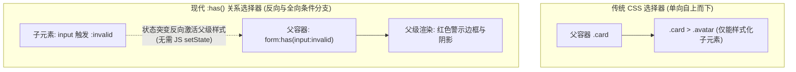
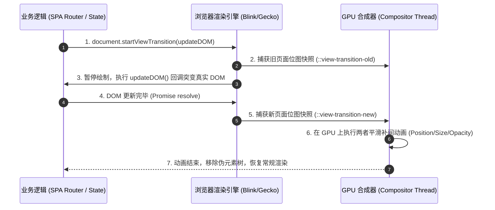

# 现代CSS技术✅

本主题涵盖现代CSS技术和新特性，包括CSS变量、容器查询、现代布局技术等。

## 什么是CSS变量（CSS Custom Properties）？{#p1-css-variables}

<Answer>

**核心概念**

CSS变量（CSS Custom Properties）是CSS3引入的新特性，允许开发者定义可重用的值，提高CSS的可维护性和灵活性。

**基本语法**

```css
/* 定义变量 */
:root {
  --primary-color: #007bff;
  --secondary-color: #6c757d;
  --border-radius: 4px;
  --font-size: 16px;
}

/* 使用变量 */
.button {
  background: var(--primary-color);
  border-radius: var(--border-radius);
  font-size: var(--font-size);
}
```

**变量作用域**

```css
/* 全局变量 */
:root {
  --global-color: blue;
}

/* 局部变量 */
.container {
  --local-color: red;
}

/* 继承变量 */
.child {
  color: var(--local-color); /* 继承父元素的变量 */
}
```

**动态修改变量**

```javascript
// 通过JavaScript动态修改CSS变量
document.documentElement.style.setProperty('--primary-color', '#ff0000')

// 获取CSS变量值
const color = getComputedStyle(document.documentElement)
  .getPropertyValue('--primary-color')
```

**实际应用**

```css
/* 主题切换 */
:root {
  --bg-color: white;
  --text-color: black;
  --border-color: #ddd;
}

[data-theme="dark"] {
  --bg-color: #333;
  --text-color: white;
  --border-color: #555;
}

body {
  background: var(--bg-color);
  color: var(--text-color);
}

.card {
  border: 1px solid var(--border-color);
}

/* 响应式变量 */
:root {
  --spacing: 20px;
}

@media (max-width: 768px) {
  :root {
    --spacing: 10px;
  }
}

.container {
  padding: var(--spacing);
}
```

**面试官视角**

- **差**：不了解CSS变量概念，无法使用
- **良**：知道基本语法，能使用CSS变量
- **优**：深入理解变量机制，能灵活运用解决复杂问题

**延伸阅读**

- [MDN: CSS变量](https://developer.mozilla.org/zh-CN/docs/Web/CSS/Using_CSS_custom_properties) - 官方文档
- [CSS变量详解](https://developer.mozilla.org/zh-CN/docs/Learn/CSS/Building_blocks/Using_CSS_custom_properties) - 学习指南

</Answer>

## 什么是CSS容器查询？{#p2-container-queries}

<Answer>

**核心概念**

CSS容器查询（Container Queries）是一种新的CSS特性，允许根据容器的大小而不是视口大小来应用样式，实现更精确的响应式设计。

**基本语法**

```css
/* 定义容器 */
.card {
  container-type: inline-size;
  container-name: card;
}

/* 基于容器大小的查询 */
@container card (min-width: 400px) {
  .card__title {
    font-size: 24px;
  }
  
  .card__content {
    display: grid;
    grid-template-columns: 1fr 1fr;
  }
}

@container card (max-width: 399px) {
  .card__title {
    font-size: 18px;
  }
  
  .card__content {
    display: block;
  }
}
```

**容器类型**

1. **inline-size**：基于内联轴（水平方向）
2. **block-size**：基于块轴（垂直方向）
3. **size**：基于两个轴

```css
/* 不同容器类型 */
.horizontal-container {
  container-type: inline-size;
}

.vertical-container {
  container-type: block-size;
}

.full-container {
  container-type: size;
}
```

**实际应用**

```css
/* 卡片组件 */
.card {
  container-type: inline-size;
  border: 1px solid #ddd;
  padding: 16px;
}

/* 小容器样式 */
@container (max-width: 300px) {
  .card {
    padding: 8px;
  }
  
  .card__title {
    font-size: 16px;
  }
  
  .card__content {
    font-size: 14px;
  }
}

/* 大容器样式 */
@container (min-width: 301px) {
  .card {
    padding: 24px;
  }
  
  .card__title {
    font-size: 24px;
  }
  
  .card__content {
    font-size: 16px;
  }
}
```

**面试官视角**

- **差**：不了解容器查询概念
- **良**：知道基本语法，能使用容器查询
- **优**：深入理解容器查询机制，能灵活运用

**延伸阅读**

- [MDN: CSS容器查询](https://developer.mozilla.org/zh-CN/docs/Web/CSS/CSS_container_queries) - 官方文档
- [容器查询详解](https://developer.mozilla.org/zh-CN/docs/Learn/CSS/CSS_layout/Responsive_Design) - 学习指南

</Answer>

## 什么是CSS Grid子网格（Subgrid）？{#p2-css-subgrid}

<Answer>

**核心概念**

CSS Grid子网格（Subgrid）是CSS Grid布局的扩展功能，允许网格项目的子元素继承父网格的轨道定义，实现更复杂的嵌套网格布局。

**基本语法**

```css
/* 父网格 */
.grid-container {
  display: grid;
  grid-template-columns: repeat(3, 1fr);
  gap: 20px;
}

/* 子网格 */
.grid-item {
  display: grid;
  grid-template-columns: subgrid;
  grid-template-rows: subgrid;
}
```

**实际应用**

```css
/* 卡片网格布局 */
.card-grid {
  display: grid;
  grid-template-columns: repeat(auto-fit, minmax(300px, 1fr));
  gap: 20px;
}

.card {
  display: grid;
  grid-template-columns: subgrid;
  grid-template-rows: auto 1fr auto;
  border: 1px solid #ddd;
  border-radius: 8px;
}

.card__header {
  grid-column: 1 / -1;
  padding: 16px;
  background: #f8f9fa;
  border-bottom: 1px solid #ddd;
}

.card__content {
  grid-column: 1 / -1;
  padding: 16px;
}

.card__footer {
  grid-column: 1 / -1;
  padding: 16px;
  background: #f8f9fa;
  border-top: 1px solid #ddd;
}
```

**面试官视角**

- **差**：不了解子网格概念
- **良**：知道基本语法，能使用子网格
- **优**：深入理解子网格机制，能灵活运用

**延伸阅读**

- [MDN: CSS子网格](https://developer.mozilla.org/zh-CN/docs/Web/CSS/CSS_Grid_Layout/Subgrid) - 官方文档
- [子网格详解](https://developer.mozilla.org/zh-CN/docs/Learn/CSS/CSS_layout/Grids) - 学习指南

</Answer>

## 什么是CSS层叠层（Cascade Layers）？{#p2-cascade-layers}

<Answer>

**核心概念**

CSS层叠层（Cascade Layers）是CSS的新特性，允许开发者创建命名的样式层，控制样式的优先级和覆盖顺序。

**基本语法**

```css
/* 定义层叠层 */
@layer base, components, utilities;

/* 在指定层中定义样式 */
@layer base {
  body {
    font-family: Arial, sans-serif;
    line-height: 1.6;
  }
}

@layer components {
  .button {
    padding: 8px 16px;
    border: none;
    border-radius: 4px;
  }
}

@layer utilities {
  .text-center { text-align: center; }
  .text-left { text-align: left; }
}
```

**层叠顺序**

```css
/* 层叠层的优先级顺序 */
@layer base, components, utilities;

/* 后面的层会覆盖前面的层 */
@layer base {
  .title { color: black; }
}

@layer utilities {
  .title { color: red; } /* 会覆盖base层的样式 */
}
```

**实际应用**

```css
/* 框架样式层 */
@layer framework {
  .btn {
    display: inline-block;
    padding: 8px 16px;
    border: 1px solid transparent;
    border-radius: 4px;
  }
}

/* 组件样式层 */
@layer components {
  .btn--primary {
    background: #007bff;
    color: white;
  }
  
  .btn--secondary {
    background: #6c757d;
    color: white;
  }
}

/* 工具样式层 */
@layer utilities {
  .btn--large {
    padding: 12px 24px;
    font-size: 16px;
  }
}
```

**面试官视角**

- **差**：不了解层叠层概念
- **良**：知道基本语法，能使用层叠层
- **优**：深入理解层叠层机制，能灵活运用

**延伸阅读**

- [MDN: CSS层叠层](https://developer.mozilla.org/zh-CN/docs/Web/CSS/@layer) - 官方文档
- [层叠层详解](https://developer.mozilla.org/zh-CN/docs/Learn/CSS/Building_blocks/Cascade_and_inheritance) - 学习指南

</Answer>

## 什么是CSS嵌套（CSS Nesting）？{#p2-css-nesting}

<Answer>

**核心概念**

CSS嵌套（CSS Nesting）是CSS的新特性，允许在CSS规则内部嵌套其他规则，提高代码的可读性和维护性。

**基本语法**

```css
/* 基本嵌套 */
.card {
  background: white;
  border-radius: 8px;
  box-shadow: 0 2px 4px rgba(0,0,0,0.1);
  
  /* 嵌套子元素 */
  .card__title {
    font-size: 24px;
    font-weight: bold;
    margin-bottom: 16px;
  }
  
  .card__content {
    line-height: 1.6;
    
    /* 嵌套伪类 */
    &:hover {
      background: #f8f9fa;
    }
  }
  
  /* 嵌套媒体查询 */
  @media (max-width: 768px) {
    padding: 16px;
    
    .card__title {
      font-size: 20px;
    }
  }
}
```

**嵌套选择器**

```css
/* 嵌套选择器 */
.nav {
  display: flex;
  gap: 20px;
  
  /* 嵌套子选择器 */
  & > li {
    list-style: none;
  }
  
  /* 嵌套组合选择器 */
  & + .nav {
    margin-top: 20px;
  }
  
  /* 嵌套属性选择器 */
  &[data-vertical] {
    flex-direction: column;
  }
}
```

**实际应用**

```css
/* 组件嵌套 */
.button {
  display: inline-block;
  padding: 8px 16px;
  border: none;
  border-radius: 4px;
  cursor: pointer;
  transition: all 0.3s ease;
  
  /* 嵌套变体 */
  &--primary {
    background: #007bff;
    color: white;
    
    &:hover {
      background: #0056b3;
    }
  }
  
  &--secondary {
    background: #6c757d;
    color: white;
    
    &:hover {
      background: #545b62;
    }
  }
  
  /* 嵌套状态 */
  &:disabled {
    opacity: 0.6;
    cursor: not-allowed;
  }
  
  /* 嵌套媒体查询 */
  @media (max-width: 768px) {
    padding: 12px 20px;
    font-size: 16px;
  }
}
```

**面试官视角**

- **差**：不了解CSS嵌套概念
- **良**：知道基本语法，能使用CSS嵌套
- **优**：深入理解嵌套机制，能灵活运用

**延伸阅读**

- [MDN: CSS嵌套](https://developer.mozilla.org/zh-CN/docs/Web/CSS/CSS_nesting) - 官方文档
- [CSS嵌套详解](https://developer.mozilla.org/zh-CN/docs/Learn/CSS/Building_blocks/Selectors) - 学习指南

</Answer>

## CSS :has() 父选择器与关系伪类的底层工作机制与性能开销？如何颠覆传统组件状态驱动样式？ {#p0-css-has-selector}

<Answer>

**核心结论**

`:has()` 伪类被称为“CSS 历史上期待度最高、最具颠覆性的选择器”，彻底解决了 CSS 自 1996 年诞生以来长达近 30 年“只能向后/向下选子元素，无法根据子元素状态选择父级或前置兄弟”的根本局限：
1. **反向条件匹配能力**：语法形如 `article:has(img)`、`form:has(input:invalid)`，允许父容器依据其内部是否包含特定子元素、或子元素是否处于特定伪类状态（如 `:focus`、`:checked`、`:invalid`）来动态应用自身样式。
2. **彻底颠覆传统 JS 样式桥接**：在以往业务中，为了实现“表单有错误时卡片红框高亮”、“复选框勾选时父容器阴影高亮”、“侧边栏抽屉展开时锁定父级页面滚动”，必须在 React/Vue 中为父级绑定状态或通过 DOM 操作添加 `.is-error` / `.is-active` 等 class；有了 `:has()`，这些全部退化为**纯声明式、零 JS、零重渲染**的纯 CSS 原生实现！
3. **底层性能开销与优化**：`:has()` 之所以推迟了 20 多年才进入浏览器标准，是因为传统 CSS 引擎采用“从右向左”的局部自底向上匹配算法，反向查询极易引发灾难性的全树回溯（$O(N^2)$）。现代浏览器（Chromium 105+、WebKit、Gecko）通过引入**作用域化快速判定位图（Bloom Filter）与局部失效树（Invalidation Sets）**，将重排开销限制在局部子树内，使得常规业务使用中的性能损耗基本被抹平。

---

**匹配机制与依赖失效拓扑**



---

**生产级高频业务实战代码**

```css
/* 1. 表单验证卡片：子输入框不合法时，父级卡片整体警示 (零 JS 监听) */
.form-card:has(input:invalid:not(:placeholder-shown)) {
  border-color: #ef4444;
  box-shadow: 0 0 0 3px rgba(239, 68, 68, 0.15);
  background-color: #fef2f2;
}

/* 2. 条件布局切换：当文章内存在首图时自动变为两列图文排版，否则保持纯文本单列 */
.article-item {
  display: block;
}
.article-item:has(> .cover-image) {
  display: grid;
  grid-template-columns: 240px 1fr;
  gap: 20px;
}

/* 3. 悬停兄弟元素聚焦，其余暗化 (Focus/Hover Blur 滤镜效果) */
.gallery-list:has(.card:hover) .card:not(:hover) {
  opacity: 0.4;
  filter: grayscale(80%);
  transform: scale(0.98);
  transition: opacity 0.3s ease, transform 0.3s ease;
}

/* 4. “前置兄弟选择器”：选中紧邻特定元素之前的那个元素 */
/* 选中后面紧跟着 .active 的前一个 .item 元素 (传统 CSS 无法实现) */
.nav-item:has(+ .nav-item.active) {
  border-bottom-color: #3b82f6;
}
```

---

**性能避坑指南与最佳实践**

1. **避免宽泛的全局根匹配**：
   - ❌ 极度危险：`body:has(.modal-open)` 或 `*:has(p)` 会导致页面任何微小 DOM 变动都迫使浏览器对整棵文档树进行失效检查；
   - ✅ 规范实践：始终将 `:has()` 限制在具体的组件作用域上，如 `.component:has(...)` 或 `.dialog-wrapper:has(...)`。
2. **结合关系组合符收窄范围**：
   - 使用直接子代符 `>`（如 `.card:has(> .banner)`）优于后代空格符（`.card:has(.banner)`），能显著降低 DOM 树深度遍历的深度。

---

**面试官视角与下探考察点**

1. **浏览器内部重排失效机制（Invalidation Sets）**：
   - 面试官通常会追问：“为什么现代浏览器现在才敢上线 `:has()`？底层是如何避免全文档重新计算样式的？”
   - 核心洞察：现代渲染引擎（如 Blink）维护了特殊的“锚定失效集合（Subject Invalidation Sets）”。当子节点的类名或属性发生突变时，引擎仅沿着向上有限层级的父节点链执行脏标记检查，且结合 Bloom 过滤器快速跳过不匹配的子树，使得时间复杂度从全量遍历退化为局部受控开销。
2. **`:has()` 能否嵌套 `:has()`？**：
   - 规范明确规定：`:has()` **内部禁止嵌套 `:has()`**（例如 `:has(:has(...))` 是非法语法），直接抛出语法无效，以此杜绝无限递归。

---

**延伸阅读**

- [web.dev: :has() 现代 CSS 革命指南](https://web.dev/articles/has-m105)
- [WebKit 官方博客：Meet :has(), A Parent Selector and more](https://webkit.org/blog/13096/css-has-pseudo-class/)
- Blink 渲染引擎样式失效（Style Invalidation）内部优化机制

</Answer>

## 页面与组件平滑过渡动效新标准：View Transitions API 底层管线与伪元素渲染树？ {#p0-view-transitions-api}

<Answer>

**核心结论**

传统 Web 应用在实现跨路由切换或复杂组件状态平滑过渡时，面临着难以逾越的工程瓶颈：必须通过复杂的 JavaScript 库（如 Framer Motion / React Transition Group）**在内存中同时保留旧组件与新组件两棵 DOM 树**，并通过绝对定位与计算绝对坐标来进行补间动画，极易引发严重的主线程卡顿、布局重排抖动（Layout Thrashing）与内存泄漏。

**View Transitions API** 是 W3C 带来的革命性底层动效架构：
1. **两阶段原生快照机制**：通过 `document.startViewTransition(updateCallback)`，浏览器自动在变更前拍摄当前画面的**位图快照**，暂停渲染并执行 DOM 变更，待新视图就绪后拍摄新快照，并在两张快照之间自动执行硬件加速的交叉淡入淡出（Cross-fade）补间。
2. **独立伪元素树（View Transition Pseudo-tree）**：过渡过程在普通 DOM 树之上的独立顶层图层中进行，浏览器自动生成 `::view-transition` 树形伪元素集合。
3. **细粒度形态形变（Morphing Animations）**：通过给特定元素设置 `view-transition-name: hero-image`，浏览器会自动计算该元素在旧状态与新状态下的尺寸和坐标差，实现极其流畅的**共享元素过渡（Shared Element Transition）**，且完全脱离任何外部 JavaScript 动画库依赖！

---

**底层管线与伪元素层次拓扑**



---

**生产级 TypeScript 与 CSS 实战**

```typescript
// 1. SPA 路由跳转或大组件切换核心控制器
export async function navigateWithTransition(
  url: string,
  updateDomFn: () => Promise<void> | void
): Promise<void> {
  // 优雅降级分支: 如果浏览器不支持原生 API
  if (!document.startViewTransition) {
    await updateDomFn();
    return;
  }

  // 启动原生视图过渡管线
  const transition = document.startViewTransition(async () => {
    await updateDomFn();
  });

  try {
    // 等待 DOM 准备就绪
    await transition.ready;
    console.log('新旧视图快照已捕获，GPU 动画执行中');
    // 等待全部补间动画完成
    await transition.finished;
    console.log('视图过渡动画全部完成');
  } catch (error) {
    console.error('视图过渡异常中断:', error);
  }
}
```

```css
/* 2. 定制全局跨页面淡入淡出动效 */
::view-transition-old(root) {
  animation: 0.3s ease-out both fade-out;
}
::view-transition-new(root) {
  animation: 0.3s ease-out both fade-in;
}

/* 3. 共享元素形变过渡 (Shared Element Morphing) */
/* 列表项缩略图与详情页大图拥有相同的唯一标识 */
.thumbnail-image {
  view-transition-name: active-article-cover;
}

.detail-hero-banner {
  view-transition-name: active-article-cover;
}

/* 定制该共享元素在形变过程中的弹性动画 */
::view-transition-group(active-article-cover) {
  animation-duration: 0.4s;
  animation-timing-function: cubic-bezier(0.16, 1, 0.3, 1);
}
```

---

**面试官视角与下探考察点**

1. **多页应用（MPA）的跨页面过渡**：
   - 现代规范已不仅支持 SPA 单页应用，通过在 HTML 中添加 `@view-transition { navigation: auto; }`，即使是传统的同源多页应用（MPA）在页面互相链接跳转时，浏览器也能在两个独立 HTML 页面间直接实现原生无缝过渡。
2. **`view-transition-name` 唯一性冲突陷阱**：
   - 面试官通常会追问：“如果在长列表中给每个元素都静态写死 `view-transition-name: item` 会发生什么？”
   - 关键陷阱：同一时刻页面上**严禁出现多个相同名称的 `view-transition-name`**！一旦重名，浏览器会直接报错并静默跳过所有过渡动画，直接瞬间生硬更新。在列表场景中，必须在用户点击目标卡片时动态赋名（或赋予带 ID 的唯一名）。

---

**延伸阅读**

- [Chrome for Developers: View Transitions API 详尽指南](https://developer.chrome.com/docs/web-platform/view-transitions)
- [W3C CSS View Transitions Module Level 1/2 规范](https://drafts.csswg.org/css-view-transitions/)
- 现代 MPA 原生跨页面视图过渡（Cross-document View Transitions）

</Answer>

