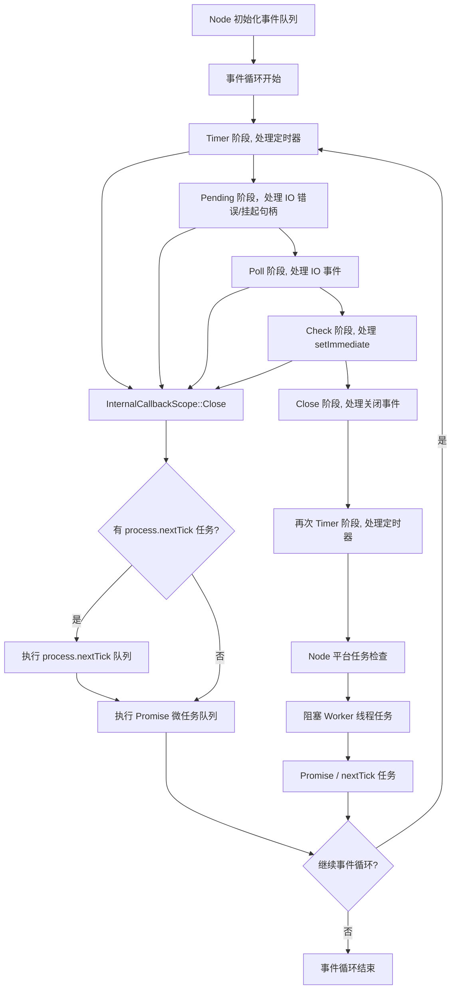
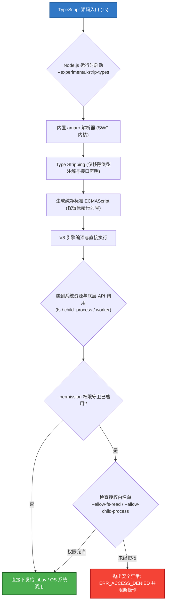

# 核心概念✅

## Node.js 和浏览器有什么区别？{#p0-node-browser}

<Answer>

1. **运行环境**：Node.js 的初衷是服务器端的 JavaScript 运行环境，而浏览器是客户端的 JavaScript 运行环境。宿主环境的差异导致内置原生对象和 API 的不同。Node.js 提供了如 `fs`、`http`、`path` 等面向服务器端 API，而浏览器提供了如 `window`、`document`、`XMLHttpRequest` 等客户端 API。
2. **模块系统**：Node.js 基于 V8 ，原生支持 CommonJS 和 ESM 模块系统，使用 `require` 和 `import` 进行模块加载。而浏览器通常使用 `<script>` 标签引入脚本，或通过 ES6 模块语法（`import`）来加载模块。
3. **事件循环**：Node.js 基于 Libuv 实现，主要用于处理 I/O 操作和异步任务，而浏览器的事件基于浏览器引擎， 循环还需要处理用户交互、渲染等任务。

**延伸阅读**

* [2009 Ryan Dahl: Node JS](https://www.youtube.com/watch?v=EeYvFl7li9E&list=PL37ZVnwpeshGNXb77ObNUbvax-VQ_DWJe) - Node.js 诞生的背景和初衷
* [深入浅出Node.js](https://book.douban.com/subject/25768396/) 第一章详细讲解了背景

</Answer>

## 是否使用过 Node.js ，用在了哪些场景？{#p0-node-usage}

<Answer>

Node.js 将 JavaScript 从浏览器端带到了服务器端，典型的应用场景如下

1. **Web 服务器**：采用 Express、Koa 等框架构建 RESTful API 或 GraphQL 服务。此外也可利用 `Next.js`、`Nuxt.js` `egg` 等框架构建全栈应用。
2. **工程化工具**：使用 Webpack、Rollup、Vite 等工具进行前端资源打包和构建。
3. **命令行工具**：编写 CLI 工具来处理文件操作、自动化任务、爬虫脚本等
4. **实时应用**： 利用 Socket.IO 等库实现实时通信应用，如聊天应用、在线协作工具等。

**面试官视角**

这是一个开放性试题，结合面试者的回答来进一步展开，针对面试者熟悉的领域做深入探讨。

</Answer>

## Node.js 阻塞(Blocking) 和非阻塞(Non-blocking) 是什么意思，有什么作用？ {#p0-blocking}

<Answer>

在 Node.js 语境，阻塞是指进程需要等待某个操作完成后才能继续执行后续任务，而非阻塞是指通过异步操作，进程可以在等待某个操作完成的同时继续执行其他任务。

阻塞和非阻塞主要针对 IO 操作，例如文件读写、网络请求等。Node.js 默认提供回调模式非阻塞 API, 阻塞 API 通常会在结尾加上 Sync 后缀，如 `fs.readFileSync` 是阻塞的，而 `fs.readFile` 是非阻塞的。此外 Node.js 还提供了 Promise 和 async/await 语法糖来处理异步操作，使代码更易读。

在编写服务端代码时，优先考虑使用非阻塞 API，可以提高应用的性能和响应速度，避免因为某个操作阻塞了整个事件循环，导致其他请求无法处理。

:::tip
在实际代码编写, 避免混合使用阻塞和非阻塞 API, 典型示例如下，由于采用非阻塞方式读取文件，然后卸载文件会导致文件未被读取就被删除

```js
const fs = require('node:fs')
fs.readFile('/file.md', (err, data) => {
  if (err) throw err
  console.log(data)
})
fs.unlinkSync('/file.md')
```

因修改为如下方式

```js
const fs = require('node:fs')
fs.readFile('/file.md', (readFileErr, data) => {
  if (readFileErr) throw readFileErr
  console.log(data)
  fs.unlink('/file.md', unlinkErr => {
    if (unlinkErr) throw unlinkErr
  })
})
```

:::

**延伸阅读**

* [overview-of-blocking-vs-non-blocking](https://nodejs.org/en/learn/asynchronous-work/overview-of-blocking-vs-non-blocking) 官方文档说明阻塞和非阻塞的概念
* [怎样理解阻塞非阻塞与同步异步的区别？](https://www.zhihu.com/question/19732473) 详细讲解了阻塞、非阻塞、同步、异步的区别

</Answer>

## 并行和并发有什么区别，node 是如何处理的？{#p0-parallel-concurrent}

<Answer>

**核心概念**

* 并发(Concurrency) 在一个时间段内处理多个任务，基于时间片轮转，单核 CPU
* 并行(Parallelism) 在一个时间点通知执行多个任务，必须是多核 CPU 才可以

一个经典图示说明来源 [Joe Armstrong Concurrent and Parallel Programming](https://joearms.github.io/published/2013-04-05-concurrent-and-parallel-programming.html) 并发相当于一个咖啡机同时服务于多个顾客，而并行相当于多个咖啡机同时服务于多个顾客。


:::tip

你可能听说过 Intel 的[超线程技术](https://www.intel.cn/content/www/cn/zh/gaming/resources/hyper-threading.html) 是指在单个物理 CPU 核心上模拟出两个逻辑核心，允许同时处理两个线程。这里的同时本质上也是并发而非真正的并行，可以理解为利用硬件模拟了软件的并发处理行为，所以更快。

:::

Node.js 本质是一个单线程的事件驱动模型，无法并行处理任务，但可以通过异步非阻塞 I/O 实现高效的并发处理。除了内部的 IO 操作，Node.js 提供了如下机制实现并发能力。

<Tabs>
<TabItem value="worker_threads">

import WorkerThreads from '!!raw-loader!./answers/thread/worker_threads.js';

<Sandpack
  template="node"
  options={{
      layout: "console", // preview | tests | console
      showConsole: false,
      editorHeight: 600,
  }}
  files={{
    "/index.js": WorkerThreads
  }}
/>

</TabItem>

<TabItem value="child_process">

import ChildProcess from '!!raw-loader!./answers/thread/child_process.js';

<Sandpack
   template="node"
   options={{
      layout: "console", // preview | tests | console
      showConsole: false,
      editorHeight: 600,
   }}
  files={{
    "/index.js": ChildProcess
  }}
/>

</TabItem>

<TabItem value="cluster">

import Cluster from '!!raw-loader!./answers/thread/cluster.js';

<Sandpack
   template="node"
   options={{
      layout: "console", // preview | tests | console
      showConsole: false,
      editorHeight: 600,
   }}
  files={{
    "/index.js": Cluster
  }}
/>

</TabItem>

</Tabs>

:::tip

注意是否并行控制取决于 CPU 核心数和操作系统的调度策略。所以并不意味着多核一定就会并行处理。一个简单的判断策略是基于 cpu 的利用率，如果是多核且 CPU 利用率大于 100%，则说明是并行处理。

:::

**延伸阅读**

* [libuv](https://libuv.org/) - 事件循环与线程池
* [worker_threads](https://nodejs.org/api/worker_threads.html)
* [一文讲清多线程和多线程同步](https://tech.meituan.com/2024/07/19/multi-threading-and-multi-thread-synchronization.html)

</Answer>

## 什么是环境变量，Node.js 如何管理配置环境变量？{#p0-env-variable}

<Answer>

环境变量(Environment Variables) 是操作系统级别的变量，用于存储系统配置、应用程序设置等信息。Node.js 通过 `process.env` 对象提供对环境变量的访问。在采用 `child_process、worker_threads` 等模块时，环境变量会自动传递给子进程或线程。

node 下通常使用 [dotenv](https://github.com/motdotla/dotenv) 等第三方库来加载 `.env` 文件中的环境变量，方便在不同环境（开发、测试、生产）下管理配置。本质使用通过修改 [process.env](https://nodejs.org/api/process.html#processenv) 来实现。这个能力在 [Node.js 20 中被内置](https://nodejs.org/docs/v24.5.0/api/environment_variables.html#dotenv) 通过 `node --env-file=.env app.js` 来加载。

:::tip

运行时可以直接通过 `USER_ID=239482 USER_KEY=foobar node app.js` 类似指令追加环境变量，为了兼容不同平台可以使用
[cross-env](https://www.npmjs.com/package/cross-env) 来实现运行时环境变量注入，此外在使用 npm script 时，也会注入一些默认环境变量，如 `npm_package_name`、`npm_package_version` 等，甚至可以通过, package.json 的 `config` 字段注入自定义环境变量。详见 [config](https://docs.npmjs.com/cli/v8/configuring-npm/package-json#config) 和
[environment](https://docs.npmjs.com/cli/v8/using-npm/scripts#environment) 深入了解。

:::

**延伸阅读**

* [process.env](https://nodejs.org/api/process.html#processenv)

</Answer>

## 说一下 Node.js 的事件循环模型？{#p0-event-loop}

<Answer>

需要知道的核心执行顺序如下

1. process.nextTick 优先级最高
2. Promise/queueMicrotask 微任务同级取决于执行顺序
3. setImmediate 等效 setTimeout(0)
4. setTimeout/setInterval
5. I/O 事件
6. 其他事件

此外需要注意的现象包括

1. `setTimeout, setImmediate` 在非 IO 的情况下，执行顺序不确定取决于延迟的时间因为可能由于执行时间过短，而 setTimeout 检查又早于 setImmediate 的检查，所以可能会出现 setTimeout 先执行的情况。而 IO 的情况下因为 `setImmediate` 是在 I/O 事件后执行的，所以一定会早于 setTimeout。
2. `nextTick` 优先级高于 `Promise` 微任务，但是如果在 `Promise` 微任务中同时调用了 nextTick 和 Promise, 则由于存在嵌套异步任务，nextTick 会被跳过，直到 Promise 微任务队列清空后才会执行 nextTick 队列。
3. 由于 `nextTick` 和 `promise、queueMicrotask` 都会存在清空队列的情况，所以会产生**I/O 饥饿现象**，即如果一直存在 `nextTick` 或 Promise 微任务，会导致 I/O 事件无法及时处理。
4. 在 ESM 模块中因为支持顶层 await 所以已经是异步 promise 和 queueMicrotask 会在 nextTick 之前执行。
5. [queueMicrotask](https://github.com/nodejs/node/blob/becb55aac3f7eb93b03223744c35c6194f11e3e9/test/parallel/test-microtask-queue-run-immediate.js#L26) 内部就是通过 `Promise.resolve().then()` 来实现的。这里只是一个语法糖

详细的执行流程如下

<Column title="事件循环">

<ColumnItem>

1. Node 初始化事件队列，内部执行 [Environment::InitializeLibuv](https://github.com/nodejs/node/blob/abccbb438b9175036e8b6bd1cc545a1ba5cda7e9/src/env.cc#L1073), 而后调用 [SpinEventLoopInternal](https://github.com/nodejs/node/blob/fc3f19ef932444e8de5d69fe3fb5033b2e0ec2e4/src/api/embed_helpers.cc#L39) 触发 Node 事件循环
2. 首先内部运行 [libuv 事件循环](https://docs.libuv.org/en/v1.x/design.html#the-i-o-loop) 的 [uv_run](https://github.com/nodejs/node/blob/abccbb438b9175036e8b6bd1cc545a1ba5cda7e9/deps/uv/src/unix/core.c#L427) [uv_run 参数含义参考 libuv 说明](https://docs.libuv.org/en/v1.x/loop.html#c.uv_run) 具体流程如下
   1. 处理定时器相关句柄，内部调用 [uv__run_timers(loop)](https://github.com/nodejs/node/blob/abccbb438b9175036e8b6bd1cc545a1ba5cda7e9/deps/uv/src/timer.c#L165)
   2. Pending 回调阶段，处理 IO 错误/挂起句柄，例如 tcp/udp 连接错误等，内部调用 [uv__run_pending](https://github.com/nodejs/node/blob/abccbb438b9175036e8b6bd1cc545a1ba5cda7e9/deps/uv/src/unix/core.c#L842), 具体绑定地方可以搜索 [uv__io_feed](https://github.com/search?q=repo%3Anodejs%2Fnode%20uv__io_feed&type=code) 调用的地方
   3. libuv 内部处理空闲和准备队列句柄，`uv__run_idle/uv__run_prepare`,  具体细节可以参考 [libuv io loop](https://docs.libuv.org/en/v1.x/design.html#the-i-o-loop), 对应函数通过宏定义写在 [loop-watcher](https://github.com/nodejs/node/blob/abccbb438b9175036e8b6bd1cc545a1ba5cda7e9/deps/uv/src/unix/loop-watcher.c#L48) 文件
   4. 处理 IO 事件，包括事件的注册/取消注册，事件的触发等，注意不会一直执行回调，上限 48，具体可以参考 [uv__io_poll(loop, timeout)](https://github.com/nodejs/node/blob/abccbb438b9175036e8b6bd1cc545a1ba5cda7e9/deps/uv/src/unix/kqueue.c#L159)
   5. 此处会再次执行一次 uv__run_pending，用于处理遗留回调包括，上一轮无法执行的回调/io 写入的回调等，避免 I/O 饥饿而导致某些句柄一直无法执行，最多执行 8 次，具体可以参考 [uv__run_pending(loop)](https://github.com/nodejs/node/blob/abccbb438b9175036e8b6bd1cc545a1ba5cda7e9/deps/uv/src/unix/core.c#L464)
   6. 处理 setImmediate 回调，内部调用 [uv__run_check(loop)](https://github.com/nodejs/node/blob/abccbb438b9175036e8b6bd1cc545a1ba5cda7e9/deps/uv/src/unix/loop-watcher.c#L48) 对应函数通过宏定义写在 loop-watcher 中
   7. 处理 close 事件，内部调用 [uv__run_closing_handles(loop)](https://github.com/nodejs/node/blob/abccbb438b9175036e8b6bd1cc545a1ba5cda7e9/deps/uv/src/unix/core.c#L368)
   8. 结尾会再次更新时间，执行 [uv__run_timers(loop)](https://github.com/nodejs/node/blob/abccbb438b9175036e8b6bd1cc545a1ba5cda7e9/deps/uv/src/timer.c#L165) 处理定时器句柄，之所以有二次检查，是为了因为前面的各阶段已处理了大量 IO 事件，可能会有新的定时器触发，所以需要再次检查
3. libuv 事件循环运行完毕后会执行, node 内部的检查其他任务，内部调用 [platform->DrainTasks(isolate)](https://github.com/nodejs/node/blob/abccbb438b9175036e8b6bd1cc545a1ba5cda7e9/src/node_platform.cc#L578) 核心流程包括
   1. 处理阻塞 worker 线程任务, 内部调用 [worker_thread_task_runner_->BlockingDrain()](https://github.com/nodejs/node/blob/abccbb438b9175036e8b6bd1cc545a1ba5cda7e9/src/node_platform.cc#L602C3-L602C48)
   2. Promise/nextTick 队列处理，内部调用 [FlushForegroundTasksInternal](https://github.com/nodejs/node/blob/abccbb438b9175036e8b6bd1cc545a1ba5cda7e9/src/node_platform.cc#L606C30-L606C58)
4. 只要还有任务需要执行且没有触发停止，则 2,3 步骤会一直循环
5. 此外 nextTick 和 Promise 任务，还会在步骤 2 中相关阶段回调执行完毕后，通过回调函数的析构函数触发, 内部调用 [InternalCallbackScope::Close](https://github.com/nodejs/node/blob/abccbb438b9175036e8b6bd1cc545a1ba5cda7e9/src/api/callback.cc#L103)，核心逻辑包括
   1. 如果 js 运行存在嵌套异步任务则跳过处理微任务和 nextTick 队列
   2. 如果存在 `process.nextTick` 调度，则执行当前轮的 nextTick 队列，一直执行直到 nextTick 队列为空，**注意这也是为什么 nextTick 会导致 I/O 饥饿的原因**
   3. 如果没有 `process.nextTick` 调度，则执行当前轮的 Promise 微任务队列，直到 Promise 微任务队列为空

</ColumnItem>

<ColumnItem>



:::tip

上述示意图和流程并没有办法囊括所有细节，比如微任务的执行存在多个检查点，但是基本上涵盖了作为前端需要掌握的核心流程。
如果需要深入了解，可以结合官方指南 [Asynchronous Work](https://nodejs.org/en/learn/asynchronous-work/event-loop-timers-and-nexttick) 的多篇文章
阅读源码深入理解

:::

</ColumnItem>

</Column>

**延伸阅读**

* [Visualizing nextTick and Promise Queues in Node.js Event Loop](https://www.builder.io/blog/NodeJS-visualizing-nextTick-and-promise-queues?utm_source=chatgpt.com) 可视化的方式说明整个循环

</Answer>

## Buffer 和 Stream 是什么，有什么区别？{#p0-buffer-stream}

<Answer>

| 项目 | Buffer | Stream |
|---|---|---|
| 定义 | Node 提供的二进制数据容器(类似 Uint8Array 的扩展) | 抽象的分块读/写接口 |
| 作用方式 | 一次性把数据全部载入内存 | 按块(chunk)顺序处理 |
| 适用场景 | 小体积数据、需随机访问或整体计算 | 大文件、网络传输、持续数据流 |
| 内存占用 | 与数据总大小线性相关 | 稳定, 受 highWaterMark 限制 |
| API 侧重 | 编解码、拷贝、切片 | 事件/管道/背压控制 |
| 关系 | Stream 内部产出或消费 Buffer | 以 Buffer 作为最小数据单元 |

**核心概念**

* Buffer：堆外内存（C++ 分配，V8 管理引用），固定长度，其原型继承自 Uint8Array，提供 from/alloc/concat 等 API，常用于文件块、网络包、加解密、编码转换。
* Stream：对分块 I/O 的抽象，类型包括 Readable、Writable、Duplex、Transform。支持暂停/流动模式、pipe 链式、背压（backpressure）调节生产与消费速度。
* 背压：Writable.write 返回 false 时表示下游缓冲已满，应等待 'drain' 事件再继续写入。

**代码示例**

```js
// 对比读取大文件
const fs = require('node:fs')
const path = './big.log'

// 方式1: Buffer 一次性读入 (风险：大文件内存峰值高)
fs.readFile(path, (e, data) => {
  if (!e) {
    console.log('readFile size(MB):', (data.length / 1024 / 1024).toFixed(2))
  }
})

// 方式2: Stream 逐块读取，处理过程中不需全部驻留
let total = 0
fs.createReadStream(path, { highWaterMark: 64 * 1024 })
  .on('data', chunk => {
    total += chunk.length
    // chunk 是一个 Buffer，可局部解析/统计
  })
  .on('end', () => console.log('stream size(MB):', (total / 1024 / 1024).toFixed(2)))
```

**常见误区**

* 将大文件用 readFile 读入导致内存暴涨；应优先使用流或管道 (pipe)。
* 忽略背压：连续 write 导致队列堆积；需在 write 返回 false 时等待 'drain'。
* 错误编码：二进制内容直接 toString('utf8') 可能破坏多字节边界，跨 chunk 拼接前确保边界完整（可用 StringDecoder）。

</Answer>

## 现代 Node.js 原生 TypeScript 运行时支持（Type Stripping）、内置 SQLite（node:sqlite）与安全权限控制模型（Permission Model）？ {#p0-node-modern-runtime-features}

<Answer>

**核心结论**

- **原生 TypeScript 支持（Type Stripping）**：Node.js 22.6+ 正式引入原生 TypeScript 运行时能力（`--experimental-strip-types`，并在后续版本持续升级为开箱即用）。底层依托封装了 Rust SWC 的内置轻量解析器 `amaro`，通过只剥离类型注解、不执行开销巨大的语义类型检查（Type Checking）与语法降级，提供与原生 JavaScript 毫无二致的毫秒级冷启动，使轻量脚本开发、自动化与单元测试彻底摆脱打包工具链。
- **内置轻量数据库（node:sqlite）**：Node.js 22.5+ 正式内置 `node:sqlite`（提供 `DatabaseSync`）。开发者彻底告别了由 `node-gyp`、Python、本地 C++ 编译器和跨平台预编译二进制缺失带来的“安装噩梦”，在主进程内直接获取零网络开销、微秒级响应、支持 WAL（Write-Ahead Logging）高并发读写锁的原生嵌入式数据库能力。
- **安全权限控制模型（Permission Model）**：为防御日益严峻的 npm 供应链投毒与恶意第三方依赖攻击，Node.js 引入了原生沙箱级权限模型（`--permission`）。通过 `--allow-fs-read`、`--allow-fs-write`、`--allow-child-process` 与 `--allow-worker`，在 C++ 底层系统调用入口实施安全防御，杜绝恶意代码盗取本地密钥或反弹 Shell。
- **同步加载 ES 模块（require(esm)）**：Node.js 22+ 稳定支持在 CommonJS 模块中直接通过 `require()` 同步加载纯 ESM 模块（前提是被加载模块不含顶层 await），彻底终结了 CJS 与 ESM 之间长达数年的生态割裂与“函数颜色”异步污染。

---

**原理解析**

**一、原生 TypeScript 运行时机制（Type Stripping 与 amaro）:**


**1. 传统 TS 运行方案的性能瓶颈**

在过去，在 Node.js 中执行 TypeScript 代码主要有三种方案：
- **`tsc` 预编译**：先通过官方 `tsc` 全量编译成 `.js` 再运行。缺点是开发体验笨重，存在构建步骤；
- **`ts-node`**：在运行时通过 Compiler API 拦截 `require`。由于每次启动都会加载完整的 TypeScript 编译器并递归解析成千上万个 `.d.ts` 声明文件进行全量类型检查，启动时间往往长达数秒，内存占用极大；
- **`tsx` / `esbuild-register`**：通过 esbuild 拦截转译。虽然速度极快，但依然需要引入全局或项目级 npm 依赖，在精简的 Docker 生产镜像或受限运维环境中并不方便。

**2. Type Stripping 原理与边界**

Node.js 官方的方案采取了“类型擦除（Type Stripping）”策略：
- **核心解析器 amaro**：Node.js 内部集成了基于 Rust 编写的 SWC 高性能解析器封装模块 `amaro`。
- **纯粹擦除，零类型检查**：启动时仅扫描代码 AST，将所有的类型注解（如 `: string`、`interface`、`type`、泛型等）直接替换为等长的**空白字符（Whitespace Padding）**。
- **源码映射对齐**：通过空格占位而非删除文本，使得代码在交给 V8 引擎执行时，抛出的堆栈错误行列号与原 `.ts` 源码 100% 精确对齐，甚至无需生成额外的 SourceMap 文件。
- **语法限制与设计哲学**：
  - **不支持 TS 专属运行时语法**：明确不支持非 `const enum`、类构造函数参数属性（如 `constructor(public id: number)`）、命名空间（`namespace`）。
  - **设计理念**：促使生态回归 TC39 标准 ECMAScript 语法，将类型检查留给 IDE 或 CI 中的 `tsc --noEmit`，运行时追求极致的加载速度与稳定性。

| 对比维度 | 原生 Type Stripping | ts-node | tsx (esbuild) |
| :--- | :--- | :--- | :--- |
| **外部依赖** | **零依赖**（Node.js 内置） | 需安装 `typescript` + `ts-node` | 需安装 `tsx` / `esbuild` |
| **启动速度** | **毫秒级**（与原生 JS 几乎相同） | 慢（数秒，需加载完整编译器） | 极快（毫秒级） |
| **类型检查** | 否（仅擦除类型） | 是（默认全量检查） | 否（仅语法转译） |
| **TS 专属特性** | 仅支持标准 TS 类型注解 | 支持所有 TS 特性（包含 enum 等） | 支持绝大多数 TS 语法降级 |
| **适用场景** | CLI 工具、单测运行、自动化运维脚本 | 重视运行时严格类型校验的老项目 | 现代本地全栈开发构建与调试 |

---

**二、内置轻量 SQLite 引擎（node:sqlite）:**


**1. 痛点破局：告别 node-gyp 原生编译**

长期以来，Node.js 社区使用 SQLite 主要依赖 `better-sqlite3` 或 `sqlite3`。这些库都属于 C++ 原生 Addon，每次 `npm install` 都会触发 `node-gyp`。
在容器化部署（如 Alpine Linux 缺少编译链）、CI/CD 节点或团队跨平台（Windows / macOS M 系列 / Linux ARM）开发时，极易因 Python 缺失、glibc 版本不匹配或预编译文件（Prebuild Binaries）下载失败而导致构建崩溃。
Node.js 官方将 SQLite 核心直接内嵌于运行时二进制中，开箱即用，彻底消除了外部环境依赖。

**2. 同步 API（DatabaseSync）设计取向与 WAL 并发锁**

- **坚持同步 API（DatabaseSync）的考量**：
  SQLite 是同进程内的内存/磁盘嵌入式数据库，单次读取延迟通常在数十微秒级别。若强行设计为基于 Promise 的异步 API，其微任务排队与上下文切换调度开销甚至远超磁盘/内存读取本身。因此官方提供同步 API，在简化业务代码的同时最大化单操作吞吐。
- **并发与锁机制（WAL 模式）**：
  默认情况下 SQLite 采用回滚日志（Rollback Journal），读写互斥。`node:sqlite` 支持开启 WAL（Write-Ahead Logging）预写日志模式：
  ```sql
  PRAGMA journal_mode = WAL;
  ```
  在 WAL 模式下，写操作追加到独立 WAL 文件，读操作直接读取主数据文件与 WAL 快照，实现**读写完全并发、互不阻塞**，仅在多个并发写入时通过单写锁进行毫秒级排队，充分满足中小型服务、配置缓存与本地存储的高并发要求。

---

**三、安全权限控制模型（Permission Model）:**


**1. 解决的核心安全威胁：供应链投毒**

在庞大的 npm 生态中，普通项目经常间接依赖成百上千个三方包。一旦某个包被黑客接管投毒（供应链攻击），恶意代码可在运行时任意读取用户的 `~/.ssh/id_rsa`、AWS 环境变量密钥，或者调用 `child_process.exec('rm -rf /')`、反弹 Shell 建立后门。
Node.js 权限模型通过操作系统沙箱理念，在进程启动时强制收紧默认权限。

**2. 核心拦截标志位与底层工作机制**

启用 `--permission` 后，所有敏感系统调用默认被拒绝，必须显式声明白名单：
- `--allow-fs-read` / `--allow-fs-write`：限制文件系统的访问路径。未声明的路径读写将直接抛出 `ERR_ACCESS_DENIED`。
- `--allow-child-process`：禁止派生子进程，彻底阻断远程命令执行（RCE）攻击。
- `--allow-worker`：禁止创建工作线程，防止通过多线程逃逸沙箱或耗尽 CPU 资源。
- **底层拦截点**：Node.js 在 C++ 内部核心层（如 `node_file.cc`、`process_wrap.cc`）对 Libuv 的系统调用进行了入口校验。任何由 JS 发起的调用在触达宿主内核之前，均会被权限检查哨兵拦截。

---

**四、同步加载 ES 模块机制（require(esm)）:**


**1. 历史死锁：CJS 与 ESM 的割裂**

在 Node.js 的双模块时代，ESM 可以通过 `createRequire` 或内部机制调用 CJS，但 CJS 模块中却无法直接使用 `require()` 同步加载 ESM。过去唯一的办法是改用动态异步 `import('./esm.mjs')`。
这导致了严重的“函数颜色”污染——一旦底层依赖库升级为纯 ESM（Pure ESM），所有调用它的上层 CJS 同步函数必须全链路重构成 `async/await`，给社区带来巨大迁移阻力。

**2. 同步评估实现与边界约束**

Node.js 22+ 打破了这一壁垒：
- **同步图评估（Synchronous Evaluation）**：当 CJS 调用 `require('./esm.mjs')` 时，Node.js 模块加载器会同步解析该 ESM 的语法树并同步执行模块评估，直接返回导出的命名空间对象。
- **核心限制：严禁包含顶层 await（Top-Level Await）**：
  若被加载的 ESM 模块内部（或其深层依赖链中）包含了顶层 `await`，由于其初始化必然是异步 Promise，无法强行在同步 `require` 契约中同步返回对象，此时运行时会抛出 `ERR_REQUIRE_ASYNC_MODULE`，强制提示开发者改用异步 `import()`。

---

**规范代码与架构拓扑**

**1. Node.js 现代运行时执行链路与权限拦截流程图:**




**2. 规范代码示例:**


**(1) 原生 TypeScript 运行与限制规范**

```ts
// app.ts
interface User {
  id: number
  name: string
}

// 纯类型注解：原生 Type Stripping 完美支持
function greet(user: User): string {
  return `Hello, ${user.name} (ID: ${user.id})`
}

console.log(greet({ id: 1, name: 'Node.js' }))

// 注意：若使用 TS 特有运行时语法（如下），原生剥离将报错：
// enum Status { Active, Inactive } // ❌ 不支持，建议用 const 对象 + as const 替代
// const Status = { Active: 0, Inactive: 1 } as const // ✅ 标准 ECMAScript
```
运行命令：
```bash
node --experimental-strip-types app.ts
```

**(2) 内置 SQLite（node:sqlite）高效操作与事务**

```js
// db.mjs
import { DatabaseSync } from 'node:sqlite'

// 1. 初始化数据库文件（或内存数据库 ':memory:'）
const db = new DatabaseSync('./production.db')

// 2. 开启 WAL 高并发预写日志模式
db.exec('PRAGMA journal_mode = WAL;')

// 3. 创建数据表
db.exec(`
  CREATE TABLE IF NOT EXISTS logs (
    id INTEGER PRIMARY KEY AUTOINCREMENT,
    level TEXT NOT NULL,
    message TEXT NOT NULL,
    created_at INTEGER NOT NULL
  ) STRICT;
`)

// 4. 参数化预编译语句（自动防御 SQL 注入）
const insertStmt = db.prepare(`
  INSERT INTO logs (level, message, created_at)
  VALUES (?, ?, ?)
`)

// 5. 批量写入与同步事务保障
db.exec('BEGIN TRANSACTION;')
try {
  insertStmt.run('INFO', 'Server started', Date.now())
  insertStmt.run('WARN', 'High memory usage', Date.now())
  db.exec('COMMIT;')
} catch (error) {
  db.exec('ROLLBACK;')
  throw error
}

// 6. 高效查询
const queryStmt = db.prepare('SELECT * FROM logs WHERE level = ?')
const results = queryStmt.all('INFO')
console.log('查询结果:', results)

db.close()
```

**(3) 权限控制模型（Permission Model）防护实战**

启动受限 Node.js 进程：
```bash
node --permission \
  --allow-fs-read=/app/config,/app/data \
  --allow-fs-write=/app/logs \
  app.js
```
业务代码中动态检测与防御处理：
```js
// app.js
import fs from 'node:fs'

// 动态查询当前执行上下文是否拥有指定权限
const hasWritePermission = process.permission.has('fs.write', '/app/logs/server.log')

if (hasWritePermission) {
  fs.writeFileSync('/app/logs/server.log', 'Log entry\n', { flag: 'a' })
} else {
  console.warn('警告：缺少日志写入权限，回退至终端输出')
}

try {
  // 模拟未经授权的恶意依赖偷读 SSH 私钥
  fs.readFileSync('/root/.ssh/id_rsa')
} catch (err) {
  console.error('成功防御未授权读取:', err.code) // 输出: ERR_ACCESS_DENIED
}
```

**(4) CommonJS 同步 require(esm)**

```javascript
// esm-library.mjs (纯 ESM 库，不包含顶层 await)
export function calculateHash(input) {
  return `hash-${input}`
}

// main.cjs (CommonJS 宿主)
const { calculateHash } = require('./esm-library.mjs')

console.log('CJS 同步调用 ESM 成功:', calculateHash('data'))
```

---

**面试官视角**

- **核心考察目的**：评估候选人是否跟进现代服务端 JavaScript 运行时的最新工业级标准（Node.js 20~23+）。考察方向涵盖运行时架构设计（Type Stripping vs Compiler）、原生嵌入式存储选型、服务端生产安全边界，以及模块化系统的底层互通原理。
- **深度追问清单**：
  1. *Node.js 原生支持运行 TS 之后，我们在企业级项目中是否还需要 tsc 或打包工具？*
     - 回答要点：对于小型脚本、CLI 工具、简单的微服务或者单元测试，原生 Type Stripping 提供了开箱即用的绝佳体验，完全无需配置庞大的工具链。但在大型企业级工程中，依然需要：① 在 CI/CD 阶段运行 `tsc --noEmit` 进行全量静态类型合规检查；② 前端/客户端打包构建依旧需要 Tree-shaking、代码压缩（Minification）以及 CSS/资源内联；③ 生产环境如果使用了非标准的 TS 语法降级，仍需要编译产物。
  2. *既然 node:sqlite 是同步的（DatabaseSync），它会不会阻塞 Node.js 的事件循环（Event Loop）？在高并发服务中如何避免卡顿？*
     - 回答要点：SQLite 作为同进程轻量数据库，绝大多数单行增删改查都是微秒级的内存或顺序磁盘追加（WAL 模式），耗时远低于一次网络请求的 I/O 等待，不会成为事件循环的瓶颈。但是，如果涉及复杂的全表扫描、深度聚合统计或大数据量批量迁移，其长周期同步执行确实会占用主线程。解决方案是结合 Node.js 的 `worker_threads`（工作线程池），将耗时的大型查询分派到后台独立线程执行，并通过主线程 IPC 接收结果，从而兼顾纯原生与事件循环的高吞吐。
  3. *为什么 require(esm) 严厉禁止带有顶层 await（Top-Level Await）的 ESM 模块？从底层执行机制解释其原因。*
     - 回答要点：CommonJS 的 `require` 规范是严格同步语义，调用必须在当前事件循环滴答（Tick）内同步返回模块的导出对象。而带有 Top-Level Await 的 ESM 模块在执行阶段本质上返回的是一个 Pending 状态的 Promise。由于 JavaScript 的单线程事件循环设计，同步代码无法在主线程内“挂起等待 Promise 完成而不释放线程”（否则将产生死锁或事件循环彻底停滞）。因此，Node.js 强制要求只能同步加载不含异步等待的确定性 ESM 模块。

---

**延伸阅读**

- [Node.js Official Documentation: Running TypeScript (Type Stripping)](https://nodejs.org/api/typescript.html) - 原生 TypeScript 剥离机制与参数规范
- [Node.js Official Documentation: SQLite (node:sqlite)](https://nodejs.org/api/sqlite.html) - 内置 SQLite 模块 DatabaseSync 完整 API
- [Node.js Official Documentation: Permission Model](https://nodejs.org/api/permissions.html) - 权限控制模型设计与标志说明
- [Node.js Blog: Support for require(esm) in Node.js](https://nodejs.org/en/blog/release/v22.0.0#requireesm) - 探索 CommonJS 同步加载 ES 模块的技术实现

</Answer>

