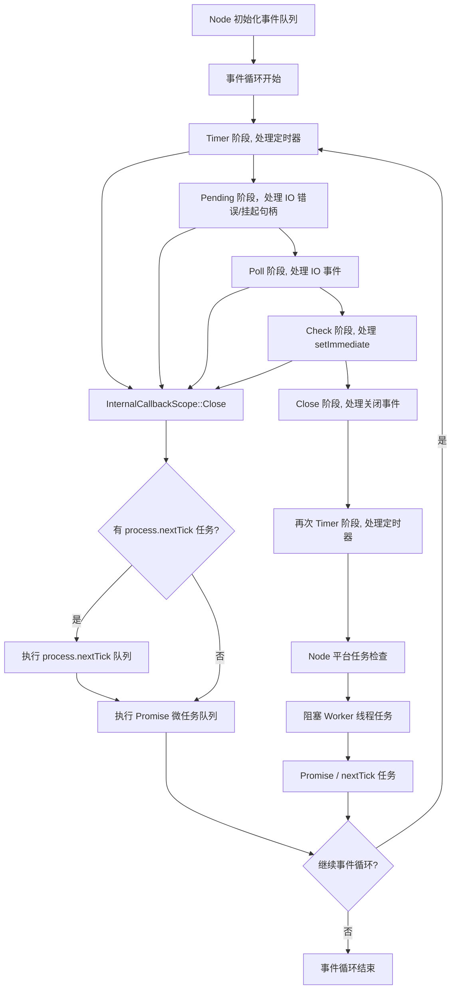

# 核心概念

## Node.js 和浏览器有什么区别？{#p0-node-browser}

<Answer>

1. **运行环境**：Node.js 的初衷是服务器端的 JavaScript 运行环境，而浏览器是客户端的 JavaScript 运行环境。宿主环境的差异导致内置原生对象和 API 的不同。Node.js 提供了如 `fs`、`http`、`path` 等面向服务器端 API，而浏览器提供了如 `window`、`document`、`XMLHttpRequest` 等客户端 API。
2. **模块系统**：Node.js 基于 V8 ，原生支持 CommonJS 和 ESM 模块系统，使用 `require` 和 `import` 进行模块加载。而浏览器通常使用 `<script>` 标签引入脚本，或通过 ES6 模块语法（`import`）来加载模块。
3. **事件循环**：Node.js 基于 Libuv 实现，主要用于处理 I/O 操作和异步任务，而浏览器的事件基于浏览器引擎， 循环还需要处理用户交互、渲染等任务。

**延伸阅读**

* [2009 Ryan Dahl: Node JS](https://www.youtube.com/watch?v=EeYvFl7li9E&list=PL37ZVnwpeshGNXb77ObNUbvax-VQ_DWJe) - Node.js 诞生的背景和初衷
* [深入浅出Node.js](https://book.douban.com/subject/25768396/) 第一章详细讲解了背景

</Answer>

## 是否使用过 Node.js ，用在了哪些场景？{#p0-node-usage}

<Answer>

Node.js 将 JavaScript 从浏览器端带到了服务器端，典型的应用场景如下

1. **Web 服务器**：采用 Express、Koa 等框架构建 RESTful API 或 GraphQL 服务。此外也可利用 `Next.js`、`Nuxt.js` `egg` 等框架构建全栈应用。
2. **工程化工具**：使用 Webpack、Rollup、Vite 等工具进行前端资源打包和构建。
3. **命令行工具**：编写 CLI 工具来处理文件操作、自动化任务、爬虫脚本等
4. **实时应用**： 利用 Socket.IO 等库实现实时通信应用，如聊天应用、在线协作工具等。

**面试官视角**

这是一个开放性试题，结合面试者的回答来进一步展开，针对面试者熟悉的领域做深入探讨。

</Answer>

## Node.js 阻塞(Blocking) 和非阻塞(Non-blocking) 是什么意思，有什么作用？ {#p0-blocking}

<Answer>

在 Node.js 语境，阻塞是指进程需要等待某个操作完成后才能继续执行后续任务，而非阻塞是指通过异步操作，进程可以在等待某个操作完成的同时继续执行其他任务。

阻塞和非阻塞主要针对 IO 操作，例如文件读写、网络请求等。Node.js 默认提供回调模式非阻塞 API, 阻塞 API 通常会在结尾加上 Sync 后缀，如 `fs.readFileSync` 是阻塞的，而 `fs.readFile` 是非阻塞的。此外 Node.js 还提供了 Promise 和 async/await 语法糖来处理异步操作，使代码更易读。

在编写服务端代码时，优先考虑使用非阻塞 API，可以提高应用的性能和响应速度，避免因为某个操作阻塞了整个事件循环，导致其他请求无法处理。

:::tip
在实际代码编写, 避免混合使用阻塞和非阻塞 API, 典型示例如下，由于采用非阻塞方式读取文件，然后卸载文件会导致文件未被读取就被删除

```js
const fs = require('node:fs')
fs.readFile('/file.md', (err, data) => {
  if (err) throw err
  console.log(data)
})
fs.unlinkSync('/file.md')
```

因修改为如下方式

```js
const fs = require('node:fs')
fs.readFile('/file.md', (readFileErr, data) => {
  if (readFileErr) throw readFileErr
  console.log(data)
  fs.unlink('/file.md', unlinkErr => {
    if (unlinkErr) throw unlinkErr
  })
})
```

:::

**延伸阅读**

* [overview-of-blocking-vs-non-blocking](https://nodejs.org/en/learn/asynchronous-work/overview-of-blocking-vs-non-blocking) 官方文档说明阻塞和非阻塞的概念
* [怎样理解阻塞非阻塞与同步异步的区别？](https://www.zhihu.com/question/19732473) 详细讲解了阻塞、非阻塞、同步、异步的区别

</Answer>

## 并行和并发有什么区别，node 是如何处理的？{#p0-parallel-concurrent}

<Answer>

**核心概念**

* 并发(Concurrency) 在一个时间段内处理多个任务，基于时间片轮转，单核 CPU
* 并行(Parallelism) 在一个时间点通知执行多个任务，必须是多核 CPU 才可以

一个经典图示说明来源 [Joe Armstrong Concurrent and Parallel Programming](https://joearms.github.io/published/2013-04-05-concurrent-and-parallel-programming.html) 并发相当于一个咖啡机同时服务于多个顾客，而并行相当于多个咖啡机同时服务于多个顾客。


:::tip

你可能听说过 Intel 的[超线程技术](https://www.intel.cn/content/www/cn/zh/gaming/resources/hyper-threading.html) 是指在单个物理 CPU 核心上模拟出两个逻辑核心，允许同时处理两个线程。这里的同时本质上也是并发而非真正的并行，可以理解为利用硬件模拟了软件的并发处理行为，所以更快。

:::

Node.js 本质是一个单线程的事件驱动模型，无法并行处理任务，但可以通过异步非阻塞 I/O 实现高效的并发处理。除了内部的 IO 操作，Node.js 提供了如下机制实现并发能力。

<Tabs>
<TabItem value="worker_threads">

import WorkerThreads from '!!raw-loader!./answers/thread/worker_threads.js';

<Sandpack
  template="node"
  options={{
      layout: "console", // preview | tests | console
      showConsole: false,
      editorHeight: 600,
  }}
  files={{
    "/index.js": WorkerThreads
  }}
/>

</TabItem>

<TabItem value="child_process">

import ChildProcess from '!!raw-loader!./answers/thread/child_process.js';

<Sandpack
   template="node"
   options={{
      layout: "console", // preview | tests | console
      showConsole: false,
      editorHeight: 600,
   }}
  files={{
    "/index.js": ChildProcess
  }}
/>

</TabItem>

<TabItem value="cluster">

import Cluster from '!!raw-loader!./answers/thread/cluster.js';

<Sandpack
   template="node"
   options={{
      layout: "console", // preview | tests | console
      showConsole: false,
      editorHeight: 600,
   }}
  files={{
    "/index.js": Cluster
  }}
/>

</TabItem>

</Tabs>

:::tip

注意是否并行控制取决于 CPU 核心数和操作系统的调度策略。所以并不意味着多核一定就会并行处理。一个简单的判断策略是基于 cpu 的利用率，如果是多核且 CPU 利用率大于 100%，则说明是并行处理。

:::

**延伸阅读**

* [libuv](https://libuv.org/) - 事件循环与线程池
* [worker_threads](https://nodejs.org/api/worker_threads.html)
* [一文讲清多线程和多线程同步](https://tech.meituan.com/2024/07/19/multi-threading-and-multi-thread-synchronization.html)

</Answer>

## 什么是环境变量，Node.js 如何管理配置环境变量？{#p0-env-variable}

<Answer>

环境变量(Environment Variables) 是操作系统级别的变量，用于存储系统配置、应用程序设置等信息。Node.js 通过 `process.env` 对象提供对环境变量的访问。在采用 `child_process、worker_threads` 等模块时，环境变量会自动传递给子进程或线程。

node 下通常使用 [dotenv](https://github.com/motdotla/dotenv) 等第三方库来加载 `.env` 文件中的环境变量，方便在不同环境（开发、测试、生产）下管理配置。本质使用通过修改 [process.env](https://nodejs.org/api/process.html#processenv) 来实现。这个能力在 [Node.js 20 中被内置](https://nodejs.org/docs/v24.5.0/api/environment_variables.html#dotenv) 通过 `node --env-file=.env app.js` 来加载。

:::tip

运行时可以直接通过 `USER_ID=239482 USER_KEY=foobar node app.js` 类似指令追加环境变量，为了兼容不同平台可以使用
[cross-env](https://www.npmjs.com/package/cross-env) 来实现运行时环境变量注入，此外在使用 npm script 时，也会注入一些默认环境变量，如 `npm_package_name`、`npm_package_version` 等，甚至可以通过, package.json 的 `config` 字段注入自定义环境变量。详见 [config](https://docs.npmjs.com/cli/v8/configuring-npm/package-json#config) 和
[environment](https://docs.npmjs.com/cli/v8/using-npm/scripts#environment) 深入了解。

:::

**延伸阅读**

* [process.env](https://nodejs.org/api/process.html#processenv)

</Answer>

## 说一下 Node.js 的事件循环模型？{#p0-event-loop}

<Answer>

需要知道的核心执行顺序如下

1. process.nextTick 优先级最高
2. Promise 微任务
3. setImmediate 等效 setTimeout(0)
4. setTimeout/setInterval
5. I/O 事件
6. 其他事件

此外需要注意的现象包括

1. `setTimeout, setImmediate` 在非 IO 的情况下，执行顺序不确定取决于延迟的时间因为可能由于执行时间过短，而 setTimeout 检查又早于 setImmediate 的检查，所以可能会出现 setTimeout 先执行的情况。而 IO 的情况下因为 `setImmediate` 是在 I/O 事件后执行的，所以一定会早于 setTimeout。
2. `nextTick` 优先级高于 `Promise` 微任务，但是如果在 `Promise` 微任务中同时调用了 nextTick 和 Promise, 则由于存在嵌套异步任务，nextTick 会被跳过，直到 Promise 微任务队列清空后才会执行 nextTick 队列。
3. 由于 `nextTick` 和 `Promise` 都会存在清空队列的情况，所以会产生**I/O 饥饿现象**，即如果一直存在 `nextTick` 或 Promise 微任务，会导致 I/O 事件无法及时处理。

详细的执行流程如下



1. Node 初始化事件队列，内部执行 [Environment::InitializeLibuv](https://github.com/nodejs/node/blob/abccbb438b9175036e8b6bd1cc545a1ba5cda7e9/src/env.cc#L1073), 而后调用 [SpinEventLoopInternal](https://github.com/nodejs/node/blob/fc3f19ef932444e8de5d69fe3fb5033b2e0ec2e4/src/api/embed_helpers.cc#L39) 触发 Node 事件循环
2. 首先内部运行 [libuv 事件循环](https://docs.libuv.org/en/v1.x/design.html#the-i-o-loop) 的 [uv_run](https://github.com/nodejs/node/blob/abccbb438b9175036e8b6bd1cc545a1ba5cda7e9/deps/uv/src/unix/core.c#L427) [uv_run 参数含义参考 libuv 说明](https://docs.libuv.org/en/v1.x/loop.html#c.uv_run) 具体流程如下
   1. 处理定时器相关句柄，内部调用 [uv__run_timers(loop)](https://github.com/nodejs/node/blob/abccbb438b9175036e8b6bd1cc545a1ba5cda7e9/deps/uv/src/timer.c#L165)
   2. Pending 回调阶段，处理 IO 错误/挂起句柄，例如 tcp/udp 连接错误等，内部调用 [uv__run_pending](https://github.com/nodejs/node/blob/abccbb438b9175036e8b6bd1cc545a1ba5cda7e9/deps/uv/src/unix/core.c#L842), 具体绑定地方可以搜索 [uv__io_feed](https://github.com/search?q=repo%3Anodejs%2Fnode%20uv__io_feed&type=code) 调用的地方
   3. libuv 内部处理空闲和准备队列句柄，`uv__run_idle/uv__run_prepare`,  具体细节可以参考 [libuv io loop](https://docs.libuv.org/en/v1.x/design.html#the-i-o-loop), 对应函数通过宏定义写在 [loop-watcher](https://github.com/nodejs/node/blob/abccbb438b9175036e8b6bd1cc545a1ba5cda7e9/deps/uv/src/unix/loop-watcher.c#L48) 文件
   4. 处理 IO 事件，包括事件的注册/取消注册，事件的触发等，注意不会一直执行回调，上限 48，具体可以参考 [uv__io_poll(loop, timeout)](https://github.com/nodejs/node/blob/abccbb438b9175036e8b6bd1cc545a1ba5cda7e9/deps/uv/src/unix/kqueue.c#L159)
   5. 此处会再次执行一次 uv__run_pending，用于处理遗留回调包括，上一轮无法执行的回调/io 写入的回调等，避免 I/O 饥饿而导致某些句柄一直无法执行，最多执行 8 次，具体可以参考 [uv__run_pending(loop)](https://github.com/nodejs/node/blob/abccbb438b9175036e8b6bd1cc545a1ba5cda7e9/deps/uv/src/unix/core.c#L464)
   6. 处理 setImmediate 回调，内部调用 [uv__run_check(loop)](https://github.com/nodejs/node/blob/abccbb438b9175036e8b6bd1cc545a1ba5cda7e9/deps/uv/src/unix/loop-watcher.c#L48) 对应函数通过宏定义写在 loop-watcher 中
   7. 处理 close 事件，内部调用 [uv__run_closing_handles(loop)](https://github.com/nodejs/node/blob/abccbb438b9175036e8b6bd1cc545a1ba5cda7e9/deps/uv/src/unix/core.c#L368)
   8. 结尾会再次更新时间，执行 [uv__run_timers(loop)](https://github.com/nodejs/node/blob/abccbb438b9175036e8b6bd1cc545a1ba5cda7e9/deps/uv/src/timer.c#L165) 处理定时器句柄，之所以有二次检查，是为了因为前面的各阶段已处理了大量 IO 事件，可能会有新的定时器触发，所以需要再次检查
3. libuv 事件循环运行完毕后会执行, node 内部的检查其他任务，内部调用 [platform->DrainTasks(isolate)](https://github.com/nodejs/node/blob/abccbb438b9175036e8b6bd1cc545a1ba5cda7e9/src/node_platform.cc#L578) 核心流程包括
   1. 处理阻塞 worker 线程任务, 内部调用 [worker_thread_task_runner_->BlockingDrain()](https://github.com/nodejs/node/blob/abccbb438b9175036e8b6bd1cc545a1ba5cda7e9/src/node_platform.cc#L602C3-L602C48)
   2. Promise/nextTick 队列处理，内部调用 [FlushForegroundTasksInternal](https://github.com/nodejs/node/blob/abccbb438b9175036e8b6bd1cc545a1ba5cda7e9/src/node_platform.cc#L606C30-L606C58)
4. 只要还有任务需要执行且没有触发停止，则 2,3 步骤会一直循环
5. 此外 nextTick 和 Promise 任务，还会在步骤 2 中相关阶段回调执行完毕后，通过回调函数的析构函数触发, 内部调用 [InternalCallbackScope::Close](https://github.com/nodejs/node/blob/abccbb438b9175036e8b6bd1cc545a1ba5cda7e9/src/api/callback.cc#L103)，核心逻辑包括
   1. 如果 js 运行存在嵌套异步任务则跳过处理微任务和 nextTick 队列
   2. 如果存在 `process.nextTick` 调度，则执行当前轮的 nextTick 队列，一直执行直到 nextTick 队列为空，**注意这也是为什么 nextTick 会导致 I/O 饥饿的原因**
   3. 如果没有 `process.nextTick` 调度，则执行当前轮的 Promise 微任务队列，直到 Promise 微任务队列为空

:::tip

上述示意图和流程并没有办法囊括所有细节，比如微任务的执行存在多个检查点，但是基本上涵盖了作为前端需要掌握的核心流程。
如果需要深入了解，可以结合官方指南 [Asynchronous Work](https://nodejs.org/en/learn/asynchronous-work/event-loop-timers-and-nexttick) 的多篇文章
阅读源码深入理解

:::

**延伸阅读**

* [Visualizing nextTick and Promise Queues in Node.js Event Loop](https://www.builder.io/blog/NodeJS-visualizing-nextTick-and-promise-queues?utm_source=chatgpt.com) 可视化的方式说明整个循环

</Answer>
