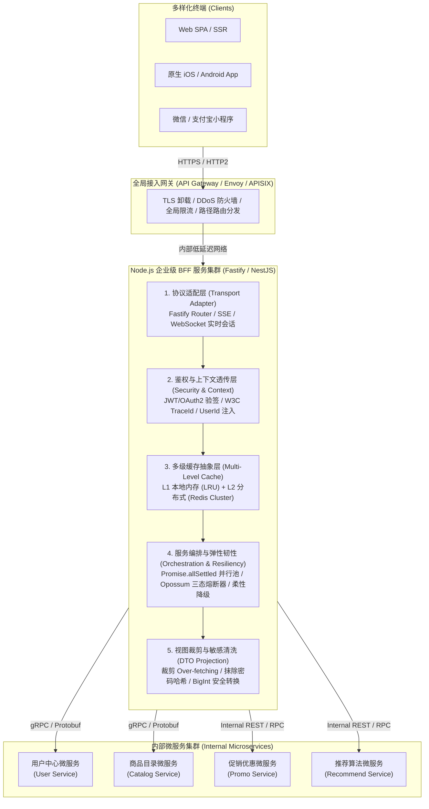
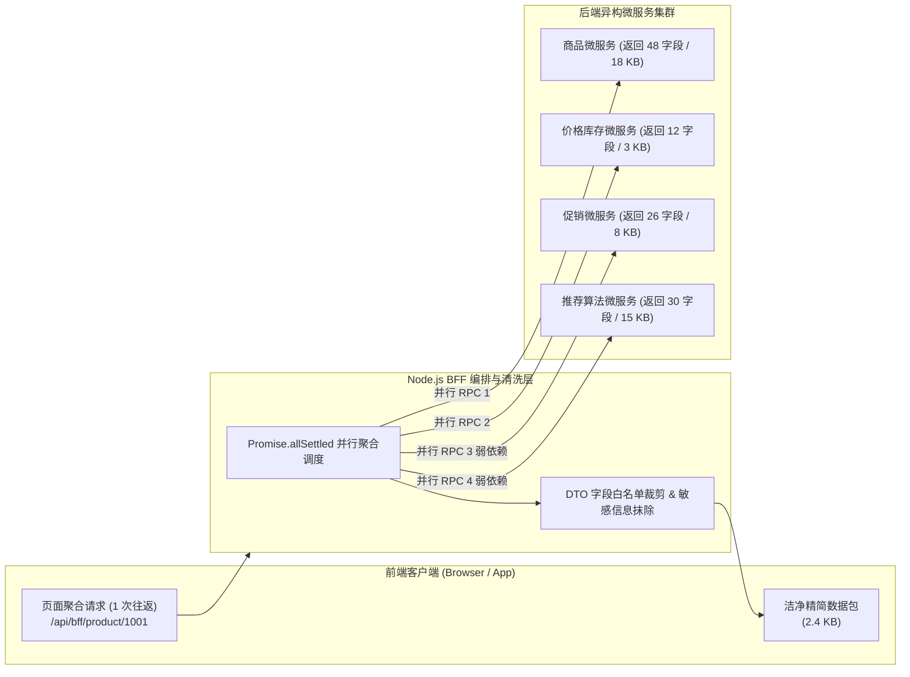
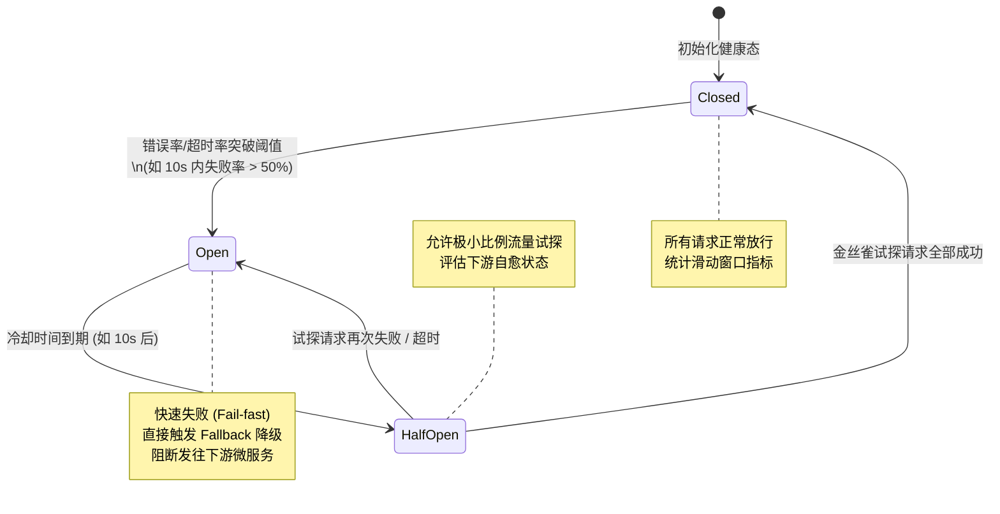
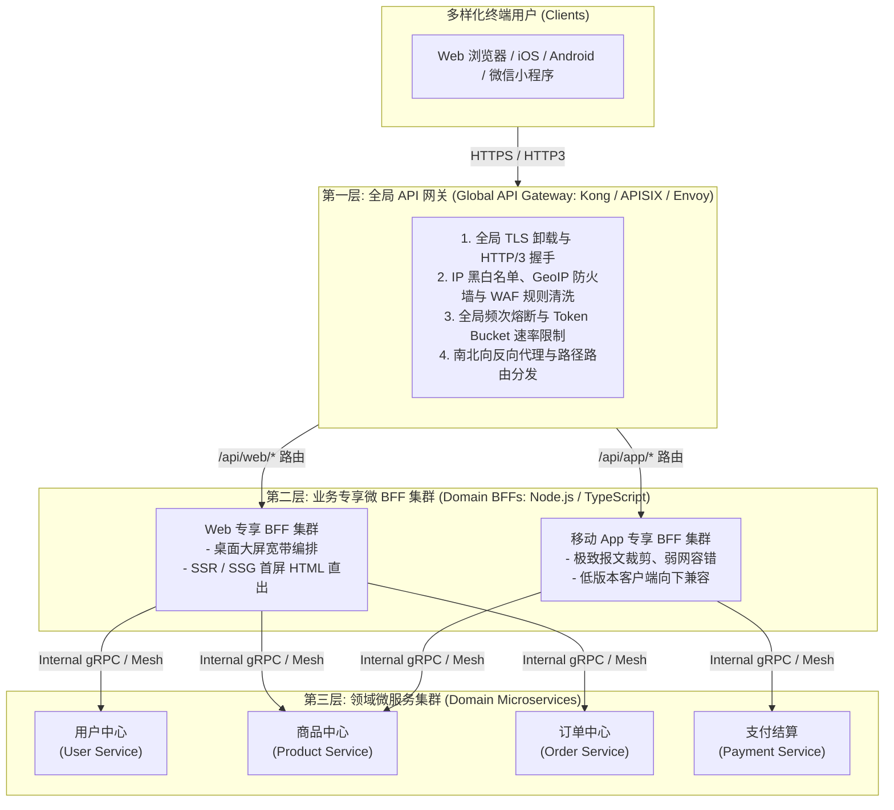

# BFF 架构✅

本主题涵盖企业级 Node.js BFF（Backend For Frontend）架构设计、服务编排聚合、跨协议适配、多级缓存、鉴权上下文透传、高可用熔断降级以及与微服务 API 网关（API Gateway）的权责边界划分与防腐化治理。

## 企业级 BFF（Backend For Frontend）服务分层架构：服务聚合裁剪、多协议适配、鉴权透传与熔断降级？ {#p0-bff-architecture-patterns}

<Answer>

### 核心结论

BFF（Backend For Frontend）本质是**面向具体客户端形态与交互体验量身定制的领域适配与服务编排层**。在多端时代（PC Web、移动端 H5、小程序、原生 App、IoT），底层的微服务通常按照业务领域实体（如用户域、商品域、订单域、库存域）进行职责划分，而终端用户界面则是高度复合且多变的。

BFF 的核心价值体现在以下四个维度：
1. **解决数据获取效率瓶颈**：消除过度获取（Over-fetching，冗余字段消耗网络带宽）与获取不足（Under-fetching，瀑布式多次 HTTP 往返导致首屏白屏过长）。
2. **多协议适配与桥接**：将面向前端的 HTTP/1.1、HTTP/2、WebSocket 等协议无缝转接为面向内部微服务的高性能 RPC（如 gRPC、Dubbo、Thrift）。
3. **全链路上下文透传与鉴权收敛**：在流量边缘完成用户身份校验与凭据解析，统一注入 TraceId 与跨服务上下文（Distributed Context/Baggage）。
4. **弹性容灾与自愈隔离**：通过进程内与分布式多级缓存、并发聚合调度、三态熔断器（Circuit Breaker）与柔性降级（Fallback），防止下游单一微服务慢崩引发全站级联雪崩。

---

### 原理解析与架构设计

#### 1. BFF 整体分层架构体系

在现代化微服务体系中，BFF 位于“流量网关/负载均衡”与“底层领域微服务”之间，其典型分层模型如下：



#### 2. 多微服务并行聚合与字段裁剪机制

- **串行到并行的吞吐跃升**：
  在商品详情页场景中，客户端若直接对接微服务，需要先后调用商品信息、实时价格库存、促销折扣、评价摘要、个性化推荐等 5 个接口。若串行调用，端到端耗时为各服务累加。BFF 通过非阻塞异步 I/O 将强弱依赖解耦，并行调度下游，端到端耗时取决于核心最慢服务的耗时，接口响应耗时通常可降低 60% 至 80%。
- **弱依赖与柔性降级**：
  采用 `Promise.allSettled` 代替传统的 `Promise.all`。商品基本信息为核心强依赖，若失败则抛出异常进入业务错误处理；推荐与促销为弱依赖，若超时或报错，BFF 捕获异常后返回空数组或兜底配置，保障主页面正常呈递。
- **DTO 视图裁剪与防泄漏（Sanitization）**：
  后端微服务返回的领域实体（Entity）包含大量数据库级内幕字段（如 `is_deleted`, `password_hash`, `internal_risk_score`, `optimistic_lock_version`）。BFF 依据客户端类型声明（TypeScript Interface / Zod Schema）做严格白名单投射，不仅缩减数据包体积，更筑牢数据安全护城河。



#### 3. 多级缓存策略（Memory Cache + Redis）

为了兼顾高吞吐与数据一致性，BFF 采用两级缓存架构：
1. **L1 本地内存缓存（Process-Local LRU）**：
   - 采用 LRU 淘汰算法，直接驻留 Node.js 堆内存，响应时间小于 1ms，避免网络 I/O 开销。
   - 适用于**读极高频、数据量有限、容忍短暂多实例不一致的静态字典/全局配置数据**（例如城市编码、分类树、系统全局开关）。
   - **容量防护与 OOM 防御**：必须设置严格的 `max` 条目上限与内存水位阈值（如预留 100MB 保护区），禁止无界缓存引发 V8 堆内存溢出。
2. **L2 分布式缓存（Redis Cluster）**：
   - 响应时间一般在 1ms 至 5ms 之间，全 BFF 集群共享，承载会话状态、用户维度高频缓存、页面片段聚合结果。
3. **缓存异常防御体系**：
   - **防击穿（Hotspot Invalid）**：热点 Key 失效瞬间，利用基于 Redis 的分布式互斥锁或本地 Promise 缓存单例（Singleflight 模式），保证仅有 1 个请求穿透到下游微服务，其余等待该 Promise 完成后共享结果。
   - **防穿透（Cache Penetration）**：对于微服务查询返回空的无效 Key，BFF 缓存空对象（设置短 TTL 如 30 秒），或在入口层挂载布隆过滤器（Bloom Filter）。
   - **防雪崩（Cache Avalanche）**：大规模 Key 的失效时间添加随机散列因子（如 `TTL = baseTTL + Math.random() * 60`），消除同时失效尖刺。

#### 4. JWT/OAuth2 鉴权与上下文透传（Context Propagation）

- **边缘校验，内部免鉴**：
  客户端向 BFF 请求时携带 Authorization Bearer Token（JWT）或 HttpOnly Session Cookie。BFF 节点加载认证中心公钥证书（JWKS 缓存机制）在本地进行无状态验签与有效期验证。
- **分布式追踪与隐式上下文注入**：
  BFF 将解码后的结构化用户上下文（`uid`, `tenant_id`, `roles`, `client_ip`, `app_version`）与分布式追踪标识（W3C Trace Context 标准的 `traceparent` / OpenTelemetry `x-trace-id`）打包。在发起内部 RPC 或 HTTP 请求时，自动注入 Metadata/Header，微服务集群直接信任 BFF 投递的经过签名确权的用户身份，免去微服务层层重复鉴权的 CPU 损耗。

#### 5. 超时熔断与容灾降级（Circuit Breaker）

当某个微服务发生死锁、GC 停顿或网络抖动时，响应变慢会导致 BFF 端的并发连接池被占满，Event Loop 任务队列积压，最终引发级联崩溃。

熔断器遵循经典的**三态状态机机制**：
- **Closed（关闭/健康状态）**：所有请求正常放行下游。滑动时间窗口内（如统计最近 10 秒），若错误率或超时率超过阈值（如 50% 且请求样本大于 20），熔断器跳变至 **Open** 状态。
- **Open（开启/熔断状态）**：直接拦截所有发往该微服务的请求，快速失败（Fail-fast），并在微秒级触发预设的 Fallback 降级逻辑，保护微服务不再承受额外负载，给其留出自愈缓冲期。
- **Half-Open（半开/试探状态）**：熔断持续指定冷却时间（如 10 秒）后进入半开状态，允许放行极少量的试探性请求（Canary Requests）。若试探成功，熔断器恢复为 **Closed**；若再次失败，重置冷却计时器并立即返回 **Open** 状态。



---

### 生产级规范代码实现

以下为基于 TypeScript 与 Node.js 构建的企业级 BFF 聚合网关核心实现，融合了多微服务并行编排、DTO 裁剪、多级缓存（LRU + Redis）以及 Opossum 熔断降级：

```typescript
import Fastify, { FastifyInstance, FastifyRequest, FastifyReply } from 'fastify';
import Redis from 'ioredis';
import { LRUCache } from 'lru-cache';
import CircuitBreaker from 'opossum';
import jwt from 'jsonwebtoken';

// -------------------------------------------------------------
// 1. 类型契约与模型定义
// -------------------------------------------------------------
interface UserContext {
  userId: string;
  tenantId: string;
  roles: string[];
  traceId: string;
}

interface ProductRawEntity {
  id: string;
  sku_name: string;
  cost_price: number; // 敏感字段：底价
  selling_price: number;
  stock_count: number;
  internal_supplier_code: string; // 敏感字段：供应商编码
  is_deleted: boolean;
}

interface PromotionRawEntity {
  promo_id: string;
  discount_amount: number;
  promo_label: string;
}

interface ProductViewDTO {
  id: string;
  title: string;
  price: number;
  isAvailable: boolean;
  promotionBadge?: string;
  fromCache: boolean;
}

// -------------------------------------------------------------
// 2. 多级缓存管理抽象 (In-Memory LRU + Redis)
// -------------------------------------------------------------
class MultiLevelCacheManager {
  private localCache: LRUCache<string, any>;
  private redisClient: Redis;

  constructor(redis: Redis) {
    this.redisClient = redis;
    // L1 本地缓存：最大条目 5000，TTL 60 秒，防止 OOM
    this.localCache = new LRUCache({
      max: 5000,
      ttl: 60 * 1000,
    });
  }

  async get<T>(key: string): Promise<T | null> {
    // 优先读取 L1
    const localHit = this.localCache.get(key) as T | undefined;
    if (localHit !== undefined) {
      return localHit;
    }

    // 次选读取 L2 (Redis)
    try {
      const redisHit = await this.redisClient.get(key);
      if (redisHit) {
        const parsed = JSON.parse(redisHit) as T;
        // 回填 L1，降低下一次读取延迟
        this.localCache.set(key, parsed);
        return parsed;
      }
    } catch (err) {
      // Redis 故障降级，不阻断主流程
      console.error('[Cache] Redis get error, fallbacking:', err);
    }

    return null;
  }

  async set(key: string, value: any, ttlSeconds: number): Promise<void> {
    this.localCache.set(key, value);
    try {
      // 添加随机散列扰动 (Jitter)，避免缓存雪崩
      const jitter = Math.floor(Math.random() * 10);
      await this.redisClient.set(key, JSON.stringify(value), 'EX', ttlSeconds + jitter);
    } catch (err) {
      console.error('[Cache] Redis set error:', err);
    }
  }
}

// -------------------------------------------------------------
// 3. 微服务 Client 模拟与熔断器 (Circuit Breaker) 配置
// -------------------------------------------------------------
class MicroserviceGateway {
  private productBreaker: CircuitBreaker<[string, UserContext], ProductRawEntity>;
  private promoBreaker: CircuitBreaker<[string, UserContext], PromotionRawEntity>;

  constructor() {
    // 商品服务熔断选项
    const breakerOptions: CircuitBreaker.Options = {
      timeout: 1000, // 超过 1000ms 触发超时失败
      errorThresholdPercentage: 50, // 错误率达到 50% 开启熔断
      resetTimeout: 10000, // 熔断后 10 秒进入 Half-Open 试探
      rollingCountTimeout: 10000, // 统计滑动时间窗口 10 秒
      capacity: 50, // 单节点并发执行配额
    };

    this.productBreaker = new CircuitBreaker(this.callProductRpc.bind(this), breakerOptions);
    this.promoBreaker = new CircuitBreaker(this.callPromoRpc.bind(this), breakerOptions);

    // 注册熔断器状态监听
    this.productBreaker.on('open', () => console.warn('[Breaker] Product service circuit OPEN!'));
    this.productBreaker.on('halfOpen', () => console.info('[Breaker] Product service circuit HALF-OPEN'));
    this.productBreaker.on('close', () => console.info('[Breaker] Product service circuit CLOSED'));

    // 促销服务支持柔性降级 Fallback
    this.promoBreaker.fallback((productId: string, ctx: UserContext) => {
      console.warn('[Fallback] Promo service degraded for product: ' + productId);
      return { promo_id: '', discount_amount: 0, promo_label: '' };
    });
  }

  // 模拟底层微服务 RPC / gRPC 调用（携带分布式上下文）
  private async callProductRpc(productId: string, ctx: UserContext): Promise<ProductRawEntity> {
    return new Promise((resolve, reject) => {
      setTimeout(() => {
        if (productId === 'err-500') {
          return reject(new Error('Downstream RPC Internal Error'));
        }
        resolve({
          id: productId,
          sku_name: '高端轻薄笔记本 Pro 16',
          cost_price: 4999, // 敏感字段
          selling_price: 6999,
          stock_count: 35,
          internal_supplier_code: 'SUP-CN-SH-992',
          is_deleted: false,
        });
      }, 80); // 正常耗时小于 100ms
    });
  }

  private async callPromoRpc(productId: string, ctx: UserContext): Promise<PromotionRawEntity> {
    return new Promise((resolve) => {
      setTimeout(() => {
        resolve({
          promo_id: 'PROMO-2026-SPRING',
          discount_amount: 500,
          promo_label: '春季限时特惠 - 立减 500',
        });
      }, 50);
    });
  }

  public async fetchProduct(productId: string, ctx: UserContext): Promise<ProductRawEntity> {
    return this.productBreaker.fire(productId, ctx);
  }

  public async fetchPromo(productId: string, ctx: UserContext): Promise<PromotionRawEntity> {
    return this.promoBreaker.fire(productId, ctx);
  }
}

// -------------------------------------------------------------
// 4. BFF 主服务组装与编排路由
// -------------------------------------------------------------
export function buildBffServer(): FastifyInstance {
  const server = Fastify({ logger: true });
  const redis = new Redis({ host: '127.0.0.1', port: 6379, lazyConnect: true });
  const cacheManager = new MultiLevelCacheManager(redis);
  const microservices = new MicroserviceGateway();

  const JWT_SECRET = 'company-secure-shared-public-token';

  // 全局中间件：鉴权与上下文提取
  server.addHook('preHandler', async (request: FastifyRequest, reply: FastifyReply) => {
    const authHeader = request.headers.authorization;
    const traceId = (request.headers['x-trace-id'] as string) || ('trace-' + Date.now() + '-' + Math.random().toString(36).slice(2, 8));

    let userContext: UserContext = {
      userId: 'guest',
      tenantId: 'default',
      roles: ['anonymous'],
      traceId,
    };

    if (authHeader && authHeader.startsWith('Bearer ')) {
      const token = authHeader.substring(7);
      try {
        const decoded = jwt.verify(token, JWT_SECRET) as any;
        userContext = {
          userId: decoded.sub,
          tenantId: decoded.tenantId || 'default',
          roles: decoded.roles || [],
          traceId,
        };
      } catch (err) {
        reply.code(401).send({ code: 'UNAUTHORIZED', message: 'Token 无效或已过期' });
        return;
      }
    }

    // 挂载到请求上下文
    (request as any).userContext = userContext;
  });

  // 商品详情聚合端点：聚合 + 裁剪 + 多级缓存
  server.get('/api/v1/product/detail/:productId', async (request: FastifyRequest, reply: FastifyReply) => {
    const { productId } = request.params as { productId: string };
    const ctx = (request as any).userContext as UserContext;

    const cacheKey = 'bff:product:view:' + productId;
    const cachedResult = await cacheManager.get<ProductViewDTO>(cacheKey);

    if (cachedResult) {
      return reply.send({ ...cachedResult, fromCache: true });
    }

    // 并发聚合强弱微服务
    const [productResult, promoResult] = await Promise.allSettled([
      microservices.fetchProduct(productId, ctx), // 强依赖
      microservices.fetchPromo(productId, ctx),    // 弱依赖
    ]);

    // 核心依赖检查
    if (productResult.status === 'rejected') {
      server.log.error({ err: productResult.reason, productId, traceId: ctx.traceId }, 'Core Product Service Failed');
      return reply.code(503).send({
        code: 'SERVICE_UNAVAILABLE',
        message: '核心商品服务繁忙，请稍后重试',
        traceId: ctx.traceId,
      });
    }

    const productRaw = productResult.value;
    const promoRaw = promoResult.status === 'fulfilled' ? promoResult.value : undefined;

    // 数据裁剪投影（DTO Projection）：抹去 cost_price, internal_supplier_code 等敏感字段
    const viewData: ProductViewDTO = {
      id: productRaw.id,
      title: productRaw.sku_name,
      price: productRaw.selling_price - (promoRaw ? promoRaw.discount_amount : 0),
      isAvailable: productRaw.stock_count > 0 && !productRaw.is_deleted,
      promotionBadge: promoRaw ? promoRaw.promo_label : undefined,
      fromCache: false,
    };

    // 异步回写两级缓存（缓存 120 秒）
    await cacheManager.set(cacheKey, viewData, 120);

    return reply.send(viewData);
  });

  return server;
}
```

---

### 面试官视角

该题考察候选人是否具备**大型分布式系统与全栈高并发架构能力**，重点区分是“只会写 Node.js 简单 CRUD”还是“能驾驭企业级流量中枢的资深全栈工程师”：

1. **核心要点清单**：
   - 能够准确阐明 BFF 在多端时代的职责：面向终端交互体验定制（View-Oriented），彻底解决 Over-fetching 与 Under-fetching。
   - 掌握异步编排模型：深刻理解单线程 Event Loop 环境下 `Promise.all` 遇到一个 reject 即全部中断的致命缺陷，必须使用 `Promise.allSettled` 并区分强弱依赖。
   - 理解多级缓存的互补逻辑与风险防范（防击穿 Singleflight、防穿透、防雪崩 Jitter TTL、防 OOM LRU 限额）。
   - 理解熔断降级（Circuit Breaker）三态机模型，能够给出微服务异常时的级联雪崩解决方案。
   - 掌握鉴权无状态解密与全链路追踪（Trace Context）的透传机制。

2. **高频追问与应对策略**：
   - **追问 1：如果一个 BFF 接口聚合了 6 个微服务，其中 1 个弱依赖偶尔耗时超过 2 秒，将导致整个接口 RT 显著恶化，除了超时直接熔断外，前端体验上还有哪些架构解法？**
     - *回答范式*：采用 **BigPipe / 流式响应（Streaming SSR / HTTP Chunked / SSE）** 架构。BFF 在获取到核心商品数据后立即向前端 flush 输出首屏所需的主结构，对于慢速的推荐服务异步拉取，随后以 Chunk 形式追加到客户端流或由前端以局部微任务形式异步重试拉取，从架构上解耦首屏与慢接口。
   - **追问 2：BFF 处于高并发前沿，Node.js 单线程处理大量 JSON 序列化与反序列化会导致 CPU 飙升、Event Loop 严重延迟（Event Loop Lag），如何进行工程优化？**
     - *回答范式*：
       1. 引入高性能 JSON Schema 序列化工具库（如 `fast-json-stringify` 代替原生 `JSON.stringify`），基于 V8 JIT 预编译模型提速 2-3 倍。
       2. 内部微服务通信采用 Protobuf 二进制协议序列化，减少文本解析开销。
       3. 将大规模计算或高频加密计算（如大型 JWT 批量验签）卸载到 Worker Threads 线程池中，确保主 Event Loop 维持在小于 10ms 的健康水位。

3. **常见失误与避坑指南**：
   - 混淆 BFF 与底层微服务的权责，在 BFF 中直连业务数据库写复杂 SQL 或执行跨库事务。
   - 使用全局无界的 JavaScript `Map` 或对象充当缓存，导致内存泄漏引发 Node.js 进程 OOM 崩溃。
   - 没有超时控制（Timeout），当后端微服务 Hang 住时，导致 BFF 连接数暴增、文件描述符与 Socket 耗尽。

---

### 延伸阅读

- [Sam Newman: Backends For Frontends Pattern](https://samnewman.io/patterns/architectural/bff/) — BFF 模式权威定义
- [Martin Fowler: CircuitBreaker Architecture](https://martinfowler.com/bliki/CircuitBreaker.html) — 熔断器设计模式经典论述
- [OpenTelemetry Specification: Trace Context](https://www.w3.org/TR/trace-context/) — 分布式调用链上下文传递标准
- [Fastify Documentation: High-Performance Node.js](https://fastify.dev/docs/latest/) — 生产级高性能服务设计规范

</Answer>

## BFF 层与微服务 API 网关（API Gateway）的权责边界划分与治理策略？ {#p1-bff-vs-api-gateway}

<Answer>

### 核心结论

在现代云原生微服务架构中，**API Gateway（API 网关）与 BFF（Backend For Frontend）并不是互斥对立的替代品，而是“双层网关架构（Two-Tier Gateway Architecture）”中分工明确、协同互补的上下游伙伴**。

形象地比喻：
- **API Gateway 是“海关/城门”**：把守在最外围，负责全局网络出口、基础设施级安全防护（TLS 终止、DDoS 抵御、WAF）、统一跨域路由与服务治理，完全与具体业务解耦。
- **BFF 是“导购前台/专属管家”**：紧随 API Gateway 之后，贴近具体前端应用（如 iOS 端、小程序端、运营后台），负责面向用户界面的轻量业务编排、字段裁剪重组与端差异化适配。

架构治理的最高纲领是：**“网关守底线，BFF 做体验；BFF 严禁下沉领域模型，坚决维持无状态轻量化”**，防止 BFF 退化为难以维护的庞大新单体（Fat-BFF）。

---

### 权责边界对比矩阵

下表系统性厘清 API Gateway 与 BFF 的工程职责与架构属性差异：

| 比较维度 | 外部/全局 API 网关 (API Gateway) | 面向前端的后端层 (BFF) |
| :--- | :--- | :--- |
| **核心定位** | 全局网络出入口、基础设施级通信治理底座 | 贴近具体终端界面的数据组装与体验适配层 |
| **所属团队 (Ownership)** | 基础架构团队 / 运维团队 / 云平台团队 | 各前端业务团队 / 全栈开发小队（围绕具体产品线） |
| **与业务的耦合度** | **绝对业务解耦**（禁止包含任何业务字段与逻辑） | **强业务感知**（直接依据 UI 界面交互需求建模） |
| **变更与发布频率** | 极低（周/月级发布，要求 99.999% 超高稳定性） | 极高（随前端页面与 UI 迭代，天级/小时级持续发布） |
| **核心功能职责** | TLS/SSL 卸载、WAF 防火墙、DDoS 防御、全局限流、统一认证授权中继、服务发现与动态反向代理 | 跨微服务并行聚合、字段投影与过滤（裁剪 Over-fetching）、数据格式转换、视图级缓存编排、SSR/SSG 数据供给 |
| **协议支持重点** | HTTP/1.1、HTTP/2、HTTP/3、TCP/UDP 负载均衡 | GraphQL、RESTful JSON、SSE、WebSocket 会话保持、gRPC 客户端转接 |
| **状态与存储** | **绝对无状态 (Stateless)** | **基本无状态**，允许短期视图缓存（Redis/LRU） |
| **典型技术选型** | Envoy、Apache APISIX、Kong、Traefik、AWS API Gateway | Node.js (NestJS / Fastify)、Go (Fiber / Gin)、GraphQL (Apollo) |

---

### 双层网关拓扑与调用链路

在企业级标准拓扑中，外部流量依序流经全局网关、特定 BFF 与底层领域服务：



---

### BFF 防腐化治理策略（Anti-Corruption Governance）

随着业务规模膨胀，BFF 极易出现代码质量恶化与边界模糊，必须实施以下四项防腐化治理：

#### 1. 警惕“胖 BFF（Fat-BFF）”反模式：严禁编写领域逻辑

- **反模式现象**：
  在 BFF 中直接注入数据库驱动（如 TypeORM / Prisma），执行跨表联查、写复杂业务 SQL；或者在 BFF 中实现优惠券核销算法、扣减库存事务、支付计价逻辑。
- **严重后果**：
  领域业务逻辑散落在底层微服务与 BFF 各处，微服务失去内聚性与独立演进能力；BFF 不再是轻量编排层，一旦需要支撑新的客户端终端，逻辑无法复用；且 Node.js 极难安全承载跨异构数据源的分布式事务（Saga / TCC）。
- **治理红线**：
  **BFF 只有“编排权（Orchestration）”，没有“业务决策权（Domain Rules）”**。BFF 只能调用微服务暴露的领域契约，所有数据变更（Mutation）必须通过下层微服务的幂等 API 落地，BFF 内部严禁出现任何业务持久化代码。

#### 2. 服务模式取舍：One BFF per Client vs. Unified BFF

- **统一单一 BFF（Unified BFF）的陷阱**：
  很多团队初期为了节省服务器成本，将 Web、iOS、Android、小程序全部收敛至一个单一的 Node.js 服务。随着时间推移，代码中充斥着大量的平台分支判断，不同端团队发布互相冲突，联调相互阻塞，完全丧失了 BFF 敏捷发布的初衷。
- **治理标准**：
  推行 **One BFF per Client**（按终端隔离）或 **按业务域切分垂直微 BFF**。Web 端与移动端各自享有独立的 Node.js 运行时与 Git 仓库，由各自的业务前端小组全权闭环负责。

#### 3. 应对微前端架构（Micro Frontends + Micro BFFs）

在大型微前端架构中，BFF 不应成为阻碍微前端独立部署的“新中心化单体”。
- **治理方案**：采用**垂直切片（Vertical Slice）架构**。
  每个微前端子应用（如“营销子应用”、“结算子应用”）同时拥有配套的“微 BFF 服务（Micro-BFF）”。全局网关根据路由将 `/api/marketing/*` 导向营销微 BFF，将 `/api/checkout/*` 导向结算微 BFF，实现端到端团队自治与无冲突独立发布。

#### 4. 僵尸接口与生命周期治理（Zombie API Governance）

- **痛点**：
  前端 UI 变更极快，常常因为一个改版新增一组聚合接口，而老页面的 BFF 接口无人敢删，长年累月积累成成百上千个“僵尸接口”，造成维护地狱。
- **治理策略**：
  1. **契约即文档**：通过 OpenAPI / Swagger 或 tRPC / GraphQL 自动生成契约，禁止无规范自由开发。
  2. **埋点与访问监控**：在 BFF 入口统计接口 QPS。连续 90 天访问量为 0 的接口，自动触发废弃告警通知。
  3. **标准下线协议**：废弃接口在响应头中打上 `Sunset: Wed, 11 Nov 2026 00:00:00 GMT` 与 `Deprecation: @true` 规范标头，并在宽限期后安全拔线。

---

### 面试官视角

该题考察候选人对于**微服务边界治理、分布式系统拓扑、康威定律（Conway's Law）在前端落地**的高阶理解：

1. **核心考察要点**：
   - 是否能精准辨析 API Gateway 与 BFF 的根本差异，避免出现“既然有了网关为什么还要 BFF”或“有了 BFF 能否废除网关”等认识偏差。
   - 是否经历过架构演进的痛点，能否说出“胖 BFF”带来的维护灾难与具体的防腐化治理手段。
   - 能否从团队组织架构协作视角（康威定律）解释：API Gateway 属于基建运维保障全站底线，BFF 属于业务前端拥有自主发布权，以此消除前后端跨部门撕扯与协作阻碍。

2. **高频追问与应对策略**：
   - **追问 1：既然 API Gateway 也能写 Lua / WASM 插件，为什么不能直接在网关上写业务聚合脚本，省掉中间这层 Node.js BFF？**
     - *回答范式*：
       1. **稳定性隔离**：API Gateway 是全公司所有流量的汇聚出口，要求五个九的超高可用性。将变动极其频繁、经常随页面调整而发布的聚合逻辑放在网关上，会频繁引起网关重载，一旦脚本内存泄漏或出现死循环，全站所有业务均将瘫痪。
       2. **职责与关注点分离**：网关研发人员通常是底层网络与运维专家，并不熟悉前端多变的视图渲染与业务需求；让网关承担业务编排破坏了单一职责原则。
   - **追问 2：BFF 是否应该引入 GraphQL 替代手写的 RESTful 编排？两者各有什么权衡（Trade-offs）？**
     - *回答范式*：
       - GraphQL 的优势在于强大的按需查询能力，将字段裁剪的选择权完全交给前端客户端，BFF 开发人员无需为每一个微小 UI 改动编写新的控制器端点。
       - 但在企业级实践中，GraphQL 带来了严峻的治理挑战：复杂的嵌套查询可能导致恶意的“深度查询攻击（DoS）”和不可控的 N+1 RPC 调用；HTTP 层的 CDN 缓存无法直接利用 URL 进行缓存优化；Schema 的演进治理成本高昂。
       - 因此，工业界推行的折中方案通常是：**BFF 内部采用强类型的 gRPC/RESTful 调用，对公网前端按页面暴露严格治理的 RESTful 或固定 Query 的受限 GraphQL（Persisted Queries）**。

3. **常见失误**：
   - 只罗列概念，无法给出清晰的双层架构拓扑与数据流向。
   - 错误地认为 BFF 可以拥有独立的持久化数据库，忽视了领域数据一致性与事务风险。

---

### 延伸阅读

- [Microsoft Azure Architecture Center: Backends for Frontends pattern](https://learn.microsoft.com/en-us/azure/architecture/patterns/backends-for-frontends) — 微软云架构权威指导
- [Phil Calçado: The Backends For Frontends Pattern (BFF)](https://philcalcado.com/2015/09/18/the_back_end_for_front_end_pattern_bff.html) — SoundCloud 原创 BFF 实践历程
- [ThoughtWorks: BFF vs API Gateway](https://www.thoughtworks.com/insights/blog/microservices/bff-pattern-backend-for-frontend) — 行业专家关于双层网关的权责分析

</Answer>
