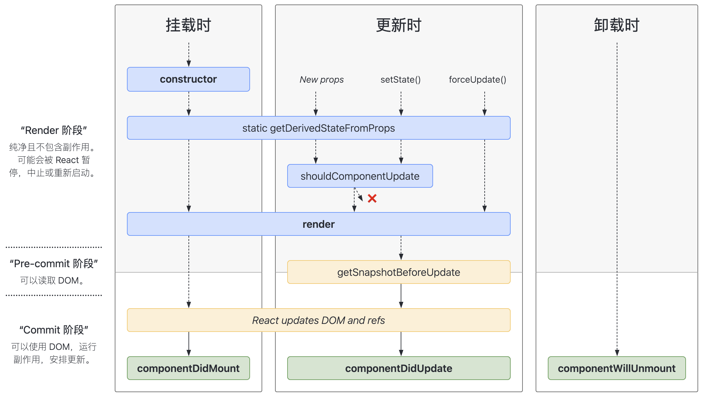
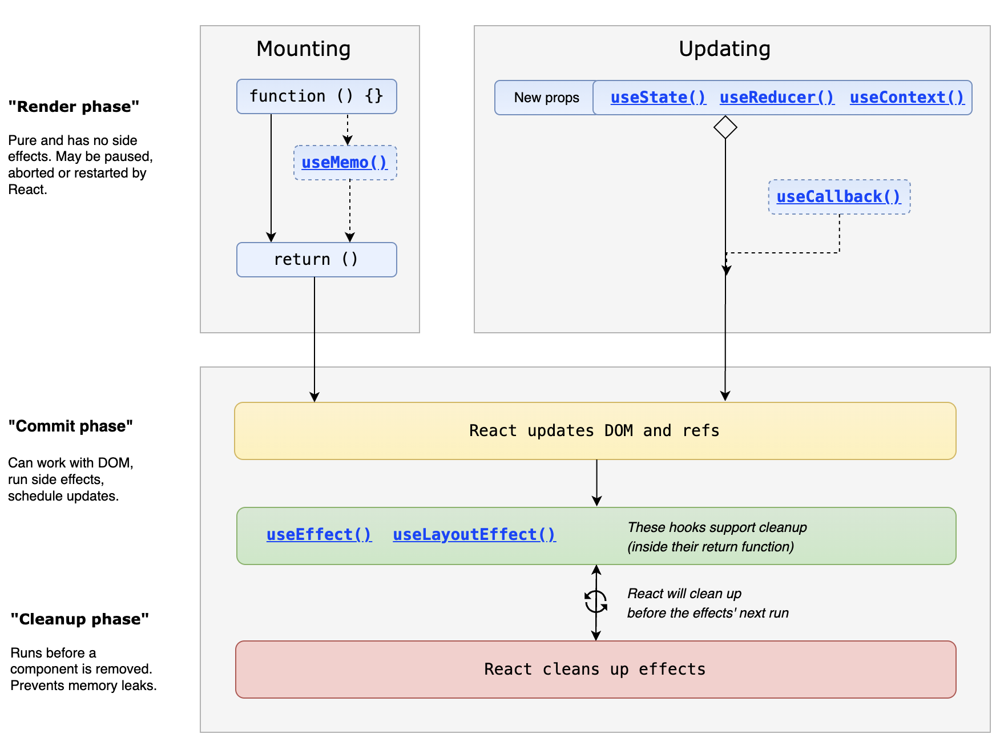
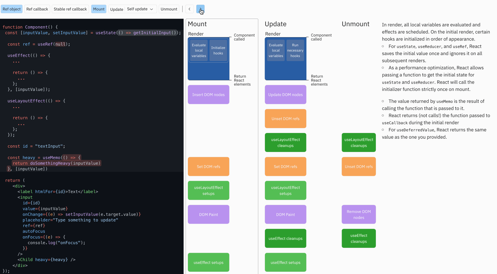

# 组件

## 构建组件的方式有哪些 {#p1-component-type}

1. Class Components（类组件）：使用ES6的类语法来定义组件。类组件继承自`React.Component`，并通过`render`方法返回需要渲染的React元素。

```jsx
class MyComponent extends React.Component {
  render () {
    return <div>Hello</div>
  }
}
```

2. Function Components（函数组件）：使用函数来定义组件，函数接收`props`作为参数，并返回需要渲染的React元素。

```jsx
function MyComponent (props) {
  return <div>Hello</div>
}
```

3. Higher-Order Components（高阶组件）：高阶组件是一个函数，接收一个组件作为参数，并返回一个新的增强组件。它用于在不修改原始组件的情况下，添加额外的功能或逻辑。

```jsx
function withLogger (WrappedComponent) {
  return class extends React.Component {
    componentDidMount () {
      console.log('Component did mount!')
    }

    render () {
      return <WrappedComponent {...this.props} />
    }
  }
}

const EnhancedComponent = withLogger(MyComponent)
```

4. Function as Children（函数作为子组件）：将函数作为子组件传递给父组件，并通过父组件的props传递数据给子组件。

```jsx
function MyComponent (props) {
  return <div>{props.children('Hello')}</div>
}

<MyComponent>
 {(message) => <p>{message}</p>}
</MyComponent>
```

这些是React中常见的构建组件的方式。每种方式都适用于不同的场景，你可以根据自己的需求选择合适的方式来构建组件。

5. `React.cloneElement`：`React.cloneElement`是一个函数，用于克隆并返回一个新的React元素。它可以用于修改现有元素的props，或者在将父组件的props传递给子组件时进行一些额外的操作。

```jsx
const parentElement = <div>Hello</div>;
const clonedElement = React.cloneElement(parentElement, { className: 'greeting' });

// Result: <div className="greeting">Hello</div>
```

6. `React.createElement`：`React.createElement`是一个函数，用于创建并返回一个新的React元素。它接收一个类型（组件、HTML标签等）、props和子元素，并返回一个React元素。

```jsx
const element = React.createElement('div', { className: 'greeting' }, 'Hello');

// Result: <div className="greeting">Hello</div>
```

`React.createElement`和`React.cloneElement`通常在一些特殊的场景下使用，例如在高阶组件中对组件进行包装或修改。它们不是常规的组件构建方式，但是在某些情况下是非常有用的。非常抱歉之前的遗漏，希望这次能够更全面地回答您的问题。

## 为什么 react 组件， 都必须要申明一个 `import React from 'react';` {#p4-import-react}

首先要知道一个事情： **JSX 是无法直接运行在浏览器环境**。

 原因

JSX 语法不能直接被浏览器解析和运行，因此需要插件 `@babel/plugin-transform-react-jsx` 来转换语法，使之能够在浏览器或任何 JavaScript 环境中执行。

所以 React 组件需要引入`React`的一个主要原因是：在组件中使用 JSX 时，JSX 语法最终会被 Babel 编译成使用`React.createElement`方法的 JavaScript 代码。也就是说，任何使用 JSX 的 React 组件的背后都隐含了`React.createElement`的调用。

例如，当你编写如下的 JSX 代码：

```jsx
const MyComponent = () => {
 return <div>Hello, World!</div>;
};
```

Babel 会将这段 JSX 编译为如下的 JavaScript 代码：

```js
const MyComponent = () => {
  return React.createElement('div', null, 'Hello, World!')
}
```

由于编译后的代码调用了`React.createElement`，因此你需要在文件顶部导入`React`对象才能使用它。即使你在组件中并没有直接使用`React`对象，编译后的代码依赖于`React`的运行时。

 Babel 7.0+ / React 17+ ， 可以不再需要 import React

在 Babel 7.0 版本之后，`@babel/plugin-transform-react-jsx` 插件还支持一个自动模式，它可以自动引入 JSX 转换所需的`React`包，无需手动在每个文件中添加 `import React from 'react'`。

注意，随着 React 17 的新 JSX 变换，它们引入了一个新的 JSX 转换方式，这在新的 Babel 插件 `@babel/plugin-transform-react-jsx` 和 `@babel/preset-react` 中得到了支持。这意味着在写 JSX 时，你不再需要导入 React。这个插件现在接收一个 `{ runtime: 'automatic' }` 选项来启用这一特性。

举个例子，在使用新的 JSX 转换之后，编译器将会自动引入 JSX 的运行时库，而不是 React，例如对于一个使用了新转换的`MyComponent`的组件:

```jsx
// React 17+ 及支持新JSX转换的环境，可以不需要显式写这行
// import React from 'react';

const MyComponent = () => {
 return <div>Hello, World!</div>;
};
```

在新的转换下，你会看到类似`import { jsx as _jsx } from 'react/jsx-runtime'`的东西或者类似的别名，被自动插入到转译后的文件中，而不再是直接的`React.createElement`调用。这就是为什么在新版本的 React 中，你可能不再需要手动导入 React 了。

 补充一个细节知识点： plugin-transform-react-jsx`和`@babel/preset-react` 是啥关系

**它们是包含关系**： `@babel/preset-react` 包括了 `@babel/plugin-transform-react-jsx`

`@babel/plugin-transform-react-jsx` 和 `@babel/preset-react` 都是 Babel 插件，它们在处理 React 项目中的 JSX 代码方面有关联，但它们的用途和包含的内容有所不同。

1. **@babel/plugin-transform-react-jsx**:
 这是一个特定的 Babel 插件，它的功能就是将 JSX 语法转换为`React.createElement` 调用。随着 React 17 的更新，它还允许使用新的 JSX 转换，无需导入 React 就可以使用 JSX。这意味着，在文件中不再需要 `import React from 'react'` 语句了，就可以使用 JSX。

 这个插件通常用于开发者想要精细控制某个具体转换功能时。如果你只需要转换 JSX 语法，但不需要处理其他与 React 相关的转换或优化，你可能会单独使用这个插件。

2. **@babel/preset-react**:
 这是一个 Babel 预设，它是一组 Babel 插件的集合，旨在为 React 项目提供所需的全部 Babel 插件。`@babel/preset-react` 包括了 `@babel/plugin-transform-react-jsx`，但它还包含了其他一些插件，如处理 React 的显示名称的 `@babel/plugin-transform-react-display-name`，以及为开发模式和生产模式添加/删除某些代码的插件。

 预设的好处是简化了配置过程。开发者可以在 Babel 的配置中一次性添加 `@babel/preset-react`，而不是单独添加每一个与 React 相关的 Babel 插件。此外，预设将维护这些插件的正确版本和顺序，这有助于避免潜在的配置错误。

在实践中，大多数开发 React 应用的开发者会使用 `@babel/preset-react` 因为它提供了一个即插即用的 Babel 环境，无需担心各个插件的具体细节。但是也有些情况下，为了更细致的优化和控制，开发者可能会选择手动添加特定的插件，包括 `@babel/plugin-transform-react-jsx`。

## react 中如何引入样式 {#p2-react-引入样式}

## Class Components 和 Function Components 的区别？ {#p1-react-class-function}

Class组件是使用ES6的类语法定义的组件，它是继承自React.Component的一个子类。Class组件有自己的状态和生命周期方法，可以通过`this.state`来管理状态，并通过`this.setState()`来更新状态。

```jsx
class Counter extends React.Component {
 constructor(props) {
 super(props);
 this.state = {
 count: 0
 };
 }

 increment = () => {
 this.setState({ count: this.state.count + 1 });
 };

 render() {
 return (
 <div>
 <p>Count: {this.state.count}</p>
 <button onClick={this.increment}>Increment</button>
 </div>
 );
 }
}
```

函数组件是使用函数来定义的组件，在React 16.8版本引入的Hooks之后，函数组件可以拥有自己的状态和副作用，可以使用`useState`和其他Hooks来管理状态。

```jsx
import React, { useState } from 'react';

function Counter() {
 const [count, setCount] = useState(0);

 const increment = () => {
 setCount(count + 1);
 };

 return (
 <div>
 <p>Count: {count}</p>
 <button onClick={increment}>Increment</button>
 </div>
 );
}
```

函数组件通常比Class组件更简洁和易于理解，尤其是在处理简单的逻辑和状态时。然而，Class组件仍然在一些特定情况下有它们的优势，例如需要使用生命周期方法、引入Ref或者需要更多的精确控制和性能优化时。

**细节对比**

| 方面 | Class组件 | 函数组件 |
| --- | --- | --- |
| 语法 | 使用ES6类语法定义组件 | 使用函数语法定义组件 |
| 继承 | 继承自React.Component类 | 无需继承任何类 |
| 状态管理 | 可通过this.state和this.setState来管理状态 | 可使用useState Hook来管理状态 |
| 生命周期方法 | 可使用生命周期方法，如componentDidMount、componentDidUpdate等 | 可使用Effect Hook来处理副作用 |
| Props | 可通过this.props来访问父组件传递的props | 可通过函数参数来访问父组件传递的props |
| 状态更新 | 使用this.setState来更新状态 | 使用对应的Hook来更新状态 |
| 内部引用 | 可以通过Ref引用组件实例或DOM元素 | 可以使用Ref Hook引用组件实例或DOM元素 |
| 性能优化 | 可以使用shouldComponentUpdate来控制组件是否重新渲染 | 可以使用React.memo或useMemo Hook来控制组件是否重新渲染 |
| 访问上下文 | 可以使用this.context来访问上下文 | 可以使用useContext Hook来访问上下文 |

需要注意的是，这只是一些常见的区别，并不是所有的区别。在实际开发中，具体的区别可能还会根据需求和使用的React版本而有所变化。

**关键词**：React函数组件对比类组件、React函数组件对比类组件性能、React函数组件对比类组件状态管理、React函数组件与类组件

函数组件和类组件是React中两种定义组件的方式，它们有以下区别：

1. 语法：函数组件是使用函数声明的方式定义组件，而类组件是使用ES6的class语法定义组件。

2. 写法和简洁性：函数组件更为简洁，没有类组件中的繁琐的生命周期方法和this关键字。函数组件只是一个纯粹的JavaScript函数，可以直接返回JSX元素。

3. 状态管理：在React的早期版本中，函数组件是无法拥有自己的状态（state）和生命周期方法的。但是从React 16.8开始，React引入了Hooks（钩子）机制，使得函数组件也能够拥有状态和使用生命周期方法。

4. 性能：由于函数组件不拥有实例化的过程，相较于类组件，它的性能会稍微高一些。但是在React 16.6之后，通过React.memo和PureComponent的优化，类组件也能够具备相对较好的性能表现。

总体来说，函数组件更加简洁、易读，适合用于无需复杂逻辑和生命周期方法的场景，而类组件适合于需要较多逻辑处理和生命周期控制的场景。另外，使用Hooks后，函数组件也能够拥有与类组件类似的能力，因此在开发中可以更加灵活地选择使用哪种方式来定义组件。

**状态管理方面做对比**

从状态管理的角度来看，函数组件和类组件在React中的区别主要体现在以下几个方面：

1. 类组件中的状态管理：类组件通过使用`state`属性来存储和管理组件的状态。`state`是一个对象，可以通过`this.state`进行访问和修改。类组件可以使用`setState`方法来更新状态，并通过`this.setState`来触发组件的重新渲染。在类组件中，状态的更新是异步的，React会将多次的状态更新合并为一次更新，以提高性能。

2. 函数组件中的状态管理：在React之前的版本中，函数组件是没有自己的状态的，只能通过父组件通过`props`传递数据给它。但是从React 16.8版本开始，通过引入Hooks机制，函数组件也可以使用`useState`钩子来定义和管理自己的状态。`useState`返回一个状态值和一个更新该状态值的函数，通过解构赋值的方式进行使用。每次调用状态更新函数，都会触发组件的重新渲染。

3. 类组件的生命周期方法：类组件有很多生命周期方法，例如`componentDidMount`、`componentDidUpdate`、`componentWillUnmount`等等。这些生命周期方法可以用来在不同的阶段执行特定的逻辑，例如在`componentDidMount`中进行数据的初始化，在`componentDidUpdate`中处理状态或属性的变化等等。通过这些生命周期方法，类组件可以对组件的状态进行更加细粒度的控制。

4. 函数组件中的副作用处理：在函数组件中，可以使用`useEffect`钩子来处理副作用逻辑，例如数据获取、订阅事件、DOM操作等。`useEffect`接收一个回调函数和一个依赖数组，可以在回调函数中执行副作用逻辑，依赖数组用于控制副作用的执行时机。函数组件的副作用处理与类组件的生命周期方法类似，但是可以更灵活地控制执行时机。

函数组件和类组件在状态管理方面的主要区别是函数组件通过使用Hooks机制来定义和管理状态，而类组件通过`state`属性来存储和管理状态。
函数组件中使用`useState`来定义和更新状态，而类组件则使用`setState`方法。
另外，函数组件也可以使用`useEffect`来处理副作用逻辑，类似于类组件的生命周期方法。通过使用Hooks，函数组件在状态管理方面的能力得到了大幅度的提升和扩展。

**性能方面做对比**

在性能方面，函数组件和类组件的表现也有一些区别。

1. 初始渲染性能：函数组件相对于类组件来说，在初始渲染时具有更好的性能。这是因为函数组件本身的实现比类组件更加简单，不需要进行实例化和维护额外的实例属性。函数组件在渲染时更轻量化，因此在初始渲染时更快。

2. 更新性能：当组件的状态或属性发生变化时，React会触发组件的重新渲染。在类组件中，由于状态的更新是异步的，React会将多次的状态更新合并为一次更新，以提高性能。而在函数组件中，由于每次状态更新都会触发组件的重新渲染，可能会导致性能略低于类组件。但是，通过使用React的memo或useMemo、useCallback等优化技术，可以在函数组件中避免不必要的重新渲染，从而提高性能。

3. 代码拆分和懒加载：由于函数组件本身的实现比类组件更加简单，所以在进行代码拆分和懒加载时，函数组件相对于类组件更容易实现。React的Suspense和lazy技术可以在函数组件中实现组件的按需加载，从而提高应用的性能。

函数组件相对于类组件在初始渲染和代码拆分方面具有优势，在更新性能方面可能稍逊一筹。然而，React的优化技术可以在函数组件中应用，以提高性能并减少不必要的渲染。此外，性能的差异在实际应用中可能并不明显，因此在选择使用函数组件还是类组件时，应根据具体场景和需求进行综合考量。

## 组件生命周期 {#p0-react-lifecycle}

<Answer>

参考 [如何理解 React 里面的生命周期](https://www.zhihu.com/question/586115630)

1. 挂载阶段(Mounting)
   * **[constructor](https://react.dev/reference/react/Component#constructor)**：组件实例化时执行，用于初始化 state 绑定事件等操作
   * **[getDerivedStateFromProps](https://react.dev/reference/react/Component#static-getderivedstatefromprops)**：在render方法执行之前调用，用于根据props设置state。
   * **[render](https://react.dev/reference/react/Component#render)**  渲染组件
   * **[componentDidMount](https://react.dev/reference/react/Component#componentdidmount)**：组件挂载到DOM后执行，用于执行一些需要DOM的操作，如获取数据。
2. 更新阶段(Updating)
   * **[getDerivedStateFromProps](https://react.dev/reference/react/Component#static-getderivedstatefromprops)**：在render方法执行之前调用，用于根据props设置state。
   * **[shouldComponentUpdate](https://react.dev/reference/react/Component#shouldcomponentupdate)**：判断组件是否需要重新渲染，默认返回true
   * **render** 渲染阶段
   * **[getSnapshotBeforeUpdate](https://react.dev/reference/react/Component#getsnapshotbeforeupdate)**：在更新前获取DOM信息，如滚动位置等。
   * **[componentDidUpdate](https://react.dev/reference/react/Component#componentdidupdate)**：组件更新后执行，用于执行一些需要DOM的操作，如更新数据。
3. 卸载阶段(Unmounting)
   * **[componentWillUnmount](https://react.dev/reference/react/Component#componentwillunmount)**：组件卸载前执行，用于清理一些资源，如定时器等。
4. 异常流程会触发如下钩子
   * **[getDerivedStateFromError](https://react.dev/reference/react/Component#static-getderivedstatefromerror)**：捕获错误后设置state
   * **[componentDidCatch](https://react.dev/reference/react/Component#componentdidcatch)**：处理捕获的错误，比如上报到服务端

此外还废弃了如下钩子

* **[componentWillMount](https://react.dev/reference/react/Component#componentwillmount)** 挂载前触发，更名为 UNSAFE_componentWillMount
* **[componentWillReceiveProps](https://react.dev/reference/react/Component#componentwillreceiveprops)** props 变化时触发，更名为 UNSAFE_componentWillReceiveProps
* **[componentWillUpdate](https://react.dev/reference/react/Component#componentwillupdate)** 更新前触发，更名为 UNSAFE_componentWillUpdate

参考 [class lifecycle](https://projects.wojtekmaj.pl/react-lifecycle-methods-diagram/)


对于函数组件, 重点钩子映射如下

* **[useLayoutEffect](https://react.dev/reference/react/useLayoutEffect)** ，在 DOM 更新后立即执行，模拟 componentDidMount 和 componentDidUpdate 行为
* **[useEffect](https://react.dev/reference/react/useEffect)** 副作用钩子，每次挂载和更新后都会触发，通过返回的函数来清理副作用模拟

参考 [react-hooks-lifecycle](https://wavez.github.io/react-hooks-lifecycle/)


进一步细节参考 [react-hook-component-timeline](https://julesblom.com/writing/react-hook-component-timeline)



**示例代码**

<Tabs
   defaultValue="类组件生命周期"
>
<TabItem value="类组件生命周期">

import ClassLifeCycle from '!!raw-loader!./answers/lifecycle/ClassLifeCycle.html';

<Sandpack
  template="static"
  options={{
    showConsole: true,
    bundlerURL:  "https://preview.sandpack-static-server.codesandbox.io"
  }}
  files={{
    "/index.html": ClassLifeCycle,
  }}
/>

</TabItem>

<TabItem value="函数组件生命周期">

import FunctionLifeCycle from '!!raw-loader!./answers/lifecycle/FunctionLifeCycle.html';

<Sandpack
  template="static"
  options={{
    showConsole: true,
    bundlerURL:  "https://preview.sandpack-static-server.codesandbox.io"
  }}
  files={{
    "/index.html": FunctionLifeCycle,
  }}
/>

</TabItem>
</Tabs>

**延伸阅读**

* [Component](https://react.dev/reference/react/Component) 官方文档详细讲解类组件生命周期和迁移到函数组件 hooks 的方法
* [lifecycle of reactive effects](https://react.dev/learn/lifecycle-of-reactive-effects#thinking-from-the-effects-perspective) 官方文档详细讲解 useEffect 生命周期

</Answer>

## 父组件调用子组件的方法 {#p1-parent-call-children}

在React中，我们经常在子组件中调用父组件的方法，一般用props回调即可。但是有时候也需要在父组件中调用子组件的方法，通过这种方法实现高内聚。有多种方法，请按需服用。

 类组件中

 React.createRef()

* 优点：通俗易懂，用ref指向。

* 缺点：使用了HOC的子组件不可用，无法指向真是子组件

 比如一些常用的写法，mobx的@observer包裹的子组件就不适用此方法。

```jsx
import React, { Component } from 'react'

class Sub extends Component {
  callback () {
    console.log('执行回调')
  }

  render () {
    return <div>子组件</div>
  }
}

class Super extends Component {
  constructor (props) {
    super(props)
    this.sub = React.createRef()
  }

  handleOnClick () {
    this.sub.callback()
  }

  render () {
    return (
 <div>
 <Sub ref={this.sub}></Sub>
 </div>
    )
  }
}
```

 ref的函数式声明

* 优点：ref写法简洁
* 缺点：使用了HOC的子组件不可用，无法指向真是子组件（同上）

使用方法和上述的一样，就是定义ref的方式不同。

```csharp
...

<Sub ref={ref => this.sub = ref}></Sub>

...


```

 使用props自定义onRef属性

* 优点：假如子组件是嵌套了HOC，也可以指向真实子组件。
* 缺点：需要自定义props属性

```tsx
import React, { Component } from 'react'
import { observer } from 'mobx-react'

@observer
class Sub extends Component {
  componentDidMount () {
    // 将子组件指向父组件的变量
    this.props.onRef && this.props.onRef(this)
  }

  callback () {
    console.log('执行我')
  }

  render () {
    return (<div>子组件</div>)
  }
}

class Super extends Component {
  handleOnClick () {
    // 可以调用子组件方法
    this.Sub.callback()
  }

  render () {
    return (
 <div>
   <div onClick={this.handleOnClick}>click</div>
   {/* eslint-disable-next-line */}
   <Sub onRef={ node => this.Sub = node }></Sub>
    </div>)
  }
}
```

 函数组件、Hook组件

 useImperativeHandle

* 优点： 1、写法简单易懂 2、假如子组件嵌套了HOC，也可以指向真实子组件
* 缺点： 1、需要自定义props属性 2、需要自定义暴露的方法

```js
import React, { useImperativeHandle } from 'react'
import { observer } from 'mobx-react'

const Parent = () => {
  const ChildRef = React.createRef()

  function handleOnClick () {
    ChildRef.current.func()
  }

  return (
 <div>
 <button onClick={handleOnClick}>click</button>
 <Child onRef={ChildRef} />
 </div>
  )
}

const Child = observer(props => {
  // 用useImperativeHandle暴露一些外部ref能访问的属性
  useImperativeHandle(props.onRef, () => {
    // 需要将暴露的接口返回出去
    return {
      func
    }
  })
  function func () {
    console.log('执行我')
  }
  return <div>子组件</div>
})

export default Parent
```

 forwardRef

使用forwardRef抛出子组件的ref

这个方法其实更适合自定义HOC。但问题是，withRouter、connect、Form.create等方法并不能抛出ref，假如Child本身就需要嵌套这些方法，那基本就不能混着用了。forwardRef本身也是用来抛出子元素，如input等原生元素的ref的，并不适合做组件ref抛出，因为组件的使用场景太复杂了。

```jsx
import React, {  useRef, useImperativeHandle } from 'react'
import ReactDOM from 'react-dom'
import { observer } from 'mobx-react'

const FancyInput = React.forwardRef((props, ref) => {
  const inputRef = useRef()
  useImperativeHandle(ref, () => ({
    focus: () => {
      inputRef.current.focus()
    }
  }))

  return <input ref={inputRef} type="text" />
})

const Sub = observer(FancyInput)

const App = props => {
  const fancyInputRef = useRef()

  return (
 <div>
 <FancyInput ref={fancyInputRef} />
 <button
 onClick={() => fancyInputRef.current.focus()}
 >父组件调用子组件的 focus</button>
 </div>
  )
}

export default App
```

 总结

父组件调子组件函数有两种情况

* 子组件无HOC嵌套：推荐使用ref直接调用
* 有HOC嵌套：推荐使用自定义props的方式

## react 组件通信方式 {#p0-react-component-communication}

<Answer>

默认情况下 react 推荐采用单向数据流，父组件通过 props 向子组件传递数据，子组件通过回调函数向父组件传递数据。除了标准的 props 传递外，还有如下几种方式可以实现组件之间的通信。

1. **props drilling**：通过 props 从父组件传递数据到子组件，逐层传递数据。这种方式简单直接，但是当组件层级较深时，会导致 props 传递过程繁琐和组件耦合度增加。
2. **context**：使用 React 的 context API，可以实现跨层级的数据传递，避免 props drilling 的问题。通过创建 context 对象，可以在组件树中传递数据，任何一个组件都可以访问到这个数据。但是 context 会使组件的复用性降低，因为组件和 context 之间会产生耦合。
3. **事件总线**：通过事件总线的方式，可以实现任意组件之间的通信。事件总线是一个全局的事件系统，组件可以通过订阅和发布事件来进行通信。但是事件总线会使组件之间的关系变得不明确，不易维护。
4. **Redux/Mobx**：使用状态管理库，如 Redux 或 Mobx，可以实现全局状态管理，任意组件都可以访问和修改全局状态。这种方式适用于大型应用，但是引入了额外的复杂性和学习成本。

> 本质上组件之间的通信就是信息交换的过程，在脱离框架范式的逻辑上，状态的管理可以不仅局限于内存模式，本地存储、URL、远程都可以作为状态的存储介质。

**延伸阅读**

* [Managing State](https://react.dev/learn/managing-state) 官方文档详细讲解组件状态管理

</Answer>

## 请求在哪个阶段发出，如何取消请求 {#p2-request-cancel}

## 受控和非受控组件区别?{#p0-controlled-uncontrolled-component}

<Answer>

参考官方文档 [受控和非受控组件](https://legacy.reactjs.org/docs/glossary.html#controlled-vs-uncontrolled-components)

* **受控组件** React 控制元素状态为受控组件
* **非受控组件** 不受 react 控制的元素

<Tabs
  defaultValue="受控组件">
<TabItem value="受控组件">

```jsx live
// 受控组件
function ControlledForm () {
  const [value, setValue] = useState('')
  // react 控制组件的状态
  return (
    <input
      value={value}
      onChange={e => setValue(e.target.value)}
    />
  )
}
```

</TabItem>
<TabItem value="非受控组件">

```js live
// 非受控组件
function UncontrolledForm () {
  const inputRef = useRef()
  return (
    // 原生 input 持有状态，通过 ref 获取值
    <input
      ref={inputRef}
      defaultValue="default"
    />
  )
}
```

在新版文档里 [受控和非受控组件](https://react.dev/learn/sharing-state-between-components#controlled-and-uncontrolled-components) 的概念进一步细化。**受控组件是指组件由父级元素控制，而非受控组件是指组件自身控制。**

</TabItem>
</Tabs>

</Answer>

## 什么是高阶组件 (Higher-Order Components HOC) ？ {#p0-hoc}

<Answer>

参考官方文档， [高阶组件](https://legacy.reactjs.org/docs/higher-order-components.html)
是一个函数，接受一个组件作为参数返回新的组件。`const EnhancedComponent = higherOrderComponent(WrappedComponent);`
可以采用此模式来对原始组件进行增强、拦截等各种操作。示例如下

import HOC from '!!raw-loader!./answers/hoc/HOC.jsx';

<Sandpack
  template="react"
  files={{
    "/App.js": HOC,
  }}
/>

消费高阶组件时需要注意如下问题

1. **不要改变原始组件** 高阶组件不应该修改传入的组件，而是使用组合的方式将其包裹起来。详见 [不要修改原始组件](https://legacy.reactjs.org/docs/higher-order-components.html#dont-mutate-the-original-component-use-composition)
2. **不要在 render 中使用高阶组件** 高阶组件不应该在 render 方法中创建，render 需要保持为纯函数。详见 [不要在 render 中使用高阶组件](https://legacy.reactjs.org/docs/higher-order-components.html#dont-use-hocs-inside-the-render-method)
3. **注意 ref 和 static 丢失的问题** 高阶组件可能会导致 ref 和 static 丢失，详见 [ref 和 static 丢失](https://legacy.reactjs.org/docs/higher-order-components.html#refs-arent-passed-through)

</Answer>

## 错误边界组件如何使用 {#p1-error-boundary-component}

## jsx 返回 null undefined false 区别 {#p2-jsx-return-null-undefined-false}

## React.Children.map 和 props.children 的区别 {#p3-react-children-map-props-children}

## state 和 props 区别 {#p1-state-props}

## setState() 是同步还是异步？？  {#p1-setState}

<Answer>

参考 [你真的理解setState吗？](https://zhuanlan.zhihu.com/p/39512941)

注意下列概念只对 react17 之前有效，react18 及以后默认均采用 concurrent 模式,所以 setState 为异步

1. setState 只在合成事件和钩子函数中是“异步”的，在原生事件和setTimeout 等非 react 控制的流程中是同步。
2. setState 的“异步”并不是说内部由异步代码实现，其实本身执行的过程和代码都是同步的，只是合成事件和钩子函数的调用顺序在更新之前，导致在合成事件和钩子函数中没法立马拿到更新后的值，形成了所谓的“异步”，当然可以通过第二个参数 setState(partialState, callback) 中的callback拿到更新后的结果。
3. setState 的批量更新优化也是建立在“异步”（合成事件、钩子函数）之上的，在原生事件和setTimeout 中不会批量更新，在“异步”中如果对同一个值进行多次setState，setState的批量更新策略会对其进行覆盖，取最后一次的执行，如果是同时setState多个不同的值，在更新时会对其进行合并批量更新。

<Tabs defaultValue="react17">

<TabItem value="react17" >

import react17 from '!!raw-loader!./answers/setState/React17.html';

<Sandpack
  template="static"
  options={{
    showConsole: true,
  }}
  files={{
    "/index.html": react17,
  }}
/>

</TabItem>
<TabItem value="react18" >

import react18 from '!!raw-loader!./answers/setState/React18.html';

<Sandpack
  template="static"
  options={{
    showConsole: true,
  }}
  files={{
    "/index.html": react18,
  }}
/>

</TabItem>

<TabItem value="react19" >

import react19 from '!!raw-loader!./answers/setState/React19.html';

<Sandpack
  template="static"
  options={{
    showConsole: true,
  }}
  files={{
    "/index.html": react19,
  }}
/>

</TabItem>
</Tabs>

**关联问题**

* [react 中 mode 是什么？](./05.theory.md#p1-react-mode)

**延伸阅读**

* [why setState asynchronous](https://github.com/facebook/react/issues/11527) 官方对 setState 异步的解释

</Answer>

## react 中的 key 有什么作用 {#p0-react-key}

<Answer>

key 是 React 中用于标识列表项的特殊属性，通过 key 来比对列表元素的差异，实现高效的更新和重用。key 应该是每个列表项的唯一标识，通常使用列表项的 id 或其他唯一标识作为 key。

**延伸阅读**

* [rules-of-keys](https://react.dev/learn/rendering-lists#rules-of-keys) 官方文档详细讲解 key 的使用规则
* [reconciliation](https://legacy.reactjs.org/docs/reconciliation.html#recursing-on-children) 官方文档讲解 React 如何使用 key

</Answer>

## createPortal 了解多少？ {#p0-createPortal}

<Answer>

createPortal 解决需要把组件绑定在特定 DOM 节点上的问题，通常用于模态框、提示框等场景。

import modal from '!!raw-loader!./answers/createPortal/modal.jsx';

<Sandpack
  template="react"
  files={{
    "/App.js": modal,
  }}
/>

**延伸阅读**

* [createPortal](https://react.dev/reference/react-dom/createPortal)

</Answer>

## Portals 作用是什么， 有哪些使用场景？ {#p2-portals}

React Portals 提供了一种将子节点渲染到存在于父组件以外的 DOM 节点的方式。通常，组件的渲染输出会被插入到其在组件树中的父组件下，但是 Portals 提供了一种穿透组件层次结构直接渲染到任意 DOM 节点的方法。

 React Portals 的作用

1. **父子结构逃逸**：React Portals 允许你将子组件渲染到其父组件 DOM 结构之外的地方，这在视觉和位置上「逃逸」了它们的父组件。
2. **样式继承独立**：使用 Portal 的组件通常可以避免父组件样式的影响，易于控制和自定义样式。

3. **事件冒泡正常**：尽管 Portal 可以渲染到 DOM 树中的任何位置，但是事件冒泡会按照 React 组件树而不是 DOM 树来进行。所以，尽管组件可能被渲染到 DOM 树的不同部分，它的行为仍然像常规的 React 子组件一样。

 React Portals 的使用场景

1. **模态框**：最常见的场景之一就是模态对话框，这时候对话框需要覆盖应用程序的其余部分（包括可能存在的其他元素如遮罩层），而且往往模态框的样式不应该受到其它 DOM 元素的影响。

2. **浮动菜单**：对于那些需要覆盖其它元素的浮动菜单或下拉式组件，React Portal 可以使这些组件渲染在最外层，避免被其他 DOM 元素的样式或结构干扰。

3. **提示/通知**：用于在界面上创建提示信息，如 Toasts 或 Snackbars，这些通常会浮动在内容之上并在固定位置显示。

4. **全屏组件**：对于需要全屏显示而不受现有 DOM 层级影响的组件（如图片库的全屏视图、视频播放或者游戏界面）。

5. **第三方库的集成**：有时候需要将 React 组件嵌入由非 React 库管理的 DOM 结构中，此时 Portal 可以非常有用。

总之，Portals 提供了一种灵活的方式来逃离父组件的限制，帮助开发者更加自由和方便地进行 UI 布局，同时也有助于维护组件结构的整洁和一致性。

 代码使用举例

假设我们想创建一个模态框（Modal）组件，我们会希望这个模态框在 DOM 中是在最顶层的，但在 React 组件树中它应该在逻辑上保持在其父组件下。使用 React Portals 可以很容易地实现这一点。

首先，我们在 `public/index.html` 中，添加一个新的 DOM 节点，作为 Portal 的容器：

```html
<!-- index.html -->
<div id="app-root"></div>
<!-- React App 将会挂载在这里 -->
<div id="modal-root"></div>
<!-- Modal 元素将会挂载在这里 -->
```

接着，我们创建一个 `Modal` 组件，它会使用 `ReactDOM.createPortal` 来渲染其子元素到 `#modal-root`：

```js
// Modal.js
import React from 'react'
import ReactDOM from 'react-dom'

class Modal extends React.Component {
  render () {
    // 使用 ReactDOM.createPortal 将子元素渲染到 modal-root 中
    return ReactDOM.createPortal(
      // 任何有效的 React 孩子元素
      this.props.children,
      // 一个 DOM 元素
      document.getElementById('modal-root')
    )
  }
}

export default Modal
```

现在，我们可以在应用程序的任何其他组件中使用这个 `Modal` 组件了，不论它们在 DOM 树中的位置如何：

```jsx
// App.js
import React from 'react'
import Modal from './Modal'

class App extends React.Component {
  constructor (props) {
    super(props)
    this.state = { showModal: false }
  }

  handleShow () {
    this.setState({ showModal: true })
  }

  handleClose () {
    this.setState({ showModal: false })
  }

  render () {
    return (
 <div className="App">
 <button onClick={this.handleShow}>显示模态框</button>

 {this.state.showModal
   ? (
 <Modal>
 <div className="modal">
 <div className="modal-content">
 <h2>我是一个模态框!</h2>
 <button onClick={this.handleClose}>关闭</button>
 </div>
 </div>
 </Modal>
     )
   : null}
 </div>
    )
  }
}

export default App
```

在以上代码中，无论 `Modal` 组件在 `App` 组件中的位置如何，模态框的渲染位置总是在 `#modal-root` 中，这是一个典型的使用 React Portals 的例子。上述代码中的模态框在视觉上会覆盖整个应用程序的位置，但在组件层次结构中它仍然是 `App` 组件的子组件。

## createElement {#p0-createElement}

 `createElement` 和 `cloneElement` 有什么区别?

React 中的 `createElement` 和 `cloneElement` 都可以用来创建元素，但它们用法有所不同。

`createElement` 用于在 React 中动态地创建一个新的元素，并返回一个 React 元素对象。它的用法如下：

```jsx
React.createElement(type, [props], [...children]);
```

其中，`type` 是指要创建的元素的类型，可以是一个 HTML 标签名（如 `div`、`span` 等），也可以是一个 React 组件类（如自定义的组件），`props` 是一个包含该元素需要设置的属性信息的对象，`children` 是一个包含其子元素的数组。`createElement` 会以这些参数为基础创建并返回一个 React 元素对象，React 将使用它来构建真正的 DOM 元素。

`cloneElement` 用于复制一个已有的元素，并返回一个新的 React 元素，同时可以修改它的一些属性。它的用法如下：

```jsx
React.cloneElement(element, [props], [...children]);
```

其中，`element` 是指要复制的 React 元素对象，`props` 是一个包含需要覆盖或添加的属性的对象，`children` 是一个包含其修改后的子元素的数组。`cloneElement` 会以这些参数为基础复制该元素，并返回一个新的 React 元素对象。

在实际使用中，`createElement` 通常用于创建新的元素（如动态生成列表），而 `cloneElement` 更适用于用于修改已有的元素，例如在一个组件内部使用 `cloneElement` 来修改传递进来的子组件的属性。

 `cloneElement` 有哪些应用场景

React 中的 `cloneElement` 主要适用于以下场景：

1. 修改 props

`cloneElement` 可以用于复制一个已有的元素并覆盖或添加一些新的属性。例如，可以复制一个带有默认属性的组件并传递新的属性，达到修改属性的目的。

```jsx
// 假设有这样一个组件
function MyComponent(props) {
 // ...
}

// 在另一个组件中使用 cloneElement 修改 MyComponent 的 props
function AnotherComponent() {
 return React.cloneElement(<MyComponent />, { color: 'red' });
}
```

2. 渲染列表

在渲染列表时，可以使用 `Array.map()` 生成一系列的元素数组，也可以使用 `React.Children.map()` 遍历子元素并返回一系列的元素数组，同时使用 `cloneElement` 复制元素并传入新的 key 和 props。

```jsx
// 使用 Children.map() 遍历子元素并复制元素
function MyList({ children, color }) {
 return (
 <ul>
 {React.Children.map(children, (child, index) =>
 React.cloneElement(child, { key: index, color })
 )}
 </ul>
 );
}

// 在组件中使用 MyList 渲染列表元素
function MyPage() {
 return (
 <MyList color="red">
 <li>Item 1</li>
 <li>Item 2</li>
 <li>Item 3</li>
 </MyList>
 );
}
```

3. 修改子元素

使用 `cloneElement` 也可以在一个组件内部修改传递进来的子组件的属性，例如修改按钮的样式。

```jsx
function ButtonGroup({ children, style }) {
 return (
 <div style={style}>
 {React.Children.map(children, (child) =>
 React.cloneElement(child, { style: { color: 'red' } })
 )}
 </div>
 );
}

function MyPage() {
 return (
 <ButtonGroup style={{ display: 'flex' }}>
 <button>Save</button>
 <button>Cancel</button>
 </ButtonGroup>
 );
}
```

总之，`cloneElement` 可以方便地复制已有的 React 元素并修改其属性，适用于许多场景，例如修改 props、渲染列表和修改子元素等。

## cloneElement 的使用 {#p3-cloneElement}

<Answer>

通过 cloneElement 来复制 Element，目前官方不推荐使用，可以通过 render props 等方式实现 Element 复制。

**延伸阅读**

* [cloneElement](https://react.dev/reference/react/cloneElement)

</Answer>

## forwardRef 的使用 {#p3-forwardRef}

<Answer>

forwardRef 是 React 提供的一个 API，用于在函数组件中获取子组件的 ref。解决函数组件无法直接使用 ref 的问题。
目前官方不推荐使用，可以通过 props 的方式传递 ref。

<Tabs defaultValue="forwardRef">

<TabItem value="forwardRef" >

import forwardRef from '!!raw-loader!./answers/forwardRef/forwardRef.jsx';

<Sandpack
  template="react"
  files={{
    "/App.js": forwardRef,
  }}
/>

</TabItem>

<TabItem value="ref" >

import ref from '!!raw-loader!./answers/forwardRef/ref.jsx';

<Sandpack
  template="react"
  files={{
    "/App.js": ref,
  }}
/>

</TabItem>
</Tabs>

**延伸阅读**

* [forwardRef](https://react.dev/reference/react/forwardRef)
</Answer>

## react 类组件中哪些要保持为纯函数，为什么 {#p0-pure-method-class}

<Answer>

* [React Rules](https://gist.github.com/sebmarkbage/75f0838967cd003cd7f9ab938eb1958f) 说明

</Answer>
