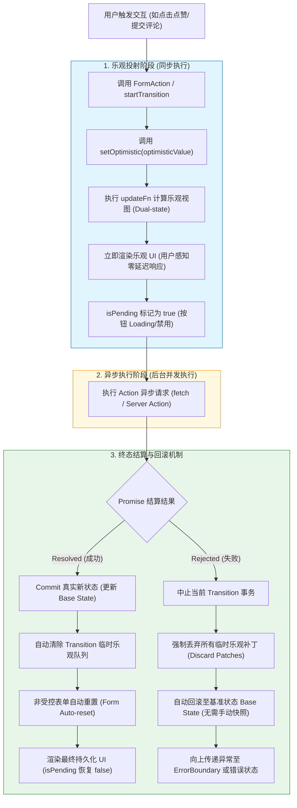

# 钩子✅

## React 内置了哪些 hooks ? {#p0-hooks}

<Answer>

React 19.1 版本下目前支持的 Hooks 列表如下:

| Hook | 说明 | 常见场景示例 |
|------|------|------------|
| [useState](https://react.dev/reference/react/useState) | 组件状态管理 | 计数器、表单输入 |
| [useEffect](https://react.dev/reference/react/useEffect) | 副作用处理 | 数据请求、订阅、清理 |
| [useContext](https://react.dev/reference/react/useContext) | 跨组件共享数据 | 主题、用户信息 |
| [useReducer](https://react.dev/reference/react/useReducer) | 复杂状态逻辑管理 | 多状态、依赖前一状态 |
| [useCallback](https://react.dev/reference/react/useCallback) | 缓存函数引用 | 性能优化、子组件传参 |
| [useMemo](https://react.dev/reference/react/useMemo) | 缓存计算结果 | 计算属性、性能优化 |
| [useRef](https://react.dev/reference/react/useRef) | 获取/存储可变引用 | DOM、定时器、缓存值 |
| [useLayoutEffect](https://react.dev/reference/react/useLayoutEffect) | DOM更新后同步副作用 | 测量布局、动画 |
| [useImperativeHandle](https://react.dev/reference/react/useImperativeHandle) | 暴露ref自定义实例值 | 转发ref、封装组件 |
| [useDebugValue](https://react.dev/reference/react/useDebugValue) | 自定义hook调试信息 | Hook开发 |
| [useId](https://react.dev/reference/react/useId) | 生成唯一ID | 表单、无障碍 |
| [useDeferredValue](https://react.dev/reference/react/useDeferredValue) | 延迟值更新 | 输入防抖、性能优化 |
| [useTransition](https://react.dev/reference/react/useTransition) | 标记并发更新 | 低优先级UI切换 |
| [useSyncExternalStore](https://react.dev/reference/react/useSyncExternalStore) | 订阅外部存储 | 状态库、全局数据 |
| [useInsertionEffect](https://react.dev/reference/react/useInsertionEffect) | 样式插入前副作用 | CSS-in-JS库 |
| [useOptimistic](https://react.dev/reference/react/useOptimistic) | 乐观更新 | 表单提交、列表更新 |
| [useActionState](https://react.dev/reference/react/useActionState) | 处理异步操作状态，[react 19 新增](https://react.dev/blog/2024/12/05/react-19#new-hook-useactionstate) | 异步数据加载、提交表单 |
| [useFormStatus](https://react.dev/reference/react-dom/hooks/useFormStatus) | 表单状态管理，只针对 react-dom 环境 | 表单提交状态、验证 |

**代码示例**

import HooksUseState from '!!raw-loader!./answers/hooks/useState'
import HooksUseEffect from '!!raw-loader!./answers/hooks/useEffect'
import HooksUseContext from '!!raw-loader!./answers/hooks/useContext'
import HooksUseReducer from '!!raw-loader!./answers/hooks/useReducer'
import HooksUseCallback from '!!raw-loader!./answers/hooks/useCallback'
import HooksUseMemo from '!!raw-loader!./answers/hooks/useMemo'
import HooksUseRef from '!!raw-loader!./answers/hooks/useRef'
import HooksUseLayoutEffect from '!!raw-loader!./answers/hooks/useLayoutEffect'
import HooksUseImperativeHandle from '!!raw-loader!./answers/hooks/useImperativeHandle'
import HooksUseDebugValue from '!!raw-loader!./answers/hooks/useDebugValue'
import HooksUseId from '!!raw-loader!./answers/hooks/useId'
import HooksUseDeferredValue from '!!raw-loader!./answers/hooks/useDeferredValue'
import HooksUseTransition from '!!raw-loader!./answers/hooks/useTransition'
import HooksUseSyncExternalStore from '!!raw-loader!./answers/hooks/useSyncExternalStore'
import HooksUseInsertionEffect from '!!raw-loader!./answers/hooks/useInsertionEffect'
import HooksUseOptimistic from '!!raw-loader!./answers/hooks/useOptimistic'
import HooksUseActionState from '!!raw-loader!./answers/hooks/useActionState'
import HooksApp from '!!raw-loader!./answers/hooks/App'

<Sandpack
  template="react-ts"
  options={{
    editorHeight: 800
  }}
  files={{
   "/App.tsx": HooksApp,
    "/useState.tsx": HooksUseState,
    "/useEffect.tsx": HooksUseEffect,
    "/useContext.tsx": HooksUseContext,
    "/useReducer.tsx": HooksUseReducer,
    "/useCallback.tsx": HooksUseCallback,
    "/useMemo.tsx": HooksUseMemo,
    "/useRef.tsx": HooksUseRef,
    "/useLayoutEffect.tsx": HooksUseLayoutEffect,
    "/useImperativeHandle.tsx": HooksUseImperativeHandle,
    "/useDebugValue.tsx": HooksUseDebugValue,
    "/useId.tsx": HooksUseId,
    "/useDeferredValue.tsx": HooksUseDeferredValue,
    "/useTransition.tsx": HooksUseTransition,
    "/useSyncExternalStore.tsx": HooksUseSyncExternalStore,
    "/useInsertionEffect.tsx": HooksUseInsertionEffect,
    "/useOptimistic.tsx": HooksUseOptimistic,
    "/useActionState.tsx": HooksUseActionState
  }}
/>

**常见误区**

* 误用 useEffect 导致死循环：依赖项数组未正确设置。
* useRef 变化不会触发组件更新。
* useMemo/useCallback 过度使用反而影响性能。

:::tip
大部分业务场景只需掌握 useState、useEffect、useContext、useRef，其他 hooks 可按需查阅官方文档。
:::

**延伸阅读**

* [React 官方 Hooks 文档](https://react.dev/reference/react)
* [React Hooks FAQ](https://react.dev/warnings/invalid-hook-call-warning) 简要说明常见错误
* [深入理解 React Hooks](https://juejin.cn/post/6844903981836140552) 进阶原理解析

</Answer>

## 说一下 useState 的使用？{#p0-useState}

<Answer>

useState 用在函数组件和自定义 Hook 中，用于声明和管理组件状态。它返回一个包含当前状态值和更新函数的数组。
useState 函数如下

```ts
type Dispatch<A> = A => void;
type BasicStateAction<S> = (S => S) | S;
function useState<S>(initialState: (() => S) | S): [S, Dispatch<BasicStateAction<S>>]
```

* initialState：初始状态值
  * 可以是任意类型，也可以是一个返回初始状态的函数。
  * 也可是函数返回一个初始值，函数只会在组件首次渲染时调用一次。
* 返回值是一个数组，第一个元素是当前状态值，第二个元素是更新状态的函数。
  * 第一个元素是当前状态值未传入 initialState 时默认为 undefined。
  * 更新函数
    * 支持直接传入新状态值
    * 也支持传入一个函数来基于当前状态计算新状态。

示例如下

```tsx live
function Counter () {
  const [count, setCount] = useState(0)

  return (
    <div>
      <p>Count: {count}</p>
      <button onClick={() => setCount(count + 1)}>Add</button>
    </div>
  )
}
```

使用中需要注意

1. 遵守 Hooks 规则
   * 只能在函数组件或自定义 Hook 中调用 useState。
   * 不能在条件语句、循环或嵌套函数中调用 useState。
2. 对于初始状态值不要传入复杂的函数，这样会导致每次组件渲染时都重新计算初始状态。

import initFunctionApp from '!!raw-loader!./answers/useState/initFunction.tsx';  

<CustomSandPack
   template="react-ts"
   files={{
      "/App.tsx":  initFunctionApp,
   }}
/>

3. 更新状态后，不要直接消费 state 的值，需要通过更新函数获取最新状态。

import setStateCallBackApp from '!!raw-loader!./answers/useState/setStateCallBack.tsx';  

<CustomSandPack
   template="react-ts"
   files={{
      "/App.tsx":  setStateCallBackApp,
   }}
/>

4. 对于非原始更新，注意要重新赋值避免引用类型未修改导致的问题

import referenceUpdateApp from '!!raw-loader!./answers/useState/referenceUpdate.tsx';  

<CustomSandPack
   template="react-ts"
   files={{
      "/App.tsx":  referenceUpdateApp,
   }}
/>

**延伸阅读**

* [hooks-state](https://legacy.reactjs.org/docs/hooks-state.html) 旧版文档对 useState 的介绍
* [useState](https://react.dev/reference/react/useState) 新版文档对 useState 的介绍

</Answer>

## 说一下 useRef？ {#p0-ref}

<Answer>

1. 不触发视图更新的信息，可以使用 useRef 来存储。
2. 典型使用场景

<Tabs
  defaultValue="dom"
  values={[
    {label: '保留 dom 引用', value: 'dom'},
    {label: '记录 timer 等句柄信息', value: 'timer'},
  ]}>

<TabItem value="dom">

```jsx live
function Form() {
  const inputRef = useRef(null);

  function handleClick() {
    inputRef.current.focus();
  }

  return (
    <>
      <input ref={inputRef} />
      <button onClick={handleClick}>
        Focus the input
      </button>
    </>
  );
}
```

</TabItem>

<TabItem value="timer">

```jsx live
function Stopwatch() {
  const [startTime, setStartTime] = useState(null);
  const [now, setNow] = useState(null);
  const intervalRef = useRef(null);

  function handleStart() {
    setStartTime(Date.now());
    setNow(Date.now());

    clearInterval(intervalRef.current);
    intervalRef.current = setInterval(() => {
      setNow(Date.now());
    }, 10);
  }

  function handleStop() {
    clearInterval(intervalRef.current);
  }

  let secondsPassed = 0;
  if (startTime != null && now != null) {
    secondsPassed = (now - startTime) / 1000;
  }

  return (
    <>
      <h1>Time passed: {secondsPassed.toFixed(3)}</h1>
      <button onClick={handleStart}>
        Start
      </button>
      <button onClick={handleStop}>
        Stop
      </button>
    </>
  );
}
```

</TabItem>

</Tabs>

3. 注意事项

import flushSync from '!!raw-loader!./answers/p0-ref/flushSync.jsx';

<Sandpack
  template="react"
  files={{
    "/App.js":  flushSync,
  }}
/>

**延伸阅读**

* [Referencing values with refs](https://react.dev/learn/escape-hatches#referencing-values-with-refs) 官方文档说明 reference 的使用
* [Refs and the DOM](https://react.dev/docs/refs-and-the-dom) 官方文档详细讲解 Refs

</Answer>

## useReducer 的作用，和 useState 有什么区别？ {#p1-useReducer}

<Answer>

`useReducer` 是 React 提供的状态管理 Hook，适用于复杂的状态逻辑管理。它与 `useState` 的主要区别在于状态管理方式和适用场景。

**基本语法**

```ts
const [state, dispatch] = useReducer(reducer, initialState)
```

* `reducer`: 纯函数，接收当前状态和动作，返回新状态
* `initialState`: 初始状态值
* `state`: 当前状态
* `dispatch`: 分发动作的函数

**与 useState 的核心区别**

|特性|useState|useReducer|
|---|---|---|
|**适用场景**|简单状态管理|复杂状态逻辑|
|**状态结构**|单一值或简单对象|复杂对象、多个相关状态|
|**更新方式**|直接设置新值|通过动作(action)描述变化|
|**状态依赖**|适合独立状态|适合依赖前一状态的更新|
|**逻辑复用**|较难复用|reducer逻辑易于复用和测试|

**典型使用场景对比**

**useState 适合：**

```tsx
// 简单计数器
function SimpleCounter () {
  const [count, setCount] = useState(0)

  return (
    <div>
      <p>{count}</p>
      <button onClick={() => setCount(count + 1)}>增加</button>
    </div>
  )
}
```

**useReducer 适合：**

```tsx
// 复杂状态管理
type State = { count: number; error: string | null; loading: boolean }
type Action =
  | { type: 'increment' }
  | { type: 'decrement' }
  | { type: 'reset' }
  | { type: 'setError'; error: string }

function reducer (state: State, action: Action): State {
  switch (action.type) {
    case 'increment':
      return { ...state, count: state.count + 1, error: null }
    case 'decrement':
      if (state.count <= 0) {
        return { ...state, error: '计数不能小于0' }
      }
      return { ...state, count: state.count - 1, error: null }
    case 'reset':
      return { count: 0, error: null, loading: false }
    case 'setError':
      return { ...state, error: action.error }
    default:
      return state
  }
}

function ComplexCounter () {
  const [state, dispatch] = useReducer(reducer, {
    count: 0,
    error: null,
    loading: false
  })

  return (
    <div>
      <p>计数: {state.count}</p>
      {state.error && <p style={{ color: 'red' }}>{state.error}</p>}
      <button onClick={() => dispatch({ type: 'increment' })}>增加</button>
      <button onClick={() => dispatch({ type: 'decrement' })}>减少</button>
      <button onClick={() => dispatch({ type: 'reset' })}>重置</button>
    </div>
  )
}
```

**useReducer 的优势**

* **状态逻辑集中**: 所有状态变更逻辑都在 reducer 中
* **可预测性**: 通过动作描述状态变化，便于调试
* **逻辑复用**: reducer 函数可以独立测试和复用
* **复杂状态**: 适合管理包含多个字段的状态对象

**实际应用场景**

**1. 表单状态管理**

```tsx
function useFormReducer (initialValues) {
  const [state, dispatch] = useReducer(
    (state, action) => {
      switch (action.type) {
        case 'SET_FIELD':
          return { ...state, [action.field]: action.value }
        case 'SET_ERROR':
          return { ...state, errors: { ...state.errors, [action.field]: action.error } }
        case 'RESET':
          return initialValues
        default:
          return state
      }
    },
    { ...initialValues, errors: {} }
  )

  return [state, dispatch]
}
```

**2. 购物车管理**

```tsx
function cartReducer (state, action) {
  switch (action.type) {
    case 'ADD_ITEM':
      return { ...state, items: [...state.items, action.item] }
    case 'REMOVE_ITEM':
      return { ...state, items: state.items.filter(item => item.id !== action.id) }
    case 'UPDATE_QUANTITY':
      return {
        ...state,
        items: state.items.map(item =>
          item.id === action.id ? { ...item, quantity: action.quantity } : item
        )
      }
    default:
      return state
  }
}
```

**选择建议**

* **使用 useState**: 状态简单、独立、更新逻辑简单
* **使用 useReducer**: 状态复杂、有多个相关字段、更新逻辑复杂、需要基于前一状态计算新状态

**常见误区**

* **过度使用 useReducer**: 简单状态也用 useReducer 增加复杂度
* **reducer 不纯**: 在 reducer 中执行副作用操作
* **action 设计不当**: action 类型不明确或包含过多逻辑

:::tip
在简单场景下优先使用 `useState`，当状态逻辑变得复杂、难以管理时再考虑重构为 `useReducer`。
:::

**延伸阅读**

* [useReducer](https://react.dev/reference/react/useReducer) 官方文档
* [useState](https://react.dev/reference/react/useState) 官方文档
* [Extracting State Logic into a Reducer](https://react.dev/learn/extracting-state-logic-into-a-reducer) 状态逻辑提取指南

</Answer>

## 说一下 useEffect? {#p0-useEffect}

<Answer>

useEffect 用来绑定副作用函数，如数据获取、订阅事件、DOM 操作等。useEffect 函数定义如下

```ts
type EffectCallback = () => (void | (() => void));
function useEffect(effect: EffectCallback, deps?: Array<any> | void | null): void
```

* effect：副作用函数，执行时机为组件渲染后。
  * 可以返回一个清理函数，在组件卸载或依赖项变化时调用。
* deps：依赖项数组，控制副作用函数的执行时机。
  * 如果传入空数组 `[]`，副作用函数只在组件首次渲染时执行。
  * 如果不传入 deps，则每次组件渲染都会执行副作用函数。
  * 如果传入依赖项数组，副作用函数会在依赖项变化时执行。
  * **注意不要动态改变依赖项** react 会抛出警告

使用中要注意

1. 确保副作用函数中消费的变量在 deps 中都有申明
2. 副作用函数获取的 state 为快照，如果要获取最新 state，采用回调模式消费数据，或者使用 useRef 存储最新值。特别是在回调涉及异步时间是需要尤为注意
3. 正确设置清理函数避免内存泄漏问题

**延伸阅读**

* [hooks effect](https://legacy.reactjs.org/docs/hooks-effect.html) 旧版文档对 effects 说明
* [Timing of effects](https://legacy.reactjs.org/docs/hooks-reference.html#timing-of-effects) 旧版文档对 useEffect 执行时机的讲解
* [Synchronizing with Effects](https://react.dev/learn/synchronizing-with-effects) 新版文档讲解如何使用 useEffect
* [You Might Not Need an Effect](https://react.dev/learn/you-might-not-need-an-effect) 新版文档讲解 useEffect 的注意事项
* [useEffect](https://react.dev/reference/react/useEffect) 新版文档对 useEffect 的详细说明
* [A Complete Guide to useEffect](https://overreacted.io/a-complete-guide-to-useeffect) React 核心开发 dan abramov 对 useEffect 的详细讲解

</Answer>

## useLayoutEffect 和 useEffect 有什么区别? {#p0-useLayoutEffect}

<Answer>

`useLayoutEffect` 和 `useEffect` 的主要区别在于**执行时机**和**同步性**。

**核心区别表格**

| 特性 | useLayoutEffect | useEffect |
|------|----------------|-----------|
| 执行时机 | DOM 更新后，浏览器绘制前 | 浏览器绘制后，异步执行 |
| 同步性 | 同步执行，阻塞渲染 | 异步执行，不阻塞渲染 |
| 适用场景 | 需要立即测量 DOM、避免视觉闪烁 | 数据获取、订阅、清理等副作用 |
| 性能影响 | 可能阻塞浏览器绘制 | 不影响浏览器绘制性能 |

**执行时机详细说明**

1. **useLayoutEffect** 在 React 渲染周期中的位置：
   * DOM 更新完成 → **useLayoutEffect 执行** → 浏览器绘制
   * 同步执行，会阻塞浏览器的绘制过程
   * 适合需要立即获取最新 DOM 布局信息的场景

2. **useEffect** 在 React 渲染周期中的位置：
   * DOM 更新完成 → 浏览器绘制 → **useEffect 异步执行**
   * 不阻塞浏览器的绘制过程
   * 更适合处理副作用操作

**典型应用场景**

**useLayoutEffect 适用场景：**

* 测量 DOM 元素尺寸或位置,例如记录滚动位置、获取元素宽高等
* 避免视觉闪烁的 DOM 操作
* 需要在浏览器绘制前同步更新的场景

**useEffect 适用场景：**

* 数据获取（API 调用）
* 设置订阅或事件监听
* 清理资源
* 不需要阻塞渲染的副作用

**延伸阅读**

* [useLayoutEffect](https://react.dev/reference/react/useLayoutEffect) 官方文档详细说明

</Answer>

## useCallback 和 useMemo 有什么区别，如何使用？ {#p1-use-callback-async}

<Answer>

|属性|useCallback|useMemo|
|---|---|---|
|作用|缓存函数|缓存计算结果|
|返回值|函数|任意类型|
|典型场景|事件处理、子组件 props|复杂计算、依赖对象|
|依赖变化|重新生成函数|重新计算结果|

**代码示例**

<Tabs >

<TabItem value="useCallback" >

import useCallbackApp from '!!raw-loader!./answers/MemoCallback/useCallback.tsx';

<CustomSandPack
   template="react-ts"
   options={{
      showConsole: true
   }}
   files={{
      "/App.tsx":  useCallbackApp,
   }}
/>

</TabItem>

<TabItem value="useMemo" >

import useMemoApp from '!!raw-loader!./answers/MemoCallback/useMemo.tsx';

<CustomSandPack
   template="react-ts"
   options={{
      showConsole: true
   }}
   files={{
      "/App.tsx":  useMemoApp,
   }}
/>
</TabItem>
</Tabs>

:::warning
一个典型的误区是认为 useCallback 和 useMemo 能阻止组件重新渲染，实际上 React 的理念是如果组件状态发生了变化整个子树都会重新刷新。而 useCallback 和 useMemo 只是一个缓存函数，消费的场景取决于你是否需要利用缓存。正确的避免重新渲染的方式是使用 `React.memo、componentShouldUpdate、React.PureComponent` 等技术，同时结合 useCallback 和 useMemo 来优化性能。进一步理解阅读 [When should you NOT use React memo?](https://github.com/facebook/react/issues/14463#issuecomment-448836180) 在 Issue 中 React 核心开发 Mark Erikson 做了详细的阐述
:::

**延伸阅读**

* [React 官方 useCallback](https://react.dev/reference/react/useCallback)
* [React 官方 useMemo](https://react.dev/reference/react/useMemo)

</Answer>

## useContext 的作用是什么 ？ {#p0-useContext}

<Answer>

useContext 实现在函数组件中消费 Context 的值。

import useContextApp from '!!raw-loader!./answers/useContext/useContext.tsx';

<CustomSandPack
   template="react-ts"
   options={{
      showConsole: true
   }}
   files={{
      "/App.tsx":  useContextApp,
   }}
/>

**注意事项**

* **Context 分割**: 将不同功能的数据分到不同 Context 中，避免一个值变化导致整个组件树重新渲染
* **使用 useMemo 缓存 Context 值**: 防止对象/数组引用变化导致的不必要渲染
* **React.memo 包裹消费组件** 避免不必要的渲染

**延伸阅读**

* [React useContext 官方文档](https://react.dev/reference/react/useContext)

</Answer>

## useReducer 和 useState 有什么区别？{#p3-useReducer}

<Answer>

|对比维度|`useState`|`useReducer`|
|---|---|---|
|**概念**|用于管理单一状态值|用于管理包含多字段或复杂逻辑的状态|
|**使用方式**|`const [state, setState] = useState(init?)`|`const [state, dispatch] = useReducer(reducer, initialArg, init?)`|
|**更新方式**|直接传入新值或函数：`setState(next)`|派发 action：`dispatch({ type, payload })`|
|**适用场景**|简单状态、更新逻辑直接|复杂状态、多个字段、更新逻辑集中处理|

import useReducerApp from '!!raw-loader!./answers/useReducer/useReducer.tsx';

<CustomSandPack
   template="react-ts"
   files={{
      "/App.tsx":  useReducerApp,
   }}
/>

:::tip

参看示例对于复杂的状态处理可以利用 useReducer 将状态逻辑从组件中抽离出来放在组件外，更具体的逻辑可参考
[Extracting State Logic into a Reducer](https://react.dev/learn/extracting-state-logic-into-a-reducer) 官方文档说明

:::

</Answer>

## useInsertionEffect 有什么用？ {#p2-useInsertionEffect}

<Answer>

`useInsertionEffect` 是 React 18 引入的一个特殊 Hook，专门用于在 DOM 变更后、所有其他 effect 执行前插入样式。它主要为 CSS-in-JS 库设计，解决在渲染中注入样式的性能问题。

**基本语法**

```ts
useInsertionEffect(setup, deps?)
```

* `setup`: 处理 effect 的函数，可以返回清理函数
* `deps`: 可选的依赖项数组

import useInsertionEffectApp from '!!raw-loader!./answers/useInsertionEffect/useInsertionEffect.tsx';

<CustomSandPack
   template="react-ts"
   files={{
      "/App.tsx":  useInsertionEffectApp,
   }}
/>

:::tip
`useInsertionEffect` 是高度专业化的 Hook，主要用于 CSS-in-JS 库开发。普通应用开发应优先使用 `useEffect` 或 `useLayoutEffect`。
:::

**与其他 Effect Hook 的执行顺序**

|Hook|执行时机（React 渲染阶段）|相对顺序|主要用途（推荐场景）|
|---|---|---|---|
|`useInsertionEffect`|**DOM 变更后，绘制前，早于所有其他 effect**（同步）|最早（高优先级）|注入样式（CSS-in-JS） 避免 FOUC、布局抖动|
|`useLayoutEffect`|**DOM 变更后，绘制前**（同步），**紧随 `useInsertionEffect`**|中间|DOM 测量与读取强制同步布局动画初始值设定|
|`useEffect`|**浏览器绘制后**（异步，排在任务队列中）|最晚（非阻塞）|异步任务（如：fetch、订阅）非视觉副作用（日志、事件绑定）|

**延伸阅读**

* [useInsertionEffect](https://react.dev/reference/react/useInsertionEffect) 官方文档
* [Add useInsertionEffect](https://github.com/facebook/react/pull/21913) github 对 useInsertionEffect 的 PR 说明
* [`Library Upgrade Guide: <style> (most CSS-in-JS libs)`](https://github.com/reactwg/react-18/discussions/110) 对 useInsertionEffect 的使用讨论

</Answer>

## useActionState 和 useFormStatus 有什么区别? {#p0-use-action-state-vs-use-form-status}

<Answer>

`useActionState` 和 `useFormStatus` 是 React 19 中引入的两个新 Hook，都用于处理表单相关的状态管理。

**核心区别对比**

| 特性 | useActionState | useFormStatus |
|------|---------------|---------------|
| **用途** | 处理异步操作状态 | 获取表单提交状态 |
| **适用范围** | 通用异步操作 | 仅针对表单提交 |
| **环境限制** | React 核心 | react-dom 环境 |
| **状态管理** | 管理完整的异步操作生命周期 | 只读的表单状态信息 |
| **返回值** | `[state, action,pending]` | `{ pending, data, method, action }` |

<Tabs>

<TabItem value="useActionState">

import useActionStateApp from '!!raw-loader!./answers/useActionState/useActionState.tsx';

<CustomSandPack
   template="react-ts"
   options={{
      showConsole: true,
      editorHeight: 400
   }}
   files={{
      "/App.tsx":  useActionStateApp,
   }}
/>

</TabItem>

<TabItem value="useFormStatus">

import useFormStatusApp from '!!raw-loader!./answers/useActionState/useFormStatus.tsx';

<CustomSandPack
   template="react-ts"
   options={{
      showConsole: true,
      editorHeight: 400
   }}
   files={{
      "/App.tsx":  useFormStatusApp,
   }}
/>

</TabItem>

</Tabs>

**延伸阅读**

* [useActionState](https://react.dev/reference/react/useActionState) 官方文档
* [useFormStatus](https://react.dev/reference/react-dom/hooks/useFormStatus) 官方文档
* [React 19 新特性](https://react.dev/blog/2024/12/05/react-19#new-hook-useactionstate) 官方博客

</Answer>

## useDeferredValue  和 useTransition 的区别? {#p3-useDeferredValue}

<Answer>

`useDeferredValue` 和 `useTransition` 都是 React 18 引入的并发特性 Hook，用于优化用户体验，核心区别如下

**核心区别对比**

| 特性 | useDeferredValue | useTransition |
|------|-----------------|---------------|
| **作用对象** | 延迟值的更新 | 延迟状态更新操作 |
| **使用方式** | 包装值 | 包装更新函数 |
| **返回值** | 延迟的值 | `[isPending, startTransition]` |
| **控制方式** | 被动延迟 | 主动标记 |
| **适用场景** | 依赖外部数据 | 频繁刷新的非核心状态，注意不在用户输入等中使用，详见 [updating-an-input-in-a-transition-doesnt-work](https://react.dev/reference/react/useTransition#updating-an-input-in-a-transition-doesnt-work)  |
|**原理差异**|创建值的延迟版本，React 会在高优先级更新完成后再更新延迟值|将状态更新标记为可中断的低优先级任务，允许异步 action 结束后再触发更新

<Tabs>

<TabItem value="useTransition">

import useTransitionApp from '!!raw-loader!./answers/TransitionAndDeferredValue/useTransition.tsx';

<CustomSandPack
   template="react-ts"
   options={{
      showConsole: true
   }}
   files={{
      "/App.tsx":  useTransitionApp,
   }}
/>

:::tip

startTransition 的本质就是延迟的更新函数，效果类似 debounce。伪代码如下

```ts
let isInsideTransition = false

function startTransition (scope) {
  isInsideTransition = true
  scope()
  isInsideTransition = false
}

function setState () {
  if (isInsideTransition) {
    // 对于处于 transiton 中的更新，React 会将其标记为低优先级，延迟调度
  } else {
    // 对于非 transition 中的更新，React 会立即调度
  }
}
```

所以这也是为什么不建议在 startTransition 中使用 setTimeout、setInterval 等异步函数，因为会导致调度的标记丢失，可以通过 `setTransition` 包裹传入的回调解决此问题，详见 [React doesn’t treat my state update as a Transition](https://react.dev/reference/react/useTransition#react-doesnt-treat-my-state-update-as-a-transition)

:::

</TabItem>

<TabItem value="useDeferredValue">

import useDeferredValueApp from '!!raw-loader!./answers/TransitionAndDeferredValue/useDeferredValue.tsx';
import SlowList from '!!raw-loader!./answers/TransitionAndDeferredValue/SlowList.tsx';

<CustomSandPack
   template="react-ts"
   options={{
      showConsole: true
   }}
   files={{
      "/App.tsx":  useDeferredValueApp,
      "/SlowList.tsx": SlowList
   }}
/>

:::tip

useDeferredValue 会将依赖延迟值的组件渲染优先级降低，相当于提供了认为控制子树的渲染优先级，可以参考 [subtree priorities in Concurrent React](https://github.com/facebook/react/issues/15465) 进一步了解。

:::

</TabItem>

</Tabs>

**延伸阅读**

* [useDeferredValue](https://react.dev/reference/react/useDeferredValue) 官方文档
* [useTransition](https://react.dev/reference/react/useTransition) 官方文档
* [React 18 并发特性详解](https://react.dev/blog/2022/03/29/react-v18) 深入理解并发渲染

</Answer>

## useImperativeHandle 的作用? {#p2-useImperativeHandle}

<Answer>

`useImperativeHandle` 是 React 提供的 Hook，用于自定义通过 ref 暴露给父组件的实例值。react19 可以直接结合 `useRef` 使用，react18 及以前需要结合 `forwardRef` 使用。

<Tabs>

<TabItem value="React19">

import useImperativeHandleReact19App from '!!raw-loader!./answers/useImperativeHandle/react19.tsx';

<CustomSandPack
   template="react-ts"
   files={{
      "/App.tsx":  useImperativeHandleReact19App,
   }}
/>

</TabItem>

<TabItem value="React18">

import useImperativeHandleReact18App from '!!raw-loader!./answers/useImperativeHandle/react18.html';

<CustomSandPack
   template="static"
   options={{
    bundlerURL:  "https://preview.sandpack-static-server.codesandbox.io"
  }}
   files={{
      "/index.html":  useImperativeHandleReact18App,
   }}
/>

</TabItem>

</Tabs>

:::tip
通过 `useImperativeHandle` 来限制父组件对子组件实例的访问，避免暴露不必要的内部方法和状态。除了直接操作 DOM 元素外，尽可能通过属性和事件来控制子组件的行为
:::

**延伸阅读**

* [useImperativeHandle](https://react.dev/reference/react/useImperativeHandle) 官方文档
* [父组件调用子组件方法](https://stackoverflow.com/questions/37949981/call-child-method-from-parent) 相关讨论

</Answer>

## useSyncExternalStore 的作用? {#p2-useSyncExternalStore}

<Answer>

`useSyncExternalStore` 是 React 18 引入的 Hook，用于安全地订阅外部数据源，用来实现脱离 React 内部状态流，基于外部状态实现组件的自定义更新。

**基本语法**

```ts
const snapshot = useSyncExternalStore(subscribe, getSnapshot, getServerSnapshot?)
```

* `subscribe`: 订阅函数，接收监听器并返回取消订阅函数，注意回调函数注册和回收在框架内部实现。
* `getSnapshot`: 获取当前状态快照的函数
* `getServerSnapshot`: 可选，用于 SSR 的服务端快照函数
* `snapshot`: 返回当前状态快照

import useSyncExternalStoreApp from '!!raw-loader!./answers/useSyncExternalStore/online.tsx';

<CustomSandPack
   template="react-ts"
   files={{
      "/App.tsx":  useSyncExternalStoreApp,
   }}
/>

:::tip

useSyncExternalStore 实现了外部状态和组件刷新的绑定，典型场景包括全局 DOM 事件或者外部状态管理库（如 Redux、MobX）的订阅。一般不直接使用 useSyncExternalStore， 而是通过封装的自定义 Hook 来使用。

:::

**延伸阅读**

* [useSyncExternalStore](https://react.dev/reference/react/useSyncExternalStore) 官方文档
* [外部状态管理最佳实践](https://github.com/reactwg/react-18/discussions/86) 社区讨论

</Answer>

## useOptimistic 的作用? {#p2-use-optimistic}

<Answer>

`useOptimistic` 是 React 19 引入的一个 Hook，用于实现乐观更新（Optimistic Updates）。它允许在异步操作开始前通过一个预设的值来更新 UI, 当异步操作完成后，在基于实际结果更新状态。

**基本语法**

```ts
const [optimisticState, addOptimistic] = useOptimistic(state, updateFn)
```

* `state`: 当前的实际状态，在异步操作完成后，optimisticState 的值会与之同步
* `updateFn(currentState, optimisticValue)`: 函数，用于生成乐观更新的状态，第一个参数为当前 state 的状态，第二个值为 addOptimistic 传入的值
* `optimisticState`: 乐观更新后的状态
* `addOptimistic(optimisticValue)`: 触发乐观更新的函数

import useOptimisticApp from '!!raw-loader!./answers/useOptimistic/updateName.tsx';

<CustomSandPack
   template="react-ts"
   files={{
      "/App.tsx":  useOptimisticApp,
   }}
/>

:::tip
乐观更新适合高频交互和网络延迟明显的场景，但要确保异步操作的可靠性和错误处理。
:::

**延伸阅读**

* [useOptimistic](https://react.dev/reference/react/useOptimistic) 官方文档
* [React 19 新特性](https://react.dev/blog/2024/12/05/react-19) 官方博客

</Answer>

## useId 的作用? {#p3-useId}

<Answer>

`useId` 是 React 18 引入的一个 Hook，用于生成在客户端和服务器端都一致的唯一标识符。

**基本语法**

```ts
const id = useId(): string
```

**核心作用**

| 功能 | 说明 | 使用场景 |
|------|------|---------|
| 无障碍性支持 | 为屏幕阅读器等辅助技术提供关联 | `aria-labelledby`、`aria-describedby` |
| 表单 label 和 input 匹配 | 生成唯一 ID，避免冲突 | `htmlFor`、`id` |
| 组件间唯一标识 | 确保组件在 SSR 和 CSR 中 ID 一致 | 复杂组件、动态生成的元素 |

**延伸阅读**

* [useId](https://react.dev/reference/react/useId) 官方文档
* [React 18 新特性](https://react.dev/blog/2022/03/29/react-v18#new-hooks) 官方博客
* [无障碍设计指南](https://web.dev/accessibility/) Web 可访问性最佳实践

</Answer>

## useDebugValue 的作用? {#p3-useDebugValue}

<Answer>

`useDebugValue` 是 React 提供的一个调试专用 Hook，主要用于在 React 开发者工具（React DevTools）中为自定义 Hook 显示调试信息。

**基本语法**

```ts
useDebugValue(value: any, format?: (value: any) => any): void
```

* `value`: 要在开发者工具中显示的值
* `format`: 可选的格式化函数，用于自定义显示格式

**延伸阅读**

* [useDebugValue](https://react.dev/reference/react/useDebugValue) 官方文档
* [React DevTools](https://react.dev/learn/react-developer-tools) React 开发者工具使用指南

</Answer>

## 写过哪些有意思的 hooks？ {#p0-custom-hooks}

<Answer>

**核心概念**
自定义 Hook 是 React 逻辑复用的核心机制，能够将组件的状态逻辑与 UI 解耦。在实际复杂工程中，以下几个 Hook 极具代表性并能直接解决 React 开发痛点：

1. **`useLatest`（逃离闭包陷阱）**：
   - 痛点：在 `useEffect` 或 `useCallback` 的异步回调中，常常捕获到定义时的旧状态（Stale Closure）。
   - 原理：利用 `useRef` 保持对最新值的持久引用，在任何异步回调中都能同步读取最新 state。
2. **`useMemoizedFn`（持久化函数引用）**：
   - 痛点：使用 `useCallback` 需要严格维护 deps 依赖数组；依赖变化会导致函数引用改变，进而导致子组件无效重新渲染。
   - 原理：结合 `useRef` 缓存最新函数体，对外暴露一个**引用永远不变**的代理函数。
3. **`useAsyncEffect`（支持取消的异步副作用）**：
   - 痛点：`useEffect` 回调不能是 async 函数，且在连续触发（如搜索联想）时极易出现竞态条件（Race Condition）。
   - 原理：内置 `AbortController` 或取消标志，组件卸载或依赖变更时自动丢弃过期的异步响应。
4. **`useVirtualList`（高性能虚拟列表）**：
   - 痛点：渲染成千上万条 DOM 元素会导致内存暴涨和页面白屏。
   - 原理：根据滚动视口位置（`scrollTop`）只渲染当前可见范围内的切片 DOM，辅以绝对定位与上下缓冲区。

**核心代码实现：**

```tsx
import { useRef, useMemo, useEffect } from 'react'

// 1. useLatest: 解决异步回调中的闭包旧值问题
export function useLatest<T>(value: T) {
  const ref = useRef(value)
  ref.current = value
  return ref
}

// 2. useMemoizedFn: 引用恒定不变，无需维护依赖数组
export function useMemoizedFn<T extends (...args: any[]) => any>(fn: T) {
  const fnRef = useRef(fn)
  fnRef.current = fn

  const memoizedFn = useRef<T | null>(null)
  if (!memoizedFn.current) {
    memoizedFn.current = function (this: any, ...args: any[]) {
      return fnRef.current.apply(this, args)
    } as T
  }

  return memoizedFn.current
}

// 3. useAsyncEffect: 带有取消机制的异步 Effect
export function useAsyncEffect(
  effect: (signal: AbortSignal) => Promise<void>,
  deps: any[]
) {
  useEffect(() => {
    const controller = new AbortController()
    effect(controller.signal).catch(err => {
      if (err.name !== 'AbortError') {
        console.error('Unhandled async effect error:', err)
      }
    })
    return () => controller.abort()
  }, deps)
}
```

**面试官视角**
- 考察工程深度：面试官并非只想听常见的 `useToggle` 或 `useLocalStorage` 这类入门案例，而是想探查候选人对 **闭包陷阱（Stale Closure）**、**依赖引用稳定化**、**竞态取消机制（Race Conditions）** 等底层顽疾的洞察力和封装解决能力。

**延伸阅读**
- [ahooks 官方优秀通用 Hooks 库源码](https://ahooks.js.org/zh-CN/hooks/use-latest)
- [React 官方：如何从 Effect 中读取最新的 Props 或 State](https://react.dev/learn/separating-events-from-effects#reading-latest-props-and-state-with-effect-events)

</Answer>

## React 19 异步动作（Actions）新范式：useActionState、useOptimistic、use() Hook 与 React Compiler 自动记忆化？ {#p0-react-19-actions-compiler}

<Answer>

### 1. 核心结论

React 19 是 React 诞生以来最具突破性的全栈与并发交互架构演进。它从根本上重塑了客户端的数据流转与渲染心智：
- **Actions 异步转场范式**：将异步操作（Async Transitions）提升为一等公民，原生地在 `<form action={fn}>` 或 `startTransition` 中管理异步生命周期，自动化处理 `pending` 等待态、乐观更新、非受控表单重置及异常边界投递，彻底淘汰手动维护 `isPending`、`try/catch` 和脏状态的样板代码。
- **`useActionState`**：正式替代原实验性的 `useFormState` 并移入核心 `react` 包，以并发 Transition 优先级调度状态更新，构建起标准化的“动作派发 - 异步等待 - 状态结算”单向状态机。
- **`useOptimistic`**：基于 Dual-state Pipeline（双状态流管），在不污染真实持久化状态的前提下提供即时乐观投影；与当前 Transition 深度绑定，在请求成功时无缝合流，在异常失败时**全自动安全回滚**，免除手动编写快照与恢复逻辑。
- **`use()` Hook**：打破传统 Hooks 无法在条件分支（`if`）与循环中调用的铁律；通过 Suspense 唤醒协议（未决时 `throw promise` 触发挂起，就绪后同步解包）和无副作用 Context 访问，拉通了全栈异步资源消费模型。
- **React Compiler（Forget）**：在构建期基于 SSA-HIR（静态单赋值高阶中间表示）与控制流图（CFG）执行深度逃逸与反应性作用域静态分析，自动向目标代码注入底层的 `_c(slots)` 细粒度缓存守卫。开发者彻底告别手动编写 `useMemo` / `useCallback` / `React.memo` 的认知心智负担与闭包失效陷阱。

---

### 2. 原理解析

#### (1) React 19 Actions 哲学与异步生命周期

在传统的 React 应用中，一个常见的异步提交（如提交表单、发表评论）往往需要编写高度分散且易出错的代码：
1. 手动声明 `const [isLoading, setIsLoading] = useState(false)` 与 `const [error, setError] = useState(null)`；
2. 在事件回调中手动包裹 `try ... catch ... finally`；
3. 手动处理非受控表单的清空与重置（`formRef.current?.reset()`）；
4. 处理乐观更新时，需要手动备份前值，并在捕获异常时手动回滚。

React 19 提出了 **Actions 范式**。所谓 Action，即任何**接收输入参数（或事件数据）、执行异步副作用并可能返回新状态的异步转场函数**。当把一个异步函数传入 `<form action={fn}>`、`<button formAction={fn}>`，或手动包裹在 `startTransition(async () => { ... })` 中时，React 会自动将其识别为一个 Action。

React 在底层为 Action 赋予了四大原生能力：
- **自动 Pending 状态管理**：React 在 Transition 优先级下执行该异步函数，自动追踪 Promise 的生命周期。在整个异步执行期间，关联的 UI（如通过 `useActionState` 或 `useFormStatus` 读取）自动获得响应式的 `isPending: true`，并在 Promise 结算后自动重置为 `false`。
- **非阻塞式并发交互**：Action 运行在 `TransitionLane` 优先级通道，主线程不会被挂起。用户在等待异步响应期间发起的打字、滚动等高优先级离散交互（`InputContinuousLane` / `SyncLane`）可立即插队响应，完全杜绝页面冻结。
- **非受控表单自动重置**：如果 Action 绑定在 `<form>` 上且异步函数成功完成（Resolved），React 会自动触发原生 HTML 表单重置，无需手动操纵 DOM 节点。
- **异常捕获与错误边界**：若 Action 在执行中抛出异常（Rejected），React 不仅会触发相关乐观状态的回滚，还会自动将错误冒泡传递给最近的 `<ErrorBoundary>`，或由 `useActionState` 捕获为状态输出。

---

#### (2) useActionState 底层机制与状态流转

`useActionState` 的函数签名为：
```tsx
const [state, formAction, isPending] = useActionState(fn, initialState, permalink?)
```

**底层状态机流转流程**：
1. **初始化挂载（Mount）**：React Reconciler 在 Fiber 节点的 Hooks 链表上分配节点，创建唯一的 Action 调度器闭包（`dispatchAction`），并将 `state` 初始化为 `initialState`，`isPending` 默认为 `false`。
2. **触发动作（Dispatch）**：当用户提交表单或直接调用 `formAction(payload)` 时，React 将执行逻辑封装在并发 Transition 事务中。
3. **即时流转为 Pending 态**：React 立即将 Fiber 上的挂起计数器加 1，以高优先级派发一次内部更新，使组件及子孙组件中的 `isPending` 变为 `true`，触发骨架屏或禁用按钮渲染。
4. **执行异步 Action**：在后台并发通道调用 `fn(previousState, payload)`。在此期间，界面依然响应用户其他操作，若多次高频触发，React 会依据并发机制保持更新序列的确定性。
5. **终态 Commit（Resolved / Rejected）**：
   - 当 Promise 正常 Resolve 并返回新值时，React 将该结果写入 Fiber 的 `memoizedState`，并将 `isPending` 重置为 `false`，随后进入 Commit 阶段，原子化地将最终 DOM 变更刷新至浏览器；
   - 若 Promise 发生异常并 Reject，React 将捕捉错误，恢复之前的确定状态，并将错误向上冒泡至 Error Boundary。

---

#### (3) useOptimistic 乐观更新原理与自动回滚机制

`useOptimistic` 的函数签名为：
```tsx
const [optimisticState, setOptimistic] = useOptimistic(passthroughState, updateFn)
```

**双状态流管架构（Dual-state Pipeline）**：
- **基准持久状态（Base / Passthrough State）**：组件真正的真实状态，来自于 Props 或 `useActionState`。它是权威的、经过服务端或客户端持久化确认的数据。
- **乐观派生视图（Projected Optimistic State）**：由 `useOptimistic` 内部基于 `updateFn(currentOptimistic, optimisticValue)` 临时计算出的状态。该状态**只存在于当前渲染快照和进行中的 Transition 事务内**，绝不会直接污染上层的基准状态。

**生命周期与转场深度绑定**：
`setOptimistic` **必须**在 Action 或 `startTransition` 闭包内部被调用。React 内部的执行流水线如下：
1. 当调用 `setOptimistic(optimisticValue)` 时，React 立即在当前 Transition 的临时更新链表中追加一个乐观补丁（Optimistic Patch）；
2. React 立即触发一次渲染更新，此时 `optimisticState` 立即体现出最新的乐观值，用户界面实现零延迟响应；
3. 后台 Action 异步任务继续在网络上通信；
4. **终态裁决（Settlement）**：
   - **成功确认（Commit）**：服务端响应成功，真实状态发生更新（例如 `useActionState` 结算产生新 `state` 或父组件重新传递了新 props）。当 React 接收到新的基准状态时，当前 Transition 宣告结束，React **自动丢弃当前的临时乐观更新队列**。由于新基准状态与乐观预期一致，UI 实现了无缝合流过渡；
   - **失败回滚（Auto-rollback）**：若后台网络异常或服务端业务校验失败抛出错误，当前正在执行的 Transition 事务被判定为 Aborted（终止）。React 会在内部**直接废弃整条临时乐观更新链表**，下一次渲染将直接采用上一轮未被破坏的基准持久状态。**开发者无需手动编写任何诸如 `setList(previousSnapshot)` 的回滚补丁代码**。

---

#### (4) Actions 状态生命周期与乐观更新回滚流（Mermaid 流程图）



---

#### (5) use() Hook：打破传统限制与 Suspense 唤醒协议

在 React 19 之前，所有 Hooks 必须无条件遵循“Rules of Hooks”：只能在函数组件最顶层调用，严禁放在条件分支（`if`）、循环（`for`）或嵌套函数中。其根本原因在于 React 使用了基于单向链表的 Fiber Hooks 存储模型，依赖固定的调用顺序来定位状态槽位。

React 19 推出的 `use()` 打破了这一规则：**`use()` 可以在条件分支和循环中安全调用**。

##### ① 消费 Context：更弹性的条件读取
```tsx
function NotificationBanner({ showDetails }: { showDetails: boolean }) {
  if (!showDetails) {
    return <div>简易通知</div>
  }
  // 允许在条件分支中动态消费 Context，按需订阅，避免多余依赖
  const theme = use(ThemeContext)
  return <div style={{ color: theme.color }}>详细通知内容</div>
}
```
`use(Context)` 底层并不在 Fiber 的 Hook 链表上分配独立的持久状态槽，而是直接读取当前 Fiber 向上遍历所匹配到的 Context Provider 栈帧。因此无需依赖线性调用顺序的严格一致性。

##### ② 消费 Promise 与 Suspense 唤醒协议
`use(promise)` 实现了组件层面的“异步同步化读取”：
1. **状态探测（Status Inspection）**：当调用 `use(promise)` 时，React 首先检查该 Promise 内部挂载的私有标记（`status` 与 `value`）。
2. **未决挂起（Pending -> Throw Promise）**：
   - 若 Promise 尚处于 Pending 状态，`use()` 会直接**通过原生的 `throw promise` 抛出该 Promise 实例**；
   - 这一行为与传统 Suspense 协议一致，React 调度器的渲染循环捕获到该异常，判定当前 Fiber 处于挂起态；
   - React 沿着 Return 链向上寻找最近的 `<Suspense fallback={...}>` 边界，暂停渲染当前未完成的子树，并挂载 fallback UI；
3. **唤醒监听与调度（Ping Listener）**：
   - React 在被抛出的 Promise 实例上注册 `.then(ping, ping)` 监听回调；
   - 当异步数据 Resolve 后，触发 `ping` 回调，React 调度器以并发模式重新调度该组件所在的 Fiber 树；
4. **解包返回（Fulfilled -> Unwrap Value）**：
   - 组件函数被二次执行。此时 Promise 已被标记为 `fulfilled`；
   - `use(promise)` 探测到就绪状态，**同步解包（Unwrap）**并返回解析后的真实数据，组件继续向下执行其余渲染逻辑；
   - 若 Promise 为 `rejected`，`use()` 直接抛出原错误，由外层 `<ErrorBoundary>` 兜底。

> **工程严选铁律**：传给 `use(promise)` 的 Promise **绝不能在渲染函数体内直接使用 `new Promise()` 或未被缓存的 `fetch()` 动态创建**！否则每次渲染都会生成全新的 Promise 实例，导致组件持续抛出异常并无限挂起（Infinite Suspense Loop）。必须结合 `React.cache()`、路由数据加载器或外部状态库来稳定 Promise 引用。

---

#### (6) React Compiler（Forget）全自动记忆化工作原理

##### ① 传统手动优化的三大工程死结
1. **心智负担与模板冗余**：开发人员不得不为每个对象引用编写 `useMemo`、为每个回调编写 `useCallback`、为每个组件包裹 `React.memo`，原本清晰的业务代码充斥着大量的依赖数组 `[a, b, c]`。
2. **失效脆弱性（Fragility）**：只要组件树中某一个中间节点的某一个 prop（如内联回调 `() => {}` 或内联对象 `{}`）未做记忆化，其下游所有精雕细琢的 `React.memo` 全部瞬间被击穿失效。
3. **闭包陈旧陷阱（Stale Closures）**：漏传、错传依赖项数组极易引发难以复现的异步陈旧闭包 Bug；而使用 ESLint 强制自动补全依赖项，又往往引发非预期的无限 re-render 死循环。

##### ② 编译器架构与 SSA-HIR 分析流程
React Compiler 作为一个在**构建期（Build-time）**介入的编译器插件（支持 Babel / Vite / Rollup / Next.js），直接在 AST 之上引入了 **HIR（High-Level Intermediate Representation，高阶中间表示）**：

1. **AST -> HIR 转换**：将复杂的 JavaScript 与 JSX 控制流转换为保留了高级 React 语法语义的**静态单赋值（SSA, Static Single Assignment）控制流图（CFG）**。在 SSA 形式中，每一个变量只被赋值一次，这使得值的生命周期、引用传播与生存期分析变得具备数学上的确定性。
2. **逃逸分析（Escape Analysis）与反应性追踪（Reactivity Tracking）**：
   - 编译器追踪从 Props、State 以及 Hooks 流出的所有“反应性值（Reactive Values）”；
   - 精确分析每一个反应性值在何处被使用、是否逃逸出当前作用域、是否在闭包中被捕获、是否发生了就地突变（In-place Mutation）。
3. **划分反应性作用域（Reactive Scopes）**：
   - 编译器依据数据依赖与控制流边界，将函数体切分成离散的反应性作用域（Scopes）。每一个作用域清晰标明其所依赖的“输入集（Inputs）”与所产生的“输出集（Outputs）”。
4. **代码生成与缓存槽守卫注入（Codegen with `_c` Cache Slots）**：
   - 在生成的 JavaScript 代码中，编译器为组件分配专用的缓存槽位数组 `const $ = _c(totalSlots)`；
   - 对每一个反应性作用域，编译器会自动插入细粒度的依赖比较守卫：如果所有输入依赖项在本次渲染中未发生变化（通过 `Object.is` 校验），直接从缓存槽读取上次计算出的对象、函数或 JSX 树；否则重新执行计算并将新值存入缓存槽。

##### ③ 编译前与编译后形态直观对比

*开发者编写的纯净代码：*
```tsx
function ProductCard({ product, onAddToCart }) {
  const formattedPrice = '$' + product.price.toFixed(2)
  const handleClick = () => onAddToCart(product.id)

  return (
    <div className="card">
      <h3>{product.title}</h3>
      <p>{formattedPrice}</p>
      <button onClick={handleClick}>加入购物车</button>
    </div>
  )
}
```

*React Compiler 转换后的等价底层控制流（概念模型）：*
```tsx
function ProductCard({ product, onAddToCart }) {
  const $ = _c(8) // 申请 8 个细粒度缓存槽位

  // 1. 记忆化计算属性: formattedPrice
  let formattedPrice
  if ($[0] !== product.price) {
    formattedPrice = '$' + product.price.toFixed(2)
    $[0] = product.price
    $[1] = formattedPrice
  } else {
    formattedPrice = $[1]
  }

  // 2. 记忆化回调函数: handleClick
  let handleClick
  if ($[2] !== product.id || $[3] !== onAddToCart) {
    handleClick = () => onAddToCart(product.id)
    $[2] = product.id
    $[3] = onAddToCart
    $[4] = handleClick
  } else {
    handleClick = $[4]
  }

  // 3. 记忆化 JSX 树: 仅在依赖项改变时生成新虚拟 DOM 节点
  let jsxContent
  if ($[5] !== product.title || $[6] !== formattedPrice || $[7] !== handleClick) {
    jsxContent = (
      <div className="card">
        <h3>{product.title}</h3>
        <p>{formattedPrice}</p>
        <button onClick={handleClick}>加入购物车</button>
      </div>
    )
    $[5] = product.title
    $[6] = formattedPrice
    $[7] = handleClick
  } else {
    jsxContent = $[7]
  }

  return jsxContent
}
```
通过这种细化到每一行变量、每一个回调、每一个 JSX 节点的指令级自动记忆化，组件从整体到局部的无用 re-render 被彻底消除，且代码完全免除了任何手写 hooks 的侵入污染。

---

### 3. 规范代码

以下给出一个在生产实践中整合了 **`useActionState`**、**`useOptimistic`** 与 **`use()`** 的现代化全栈留言板交互组件：

```tsx
import React, { use, useActionState, useOptimistic, Suspense } from 'react'

// 数据模型定义
interface Comment {
  id: string
  text: string
  author: string
  isOptimistic?: boolean
}

// 模拟异步 API: 提交新评论
async function postCommentApi(text: string): Promise<Comment> {
  // 模拟网络延迟与业务提交
  await new Promise((resolve) => setTimeout(resolve, 800))
  if (text.includes('error')) {
    throw new Error('评论内容包含敏感词，发布失败！')
  }
  return {
    id: 'cmt_' + Date.now(),
    text,
    author: 'Current User'
  }
}

// 子组件：使用 use() 在条件分支中灵活读取 Context
const ThemeContext = React.createContext<{ theme: 'light' | 'dark' }>({ theme: 'light' })

function HeaderBar({ showTheme }: { showTheme: boolean }) {
  if (!showTheme) return <h3>留言列表</h3>
  // React 19 use() 允许突破顶层限制在条件分支中调用
  const { theme } = use(ThemeContext)
  return <h3 style={{ color: theme === 'dark' ? '#90caf9' : '#1565c0' }}>留言列表 ({theme} 模式)</h3>
}

// 核心功能组件：整合 useActionState 与 useOptimistic
export function CommentManager({ initialComments }: { initialComments: Comment[] }) {
  // 1. useActionState 管理异步 Action 状态与表单生命周期
  const [comments, submitAction, isPending] = useActionState(
    async (prevComments: Comment[], formData: FormData) => {
      const content = formData.get('commentText') as string
      if (!content || !content.trim()) return prevComments

      // 触发乐观更新：立即将临时数据注入乐观视图
      const tempId = 'temp_' + Date.now()
      setOptimisticComments({
        id: tempId,
        text: content,
        author: 'Current User (发送中...)',
        isOptimistic: true
      })

      // 执行异步请求：若抛错将自动触发乐观回滚
      const newComment = await postCommentApi(content)
      return [...prevComments, newComment]
    },
    initialComments
  )

  // 2. useOptimistic 维护双状态乐观投影，提供即时视觉反馈
  const [optimisticComments, setOptimisticComments] = useOptimistic(
    comments,
    (currentList, newOptimisticItem: Comment) => [...currentList, newOptimisticItem]
  )

  return (
    <div className="comment-box">
      <HeaderBar showTheme={true} />

      {/* 渲染列表：采用乐观状态流管，网络慢时依然秒级上屏 */}
      <ul className="comment-list">
        {optimisticComments.map((item) => (
          <li
            key={item.id}
            style={{
              opacity: item.isOptimistic ? 0.6 : 1,
              fontStyle: item.isOptimistic ? 'italic' : 'normal'
            }}
          >
            <strong>{item.author}: </strong>
            <span>{item.text}</span>
            {item.isOptimistic && <span className="tag"> [同步中...]</span>}
          </li>
        ))}
      </ul>

      {/* React 19 原生 Action 表单：成功后自动清空输入框，提交时自动维持 isPending */}
      <form action={submitAction} className="comment-form">
        <input
          name="commentText"
          type="text"
          placeholder="写下你的见解... (输入 error 模拟失败回滚)"
          required
          disabled={isPending}
        />
        <button type="submit" disabled={isPending}>
          {isPending ? '提交中...' : '发表评论'}
        </button>
      </form>
    </div>
  )
}
```

---

### 4. 面试官视角

本题是 2026 年大厂技术面试评估候选人对 **React 架构演进敏感度、并发机制掌握深度以及全栈交互心智成熟度** 的 P0 级压轴题。面试官通常会从以下几个梯度递进考察：

#### (1) 核心考察维度
- **思维代差**：能否清晰对比传统 React 手动状态维护与 React 19 Actions 范式的本质区别，是否仍停留在“受控组件 + `useState(loading)` + 手动 `try/catch`”的旧时代思维。
- **底层架构深度**：
  - 是否理解 `useActionState` 底层是如何与 Fiber 的 Transition Lane 并发通道联动的；
  - 是否能精确讲出 `useOptimistic` 的“双状态流水线”与“转场失败自动废弃 patch 队列”的底层回滚机理；
  - 是否掌握 `use()` 配合 Suspense 时的“未决抛出 Promise、就绪解包返回值”的唤醒协议。
- **编译时认知**：是否了解前端框架“重运行时 -> 重编译期优化”的演进大趋势，能否解释清楚 React Compiler 基于 SSA-HIR 是如何绕开动态脏检查，在构建期完成无死角记忆化的。

#### (2) 连环追问与下探防线
1. **追问：`useActionState` 可以脱离 `<form>` 单独使用吗？**
   - *标准回答*：可以。`useActionState` 返回的第二个参数 `formAction` 是一个标准的 Action Dispatcher。虽然它被特别设计为可以直接传递给 `<form action={...}>`，但在普通的按钮 `onClick` 或自定义事件中，开发者也可以直接通过代码调用 `formAction(payload)`，React 同样会将其置于 Transition 事务中并自动追踪 `isPending`。
2. **追问：如果在非 Transition 环境下调用 `setOptimistic` 会发生什么？**
   - *标准回答*：React 会在控制台抛出警告。`useOptimistic` 的生命周期严格依附于外层的 Transition 事务（如 Action 或 `startTransition`）。如果在普通同步更新中调用，React 无法获知该乐观状态何时结束、与哪个异步 Promise 绑定，从而失去自动合并与异常回滚的语义保证。
3. **追问：既然 React Compiler 实现了全自动记忆化，那么它能优化所有的 JavaScript 代码吗？遇到不纯的代码会崩溃吗？**
   - *标准回答*：不能也不会。React Compiler 的前提是假设代码遵循 **Rules of React**（纯函数渲染、Props 与 State 不可变、无副作用执行）。但为了保证绝对的生产稳定性，Compiler 内部设计了严格的**保守安全退让机制（De-optimization / Bailout）**：当 HIR 静态分析检测到代码存在不可推理的副作用、全局变量逃逸或动态突变时，编译器会主动放弃对该组件或局部作用域的优化，退回原汁原味的未优化 JS 代码，绝不会破坏运行时的逻辑正确性。

---

### 5. 延伸阅读

- [React 19 官方发布博客与 Actions 特性说明](https://react.dev/blog/2024/12/05/react-19)
- [React 官方参考文档：useActionState](https://react.dev/reference/react/useActionState)
- [React 官方参考文档：useOptimistic](https://react.dev/reference/react/useOptimistic)
- [React 官方参考文档：use API 与 Suspense 协议](https://react.dev/reference/react/use)
- [React Compiler 架构与技术原理解析（React 官方文档）](https://react.dev/learn/react-compiler)

</Answer>

