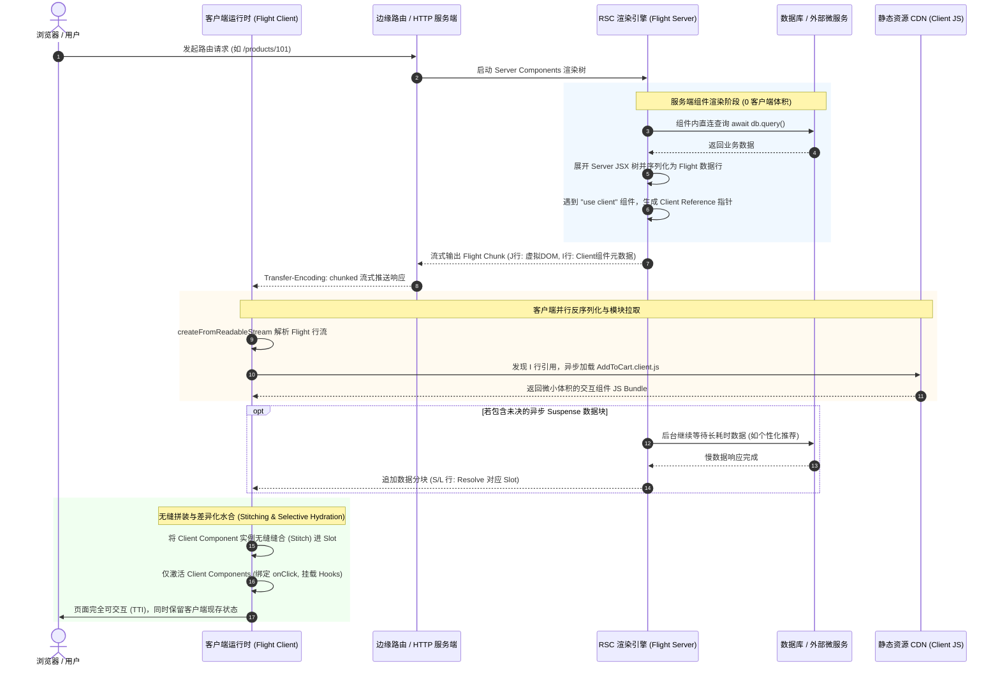

# 原理✅

## react 和 react-dom 是什么关系？{#p0-react-react-dom}

<Answer>

参考 [Codebase Overview](https://legacy.reactjs.org/docs/codebase-overview.html#multiple-packages)

* [react](https://github.com/facebook/react/tree/main/packages/react) 包含了 react 脱离平台的通用能力，例如 hooks， react 核心 API,详见 [react reference](https://react.dev/reference/react) 一般需要配合具体的运行环境使用比如 DOM、React Native 等。
* [react-dom](https://github.com/facebook/react/tree/main/packages/react-dom) 是 react 的 DOM 版本，用于在浏览器中渲染 React 组件，包含了特定平台下的组件和 api，详见 [react-dom reference](https://react.dev/reference/react-dom)

> 本质上 react 是脱离宿主环境的通用能力，react-dom 是 react 在浏览器中的实现和能力扩充

**延伸阅读**

* [Beyond the DOM](https://legacy.reactjs.org/docs/design-principles.html#beyond-the-dom) 理解 react 的设计理念

</Answer>

## React 中 mode 是什么？ {#p1-mode}

<Answer>

mode 是 React 框架内部概念，用来决定渲染策略，React 18 后统一采用 Concurrent Mode。具体模式如下

1. Legacy Mode: React 17 中使用的当前模式
   * 默认禁用 StrictMode
   * 默认为同步模式
   * 使用传统的 Suspense 语义
2. Blocking Mode: Legacy 和 Concurrent 之间的混合模式
   * 默认启用 StrictMode
   * 默认为同步模式
   * 支持一些新特性
3. Concurrent Mode: React 18 中使用的新模式
   * 默认启用 StrictMode
   * 默认为并发模式
   * 支持所有新特性

**关联题目**

* [setState 是同步还是异步](./01.component.md#p1-setState) setState 特性受 mode 影响，hooks 同理

**延伸阅读**

* [concurrent mode](https://17.reactjs.org/docs/concurrent-mode-intro.html) 官方讲解什么是 concurrent mode
* [What happened to concurrent "mode"](https://github.com/reactwg/react-18/discussions/64) 官方讲解 concurrent mode 的进展
* [Migration Step: Blocking Mode](https://17.reactjs.org/docs/concurrent-mode-adoption.html#migration-step-blocking-mode) 模式切换的说明

</Answer>

## Fiber 是什么，有哪些作用? {#p0-fiber-node}

<Answer>

Fiber 是用来表示渲染节点的数据结构，用来解决 React 历史的 [Reconcliation](https://legacy.reactjs.org/docs/reconciliation.html) 必须递归完成渲染，导致无法及时响应用户事件造成的卡顿问题。 每个 Fiber 对应这一个渲染节点，这样可以将组件的递归渲染拆分为一系列的工作单元，从而在此基础上实现对渲染的调度，包括延迟执行，优先级控制等。

[Fiber](https://github.com/facebook/react/blob/28d4bc496b9c0dd2178caf894054ffce600311d3/packages/react-reconciler/src/ReactInternalTypes.js#L88) 结构如下

对 fiber 结构的属性聚类如下

| 分类 | 字段名 | 类型 | 功能描述 |
|------|--------|------|----------|
| **组件身份与引用** | `tag` | `WorkTag` | Fiber 类型，如函数组件、DOM 元素等 |
| | `key` | `string \| null` | 唯一标识子节点，用于列表 diff |
| | `elementType` | `any` | JSX 中的 type，如 `'div'`、组件名 |
| | `type` | `any` | 实际的函数或类组件定义 |
| | `stateNode` | `any` | 对应的 DOM 节点或类实例 |
| | `ref` | `RefObject \| Function \| null` | 节点引用 |
| | `refCleanup` | `(() => void) \| null` | 卸载时清理 ref 的函数 |
| **树结构关系** | `return` | `Fiber \| null` | 父节点 |
| | `child` | `Fiber \| null` | 第一个子节点 |
| | `sibling` | `Fiber \| null` | 下一个兄弟节点 |
| | `index` | `number` | 在父节点子数组中的索引 |
| **状态快照与更新** | `pendingProps` | `any` | 新的 props |
| | `memoizedProps` | `any` | 上一次渲染用的 props |
| | `memoizedState` | `any` | 上一次渲染后的 state |
| | `updateQueue` | `mixed` | 状态更新队列 |
| | `dependencies` | `Dependencies \| null` | Context 等依赖信息 |
| **调度与副作用** | `mode` | `TypeOfMode` | Fiber 渲染模式，如并发 |
| | `flags` | `Flags` | 当前 Fiber 的副作用标记 |
| | `subtreeFlags` | `Flags` | 子树副作用标记汇总 |
| | `deletions` | `Fiber[] \| null` | 需要删除的子节点列表 |
| | `lanes` | `Lanes` | 当前 Fiber 的优先级通道 |
| | `childLanes` | `Lanes` | 子树中最高优先级通道 |
| **双缓冲机制** | `alternate` | `Fiber \| null` | 当前 Fiber 的“工作副本” |
| **性能分析（Profiler）** | `actualDuration?` | `number` | 当前更新中此 Fiber 的实际耗时 |
| | `actualStartTime?` | `number` | 当前渲染任务开始时间 |
| | `selfBaseDuration?` | `number` | 自身渲染耗时（跳过不更新不变） |
| | `treeBaseDuration?` | `number` | 子树总耗时 |
| **调试信息（仅 DEV）** | `_debugInfo?` | `ReactDebugInfo \| null` | Fiber 的调试元信息 |
| | `_debugOwner?` | `Fiber \| null` | 拥有当前 Fiber 的组件 |
| | `_debugStack?` | `string \| Error \| null` | 调试堆栈 |
| | `_debugTask?` | `ConsoleTask \| null` | 调试任务追踪 |
| | `_debugNeedsRemount?` | `boolean` | 是否需要重新挂载 |
| | `_debugHookTypes?` | `HookType[] \| null` | 用于验证 Hook 顺序的列表 |

**延伸阅读**

* [Fiber Principles: Contributing To Fiber](https://github.com/facebook/react/issues/7942) 说明 Fiber 的设计原则
* [react-fiber-architecture](https://github.com/acdlite/react-fiber-architecture)

</Answer>

## react 是如何进行渲染的？ {#p0-react-render}

<Answer>

以该代码为例

<Tabs defaultValue="原始代码"  >

<TabItem value="原始代码" >

import React19 from '!!raw-loader!./answers/render/React19.html';

<Sandpack
  template="static"
  options={{
    showConsole: true,
  }}
  files={{
    "/index.html": React19,
  }}
/>

</TabItem>

<TabItem value="编译后代码" >

```jsx
import React, { Component } from 'https://esm.sh/react@19'
import ReactDOM from 'https://esm.sh/react-dom@19/client'
function _defineProperty (e, r, t) {
  return (r = _toPropertyKey(r)) in e
    ? Object.defineProperty(e, r, {
      value: t,
      enumerable: !0,
      configurable: !0,
      writable: !0
    })
    : e[r] = t,
  e
}
function _toPropertyKey (t) {
  const i = _toPrimitive(t, 'string')
  return typeof i === 'symbol' ? i : i + ''
}
function _toPrimitive (t, r) {
  if (typeof t !== 'object' || !t) { return t }
  const e = t[Symbol.toPrimitive]
  if (void 0 !== e) {
    const i = e.call(t, r || 'default')
    if (typeof i !== 'object') { return i }
    throw new TypeError('@@toPrimitive must return a primitive value.')
  }
  return (r === 'string' ? String : Number)(t)
}
function HelloWorld () {
  debugger; return /* #__PURE__ */
  React.createElement('h1', null, 'Hello, World!')
}
class App extends Component {
  constructor () {
    super(...arguments)
    _defineProperty(this, 'state', {
      time: new Date().toLocaleTimeString()
    })
  }

  render () {
    debugger; return /* #__PURE__ */
    React.createElement('div', null, /* #__PURE__ */
      React.createElement(HelloWorld, null), ' ', this.state.time)
  }
}
const root = ReactDOM.createRoot(document.getElementById('root'))
root.render(/* #__PURE__ */
  React.createElement(App, null))
```

</TabItem>

</Tabs>

**一. 编译阶段**

1. 编写的函数或类组件中 jsx 语法被替换为 React.createElement 函数调用。例如 `<div>hello</div>` 转换为 `React.createElement('div', null, 'hello')`，可以采用 [@babel/preset-react](https://babeljs.io/docs/babel-preset-react) 进行转换，对于 tsx, tsc 支持 [--jsx](https://www.TypeScriptlang.org/tsconfig/#jsx) 控制输出产物为 js 或者是 jsx ，然后交给 babel 进一步处理。

:::warning
注意此 demo 是在浏览器中运行，实际上编译阶段是在构建代码的时候发生的，此处只是为了说明，不要在浏览器采用这种方式
:::

**二.运行时阶段首次加载**

1. 调用 [ReactDOM.createRoot(container)](https://react.dev/reference/react-dom/client/createRoot) 返回 root 节点 ，核心逻辑包括
   1. 事件委托，将事件挂载在 container 节点上 ，详见[listenToAllSupportedEvents](https://github.com/facebook/react/blob/main/packages/react-dom-bindings/src/events/DOMPluginEventSystem.js#L416)
   2. 创建 FiberRoot 元素，详见 [ReactFiberRoot](https://github.com/facebook/react/blob/main/packages/react-reconciler/src/ReactFiberRoot.js#L139)
   3. 返回 [ReactDOMRoot](https://github.com/facebook/react/blob/main/packages/react-dom/src/client/ReactDOMRoot.js) 对象包含
      * [render(reactNode)](https://react.dev/reference/react-dom/client/createRoot#root-render) 挂载 reactNode 到 container
      * [unmount()](https://react.dev/reference/react-dom/client/createRoot#root-unmount) 卸载 container
      * 对象内部属性 `_internalRoot` 指向 FiberRoot
2. 调用 [`root.render(<App />`)](https://react.dev/reference/react-dom/client/createRoot#root-render) 渲染组件到 container 中，核心逻辑包括
   1. 触发 [updateContainerImpl](https://github.com/facebook/react/blob/28d4bc496b9c0dd2178caf894054ffce600311d3/packages/react-reconciler/src/ReactFiberReconciler.js#L394)
   2. 触发 [scheduleImmediateRootScheduleTask](https://github.com/facebook/react/blob/main/packages/react-reconciler/src/ReactFiberRootScheduler.js) 这里会异步调度渲染任务默认优先级是, 只考虑浏览器端
      1. 优先使用 queueMicrotask
      2. Promise.resolve
      3. setTimeout
      4. `new MessageChannel()`
   3. 异步触发 [processRootScheduleInMicrotask](https://github.com/facebook/react/blob/28d4bc496b9c0dd2178caf894054ffce600311d3/packages/react-reconciler/src/ReactFiberRootScheduler.js#L258),内部调用 [scheduleTaskForRootDuringMicrotask](https://github.com/facebook/react/blob/28d4bc496b9c0dd2178caf894054ffce600311d3/packages/react-reconciler/src/ReactFiberRootScheduler.js#L383), 注册一个异步回调 [performWorkUntilDeadline](https://github.com/facebook/react/blob/28d4bc496b9c0dd2178caf894054ffce600311d3/packages/scheduler/src/forks/Scheduler.js#L485) 通过 postMessage 触发，内部执行 [performWorkOnRootViaSchedulerTask](https://github.com/facebook/react/blob/28d4bc496b9c0dd2178caf894054ffce600311d3/packages/react-reconciler/src/ReactFiberRootScheduler.js#L512)核心逻辑包括
      1. [flushPendingEffects](https://github.com/facebook/react/blob/28d4bc496b9c0dd2178caf894054ffce600311d3/packages/react-reconciler/src/ReactFiberWorkLoop.js#L4041) 清除被挂起的副作用
      2. [performWorkOnRoot](https://github.com/facebook/react/blob/28d4bc496b9c0dd2178caf894054ffce600311d3/packages/react-reconciler/src/ReactFiberWorkLoop.js#L1015) 执行渲染任务
         1. 基于 [shouldTimeSlice](https://github.com/facebook/react/blob/28d4bc496b9c0dd2178caf894054ffce600311d3/packages/react-reconciler/src/ReactFiberWorkLoop.js#L1046) 判断是 [renderRootConcurrent](https://github.com/facebook/react/blob/28d4bc496b9c0dd2178caf894054ffce600311d3/packages/react-reconciler/src/ReactFiberWorkLoop.js#L2474) 还是 [renderRootSync](https://github.com/facebook/react/blob/28d4bc496b9c0dd2178caf894054ffce600311d3/packages/react-reconciler/src/ReactFiberWorkLoop.js#L2318C10-L2318C24) 默认执行 renderRootSync
            1. renderRootSync 内部会触发 [workLoopSync](https://github.com/facebook/react/blob/28d4bc496b9c0dd2178caf894054ffce600311d3/packages/react-reconciler/src/ReactFiberWorkLoop.js#L2467) 来对 fiber 节点执行深度遍历，核心函数包括
               1. [performUnitOfWork(unitOfWork)](https://github.com/facebook/react/blob/28d4bc496b9c0dd2178caf894054ffce600311d3/packages/react-reconciler/src/ReactFiberWorkLoop.js#L2776C10-L2776C27) 从根节点开始已 fiber 节点为粒度执行
               2. [beginWork](https://github.com/facebook/react/blob/28d4bc496b9c0dd2178caf894054ffce600311d3/packages/react-reconciler/src/ReactFiberBeginWork.js#L4017) 根据 fiber 节点类型创建子节点
                  1. [reconcileChildren](https://github.com/facebook/react/blob/28d4bc496b9c0dd2178caf894054ffce600311d3/packages/react-reconciler/src/ReactFiberBeginWork.js#L341C17-L341C34) 会基于 FiberNode 的 tag 类型处理子 fiber 的生成，关联 fiber.child 关系
               3. [completeUnitOfWork](https://github.com/facebook/react/blob/28d4bc496b9c0dd2178caf894054ffce600311d3/packages/react-reconciler/src/ReactFiberWorkLoop.js#L3059) 当 fiberNode 没有子节点的时候会触发该逻辑，完成状态更新
               4. [completeWork](https://github.com/facebook/react/blob/28d4bc496b9c0dd2178caf894054ffce600311d3/packages/react-reconciler/src/ReactFiberCompleteWork.js#L1064) 在该阶段会完成节点的创建绑定到 stateNode 等
            2. 完成了 workLoop 循环会触发 [commitRootWhenReady](https://github.com/facebook/react/blob/28d4bc496b9c0dd2178caf894054ffce600311d3/packages/react-reconciler/src/ReactFiberWorkLoop.js#L1427) 内部会调用 [commitRoot](https://github.com/facebook/react/blob/28d4bc496b9c0dd2178caf894054ffce600311d3/packages/react-reconciler/src/ReactFiberWorkLoop.js#L3202C10-L3202C20)
               1. 执行 [commitBeforeMutationEffects](https://github.com/facebook/react/blob/28d4bc496b9c0dd2178caf894054ffce600311d3/packages/react-reconciler/src/ReactFiberCommitWork.js#L336) getSnapshotBeforeUpdate 会在此阶段触发
               2. 执行 [flushMutationEffects](https://github.com/facebook/react/blob/28d4bc496b9c0dd2178caf894054ffce600311d3/packages/react-reconciler/src/ReactFiberWorkLoop.js#L3527C10-L3527C30) 完成 `willxx` 的事件, 和 effect 中的清除回调
               3. 执行 [flushLayoutEffects](https://github.com/facebook/react/blob/28d4bc496b9c0dd2178caf894054ffce600311d3/packages/react-reconciler/src/ReactFiberWorkLoop.js#L3573C10-L3573C28) 完成 useLayoutEffects 清理回调，和触发事件
               4. 执行 [flushSpawnedWork](https://github.com/145376/reactDebug/blob/3b23ed5e500ee127205ff31ee2c05586e05b0061/react-source/react-reconciler/src/ReactFiberWorkLoop.js#L3619) 完成本次 commit 的相关状态清理动作， 同时触发
               5. 调度器触发执行异步调度的 [performWorkUntilDeadline](https://github.com/facebook/react/blob/28d4bc496b9c0dd2178caf894054ffce600311d3/packages/scheduler/src/forks/Scheduler.js#L485) 执行 [flushPassiveEffects](https://github.com/145376/reactDebug/blob/3b23ed5e500ee127205ff31ee2c05586e05b0061/react-source/react-reconciler/src/ReactFiberWorkLoop.js#L4056) 触发 useEffect 的清理回调和触发事件

**三.运行时阶状态变更** 当通过类似 `setState` 等改变状态后，会重新触发调度器执行

   1. [performWorkUntilDeadline](https://github.com/facebook/react/blob/28d4bc496b9c0dd2178caf894054ffce600311d3/packages/scheduler/src/forks/Scheduler.js#L485) 然后内部执行 [performWorkOnRootViaSchedulerTask](https://github.com/facebook/react/blob/28d4bc496b9c0dd2178caf894054ffce600311d3/packages/react-reconciler/src/ReactFiberRootScheduler.js#L512)，后续流程和首次渲染调用链相同一样会从根节点开始递归执行 render 阶段，但是对于没有变化的 fiberNode 会直接跳过，只收集变化的 fiberNode,而后触发 commit 阶段操作。

**延伸阅读**

* [JSX 转换](https://legacy.reactjs.org/docs/jsx-in-depth.html)
* [实现笔记](https://legacy.reactjs.org/docs/implementation-notes.html) 官方对实现的一些说明
* [A (Mostly) Complete Guide to React Rendering Behavior](https://blog.isquaredsoftware.com/2020/05/blogged-answers-a-mostly-complete-guide-to-react-rendering-behavior/) 详细讲解了 react 的渲染机制
* [build your own react](https://pomb.us/build-your-own-react/) react mvp 版本

</Answer>

## scheduler 调度机制原理 {#scheduler}

<Answer>

React Scheduler 是 React 在 Concurrent 模式下用来管理更新任务的调度器，核心目的是：

   1. 解决 UI 卡顿：将大型更新拆分成小任务，在多个帧内执行；
   2. 实现任务优先级：高优先级更新（如用户交互）可中断低优先级任务，提升响应性；
   3. 支持可中断 & 恢复：防止主线程长时间被渲染卡住。

核心原理

1. 采用 [SchedulerPriorities](https://github.com/facebook/react/blob/28d4bc496b9c0dd2178caf894054ffce600311d3/packages/scheduler/src/SchedulerPriorities.js) 定义任务优先级， [SchedulerFeatureFlags](https://github.com/facebook/react/blob/28d4bc496b9c0dd2178caf894054ffce600311d3/packages/scheduler/src/forks/SchedulerFeatureFlags.native-fb.js) 定义时间分片和超时兜底策略
2. [unstable_scheduleCallback](https://github.com/facebook/react/blob/28d4bc496b9c0dd2178caf894054ffce600311d3/packages/scheduler/src/forks/Scheduler.js#L327C10-L327C35) 处理调度，优先使用 MessageChannel 机制，没有则回退到 setTimeout
3. 在 reconciler 中通过 [shouldYield](https://github.com/facebook/react/blob/28d4bc496b9c0dd2178caf894054ffce600311d3/packages/react-reconciler/src/ReactFiberWorkLoop.js#L2770) 判断是否需要重新调度

</Answer>

## diff 算法细节？

<Answer>

基础逻辑参考 [The Diffing Algorithm](https://legacy.reactjs.org/docs/reconciliation.html#the-diffing-algorithm)

1. 节点类型不同直接替换
2. 节点相同类型增量 patch, 触发对应钩子
3. 如果是数组比对详见 [reconcileChildrenArray](https://github.com/facebook/react/blob/28d4bc496b9c0dd2178caf894054ffce600311d3/packages/react-reconciler/src/ReactChildFiber.js#L1112)[、reconcileChildrenIterator](https://github.com/facebook/react/blob/28d4bc496b9c0dd2178caf894054ffce600311d3/packages/react-reconciler/src/ReactChildFiber.js#L1420)
   1. 首先执行“顺序比较”，从左到右遍历新旧列表，如果 key 和 type 都一致，则复用旧 Fiber 并继续；一旦发现不一致，停止顺序遍历，进入下一阶段。
   2. React 构建旧 Fiber 节点的 key → fiber 的 Map，用于新节点根据 key 快速查找是否有可复用节点，避免多次扫描旧列表。
   3. 对于每个新节点，React 根据 key 从旧 Map 中查找是否可复用 fiber，如果没有匹配项则创建新 fiber，并设置 Placement 标志。
   4. 如果找到复用的 fiber，但其在旧列表中的位置小于上一个复用节点的位置，则说明它“左移”了，React 会标记为需要移动（也打上 Placement 标志）。
   5. 遍历完新列表后，旧列表中未被复用的 fiber 节点会统一打上 Deletion 标志，在提交阶段进行删除。
   6. 整个 diff 阶段不会操作 DOM，而是通过 Placement / Update / Deletion 等 effectTag 标记所有变更操作，等待 commit 阶段批量执行。
   7. React diff 的核心优化点在于 key 的使用；如果没有提供 key 或 key 变化频繁，会导致大量非必要的删除与重建。

:::tip

React 没有采用双端对比策略（如 Vue2 的双指针算法），只支持单向从左到右比对,原因是 fiber 的结构是一个单向链表，性能在中间插入、左移场景下不如 Vue。React 也未使用“最长递增子序列（LIS）”优化最少移动路径，所以 key 顺序发生变更时，依旧会触发多个移动操作。

:::

</Answer>

## react hooks 核心原理？{#p0-hooks}

<Answer>

**核心原理**

* useState 是 React Hooks 的基础，依赖 Fiber 架构和链表数据结构实现状态管理。
* 每次组件渲染时，React 会按顺序遍历 hooks 链表，确保每个 useState 都能正确获取和更新自己的状态。

**底层机制**

* 首次渲染时，useState 会在 Fiber 节点上创建一个 hook 对象，保存初始值和更新队列。
* 每次调用 setState，React 会将新的状态更新加入队列，并触发组件重新渲染。
* 渲染时，React 依次遍历 hooks 链表，取出最新状态，保证顺序一致性。
* 状态持久化依赖 Fiber 节点，卸载时清理，挂载时恢复。

**代码示例**

```js
import React, { useState } from 'react'
function Counter () {
  const [count, setCount] = useState(0)
  return (
    <div>
      <p>Count: {count}</p>
      <button onClick={() => setCount(count + 1)}>Increment</button>
    </div>
  )
}
```

**常见误区**

* 不能在条件、循环或嵌套函数中调用 useState，否则会破坏 hooks 链表顺序，导致状态错乱。
* setState 并非立即更新，而是异步批量处理，避免多次渲染。

**实际开发建议**

* Hooks 顺序必须保持一致，避免在条件语句中调用。
* 利用批量更新提升性能，合理拆分组件。

:::tip
Hooks 本质是链表，顺序决定状态归属，务必保证每次渲染调用顺序一致。
:::

**延伸阅读**

* [React 官方 Hooks 原理](https://react.dev/reference/react/hooks#usestate)
* [深入理解 React Hooks 数据结构](https://juejin.cn/post/6844904106323279880)
* [React Fiber 架构解析](https://github.com/facebook/react/blob/main/packages/react-reconciler/src/ReactFiberHooks.js)

</Answer>

## ref 是如何实现的? {#p1-useref}

<Answer>

**核心原理**

* ref 是 React 提供的访问 DOM 或组件实例的机制，底层通过 Fiber 节点和 hooks 链表实现数据持久化和共享。
* useRef 返回一个稳定的对象 `{ current }`，每次渲染都保持引用不变，避免因变化导致组件重渲染。

**实现机制**

* 函数组件中，useRef 在 Fiber 节点的 hooks 链表上创建一个 ref 对象，挂载到 `memoizedState`，每次渲染都复用同一个对象。
* 类组件中，ref 属性会在组件挂载时自动赋值为实例或 DOM 节点，卸载时清空。
* forwardRef 用于将 ref 透传到子组件，支持函数组件访问 DOM。

**代码示例**

```js
import React, { useRef, forwardRef } from 'react'
// useRef 用法
function Demo () {
  const inputRef = useRef(null)
  return <input ref={inputRef} />
}
// forwardRef 用法
const FancyInput = forwardRef((props, ref) => <input ref={ref} {...props} />)
```

**常见误区**

* useRef 变化不会触发组件重新渲染，适合存储副作用或 DOM 节点。
* ref 不是响应式数据，不能用于驱动视图更新。

**实际开发建议**

* 访问 DOM、保存定时器、缓存值优先用 useRef。
* 组件间 ref 传递用 forwardRef，避免 props 传递冗余。

:::tip
useRef 返回的对象始终稳定，适合存储跨渲染周期的可变数据。
:::

**延伸阅读**

* [React 官方 ref 文档](https://react.dev/reference/react/useRef)
* [forwardRef 原理解析](https://react.dev/reference/react/forwardRef)
* [深入理解 React ref 实现](https://juejin.cn/post/7341757372188065792)

</Answer>

## 为什么不能在循环、条件或嵌套函数中调用 Hooks？{#p0-call-in-statement}

<Answer>

**核心原理**

* React Hooks（如 useState/useEffect）底层通过链表结构存储，每次渲染按顺序遍历 hooks 链表，确保每个 hook 能正确获取自己的状态。
* 如果在循环、条件或嵌套函数中调用 hooks，会导致每次渲染时 hooks 顺序不一致，链表结构错乱，状态无法正确归属，React 会直接抛错。

**底层机制**

* 首次渲染时，React 按代码顺序依次创建 hook 节点，追加到 Fiber 节点的 hooks 链表。
* 更新时，React 依次遍历链表，取出对应的状态和副作用。
* 顺序错乱会导致取值错位，状态混乱，甚至出现“状态丢失”或“状态错位”问题。

**代码示例**

```js
// 错误用法
if (flag) {
  const [a, setA] = useState(0)
}
const [b, setB] = useState(1) // 状态归属不确定，可能出错
```

**常见误区**

* Hooks 本质不是数组，而是链表，顺序决定状态归属。
* 不能在条件、循环、嵌套函数中调用 hooks，必须在组件顶层保持顺序一致。

**实际开发建议**

* 所有 hooks 必须在组件顶层调用，保证每次渲染顺序一致。
* 避免在 if/for/函数内部调用 hooks，必要时拆分组件。

:::tip
Hooks 顺序决定状态归属，顶层调用是硬性规范，违背会直接报错。
:::

**延伸阅读**

* [React 官方 Hooks 规则](https://react.dev/warnings/invalid-hook-call-warning)
* [旧版官方文档解释了为什么 hooks 要保证顺序](https://zh-hans.legacy.reactjs.org/docs/hooks-rules.html)
* [Hooks 为什么不能在条件语句中调用](https://juejin.cn/post/6844904106323279880)
* [React Fiber Hooks 源码解析](https://github.com/facebook/react/blob/main/packages/react-reconciler/src/ReactFiberHooks.js)

</Answer>

## 为什么要自定义合成事件 {#p1-custom-event}

<Answer>

**核心原理**

* React 合成事件系统通过事件委托和统一 API，解决浏览器兼容性、性能和安全问题。
* 合成事件对象是 React 自己实现的，具备一致的属性和行为，简化事件处理和调试。

**优势说明**

* 跨浏览器一致性：所有事件都通过统一接口处理，避免不同浏览器差异。
* 性能优化：事件委托到根节点，减少 DOM 监听数量，支持事件池复用，降低内存消耗。
* 简化事件处理：只需关注冒泡阶段，API一致，易于维护。
* 安全性和可控性：防止 XSS，便于事件管理和清理，生命周期集成。
* 与 React 特性集成：支持虚拟 DOM、状态管理、自动解绑，提升开发体验。

**触发顺序说明**

* 合成事件优先于原生事件执行，只有未阻止冒泡时才会触发原生事件。
* 早期 React 事件委托机制可能导致原生事件先执行，现代版本已优化为“先合成后原生”。

**代码示例**

```js
function Demo () {
  function handleClick (e) {
    e.stopPropagation() // 阻止原生事件
    console.log('React 合成事件')
  }
  return <div onClick={handleClick}>点击我</div>
}
```

**实际开发建议**

* 推荐始终使用 React 合成事件，避免直接 addEventListener，保证兼容性和性能。
* 复杂交互场景可结合原生事件，但需注意事件顺序和解绑。

:::tip
合成事件统一管理，便于跨平台和调试，适合绝大多数业务场景。
:::

**延伸阅读**

* [React 官方事件系统](https://react.dev/reference/react-dom/components/common#events)
* [合成事件原理解析](https://legacy.reactjs.org/docs/events.html)
* [事件委托与性能优化](https://juejin.cn/post/6844904106323279880)

</Answer>

## lazy import {#p1-lazy-import}

<Answer>

**核心原理**

* React.lazy 利用 JavaScript 的动态 `import()` 实现组件的异步加载和代码分割。
* 当组件首次渲染时，lazy 返回的特殊组件会触发 `import()`，将目标组件代码单独打包并按需加载。

**实现机制**

* lazy(fn) 接收一个返回 Promise 的函数，内部会等待 Promise resolve 后获取组件定义。
* 加载期间，需用 `<Suspense>` 包裹，fallback 属性用于显示加载占位符。
* 加载完成后，React 自动渲染异步加载的组件，未加载时显示 fallback。

**代码示例**

```jsx
import React, { lazy, Suspense } from 'react'
const MyComponent = lazy(() => import('./MyComponent'))
function App() {
  return (
    <Suspense fallback={<div>Loading...</div>}>
      <MyComponent />
    </Suspense>
  )
}
```

**常见误区**

* lazy 只能用于默认导出的组件，命名导出需额外处理。
* 必须配合 Suspense，否则加载期间会报错。

**实际开发建议**

* 适合路由、弹窗等大体积组件的按需加载，提升首屏性能。
* fallback 可自定义为骨架屏、动画等，优化用户体验。

:::tip
lazy 结合 Suspense 可实现高效代码分割，建议用于大型项目的性能优化。
:::

**延伸阅读**

* [React 官方 lazy 文档](https://react.dev/reference/react/lazy)
* [Suspense 用法详解](https://react.dev/reference/react/Suspense)
* [动态 import 规范](https://developer.mozilla.org/zh-CN/docs/Web/JavaScript/Reference/Statements/import)

</Answer>

## react 优化手段有哪些？ {#p0-react-optimization}

<Answer>

| 优化手段           | 主要方式/工具           | 优势/典型场景                |
|--------------------|------------------------|------------------------------|
| 代码分割           | Suspense、lazy、react-loadable | 按需加载，减少首屏体积        |
| 组件颗粒化         | 独立请求渲染单元        | 降低父组件冗余渲染            |
| 性能调优           | PureComponent、React.memo | 浅比较 props/state，减少无效渲染 |
| 不可变数据         | immutable.js、immer.js  | 高效比较，提升 diff 性能      |
| 函数缓存           | useMemo、useCallback、ahooks | 避免重复声明，提升子组件复用  |
| 状态管理优化       | connect、recoil         | 精细化订阅，减少链式渲染      |
| 事件绑定优化       | 事件委托                | 降低 DOM 监听数量            |

**详细说明**

* 代码分割：通过 `React.lazy` 和 `<Suspense>` 实现异步加载，`react-loadable` 支持自定义加载动画，适合路由、弹窗等大体积组件。
* 组件颗粒化：将依赖数据请求的组件拆分为独立渲染单元，减少父组件渲染影响，提升性能。
* 性能调优：`PureComponent`、`React.memo` 通过浅比较 props/state，避免无关组件渲染；`shouldComponentUpdate` 可自定义渲染条件。
* 不可变数据：`immutable.js`、`immer.js` 提供高效不可变数据结构，配合 diff 算法提升性能。
* 函数缓存：`useMemo`、`useCallback`、`ahooks` 避免重复声明函数，提升子组件 memo 效果。
* 状态管理优化：`connect` 精细化订阅，`recoil` 细粒度状态管理，减少全局渲染。
* 事件绑定优化：React 事件委托机制，减少 DOM 事件监听，提升整体性能。

**常见误区**

* 过度颗粒化可能增加维护成本，需结合实际场景权衡。
* memo 只对 props 浅比较，深层数据需配合不可变数据结构。

**实际开发建议**

* 优先使用 lazy/Suspense 实现代码分割，结合 memo/immutable 优化渲染。
* 复杂状态建议拆分为独立渲染单元，避免全局状态变更导致链式渲染。

:::tip
性能优化需结合业务场景，建议先分析瓶颈再选用合适手段，避免过度优化。
:::

**延伸阅读**

* [React 性能优化官方文档](https://react.dev/learn/optimizing-performance)
* [immer.js 原理与实践](https://juejin.cn/post/7157745748832944141)
* [React.memo 用法详解](https://react.dev/reference/react/memo)

</Answer>

## 什么时候 React 会发生 re-render 如何避免？

<Answer>

**延伸阅读**

* [Blogged Answers: A (Mostly) Complete Guide to React Rendering Behavior](https://blog.isquaredsoftware.com/2020/05/blogged-answers-a-mostly-complete-guide-to-react-rendering-behavior/) 详细讲解 React 渲染逻辑
* [Why React Re-Renders](https://www.joshwcomeau.com/react/why-react-re-renders/) 交互式理解 React 渲染逻辑
* [Writing Resilient Components](https://overreacted.io/writing-resilient-components/#dont-get-distracted-by-imaginary-problems) 说明编写 React 组件的通用规则

</Answer>

## 在 React 应用中如何排查性能问题? {#p2-react-performance-problem}

<Answer>

**核心概念**
排查 React 应用的性能瓶颈，遵循“先定位卡顿阶段，再下探组件粒度，最后定向优化”的排查链路：
1. **宏观阶段定位（Chrome DevTools Performance）**：录制页面交互（如点击、滚动），观察 Main 主线程的 Flame Chart（火焰图）。识别出执行时间超过 50ms 的 Long Task（长任务），排查是 JS 计算密集、密集 DOM 重排，还是过度重新渲染。
2. **微观组件渲染定位（React DevTools Profiler）**：
   - 勾选 "Record why each component rendered while profiling"（记录重新渲染原因）。
   - 查看火焰图（Flamegraph）和排名图（Ranked chart），定位 Render 耗时最长的组件以及触发其渲染的具体原因（Props 变更还是 Hook 变更）。
3. **代码侵入式度量（`<React.Profiler>`）**：在关键业务路径使用原生 `Profiler` API，统计并在生产/灰度环境下上报真实用户的 `actualDuration`。
4. **定位无用渲染（Render Highlights）**：开启 React DevTools 的 "Highlight updates when components render"，高频闪烁绿框的区域即为潜在的无效级联重渲染组件。

**排查与优化方法论：**

* **工具维度**：
  - Chrome Performance：看整体 FPS、Long Tasks 与布局抖动。
  - React Profiler：看 Virtual DOM Commit 与 Component Render 频次。
  - Web Vitals：监控 INP（Interaction to Next Paint）和 LCP。
* **常见性能瓶颈与治理策略**：
  - 引用变异导致子组件连锁渲染：使用 `useMemo` / `useCallback` 稳定传递给被 `React.memo` 包裹的子组件的 props。
  - 状态下沉与组件提升：将独立变化的高频状态（如输入框文本、倒计时）隔离到独立子组件，避免根节点重渲染。
  - 长列表 DOM 节点爆炸：使用虚拟列表（`react-window` / `react-virtualized`）。

**延伸阅读**
- [React 官方：使用 Profiler 度量组件性能](https://react.dev/reference/react/Profiler)
- [Web.dev: 优化交互至下一次绘制 (INP)](https://web.dev/explore/inp)

</Answer>

## 如何确定哪个数据变化引起的组件渲染? {#p2-react-performance-problem-determine}

<Answer>

**核心概念**
React 组件重新渲染的根本原因通常是 **Props 变更**、**内部 State 变更** 或 **Context 变更**。在开发排查中，常借助以下两类手段定位具体的脏数据：
1. **工具层（零侵入）**：React DevTools Profiler 勾选 *Record why each component rendered*，直接在可视化面板中查看每轮 commit 时该组件的 "What changed" 列表。
2. **代码层（Hook 监听）**：自定义 `useWhyDidYouUpdate`，在每次渲染时对比当前 props 与上一次 `prevProps.current`（通过 `Object.is`），将发生浅比较差异的字段及新旧值输出到控制台。

**源码实现（基于 ahooks useWhyDidYouUpdate 核心实现）：**

```tsx
import { useEffect, useRef } from 'react'

export type IProps = Record<string, any>

export function useWhyDidYouUpdate (componentName: string, props: IProps) {
  const prevProps = useRef<IProps>({})

  useEffect(() => {
    if (prevProps.current) {
      const allKeys = Object.keys({ ...prevProps.current, ...props })
      const changedProps: IProps = {}

      allKeys.forEach((key) => {
        if (!Object.is(prevProps.current[key], props[key])) {
          changedProps[key] = {
            from: prevProps.current[key],
            to: props[key]
          }
        }
      })

      if (Object.keys(changedProps).length) {
        console.group(`[why-did-you-update] ${componentName}`)
        console.table(changedProps)
        console.groupEnd()
      }
    }

    prevProps.current = props
  })
}
```

**面试官视角**
- 考查对 React 浅比较（Shallow Comparison）机制的掌握程度，能否快速指出开发者最容易忽略的“隐形重渲染源”（如内联对象字面量 `{ style: {} }`、内联箭头函数 `onClick={() => ...}` 每次渲染都产生全新引用）。

**延伸阅读**
- [ahooks useWhyDidYouUpdate 官方文档](https://ahooks.js.org/zh-CN/hooks/use-why-did-you-update)

</Answer>

## React Server Components (RSC) 底层架构：Flight 协议数据流、服务端组件与客户端 Hydration 交互机制？ {#p0-react-server-components-flight}

<Answer>

### 1. 核心结论

React Server Components (RSC) 是 React 自 Fiber 架构重构以来最深远的一次全栈体系重塑：
- **物理空间与生命周期的彻底解耦**：RSC 不是传统 SSR 的简单升级，而是将组件树按能力边界划分为仅在服务端执行的 **Server Components**（拥有直连数据源与敏感密钥的特权，客户端打包体积为严格的 **0-Bundle Size**）和在浏览器运行的 **Client Components**（带 `"use client"` 指令，负责 DOM 交互、动画与状态）。
- **传输载荷的本质跃迁**：传统 SSR 序列化输出的是失去结构关系的**扁平 HTML 文本**，客户端为了重新接管组件树，必须将全量 JS 代码重新下载并进行高开销的水合（Hydration）；而 RSC 输出的是高度抽象的**虚拟 DOM 流式序列化协议——React Flight 协议（基于 Line-delimited JSON 行式模型）**。
- **Flight 流式协议与插槽模型**：Flight 协议通过行式分块（Chunk-based streaming），将服务端组件展开为虚拟 DOM 描述，将客户端组件抽象为轻量的模块指针引用（Client Reference `$L` / `I` 行），并将未决的异步数据抽象为 Suspense 占位插槽，支持在流式网络通道上边计算、边推送、边反序列化。
- **差异化水合与无损状态拼装（Seamless Stitching & Selective Hydration）**：客户端运行时（Flight Client）消费流式数据，按需异步拉取 Client Component 对应的 JS 模块，将客户端组件精确缝合（Stitch）进虚拟 DOM 树对应插槽；**仅对 Client Components 进行事件绑定与 Hook 激活，Server Components 部分完全免于水合**。页面在路由跳转更新 RSC 时，客户端现存的状态与焦点得以**完好保留（Preserving Client State）**。

---

### 2. 原理解析

#### (1) RSC 与传统 SSR 的底层本质区别

许多开发者容易将 RSC 误认为“新一代 SSR”，实际上二者处于不同的抽象维度且通常在现代全栈框架中相互配合：

| 对比维度 | 传统 SSR (Server-Side Rendering) | React Server Components (RSC) |
|:---|:---|:---|
| **输出产物形态** | 扁平的 HTML 字符串 (HTML text) | 结构化的虚拟 DOM 序列化流 (Flight JSON Stream) |
| **客户端 JS 体积** | **全量打包**。即便只用于服务端初始渲染的重型依赖（如 Markdown、Prism、Dayjs），也必须全部打入客户端 bundle 以供水合 | **0-Bundle Size**。Server Components 的依赖包（ORM、SDK、大文件解析器）完全保留在服务端，零字节下发到客户端 |
| **数据访问能力** | 必须通过独立的 API 路由或 `getServerSideProps`，组件自身无法直接访问内部数据库 | 组件函数天然为 `async` 函数，直接 `await db.query()`、读取环境变量或文件系统，无冗余 API 胶水层 |
| **客户端交互与生命周期** | 组件可以使用所有 Hooks (`useState`, `useEffect`)，拥有浏览器事件监听 | 仅支持异步只读渲染，**禁用** `useState`、`useEffect` 以及 DOM 浏览器专有 API |
| **路由切换与状态保持** | 页面切换重新请求 SSR HTML 时，整颗 DOM 树被销毁重绘，输入框、滚动位置等**客户端状态彻底丢失** | 客户端只接收新路由的 RSC Flight 数据并做局部 Diff，现存的 Client Components **内部状态完好保留（State Preservation）** |
| **水合开销 (Hydration)** | **全量水合税**：浏览器遍历全部 DOM 树，重建整个 Fiber 树并对比校验 | **部分/选择性水合**：Server Components 节点无需水合，仅激活挂载于插槽的 Client Components |

---

#### (2) React Flight 协议底层数据流设计与行式模型

React Flight 是专为流式网络与组件树抽象定制的**行分隔流协议（Line-delimited JSON / Chunk-based Protocol）**。
为什么不能用标准 `JSON.stringify`？因为标准 JSON 必须整体传输完毕后才能被 `JSON.parse` 完整解析，无法支持 HTTP 流式传输（Streaming Chunk-by-chunk），也无法表示循环引用、Promise 异步状态以及未加载的客户端动态模块。

Flight 协议将网络传输内容切分为多行文本，每一行遵循明确的语义结构：
```text
<hex_id>:<tag_or_type><payload>
```

##### 核心行类型与语义标记：
1. **`J` (JSX 虚拟 DOM 节点)**：
   表示服务端展开后的虚拟 DOM 节点描述：
   ```text
   0:["$", "div", null, {"className": "layout", "children": ["$", "$L1", null, {"title": "文章详情"}]}]
   ```
   - `"$\"`：React 内部用于替代 `Symbol.for("react.transitional.element")` 的紧凑序列化标识；
   - `"$L1"`：**Lazy Slot 占位指针**，指向 ID 为 1 的对象或模块，表明此处的子节点是一个延迟解析的客户端组件或异步 Promise。
2. **`I` (Client Reference 客户端模块引用)**：
   服务端遇到标有 `"use client"` 的组件时，并不执行其内部逻辑，而是输出一个模块引用描述：
   ```text
   1:I["./src/components/Counter.client.tsx", ["default"], "Counter"]
   ```
   告知客户端：此处需要借助客户端打包器（Webpack/Turbopack/Vite）的运行时加载指定 chunk 并取出 `default` 导出对象。
3. **`S` 与 `$L` (Suspense 边界与异步 Promise 占位)**：
   若 Server Component 中存在 `await fetchSlowData()`，服务端不必阻塞整个页面响应：
   - 首先输出骨架屏对应的 JSX 行（fallback UI）；
   - 在挂起点插入一个未决的 slot 指针（如 `"$L2"`）；
   - 一旦后端数据就绪，服务端在流中**立即追加**对应的数据行：
     ```text
     2:{"content": "深度长文内容...", "author": "React Team"}
     ```
   - 客户端 Flight Runtime 收到该行后，立即 Resolve 对应的 `$L2` Promise，触发对应区域的 UI 渲染。
4. **`E` (Error 行)**：
   服务端组件执行若抛出未捕获异常，序列化为错误信息与脱敏堆栈行，驱动客户端最近的 Error Boundary 渲染。

---

#### (3) 客户端 Hydration 交互与组件无缝拼装机制

整个 RSC 从服务端计算到客户端最终呈现并具备交互性的全链路，由 **Flight Server** 与 **Flight Client** 协同完成：

##### 第一阶段：服务端组件树遍历与序列化（Flight Server）
1. 服务端从 Root Server Component 启动深度优先遍历。
2. 若遇到普通 Server Component，直接以异步方式执行函数，展开其返回的原生 JSX 元素（如 `div`、`p`）。
3. 若遇到带有 `"use client"` 的 Client Component，服务端**停止向下继续递归该组件内部**，将其拦截转换为 `Client Reference` 标记行，并将其传递给该客户端组件的 Props 序列化写入 Flight 流（**注：传入 Client Component 的 Props 必须是可序列化的，严禁直接传递普通服务端函数或数据库连接句柄**）。

##### 第二阶段：流式网络管道分发
服务端通过 HTTP 分块传输（`Transfer-Encoding: chunked`）或 Web Streams API（`ReadableStream`）实时下发 Flight 文本流。首屏时，通常还会由全栈框架将该流同步喂给 SSR 渲染器，在服务端同步拼装出首屏所需的即时 HTML 发送给浏览器，确保极致的 FCP（首次内容绘制）与 SEO。

##### 第三阶段：客户端无缝拼装（Flight Client Stitching）
1. 浏览器端的 React 运行时通过 `createFromReadableStream` 接入流。
2. **模块预加载**：解析到 `I` 行时，利用打包工具的异步模块加载器（如 `__webpack_require__.e` 或 ESM 动态 `import()`）按需并行下载对应的 Client Component JS bundle。
3. **插槽缝合（Stitching）**：当 Client Component 代码就绪且外层 Server JSX 树解析完成时，Flight Client 将实例化的客户端组件作为实际节点无缝“缝合”到 `"$L"` 占位指针所在的位置，构成一棵完整的、混合了 Server 与 Client 节点的虚拟 DOM 树。
4. **选择性水合（Selective Hydration）**：
   - 浏览器中此时已有 SSR 产出的静态 HTML；
   - React 启动水合过程，但**只对树中的 Client Components 执行水合与事件监听器挂载**；
   - 对于纯 Server Components 渲染出来的 DOM（如静态的文章段落、固定的布局容器），React 确认其匹配后**跳过其水合逻辑，不为其创建任何冗余的状态与事件闭包**。

---

#### (4) 端到端调用链时序图（Mermaid）



---

### 3. 规范代码

以下给出一个符合标准架构模式的 RSC 与 Client Component 协作示例，生动演示 **0-Bundle Size 服务端直连**、**Client Reference 插槽化无缝缝合** 与 **Props 穿透**：

#### (1) 服务端组件：`ProductPage.server.tsx` (无客户端 Bundle)
```tsx
// 服务端组件：默认无需声明 "use server"（在 RSC 环境中默认为 Server Component）
import React, { Suspense } from 'react'
import { db } from '@/lib/db' // 仅存在于服务端的高性能 ORM 客户端
import { marked } from 'marked' // 重型 Markdown 库：完全留在服务端，0 字节下发给浏览器！
import { AddToCartButton } from './AddToCartButton.client' // 引入客户端交互边界
import { ProductReviews } from './ProductReviews.server'

export default async function ProductPage({ productId }: { productId: string }) {
  // 1. 直连数据库，无额外 API 接口封装开销
  const product = await db.products.findUnique({
    where: { id: productId }
  })

  if (!product) {
    return <div>商品不存在</div>
  }

  // 服务端完成大体积依赖库的执行计算
  const renderedDescriptionHtml = marked.parse(product.description)

  return (
    <div className="product-container">
      <h1>{product.title}</h1>
      <p className="price">¥{product.price.toFixed(2)}</p>

      {/* 静态服务端渲染结果：纯 HTML 节点，无任何客户端 Hydration 负担 */}
      <div
        className="description"
        dangerouslySetInnerHTML={{ __html: renderedDescriptionHtml }}
      />

      {/* 2. 缝合客户端组件：通过 Props 传递可序列化的纯数据 */}
      <AddToCartButton productId={product.id} price={product.price} />

      {/* 3. 流式 Suspense 异步边界：慢查询不会阻塞主页面立即渲染 */}
      <Suspense fallback={<div className="loading-skeleton">评价加载中...</div>}>
        <ProductReviews productId={product.id} />
      </Suspense>
    </div>
  )
}
```

#### (2) 客户端交互组件：`AddToCartButton.client.tsx` (交互边界)
```tsx
'use client' // 声明客户端边界：指示打包器生成 Client Reference 并打包进客户端 bundle

import React, { useState, useTransition } from 'react'

interface AddToCartButtonProps {
  productId: string
  price: number
}

export function AddToCartButton({ productId, price }: AddToCartButtonProps) {
  const [count, setCount] = useState(1)
  const [isPending, startTransition] = useTransition()

  const handleAdd = () => {
    startTransition(async () => {
      // 触发加入购物车交互逻辑
      await fetch('/api/cart', {
        method: 'POST',
        headers: { 'Content-Type': 'application/json' },
        body: JSON.stringify({ productId, quantity: count })
      })
      alert('成功将商品加入购物车！')
    })
  }

  return (
    <div className="action-row">
      <div className="counter-stepper">
        <button onClick={() => setCount((c) => Math.max(1, c - 1))}>-</button>
        <span>{count}</span>
        <button onClick={() => setCount((c) => c + 1)}>+</button>
      </div>
      <button className="buy-btn" onClick={handleAdd} disabled={isPending}>
        {isPending ? '提交中...' : '立即购买 (小计: ¥' + (price * count).toFixed(2) + ')'}
      </button>
    </div>
  )
}
```

#### (3) 底层 Flight 协议线上传输格式报文拆解
当浏览器请求上述页面时，网络上传输的真实 Flight 响应报文切片如下：
```text
1:I["./src/components/AddToCartButton.client.tsx", ["default"], "AddToCartButton"]
0:["$", "div", null, {"className": "product-container", "children": [
  ["$", "h1", null, {"children": "高级机械键盘"}],
  ["$", "p", null, {"className": "price", "children": "¥899.00"}],
  ["$", "div", null, {"className": "description", "dangerouslySetInnerHTML": {"__html": "<p>全铝机身...</p>"}}],
  ["$", "$L1", null, {"productId": "p_101", "price": 899}],
  ["$", "$react.suspense", null, {"fallback": ["$", "div", null, {"className": "loading-skeleton", "children": "评价加载中..."}], "children": "$L2"}]
]}]
2:{"reviews": [{"id": "r_1", "content": "手感极佳！"}]}
```
- `1:I[...]`：定义客户端模块索引，浏览器据此拉取客户端组件 JS；
- `0:[...]`：根虚拟 DOM 树，直接展开了服务端元素，将 `AddToCartButton` 替换为指向模块 1 的指针 `"$L1"`，将慢组件替换为 Suspense 槽位 `"$L2"`；
- `2:{...}`：后台数据库慢查询完毕后追加推送到流中的数据分块，精准补齐 `"$L2"`。

---

### 4. 面试官视角

本题是考察高级/资深前端工程功底的“试金石”。面试官不仅要考察候选人会不会使用 Next.js 等上层全栈框架，更看重其对 **网络协议、模块边界、虚拟 DOM 序列化与水合架构** 的底层透视能力：

#### (1) 核心考察维度
- **架构本质认知**：能否清晰说出 RSC 与 SSR 的根本差异（0-Bundle Size、数据流格式不是 HTML 而是虚拟 DOM 流、路由切换无损状态保持）。
- **边界划分原则**：对 `"use client"` 的认知是否准确。许多初中级开发者误以为 `"use client"` 表示“只能在客户端运行”，资深开发者必须指出：“use client” 本质上是**定义了一个从服务端向客户端跨越的模块切割边界（Client Boundary）**；被其标记的组件在 SSR 首屏时依然会在服务端预渲染生成初始 HTML，但在 RSC 流中被降级抽象为一个带指针的 Client Reference。
- **协议与性能深度**：能否说明 Flight 协议为什么采用 Line-delimited JSON 格式，如何通过流式管道（Web Stream）逐步传输 Suspense 块，以及客户端如何实现仅针对 Client Components 的选择性水合。

#### (2) 连环追问与下探防线
1. **追问：能不能在 Server Component 中引入 Client Component？能不能在 Client Component 中引入 Server Component？**
   - *标准回答*：
     - Server Component 中可以**直接 `import`** Client Component，打包工具会自动生成 Client Reference 并在编译期构建代码分割点。
     - Client Component 中**不能直接静态 `import`** Server Component（因为客户端 JS 打包器无法解析服务端专有依赖或 Node 环境 API）。但是，可以通过 **插槽组合模式（Composition Pattern via Children / Props）** 实现嵌套：由上层 Server Component 将另一个 Server Component 实例化后，作为 `children` 或其他 JSX prop 传递给 Client Component。此时 Server Component 依然在服务端先行执行完毕并展开，Client Component 仅把其当成普通的 React Node 插槽渲染，完美解决嵌套组合问题。
2. **追问：为什么不能把一个普通的 JavaScript 回调函数（如 `onClick`）作为 prop 从 Server Component 传递给 Client Component？**
   - *标准回答*：因为 Server Component 与 Client Component 之间隔着一道**网络物理边界与 Flight 序列化协议**。普通的 JavaScript 函数包含了执行上下文和作用域闭包，是无法被 `JSON.stringify` 或 Flight 协议安全跨网络序列化的。如果需要跨边界进行动作交互，必须使用标记有 `"use server"` 的 **Server Action**。React 编译器会为 Server Action 生成一个全局唯一的加密端点引用 ID（Action ID），客户端调用时实质上是通过 POST 请求向服务端发起 RPC 远程调用。
3. **追问：RSC 必须强绑定 Next.js 吗？底层需要依赖哪些核心库支撑？**
   - *标准回答*：不强绑定。RSC 是 React 官方团队制定的核心通用规范，核心逻辑由官方底层的 `react-server-dom-webpack`、`react-server-dom-esm` 或 `@vitejs/plugin-rsc` 提供协议实现与序列化/反序列化运行时。Next.js 只是该规范最早落地的代表性框架，目前社区中的 Waku、Remix/React Router 7、Expo 等都在全面接入原生的 RSC 架构。

---

### 5. 延伸阅读

- [React 官方文档：React Server Components 指南](https://react.dev/reference/rsc/server-components)
- [React RFC: React Server Components 核心架构设计草案](https://github.com/reactjs/rfcs/blob/main/text/0188-server-components.md)
- [Dan Abramov: React Server Components from Scratch 深度解析专栏](https://github.com/reactwg/server-components)
- [Next.js 官方架构文档：How Server Components Work Behind the Scenes](https://nextjs.org/docs/app/building-your-application/rendering/server-components)

</Answer>

