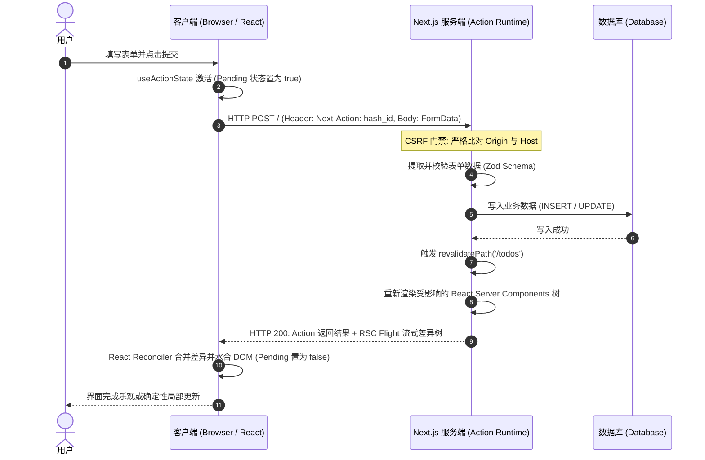
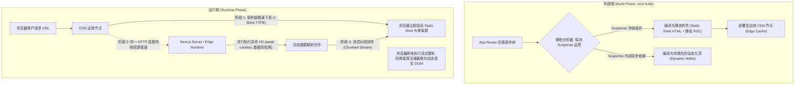
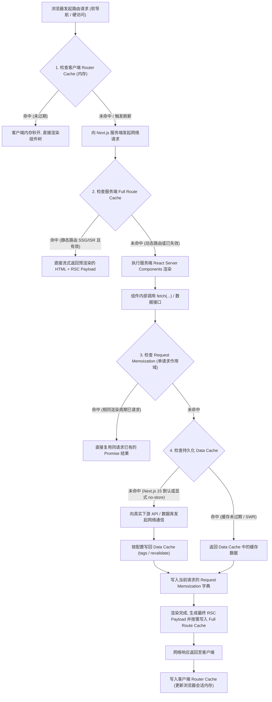
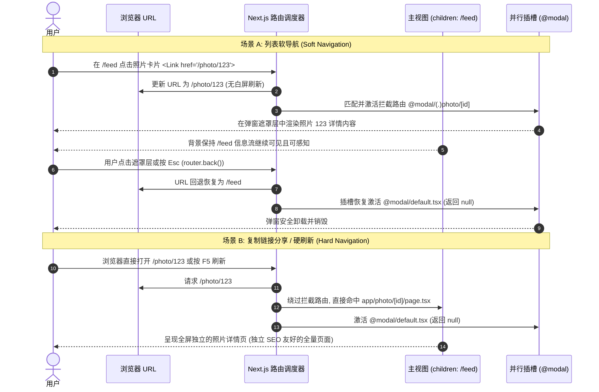

# Next.js 全栈架构✅

## Next.js App Router 中 Server Actions 的底层执行机制、RPC 通信模型与 CSRF 防御？ {#p0-nextjs-server-actions-rpc}

<Answer>

**核心结论:**

- **原生 RPC 突变抽象**：Server Actions 是 Next.js 深度整合 React 19 Actions 原语构建的服务端突变（Mutations）模型。它消除了传统 REST/GraphQL API 端点与请求胶水代码，提供从服务端函数直接到客户端调用的端到端强类型 RPC（Remote Procedure Call）体验。
- **编译期静态提取与 Action ID**：构建期编译器（SWC）静态扫描带有 `'use server'` 指令的函数，生成全局唯一的混淆哈希 ID（`Next-Action ID`），并将客户端调用替换为指向内部 RPC 分发器的轻量代理桩。
- **单次网络往返完成数据突变与组件树重绘制**：客户端调用携带 `Next-Action` 请求头；服务端执行完毕后，如遇 `revalidatePath` 或 `revalidateTag`，会在当前相同的 HTTP 响应流中无缝管道化回传最新的 React Flight（RSC Payload）差异树，实现“突变 -> 数据库写入 -> 服务端重验证 -> 客户端无缝局部刷新”的一步闭环。
- **天然渐进增强与原生 CSRF 免疫**：支持在无客户端 JavaScript 环境下降级为原生 HTML Form POST 提交；运行时强制比对 HTTP 请求头中的 `Origin` 与 `Host`（或代理转发 Host），结合自定义请求头预检，彻底防御跨站请求伪造（CSRF）。

**原理解析:**

1. **编译期切片与 Action 桩代码注入**：
   当在文件顶部或函数体内标注 `'use server'` 时，Next.js 编译器会在 AST 分析阶段执行拆分：
   - 服务端侧：保留真实业务逻辑，绑定一个根据模块文件路径和导出符号派生的安全哈希标识（例如 `$$ACTION_ID = "40a7b5c..."`）。
   - 客户端侧：将真实函数逻辑移除（防止服务端密钥与敏感依赖泄漏到客户端 Bundle），替换为一个代理桩（Proxy Stub）。该桩函数在被调用时，自动封装参数并向当前 URL 发起 POST 请求。

2. **通信协议与 Flight 协议流式合并**：
   当通过客户端调用该 Action 时，底层使用 `fetch` 发送 HTTP POST 请求，Header 包含 `Next-Action: <ACTION_ID>`。参数经由类似 RSC 的序列化通道传输（支持标准类型、Date、Map、Set 以及原生 FormData）。
   在执行服务端函数期间，若调用了数据重验证函数（如 `revalidatePath('/dashboard')`），Next.js 服务端运行时会在完成业务变更后，立即触发受影响路由段的 RSC 服务端重渲染。该更新的 RSC Flight 树与 Server Action 的返回值被打包在同一条 HTTP 响应体内，客户端 React 协调器接收后无缝就地替换 DOM 节点，完全消除了客户端“发送 POST -> 等待响应 -> 客户端手动重新发送 GET 拉取列表”所带来的多次网络往返瀑布（Network Waterfall）。

3. **双重防御机制应对 CSRF 风险**：
   - **基于 Origin 与 Host 的同源硬性比对**：浏览器在发起 POST 请求时会自动携带 `Origin` 请求头（不可被脚本伪造）。Next.js 收到 Server Action 请求时，严格校验 `Origin` 的主机名必须与 HTTP `Host`（或配置的反向代理 `X-Forwarded-Host`）完全一致。若校验失败，直接拒绝执行并返回 403 Forbidden。
   - **预检凭证与自定义请求头隔离**：通过客户端脚本调用时，自定义头 `Next-Action` 会触发浏览器的 CORS Preflight（OPTIONS 预检），跨域攻击者无法在无后端 CORS 明确授权的前提下发起带有该自定义头的复杂请求。



**规范实现:**

以下代码演示生产级带输入校验、错误处理、安全防护的 Server Action，以及在客户端配合 React 19 `useActionState` 和 `useOptimistic` 实现的乐观更新表单组件。

1. **服务端 Action 定义（`app/actions/todo.ts`）**：

```typescript
'use server'

import { revalidatePath } from 'next/cache'
import { z } from 'zod'

// 1. 输入数据校验模式定义
const CreateTodoSchema = z.object({
  title: z.string().trim().min(1, '标题不能为空').max(100, '标题过长'),
})

export type ActionState = {
  success: boolean
  message?: string
  errors?: {
    title?: string[]
  }
}

// 2. 生产级 Server Action 函数
export async function createTodoAction(
  prevState: ActionState,
  formData: FormData
): Promise<ActionState> {
  // 安全前置门禁：鉴权检查（防范越权调用）
  // const session = await auth()
  // if (!session) return { success: false, message: '未授权访问' }

  const validatedFields = CreateTodoSchema.safeParse({
    title: formData.get('title'),
  })

  if (!validatedFields.success) {
    return {
      success: false,
      errors: validatedFields.error.flatten().fieldErrors,
    }
  }

  try {
    const { title } = validatedFields.data

    // 模拟数据库持久化
    await mockDbInsertTodo({ id: crypto.randomUUID(), title, completed: false })

    // 触发指定路由的受影响 RSC 服务端组件重验证
    revalidatePath('/todos')

    return { success: true, message: '创建成功' }
  } catch (error) {
    return {
      success: false,
      message: error instanceof Error ? error.message : '服务器内部错误',
    }
  }
}

async function mockDbInsertTodo(todo: { id: string; title: string; completed: boolean }) {
  // 生产环境中替换为 Prisma / Drizzle 等 ORM 调用
  return Promise.resolve(todo)
}
```

2. **客户端交互组件（`app/todos/todo-form.tsx`）**：

```tsx
'use client'

import { useActionState, useOptimistic, useRef } from 'react'
import { createTodoAction, type ActionState } from '@/app/actions/todo'

interface TodoItem {
  id: string
  title: string
  pending?: boolean
}

export function TodoForm({ initialTodos }: { initialTodos: TodoItem[] }) {
  const formRef = useRef<HTMLFormElement>(null)

  // React 19 原生状态管理 Hook，解耦 pending 与返回状态
  const [state, formAction, isPending] = useActionState<ActionState, FormData>(
    createTodoAction,
    { success: false }
  )

  // 乐观更新：在网络通信完成前即刻向用户呈现新增条目
  const [optimisticTodos, setOptimisticTodos] = useOptimistic(
    initialTodos,
    (currentTodos, newTitle: string) => [
      ...currentTodos,
      { id: 'temp-' + Date.now(), title: newTitle, pending: true },
    ]
  )

  const handleSubmit = (formData: FormData) => {
    const title = formData.get('title') as string
    if (title?.trim()) {
      setOptimisticTodos(title)
    }
    formRef.current?.reset()
  }

  return (
    <div className="max-w-md p-4 space-y-4">
      {/* 原生 form action 实现渐进增强：即使禁用 JS 也能退化为原生 POST */}
      <form
        ref={formRef}
        action={async (formData: FormData) => {
          handleSubmit(formData)
          await formAction(formData)
        }}
        className="flex gap-2"
      >
        <input
          name="title"
          type="text"
          placeholder="请输入待办事项..."
          disabled={isPending}
          className="flex-1 px-3 py-2 border rounded"
          required
        />
        <button
          type="submit"
          disabled={isPending}
          className="px-4 py-2 text-white bg-blue-600 rounded disabled:opacity-50"
        >
          {isPending ? '提交中...' : '添加'}
        </button>
      </form>

      {/* 字段校验错误提示 */}
      {state.errors?.title && (
        <p className="text-sm text-red-500">{state.errors.title.join(', ')}</p>
      )}

      {/* 列表渲染（包含乐观渲染状态） */}
      <ul className="space-y-2">
        {optimisticTodos.map((todo) => (
          <li
            key={todo.id}
            className={[
              'p-2 border rounded flex justify-between',
              todo.pending ? 'opacity-50 italic' : '',
            ]
              .filter(Boolean)
              .join(' ')}
          >
            <span>{todo.title}</span>
            {todo.pending && <span className="text-xs text-gray-500">同步中...</span>}
          </li>
        ))}
      </ul>
    </div>
  )
}
```

**面试官视角:**

- **考察核心**：是否停留在“Server Actions 只是语法糖”的浅层认知；能否准确描述客户端代理桩与服务端 RPC 分发器的代码物理隔离机制；能否讲清单次 HTTP 往返中 Action 执行与 RSC Flight 数据重绘制的流水线协同机制。
- **加分项**：
  1. **渐进增强（Progressive Enhancement）机制**：当客户端未加载 JS 时，`<form action={serverAction}>` 会渲染带有隐藏 `<input type="hidden" name="$$action_0" value="...">` 的标准 HTML 表单，以原生 application/x-www-form-urlencoded 方式提交，服务端识别后完成逻辑重定向，做到 0 JS 环境无缝可用。
  2. **安全边界洞察**：明确指出“任何标注 `'use server'` 的函数本质上都是公开暴露的公网 HTTP 端点”，因此必须在每个 Action 内部执行独立的鉴权、会话校验与严格的 Schema 过滤，绝不能信任客户端传入的任何参数。
- **常见误区**：
  - 误以为 Server Action 函数会和客户端组件打包到同一个 JS 文件中泄漏后端源码（Next.js 编译器会在客户端打包时做摇树与代码替换，客户端只保留哈希调用桩）。
  - 误以为 Server Action 只能在 `<form>` 内使用（任何普通的 `onClick`、事件函数中均可通过 `startTransition(() => action())` 编程式调用）。

**延伸阅读:**

- [Next.js Documentation: Server Actions and Mutations](https://nextjs.org/docs/app/building-your-application/data-fetching/server-actions-and-mutations)
- [React 19 Reference: Server Actions & useActionState](https://react.dev/reference/react/useActionState)

</Answer>

## Next.js 15 部分预渲染（Partial Prerendering, PPR）如何结合静态 Shell 与流式动态组件？ {#p0-nextjs-ppr-architecture}

<Answer>

**核心结论:**

- **兼收并蓄的混合范式**：部分预渲染（Partial Prerendering, PPR）是 Next.js 15 引入的突破性架构模型，彻底消除了静态站点生成（SSG，首包快但内容冻结）与服务端渲染（SSR，内容动态但首包 TTFB 延迟高）之间的非此即彼选择。
- **基于 React Suspense 的自动切片**：开发者无需编写复杂的异构胶水代码，仅需使用标准 React `<Suspense>` 包裹动态数据依赖；Next.js 在构建期将页面拆解为两部分：静态外壳（Static Shell）与动态插槽孔洞（Dynamic Holes）。
- **极速边缘秒开与单连接流式喷薄**：静态外壳连同骨架屏（Fallback）在构建时烘焙成静态 HTML，由全球 CDN 边缘节点以微秒级 TTFB（Time To First Byte）瞬间返回给浏览器；与此同时，相同的 HTTP 连接保持长开启，由服务端后台并行执行挂起的动态异步任务，通过 HTTP/2+ Chunked 流式传输直接将真实组件流式写入对应插槽。

**原理解析:**

1. **构建期静态分析与 HTML Shell 烘焙**：
   在 Next.js 构建阶段（`next build`），编译器会对声明了 PPR 的路由树执行预渲染分析。
   - 所有在 `<Suspense>` 边界之外的组件被确认为静态内容，连同 `<Suspense fallback={<Skeleton />}>` 声明的占位骨架屏一起，全量预渲染为确定的静态 HTML 外壳文件与静态 RSC Payload，分发部署在 CDN 边缘服务器上。
   - 所有在 `<Suspense>` 内部且读取了动态上下文（例如异步 `cookies()`、`headers()`、未缓存的数据库查询等）的组件，会被标记为“动态孔洞（Dynamic Holes）”，构建期保留挂起状态。

2. **运行时统一管线多路复用（Single Connection Multiplexing）**：
   传统的静态外壳加动态加载方案（如客户端渲染 SPA 或 CSR SWR）需要浏览器先下载静态 HTML -> 解析脚本 -> 发起二次 Ajax 请求 -> 接收 JSON -> 重新渲染，造成显著的瀑布流。
   PPR 的底层革新在于**全链路单流复用**：
   - 第一阶段：CDN 命中静态缓存，瞬间（通常 < 30ms）将首屏静态 HTML Shell 刷入用户浏览器，用户立即看到导航条、商品基础排版与骨架屏，LCP 与 FCP 指标达到极致。
   - 第二阶段：CDN 或边缘网关就近代理回源（或边缘无服务器执行），动态组件并发执行异步 I/O。一旦某个动态 Promise 兑现，Next.js 立即将该组件的 HTML 片段以及内联替换脚本（`<script>` 与 `<template>` 标签）通过相同的长连接流式推送给客户端。
   - 第三阶段：浏览器 HTML 解析器边接收边执行内联脚本，就地将骨架屏无缝置换为真实个性化内容，整个过程对用户无闪烁、无多余 HTTP 握手开销。

3. **Next.js 15 的异步 API 演进支撑**：
   为了使 PPR 的静态分析推导具有 100% 确定性，Next.js 15 将过去同步的 `cookies()`、`headers()`、`params`、`searchParams` 全面升级为异步 Promise API。这一变更迫使开发者显式通过 `await` 或在 Suspense 边界内消费它们，使得编译器能无歧义地判定动态边界，避免了以往因为在根层级不经意调用同步 `cookies()` 导致整个页面静默退化为慢速 SSR 的顽疾。



**规范实现:**

以下代码展示在 Next.js 15 中以增量模式（Incremental Adoption）开启 PPR 并构建动静结合的电商产品详情页。

1. **框架配置开启实验特性（`next.config.ts`）**：

```typescript
import type { NextConfig } from 'next'

const nextConfig: NextConfig = {
  experimental: {
    // 启用增量部分预渲染，允许在单路由级别显式开启
    ppr: 'incremental',
  },
}

export default nextConfig
```

2. **生产级动静结合页面实现（`app/products/[id]/page.tsx`）**：

```tsx
import { Suspense } from 'react'
import { cookies } from 'next/headers'

// 显式声明该路由段启用部分预渲染
export const experimental_ppr = true

// 1. 静态组件：构建期确定，编译进 Static Shell
function ProductHeader({ id }: { id: string }) {
  return (
    <header className="border-b p-4">
      <h1 className="text-2xl font-bold">专业级开发者工作站</h1>
      <p className="text-gray-500">产品编号: {id}</p>
      <div className="mt-2 text-green-600 font-semibold">现货库存保障</div>
    </header>
  )
}

// 骨架屏占位组件：编译进 Static Shell，即刻渲染
function PricingSkeleton() {
  return (
    <div className="p-4 bg-gray-100 rounded animate-pulse space-y-2">
      <div className="h-6 w-24 bg-gray-300 rounded" />
      <div className="h-4 w-48 bg-gray-300 rounded" />
    </div>
  )
}

// 2. 动态组件：依赖用户个性化 Cookie 与实时库存，在 Suspense 孔洞内流式填充
async function PersonalizedPricing({ productId }: { productId: string }) {
  // Next.js 15 规范：必须使用 await 读取异步 cookies()
  const cookieStore = await cookies()
  const userToken = cookieStore.get('auth_token')?.value

  // 模拟动态耗时查询（个性化会员折扣与实时库存）
  const pricingData = await fetchPersonalizedPricing(productId, userToken)

  return (
    <div className="p-4 bg-blue-50 border border-blue-200 rounded">
      <div className="text-xl font-bold text-blue-900">
        会员专属价: ¥{pricingData.price}
      </div>
      <div className="text-sm text-blue-700">
        VIP 折扣已抵扣: ¥{pricingData.discount} (实时库存: {pricingData.stock} 件)
      </div>
    </div>
  )
}

export default async function ProductDetailPage({
  params,
}: {
  params: Promise<{ id: string }>
}) {
  // Next.js 15 规范：动态路由入参 params 也是异步 Promise
  const { id } = await params

  return (
    <main className="max-w-4xl mx-auto p-6 space-y-6">
      {/* 静态区域：边缘瞬间呈现 */}
      <ProductHeader id={id} />

      {/* 动态区域：Suspense 隔离边界，动态数据流式填充 */}
      <section className="space-y-2">
        <h2 className="text-lg font-medium">实时定价</h2>
        <Suspense fallback={<PricingSkeleton />}>
          <PersonalizedPricing productId={id} />
        </Suspense>
      </section>

      {/* 另一个静态展示块 */}
      <footer className="text-xs text-gray-400 mt-12 border-t pt-4">
        © 2026 全栈架构实验室. 静态边缘外壳驱动.
      </footer>
    </main>
  )
}

async function fetchPersonalizedPricing(productId: string, token?: string) {
  // 模拟异步 I/O 延迟
  await new Promise((resolve) => setTimeout(resolve, 800))
  return {
    price: token ? 8999 : 9999,
    discount: token ? 1000 : 0,
    stock: 42,
  }
}
```

**面试官视角:**

- **考察核心**：是否能清晰阐释 PPR 相比于传统 SSG + CSR 和传统 SSR 的降维打击优势；能否讲出它是如何利用单一 HTTP 连接完成流式传输而无需客户端二次发起 Ajax 的网络底层原理。
- **加分项**：
  1. **深度掌握 React 19 / Next.js 15 演进脉络**：指出将 `cookies()` 与 `params` 转为 Promise 的核心动机正是为了支持编译期更精准的静态分析与 PPR 边界提取。
  2. **边缘架构与 CDN 协同**：理解 CDN 边缘节点支持针对 Static Shell 进行无条件长期缓存（Edge Cache），而对于动态流则充当流式代理通道，无需在边缘节点部署复杂的全量 Node.js 运行实例。
- **常见误区**：
  - 误以为 PPR 需要客户端发起二次 fetch 请求获取数据（PPR 是服务端单连接流式传输，不是客户端客户端发起的数据获取）。
  - 动态调用未被 Suspense 隔离：如果在 `<Suspense>` 外部直接读取了 `await cookies()`，将破坏静态 Shell 的生成，导致整个页面静默退化为传统的全量动态 SSR。

**延伸阅读:**

- [Next.js Documentation: Partial Prerendering (PPR)](https://nextjs.org/docs/app/building-your-application/rendering/partial-prerendering)
- [Next.js 15 Release Notes: Experimental PPR Incremental](https://nextjs.org/blog/next-15)

</Answer>

## Next.js 四级缓存系统的工作机制与失效策略？ {#p0-nextjs-caching-layers}

<Answer>

**核心结论:**

- **全链路多维分层网格**：Next.js App Router 构筑了覆盖“客户端到服务端、瞬态请求去重到持久化跨用户存储”的四级缓存体系：
  1. **Request Memoization（请求记忆化）**：单次服务端渲染生命周期内的重复调用消除；
  2. **Data Cache（服务端数据缓存）**：跨请求、跨部署持久化的共享数据存储；
  3. **Full Route Cache（完整路由缓存）**：服务端构建期与 ISR 生成的静态 HTML 与 RSC Flight Payload；
  4. **Router Cache（客户端路由缓存）**：浏览器内存中存放的路由段级 RSC Payload 会话级缓存。
- **Next.js 15 的关键范式反转**：彻底废弃过去“默认激进全缓存（aggressive caching by default）”的黑盒策略，将 `fetch` 默认值回归为类似 Web 标准的 `cache: 'no-store'`（不缓存），客户端 Router Cache 动态路由停留时间默认置为 0 秒，要求开发者以显式声明的方式控制缓存边界与生命周期。

**原理解析:**

1. **四级缓存层级深度对比**：

| 缓存层级 | 存储介质 | 作用域与生命周期 | 目标与典型场景 | 触发时机与控制方式 | 默认行为与失效机制 |
| :--- | :--- | :--- | :--- | :--- | :--- |
| **Request Memoization** | 服务端内存 (React 请求上下文) | 单次 HTTP 请求渲染生命周期，组件树渲染完毕后立即释放 | 消除同一组件树中多处调用相同 `fetch` 造成的冗余网络请求 | 服务端渲染期间针对相同 URL 及参数的 GET `fetch` 自动生效 | 随请求结束自动销毁；使用 `AbortController` 退出 |
| **Data Cache** | 服务端持久化介质 (文件系统 / Redis) | 跨用户、跨请求持久留存，甚至跨部署保持 | 避免对后端数据库、CMS 或第三方 API 发起高频重复调用 | 通过 `fetch(url, { next: { revalidate, tags } })` 显式开启 | **Next.js 15 默认不缓存**；失效方式：时间到期或主动调用 `revalidateTag` / `revalidatePath` |
| **Full Route Cache** | 服务端持久化介质 (文件系统 / 边缘 CDN) | 跨用户、跨请求；构建时或首次 ISR 访问时生成 | 服务端直接下发已烘焙好的静态 HTML 与 RSC Payload，免去重复执行 React 渲染树 | 路由段不含动态函数（如 cookies）且依赖数据全命中 Data Cache 时生效 | 当引用的 Data Cache 失效时自动失效；调用动态函数或开启动态配置直接脱出（Bypass） |
| **Router Cache** | 客户端浏览器内存 (JavaScript 堆) | 浏览器会话期间（单标签页会话），页面刷新时重置 | 使得用户通过 `<Link>` 软导航前进/后退时达到瞬时响应无网络白屏 | 客户端软导航预加载或访问新路由段时自动存入客户端内存 | **Next.js 15 动态路由默认为 0 秒**；失效方式：调用 `router.refresh()` 或 Server Action 触发 revalidate |

2. **请求流转与缓存层逐级命中判定树**：
   当用户在浏览器中发起路由访问时，四级缓存按以下拓扑结构进行级联判定：



3. **失效策略（Invalidation Strategies）的底层机制**：
   - **基于时间过期的 Stale-While-Revalidate (SWR)**：配置了 `next: { revalidate: 60 }` 的请求，在 60 秒内访问命中缓存。60 秒后首次请求依然立即返回旧缓存（Stale），同时后台异步触发真实请求更新 Data Cache（Revalidate），下一次请求即可享用新数据。
   - **按需即时失效（On-demand Revalidation）**：
     - `revalidateTag(tag)`：精确清除被打上指定标签的所有数据缓存，适用于电商后台更新特定商品库存时广播失效。
     - `revalidatePath(path)`：不仅清除该路径关联的数据缓存，同时强制使该路径对应的 Full Route Cache 失效。
   - **穿透与脱出动态机制**：
     当在 Server Components 中调用了动态函数（如 `await cookies()`、`await headers()`）或直接使用未缓存的动态数据时，Next.js 会自动将该请求标记为 Dynamic Rendering，从而跳过 Full Route Cache，但其内部独立的 `fetch` 仍可独立使用 Data Cache。

**规范配置与实现:**

以下代码演示 Next.js 15 下如何精细化配置各级缓存、针对非 fetch 调用（如 ORM）进行持久化缓存、以及在 Server Action 中进行原子级缓存失效。

1. **客户端 Router Cache 策略配置（`next.config.ts`）**：

```typescript
import type { NextConfig } from 'next'

const nextConfig: NextConfig = {
  // 自定义客户端 Router Cache 的保活周期 (staleTimes)
  experimental: {
    staleTimes: {
      dynamic: 0,   // 动态路由客户端不持久驻留，每次导航均拉取最新 RSC
      static: 180,  // 静态路由允许客户端内存保持 3 分钟
    },
  },
}

export default nextConfig
```

2. **服务端数据缓存与 ORM 缓存封装（`lib/data.ts`）**：

```typescript
import { unstable_cache } from 'next/cache'

// 场景 A: 标准 fetch 显式声明 Data Cache 策略与标签绑定
export async function getArticles() {
  // Next.js 15 中 fetch 默认不缓存，需显式声明 force-cache 或 revalidate
  const res = await fetch('https://api.example.com/articles', {
    cache: 'force-cache', // 写入 Data Cache 持久化
    next: {
      tags: ['articles-list'], // 绑定失效标签
      revalidate: 3600,        // 1 小时自动 SWR 过期
    },
  })
  if (!res.ok) throw new Error('拉取文章失败')
  return res.json()
}

// 场景 B: 数据库直接查询（如 Prisma/Drizzle）使用 unstable_cache 接入 Data Cache
export const getUserProfile = unstable_cache(
  async (userId: string) => {
    // 模拟数据库慢查询
    return await queryDbUser(userId)
  },
  ['user-profile-key'], // 缓存 key 标识
  {
    tags: ['user-profile'],
    revalidate: 86400, // 24 小时
  }
)

async function queryDbUser(id: string) {
  return { id, name: '架构师张三', role: 'admin' }
}
```

3. **变更操作与精确失效触发（`app/actions/article.ts`）**：

```typescript
'use server'

import { revalidateTag, revalidatePath } from 'next/cache'

export async function updateArticleAction(articleId: string, content: string) {
  // 1. 执行数据库变更
  await updateDbArticle(articleId, content)

  // 2. 按需精确使相关 Data Cache 失效 (不影响其他无标签缓存)
  revalidateTag('articles-list')

  // 3. 使路由段 Full Route Cache 与当前客户端 Router Cache 同步失效
  revalidatePath('/articles/' + articleId)

  return { ok: true }
}

async function updateDbArticle(id: string, text: string) {
  return Promise.resolve({ id, text })
}
```

**面试官视角:**

- **考察核心**：是否能清楚梳理四级缓存各自的物理存储位置与生命周期跨度；能否准确解释“修改了数据库并重新发版，为什么部分用户看到的仍是旧数据”的完整排查链条。
- **加分项**：
  1. **Next.js 15 架构演进思考**：能指出 Next.js 15 颠覆 Next.js 14 “激进全缓存”设计的根本原因——过去默认强缓存违反直觉，引发海量线上数据不同步 Bug；回归到“默认不缓存 + 按需显式声明”提升了系统的确定性与心智模型的自洽度。
  2. **分布式环境扩展能力**：能阐明企业级微服务部署中，默认基于本地文件系统的 Data Cache 在多 Pod 容器集群下存在缓存不一致问题，必须使用 Next.js 的自定义 `CacheHandler` 对接集中式 Redis 缓存网关。
- **常见误区**：
  - 混淆 Request Memoization 与 Data Cache：误以为 Memoization 能跨请求共享，实际上它在单个 HTTP 渲染任务结束后即随内存销毁。
  - 误以为所有数据源都享有原生缓存：直接调用数据库 ORM（如 Prisma）并不经过标准 `fetch`，默认完全不享受 Data Cache，必须使用 `unstable_cache` 显式包裹。

**延伸阅读:**

- [Next.js Documentation: Caching in Next.js](https://nextjs.org/docs/app/building-your-application/caching)
- [Next.js 15 Upgrade Guide: Caching Semantics](https://nextjs.org/blog/next-15#caching-updates)

</Answer>

## 面对模态弹窗与并行视图需求，如何使用 Next.js 拦截路由（Intercepting Routes）与并行路由（Parallel Routes）协调 URL 与状态？ {#p1-nextjs-intercepting-parallel-routes}

<Answer>

**核心结论:**

- **URL 与视图状态的深度解耦与协同**：拦截路由（Intercepting Routes）与并行路由（Parallel Routes）是 Next.js App Router 解决复杂模态框、画廊预览与仪表盘分屏视图的工业级方案。它彻底终结了“模态框状态只能寄宿在本地 `useState` 或难以维护的 `?modal=true` URL Query 字符串中”的历史包袱。
- **拦截路由的核心机制**：通过相对路径约定符号（如 `(.)photo` 拦截同级、`(..)` 拦截上一级、`(...)` 拦截根路径），在**客户端软导航**时拦截目标路径跳转，保持当前背景视图不卸载，将目标页面内容投射至当前视图；而在**硬导航（直接访问/页面刷新）**时优雅回退为独立全屏页面渲染。
- **并行路由的核心机制**：通过 `@slot` 插槽目录约定，将一个布局（`layout.tsx`）切分为多个相互独立的并发展示流，各插槽拥有独立的挂起（`loading.tsx`）与错误（`error.tsx`）边界。
- **两者合壁的最佳实践**：通过 `@modal/(.)photo/[id]` 的结构组合，实现“软导航打开即弹窗覆盖且 URL 变更、支持复制链接分享给他人打开为完整独立页、按下后退自然关闭弹窗”的完美原生体验。

**原理解析:**

1. **软导航与硬导航的二元路由分流**：
   Next.js 客户端路由器拦截用户点击带有 `<Link href="/photo/123">` 的链接行为：
   - **软导航触发拦截**：当用户在信息流页面（`/feed`）点击卡片，客户端路由器发现当前页面上下文中定义了 `@modal/(.)photo/[id]`。此时，主视图 `children`（`/feed`）保持挂载并冻结，目标组件被重定向渲染到布局的 `@modal` 插槽中。浏览器地址栏通过 History API 无缝变更为 `/photo/123`，整个过程无需重新请求当前页背景数据。
   - **硬导航直接命中**：当外部用户直接在地址栏黏贴 `/photo/123` 回车、或当前用户在弹窗状态下按下 F5 硬刷新时，路由上下文不存在先前的软导航来源，系统直接跳过拦截路由，直奔常规物理路由 `app/photo/[id]/page.tsx`，渲染全屏完整的独立详情页。这保证了每一个弹窗都拥有原生合法的深层链接（Deep Link）。

2. **`default.tsx` 的兜底与插槽保持机制**：
   并行路由的核心契约在于：Next.js 必须在每次导航时知道每个插槽应展示什么内容。
   - 当用户从 `/feed` 导航到其他不激活 `@modal` 的页面（例如 `/settings`），或用户在初次访问 `/feed` 时，`@modal` 插槽中没有匹配的具体路由，必须由 `app/@modal/default.tsx` 提供缺省渲染内容（通常直接 `return null`）。
   - 如果遗漏了 `default.tsx`，在硬刷新或非激活导航时，Next.js 会因无法判定插槽渲染内容而直接抛出 404 错误。

3. **弹窗生命周期与浏览器历史栈天然同步**：
   关闭弹窗不再需要手动重置组件内部布尔值状态，而是直接调用 `router.back()`。这会触发浏览器 History 回退，URL 自然退回为 `/feed`，路由重新评估后 `@modal` 插槽自动激活其 `default.tsx` 渲染为 `null`，弹窗组件随即被干净地卸载。



**规范目录与实现:**

1. **规范目录文件架构**：

```text
app/
├── layout.tsx                 # 根布局：接收 children 与 @modal 两个并行插槽
├── page.tsx                   # 根主页 /：展示照片列表流
├── default.tsx                # 主插槽缺省渲染
├── @modal/                    # 并行路由插槽：用于挂载弹窗覆盖层
│   ├── default.tsx            # 极其关键：未激活时返回 null 兜底
│   └── (.)photo/              # 拦截路由：拦截同级或下一级的 /photo 路径
│       └── [id]/
│           └── page.tsx       # 软导航弹窗内呈现的照片组件
└── photo/                     # 常规独立路由
    └── [id]/
        └── page.tsx           # 硬刷新/直接访问呈现的全屏独立照片详情页
```

2. **根布局实现（`app/layout.tsx`）**：

```tsx
import type { ReactNode } from 'react'

export default function RootLayout({
  children,
  modal,
}: {
  children: ReactNode
  modal: ReactNode
}) {
  return (
    <html lang="zh-CN">
      <body className="min-h-screen bg-gray-50 text-gray-900 antialiased">
        {/* 主视图内容 */}
        <div className="container mx-auto p-4">{children}</div>

        {/* 并行弹窗插槽：当拦截命中时挂载弹窗，未命中时渲染 default.tsx 的 null */}
        {modal}
      </body>
    </html>
  )
}
```

3. **缺省兜底与主页照片列表（`app/@modal/default.tsx` 与 `app/page.tsx`）**：

```tsx
// app/@modal/default.tsx
// 必须提供缺省文件：未激活弹窗时渲染空，避免 Next.js 路由抛出 404
export default function ModalDefault() {
  return null
}
```

```tsx
// app/page.tsx
import Link from 'next/link'

const PHOTOS = [
  { id: '1', title: '云栖晨曦', url: '/photos/morning.jpg' },
  { id: '2', title: '赛博夜市', url: '/photos/night.jpg' },
]

export default function FeedPage() {
  return (
    <div>
      <h1 className="text-2xl font-bold mb-4">精选视觉信息流</h1>
      <div className="grid grid-cols-2 gap-4">
        {PHOTOS.map((photo) => (
          <Link
            key={photo.id}
            href={'/photo/' + photo.id}
            prefetch={true}
            className="block p-4 border rounded shadow hover:border-blue-500 transition"
          >
            <div className="h-40 bg-gray-200 rounded flex items-center justify-center font-semibold">
              {photo.title}
            </div>
            <p className="mt-2 text-sm text-gray-600">点击软导航打开弹窗预览</p>
          </Link>
        ))}
      </div>
    </div>
  )
}
```

4. **通用弹窗客户端包裹容器（`components/modal-dialog.tsx`）**：

```tsx
'use client'

import { useRouter } from 'next/navigation'
import { useEffect, type ReactNode } from 'react'

export function ModalDialog({ children }: { children: ReactNode }) {
  const router = useRouter()

  const handleClose = () => {
    // 关键：触发路由回退，由路由机制驱动弹窗卸载与 URL 恢复
    router.back()
  }

  // 监听 Esc 键盘快捷键退出
  useEffect(() => {
    const onKeyDown = (e: KeyboardEvent) => {
      if (e.key === 'Escape') handleClose()
    }
    document.addEventListener('keydown', onKeyDown)
    return () => document.removeEventListener('keydown', onKeyDown)
  }, [])

  return (
    <div className="fixed inset-0 z-50 flex items-center justify-center bg-black/60 backdrop-blur-sm">
      {/* 点击半透明背景关闭 */}
      <div className="fixed inset-0" onClick={handleClose} />

      <div className="relative z-10 max-w-lg w-full p-6 bg-white rounded-lg shadow-xl">
        <button
          onClick={handleClose}
          className="absolute top-3 right-3 text-gray-400 hover:text-gray-700"
          aria-label="关闭弹窗"
        >
          ✕
        </button>
        {children}
      </div>
    </div>
  )
}
```

5. **拦截弹窗路由与常规独立路由实现**：

```tsx
// app/@modal/(.)photo/[id]/page.tsx
// 软导航拦截时渲染此组件：包含在 ModalDialog 弹窗内
import { ModalDialog } from '@/components/modal-dialog'

export default async function PhotoModal({
  params,
}: {
  params: Promise<{ id: string }>
}) {
  const { id } = await params

  return (
    <ModalDialog>
      <div className="space-y-4">
        <h2 className="text-xl font-bold">照片预览 (模态拦截视图)</h2>
        <div className="h-64 bg-slate-100 rounded flex items-center justify-center text-slate-500">
          照片展示区域 ID: {id}
        </div>
        <p className="text-xs text-gray-400">
          当前地址栏 URL 已更新为 /photo/{id}，按 Esc 或点击遮罩层自然关闭。
        </p>
      </div>
    </ModalDialog>
  )
}
```

```tsx
// app/photo/[id]/page.tsx
// 硬刷新或直接访问时渲染此组件：全屏完整独立页面
import Link from 'next/link'

export default async function FullPhotoPage({
  params,
}: {
  params: Promise<{ id: string }>
}) {
  const { id } = await params

  return (
    <div className="max-w-2xl mx-auto py-12 px-4 space-y-6">
      <Link href="/" className="text-blue-600 hover:underline">
        ← 返回信息流主页
      </Link>
      <h1 className="text-3xl font-extrabold">独立照片详情页 (全屏页面)</h1>
      <div className="h-96 bg-slate-200 rounded-lg flex items-center justify-center text-slate-600 text-lg">
        照片超清大图展示 ID: {id}
      </div>
      <p className="text-gray-600">
        该页面为独立 SSR/SSG 路由，支持搜索引擎完整索引与外部社交媒体分享卡片。
      </p>
    </div>
  )
}
```

**面试官视角:**

- **考察核心**：是否理解现代 Web 产品中深层链接（Deep Linking）与模态框交互的经典痛点；能否准确阐明拦截路由中不同相对匹配符号（`.(.)`, `(..)`, `(..)(..)`, `(...)`）的含义与作用域判定依据。
- **加分项**：
  1. **插槽并发隔离与错误边界**：指出并行路由中的每个 `@slot` 拥有独立的 `loading.tsx` 与 `error.tsx`，当弹窗加载较慢或抛出异常时，主背景信息流完全不受波及，提供极强的业务故障隔离性。
  2. **`default.tsx` 的机制纵深**：能讲清楚当从当前路由软导航跳转到其他无对应插槽定义的页面时，Next.js 会复用插槽当前激活状态；而一旦触发浏览器硬刷新，缺少 `default.tsx` 就会抛出 404 的底层原因。
- **常见误区**：
  - 漏写 `default.tsx`：新手最常踩的坑，导致硬刷新或切到非激活页面时整个应用白屏或抛出路由未匹配错误。
  - 搞错相对拦截标记层级：误将两级目录写为 `(.)`，导致拦截失败，软导航直接整页跳转到普通页面。
  - 试图用 `useState` 控制弹窗显隐：导致弹窗打开后无法通过浏览器原生“前进/后退”导航，用户按后退键直接回退到了上一个网站而非关闭弹窗。

**延伸阅读:**

- [Next.js Documentation: Parallel Routes](https://nextjs.org/docs/app/building-your-application/routing/parallel-routes)
- [Next.js Documentation: Intercepting Routes](https://nextjs.org/docs/app/building-your-application/routing/intercepting-routes)

</Answer>
