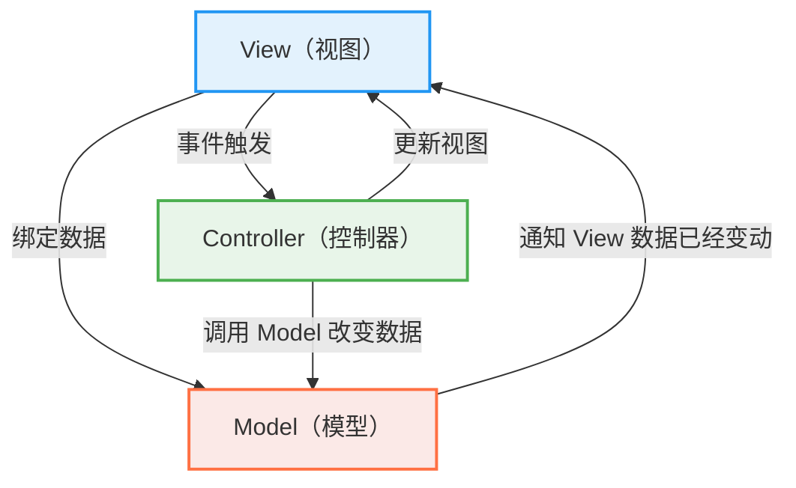
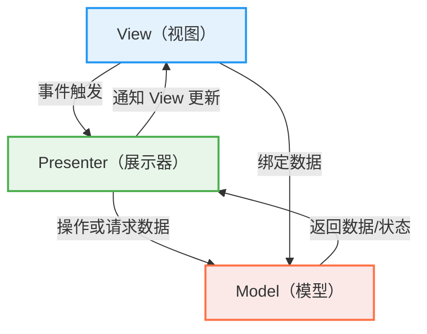
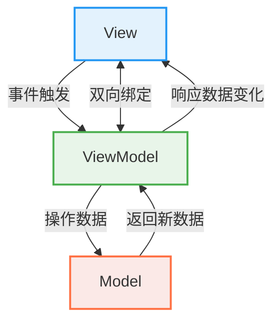

# 核心概念✅

## Vue2 与 Vue3 的主要区别是什么？

<Answer>

功能|Vue2|Vue3|
---|---|---|
响应式|采用访问器模式，使用 Object.defineProperty 监听数据变化，不支持深度监听|采用 Proxy 监听数据变化，性能更好，支持深度监听|
组件|不支持多根节点组件|支持多个根节点|
开发体验|部分支持 composition API|使用 TypeScript 重写,ts支持更好|
性能尺寸优化|-|通过静态标记、TreeShaking 等优化提升了性能，性能提升，体积减小|
维护|停止维护，版本最新为 2.7|持续更新中|
兼容性|兼容性更好|采用 ES7 语法，需要浏览器原生支持 ES7, 清单详见 [can i use](https://caniuse.com/?search=es2016) |

**延伸阅读**

* [Vue2 Vue3 差别](https://vuejs.org/about/faq#what-s-the-difference-between-vue-2-and-vue-3) 官方对此问题的回答
* [Vue3 migration](https://v3-migration.vuejs.org/) vue 3 迁移指南， 详细讲解了 Vue2 和 Vue3 的区别
* [Vue3.0](https://blog.vuejs.org/posts/vue-3-one-piece) vue3 发布的说明，罗列核心改动
</Answer>

## MVC、MVP、MVVM 是什么意思， Vue 属于哪种？ {#p0-mvvm}

<Answer>

MVC、MVP、MVVM 是三种常见的 UI 架构模式

| 模式 | 定义 | 特点 | 典型框架 |
|------|------|------|---------|
| MVC（Model-View-Controller） | 将应用分为模型、视图和控制器三个部分 | View 负责展示 UI，可直接与 Controller 通信；Controller 接收用户输入并操作 Model 与 View；Model 管理数据和业务逻辑 | ASP.NET MVC, Rails |
| MVP（Model-View-Presenter） | 与 MVC 类似，但使用 Presenter 管理逻辑，View 更加被动 | View 被动接受 Presenter 的更新；Presenter 处理逻辑，更新 View，View 不处理业务逻辑；Model 管理数据和业务逻辑 | Android 开发初期架构 |
| MVVM（Model-View-ViewModel） | 使用双向绑定将 View 与 ViewModel 同步 | View 自动绑定 ViewModel 的数据变化；ViewModel 处理业务逻辑，并通过数据绑定更新 View；Model 管理数据和业务逻辑 | Vue.js、Knockout、Angular |

示例如图

<Tabs>

<TabItem value="MVC">



</TabItem>

<TabItem value="MVP">



</TabItem>

<TabItem value="MVVM">



</TabItem>

</Tabs>

Vue 更偏向于 MVVM 模式，Vue 响应式机制实现了 View 和 ViewModel 的双向绑定。Vue 的核心概念是响应式数据绑定，允许开发者在数据变化时自动更新视图。

* `vm.$el` 绑定的 DOM 元素为 View
* `vm` 组件实例为 ViewModel，通过 `vm.methods` 操作数据
* `data、computed` 为 Model

**延伸阅读**

* [GUI Architectures](https://martinfowler.com/eaaDev/uiArchs.html) Martin Fowler 对 GUI 架构的介绍
* [Vue MVVM](https://012.vuejs.org/guide/#ViewModel) 早期 Vue 模式说明

</Answer>

## 什么是响应式？ {#p0-reactive}

<Answer>

响应式是指数据发生变化的时候自动执行操作的能力，例如数据变化是自动更新 DOM, 触发请求等。在 Vue 的上下文，
通过响应式 API 自动绑定组件的状态和组件更新的逻辑，同时提供了 `wacth, computed` 等手段来手动绑定监听，实现状态变化时自动视图操作和相关副作用的能力。
响应式 API 内部在 Vue2 通过访问器属性 `get,set` 来实现数据的响应式，而 Vue3 则通过 `Proxy` 来实现数据的响应式。

**参考资料**

* [响应式系统](https://cn.vuejs.org/guide/extras/reactivity-in-depth.html) 官方文档对响应式系统说明

</Answer>

## 什么是组件？{#p0-vue-component}

<Answer>

参考 [Vue 官方定义](https://cn.vuejs.org/glossary/#component)。
组件是 Vue 及其他 UI 框架的核心概念之一，用来描述一个 UI 片段，比如按钮、表单等。组件支持复用、组合和嵌套。
Vue 的组件本质是一个对象，对象的属性一般称为选项（options），选项定义了这个组件的结构、样式、状态、方法、事件等行为，通常在 Vue 框架下采用 `.vue` [单文件（single file component SFC）](https://cn.vuejs.org/glossary/#single-file-component) 方式编写组件（本质上单文件最终会经过构建转换为对象描述）。

**组件的编写风格** Vue 存在两种典型的组件编写风格

1. [选项式 API](https://cn.vuejs.org/glossary/#options-api)（Options API）：通过返回一个包括 template、data、methods、computed、watch 等属性组成的对象来定义组件。

   :::tip
   注意虽然你也可以定义 setup 配置，但是该配置一般用在组合式 API ，在单文件中采用 `<script setup>` 方式来定义组件。之所以选项式 API 中也支持定义 setup 是为了兼容 Vue 2.x 的写法。
   :::

2. [组合式 API](https://cn.vuejs.org/glossary/#composition-api)（Composition API）在单文件中采用 `<script setup>` 或使用 `setup` 选项定义组件，通过类似函数式的方式组织组件功能。

**示例说明**

<Tabs
>
<TabItem value="选项式 API" default>

import optionsVue from '!!raw-loader!./answers/component/options.vue';

<Sandpack
  template="vue"
  options={{
     editorHeight: 400
  }}
  files={{
    "/src/App.vue": optionsVue,
  }}
/>

</TabItem>

<TabItem value="组合式 API">

import compositionVue from '!!raw-loader!./answers/component/composition.vue';

<Sandpack
  template="vue"
  options={{
     editorHeight: 400
  }}
  files={{
    "/src/App.vue": compositionVue,
  }}
/>

</TabItem>
</Tabs>

**延伸阅读**

* [vue 组件](https://cn.vuejs.org/guide/essentials/component-basics) 官方文档说明组件

</Answer>

## 什么是虚拟 DOM (virtual DOM)和组件(Component)的关系是什么 ? {#p0-vdom}

<Answer>

虚拟 DOM 是一个对象用来描述组件的 DOM 结构，核心字段如下

```ts
interface VNode {
  type: string | function | object; // 组件类型
  props: Record<string, any>; // 组件属性
  children: VNode[] | string; // 子节点
  key: string | number; // 唯一标识
  ref: Ref; // 组件引用
}
```

组件是构建 UI 的基本单元，组件调用 render 方法会返回一个虚拟 DOM 对象，Vue 会根据这个虚拟 DOM 对象来渲染真实的 DOM。组件的生命周期钩子函数会在虚拟 DOM 渲染和更新时被调用。

</Answer>

## 组合式 API 是什么， 和选项式 API 的区别? {#p0-composition-api}

<Answer>

1. **什么是组合式 API？** 组合式 API 是 Vue 3 引入的一组新的 API，允许开发者通过函数的方式组织组件逻辑，而不是传统的选项式 API。它包括
   1. 响应式 API（如 `ref()` 和 `reactive()`）
   2. 生命周期钩子（如 `onMounted()`）
   3. 依赖注入（如 `provide()` 和 `inject()`） 等

   组合式 API 通常与 `<script setup>` 语法结合使用，提供更灵活的代码组织方式。详细参考 [组合式 API](https://cn.vuejs.org/api/#%E7%BB%84%E5%90%88%E5%BC%8F-api)

2. **为什么需要组合式 API？**
   * **更好的逻辑复用**：通过组合式 API，可以将组件逻辑封装为可复用的函数（Composable），解决了选项式 API 中 mixins 的局限性。
   * **更灵活的代码组织**：选项式 API 强制将逻辑分散到不同的选项中，而组合式 API 允许将相关逻辑集中在一起，便于维护和提取。
   * **更好的类型推导**：组合式 API 使用普通的变量和函数，天然支持 TypeScript 的类型推导，避免了选项式 API 中复杂的类型定义问题。
   * **更小的生产包体积**：组合式 API 和 `<script setup>` 的代码更高效，编译后体积更小，性能更优。

3. **如何使用组合式 API？**

```html
<script setup>
import { ref, onMounted } from 'vue';

// 定义响应式状态
const count = ref(0);

// 定义方法
function increment() {
   count.value++;
}

// 使用生命周期钩子
onMounted(() => {
   console.log(`初始计数值为：${count.value}`);
});
</script>

<template>
   <button @click="increment">计数值：{{ count }}</button>
</template>
```

在这个示例中：

* 使用 `ref()` 定义响应式状态 `count`。
* 使用普通函数 `increment` 更新状态。
* 使用 `onMounted()` 钩子处理组件挂载后的逻辑。

组合式 API 提供了更灵活的方式来组织和复用代码，特别适合复杂组件和大型项目。

4. **组合式 API 和选项式 API 的区别**

| 特性 | 选项式 API | 组合式 API |
| --- | --- | --- |
| 语法 | 使用对象选项定义组件 | 使用函数和钩子定义组件 |
| 逻辑复用 | 使用 mixins 和 extends | 使用 Composable 函数 |
| 代码组织 | 逻辑分散在不同选项中 | 逻辑集中在函数中 |

> 结论组合式 API 提供了更灵活的代码组织和逻辑复用方式，适合复杂组件和大型项目。

**延伸阅读**

* [官方文档组合式 API 常见问答](https://cn.vuejs.org/guide/extras/composition-api-faq)
* [composition api rfc](https://github.com/vuejs/rfcs/blob/master/active-rfcs/0013-composition-api.md) vue 组合式 API 的提案

</Answer>

## 什么是指令？

<Answer>

Vue 模版中以 `v-` 开头的属性称为指令，常见的模版指令包括

* `v-if`：条件渲染
* `v-for`：列表渲染
* `v-show`：显示隐藏
* `v-model`：双向绑定
* `v-bind`：属性绑定

Vue 还支持自定义指令，使用 `Vue.directive` 定义指令。指令的钩子函数包括 `bind`、`inserted`、`update`、`componentUpdated` 和 `unbind`。

</Answer>
