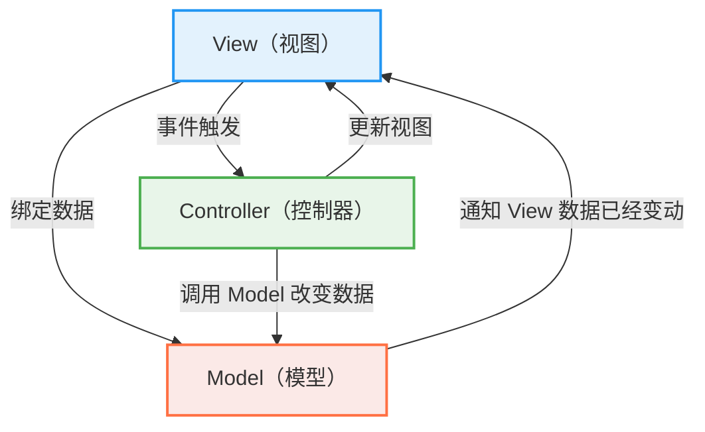
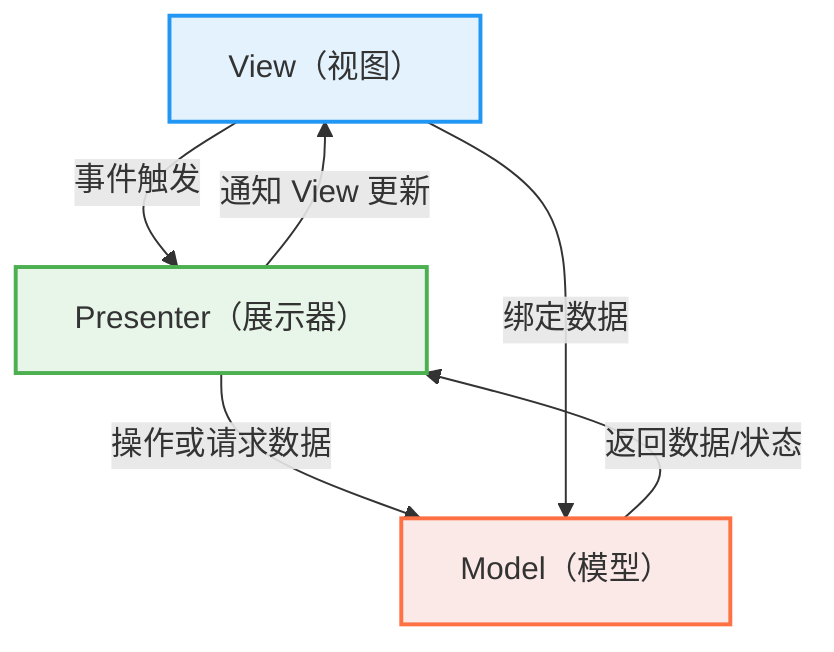
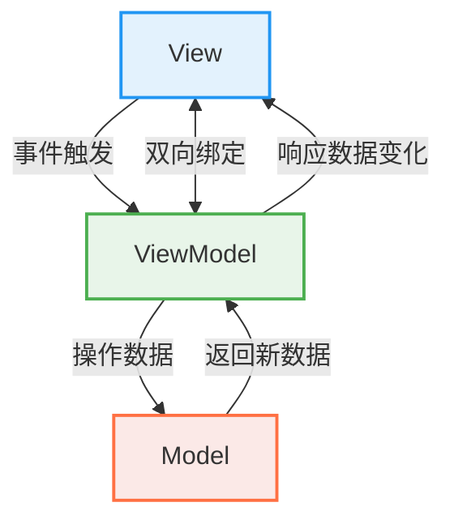

# 核心概念

## Vue2 与 Vue3 的主要区别是什么？

<Answer>

功能|Vue2|Vue3|
---|---|---|
响应式|采用访问器模式，使用 Object.defineProperty 监听数据变化，不支持深度监听|采用 Proxy 监听数据变化，性能更好，支持深度监听|
组件|不支持多根节点组件|支持多个根节点|
开发体验|部分支持 composition API|使用 TypeScript 重写,ts支持更好|
性能尺寸优化|-|通过静态标记、TreeShaking 等优化提升了性能，性能提升，体积减小|
维护|停止维护，版本最新为 2.7|持续更新中|
兼容性|兼容性更好|采用 ES7 语法，需要浏览器原生支持 ES7, 清单详见 [can i use](https://caniuse.com/?search=es2016) |

**延伸阅读**

* [Vue2 Vue3 差别](https://vuejs.org/about/faq#what-s-the-difference-between-vue-2-and-vue-3) 官方对此问题的回答
* [Vue3 migration](https://v3-migration.vuejs.org/) vue 3 迁移指南， 详细讲解了 Vue2 和 Vue3 的区别
* [Vue3.0](https://blog.vuejs.org/posts/vue-3-one-piece) vue3 发布的说明，罗列核心改动
</Answer>

## MVC、MVP、MVVM 是什么意思， Vue 属于哪种？ {#p0-mvvm}

<Answer>

MVC、MVP、MVVM 是三种常见的 UI 架构模式

| 模式 | 定义 | 特点 | 典型框架 |
|------|------|------|---------|
| MVC（Model-View-Controller） | 将应用分为模型、视图和控制器三个部分 | View 负责展示 UI，可直接与 Controller 通信；Controller 接收用户输入并操作 Model 与 View；Model 管理数据和业务逻辑 | ASP.NET MVC, Rails |
| MVP（Model-View-Presenter） | 与 MVC 类似，但使用 Presenter 管理逻辑，View 更加被动 | View 被动接受 Presenter 的更新；Presenter 处理逻辑，更新 View，View 不处理业务逻辑；Model 管理数据和业务逻辑 | Android 开发初期架构 |
| MVVM（Model-View-ViewModel） | 使用双向绑定将 View 与 ViewModel 同步 | View 自动绑定 ViewModel 的数据变化；ViewModel 处理业务逻辑，并通过数据绑定更新 View；Model 管理数据和业务逻辑 | Vue.js、Knockout、Angular |

示例如图

<Tabs>

<TabItem value="MVC">



</TabItem>

<TabItem value="MVP">



</TabItem>

<TabItem value="MVVM">



</TabItem>

</Tabs>

Vue 更偏向于 MVVM 模式，Vue 响应式机制实现了 View 和 ViewModel 的双向绑定。Vue 的核心概念是响应式数据绑定，允许开发者在数据变化时自动更新视图。

* `vm.$el` 绑定的 DOM 元素为 View
* `vm` 组件实例为 ViewModel，通过 `vm.methods` 操作数据
* `data、computed` 为 Model

**延伸阅读**

* [GUI Architectures](https://martinfowler.com/eaaDev/uiArchs.html) Martin Fowler 对 GUI 架构的介绍
* [Vue MVVM](https://012.vuejs.org/guide/#ViewModel) 早期 Vue 模式说明

</Answer>

## 什么是响应式？ {#p0-reactive}

## 什么是组件？{#p0-vue-component}

<Answer>

参考 [Vue 官方定义](https://cn.vuejs.org/glossary/#component)。
组件是 Vue 及其他 UI 框架的核心概念之一，用来描述一个 UI 片段，比如按钮、表单等。组件支持复用、组合和嵌套。
Vue 的组件本质是一个对象，对象的属性一般称为选项（options），选项定义了这个组件的结构、样式、状态、方法、事件等行为，通常在 Vue 框架下采用 `.vue` [单文件（single file component SFC）](https://cn.vuejs.org/glossary/#single-file-component) 方式编写组件（本质上单文件最终会经过构建转换为对象描述）。

**组件的编写风格** Vue 存在两种典型的组件编写风格

1. [选项式 API](https://cn.vuejs.org/glossary/#options-api)（Options API）：通过返回一个包括 template、data、methods、computed、watch 等属性组成的对象来定义组件。

   :::tip
   注意虽然你也可以定义 setup 配置，但是该配置一般用在组合式 API ，在单文件中采用 `<script setup>` 方式来定义组件。之所以选项式 API 中也支持定义 setup 是为了兼容 Vue 2.x 的写法。
   :::

2. [组合式 API](https://cn.vuejs.org/glossary/#composition-api)（Composition API）在单文件中采用 `<script setup>` 或使用 `setup` 选项定义组件，通过类似函数式的方式组织组件功能。

**示例说明**

<Tabs
>
<TabItem value="选项式 API" default>

import optionsVue from '!!raw-loader!./answers/component/options.vue';

<Sandpack
  template="vue"
  options={{
     editorHeight: 400
  }}
  files={{
    "/src/App.vue": optionsVue,
  }}
/>

</TabItem>

<TabItem value="组合式 API">

import compositionVue from '!!raw-loader!./answers/component/composition.vue';

<Sandpack
  template="vue"
  options={{
     editorHeight: 400
  }}
  files={{
    "/src/App.vue": compositionVue,
  }}
/>

</TabItem>
</Tabs>

</Answer>

## 什么是 virtual DOM 和组件的关系是什么 ? {#p0-vdom}

Vue 3 对虚拟 DOM 进行了多方面的优化，主要包括以下几点：

vue2.0就是使用的snabbdom
一个简单的使用实例：

```jsx
const snabbdom = require('snabbdom')
const patch = snabbdom.init([ // Init patch function with chosen modules
  require('snabbdom/modules/class').default, // makes it easy to toggle classes
  require('snabbdom/modules/props').default, // for setting properties on DOM elements
  require('snabbdom/modules/style').default, // handles styling on elements with support for animations
  require('snabbdom/modules/eventlisteners').default // attaches event listeners
])
const h = require('snabbdom/h').default // helper function for creating vnodes

const container = document.getElementById('container')

const vnode = h('div#container.two.classes', { on: { click: someFn } }, [
  h('span', { style: { fontWeight: 'bold' } }, 'This is bold'),
  ' and this is just normal text',
  h('a', { props: { href: '/foo' } }, 'I\'ll take you places!')
])
// Patch into empty DOM element – this modifies the DOM as a side effect
patch(container, vnode)

const newVnode = h('div#container.two.classes', { on: { click: anotherEventHandler } }, [
  h('span', { style: { fontWeight: 'normal', fontStyle: 'italic' } }, 'This is now italic type'),
  ' and this is still just normal text',
  h('a', { props: { href: '/bar' } }, 'I\'ll take you places!')
])
// Second `patch` invocation
patch(vnode, newVnode) // Snabbdom efficiently updates the old view to the new state
```

 snabbdom 核心api

* snabbdom.init:
 The core exposes only one single function snabbdom.init. This init takes a list of modules and returns a patch function that uses the specified set of modules.

```js
const patch = snabbdom.init([
  require('snabbdom/modules/class').default,
  require('snabbdom/modules/style').default
])
```

* patch:

```js
patch(oldVnode, newVnode)
```

* snabbdom/h:
 It is recommended that you use snabbdom/h to create vnodes. h accepts a tag/selector as a string, an optional data object and an optional string or array of children.

```js
const h = require('snabbdom/h').default
const vnode = h('div', { style: { color: '#000' } }, [
  h('h1', 'Headline'),
  h('p', 'A paragraph')
])
```

* snabbdom/tovnode:
 Converts a DOM node into a virtual node. Especially good for patching over an pre-existing, server-side generated content.

```js
const snabbdom = require('snabbdom')
const patch = snabbdom.init([ // Init patch function with chosen modules
  require('snabbdom/modules/class').default, // makes it easy to toggle classes
  require('snabbdom/modules/props').default, // for setting properties on DOM elements
  require('snabbdom/modules/style').default, // handles styling on elements with support for animations
  require('snabbdom/modules/eventlisteners').default // attaches event listeners
])
const h = require('snabbdom/h').default // helper function for creating vnodes
const toVNode = require('snabbdom/tovnode').default

const newVNode = h('div', { style: { color: '#000' } }, [
  h('h1', 'Headline'),
  h('p', 'A paragraph')
])

patch(toVNode(document.querySelector('.container')), newVNode)
```

 h函数 和 patch 的使用

例如下面的一个dom 结构：

```html
<ul id="list">
 <li class="item">item1</li>
 <li class="item">item2</li>
</ul>
```

用h函数来表示，就如下形式：

```js
const vnode = h('ul#list', {}, [
  h('li.item', {}, 'item1'),
  h('li.item', {}, 'item2')
])
```

作用就是模拟的一个真实节点。

patch的使用方式：
第一种方式 patch('容器', vnode); // 这种使用方式是直接渲染dom
第二种是用方式: patch(oldVnode, newVnode); // 这种方式会自动对比dom的差异性，然后只渲染我们需要dom;

一个简单的使用实例：

```html
<!DOCTYPE html>
<html lang="en">
<head>
 <meta charset="UTF-8">
 <title>snabbdom</title>
 <script src="https://cdn.bootcss.com/snabbdom/0.7.1/snabbdom.js"></script>
 <script src="https://cdn.bootcss.com/snabbdom/0.7.1/snabbdom-class.js"></script>
 <script src="https://cdn.bootcss.com/snabbdom/0.7.1/snabbdom-props.js"></script>
 <script src="https://cdn.bootcss.com/snabbdom/0.7.1/snabbdom-style.js"></script>
 <script src="https://cdn.bootcss.com/snabbdom/0.7.1/snabbdom-eventlisteners.js"></script>
 <script src="https://cdn.bootcss.com/snabbdom/0.7.1/h.js"></script>
</head>
<body>
<div id="container"></div><br>

<button id="btn-change">change</button>


<script>
 let snabbdom = window.snabbdom;
 let container = document.getElementById('container');
 let buttonChange = document.getElementById('btn-change');

 // 定义patch
 let patch = snabbdom.init([
 snabbdom_class,
 snabbdom_props,
 snabbdom_style,
 snabbdom_eventlisteners
 ]);

 // 定义h
 let h = snabbdom.h;

 // 生成vnode
 let vnode = h('ul#list', {}, [
 h('li.item', {}, 'item1'),
 h('li.item', {}, 'item2')
 ]);
 patch(container, vnode);

 // 模拟一个修改的情况
 buttonChange.addEventListener('click', function () {
 let newVnode = h('ul#list', {}, [
 h('li.item', {}, 'item1'),
 h('li.item', {}, 'item B'),
 h('li.item', {}, 'item 3')
 ]);
 patch(vnode, newVnode);
 })
</script>
</body>
</html>
```

 snabbdom 的使用实例

```html
<body>
<div id="container"></div>
<br>
<button id="btn-change">change</button>
<script>
 let snabbdom = window.snabbdom;
 let container = document.getElementById('container');
 let buttonChange = document.getElementById('btn-change');

 // 定义patch
 let patch = snabbdom.init([
 snabbdom_class,
 snabbdom_props,
 snabbdom_style,
 snabbdom_eventlisteners
 ]);

 // 定义h
 let h = snabbdom.h;
 let data = [
 {
 name: 'yanle',
 age: '20',
 address: '重庆'
 },
 {
 name: 'yanle2',
 age: '25',
 address: '成都'
 },
 {
 name: 'yanle3',
 age: '27',
 address: '深圳'
 }
 ];

 data.unshift({
 name: '姓名',
 age: '年龄',
 address: '地址'
 });

 let vnode;
 function render(data) {
 let newVnode = h('table', {style: {'font-size': '16px'}}, data.map(function (item) {
 let tds = [];
 let i ;
 for (i in item) {
 if(item.hasOwnProperty(i)) {
 tds.push(h('td', {}, h('a', {props: {href: '/foo'}}, item[i])))
 }
 }
 return h('tr', {}, tds)
 }));

 if(vnode) {
 patch(vnode, newVnode);
 } else {
 patch(container, newVnode);
 }

 vnode = newVnode;
 }

 // 初次渲染
 render(data);
 buttonChange.addEventListener('click', function () {
 data[1].age=30;
 data[1].address = '非洲';
 render(data);
 });
</script>
</body>
```

iff算法

 概念

就是找出两个文件的不同

diff 算法是非常复杂的，实现难度非常大， 源码两非常大。 所以需要去繁就简，明白流程，不关心细节。
在vdom中，需要找出本次dom 必须更新的节点来更新，其他的不用更新。找出这个过程就是diff算法实现的。找出前后两个虚拟dom的差异。

 diff实现的过程

这里以snabbdom为例子：
patch(container, vnode); patch(vnode, newVnode); 这两个方法里面就使用到了diff算法。 用patch方法来解析diff算法流程核心。

**patch(container, vnode)**


如果上面的数据， 我们怎么构建真正的dom 结构：

```js
const createElement = function (vnode) {
  const tag = vnode.tag
  const attrs = vnode.attrs || {}
  const children = vnode.children || {}

  if (!tag) return null

  // 创建元素
  const elem = document.createElement(tag)

  // 属性
  let attrName
  for (attrName in attrs) {
    // eslint-disable-next-line
    if (attrs.hasOwnProperty(attrName)) {
      elem.setAttribute(attrName, attrs[attrName])
    }
  }

  // 子元素
  children.forEach(function (childVnode) {
    // 给 elem 添加元素
    elem.appendChild(createElement(childVnode))
  })

  return elem
}
```

**patch(vnode, newVnode)**


伪代码实现如下

```js
const createElement = function (vnode) {
  const tag = vnode.tag
  const attrs = vnode.attrs || {}
  const children = vnode.children || {}

  if (!tag) return null

  // 创建元素
  const elem = document.createElement(tag)

  // 属性
  let attrName
  for (attrName in attrs) {
    // eslint-disable-next-line
    if (attrs.hasOwnProperty(attrName)) {
      elem.setAttribute(attrName, attrs[attrName])
    }
  }

  // 子元素
  children.forEach(function (childVnode) {
    // 给 elem 添加元素
    elem.appendChild(createElement(childVnode))
  })

  return elem
}
```

 diff算法的其他内容

* 节点的新增和删除

* 节点重新排序
* 节点属性、样式、事件绑定
* 如果极致压榨性能

dom 概念

用JS模拟DOM结构。
DOM变化的对比，放在JS层来做。
提升重绘性能。

比如有abc 三个dom， 如果我们要删除b dom, 以前浏览器的做法是 全部删除abc dom ， 然后 在添加b dom 。这样做的成本会非常高。

JS模拟 dom

例如下面的一个dom 结构：

```html
<ul id="list">
 <li class="item">item1</li>
 <li class="item">item2</li>
</ul>
```

这样的dom 结构，可以模拟为下面的JS :

```js
const dom = {
  tag: 'ul',
  attrs: {
    id: 'list'
  },
  children: [
    {
      tag: 'li',
      attrs: { className: 'item' },
      children: ['item1']
    },
    {
      tag: 'li',
      attrs: { className: 'item' },
      children: ['item2']
    }
  ]
}
```

浏览器操作dom 是花销非常大的。执行JS花销要小非常多，所以这就是为什么虚拟dom 出现的一个根本原因。

query实现virtual-dom

 一个需求场景

1、数据生成表格。 2、随便修改一个信息，表格也会跟着修改。

```html
<body>
<div id="container"></div>
<br>
<button id="btn-change">change</button>
<script>
 let data = [
 {
 name: 'yanle',
 age: '20',
 address: '重庆'
 },
 {
 name: 'yanle2',
 age: '25',
 address: '成都'
 },
 {
 name: 'yanle3',
 age: '27',
 address: '深圳'
 }
 ];

 // 渲染函数
 function render(data) {
 let $container = document.getElementById('container');
 $container.innerHTML = '';

 let $table = document.createElement('table');
 $table.setAttribute('border', true);
 $table.insertAdjacentHTML('beforeEnd', `<tr>
 <td>name</td>
 <td>age</td>
 <td>address</td>
 </tr>`);

 data.forEach(function (item) {
 $table.insertAdjacentHTML('beforeEnd',
 `<tr>
 <td>${item.name}</td>
 <td>${item.age}</td>
 <td>${item.address}</td>
 </tr>`
 )
 });

 $container.appendChild($table);
 }

 // 修改信息
 let button = document.getElementById('btn-change');
 button.addEventListener('click', function () {
 data[1].name = '徐老毕';
 data[1].age = 30;
 data[1].address = '深圳';
 render(data);
 });
 render(data);
</script>
</body>
```

实际上上面的这段代码也是不符合预期的，因为每次使用render 方法，都会全部渲染整个table, 但是并未没有只渲染我们想要的第二行。

**遇到的问题**：
DOM 操作是非常 "昂贵" 的， JS 运行效率高。虚拟dom 的核心就是diff算法，对比出不同的dom数据，定点渲染不同的数据。

## 组合式 API 是什么， 和选项式 API 的区别? {#p0-composition-api}

<Answer>

1. **什么是组合式 API？** 组合式 API 是 Vue 3 引入的一组新的 API，允许开发者通过函数的方式组织组件逻辑，而不是传统的选项式 API。它包括
   1. 响应式 API（如 `ref()` 和 `reactive()`）
   2. 生命周期钩子（如 `onMounted()`）
   3. 依赖注入（如 `provide()` 和 `inject()`） 等

   组合式 API 通常与 `<script setup>` 语法结合使用，提供更灵活的代码组织方式。详细参考 [组合式 API](https://cn.vuejs.org/api/#%E7%BB%84%E5%90%88%E5%BC%8F-api)

2. **为什么需要组合式 API？**
   * **更好的逻辑复用**：通过组合式 API，可以将组件逻辑封装为可复用的函数（Composable），解决了选项式 API 中 mixins 的局限性。
   * **更灵活的代码组织**：选项式 API 强制将逻辑分散到不同的选项中，而组合式 API 允许将相关逻辑集中在一起，便于维护和提取。
   * **更好的类型推导**：组合式 API 使用普通的变量和函数，天然支持 TypeScript 的类型推导，避免了选项式 API 中复杂的类型定义问题。
   * **更小的生产包体积**：组合式 API 和 `<script setup>` 的代码更高效，编译后体积更小，性能更优。

3. **如何使用组合式 API？**

```html
<script setup>
import { ref, onMounted } from 'vue';

// 定义响应式状态
const count = ref(0);

// 定义方法
function increment() {
   count.value++;
}

// 使用生命周期钩子
onMounted(() => {
   console.log(`初始计数值为：${count.value}`);
});
</script>

<template>
   <button @click="increment">计数值：{{ count }}</button>
</template>
```

在这个示例中：

* 使用 `ref()` 定义响应式状态 `count`。
* 使用普通函数 `increment` 更新状态。
* 使用 `onMounted()` 钩子处理组件挂载后的逻辑。

组合式 API 提供了更灵活的方式来组织和复用代码，特别适合复杂组件和大型项目。

4. **组合式 API 和选项式 API 的区别**

| 特性 | 选项式 API | 组合式 API |
| --- | --- | --- |
| 语法 | 使用对象选项定义组件 | 使用函数和钩子定义组件 |
| 逻辑复用 | 使用 mixins 和 extends | 使用 Composable 函数 |
| 代码组织 | 逻辑分散在不同选项中 | 逻辑集中在函数中 |

> 结论组合式 API 提供了更灵活的代码组织和逻辑复用方式，适合复杂组件和大型项目。

**延伸阅读**

* [官方文档组合式 API 常见问答](https://cn.vuejs.org/guide/extras/composition-api-faq)
* [composition api rfc](https://github.com/vuejs/rfcs/blob/master/active-rfcs/0013-composition-api.md) vue 组合式 API 的提案

</Answer>

## 什么是指令？
