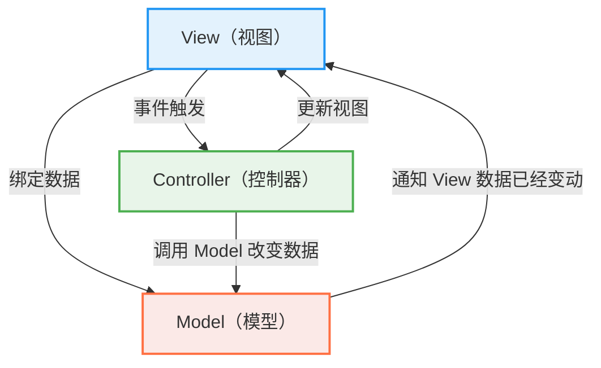
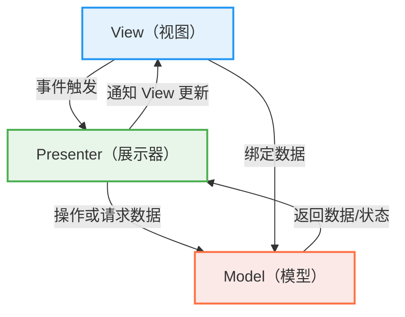
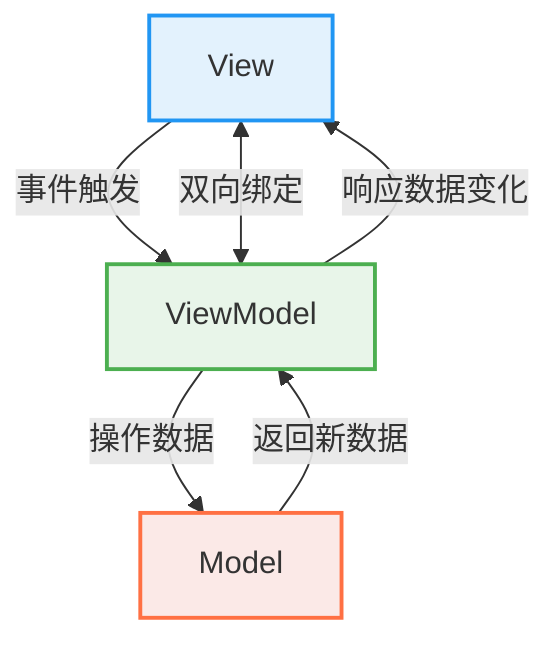

# 核心概念

## Vue2 与 Vue3 的主要区别是什么？

<Answer>

功能|Vue2|Vue3|
---|---|---|
响应式|采用访问器模式，使用 Object.defineProperty 监听数据变化，不支持深度监听|采用 Proxy 监听数据变化，性能更好，支持深度监听|
组件|不支持多根节点组件|支持多个根节点|
开发体验|部分支持 composition API|使用 TypeScript 重写,ts支持更好|
性能尺寸优化|-|通过静态标记、TreeShaking 等优化提升了性能，性能提升，体积减小|
维护|停止维护，版本最新为 2.7|持续更新中|
兼容性|兼容性更好|采用 ES7 语法，需要浏览器原生支持 ES7, 清单详见 [can i use](https://caniuse.com/?search=es2016) |

**延伸阅读**

* [Vue2 Vue3 差别](https://vuejs.org/about/faq#what-s-the-difference-between-vue-2-and-vue-3) 官方对此问题的回答
* [Vue3 migration](https://v3-migration.vuejs.org/) vue 3 迁移指南， 详细讲解了 Vue2 和 Vue3 的区别
* [Vue3.0](https://blog.vuejs.org/posts/vue-3-one-piece) vue3 发布的说明，罗列核心改动
</Answer>

## MVC、MVP、MVVM 是什么意思， Vue 属于哪种？ {#p0-mvvm}

<Answer>

MVC、MVP、MVVM 是三种常见的 UI 架构模式

| 模式 | 定义 | 特点 | 典型框架 |
|------|------|------|---------|
| MVC（Model-View-Controller） | 将应用分为模型、视图和控制器三个部分 | View 负责展示 UI，可直接与 Controller 通信；Controller 接收用户输入并操作 Model 与 View；Model 管理数据和业务逻辑 | ASP.NET MVC, Rails |
| MVP（Model-View-Presenter） | 与 MVC 类似，但使用 Presenter 管理逻辑，View 更加被动 | View 被动接受 Presenter 的更新；Presenter 处理逻辑，更新 View，View 不处理业务逻辑；Model 管理数据和业务逻辑 | Android 开发初期架构 |
| MVVM（Model-View-ViewModel） | 使用双向绑定将 View 与 ViewModel 同步 | View 自动绑定 ViewModel 的数据变化；ViewModel 处理业务逻辑，并通过数据绑定更新 View；Model 管理数据和业务逻辑 | Vue.js、Knockout、Angular |

示例如图

<Tabs>

<TabItem value="MVC">

</TabItem>

<TabItem value="MVP">

</TabItem>

<TabItem value="MVVM">

</TabItem>

</Tabs>

Vue 更偏向于 MVVM 模式，Vue 响应式机制实现了 View 和 ViewModel 的双向绑定。Vue 的核心概念是响应式数据绑定，允许开发者在数据变化时自动更新视图。

* `vm.$el` 绑定的 DOM 元素为 View
* `vm` 组件实例为 ViewModel，通过 `vm.methods` 操作数据
* `data、computed` 为 Model

**延伸阅读**

* [GUI Architectures](https://martinfowler.com/eaaDev/uiArchs.html) Martin Fowler 对 GUI 架构的介绍
* [Vue MVVM](https://012.vuejs.org/guide/#ViewModel) 早期 Vue 模式说明

</Answer>
