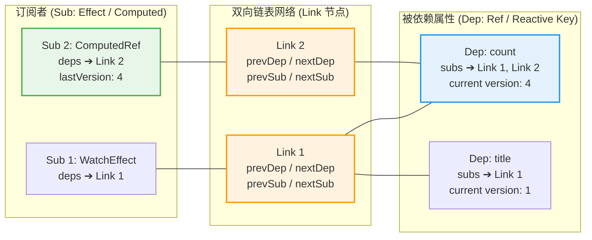
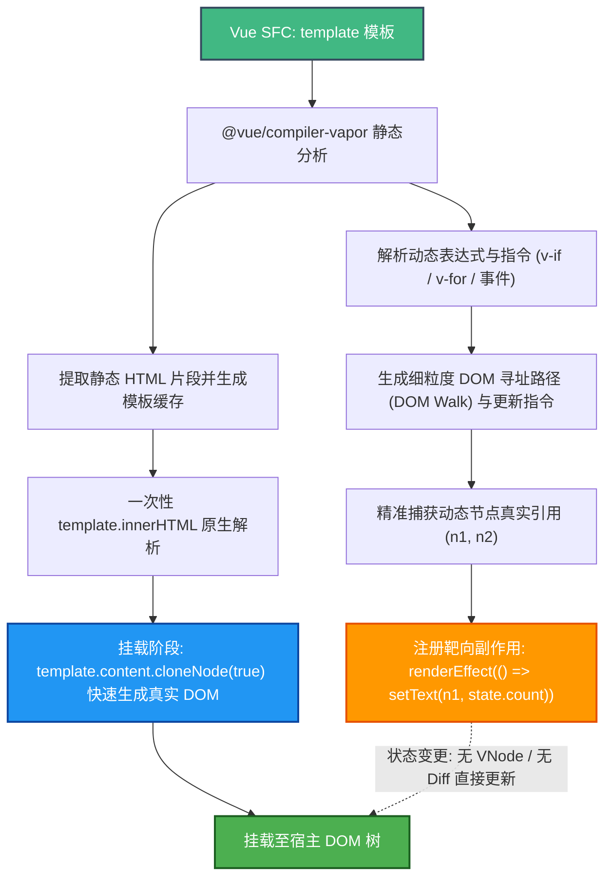

# 响应式✅

## Vue2 和 Vue3 响应式系统的区别和原理？ {#p0-vue2-vue3-reactivity}

<Answer>

| 对比项         | Vue2 响应式                          | Vue3 响应式                          |
|----------------|-------------------------------------|-------------------------------------|
| **实现原理**   | `Object.defineProperty`             | `Proxy`                            |
| **深度监听**   | 递归遍历对象，性能较低               | Proxy 默认支持深度监听，性能更优              |
| **动态属性**   | 需使用 `Vue.set` 手动添加            | 支持动态添加属性                   |
| **数组监听**   | 重写数组方法，无法监听索引和长度变化 | Proxy 默认支持索引和长度变化                 |
| **支持数据结构**| 仅支持对象和数组                   | 支持 Map、Set 等复杂数据结构        |
| **性能**       | 初始化时递归遍历，性能较低           | 无需递归，性能更优                 |
| **类型推导**   | 类型推导较弱                        | 更好的类型推导支持                 |
| **API**        | `data`, `computed`, `watch`         | `reactive`, `ref`, `watchEffect` 等 |

响应式系统核心逻辑包括

1. **依赖收集** 是通过首次执行渲染函数的时候，调用 [setupRenderEffect](https://github.com/vuejs/core/blob/56be3dd4db10d4d8d5e10eb53df795143182aaac/packages/runtime-core/src/renderer.ts#L1275) 完成的依赖收集，依赖收集的核心原理就是基于一个全局变量记录当前的副作用函数，在读取数据的时候，判断当前是否存在副作用函数然后进行存储
2. **副作用执行** 依赖收集完成后，再后续数据更新的时候，会基于收集的依赖触发副作用函数执行
3. **响应式优化** 同步多次改变一个值，会 batch 更新，触发一次更新函数, 核心逻辑在 [queueJob](https://github.com/vuejs/core/blob/56be3dd4db10d4d8d5e10eb53df795143182aaac/packages/runtime-core/src/scheduler.ts#L94)

一个简化版的响应式系统实现如下：

import reactivityIndex from '!!raw-loader!./answers/reactivity/reactivity.html'

<Sandpack
  template="static"
  options={{
   showConsole: true,
   editorHeight: 600
  }}
  files={{
      "/index.html": reactivityIndex,
  }}
/>

**延伸阅读**

* [深入响应系统](https://cn.vuejs.org/guide/extras/reactivity-in-depth.html) 详细说明响应式的相关原理和设计

</Answer>

## watch 和 computed 有什么区别吗 {#p0-data-computed}

<Answer>

本质上 watch 和 computed 都是用来绑定一个响应式数据的变化的执行函数。核心差异如下

| 特性   | watch   | computed |
|--------|---------|----------|
触发方式| 数据变化时触发，通过 `immediate` 在创建 watch 的时候触发 | 懒加载，只有数据变化，调用 `.value` 才会触发 computed 计算重新计算 |
| 触发时机 | 在 Vue 实际上 watch 后续状态变化默认是异步执行的，Vue 会 batch 多次的修改，然后通过 Promise.resolve().then 触发一次副作用函数 | 只有在数据变化时访问 .value 才会执行，且是同步触发 |

:::tip

如果直接调用 `@vue/reactivity` wactch 函数在状态变化后是同步触发的，这个控制是通过一个 `scheduler` 配置来控制的。在 Vue 中使用 `watch` 函数时，也可通过修改 `{ flush: 'sync' }` 来实现同步触发。详见 [回调触发时机](https://cn.vuejs.org/guide/essentials/watchers.html#callback-flush-timing)

:::

</Answer>

## ref 和 reactive 有何区别吗 {#p1-ref-reactive}

<Answer>

1. **数据类型**：`ref` 主要解决原始类型无法进行响应式包裹问题，也可以用于数组对象监听，`reactive` 用于非原始类型
2. **取值**：`ref` 返回一个对象，在所有非模版中操作需要通过 `.value` 访问，你也可以使用 `unref` 函数来解包, reactive 返回的是一个代理对象，可直接访问

</Answer>

## watch 和 watchEffect 使用有何区别 {#p0-watch-and-watcheffect}

<Answer>

功能|`wacth`|`watchEffect`|
|---|---|---|
依赖追踪| 需要手动指定依赖 | 自动追踪依赖变化，降低了手动追踪依赖的复杂度 |
触发时机| 依赖变化时触发，可以通过 `{immediate: true}` 在申明时自动触发，默认异步 | 立即执行一次，后续依赖变化时触发，默认异步执行 |
适用场景| 关注旧值的场景 | 只关注新值的场景 |

:::tip

watch 和 watchEffect 都支持如下配置

```ts
interface Option {
  flush?: 'pre' | 'post' | 'sync' // 触发时机 默认：'pre'
  onTrack?: (event: DebuggerEvent) => void // 侦听器 onTrack 在追踪依赖的时候执行，仅在开发模式下工作。
  onTrigger?: (event: DebuggerEvent) => void // 侦听器 onTrigger 在触发依赖的时候执行，仅在开发模式下工作。
}
```

watchEffect 还提供了 watchPostEffect 函数 对应 `flush: 'post'` 的配置, wachtSyncEffect 对应 `flush: 'sync'` 的配置

:::
**延伸阅读**

* [watch watchEffect 对比](https://cn.vuejs.org/guide/essentials/watchers.html#watch-vs-watcheffect) 官方文档说明 watch 和 watchEffect 的区别

</Answer>

## provide inject 的使用场景？ {#p1-provide-inject}

<Answer>

1. `provide` 和 `inject` 用于实现跨组件的状态共享。它允许祖先组件将数据“提供”给任意深度的后代组件，避免层层传递 `props`。
2. 在祖先组件中，通过 `provide(key, value)` 提供数据，在后代组件中通过 `inject(key)` 注入数据。 value 可以是任意数据，也可以传递响应式数据。
3. 注意事项
   1. provide 必须是同步调用，异步调用后续 `inject` 无法获取到数据
   2. key 可以采用 `Symbol` 类型，避免命名冲突
   3. 在 typescript 中，可以利用 `InjectionKey<T>` 定义注入 value 的类型

</Answer>

## 说下 effectScope ？ {#p2-effectscope}

<Answer>

1. effectScope 用来实现对副作用函数的批量管理，实现手动对副作用函数挂载和清除的控制。典型场景如下
   1. 在组件中使用 `effectScope` 来管理副作用函数，组件卸载时会自动清除 watch 等副作用函数，代码详见 [scope.stop](https://github.com/vuejs/core/blob/f556c925ac5a88f9c785cf856b856e8aea1c626d/packages/runtime-core/src/renderer.ts#L2301)
   2. 在组件外部通过 `effectScope` 批量管理副作用函数
2. effectScope 主要功能包括
   1. 采用 `const scope = effectScope()` 创建一个新的副作用域，通过 `scope.run(fn)` 执行副作用函数，`fn` 中可以使用 `watch, watchEffect, computed` 等函数监听响应式数据，调用 `scope.stop()` 停止副作用函数的执行，注意 `effectScope` 支持嵌套，停止时候默认嵌套的副作用绑定也会销毁，可以通过 `effectScope(false)` 来忽略对嵌套副作用域的管理
   2. `getCurrentScope()` 获取当前的副作用实例
   3. `onScopeDispose(fn)` 在副作用函数停止时执行的回调函数 `fn`

**参考示例**

import effectScopeAppVue from '!!raw-loader!./answers/effectScope/app.vue';
import SharedCounter from '!!raw-loader!./answers/effectScope/SharedCounter.vue';
import SharedState from '!!raw-loader!./answers/effectScope/SharedState.vue';
import useSharedState from '!!raw-loader!./answers/effectScope/useSharedState.js';

<Sandpack
  template="vue"
  options={{
     editorHeight: 600
  }}
  files={{
    "/src/App.vue": effectScopeAppVue,
   '/src/SharedCounter.vue' : SharedCounter,
   '/src/SharedState.vue' : SharedState,
   '/src/useSharedState.js' : useSharedState,
  }}
/>

**延伸阅读**

* [effectScope](https://github.com/vuejs/rfcs/blob/master/active-rfcs/0041-reactivity-effect-scope.md) 官方 RFCS 说明 effectScope 的设计初衷
* [effectScope](https://cn.vuejs.org/api/reactivity-advanced.html#effectscope) 官方 API 说明
* [effectScope issue](https://github.com/vuejs/rfcs/pull/212) 详细说明 effectScope 的设计初衷
* [effectScope code](https://github.com/vuejs/core/pull/2195) 详细说明 effectScope 的实现原理

</Answer>

## Vue 3.5 响应式系统重大重构（版本计数器与双向链表）、Reactive Props 解构与 Vapor Mode 无虚拟 DOM 编译原理？ {#p0-vue-3-5-reactivity-vapor}

<Answer>

**核心结论**

- **Vue 3.5 响应式引擎重构**：彻底弃用 Vue 3.0~3.4 沿用已久的 `WeakMap + Set`（每个 key 分配一个 `Set<ReactiveEffect>`）内存密集型依赖网格，改用**基于双向链表（Link 节点链接 Dep 与 Sub）**的数据拓扑，并引入**版本计数器（Version Counting）**。该重构使响应式内存占用降低约 56%，大型响应式数组遍历性能提升近 10 倍，并消除了深度计算属性的冗余重新计算。
- **Reactive Props 解构机制**：在 Vue 3.5 中正式成为稳定特性。通过 `@vue/compiler-sfc` 在编译期对 `<script setup>` 进行静态分析，将 `const { count = 0 } = defineProps<{ count: number }>()` 重写为对内部隐藏变量 `__props.count` 的动态访问，兼顾了原生 JavaScript 解构语法的心智自由与 Proxy Getter 响应式收集机制。
- **Vapor Mode 架构原理**：Vue 面向极端性能场景的前沿无虚拟 DOM（Virtual DOM-free）编译策略。受到 SolidJS 细粒度更新启发，直接将模板编译为原生 DOM 克隆节点与靶向更新指令（`renderEffect`），跳过 VNode 树构建、Diff 算法与 Patch 开销，并支持在单组件级别（`<script setup vapor>`）与现有 Vue 3 传统 VNode 组件进行无缝混合渲染（Hybrid Mode）。

---

**原理解析**

**一、Vue 3.5 响应式引擎重构（双向链表与版本计数）:**


**1. 旧版响应式（Vue 3.0 ~ 3.4）的设计缺陷**

旧版响应式核心采用三层嵌套哈希表：`targetMap: WeakMap<Target, Map<Key, Set<ReactiveEffect>>>`。
- **内存膨胀高**：应用中只要访问过一个响应式属性，运行时就必须为该属性实例化一个 `Set`。对于拥有成千上万行数据、数百个列的大型表格或数组，将实例化数以万计的 `Set` 对象，内存压力与 GC 停顿极为显著。
- **依赖清理（Cleanup）成本高昂**：当模板中存在分支逻辑（如 `condition ? a : b`）时，为防止已失效分支中的依赖长期滞留导致内存泄漏，每次副作用函数执行前，必须遍历旧的所有 `Dep`，将其中的当前 effect 从 `Set` 中 `delete`。执行后再次重新添加，频繁触发哈希表重排与扩容。

**2. Vue 3.5 双向链表（Sub - Link - Dep）拓扑设计**

Vue 3.5 借鉴了 Alien Signals 等前沿响应式设计，构建了交叉链表模型：
- **Dep（被观察者）**：每个响应式属性持有一个 `subs` 链表头指针，指向订阅它的所有 `Link` 节点。
- **Sub（观察者）**：每个副作用（如 `ReactiveEffect`、`ComputedRef`）持有一个 `deps` 链表头指针，指向它所依赖的所有 `Link` 节点。
- **Link（关系连接节点）**：作为两者的交汇点，包含四向指针：
  - `prevSub` / `nextSub`：维护同一个 Dep 下的所有订阅者链表；
  - `prevDep` / `nextDep`：维护同一个 Sub 下所依赖的所有 Dep 链表。
- **性能红利**：
  - **零 Set 额外分配**：Link 节点作为精简对象统一复用，不再依赖动态哈希集合，内存开销直接缩减约 56%。
  - **O(1) 标记与差量清理**：副作用执行时不再粗暴清空依赖，而是通过标志位（Bitwise Flags）比对 Link 节点。未变化的依赖保留不变，失效依赖直接在 O(1) 复杂度内调整前后指针解除关联。

**3. 版本计数器（Version Counting）机制**

为彻底解决多层嵌套计算属性（Computed）在被读取时的“级联脏检查”与无意义重算，Vue 3.5 引入版本计数：
- 每个 `Dep` 实例维护一个自增整数 `version`。每当属性值变更触发写入时，`version` 递增。
- 每个 `ComputedRef` 记录其计算完成时所有依赖 Dep 的版本快照 `lastVersion`。
- 当上层读取 `computed.value` 时，无需递归重新运行计算逻辑，只需线性遍历其依赖链表，比对各个 `Dep.version` 是否与上次快照一致：
  - 若所有 `Dep.version` 均无变化，代表底层数据完全未变，计算属性即刻返回旧缓存值；
  - 若检测到版本不一致，才标记当前计算属性为脏（Dirty）并真正触发重算。

---

**二、Reactive Props 解构机制（编译期语法糖与运行时保障）:**


**1. 为什么 Vue 3 早期严禁直接解构 Props？**

在 Vue 3 中，`props` 是一个通过 `shallowReactive` 包装的 Proxy 对象。其响应式收集依赖于对象属性的 **Getter 拦截**。
若直接使用 ES6 解构：
```ts
// 早期错误写法：解构瞬间脱离 Proxy 拦截，失去响应式！
const { count } = defineProps<{ count: number }>()
```
JavaScript 引擎会直接将当前时刻的值拷贝给独立的作用域局部变量 `count`，后续父组件更新传入新属性时，子组件内部无法触发任何 Getter，响应性彻底丢失。

**2. Vue 3.5 编译期 AST 重写方案**

Vue 3.5 将 Reactive Props Destructure 提升为默认稳定特性，通过 `@vue/compiler-sfc` 在编译期对代码进行精准 AST 转换：
- **作用域变量代理**：声明的 `const { count } = defineProps<{ count: number }>()` 会被编译为内部变量 `const __props = defineProps(...)`。
- **标识符重写**：在 `<script setup>` 作用域及模板内，所有对 `count` 的直接引用都会被自动重写为对 `__props.count` 的属性访问。
- **响应式默认值处理**：编译期会将解构中的默认值提取为内部条件判断，并在每次读取时惰性兜底，完全等价于官方的 `withDefaults` 宏，甚至支持使用响应式变量作为默认值。

```ts
// 开发者书写的源码
const { count = 0, message } = defineProps<{ count?: number; message: string }>()
console.log(count)

// 编译器转译后的代码形态
const __props = defineProps<{ count?: number; message: string }>()
console.log(__props.count ?? 0)
```

:::tip Props 解构后传参给 Composable 的陷阱
如果在 setup 顶层把解构出来的 `count` 作为普通标量传给外部 Composable（例如 `useCounter(count)`），函数调用传参依旧是一次性值传递！此时需使用 `toRef(props, 'count')` 或直接以函数形式 `() => count` 传递 Getter，以保证外部函数内能持续追踪变化。
:::

---

**三、Vapor Mode 架构原理（无虚拟 DOM 细粒度编译）:**


**1. 传统 Virtual DOM 的性能天花板**

虽然 Vue 3 的 Block Tree 与 PatchFlags 已经将 VNode Diff 缩小到仅对比动态节点，但在以下高负载场景下仍存在天花板：
- 每一次组件更新，仍然需要调用 Render 函数在内存中生成整棵或局部 VNode 树；
- 大批量短周期渲染会导致垃圾回收（GC Minor GC / Major GC）频繁卡顿；
- 虚拟节点对象的内存驻留成本不可忽视。

**2. Vapor Mode 编译管线与执行机制**

Vapor Mode 摆脱了 Virtual DOM，直接利用原生 DOM 与细粒度响应式更新：
1. **静态 HTML 模板提升与一次性克隆**：
   编译期将模板中所有的纯静态 DOM 节点整合成一个全局静态字符串，初始化时利用 `<template>` 元素的 `template.innerHTML` 一次性解析。挂载时直接调用原生的 `document.importNode` 或 `template.cloneNode(true)`，速度远超循环调用 `createElement`。
2. **DOM Walk 路径定位**：
   编译器根据静态模板结构，生成通过 `firstChild`、`nextSibling` 定位动态节点引用的精准路径，直接绑定到局部 DOM 变量上。
3. **靶向响应式副作用（renderEffect）**：
   针对动态插值、属性与事件，生成细粒度更新指令：
   ```js
   // 当 count.value 改变时，仅执行该单一原语，零 Diff
   renderEffect(() => setText(n1, count.value))
   ```

**3. Vapor Mode 与 SolidJS 的异同对比**


| 对比维度 | Vue Vapor Mode | SolidJS |
| :--- | :--- | :--- |
| **响应式底层** | 复用 Vue 3 的 Proxy / Ref / Reactive 体系，属性访问保持 `.value` | 基于函数闭包的 Signals，通过 `count()` 与 `setCount()` 读写 |
| **模板语法** | 沿用标准 Vue SFC `<template>` 语法及指令（v-if、v-for、v-model） | JSX / TSX 语法扩展 |
| **静态克隆优化** | 借助 SFC 编译优势，将大片静态结构做顶级 HTML 字符串内联克隆 | 同样采用 HTML Template 克隆技术 |
| **生态兼容** | 原生兼容 Pinia、Vue Router、`@vue/reactivity` 与大多数 Composable | 需使用 Solid 自身独立生态 |
| **学习心智** | Vue 开发者零心智负担，纯编译选项切换 | 需适应 JSX 与独特的 Signal 闭包心智模型 |

**4. 渐进式混合兼容（Hybrid Mode）**

Vapor Mode 不是一个与 Vue 3 割裂的新框架，而是组件级的编译策略：
- **按组件启用**：开发者只需在单文件组件上添加 `<script setup vapor>` 即可针对性能瓶颈组件单独开启；
- **双向互操作**：
  - Vapor 组件可以在常规 VNode 组件中作为子组件引入，运行时自动注入轻量级 VNode Wrapper 代理挂载；
  - 常规 VNode 组件也可以嵌入 Vapor 组件中，保持现有生态库（如大型 UI 组件库）无需重写即可复用。

---

**规范代码与架构拓扑**

**1. Vue 3.5 双向链表与版本计数拓扑图:**




**2. Vapor Mode 编译与执行管线:**




**3. Vapor Mode 编译产物形态示意:**


```ts
// 开发者书写的 Vapor SFC 源码
// <template><div><h1>计数器</h1><p>{{ count }}</p><button @click="inc">+1</button></div></template>

import { template, renderEffect, setText, on } from 'vue/vapor'

// 1. 全局单例：提取纯静态 HTML 模板，利用浏览器底层解析器一次性生成
const t0 = template('<div><h1>计数器</h1><p></p><button>+1</button></div>')

export function render(_ctx) {
  // 2. 挂载阶段：以近乎原生的速度克隆真实 DOM
  const root = t0()
  
  // 3. DOM 寻址：根据静态拓扑精准走访子节点，无需维护 VNode 树
  const pNode = root.firstChild.nextSibling
  const btnNode = pNode.nextSibling

  // 4. 靶向绑定：细粒度响应式更新
  renderEffect(() => {
    setText(pNode, _ctx.count)
  })

  // 5. 原生事件直连
  on(btnNode, 'click', _ctx.inc)

  return root
}
```

---

**面试官视角**

- **核心考察目的**：考察候选人是否持续跟进现代前端框架的最底层演进。考察重点包括对复杂数据结构（`Set` vs 双向链表）的性能意识、编译期宏转换原理、以及从 Virtual DOM 到细粒度无虚拟 DOM（No-VDOM）架构的技术洞察。
- **追问深度**：
  1. *双向链表为什么要引入 Link 节点，而不是让 Dep 直接包含 Sub？*
     - 回答要点：一个 Dep 可以被多个 Sub 订阅，一个 Sub 也可以依赖多个 Dep，这是一个典型的“多对多”网状拓扑。Link 节点作为两者的结合点，同时维护纵向（Sub）和横向（Dep）两个链表指针，从而在不使用 Set 的情况下，实现双向的 O(1) 增删与差量比对。
  2. *Computed 属性在引入版本计数后，是如何彻底杜绝冗余执行的？*
     - 回答要点：以往的 computed 脏检查可能需要递归唤醒整个计算链。版本计数将判断变成了纯标量（Integer）比对，只要依赖的 `Dep.version === recordedVersion`，就能在常数时间内确定无须重新求值。
  3. *Vapor Mode 相比传统 VNode 编译策略，是不是绝对更快？有没有劣势？*
     - 回答要点：在绝大多数局部高频更新、长列表以及内存敏感设备上，Vapor Mode 具备压倒性优势。但在极其庞大且具有频繁整树翻转重构（如完全动态的 CMS 动态渲染器）的场景下，大量细粒度闭包的创建可能需要更多的初始化代码，因此 Vue 官方提供 Hybrid 混合模式，兼顾两种策略的最佳收益。

---

**延伸阅读**

- [Vue Core PR #10397: Refactor reactivity system with doubly-linked lists and version counting](https://github.com/vuejs/core/pull/10397) - 详细记录 Vue 3.5 响应式重构技术细节
- [Vue RFC: Reactive Props Destructure](https://github.com/vuejs/rfcs/discussions/502) - 探讨响应式 Props 解构的语法提案与实现路径
- [Vue Vapor Mode GitHub Repository](https://github.com/vuejs/core-vapor) - 官方 Vapor Mode 编译器与运行时实现仓库
- [Alien Signals: Modern Signal Benchmarks](https://github.com/stackblitz/alien-signals) - 启发现代框架双向链表响应式的标杆微内核

</Answer>

