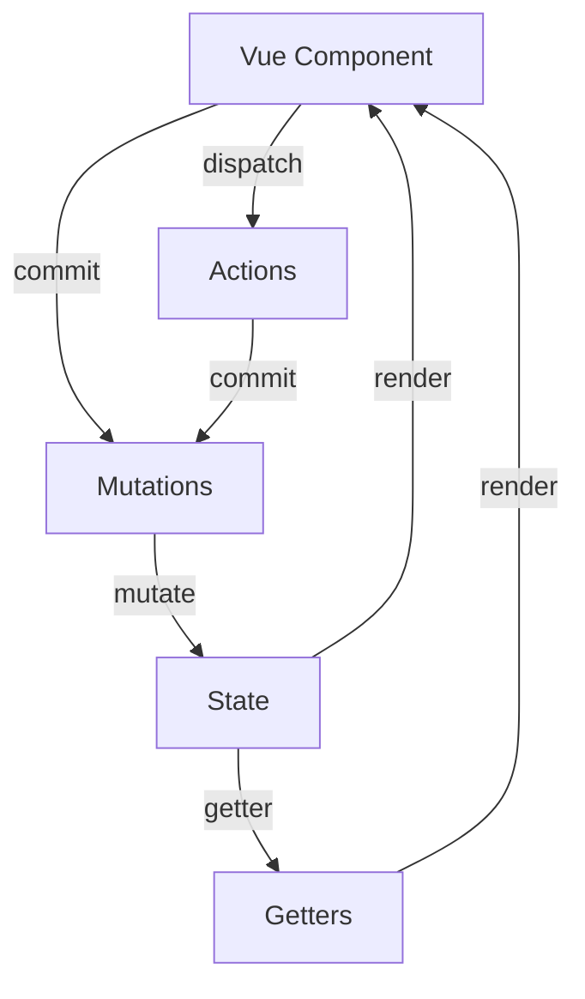

# 工具链✅

## 说一下日常使用 Vue 中涉及那些工具链？ {#p0-vue-toolchain}

<Answer>

按照项目流程常用工具如下

|项目流程|工具链|
|---|---|
脚手架|Vite 涉及 `@vitejs/plugin-vue` 、 Vue CLI 基于 webpack 涉及 `vue-loader` 。用来处理 Vue 单文件打包 |
IDE 支持| [Vue officail](https://marketplace.visualstudio.com/items?itemName=Vue.volar) 提供 IDE 类型等提示、Vue Devtools 调试工具|
代码规范| [eslint-plugin-vue](https://github.com/vuejs/eslint-plugin-vue) 提供 Vue 代码规范，`prettier` 提供代码格式化|
路由| Vue Router 提供路由功能|
状态管理| Pinia 或 Vuex  |
测试 | [vitest](https://vitest.dev/), jest,mocha 等|
UI 库| element-plus, ant-design-vue等, 详见  [Vue UI](https://ui-libs.vercel.app/)|
工具库| [vueuse](https://vueuse.org/)、[vue-i18n](https://kazupon.github.io/vue-i18n/) 等|
文档工具| [vitepress](https://vitepress.vuejs.org/)、[vuepress](https://vuepress.vuejs.org/zh/) 等|
demo、原型验证| [Vue SFC Playground](https://sfc.vuejs.org/) 提供在线验证 Vue 单文件组件的功能|

</Answer>

## 说一下用过 Vue Router 哪些功能 ？{#p0-vue-router}

<Answer>

功能    | 说明 |
|------|---|
基础使用| 通过 `` 注册路由，`RouterLink、RouterView` 设置路由跳转和路由视图。核心的路由配置为 routers 数组，配置每个路由的信息，支持嵌套， `{ path: '/', component: HomeView, children: [] }` history 配置路由模式 |
路由参数| 支持配置 `{ path: '/o/:orderId' }` 或 `{ path: '/user-:afterUser(.*)'}` 实现复杂的路由匹配，其中 `:` 表示动态参数，可以通过 `$route.params.orderId`或 `$route.params.afterUser` 的方式访问到
导航守卫| 支持全局和局部的路由守卫，`beforeEach、beforeResolve、afterEach` 等钩子函数，可以在路由跳转前后做一些处理，比如权限校验、数据预加载等|
路由原信息| 支持在路由配置中添加 `meta` 信息，比如 `meta: { title: '首页', requiresAuth: true }`，可以在路由守卫中进行判断|
路由插槽| 支持在路由视图中使用插槽，`<router-view name="header" />`，可以实现多个视图的嵌套|
动态路由| 支持动态路由的添加和删除，可以通过 `router.addRoute()` 和 `router.removeRoute()` 方法来实现|

<!-- TODO: 补充示例说明路由各功能 -->

</Answer>

## Vue Router histroy 和 hash 模式有什么区别？ {#p1-vue-router-history-hash}

<Answer>

在 Vue Router 3.x 对应 `mode` 配置，4.x 叫做 `history` 对应值如下。

| 3.x | 4.x | 含义 |
| --- | --- | --- |
| `history` | `createWebHistory()` | 采用 URL path 结合服务端配置实现路由 |
| `hash` | `createWebHashHistory()` | 采用 URL 规范中的 `hash` 字段作为路由 |
| `abstract` | `createMemoryHistory()` | 在内存中存储路由信息 |

</Answer>

## 路由守卫 {#p0-router-guide}

<Answer>

路由守卫是 Vue Router 提供的一种机制，用于在路由导航过程中对路由进行拦截和控制。通过使用路由守卫，我们可以在路由导航前、导航后、导航中断等不同的阶段执行相应的逻辑。

Vue Router 提供了三种类型的路由守卫：

1. 全局前置守卫（Global Before Guards）：在路由切换之前被调用，可以用于进行全局的权限校验或者路由跳转拦截等操作。

2. 路由独享守卫（Per-Route Guards）：在特定的路由配置中定义的守卫。这些守卫只会在当前路由匹配成功时被调用。

3. 组件内的守卫（In-Component Guards）：在组件实例内部定义的守卫。这些守卫可以在组件内部对路由的变化进行相应的处理。

* 全局前置守卫

```js
router.beforeEach((to, from, next) => {
  // to: 即将进入的目标
  // from:当前导航正要离开的路由
  return false // 返回false用于取消导航
  // return { name: 'Login' } // 返回到对应name的页面
  // next({ name: 'Login' }) // 进入到对应的页面
  // next() // 放行
})
```

* 全局解析守卫:类似beforeEach

```js
router.beforeResolve(to => {
  if (to.meta.canCopy) {
    return false // 也可取消导航
  }
})
```

* 全局后置钩子

```js
router.afterEach((to, from) => {
  logInfo(to.fullPath)
})
```

* 导航错误钩子，导航发生错误调用

```js
router.onError(error => {
  logError(error)
})
```

* 路由独享守卫,beforeEnter可以传入单个函数，也可传入多个函数。

```js
function dealParams (to) {
  // ...
}
function dealPermission (to) {
  // ...
}

const routes = [
  {
    path: '/home',
    component: Home,
    beforeEnter: (to, from) => {
      return false // 取消导航
    }
    // beforeEnter: [dealParams, dealPermission]
  }
]
```

组件内的守卫

```js
const Home = {
  template: '...',
  beforeRouteEnter (to, from) {
    // 此时组件实例还未被创建，不能获取this
  },
  beforeRouteUpdate (to, from) {
    // 当前路由改变，但是组件被复用的时候调用，此时组件已挂载好
  },
  beforeRouteLeave (to, from) {
    // 导航离开渲染组件的对应路由时调用
  }
}
```

</Answer>

## vuex 和 Pinia 有什么区别 {#p3-vuex-pinia}

<Answer>

Vuex 和 Pinia 都是用于 Vue 应用程序的状态管理库，它们有一些相似之处，但也存在一些差异。以下是它们的对比：

**一、相似之处**

1. **集中式状态管理**：

* 两者都提供了一种集中式的方式来管理应用程序的状态。这使得状态可以在不同的组件之间共享，并且可以更容易地跟踪和调试状态的变化。
* 例如，在一个电商应用中，用户的购物车状态可以存储在状态管理库中，以便在不同的页面和组件中访问和更新。

2. **响应式状态**：

* Vuex 和 Pinia 都与 Vue 的响应式系统集成，使得状态的变化可以自动触发相关组件的重新渲染。
* 当购物车中的商品数量发生变化时，相关的组件可以自动更新以反映这个变化。

**二、不同之处**

1. **语法和 API**：

* **Pinia**：

* Pinia 提供了一种更加简洁和直观的 API。它使用类似于 Vue 组件的语法来定义状态和操作，使得代码更加易读和易于维护。
* 例如，定义一个 store 可以像这样：

```js
import { defineStore } from 'pinia'

export const useCartStore = defineStore('cart', {
  state: () => ({
    items: []
  }),
  actions: {
    addItem (item) {
      this.items.push(item)
    }
  }
})
```

* **Vuex**：

* Vuex 的语法相对较为复杂，需要定义 mutations、actions 和 getters 等不同的概念来管理状态。
* 例如，定义一个 store 可能如下所示：

```js
import Vuex from 'vuex'

const store = new Vuex.Store({
  state: {
    items: []
  },
  mutations: {
    ADD_ITEM (state, item) {
      state.items.push(item)
    }
  },
  actions: {
    addItem ({ commit }, item) {
      commit('ADD_ITEM', item)
    }
  },
  getters: {
    cartItems: (state) => state.items
  }
})
```

2. **模块系统**：

* **Pinia**：

* Pinia 的模块系统更加灵活和易于使用。可以轻松地将 store 拆分为多个模块，并且可以在不同的模块之间共享状态和操作。
* 例如，可以创建一个名为`user`的模块和一个名为`cart`的模块，并在它们之间共享一些状态和操作：

```js
import { defineStore } from 'pinia'

const useUserStore = defineStore('user', {
// ...
})

const useCartStore = defineStore('cart', {
  state: () => ({
    // ...
  }),
  actions: {
    addItem (item) {
      // 可以访问 userStore 的状态
      if (useUserStore().isLoggedIn) {
        // ...
      }
    }
  }
})
```

* **Vuex**：
* Vuex 的模块系统也很强大，但相对来说更加复杂。需要使用命名空间来区分不同模块的 actions、mutations 和 getters，并且在模块之间共享状态和操作需要一些额外的配置。

3. **类型支持**：

* **Pinia**：

* Pinia 对 TypeScript 的支持非常好，可以轻松地为 store 定义类型，并且在开发过程中可以获得更好的类型提示和错误检查。
* 例如，可以使用 TypeScript 来定义一个 store 的类型：

```ts
import { defineStore } from 'pinia'

interface CartItem {
  id: number;
  name: string;
  price: number;
  }

export const useCartStore = defineStore('cart', {
  state: () => ({
    items: [] as CartItem[]
  })
// ...
})
```

* **Vuex**：
* Vuex 也支持 TypeScript，但相对来说需要一些额外的配置和类型定义文件来获得更好的类型支持。

4. **开发体验**：

* **Pinia**：
* Pinia 提供了一些开发工具，如 Pinia Devtools，可以方便地调试和检查 store 的状态和操作。它还与 Vue Devtools 集成，使得在开发过程中可以更好地跟踪状态的变化。
* Pinia 的 API 更加简洁，使得开发过程更加高效和愉快。
* **Vuex**：
* Vuex 也有一些开发工具，如 Vuex Devtools，但相对来说功能可能没有 Pinia Devtools 那么强大。
* Vuex 的语法相对较为复杂，可能需要一些时间来适应和掌握。

总的来说，Pinia 和 Vuex 都是强大的状态管理库，选择哪一个取决于你的具体需求和个人偏好。如果你喜欢简洁和直观的 API，并且对 TypeScript 有较好的支持需求，那么 Pinia 可能是一个更好的选择。如果你已经熟悉 Vuex 并且对其功能和模块系统有特定的需求，那么 Vuex 也是一个可靠的选择。

</Answer>

## vuex 原理 {#p2-vuex-principle}

<Answer>

Vuex 是 Vue.js 的官方状态管理库，其核心原理基于以下几个关键概念：

**核心原理**

1. **单向数据流**：数据只能从 Store 流向组件，组件不能直接修改 Store 中的数据
2. **集中式状态管理**：所有的状态都存储在一个单一的 Store 中
3. **响应式系统**：基于 Vue 的响应式系统实现状态变化的自动追踪

**核心概念**

| 概念 | 作用 | 特点 |
|------|------|------|
| **State** | 存储应用的状态数据 | 单一状态树，响应式 |
| **Getters** | 对 State 进行计算和过滤 | 类似计算属性，有缓存 |
| **Mutations** | 同步修改 State 的唯一方式 | 必须是同步函数 |
| **Actions** | 处理异步操作，提交 Mutations | 可以是异步函数 |
| **Modules** | 将 Store 分割成模块 | 解决单一状态树过大问题 |

**工作流程**



**响应式原理**

1. **状态注入**：Vuex Store 实例被注入到每个组件中
2. **响应式数据**：State 通过 Vue 的响应式系统变成响应式数据
3. **依赖收集**：组件访问 State 时会建立依赖关系
4. **更新通知**：State 变化时自动通知相关组件重新渲染

**实现机制**

```js
// 简化版 Vuex 实现原理
class Store {
  constructor (options) {
    // 使用 Vue 实例来实现响应式
    this._vm = new Vue({
      data: {
        $$state: options.state
      }
    })

    this._mutations = options.mutations || {}
    this._actions = options.actions || {}
    this._getters = options.getters || {}
  }

  get state () {
    return this._vm._data.$$state
  }

  commit (type, payload) {
    const mutation = this._mutations[type]
    if (mutation) {
      mutation(this.state, payload)
    }
  }

  dispatch (type, payload) {
    const action = this._actions[type]
    if (action) {
      return action(this, payload)
    }
  }
}
```

**延伸阅读**

* [Vuex 官方文档](https://vuex.vuejs.org/zh/) - 详细的 API 和使用指南
* [Vuex 源码解析](https://github.com/vuejs/vuex) - 深入理解 Vuex 实现原理

</Answer>

## 针对 Vue 做过哪些性能优化 {#p1-vue-performance}

<Answer>

Vue 性能优化可以从多个维度进行，以下是常见的优化策略：

**渲染性能优化**

| 优化策略 | 实现方式 | 适用场景 |
|----------|----------|----------|
| **组件懒加载** | `() => import('./Component.vue')` | 大型应用路由分割 |
| **v-show vs v-if** | 频繁切换用 v-show，条件少变用 v-if | 条件渲染优化 |
| **列表优化** | 合理使用 `key`，避免 `index` 作为 key | 大列表渲染 |
| **计算属性缓存** | 使用 `computed` 替代复杂的模板表达式 | 复杂计算逻辑 |
| **虚拟滚动** | 只渲染可视区域的列表项 | 超长列表 |

**组件优化**

```js
// 1. 函数式组件（Vue 2.x）
export default {
  functional: true,
  render (h, { props, children }) {
    return h('div', children)
  }
}

// 2. 组件拆分
// 避免单个组件过于庞大
const UserCard = { /* 用户卡片 */ }
const UserList = { /* 用户列表 */ }

// 3. 异步组件
const AsyncComponent = () => ({
  component: import('./Component.vue'),
  loading: LoadingComponent,
  error: ErrorComponent,
  delay: 200,
  timeout: 3000
})
```

**数据优化**

```js
// 1. 对象冻结（避免深度响应式）
// 2. 使用 shallowRef（Vue 3）
import { shallowRef } from 'vue'

export default {
  data () {
    return {
      // 大型只读数据
      staticData: Object.freeze(largeStaticData)
    }
  }
}
const largeData = shallowRef(bigObject)

// 3. 合理使用 watch
watch(
  () => user.profile.avatar,
  (newAvatar) => { /* 处理逻辑 */ },
  { immediate: true }
)
```

**内存优化**

```js
// 1. 及时清理定时器
export default {
  mounted() {
    this.timer = setInterval(() => {}, 1000)
  },
  beforeDestroy() { // Vue 2
    clearInterval(this.timer)
  },
  beforeUnmount() { // Vue 3
    clearInterval(this.timer)
  }
}

// 2. 移除事件监听器
export default {
  mounted() {
    window.addEventListener('resize', this.handleResize)
  },
  beforeDestroy() {
    window.removeEventListener('resize', this.handleResize)
  }
}

// 3. 使用 WeakMap 避免内存泄漏
const componentCache = new WeakMap()
```

**构建优化**

```js
// 1. 路由懒加载
// 2. 组件库按需引入
import { Button, Input } from 'element-plus'

// 3. Tree Shaking
// 避免 import * as utils from './utils'
import { formatDate } from './utils'

const Home = () => import('@/views/Home.vue')
const About = () => import('@/views/About.vue')
```

**缓存策略**

```js
// 1. Keep-alive 缓存组件
<keep-alive :include="['UserList', 'UserDetail']">
  <router-view />
</keep-alive>

// 2. 计算属性缓存
computed: {
  expensiveComputation() {
    return this.items.reduce((sum, item) => sum + item.price, 0)
  }
}

// 3. 接口缓存
const cache = new Map()
async function fetchUser(id) {
  if (cache.has(id)) {
    return cache.get(id)
  }
  const user = await api.getUser(id)
  cache.set(id, user)
  return user
}
```

**监控与调试**

```js
// 1. Vue DevTools 性能分析
// 2. Performance API
const start = performance.now()
// 执行操作
const end = performance.now()
console.log(`操作耗时: ${end - start}ms`)

// 3. 组件渲染追踪（Vue 3）
app.config.performance = true
```

**面试官视角**

这道题考察候选人对 Vue 性能优化的全面理解，包括：

* 是否了解常见的性能瓶颈
* 能否针对不同场景选择合适的优化策略
* 是否具备实际项目的性能优化经验

**延伸阅读**

* [Vue 性能优化指南](https://vuejs.org/guide/best-practices/performance.html) - Vue 官方性能优化建议
* [Vue 性能分析工具](https://devtools.vuejs.org/) - Vue DevTools 使用指南

</Answer>

## vue3 相比较于 vue2 在编译阶段有哪些改进 {#p0-vue-compiler}

<Answer>

Vue 3 在编译阶段相对于 Vue 2 进行了一些重要的改进，主要包括以下几个方面：

1. 静态模板提升（Static Template Hoisting）：Vue 3 引入了静态模板提升技术，通过对模板进行分析和优化，将模板编译为更简洁、更高效的渲染函数。这种优化可以减少不必要的运行时开销，并提高组件的渲染性能。

2. Fragments 片段支持：Vue 3 支持使用 Fragments 片段来包裹多个根级元素，而不需要额外的父元素。这样可以避免在编译阶段为每个组件生成额外的包裹元素，减少了虚拟 DOM 树的层级，提高了渲染性能。

3. 静态属性提升（Static Props Hoisting）：Vue 3 在编译阶段对静态属性进行了优化，将静态属性从渲染函数中提取出来，只在组件初始化时计算一次，并在后续的渲染中重用。这样可以减少不必要的属性计算和传递，提高了组件的渲染性能。

4. 事件处理函数的内联化：Vue 3 在编译阶段对事件处理函数进行了内联化，将事件处理函数直接写入模板中，而不是在运行时动态生成。这样可以减少运行时的事件绑定和查找开销，提高了事件处理的性能。

5. 静态节点提升（Static Node Hoisting）：Vue 3 通过静态节点提升技术，将静态的节点在编译阶段进行处理，避免了在每次渲染时对静态节点的比对和更新操作，提高了渲染性能。

6. 缓存事件处理器（Cached Event Handlers）：Vue 3 在编译阶段对事件处理器进行了缓存，避免了重复创建事件处理函数的开销。对于相同的事件处理器，只会创建一次，并在组件的生命周期中重复使用，减少了内存占用和运行时开销。

7. 更细粒度的组件分割（Fine-Grained Component Splitting）：Vue 3 支持更细粒度的组件分割，可以将组件的模板、脚本和样式进行独立的编译和加载，以实现更好的代码拆分和按需加载，提高了应用的加载速度和性能。

这些改进使得 Vue 3 在编译阶段能够生成更优化的代码，减少了不必要的运行时开销，并提高了组件的渲染性能和整体的运行效率。

**延伸阅读**

* [Vue 3 编译优化](https://vuejs.org/guide/extras/render-function.html) Vue 3 编译阶段的性能优化技术
* [Vue 3 Template Compilation](https://v3-migration.vuejs.org/breaking-changes/fragments.html) Vue 3 模板编译的变化

</Answer>
