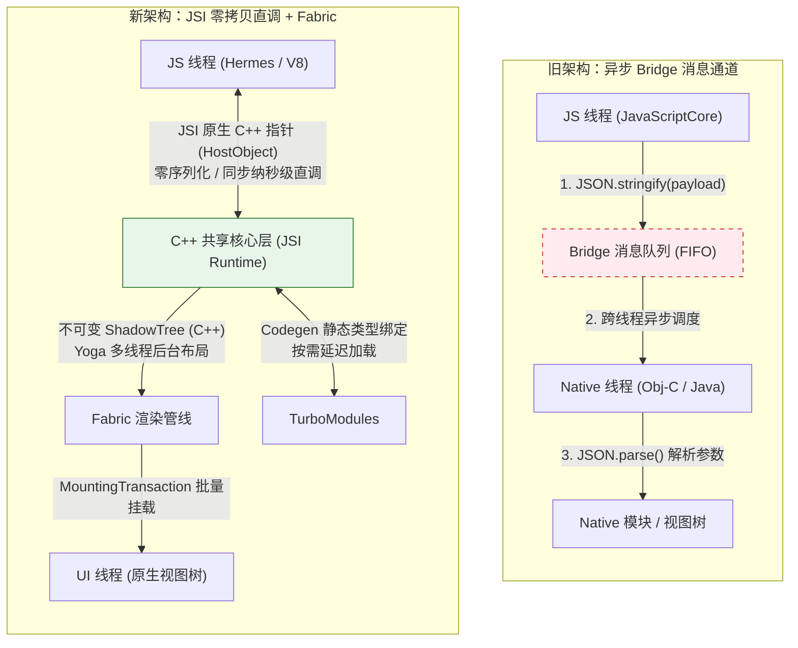

# 架构与运行机制 ✅

聚焦 RN 架构/运行时、通信与渲染、旧/新架构迁移与 Hermes。

## RN 的整体架构与渲染原理？ {#p0-arch-overview}

<Answer>

**核心概念:**

RN 采用 JS 线程(React/业务) + 原生 UI 线程(渲染/交互) 的双线程，
通过桥(旧架构)或 JSI(新架构)通信；React 的虚拟树映射为原生控件树。

**示例说明:**

```txt
JS: React 计算 → 生成更新 → 发送给原生
Native: 接收更新 → 渲染 UIView/View → 事件回传 JS
```

**面试官视角:**

* **要点清单**: 双线程模型；虚拟树 → 原生控件
* **加分项**: 知道旧/新通信差异
* **常见失误**: 认为 RN 直接编译成原生

**延伸阅读:**

* [Architecture Overview](https://reactnative.dev/docs/architecture-overview)

</Answer>

## JS ↔ 原生通信是如何实现的？ {#p0-bridge-comm}

<Answer>

**核心概念:**

旧架构通过异步序列化(Bridge)批量分发；新架构以 JSI 直接对象与函数，延迟更低、同步/异步更灵活。
内核采用 JavaScriptCore(Hermes 可选)。

1. **RN 向 JS 传递信息**

**示例说明:**

```txt
旧: batched JSON message → Bridge → Native
新: JSI function/object binding → direct call
```

**延伸阅读:**

* [New Architecture](https://reactnative.dev/docs/the-new-architecture/landing-page)
* [极客时间](https://time.geekbang.org/dailylesson/detail/100056867?tid=149&utm_campaign=geektime_search&utm_content=geektime_search&utm_medium=geektime_search&utm_source=geektime_search&utm_term=geektime_search)

</Answer>

## Fabric 渲染管线是什么？ {#p0-fabric}

<Answer>

**核心概念:**

Fabric 是新渲染系统，改进布局/测量/提交，支持并发更新与更稳定的 UI 性能，减少中间对象创建。

**示例说明:**

```txt
Shadow Tree → Layout → Mount → Commit （并发友好）
```

**面试官视角:**

* **要点清单**: 渲染阶段；并发/稳定性
* **加分项**: 真实落地与迁移经验
* **常见失误**: 认为 Fabric 自动解决重渲染

**延伸阅读:**

* 官方新架构资料

</Answer>

## TurboModule 与旧 NativeModule 的差异？ {#p0-turbomodule}

<Answer>

**核心概念:**

TurboModule 借助 Codegen 生成类型安全绑定，支持 JSI；更快的模块查找/调用；旧模块基于反射/字符串。

**示例说明:**

```ts
// 代码生成的类型声明(示意)
export interface DeviceSpec { getDeviceName(): Promise<string> }
```

**面试官视角:**

* **要点清单**: 类型安全；调用路径优化
* **加分项**: Codegen 流程与调试
* **常见失误**: 混用旧模块导致不兼容

**延伸阅读:**

* 新架构模块文档

</Answer>

## Hermes 引擎的价值与限制？ {#p1-hermes}

<Answer>

**核心概念:**

Hermes 面向 RN 的轻量 JS 引擎，支持字节码预编译、快启、低内存；需关注 Intl/Proxy 等差异与第三方兼容。

**示例说明:**

```txt
收益: 启动/内存；成本: 兼容/体积评估
```

**面试官视角:**

* **要点清单**: 启动与内存收益；不适用场景
* **加分项**: 线上切换评估；字节码缓存
* **常见失误**: 忽视 polyfill/Intl

**延伸阅读:**

* [Hermes](https://reactnative.dev/docs/hermes)

</Answer>

## UI 组件如何映射到原生控件？ {#p1-ui-mapping}

<Answer>

**核心概念:**

RN 组件(Text/View/Image/ScrollView 等)映射到 iOS 的 UIView 层级/Android 的 View/ViewGroup；平台样式与行为差异需适配。

**示例说明:**

```txt
<Text> → UILabel/TextView, <View> → UIView/ViewGroup
```

**面试官视角:**

* **要点清单**: 映射关系；差异适配
* **加分项**: 跨端组件库沉淀
* **常见失误**: 期望 1:1 Web 行为

**延伸阅读:**

* 组件文档

</Answer>

## 事件与手势从原生回传 JS 的过程？ {#p1-event-flow}

<Answer>

**核心概念:**

原生捕获手势/点击 → 通过 Bridge/JSI 回传 → JS 更新状态/触发动画；复杂手势建议原生驱动(Reanimated/GestureHandler)。

**示例说明:**

```txt
Native touch → dispatchEvent → JS handler → setState/animate
```

**面试官视角:**

* **要点清单**: 事件来源；回传与延迟
* **加分项**: 原生驱动动画；中断策略
* **常见失误**: JS 驱动长链路动画

**延伸阅读:**

* Reanimated/GestureHandler 文档

</Answer>

## 旧 → 新架构迁移路径与风险？ {#p1-migration}

<Answer>

**核心概念:**

升级 RN 版本并开启新架构开关，优先改造自研模块/关键三方库；逐步验证 Fabric/TurboModule 兼容性与性能。

**示例说明:**

```txt
步骤：评估 → 升级 → 开关 → 模块改造 → 回归/灰度
```

**面试官视角:**

* **要点清单**: 库兼容；灰度与回滚
* **加分项**: 指标对比报告
* **常见失误**: 一次性重构，缺乏回滚

**延伸阅读:**

* 迁移指南

</Answer>

## 常见通信与渲染瓶颈有哪些？ {#p2-bottlenecks}

<Answer>

**核心概念:**

频繁跨桥调用、大对象传输、深层次重渲染、图片解码与主线程阻塞；需合并更新/数据裁剪/原生驱动动画/懒加载。

**示例说明:**

```txt
排查：setState 次数/大小 → Bridge 调用数 → 图片 → JS CPU
```

**面试官视角:**

* **要点清单**: 定位维度；优化策略
* **加分项**: 持续监控与阈值告警
* **常见失误**: 只凭体验，无数据

**延伸阅读:**

* Performance 文档

</Answer>

## React Native 新架构为什么彻底废弃了 Bridge？JSI、Fabric 渲染器与 TurboModules 是如何实现 C++ 零序列化直调的？ {#p0-rn-new-architecture-jsi-fabric}

<Answer>

**核心结论:**

* **废弃 Bridge 的根本诱因**: 旧架构中 JavaScript 与原生（Objective-C/Java）只能通过全局单通道 Bridge 交换数据，底层完全依赖 JSON 字符串在后台队列的异步序列化与反序列化。在连续手势、快速滚屏、实时动画等高频场景下，会导致通道严重拥塞、掉帧、白屏及状态不同步。
* **JSI 统一原生指针直调**: JSI（JavaScript Interface）作为轻量级 C++ 抽象层，脱离了对特定 JS 引擎（JSC/Hermes/V8）的硬编码。JS 运行时可直接持有原生 C++ `HostObject` 指针，实现 JS 与 C++ 双方跨语言、同步、零拷贝（Zero-Copy）双向内存直调，从根源上消除了 JSON 序列化成本。
* **Fabric 线程安全并发渲染**: Fabric 渲染器完全用 C++ 重构了不可变阴影树（Immutable Shadow Tree），将 Yoga 布局计算完全沉降至 C++ 层。结合写时复制（Copy-on-Write）保证多线程并发读写的绝对安全，天然适配 React 18+ 的 Concurrent 并发更新机制。
* **TurboModules 懒加载与无桥模式（Bridgeless）**: TurboModules 依赖 Codegen 在编译期生成强类型 C++ 绑定，废弃了冷启动全量扫描注入，改为基于 JSI 代理在首次访问时按需延迟实例化。在 Bridgeless 模式下，旧 Bridge 被彻底物理移除，所有通信与模块调用 100% 走 JSI。

**原理解析:**

1. **旧 Bridge 架构的三大致命瓶颈**
   * **异步不可预测性（Asynchronous By Default）**: Bridge 消息在 Native 消息队列中异步调度，JS 无法同步获取原生布局尺寸（如 `measureInWindow`）或同步响应输入框输入状态，导致跳动闪烁。
   * **序列化与内存拷贝损耗（JSON Serialization Overhead）**: 哪怕传递一个简单的布尔值或数字对象，都要经历 `JS对象 -> JSON字符串 -> Native数据结构` 的编解码流程。在大数据量（如长列表渲染、相机帧处理）场景下，字符串解析对 CPU 与 GC 产生剧烈冲击。
   * **单通道队头阻塞（Head-of-Line Blocking）**: 所有 API 调用、渲染指令、原生事件全塞进单条 FIFO 消息通道。一个大计算量的原生耗时调用，会导致紧随其后的滑动手势事件被挂起，造成 UI 无响应。

2. **JSI 核心机制：HostObject 与共享内存指针**
   * JSI 为宿主环境（Host）提供了向 JavaScript 全局作用域注册 C++ 对象的标准协议。
   * 原生侧通过继承 `facebook::jsi::HostObject` 并覆写 `get()` / `set()` 方法，向 JS 暴露属性或函数。
   * 当 JavaScript 执行 `nativeObject.multiply(2, 3)` 时，JS 引擎借助 JSI 虚函数表（vtable）直接跳转到 C++ 对应的函数地址，参数通过栈传递，直接完成 CPU 指令级别的值读取与内存调用，耗时降至纳秒级。



3. **Fabric 渲染管线的不可变三阶段**
   * **Commit 阶段（JS 线程）**: React 协调算法触发更新，通过 JSI 在 C++ 核心层克隆现有节点生成新的不可变 ShadowNode，拼装出全新版本的不可变 ShadowTree。
   * **Layout 阶段（C++ / 独立后台线程）**: Yoga 布局引擎基于 Flexbox 规则在 C++ 层面完成尺寸与排版计算，计算出绝对坐标 `(x, y, w, h)`，无需主线程或 JS 线程插手。
   * **Mount 阶段（UI 主线程）**: 将新旧两棵不可变 ShadowTree 进行极速指针级 Diff，生成原子操作序列（`Create`、`Update`、`Delete`），通过 `MountingTransaction` 直接提交给平台主线程渲染原生平台视图。由于 ShadowTree 节点均采用只读不可变设计，并发读写天然线程安全。

4. **TurboModules 静态 Codegen 与按需懒加载**
   * 旧架构在应用启动时遍历所有 `@ReactMethod`，提前在主线程生成配置表，拉长冷启动时间。
   * TurboModules 引入 Codegen 工具，在编译阶段自动将 TypeScript/Flow Spec 转换为 C++ 纯虚类接口（JSI Glue Code）。
   * JS 运行时在全局挂载 `__turboModuleProxy`。直到业务代码真正调用 `TurboModuleRegistry.get('Storage')` 时，原生端才首次实例化该 C++ 对象并建立 JSI 绑定，实现毫秒级启动与极致的内存利用率。

**规范实现:**

展示生产级 TypeScript Spec 声明，以及对应的 C++ 原生 JSI HostObject 零序列化实现。

*1. TypeScript Codegen 规范接口定义 (`NativeMathSpec.ts`)*:

```ts
import type { TurboModule } from 'react-native';
import { TurboModuleRegistry } from 'react-native';

// 严格遵循 Codegen 命名规范：Spec 结尾，强类型入参与返回值
export interface Spec extends TurboModule {
  readonly addSync: (a: number, b: number) => number;
  readonly computeVectorMagnitude: (vector: { x: number; y: number; z: number }) => number;
  readonly getLargeBufferDirect: () => ArrayBuffer;
}

export default TurboModuleRegistry.getEnforcing<Spec>('NativeMath');
```

*2. C++ 原生端 JSI 零拷贝核心实现 (`NativeMathHostObject.cpp`)*:

```cpp
#include <jsi/jsi.h>
#include <memory>
#include <cmath>

namespace facebook::react {

class NativeMathHostObject : public jsi::HostObject {
public:
  // JSI 核心方法：JS 读取对象属性/方法时被直接回调
  jsi::Value get(jsi::Runtime& runtime, const jsi::PropNameID& name) override {
    auto propName = name.utf8(runtime);

    // 零序列化同步方法：直接在当前线程栈内完成数值计算
    if (propName == "addSync") {
      return jsi::Function::createFromHostFunction(
        runtime,
        name,
        2, // 形参个数
        [](jsi::Runtime& rt, const jsi::Value& thisVal, const jsi::Value* args, size_t count) -> jsi::Value {
          if (count < 2 || !args[0].isNumber() || !args[1].isNumber()) {
            throw jsi::JSError(rt, "Invalid arguments for addSync");
          }
          // 直接读取 C++ double，纳秒级返回，无 JSON 编解码
          double result = args[0].asNumber() + args[1].asNumber();
          return jsi::Value(result);
        }
      );
    }

    // 零拷贝大内存共享：直接暴露原生 ArrayBuffer 给 JS 堆
    if (propName == "getLargeBufferDirect") {
      return jsi::Function::createFromHostFunction(
        runtime,
        name,
        0,
        [](jsi::Runtime& rt, const jsi::Value& thisVal, const jsi::Value* args, size_t count) -> jsi::Value {
          constexpr size_t bufferSize = 1024 * 1024; // 1MB 缓冲区
          auto nativeBuffer = std::make_shared<std::vector<uint8_t>>(bufferSize, 0xAB);
          
          // 创建绑定原生内存指针的 MutableBuffer，零内存拷贝直达 JS
          jsi::ArrayBuffer arrayBuffer = rt.createArrayBuffer(
            std::make_shared<jsi::MutableBufferWrapper>(nativeBuffer->data(), nativeBuffer->size())
          );
          return jsi::Value(std::move(arrayBuffer));
        }
      );
    }

    return jsi::Value::undefined();
  }
};

} // namespace facebook::react
```

**面试官视角:**

* **要点清单（必答）**:
  1. Bridge 废弃根因：JSON 序列化 CPU/内存损耗、跨线程异步不可预测、单通道队头阻塞导致掉帧卡死。
  2. JSI 原理：脱离引擎绑定，基于 C++ HostObject 让 JS 引擎直持 C++ 内存指针，实现纳秒级同步直调。
  3. Fabric 架构：C++ 编写的不可变 Shadow Tree，Yoga 布局计算下沉至 C++ 层，线程安全的写时复制机制支持 React 18 Concurrent。
  4. TurboModules 改进：借助 Codegen 静态生成 C++ 类型绑定，按需懒加载取代冷启动全量反射。
* **加分项（高阶思考）**:
  1. 能够阐述 Bridgeless Mode（RN 0.74+ 默认方向）的终极全链路消除 Bridge 的工程细节（如 RuntimeScheduler、TurboModuleProxy 彻底接管）。
  2. 深刻理解 C++ 层的内存生命周期（`jsi::Value` 的 RAII 机制、`HostObject` 的 `std::shared_ptr` 强引用安全，避免 JS GC 与 C++ 析构悬挂指针）。
  3. 能够横向对比 Flutter Engine（完全自绘管线）与 React Native Fabric（保留宿主原生控件树，以 C++ 统一调度管线）的架构取舍与包体积差异。
* **常见误区/失误**:
  1. 误以为 JSI 意味着 JS 可以直接操作操作系统底层驱动（实际仍通过宿主层封装的 C++ 桥接）。
  2. 误以为开启新架构后就不再需要组件性能优化（Fabric 解决的是跨语言调用与渲染提交的管道拥堵，JS 层自身的无意义重渲染依然需要 memo/useCallback 优化）。

**延伸阅读:**

* [React Native The New Architecture Guide](https://reactnative.dev/docs/the-new-architecture/landing-page): 官方新架构设计指南与演进路线。
* [React Native JSI Spec & Architecture Repository](https://github.com/facebook/react-native): 官方开源仓库中的 JSI 抽象层与 Fabric 核心管线源码。
* [React 18 Concurrent Features in React Native](https://reactnative.dev/blog/2022/03/29/react-v18): React Native 官方针对并发渲染与中断更新在 Fabric 中的落地剖析。

</Answer>

