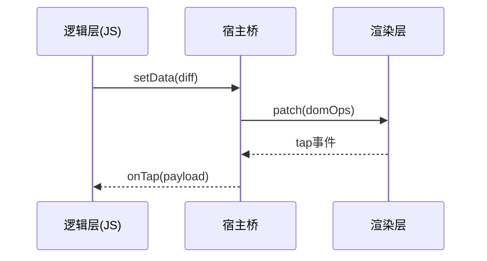

# 架构与运行机制 ✅

面向微信/支付宝/抖音等小程序平台的通用架构认知，围绕运行时、渲染通信、数据更新与限制展开。

## 小程序整体架构与运行原理？ {#p0-arch-overview}

<Answer>

**核心概念:**

小程序采用“逻辑层(JS) + 渲染层(WebView/Native)”双线程模型，宿主提供通信通道完成数据下发与事件上报；UI 以 DSL(WXML/WXSS 等) 声明，逻辑层不可直接操作 DOM。

**示例说明:**



**面试官视角:**

* **要点清单**: 双线程/不可直控 DOM/单向数据下发/事件上行
* **加分项**: 了解原生组件/同层渲染与端差异
* **常见失误**: 当成标准 H5 使用，忽视通信成本

**延伸阅读:**

* [运行机制](https://developers.weixin.qq.com/miniprogram/dev/framework/)

</Answer>

## 为什么小程序有逻辑层与渲染层两线程？ {#p0-two-threads}

<Answer>

**核心概念:**

分离渲染与逻辑避免 JS 计算阻塞 UI，提升稳定性与一致性；事件上报与数据下发通过异步队列传递。

**示例说明:**

```js
// 伪代码：批量合并 setData 降低过桥频次
let q = [], scheduled = false
function batchSetData(diff){
  q.push(diff)
  if (!scheduled){
    scheduled = true
    setTimeout(() => {
      const merged = Object.assign({}, ...q)
      q = []; scheduled = false
      // @ts-ignore
      this.setData(merged)
    }, 16)
  }
}
```

**面试官视角:**

* **要点清单**: 并行/隔离的收益；异步通信的代价
* **加分项**: 批处理策略；框架层 Hook
* **常见失误**: 高频小粒度 setData；重计算挡在主线程

**延伸阅读:**

* [渲染层与逻辑层](https://developers.weixin.qq.com/miniprogram/dev/framework/view/)

</Answer>

## 为什么不能直接操作 DOM？ {#p0-no-dom}

<Answer>

**核心概念:**

渲染层由宿主容器掌控，逻辑层运行在独立运行时(JSCore/V8)；DOM API 不可用，使用选择器/节点查询与组件能力完成交互。

**示例说明:**

```wxml
<view id="box" />
```

```js
const q = wx.createSelectorQuery()
q.select('#box').boundingClientRect(rect => console.log(rect)).exec()
```

**面试官视角:**

* **要点清单**: 安全模型/一致性；替代方案
* **加分项**: 组件化封装交互能力
* **常见失误**: 直接调用 document.*

**延伸阅读:**

* [WXML/WXSS](https://developers.weixin.qq.com/miniprogram/dev/framework/view/wxml/)

</Answer>

## setData 工作机制与性能陷阱？ {#p0-setdata}

<Answer>

**核心概念:**

setData 将数据 diff 序列化过桥，下发给渲染层生成补丁；大对象/深层结构/高频调用会放大通信与序列化开销。

**示例说明:**

```js
// 推荐：最小 diff + 去抖
this.setData({ [`list[${i}].checked`]: true })
// 避免：整树替换
// this.setData({ list })
```

**面试官视角:**

* **要点清单**: 最小化 diff；合并/节流；扁平化
* **加分项**: 长列表窗口化；Worker/任务切片
* **常见失误**: 高频大 payload；跨层级全量更新

**延伸阅读:**

* [数据绑定](https://developers.weixin.qq.com/miniprogram/dev/framework/view/data.html)

</Answer>

## 页面/组件生命周期与事件模型？ {#p1-lifecycles}

<Answer>

**核心概念:**

页面 onLoad/onShow/onHide/onUnload；组件 lifetimes/pageLifetimes；冒泡/捕获与自定义事件。

**示例说明:**

```js
Page({ onLoad(){}, onShow(){}, onHide(){}, onUnload(){} })
Component({ lifetimes:{ attached(){}, detached(){} } })
```

**面试官视角:**

* **要点清单**: 资源管理与清理；事件传递
* **加分项**: 防抖/去重进入；路由栈管理
* **常见失误**: 忽视卸载清理；重复注册监听

**延伸阅读:**

* [页面生命周期](https://developers.weixin.qq.com/miniprogram/dev/framework/app-service/page.html)

</Answer>

## JS 运行时(JSCore/V8/X5) 有何差异与限制？ {#p1-js-runtime}

<Answer>

**核心概念:**

不同端运行时差异导致部分 Web API 缺失；避免 eval/new Function，使用宿主 API 与 polyfill。

**示例说明:**

```js
wx.getSystemInfo({ success: console.log })
```

**面试官视角:**

* **要点清单**: 运行时能力边界；兼容策略
* **加分项**: 适配/抽象层
* **常见失误**: 直接依赖浏览器特性

**延伸阅读:**

* 各端能力说明文档（微信/支付宝/抖音）

</Answer>

## 页面/组件/全局的数据通信？ {#p1-comm}

<Answer>

**核心概念:**

组件 props/triggerEvent，页面间事件总线/全局 App，状态库(mobx-miniprogram 等)；临时本地存储共享。

**示例说明:**

```js
// 组件向外触发
this.triggerEvent('change', { value })
```

**面试官视角:**

* **要点清单**: 单向数据流；低耦合
* **加分项**: 规模化状态管理
* **常见失误**: 跨页频繁 setData；全局变量滥用

**延伸阅读:**

* [组件通信](https://developers.weixin.qq.com/miniprogram/dev/framework/custom-component/events.html)

</Answer>

## 原生组件/同层渲染的作用与限制？ {#p1-native-component}

<Answer>

**核心概念:**

camera/map/video 等同层渲染可获更好性能，但存在层级/zIndex/滚动遮挡等限制。

**示例说明:**

```wxml
<map style="width:100%;height:300px" enable-3D="true" />
```

**面试官视角:**

* **要点清单**: 层级限制；手势冲突
* **加分项**: 蒙层穿透/交互协调
* **常见失误**: 与 scroll-view 叠加遮挡

**延伸阅读:**

* [原生组件](https://developers.weixin.qq.com/miniprogram/dev/component/native-component.html)

</Answer>

## Worker/分线程如何使用？ {#p2-worker}

<Answer>

**核心概念:**

使用 Worker 处理重计算，避免阻塞逻辑主线程；postMessage 通信注意数据复制与释放。

**示例说明:**

```js
const worker = wx.createWorker('workers/calc.js')
worker.postMessage({ type: 'sum', payload: bigArray })
worker.onMessage(({ result }) => this.setData({ result }))
```

**面试官视角:**

* **要点清单**: 任务切片；数据量控制
* **加分项**: 二进制传输与释放；内存压测
* **常见失误**: 主线程仍做大循环

**延伸阅读:**

* [Worker](https://developers.weixin.qq.com/miniprogram/dev/framework/workers.html)

</Answer>

## WXS 在哪些场景合适？ {#p2-wxs}

<Answer>

**核心概念:**

WXS 在渲染层运行，适合格式化/轻逻辑以减少 setData；避免放业务复杂逻辑。

**示例说明:**

```wxml
<wxs module="f">module.exports.format=n=>n.toFixed(2)</wxs>
<text>{{ f.format(price) }}</text>
```

**面试官视角:**

* **要点清单**: 在地渲染/减少过桥
* **加分项**: 可维护性权衡
* **常见失误**: 复杂业务放入 WXS

**延伸阅读:**

* [WXS](https://developers.weixin.qq.com/miniprogram/dev/framework/view/wxs/)

</Answer>
