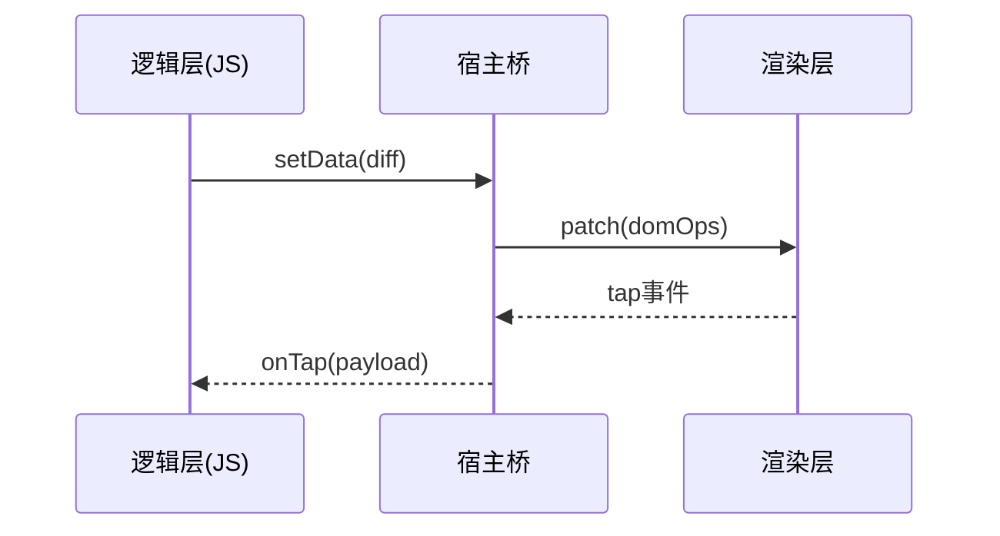
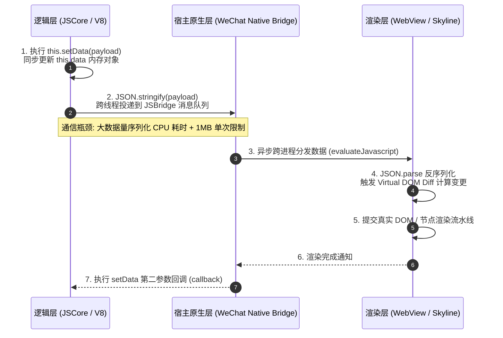

# 架构与运行机制 ✅

面向微信/支付宝/抖音等小程序平台的通用架构认知，围绕运行时、渲染通信、数据更新与限制展开。

## 小程序整体架构与运行原理？ {#p0-arch-overview}

<Answer>

**核心概念:**

小程序采用“逻辑层(JS) + 渲染层(WebView/Native)”双线程模型，宿主提供通信通道完成数据下发与事件上报；UI 以 DSL(WXML/WXSS 等) 声明，逻辑层不可直接操作 DOM。

**示例说明:**


```mermaid
sequenceDiagram
  participant Logic as 逻辑层(JS)
  participant Bridge as 宿主桥
  participant Render as 渲染层
  Logic->>Bridge: setData(diff)
  Bridge->>Render: patch(domOps)
  Render-->>Bridge: tap事件
  Bridge-->>Logic: onTap(payload)
```

**面试官视角:**

* **要点清单**: 双线程/不可直控 DOM/单向数据下发/事件上行
* **加分项**: 了解原生组件/同层渲染与端差异
* **常见失误**: 当成标准 H5 使用，忽视通信成本

**延伸阅读:**

* [运行机制](https://developers.weixin.qq.com/miniprogram/dev/framework/)

</Answer>

## 为什么小程序有逻辑层与渲染层两线程？ {#p0-two-threads}

<Answer>

**核心概念:**

分离渲染与逻辑避免 JS 计算阻塞 UI，提升稳定性与一致性；事件上报与数据下发通过异步队列传递。

**示例说明:**

```js
// 伪代码：批量合并 setData 降低过桥频次
let q = [], scheduled = false
function batchSetData(diff){
  q.push(diff)
  if (!scheduled){
    scheduled = true
    setTimeout(() => {
      const merged = Object.assign({}, ...q)
      q = []; scheduled = false
      // @ts-ignore
      this.setData(merged)
    }, 16)
  }
}
```

**面试官视角:**

* **要点清单**: 并行/隔离的收益；异步通信的代价
* **加分项**: 批处理策略；框架层 Hook
* **常见失误**: 高频小粒度 setData；重计算挡在主线程

**延伸阅读:**

* [渲染层与逻辑层](https://developers.weixin.qq.com/miniprogram/dev/framework/view/)

</Answer>

## 为什么不能直接操作 DOM？ {#p0-no-dom}

<Answer>

**核心概念:**

渲染层由宿主容器掌控，逻辑层运行在独立运行时(JSCore/V8)；DOM API 不可用，使用选择器/节点查询与组件能力完成交互。

**示例说明:**

```wxml
<view id="box" />
```

```js
const q = wx.createSelectorQuery()
q.select('#box').boundingClientRect(rect => console.log(rect)).exec()
```

**面试官视角:**

* **要点清单**: 安全模型/一致性；替代方案
* **加分项**: 组件化封装交互能力
* **常见失误**: 直接调用 document.*

**延伸阅读:**

* [WXML/WXSS](https://developers.weixin.qq.com/miniprogram/dev/framework/view/wxml/)

</Answer>

## setData 工作机制、底层序列化通信瓶颈与长列表性能优化？ {#p0-setdata}

<Answer>

**核心结论**

`setData` 是小程序中**逻辑层（Logic Thread）驱动渲染层（Render Thread）更新界面的唯一官方通信通道**。其工作机制具有双重特性与三大性能瓶颈：
1. **执行时序特性**：`setData` 的数据修改是**同步（Synchronous）**的（调用后 `this.data` 立即改变），但视图层的渲染回调是**异步（Asynchronous）**的。
2. **端到端通信管线**：数据无法直接共享内存，必须经历：逻辑层 `JSON.stringify` 序列化 &rarr; Native / JSBridge 消息分发 &rarr; 渲染层 `JSON.parse` 反序列化并构造 Virtual DOM 补丁 &rarr; 触发真实 DOM/Native 渲染树更新。
3. **三大生产性能陷阱**：
   - **单次 Payload 超过限制**：单次传输体积达到或超过 1MB 时，微信底层会触发严重告警甚至静默丢弃，导致界面卡死；
   - **高频调用引发 Bridge 队列雪崩**：在滚动（`onPageScroll`）或手势拖拽中高频 `setData`，会导致底层异步消息管道积压，堵塞用户点击响应事件；
   - **全量深层对象赋值（Over-fetching Update）**：每次只改动数组一项却将整个大数组 `setData({ list })` 重新下发，引发巨大的无谓序列化开销与 VDOM 全量 Diff 运算。

---

**底层通信链路与数据流转拓扑**


```mermaid
sequenceDiagram
    autonumber
    participant JS as 逻辑层 (JSCore / V8)
    participant Native as 宿主原生层 (WeChat Native Bridge)
    participant Render as 渲染层 (WebView / Skyline)

    JS->>JS: 1. 执行 this.setData(payload)<br/>同步更新 this.data 内存对象
    JS->>Native: 2. JSON.stringify(payload)<br/>跨线程投递到 JSBridge 消息队列
    Note over JS,Native: 通信瓶颈: 大数据量序列化 CPU 耗时 + 1MB 单次限制
    Native->>Render: 3. 异步跨进程分发数据 (evaluateJavascript)
    Render->>Render: 4. JSON.parse 反序列化<br/>触发 Virtual DOM Diff 计算变更
    Render->>Render: 5. 提交真实 DOM / 节点渲染流水线
    Render-->>Native: 6. 渲染完成通知
    Native-->>JS: 7. 执行 setData 第二参数回调 (callback)
```

---

**生产级优化方案与工程代码**

**1. 路径化局部差量更新（Path-based Diffing）**
避免整树或整个数组重新下发，利用小程序的属性路径解析机制，直接定位修改目标节点：

```javascript
// ❌ 错误示范：修改单个元素却全量提交千条大列表
// this.setData({ list: updatedList }); 

// ✅ 规范实践：按路径精确定位子属性，传输体积减少 99%
const targetIndex = 42;
this.setData({
  [`list[${targetIndex}].checked`]: true,
  [`list[${targetIndex}].updateTime`]: Date.now()
});
```

**2. 异步批处理与分帧调度器（Batched Scheduler）**
针对高频触发的数据更新，维护内存更新队列，结合 `requestAnimationFrame` 或 16ms 定时器合并帧内变动：

```typescript
export class MiniprogramBatchScheduler {
  private queue: Record<string, any> = {};
  private timer: number | null = null;
  private pageContext: any;

  constructor(pageContext: any) {
    this.pageContext = pageContext;
  }

  // 收集局部更新补丁
  scheduleUpdate(patch: Record<string, any>): void {
    Object.assign(this.queue, patch);

    if (this.timer === null) {
      // 16ms 帧对齐节流合并
      this.timer = setTimeout(() => {
        this.flush();
      }, 16) as unknown as number;
    }
  }

  flush(): void {
    if (Object.keys(this.queue).length === 0) return;
    const payload = this.queue;
    this.queue = {};
    if (this.timer !== null) {
      clearTimeout(this.timer);
      this.timer = null;
    }
    // 单次原子过桥下发
    this.pageContext.setData(payload);
  }
}
```

**3. WXS 视图层就地运算（Bypass JSBridge）**
对于滚动吸顶、侧滑抽屉、拖拽手势等 60FPS 高频动画，严禁在逻辑层监听 `touchmove` 并调用 `setData`，必须使用 **WXS（WeiXin Script）** 将事件监听与样式直接绑定在渲染层本地执行，完全跳过跨线程通信。

**4. 虚拟列表与节点回收（DOM Recycling）**
对于万级长列表数据，逻辑层维护完整数据集，渲染层仅挂载当前可视区域（如 10 条）以及上下各 5 条缓冲区，离屏节点使用轻量占位容器（Placeholder）替代，确保渲染层 DOM 节点总数恒定小于 50 个。

---

**面试官视角与下探考察点**

1. **底层机制原理**：
   - 面试官通常会问：“`setData` 的 callback 触发时，界面真实像素一定已经画到屏幕上了吗？”
   - 深度洞察：callback 仅代表渲染层完成了 Virtual DOM 的 patch 解析并提交至浏览器渲染流水线，若此时页面存在重型 CSS 动画或大图片解码阻塞主线程，实际屏幕呈现可能仍有微小延迟。
2. **Skyline 原生渲染引擎演进**：
   - 资深候选人可主动谈及微信新一代 **Skyline 渲染引擎**：抛弃了传统多 WebView 架构，采用 C++ 编写的类 Flutter 原生渲染架构，支持 Worklet 动画线程，使得局部 `setData` 能直接映射为原生组件属性更新，性能大幅度提升。

---

**延伸阅读**

- [微信官方文档：setData 性能优化指南](https://developers.weixin.qq.com/miniprogram/dev/framework/performance/tips.html)
- [微信小程序新一代 Skyline 渲染引擎架构](https://developers.weixin.qq.com/miniprogram/dev/framework/runtime/skyline/overview.html)
- 移动端混合应用（Hybrid App）与跨进程序列化通信成本对比

</Answer>

## 页面/组件生命周期与事件模型？ {#p1-lifecycles}

<Answer>

**核心概念:**

页面 onLoad/onShow/onHide/onUnload；组件 lifetimes/pageLifetimes；冒泡/捕获与自定义事件。

**示例说明:**

```js
Page({ onLoad(){}, onShow(){}, onHide(){}, onUnload(){} })
Component({ lifetimes:{ attached(){}, detached(){} } })
```

**面试官视角:**

* **要点清单**: 资源管理与清理；事件传递
* **加分项**: 防抖/去重进入；路由栈管理
* **常见失误**: 忽视卸载清理；重复注册监听

**延伸阅读:**

* [页面生命周期](https://developers.weixin.qq.com/miniprogram/dev/framework/app-service/page.html)

</Answer>

## JS 运行时(JSCore/V8/X5) 有何差异与限制？ {#p1-js-runtime}

<Answer>

**核心概念:**

不同端运行时差异导致部分 Web API 缺失；避免 eval/new Function，使用宿主 API 与 polyfill。

**示例说明:**

```js
wx.getSystemInfo({ success: console.log })
```

**面试官视角:**

* **要点清单**: 运行时能力边界；兼容策略
* **加分项**: 适配/抽象层
* **常见失误**: 直接依赖浏览器特性

**延伸阅读:**

* 各端能力说明文档（微信/支付宝/抖音）

</Answer>

## 页面/组件/全局的数据通信？ {#p1-comm}

<Answer>

**核心概念:**

组件 props/triggerEvent，页面间事件总线/全局 App，状态库(mobx-miniprogram 等)；临时本地存储共享。

**示例说明:**

```js
// 组件向外触发
this.triggerEvent('change', { value })
```

**面试官视角:**

* **要点清单**: 单向数据流；低耦合
* **加分项**: 规模化状态管理
* **常见失误**: 跨页频繁 setData；全局变量滥用

**延伸阅读:**

* [组件通信](https://developers.weixin.qq.com/miniprogram/dev/framework/custom-component/events.html)

</Answer>

## 原生组件/同层渲染的作用与限制？ {#p1-native-component}

<Answer>

**核心概念:**

camera/map/video 等同层渲染可获更好性能，但存在层级/zIndex/滚动遮挡等限制。

**示例说明:**

```wxml
<map style="width:100%;height:300px" enable-3D="true" />
```

**面试官视角:**

* **要点清单**: 层级限制；手势冲突
* **加分项**: 蒙层穿透/交互协调
* **常见失误**: 与 scroll-view 叠加遮挡

**延伸阅读:**

* [原生组件](https://developers.weixin.qq.com/miniprogram/dev/component/native-component.html)

</Answer>

## Worker/分线程如何使用？ {#p2-worker}

<Answer>

**核心概念:**

使用 Worker 处理重计算，避免阻塞逻辑主线程；postMessage 通信注意数据复制与释放。

**示例说明:**

```js
const worker = wx.createWorker('workers/calc.js')
worker.postMessage({ type: 'sum', payload: bigArray })
worker.onMessage(({ result }) => this.setData({ result }))
```

**面试官视角:**

* **要点清单**: 任务切片；数据量控制
* **加分项**: 二进制传输与释放；内存压测
* **常见失误**: 主线程仍做大循环

**延伸阅读:**

* [Worker](https://developers.weixin.qq.com/miniprogram/dev/framework/workers.html)

</Answer>

## WXS 在哪些场景合适？ {#p2-wxs}

<Answer>

**核心概念:**

WXS 在渲染层运行，适合格式化/轻逻辑以减少 setData；避免放业务复杂逻辑。

**示例说明:**

```wxml
<wxs module="f">module.exports.format=n=>n.toFixed(2)</wxs>
<text>{{ f.format(price) }}</text>
```

**面试官视角:**

* **要点清单**: 在地渲染/减少过桥
* **加分项**: 可维护性权衡
* **常见失误**: 复杂业务放入 WXS

**延伸阅读:**

* [WXS](https://developers.weixin.qq.com/miniprogram/dev/framework/view/wxs/)

</Answer>
