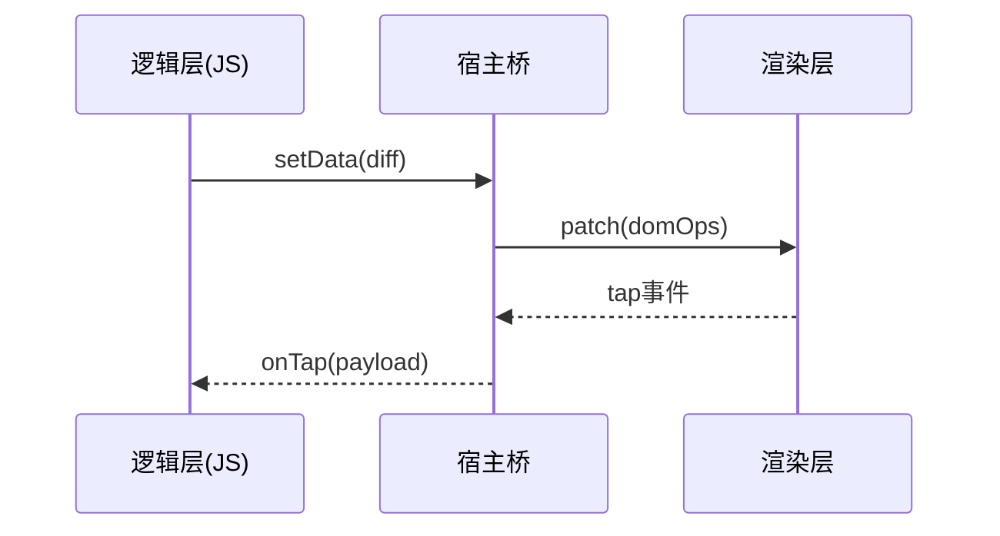
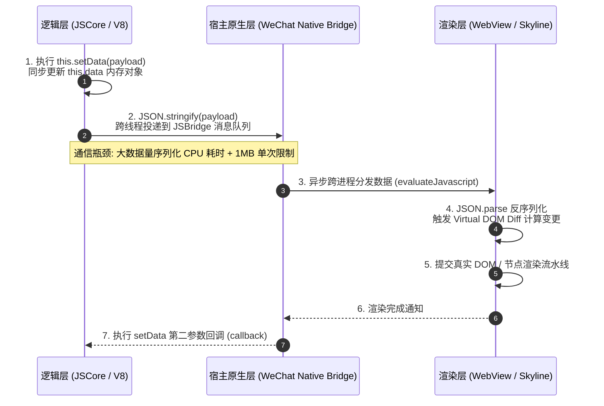
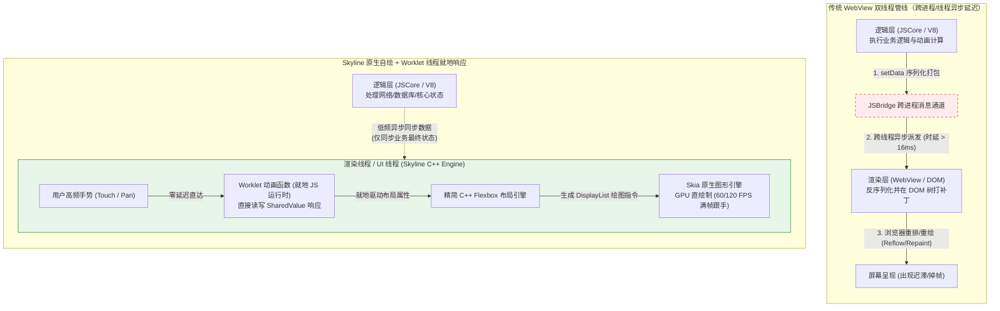

# 架构与运行机制 ✅

面向微信/支付宝/抖音等小程序平台的通用架构认知，围绕运行时、渲染通信、数据更新与限制展开。

## 小程序整体架构与运行原理？ {#p0-arch-overview}

<Answer>

**核心概念:**

小程序采用“逻辑层(JS) + 渲染层(WebView/Native)”双线程模型，宿主提供通信通道完成数据下发与事件上报；UI 以 DSL(WXML/WXSS 等) 声明，逻辑层不可直接操作 DOM。

**示例说明:**


```mermaid
sequenceDiagram
  participant Logic as 逻辑层(JS)
  participant Bridge as 宿主桥
  participant Render as 渲染层
  Logic->>Bridge: setData(diff)
  Bridge->>Render: patch(domOps)
  Render-->>Bridge: tap事件
  Bridge-->>Logic: onTap(payload)
```

**面试官视角:**

* **要点清单**: 双线程/不可直控 DOM/单向数据下发/事件上行
* **加分项**: 了解原生组件/同层渲染与端差异
* **常见失误**: 当成标准 H5 使用，忽视通信成本

**延伸阅读:**

* [运行机制](https://developers.weixin.qq.com/miniprogram/dev/framework/)

</Answer>

## 为什么小程序有逻辑层与渲染层两线程？ {#p0-two-threads}

<Answer>

**核心概念:**

分离渲染与逻辑避免 JS 计算阻塞 UI，提升稳定性与一致性；事件上报与数据下发通过异步队列传递。

**示例说明:**

```js
// 伪代码：批量合并 setData 降低过桥频次
let q = [], scheduled = false
function batchSetData(diff){
  q.push(diff)
  if (!scheduled){
    scheduled = true
    setTimeout(() => {
      const merged = Object.assign({}, ...q)
      q = []; scheduled = false
      // @ts-ignore
      this.setData(merged)
    }, 16)
  }
}
```

**面试官视角:**

* **要点清单**: 并行/隔离的收益；异步通信的代价
* **加分项**: 批处理策略；框架层 Hook
* **常见失误**: 高频小粒度 setData；重计算挡在主线程

**延伸阅读:**

* [渲染层与逻辑层](https://developers.weixin.qq.com/miniprogram/dev/framework/view/)

</Answer>

## 为什么不能直接操作 DOM？ {#p0-no-dom}

<Answer>

**核心概念:**

渲染层由宿主容器掌控，逻辑层运行在独立运行时(JSCore/V8)；DOM API 不可用，使用选择器/节点查询与组件能力完成交互。

**示例说明:**

```wxml
<view id="box" />
```

```js
const q = wx.createSelectorQuery()
q.select('#box').boundingClientRect(rect => console.log(rect)).exec()
```

**面试官视角:**

* **要点清单**: 安全模型/一致性；替代方案
* **加分项**: 组件化封装交互能力
* **常见失误**: 直接调用 document.*

**延伸阅读:**

* [WXML/WXSS](https://developers.weixin.qq.com/miniprogram/dev/framework/view/wxml/)

</Answer>

## setData 工作机制、底层序列化通信瓶颈与长列表性能优化？ {#p0-setdata}

<Answer>

**核心结论**

`setData` 是小程序中**逻辑层（Logic Thread）驱动渲染层（Render Thread）更新界面的唯一官方通信通道**。其工作机制具有双重特性与三大性能瓶颈：
1. **执行时序特性**：`setData` 的数据修改是**同步（Synchronous）**的（调用后 `this.data` 立即改变），但视图层的渲染回调是**异步（Asynchronous）**的。
2. **端到端通信管线**：数据无法直接共享内存，必须经历：逻辑层 `JSON.stringify` 序列化 &rarr; Native / JSBridge 消息分发 &rarr; 渲染层 `JSON.parse` 反序列化并构造 Virtual DOM 补丁 &rarr; 触发真实 DOM/Native 渲染树更新。
3. **三大生产性能陷阱**：
   - **单次 Payload 超过限制**：单次传输体积达到或超过 1MB 时，微信底层会触发严重告警甚至静默丢弃，导致界面卡死；
   - **高频调用引发 Bridge 队列雪崩**：在滚动（`onPageScroll`）或手势拖拽中高频 `setData`，会导致底层异步消息管道积压，堵塞用户点击响应事件；
   - **全量深层对象赋值（Over-fetching Update）**：每次只改动数组一项却将整个大数组 `setData({ list })` 重新下发，引发巨大的无谓序列化开销与 VDOM 全量 Diff 运算。

---

**底层通信链路与数据流转拓扑**


```mermaid
sequenceDiagram
    autonumber
    participant JS as 逻辑层 (JSCore / V8)
    participant Native as 宿主原生层 (WeChat Native Bridge)
    participant Render as 渲染层 (WebView / Skyline)

    JS->>JS: 1. 执行 this.setData(payload)<br/>同步更新 this.data 内存对象
    JS->>Native: 2. JSON.stringify(payload)<br/>跨线程投递到 JSBridge 消息队列
    Note over JS,Native: 通信瓶颈: 大数据量序列化 CPU 耗时 + 1MB 单次限制
    Native->>Render: 3. 异步跨进程分发数据 (evaluateJavascript)
    Render->>Render: 4. JSON.parse 反序列化<br/>触发 Virtual DOM Diff 计算变更
    Render->>Render: 5. 提交真实 DOM / 节点渲染流水线
    Render-->>Native: 6. 渲染完成通知
    Native-->>JS: 7. 执行 setData 第二参数回调 (callback)
```

---

**生产级优化方案与工程代码**

**1. 路径化局部差量更新（Path-based Diffing）**
避免整树或整个数组重新下发，利用小程序的属性路径解析机制，直接定位修改目标节点：

```javascript
// ❌ 错误示范：修改单个元素却全量提交千条大列表
// this.setData({ list: updatedList }); 

// ✅ 规范实践：按路径精确定位子属性，传输体积减少 99%
const targetIndex = 42;
this.setData({
  [`list[${targetIndex}].checked`]: true,
  [`list[${targetIndex}].updateTime`]: Date.now()
});
```

**2. 异步批处理与分帧调度器（Batched Scheduler）**
针对高频触发的数据更新，维护内存更新队列，结合 `requestAnimationFrame` 或 16ms 定时器合并帧内变动：

```typescript
export class MiniprogramBatchScheduler {
  private queue: Record<string, any> = {};
  private timer: number | null = null;
  private pageContext: any;

  constructor(pageContext: any) {
    this.pageContext = pageContext;
  }

  // 收集局部更新补丁
  scheduleUpdate(patch: Record<string, any>): void {
    Object.assign(this.queue, patch);

    if (this.timer === null) {
      // 16ms 帧对齐节流合并
      this.timer = setTimeout(() => {
        this.flush();
      }, 16) as unknown as number;
    }
  }

  flush(): void {
    if (Object.keys(this.queue).length === 0) return;
    const payload = this.queue;
    this.queue = {};
    if (this.timer !== null) {
      clearTimeout(this.timer);
      this.timer = null;
    }
    // 单次原子过桥下发
    this.pageContext.setData(payload);
  }
}
```

**3. WXS 视图层就地运算（Bypass JSBridge）**
对于滚动吸顶、侧滑抽屉、拖拽手势等 60FPS 高频动画，严禁在逻辑层监听 `touchmove` 并调用 `setData`，必须使用 **WXS（WeiXin Script）** 将事件监听与样式直接绑定在渲染层本地执行，完全跳过跨线程通信。

**4. 虚拟列表与节点回收（DOM Recycling）**
对于万级长列表数据，逻辑层维护完整数据集，渲染层仅挂载当前可视区域（如 10 条）以及上下各 5 条缓冲区，离屏节点使用轻量占位容器（Placeholder）替代，确保渲染层 DOM 节点总数恒定小于 50 个。

---

**面试官视角与下探考察点**

1. **底层机制原理**：
   - 面试官通常会问：“`setData` 的 callback 触发时，界面真实像素一定已经画到屏幕上了吗？”
   - 深度洞察：callback 仅代表渲染层完成了 Virtual DOM 的 patch 解析并提交至浏览器渲染流水线，若此时页面存在重型 CSS 动画或大图片解码阻塞主线程，实际屏幕呈现可能仍有微小延迟。
2. **Skyline 原生渲染引擎演进**：
   - 资深候选人可主动谈及微信新一代 **Skyline 渲染引擎**：抛弃了传统多 WebView 架构，采用 C++ 编写的类 Flutter 原生渲染架构，支持 Worklet 动画线程，使得局部 `setData` 能直接映射为原生组件属性更新，性能大幅度提升。

---

**延伸阅读**

- [微信官方文档：setData 性能优化指南](https://developers.weixin.qq.com/miniprogram/dev/framework/performance/tips.html)
- [微信小程序新一代 Skyline 渲染引擎架构](https://developers.weixin.qq.com/miniprogram/dev/framework/runtime/skyline/overview.html)
- 移动端混合应用（Hybrid App）与跨进程序列化通信成本对比

</Answer>

## 页面/组件生命周期与事件模型？ {#p1-lifecycles}

<Answer>

**核心概念:**

页面 onLoad/onShow/onHide/onUnload；组件 lifetimes/pageLifetimes；冒泡/捕获与自定义事件。

**示例说明:**

```js
Page({ onLoad(){}, onShow(){}, onHide(){}, onUnload(){} })
Component({ lifetimes:{ attached(){}, detached(){} } })
```

**面试官视角:**

* **要点清单**: 资源管理与清理；事件传递
* **加分项**: 防抖/去重进入；路由栈管理
* **常见失误**: 忽视卸载清理；重复注册监听

**延伸阅读:**

* [页面生命周期](https://developers.weixin.qq.com/miniprogram/dev/framework/app-service/page.html)

</Answer>

## JS 运行时(JSCore/V8/X5) 有何差异与限制？ {#p1-js-runtime}

<Answer>

**核心概念:**

不同端运行时差异导致部分 Web API 缺失；避免 eval/new Function，使用宿主 API 与 polyfill。

**示例说明:**

```js
wx.getSystemInfo({ success: console.log })
```

**面试官视角:**

* **要点清单**: 运行时能力边界；兼容策略
* **加分项**: 适配/抽象层
* **常见失误**: 直接依赖浏览器特性

**延伸阅读:**

* 各端能力说明文档（微信/支付宝/抖音）

</Answer>

## 页面/组件/全局的数据通信？ {#p1-comm}

<Answer>

**核心概念:**

组件 props/triggerEvent，页面间事件总线/全局 App，状态库(mobx-miniprogram 等)；临时本地存储共享。

**示例说明:**

```js
// 组件向外触发
this.triggerEvent('change', { value })
```

**面试官视角:**

* **要点清单**: 单向数据流；低耦合
* **加分项**: 规模化状态管理
* **常见失误**: 跨页频繁 setData；全局变量滥用

**延伸阅读:**

* [组件通信](https://developers.weixin.qq.com/miniprogram/dev/framework/custom-component/events.html)

</Answer>

## 原生组件/同层渲染的作用与限制？ {#p1-native-component}

<Answer>

**核心概念:**

camera/map/video 等同层渲染可获更好性能，但存在层级/zIndex/滚动遮挡等限制。

**示例说明:**

```wxml
<map style="width:100%;height:300px" enable-3D="true" />
```

**面试官视角:**

* **要点清单**: 层级限制；手势冲突
* **加分项**: 蒙层穿透/交互协调
* **常见失误**: 与 scroll-view 叠加遮挡

**延伸阅读:**

* [原生组件](https://developers.weixin.qq.com/miniprogram/dev/component/native-component.html)

</Answer>

## Worker/分线程如何使用？ {#p2-worker}

<Answer>

**核心概念:**

使用 Worker 处理重计算，避免阻塞逻辑主线程；postMessage 通信注意数据复制与释放。

**示例说明:**

```js
const worker = wx.createWorker('workers/calc.js')
worker.postMessage({ type: 'sum', payload: bigArray })
worker.onMessage(({ result }) => this.setData({ result }))
```

**面试官视角:**

* **要点清单**: 任务切片；数据量控制
* **加分项**: 二进制传输与释放；内存压测
* **常见失误**: 主线程仍做大循环

**延伸阅读:**

* [Worker](https://developers.weixin.qq.com/miniprogram/dev/framework/workers.html)

</Answer>

## WXS 在哪些场景合适？ {#p2-wxs}

<Answer>

**核心概念:**

WXS 在渲染层运行，适合格式化/轻逻辑以减少 setData；避免放业务复杂逻辑。

**示例说明:**

```wxml
<wxs module="f">module.exports.format=n=>n.toFixed(2)</wxs>
<text>{{ f.format(price) }}</text>
```

**面试官视角:**

* **要点清单**: 在地渲染/减少过桥
* **加分项**: 可维护性权衡
* **常见失误**: 复杂业务放入 WXS

**延伸阅读:**

* [WXS](https://developers.weixin.qq.com/miniprogram/dev/framework/view/wxs/)

</Answer>

## 微信小程序 Skyline 渲染引擎脱离 WebView 的底层自绘架构与 Worklet 线程就地动画机制？ {#p0-miniprogram-skyline-engine}

<Answer>

**核心结论:**

* **彻底摆脱 WebView 双层损耗**: 传统小程序受限于系统 WebView 渲染，存在 DOM/CSSOM 树内存冗余、重排重绘开销巨大以及与逻辑层跨进程通信延迟等硬伤；Skyline 彻底舍弃 WebView，引入类似 Flutter 的原生自绘引擎（底层基于 Skia），直接自建高效 C++ 布局与光栅化绘制管线。
* **Worklet 就地渲染响应**: 传统架构中，手势事件必须经由系统 WebView 跨线程传至逻辑层，经由 `setData` 异步传递计算结果，单次闭环耗时常超过 16ms ~ 100ms 造成严重卡顿；Skyline 采用 Worklet 机制，将 JavaScript 动画/手势处理函数直接注入到渲染线程（UI 线程）中就地同步执行，做到 0 跨线程通信延迟与 120 FPS 满帧丝滑跟手。
* **现代原生布局与内建高性能组件**: Skyline 裁剪了 Web 历史冗余包袱，仅保留精简的高性能 CSS Flexbox 盒模型，剔除复杂的 float、BFC/IFC 混合排版；原生提供虚拟化长列表（`list-view`）、瀑布流（`waterfall-view`）与跨页面共享元素动画（`share-element`），内存开销恒定。

**原理解析:**

1. **传统 WebView 双线程架构的性能死结**
   * **DOM 树与内核内存冗余**: 传统的微信小程序在 iOS 上基于 WKWebView、Android 上基于 XWeb/Chromium WebView。完整的浏览器内核包含巨量 Web 标准规范支持，DOM 节点占用大量内存，在多页面栈场景下极易触发低端设备 OOM。
   * **跨线程 JSBridge 异步时延墙**: 逻辑层（JavaScriptCore/V8）与渲染层（WebView）处于两个独立进程或线程。数据通信依赖基于 JSON 序列化的异步 JSBridge。连续滑动手势如果依赖逻辑层计算，再通过 `setData` 变更样式，往返时延通常在 16ms 以上，远远落后于屏幕 60Hz/120Hz 的刷新周期，导致手势拖拽时视觉严重脱节。

2. **Skyline C++ 底层自绘管线设计**
   * 类似 Flutter 渲染架构，Skyline 舍弃了浏览器排版引擎，引入跨平台 2D 绘图库 Skia。
   * **解析阶段**: Glass-Easel 组件框架在 C++ 侧直接解析轻量级 WXML 模板并构建 Element 节点树，完全不生成任何浏览器标准 DOM 对象。
   * **布局阶段（Layout）**: 采用自研精简版 C++ Flexbox 引擎进行排版测算。Skyline 彻底废弃了 Web CSS 中极其低效的浮动布局（Float）、行内块混排（Inline-Block）与复杂外边距折叠，仅保留现代 Flex 布局与绝对定位，样式计算与布局速度提升数倍。
   * **合成与光栅化（Paint & Raster）**: 布局完成后直接生成 DisplayList 绘图指令，绕过浏览器的 RenderLayerCompositor，通过 Skia 借助 GPU（Metal / OpenGL / Vulkan）直接在 Surface 上完成像素光栅化，达到原生客户端级的渲染性能。


```mermaid
flowchart TB
    subgraph Traditional["传统 WebView 双线程管线（跨进程/线程异步延迟）"]
        direction TB
        L1["逻辑层 (JSCore / V8)\n执行业务逻辑与动画计算"] -->|"1. setData 序列化打包"| B1["JSBridge 跨进程消息通道"]
        B1 -->|"2. 跨线程异步派发 (时延 > 16ms)"| W1["渲染层 (WebView / DOM)\n反序列化并在 DOM 树打补丁"]
        W1 -->|"3. 浏览器重排/重绘 (Reflow/Repaint)"| S1["屏幕呈现 (出现迟滞/掉帧)"]
        style B1 fill:#ffebee,stroke:#c62828,stroke-dasharray: 5 5
    end

    subgraph Skyline["Skyline 原生自绘 + Worklet 线程就地响应"]
        direction TB
        L2["逻辑层 (JSCore / V8)\n处理网络/数据库/核心状态"] -.->|"低频异步同步数据\n(仅同步业务最终状态)"| RenderThread
        subgraph RenderThread["渲染线程 / UI 线程 (Skyline C++ Engine)"]
            T2["用户高频手势 (Touch / Pan)"] -->|"零延迟直达"| WK["Worklet 动画函数 (就地 JS 运行时)\n直接读写 SharedValue 响应"]
            WK -->|"就地驱动布局属性"| LAY["精简 C++ Flexbox 布局引擎"]
            LAY -->|"生成 DisplayList 绘图指令"| SKIA["Skia 原生图形引擎\nGPU 直绘制 (60/120 FPS 满帧跟手)"]
        end
        style RenderThread fill:#e8f5e9,stroke:#2e7d32
    end
```

3. **Worklet 机制：渲染线程就地执行**
   * **双 JS 运行时架构**: 微信在逻辑层运行主 JS 引擎的同时，在 Skyline 渲染线程中独立内嵌了一个专用的轻量级 JS 运行时。
   * **代码编译提取**: 开发者只要在函数顶部声明 `'worklet'` 指令，编译器就会在构建期识别该函数，将其提取并在页面加载时直接注入到渲染线程的 JS 引擎中。
   * **SharedValue 共享变量**: 动画驱动状态保存在 `wx.worklet.shared(0)` 中。
   * **闭环零跨线程**: 手势事件（`touchmove` / `panGesture`）触发时，直接在渲染线程的 Worklet 中处理，并同步更新 `SharedValue`，直接挂钩节点的 `style` 属性或动画变换。整个交互链路 100% 局限在渲染线程就地执行闭环，不需要往返逻辑层，彻底根除双线程通信延迟。
   * **低频桥接（RunOnJS）**: 当动画到达终点或需要持久化业务数据时，Worklet 可通过 `wx.worklet.runOnJS` 低频异步反向通知逻辑层，实现渲染性能与业务逻辑的解耦。

4. **高级性能特性与组件级优化**
   * **原生级列表虚拟化**: 传统 WebView 中的 `<scroll-view>` 在大量长列表场景下 DOM 节点泛滥导致内存爆炸；Skyline 内置的 `<list-view>`、`<grid-view>` 具备真正的视口外节点回收（View Recycling）机制，列表再长也只保留可视区域内的轻量级渲染对象。
   * **原生手势系统**: 提供 `pan-gesture-handler` 等原生手势组件，手势仲裁直接在 C++ 层完成，杜绝手势穿透与滑动冲突。

**规范实现:**

展示完整的生产级页面配置、WXML 骨架、WXSS Flex 样式及 Worklet 就地手势拖拽动画代码。

*1. 页面配置开启 Skyline 渲染引擎与 Glass-Easel (`page.json`)*:

```json
{
  "renderer": "skyline",
  "componentFramework": "glass-easel",
  "navigationStyle": "custom",
  "disableScroll": true
}
```

*2. 页面结构声明原生手势与容器 (`page.wxml`)*:

```xml
<view class="container">
  <!-- 使用 pan-gesture-handler 原生手势容器直接拦截并驱动 UI 线程 -->
  <pan-gesture-handler 
    onGestureEvent="handlePanGesture" 
    shouldResponseOnMove="shouldResponse"
  >
    <view class="draggable-card" id="card">
      <text class="title">Skyline Worklet 0 延迟跟手卡片</text>
    </view>
  </pan-gesture-handler>
</view>
```

*3. WXSS 遵循 Skyline 精简 Flex 盒模型规范 (`page.wxss`)*:

```css
/* Skyline 模式下只推荐使用标准 flex 布局，禁止使用 float 与复杂的 inline-block */
.container {
  display: flex;
  flex-direction: column;
  justify-content: center;
  align-items: center;
  width: 100%;
  height: 100%;
}

.draggable-card {
  width: 280px;
  height: 160px;
  border-radius: 16px;
  background-color: #2b5cff;
  display: flex;
  justify-content: center;
  align-items: center;
  box-shadow: 0 8px 24px rgba(43, 92, 255, 0.25);
}

.title {
  color: #ffffff;
  font-size: 16px;
  font-weight: 600;
}
```

*4. Page 逻辑层与 Worklet 就地函数定义 (`page.js`)*:

```javascript
Page({
  data: {},
  onLoad() {
    // 1. 创建 UI 线程可感知的 SharedValue 共享变量
    this.transX = wx.worklet.shared(0);
    this.transY = wx.worklet.shared(0);

    // 2. 将 SharedValue 就地绑定到节点的变换样式上，完全脱离 setData
    this.applyAnimatedStyle('#card', () => {
      'worklet';
      return {
        transform: 'translate(' + this.transX.value + 'px, ' + this.transY.value + 'px)'
      };
    });
  },

  // 3. 声明手势过滤条件，直接在 UI 线程判断
  shouldResponse() {
    'worklet';
    return true;
  },

  // 4. 关键：声明 'worklet'，此函数将在渲染线程（UI 线程）就地同步执行
  handlePanGesture(event) {
    'worklet';
    const state = event.state;
    const translationX = event.translationX;
    const translationY = event.translationY;

    // 手势活动中：直接更新 SharedValue，渲染线程内部即时重排重绘，零过桥开销
    if (state === 2 /* ACTIVE */) {
      this.transX.value = translationX;
      this.transY.value = translationY;
    } 
    // 手势释放：使用弹性物理动画就地归位，完成后低频通知逻辑层
    else if (state === 3 /* END */ || state === 5 /* CANCELLED */) {
      this.transX.value = wx.worklet.spring(0, { damping: 15, stiffness: 120 });
      this.transY.value = wx.worklet.spring(0, { damping: 15, stiffness: 120 }, (isFinished) => {
        'worklet';
        if (isFinished) {
          // 仅在动画终结时低频通知逻辑层沉淀状态，避免高频通信
          wx.worklet.runOnJS(this.onDragSettled)({ settled: true });
        }
      });
    }
  },

  // 5. 逻辑层回调函数：处理业务状态
  onDragSettled(payload) {
    console.log('拖拽归位动画结束，业务逻辑层同步收到通知:', payload);
  }
});
```

**面试官视角:**

* **要点清单（必答）**:
  1. 架构颠覆：Skyline 完全弃用系统 WebView 及其 DOM 树，采用类似 Flutter 的 C++ + Skia 原生自绘引擎。
  2. 性能痛点解决：解决传统双线程下连续手势必须依赖异步 JSBridge 和 `setData` 的跨线程往返延迟（大于 16ms）。
  3. Worklet 机制：在渲染线程设立独立的轻量 JS 运行时，带有 `'worklet'` 声明的代码在 UI 线程就地执行，配合 `SharedValue` 实现 120 FPS 零过桥跟手动画。
  4. 样式模型简化：放弃复杂 float、inline-block、BFC 等冗余特性，纯粹依赖高性能 Flexbox 布局。
* **加分项（高阶思考）**:
  1. 能清晰对比 Skyline 与 Flutter 的设计异同：Skyline 依然保留了 WXML/WXSS 的声明式语法和双线程逻辑安全隔离沙箱，而没有像 Flutter 那样将逻辑和 UI 混在同一个 Dart 运行时中。
  2. 深刻理解 `SharedValue` 的内存模型与线程安全性，以及 `runOnJS` 与 `runOnUI` 的边界调度。
  3. 熟悉 Skyline 降级与渐进式改造策略（`app.json` 中配置多渲染引擎支持、基于 `renderer` 字段按页面灰度平滑过渡）。
* **常见误区/失误**:
  1. 误以为 Skyline 只是优化了的 WebView（实际上底层完全没有 WebView，与浏览器环境无任何关系）。
  2. 误以为在 Worklet 函数里可以随意调用任意小程序 API（Worklet 运行在精简的 UI 线程 JS 运行时中，无法调用 `wx.request`、本地存储或发起 DOM 查询，只能操作动画与手势相关的有限上下文）。

**延伸阅读:**

* [微信小程序 Skyline 渲染引擎官方指南](https://developers.weixin.qq.com/miniprogram/dev/framework/runtime/skyline/): 官方 Skyline 架构理念、组件库与接入指南。
* [Worklet 动画机制与手势驱动规范](https://developers.weixin.qq.com/miniprogram/dev/framework/runtime/skyline/worklet.html): 微信官方 Worklet 运行原理解析与 API 说明。
* [Skia Architecture Overview](https://skia.org/): 驱动 Chrome、Android 与 Flutter/Skyline 的底层开源 2D 图形库。

</Answer>

