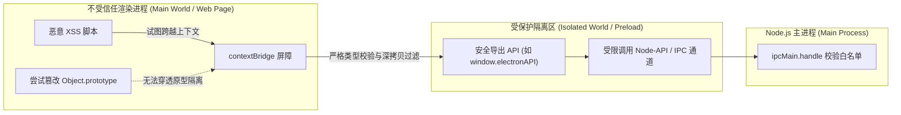

# 进程通信与安全防御

import ipcPerfHtml from '!!raw-loader!./answers/p0-electron-ipc-performance/index.html'

---

## Electron IPC 进程间通信机制（ipcMain / ipcRenderer / MessagePort）与大数据量零拷贝传输优化？ {#p0-electron-ipc-performance}

<Answer>

**核心概念 / 核心结论:**

Electron 的进程间通信（IPC）底层基于 Chromium 的 **Mojo IPC 管道与命名管道 (Named Pipes / UNIX Domain Sockets)** 构建：
- **同步 IPC (`ipcRenderer.sendSync`)**：**工业级生产中的绝对反模式**。它会同步阻塞渲染进程的 JavaScript 主线程乃至主进程事件循环，导致界面丢帧、动画卡顿，极端情况下直接触发 UI 冻结。
- **异步双向 IPC (`ipcRenderer.invoke` / `ipcMain.handle`)**：基于 Promise 的主流通信模式。底层依赖 **V8 结构化克隆算法 (Structured Clone Algorithm)** 进行数据序列化与深拷贝反序列化。当传输数百兆大对象或密集日志流时，CPU 序列化开销与 V8 堆内存开销剧增。
- **`MessagePort` (MessageChannelMain)**：基于通道的双向直连通信，支持在主进程与渲染进程、或**两个渲染进程之间建立端到端直连隧道**。支持 `Transferable Objects`（如 `ArrayBuffer`），通过移交底层内存所有权（Ownership Transfer）避免内存深拷贝，传输耗时从百毫秒级降至微秒级。
- **真·零拷贝 (Zero-Copy) 与共享内存**：针对海量点云、音视频原始帧（YUV/RGB）或本地大型文件，应采用 `SharedArrayBuffer`（结合 `Atomics` 互斥原子操作）或封装 Node-API Native Addon（通过 `mmap` 共享系统虚拟内存地址），两端直接并发读写同一块物理内存。

---

**原理解析:**

**可运行沙盒：Transferable 零拷贝所有权移交 vs 深拷贝实测**

<CustomSandPack
  template="static"
  options={{
    showConsole: false,
    editorHeight: 390
  }}
  files={{
    "/index.html": ipcPerfHtml
  }}
/>

### 1. 通信模式与传输损耗对比

```txt
[ 传统中转模式 (主进程中转) ]
  Renderer A  ──(Mojo IPC: 深拷贝)──>  Main Process  ──(Mojo IPC: 深拷贝)──>  Renderer B
  * 缺点：2倍传输时延，主进程沦为巨型数据路由器，易造成主进程事件泵背压 (Backpressure)。

[ 现代 MessagePort 直连模式 ]
  Renderer A  ◀─────────────────(MessagePort Direct Tunnel)─────────────────▶  Renderer B
  * 优点：主进程仅在握手阶段分发 Port，后续数据点对点直达，不占用主进程 CPU。

[ 大数据量 Transferable 移交机制 ]
  Sender Context                                            Receiver Context
  +----------------------+                                  +----------------------+
  | ArrayBuffer Ref [0x1]| ─── Ownership Transferred ───>   | ArrayBuffer Ref [0x1]|
  | byteLength: 0 (Neut) |                                  | byteLength: 100MB    |
  +----------------------+                                  +----------------------+
  * 内存指针直接移交，发送端引用失活 (Neutered)，零内存额外分配。
```

### 2. IPC 传输方案选型矩阵

| 通信方式 | 底层传输协议 | 序列化机制 | 适用数据规模 | 跨渲染进程直通 | 性能特征 |
| :--- | :--- | :--- | :--- | :--- | :--- |
| `ipcRenderer.send` / `on` | Mojo IPC 单向事件 | 结构化克隆 (Structured Clone) | 小于 100KB | 否 (须主进程转发) | 适合轻量单向通知 |
| `ipcRenderer.invoke` / `handle` | Mojo IPC 双向 Promise | 结构化克隆 (深拷贝) | 小于 1MB | 否 | 结构清晰，语义严谨 |
| `MessagePort` (Transferable) | 端到端直接信道 | 转移内存所有权 (Transfer) | 1MB ~ 500MB | 是 (点对点直连) | 内存零额外分配，微秒级延迟 |
| `SharedArrayBuffer` / `mmap` | 操作系统共享物理内存页 | 零拷贝 (直接读写物理内存) | 大于 500MB 或实时数据流 | 是 | 性能极限，但需配置安全隔离头 |

---

**规范代码实现 / 选型对比:**

以下为工业级生产环境中，基于 `MessageChannelMain` 构建的双渲染进程直通隧道与 `Transferable ArrayBuffer` 传输总线：

```typescript
// main/channel-hub.ts (主进程：充当握手仲裁者，建立直连通道)
import { BrowserWindow, MessageChannelMain, ipcMain } from 'electron';

export class IpcChannelHub {
  /**
   * 在两个独立的 BrowserWindow 之间建立 MessagePort 直通通信隧道
   */
  public static establishDirectTunnel(winA: BrowserWindow, winB: BrowserWindow): void {
    // 创建双向消息通道
    const { port1, port2 } = new MessageChannelMain();

    // 将 port1 分发给窗口 A
    winA.webContents.postMessage('port-transfer-init', { remoteRole: 'peer-window' }, [port1]);
    // 将 port2 分发给窗口 B
    winB.webContents.postMessage('port-transfer-init', { remoteRole: 'peer-window' }, [port2]);

    console.info('[ChannelHub] Direct MessagePort tunnel established between Window ' + winA.id + ' and ' + winB.id);
  }
}
```

```typescript
// renderer/transferable-sender.ts (渲染进程 A：使用 Transferable 移交内存所有权)
export class BigDataSender {
  private port: MessagePort | null = null;

  constructor() {
    window.addEventListener('message', (event) => {
      // 接收主进程注入的直连 MessagePort
      if (event.data?.type === 'port-transfer-init' && event.ports[0]) {
        this.port = event.ports[0];
        this.setupPortListener();
      }
    });
  }

  private setupPortListener(): void {
    if (!this.port) return;
    this.port.onmessage = (event) => {
      console.log('[DirectTunnel] Received ACK:', event.data);
    };
  }

  /**
   * 发送百兆大二进制数据（零拷贝所有权移交）
   */
  public transferHugeBuffer(binaryData: Uint8Array): void {
    if (!this.port) {
      throw new Error('MessagePort tunnel not ready');
    }

    const rawBuffer = binaryData.buffer;
    console.log('[Sender] Before transfer: byteLength = ' + rawBuffer.byteLength);

    // 将 rawBuffer 放入 transfer 列表中移交所有权
    this.port.postMessage(
      { type: 'HUGE_DATA_PAYLOAD', timestamp: Date.now(), buffer: rawBuffer },
      [rawBuffer] // 移交所有权，避免 Structured Clone 深拷贝
    );

    // 移交后原缓冲区变为中性化（Neutered），长度变为 0，防止两端并发竞态修改
    console.log('[Sender] After transfer (neutered): byteLength = ' + rawBuffer.byteLength); // 0
  }
}
```

---

**面试官视角:**

- **核心考察点**:
  1. 准确剖析 `ipcRenderer.sendSync` 导致主进程与渲染进程双向死锁的底层时序；
  2. 深入理解 V8 结构化克隆与 `Transferable` 转移语义的技术本质；
  3. 能够设计高并发多窗口桌面应用（如即时通讯群聊多窗口、专业音频/图形编辑工作站）的端到端通信拓扑。
- **加分项**:
  - 清晰指出 `SharedArrayBuffer` 在 Chromium 中出于防范 Spectre / Meltdown 侧信道攻击的限制，必须在主进程配置 `Cross-Origin-Opener-Policy: same-origin` 与 `Cross-Origin-Embedder-Policy: require-corp` HTTP 安全头才能启用。
- **下探追问链**:
  - *追问 1*：为什么说如果所有渲染进程通信都由主进程中转，很容易引起主进程的“背压 (Backpressure)”？
    - *回答要点*：若渲染进程 A 每秒产生 100 条包含大量数据的消息，而目标渲染进程 B 处理较慢，主进程作为中转方必须在内存中缓冲这些队列。如果队列增速大于消费速度，主进程内存会迅速暴涨，同时主进程事件循环被大量的反序列化任务填满，拖垮整个应用的窗口调度。
  - *追问 2*：结构化克隆算法（Structured Clone）支持哪些数据类型？不能克隆什么？
    - *回答要点*：原生支持 Map、Set、Date、RegExp、ArrayBuffer、TypedArray 以及具备循环引用的对象。但**无法克隆 Function、DOM 节点、WeakMap/WeakSet 以及对象的原型链与 Getter/Setter**。

---

**延伸阅读:**
- [Electron 官方指南：MessagePorts in Electron](https://www.electronjs.org/docs/latest/tutorial/message-ports)
- [MDN Web Docs: Transferable objects](https://developer.mozilla.org/en-US/docs/Web/API/Web_Workers_API/Transferable_objects)

</Answer>

---

## Electron 安全基线防御（contextIsolation, nodeIntegration, contextBridge, preload 沙箱与 Webview 隔离）？ {#p0-electron-security-baseline}

<Answer>

**核心概念 / 核心结论:**

在桌面端混合架构中，**XSS（跨站脚本攻击）漏洞极易直接升级为 RCE（远程命令执行 Remote Code Execution）**。攻击者只要在前端页面注入恶意 JS 代码，若配置不当即可调用底层系统 Shell 格式化磁盘或下载木马。

工业级 Electron 必须构建**五层纵深防御安全基线**：
1. **`contextIsolation: true` (必须强开)**：开启上下文隔离，使 Preload 脚本运行在一个受保护的独立 JavaScript 上下文（Context）中，与网页本身的 `window` 隔离开，彻底切断原型链污染（Prototype Pollution）导致的沙箱逃逸。
2. **`nodeIntegration: false` (严禁开启)**：杜绝渲染进程直接执行 `require('node:child_process')`、`require('node:fs')` 的可能。
3. **`contextBridge.exposeInMainWorld` (唯一安全接口暴露渠道)**：仅向宿主页面暴露经过严格校验的有限白名单函数，**严禁将原始 `ipcRenderer` 或带有任意事件监听/派发能力的对象直接挂载到 `window`**。
4. **`sandbox: true` (渲染沙箱)**：开启 Chromium OS 级安全沙箱，渲染进程无法直接执行操作系统系统调用（Syscalls）。
5. **视图与导航安全加固**：全面废弃具备已知隔离隐患的 `<webview>` 标签，改用受控的 `WebContentsView` 或 `BrowserView`；全局拦截不受信任的外链导航（`will-navigate`）与弹窗（`setWindowOpenHandler`），强制配置生产级 CSP。

---

**原理解析:**

### 1. contextIsolation 隔离与防御架构



```txt
[ 攻击场景：contextIsolation = false ]
  Untrusted Web Page (XSS)
    └── 污染原型：Array.prototype.push = function() { /* 窃取敏感句柄 */ }
          ▲ (共享相同的 V8 原型链)
  Preload Script (拥有 Node 权限)
    └── 执行内置逻辑: internalArray.push(nativeModule) ---> 触发被篡改原型 ---> 恶意代码获取 Node 权限 ---> RCE!

[ 防御场景：contextIsolation = true ]
  Main World (Untrusted Page)             Isolated World (Preload Script)
  +-------------------------------+       +-------------------------------+
  | Object.prototype (Tainted)    |       | Object.prototype (Clean)      |
  | Array.prototype (Tainted)     |       | Array.prototype (Clean)       |
  | window.api.openFile()         |       | contextBridge 代理转发通道     |
  +---------------+---------------+       +---------------+---------------+
                  │                                       │
                  └──────── contextBridge 安全克隆 ────────┘
                    * 深度递归冻结、剥离恶意原型与 Getter
```

### 2. 核心安全配置基线检查表

| 安全配置项 | 生产推荐值 | 违规风险等级 | 潜在攻击后果 |
| :--- | :--- | :--- | :--- |
| `contextIsolation` | `true` | **CRITICAL (致命)** | 网页 XSS 可通过原型污染劫持 Preload 中的私有变量实现 RCE |
| `nodeIntegration` | `false` | **CRITICAL (致命)** | 网页中直接输入 `<script>require('child_process').exec('calc')</script>` 导致沦陷 |
| `sandbox` | `true` | **HIGH (高危)** | 渲染器漏洞利用，攻击者绕过浏览器限制直接操作本地文件句柄 |
| 暴露 `ipcRenderer` | **严禁完整暴露** | **CRITICAL (致命)** | 攻击者可向任意内部私有 channel 伪造请求，直接触发主进程高危操作 |
| `<webview>` 标签 | `webviewTag: false` | **HIGH (高危)** | 旧版 webview 具有独立进程配置缺陷，容易被 CSS 覆写及上下文越权 |
| 导航拦截 (`will-navigate`) | 强制白名单校验 | **MEDIUM (中危)** | 用户点击恶意钓鱼链接或被重定向到不受信任页面导致凭据被盗 |

---

**规范代码实现 / 选型对比:**

以下为工业级生产环境中标准的 Preload 安全暴露与主进程安全拦截网：

```typescript
// preload/index.ts (安全 Preload 脚本)
import { contextBridge, ipcRenderer } from 'electron';

// 严格白名单通道校验
const VALID_CHANNELS = {
  INVOKE: ['workspace:load-files', 'auth:get-token'],
  SEND: ['telemetry:log-event'],
  RECEIVE: ['download:progress-update'],
} as const;

// 对外暴露的强类型 API
export interface DesktopBridgeAPI {
  loadFiles: (dir: string) => Promise<string[]>;
  logEvent: (event: string, payload: unknown) => void;
  onProgress: (callback: (progress: number) => void) => () => void;
}

const safeBridge: DesktopBridgeAPI = {
  loadFiles: async (dir: string) => {
    // 参数类型与通道白名单防御
    if (typeof dir !== 'string') {
      throw new TypeError('Invalid argument: dir must be a string');
    }
    return ipcRenderer.invoke('workspace:load-files', dir);
  },

  logEvent: (event: string, payload: unknown) => {
    if (typeof event !== 'string') return;
    ipcRenderer.send('telemetry:log-event', { event, payload });
  },

  onProgress: (callback: (progress: number) => void) => {
    const listener = (_: Electron.IpcRendererEvent, progress: number) => {
      if (typeof progress === 'number') {
        callback(progress);
      }
    };
    ipcRenderer.on('download:progress-update', listener);
    // 返回注销函数，防止内存泄漏
    return () => {
      ipcRenderer.removeListener('download:progress-update', listener);
    };
  },
};

// 仅在安全桥接中暴露受限对象，杜绝暴露原始 ipcRenderer
contextBridge.exposeInMainWorld('desktopAPI', safeBridge);
```

```typescript
// main/security-guard.ts (主进程：全局安全拦截守卫)
import { app, BrowserWindow, shell, session } from 'electron';
import * as url from 'node:url';

export class SecurityGuard {
  private static readonly ALLOWED_HOSTS = new Set(['app.internal.corp', 'localhost:3000']);

  public static enforceGlobalSecurity(): void {
    // 1. 全局监听 WebContents 创建
    app.on('web-contents-created', (_, webContents) => {
      // 拦截页面尝试通过 window.open 打开不受信任的窗口
      webContents.setWindowOpenHandler(({ url: targetUrl }) => {
        const parsed = new URL(targetUrl);
        // 如果是外部链接，交由系统默认安全浏览器打开，不在 Electron 内部加载
        if (!this.ALLOWED_HOSTS.has(parsed.host)) {
          shell.openExternal(targetUrl);
          return { action: 'deny' };
        }
        return { action: 'allow' };
      });

      // 拦截页面直接 location.href 跳转到外部网站
      webContents.on('will-navigate', (event, targetUrl) => {
        const parsed = new URL(targetUrl);
        if (!this.ALLOWED_HOSTS.has(parsed.host)) {
          event.preventDefault();
          console.warn('[SecurityGuard] Blocked untrusted navigation to: ' + targetUrl);
          shell.openExternal(targetUrl);
        }
      });

      // 拦截不安全的 webview 创建
      webContents.on('will-attach-webview', (event) => {
        event.preventDefault();
        console.error('[SecurityGuard] Deprecated <webview> tag usage blocked.');
      });
    });

    // 2. 动态注入生产级安全 CSP (Content-Security-Policy)
    session.defaultSession.webRequest.onHeadersReceived((details, callback) => {
      callback({
        responseHeaders: {
          ...details.responseHeaders,
          'Content-Security-Policy': [
            "default-src 'self'; script-src 'self'; style-src 'self' 'unsafe-inline'; img-src 'self' data: https:; connect-src 'self' https://api.internal.corp;"
          ],
        },
      });
    });

    // 3. 严格限制敏感设备权限请求 (麦克风、摄像头、地理位置、系统通知)
    session.defaultSession.setPermissionRequestHandler((webContents, permission, callback) => {
      const parsed = new URL(webContents.getURL());
      if (this.ALLOWED_HOSTS.has(parsed.host) && permission === 'notifications') {
        return callback(true);
      }
      // 默认全部拒绝
      return callback(false);
    });
  }
}
```

---

**面试官视角:**

- **核心考察点**:
  1. 能否用攻击者视角推演 XSS 转化为 RCE 的完整利用路径；
  2. 深刻理解为什么不能将 `ipcRenderer` 直接透传给 `window`（即使开启了 `contextIsolation`）；
  3. 全面掌握针对外链、弹窗、权限和 CSP 的企业级防护网设计。
- **加分项**:
  - 了解 `contextBridge` 的防篡改细节：`contextBridge` 会对传入和传出的原型链做深度冻结（Deep Freeze）与不可变代理，即使攻击者尝试给返回对象覆写 `__proto__`，也不会渗透到 Preload 内部。
- **下探追问链**:
  - *追问 1*：如果我的桌面端必须嵌入展示不可控的第三方客户网页（如企业微信或钉钉的工作台外链），你会如何架构？
    - *回答要点*：严禁在现有 `BrowserWindow` 中直接导航或使用 `<webview>`。必须使用 `WebContentsView`（或 `BrowserView`），设置独立的 `partition`（隔离 Session、Cookie 与 LocalStorage），强开沙箱，不加载任何包含原生能力的 Preload 脚本，并对权限请求全量拦截。
  - *追问 2*：为什么 Electron 官方强烈建议配置 CSP 并禁用 `'unsafe-eval'`？
    - *回答要点*：`eval()` 或 `new Function()` 可以将字符串作为可执行代码运行。如果应用存在 XSS 漏洞，禁用 `'unsafe-eval'` 可以直接在引擎层阻止攻击者利用动态字符串执行未编译的恶意 Payload。

---

**延伸阅读:**
- [Electron 官方指南：Security, Native Capabilities, and Your Responsibility](https://www.electronjs.org/docs/latest/tutorial/security)
- [Context Isolation 官方深度设计](https://www.electronjs.org/docs/latest/tutorial/context-isolation)

</Answer>
