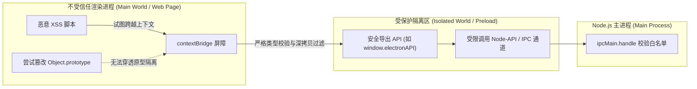
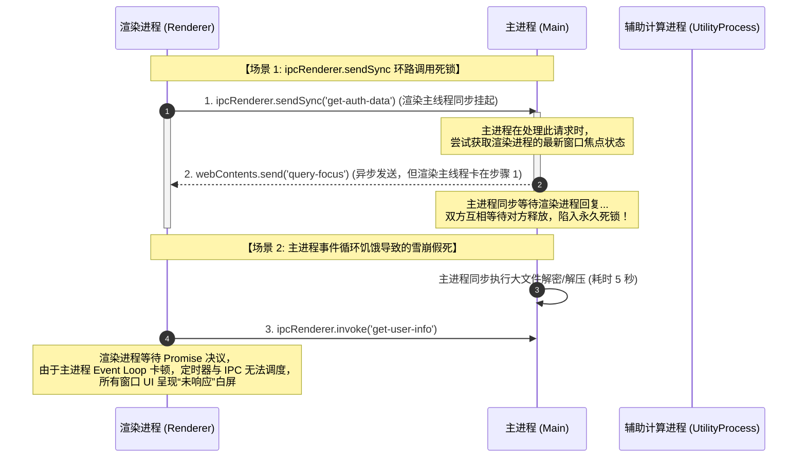

# 进程通信与安全防御

import ipcPerfHtml from '!!raw-loader!./answers/p0-electron-ipc-performance/index.html'

---

## Electron IPC 通信有哪些方式？大数据量传输时如何避免卡顿并实现零拷贝？ {#p0-electron-ipc-performance}

<Answer>

**核心概念 / 核心结论:**

Electron 的进程间通信（IPC）底层基于 Chromium 的 **Mojo IPC 管道与命名管道 (Named Pipes / UNIX Domain Sockets)** 构建：
- **同步 IPC (`ipcRenderer.sendSync`)**：**工业级生产中的绝对反模式**。它会同步阻塞渲染进程的 JavaScript 主线程乃至主进程事件循环，导致界面丢帧、动画卡顿，极端情况下直接触发 UI 冻结。
- **异步双向 IPC (`ipcRenderer.invoke` / `ipcMain.handle`)**：基于 Promise 的主流通信模式。底层依赖 **V8 结构化克隆算法 (Structured Clone Algorithm)** 进行数据序列化与深拷贝反序列化。当传输数百兆大对象或密集日志流时，CPU 序列化开销与 V8 堆内存开销剧增。
- **`MessagePort` (MessageChannelMain)**：基于通道的双向直连通信，支持在主进程与渲染进程、或**两个渲染进程之间建立端到端直连隧道**。支持 `Transferable Objects`（如 `ArrayBuffer`），通过移交底层内存所有权（Ownership Transfer）避免内存深拷贝，传输耗时从百毫秒级降至微秒级。
- **真·零拷贝 (Zero-Copy) 与共享内存**：针对海量点云、音视频原始帧（YUV/RGB）或本地大型文件，应采用 `SharedArrayBuffer`（结合 `Atomics` 互斥原子操作）或封装 Node-API Native Addon（通过 `mmap` 共享系统虚拟内存地址），两端直接并发读写同一块物理内存。

---

**原理解析:**

**可运行沙盒：Transferable 零拷贝所有权移交 vs 深拷贝实测**

<CustomSandPack
  template="static"
  options={{
    showConsole: false,
    editorHeight: 390
  }}
  files={{
    "/index.html": ipcPerfHtml
  }}
/>

**1. 通信模式与传输损耗对比:**


```txt
[ 传统中转模式 (主进程中转) ]
  Renderer A  ──(Mojo IPC: 深拷贝)──>  Main Process  ──(Mojo IPC: 深拷贝)──>  Renderer B
  * 缺点：2倍传输时延，主进程沦为巨型数据路由器，易造成主进程事件泵背压 (Backpressure)。

[ 现代 MessagePort 直连模式 ]
  Renderer A  ◀─────────────────(MessagePort Direct Tunnel)─────────────────▶  Renderer B
  * 优点：主进程仅在握手阶段分发 Port，后续数据点对点直达，不占用主进程 CPU。

[ 大数据量 Transferable 移交机制 ]
  Sender Context                                            Receiver Context
  +----------------------+                                  +----------------------+
  | ArrayBuffer Ref [0x1]| ─── Ownership Transferred ───>   | ArrayBuffer Ref [0x1]|
  | byteLength: 0 (Neut) |                                  | byteLength: 100MB    |
  +----------------------+                                  +----------------------+
  * 内存指针直接移交，发送端引用失活 (Neutered)，零内存额外分配。
```

**2. IPC 传输方案选型矩阵:**


| 通信方式 | 底层传输协议 | 序列化机制 | 适用数据规模 | 跨渲染进程直通 | 性能特征 |
| :--- | :--- | :--- | :--- | :--- | :--- |
| `ipcRenderer.send` / `on` | Mojo IPC 单向事件 | 结构化克隆 (Structured Clone) | 小于 100KB | 否 (须主进程转发) | 适合轻量单向通知 |
| `ipcRenderer.invoke` / `handle` | Mojo IPC 双向 Promise | 结构化克隆 (深拷贝) | 小于 1MB | 否 | 结构清晰，语义严谨 |
| `MessagePort` (Transferable) | 端到端直接信道 | 转移内存所有权 (Transfer) | 1MB ~ 500MB | 是 (点对点直连) | 内存零额外分配，微秒级延迟 |
| `SharedArrayBuffer` / `mmap` | 操作系统共享物理内存页 | 零拷贝 (直接读写物理内存) | 大于 500MB 或实时数据流 | 是 | 性能极限，但需配置安全隔离头 |

---

**规范代码实现 / 选型对比:**

以下为工业级生产环境中，基于 `MessageChannelMain` 构建的双渲染进程直通隧道与 `Transferable ArrayBuffer` 传输总线：

```typescript
// main/channel-hub.ts (主进程：充当握手仲裁者，建立直连通道)
import { BrowserWindow, MessageChannelMain, ipcMain } from 'electron';

export class IpcChannelHub {
  /**
   * 在两个独立的 BrowserWindow 之间建立 MessagePort 直通通信隧道
   */
  public static establishDirectTunnel(winA: BrowserWindow, winB: BrowserWindow): void {
    // 创建双向消息通道
    const { port1, port2 } = new MessageChannelMain();

    // 将 port1 分发给窗口 A
    winA.webContents.postMessage('port-transfer-init', { remoteRole: 'peer-window' }, [port1]);
    // 将 port2 分发给窗口 B
    winB.webContents.postMessage('port-transfer-init', { remoteRole: 'peer-window' }, [port2]);

    console.info('[ChannelHub] Direct MessagePort tunnel established between Window ' + winA.id + ' and ' + winB.id);
  }
}
```

```typescript
// renderer/transferable-sender.ts (渲染进程 A：使用 Transferable 移交内存所有权)
export class BigDataSender {
  private port: MessagePort | null = null;

  constructor() {
    window.addEventListener('message', (event) => {
      // 接收主进程注入的直连 MessagePort
      if (event.data?.type === 'port-transfer-init' && event.ports[0]) {
        this.port = event.ports[0];
        this.setupPortListener();
      }
    });
  }

  private setupPortListener(): void {
    if (!this.port) return;
    this.port.onmessage = (event) => {
      console.log('[DirectTunnel] Received ACK:', event.data);
    };
  }

  /**
   * 发送百兆大二进制数据（零拷贝所有权移交）
   */
  public transferHugeBuffer(binaryData: Uint8Array): void {
    if (!this.port) {
      throw new Error('MessagePort tunnel not ready');
    }

    const rawBuffer = binaryData.buffer;
    console.log('[Sender] Before transfer: byteLength = ' + rawBuffer.byteLength);

    // 将 rawBuffer 放入 transfer 列表中移交所有权
    this.port.postMessage(
      { type: 'HUGE_DATA_PAYLOAD', timestamp: Date.now(), buffer: rawBuffer },
      [rawBuffer] // 移交所有权，避免 Structured Clone 深拷贝
    );

    // 移交后原缓冲区变为中性化（Neutered），长度变为 0，防止两端并发竞态修改
    console.log('[Sender] After transfer (neutered): byteLength = ' + rawBuffer.byteLength); // 0
  }
}
```

---

**面试官视角:**

- **核心考察点**:
  1. 准确剖析 `ipcRenderer.sendSync` 导致主进程与渲染进程双向死锁的底层时序；
  2. 深入理解 V8 结构化克隆与 `Transferable` 转移语义的技术本质；
  3. 能够设计高并发多窗口桌面应用（如即时通讯群聊多窗口、专业音频/图形编辑工作站）的端到端通信拓扑。
- **加分项**:
  - 清晰指出 `SharedArrayBuffer` 在 Chromium 中出于防范 Spectre / Meltdown 侧信道攻击的限制，必须在主进程配置 `Cross-Origin-Opener-Policy: same-origin` 与 `Cross-Origin-Embedder-Policy: require-corp` HTTP 安全头才能启用。
- **下探追问链**:
  - *追问 1*：为什么说如果所有渲染进程通信都由主进程中转，很容易引起主进程的“背压 (Backpressure)”？
    - *回答要点*：若渲染进程 A 每秒产生 100 条包含大量数据的消息，而目标渲染进程 B 处理较慢，主进程作为中转方必须在内存中缓冲这些队列。如果队列增速大于消费速度，主进程内存会迅速暴涨，同时主进程事件循环被大量的反序列化任务填满，拖垮整个应用的窗口调度。
  - *追问 2*：结构化克隆算法（Structured Clone）支持哪些数据类型？不能克隆什么？
    - *回答要点*：原生支持 Map、Set、Date、RegExp、ArrayBuffer、TypedArray 以及具备循环引用的对象。但**无法克隆 Function、DOM 节点、WeakMap/WeakSet 以及对象的原型链与 Getter/Setter**。

---

**延伸阅读:**
- [Electron 官方指南：MessagePorts in Electron](https://www.electronjs.org/docs/latest/tutorial/message-ports)
- [MDN Web Docs: Transferable objects](https://developer.mozilla.org/en-US/docs/Web/API/Web_Workers_API/Transferable_objects)

</Answer>

---

## Electron 桌面应用有哪些常见的安全风险？如何构建严密的安全防御基线？ {#p0-electron-security-baseline}

<Answer>

**核心概念 / 核心结论:**

在桌面端混合架构中，**XSS（跨站脚本攻击）漏洞极易直接升级为 RCE（远程命令执行 Remote Code Execution）**。攻击者只要在前端页面注入恶意 JS 代码，若配置不当即可调用底层系统 Shell 格式化磁盘或下载木马。

工业级 Electron 必须构建**五层纵深防御安全基线**：
1. **`contextIsolation: true` (必须强开)**：开启上下文隔离，使 Preload 脚本运行在一个受保护的独立 JavaScript 上下文（Context）中，与网页本身的 `window` 隔离开，彻底切断原型链污染（Prototype Pollution）导致的沙箱逃逸。
2. **`nodeIntegration: false` (严禁开启)**：杜绝渲染进程直接执行 `require('node:child_process')`、`require('node:fs')` 的可能。
3. **`contextBridge.exposeInMainWorld` (唯一安全接口暴露渠道)**：仅向宿主页面暴露经过严格校验的有限白名单函数，**严禁将原始 `ipcRenderer` 或带有任意事件监听/派发能力的对象直接挂载到 `window`**。
4. **`sandbox: true` (渲染沙箱)**：开启 Chromium OS 级安全沙箱，渲染进程无法直接执行操作系统系统调用（Syscalls）。
5. **视图与导航安全加固**：全面废弃具备已知隔离隐患的 `<webview>` 标签，改用受控的 `WebContentsView` 或 `BrowserView`；全局拦截不受信任的外链导航（`will-navigate`）与弹窗（`setWindowOpenHandler`），强制配置生产级 CSP。

---

**原理解析:**

**1. contextIsolation 隔离与防御架构:**




```txt
[ 攻击场景：contextIsolation = false ]
  Untrusted Web Page (XSS)
    └── 污染原型：Array.prototype.push = function() { /* 窃取敏感句柄 */ }
          ▲ (共享相同的 V8 原型链)
  Preload Script (拥有 Node 权限)
    └── 执行内置逻辑: internalArray.push(nativeModule) ---> 触发被篡改原型 ---> 恶意代码获取 Node 权限 ---> RCE!

[ 防御场景：contextIsolation = true ]
  Main World (Untrusted Page)             Isolated World (Preload Script)
  +-------------------------------+       +-------------------------------+
  | Object.prototype (Tainted)    |       | Object.prototype (Clean)      |
  | Array.prototype (Tainted)     |       | Array.prototype (Clean)       |
  | window.api.openFile()         |       | contextBridge 代理转发通道     |
  +---------------+---------------+       +---------------+---------------+
                  │                                       │
                  └──────── contextBridge 安全克隆 ────────┘
                    * 深度递归冻结、剥离恶意原型与 Getter
```

**2. 核心安全配置基线检查表:**


| 安全配置项 | 生产推荐值 | 违规风险等级 | 潜在攻击后果 |
| :--- | :--- | :--- | :--- |
| `contextIsolation` | `true` | **CRITICAL (致命)** | 网页 XSS 可通过原型污染劫持 Preload 中的私有变量实现 RCE |
| `nodeIntegration` | `false` | **CRITICAL (致命)** | 网页中直接输入 `<script>require('child_process').exec('calc')</script>` 导致沦陷 |
| `sandbox` | `true` | **HIGH (高危)** | 渲染器漏洞利用，攻击者绕过浏览器限制直接操作本地文件句柄 |
| 暴露 `ipcRenderer` | **严禁完整暴露** | **CRITICAL (致命)** | 攻击者可向任意内部私有 channel 伪造请求，直接触发主进程高危操作 |
| `<webview>` 标签 | `webviewTag: false` | **HIGH (高危)** | 旧版 webview 具有独立进程配置缺陷，容易被 CSS 覆写及上下文越权 |
| 导航拦截 (`will-navigate`) | 强制白名单校验 | **MEDIUM (中危)** | 用户点击恶意钓鱼链接或被重定向到不受信任页面导致凭据被盗 |

---

**规范代码实现 / 选型对比:**

以下为工业级生产环境中标准的 Preload 安全暴露与主进程安全拦截网：

```typescript
// preload/index.ts (安全 Preload 脚本)
import { contextBridge, ipcRenderer } from 'electron';

// 严格白名单通道校验
const VALID_CHANNELS = {
  INVOKE: ['workspace:load-files', 'auth:get-token'],
  SEND: ['telemetry:log-event'],
  RECEIVE: ['download:progress-update'],
} as const;

// 对外暴露的强类型 API
export interface DesktopBridgeAPI {
  loadFiles: (dir: string) => Promise<string[]>;
  logEvent: (event: string, payload: unknown) => void;
  onProgress: (callback: (progress: number) => void) => () => void;
}

const safeBridge: DesktopBridgeAPI = {
  loadFiles: async (dir: string) => {
    // 参数类型与通道白名单防御
    if (typeof dir !== 'string') {
      throw new TypeError('Invalid argument: dir must be a string');
    }
    return ipcRenderer.invoke('workspace:load-files', dir);
  },

  logEvent: (event: string, payload: unknown) => {
    if (typeof event !== 'string') return;
    ipcRenderer.send('telemetry:log-event', { event, payload });
  },

  onProgress: (callback: (progress: number) => void) => {
    const listener = (_: Electron.IpcRendererEvent, progress: number) => {
      if (typeof progress === 'number') {
        callback(progress);
      }
    };
    ipcRenderer.on('download:progress-update', listener);
    // 返回注销函数，防止内存泄漏
    return () => {
      ipcRenderer.removeListener('download:progress-update', listener);
    };
  },
};

// 仅在安全桥接中暴露受限对象，杜绝暴露原始 ipcRenderer
contextBridge.exposeInMainWorld('desktopAPI', safeBridge);
```

```typescript
// main/security-guard.ts (主进程：全局安全拦截守卫)
import { app, BrowserWindow, shell, session } from 'electron';
import * as url from 'node:url';

export class SecurityGuard {
  private static readonly ALLOWED_HOSTS = new Set(['app.internal.corp', 'localhost:3000']);

  public static enforceGlobalSecurity(): void {
    // 1. 全局监听 WebContents 创建
    app.on('web-contents-created', (_, webContents) => {
      // 拦截页面尝试通过 window.open 打开不受信任的窗口
      webContents.setWindowOpenHandler(({ url: targetUrl }) => {
        const parsed = new URL(targetUrl);
        // 如果是外部链接，交由系统默认安全浏览器打开，不在 Electron 内部加载
        if (!this.ALLOWED_HOSTS.has(parsed.host)) {
          shell.openExternal(targetUrl);
          return { action: 'deny' };
        }
        return { action: 'allow' };
      });

      // 拦截页面直接 location.href 跳转到外部网站
      webContents.on('will-navigate', (event, targetUrl) => {
        const parsed = new URL(targetUrl);
        if (!this.ALLOWED_HOSTS.has(parsed.host)) {
          event.preventDefault();
          console.warn('[SecurityGuard] Blocked untrusted navigation to: ' + targetUrl);
          shell.openExternal(targetUrl);
        }
      });

      // 拦截不安全的 webview 创建
      webContents.on('will-attach-webview', (event) => {
        event.preventDefault();
        console.error('[SecurityGuard] Deprecated <webview> tag usage blocked.');
      });
    });

    // 2. 动态注入生产级安全 CSP (Content-Security-Policy)
    session.defaultSession.webRequest.onHeadersReceived((details, callback) => {
      callback({
        responseHeaders: {
          ...details.responseHeaders,
          'Content-Security-Policy': [
            "default-src 'self'; script-src 'self'; style-src 'self' 'unsafe-inline'; img-src 'self' data: https:; connect-src 'self' https://api.internal.corp;"
          ],
        },
      });
    });

    // 3. 严格限制敏感设备权限请求 (麦克风、摄像头、地理位置、系统通知)
    session.defaultSession.setPermissionRequestHandler((webContents, permission, callback) => {
      const parsed = new URL(webContents.getURL());
      if (this.ALLOWED_HOSTS.has(parsed.host) && permission === 'notifications') {
        return callback(true);
      }
      // 默认全部拒绝
      return callback(false);
    });
  }
}
```

---

**面试官视角:**

- **核心考察点**:
  1. 能否用攻击者视角推演 XSS 转化为 RCE 的完整利用路径；
  2. 深刻理解为什么不能将 `ipcRenderer` 直接透传给 `window`（即使开启了 `contextIsolation`）；
  3. 全面掌握针对外链、弹窗、权限和 CSP 的企业级防护网设计。
- **加分项**:
  - 了解 `contextBridge` 的防篡改细节：`contextBridge` 会对传入和传出的原型链做深度冻结（Deep Freeze）与不可变代理，即使攻击者尝试给返回对象覆写 `__proto__`，也不会渗透到 Preload 内部。
- **下探追问链**:
  - *追问 1*：如果我的桌面端必须嵌入展示不可控的第三方客户网页（如企业微信或钉钉的工作台外链），你会如何架构？
    - *回答要点*：严禁在现有 `BrowserWindow` 中直接导航或使用 `<webview>`。必须使用 `WebContentsView`（或 `BrowserView`），设置独立的 `partition`（隔离 Session、Cookie 与 LocalStorage），强开沙箱，不加载任何包含原生能力的 Preload 脚本，并对权限请求全量拦截。
  - *追问 2*：为什么 Electron 官方强烈建议配置 CSP 并禁用 `'unsafe-eval'`？
    - *回答要点*：`eval()` 或 `new Function()` 可以将字符串作为可执行代码运行。如果应用存在 XSS 漏洞，禁用 `'unsafe-eval'` 可以直接在引擎层阻止攻击者利用动态字符串执行未编译的恶意 Payload。

---

**延伸阅读:**
- [Electron 官方指南：Security, Native Capabilities, and Your Responsibility](https://www.electronjs.org/docs/latest/tutorial/security)
- [Context Isolation 官方深度设计](https://www.electronjs.org/docs/latest/tutorial/context-isolation)

</Answer>

---

## Electron 中如何用 SharedArrayBuffer 与 Atomics 实现多进程共享内存通信？如何防御 IPC 死锁？ {#p0-electron-shared-memory-ipc}

<Answer>

**核心结论:**


在现代高性能 Electron 桌面应用开发中，面对大型音视频帧转换、图像滤镜渲染、本地巨型日志分析检索、文件解密与端侧 AI 推理等 CPU 密集型场景，传统的 IPC 架构面临两大致命瓶颈：
1. **主进程事件循环饥饿与 UI 假死**：若将耗时计算置于主进程，将直接卡死管理窗口和原生系统事件的主线程；若在渲染进程通过同步 IPC（`ipcRenderer.sendSync`）等待结果，渲染主线程会被强行挂起，触发操作系统“窗口未响应”甚至白屏崩溃。
2. **结构化克隆（Structured Clone）的巨大拷贝开销**：传统 IPC 基于 Chromium Mojo 管道，每次传输百兆级大内存数据均需经历“内存深拷贝 -> 序列化 -> 跨进程传输 -> 反序列化 -> 内存分配”，CPU 序列化耗时高且引发 V8 频繁 GC。

**架构破局之道**：
- **`utilityProcess`（Electron 22+）的工业级定位**：基于 Chromium Utility 架构，提供专为重型后台计算设计的独立进程隔离容器。相比 Web Worker，它具备完整的 Node.js 原生 C++ 扩展支持（Node-API）与全量系统 I/O 权限；相比 `child_process.fork()`，它轻量度更高、开箱即用集成 Chromium 崩溃监控、原生支持 `MessagePort` 点对点直连。
- **共享内存与真·零拷贝（SharedArrayBuffer + Atomics）**：在开启跨域隔离（COOP/COEP）的前提下，通过 `utilityProcess` 与多渲染进程共享底层物理内存页。借助 `Atomics` 提供的原子操作与等待/唤醒原语（`wait` / `notify`），构建无锁环形缓冲区（Lock-Free RingBuffer），数据传输耗时从百毫秒降至微秒级（$O(1)$ 零序列化）。
- **全链路 IPC 死锁防御体系**：推行“静态 AST 禁绝 `sendSync` + 异步超时强断熔断器 + 无环通信拓扑 + 主进程事件循环延迟监测”，彻底杜绝因循环等待或任务饥饿引发的应用死锁。

---

**原理解析与架构设计:**


**1. 进程型态全方位横向选型矩阵**


在 Electron 架构中，不同计算载体的权责边界与技术特性对比如下：

| 进程 / 线程形态 | 核心职责定位 | Node.js 运行时能力 | 独立 V8 堆内存 | 原生 C++ 插件 (Node-API) | 崩溃隔离性 | 进程间通信 (IPC) 机制 |
| :--- | :--- | :--- | :--- | :--- | :--- | :--- |
| **Main Process** | 窗口生命周期、原生菜单、系统托盘、安全仲裁 | 完整 | 独立单例 | 支持 | 极低（崩溃全应用退出） | `ipcMain` / Mojo 管道 |
| **Renderer Process** | UI 视图渲染、DOM 树构建、用户交互响应 | 严禁开启（开启隔离） | 每个窗口独立 | 不支持 | 低（窗口白屏崩溃） | `ipcRenderer` (异步 invoke) |
| **Renderer Web Worker** | 页面内轻量数据计算、简单格式化 | 无（浏览器沙箱） | 共享所在渲染进程 | 不支持 | 中（Worker 独立终止） | `Worker.postMessage` |
| **child_process.fork** | 独立执行外部 Node.js 脚本 | 完整 | 独立进程 | 支持 | 高（但主进程难以管控生命周期） | 操作系统标准 IPC 管道 / stdio |
| **utilityProcess (Electron 22+)** | **重型后台计算、大文件编解码、端侧 AI 推理** | **完整 (支持 Node 模块与原生 Node-API)** | **独立轻量进程** | **完美支持** | **最高（独立崩溃不影响 UI，支持无感热重启）** | **MessagePort 直连 + 父子 stdio 监听** |

**2. 多进程共享内存通信拓扑架构**


通过 `utilityProcess`、主进程与多渲染进程的协同，构建零序列化开销的数据总线：

```mermaid
flowchart TD
    subgraph MainProcess["Electron 主进程 (Main Process)"]
        LifeManager["Utility 进程生命周期管理器\n- fork / respawn / crash 监控\n- MessageChannelMain 握手仲裁"]
    end

    subgraph MemoryLayer["共享物理内存抽象层 (Shared Memory Page)"]
        SAB["SharedArrayBuffer 物理内存页\n(需要 COOP/COEP 隔离标头)"]
        RingBuffer["无锁环形缓冲区 (Lock-Free RingBuffer)\nHeader [WriteIndex, ReadIndex, LockFlag] + Payload"]
        SAB --- RingBuffer
    end

    subgraph HeavyWorker["后台计算独立进程 (UtilityProcess)"]
        WorkerEngine["原生计算引擎 (Node-API / WASM / C++ Addon)"]
        AtomicsProducer["Atomics 生产者 (Writer)\n- Atomics.store / compareExchange\n- Atomics.notify 唤醒消费者"]
        WorkerEngine --> AtomicsProducer
    end

    subgraph RendererA["渲染进程 A (主工作台窗口)"]
        ConsumerA["Atomics 消费者 (Dedicated Web Worker 消费)\n- Atomics.wait 监听\n- 零拷贝直接读取内存渲染 4K 帧"]
    end

    subgraph RendererB["渲染进程 B (数据分析小窗)"]
        ConsumerB["Atomics 消费者 (微秒级并发读取)"]
    end

    LifeManager -->|1. 创建进程 & 分发 MessagePort| HeavyWorker
    LifeManager -->|2. 分发 MessagePort 隧道| RendererA
    LifeManager -->|2. 分发 MessagePort 隧道| RendererB
    
    HeavyWorker <==|3. 共享 SAB 内存句柄| MemoryLayer
    MemoryLayer ==>|4. 零拷贝并发直读| RendererA
    MemoryLayer ==>|4. 零拷贝并发直读| RendererB

    HeavyWorker <-.->|MessagePort 直连隧道 (控制信令 / 握手)| RendererA
```

**3. Atomics 与无锁环形缓冲区（Lock-Free RingBuffer）内部机制**


使用 `SharedArrayBuffer` 进行跨进程通信时，直接读写会导致数据竞态（Data Race）。因此必须结合 `Atomics` 构建无锁环形队列：
- **内存布局切分**：
  - **Header 控制区（前 64 字节）**：
    - `Header[0]`（4 字节）：`WriteIndex`（写入游标偏移，由生产者通过原子递增更新）。
    - `Header[1]`（4 字节）：`ReadIndex`（读取游标偏移，由消费者通过原子递增更新）。
    - `Header[2]`（4 字节）：`SyncFlag`（状态同步与通知标志位）。
  - **Payload 数据区（剩余内存）**：连续的定长环形数据槽，支持首尾循环读写。
- **线程同步原语**：
  - 生产者写入数据后，通过 `Atomics.notify(int32Array, index, count)` 唤醒处于睡眠等待的消费者。
  - 消费者在没有数据可读时，通过 `Atomics.wait(int32Array, index, expectedValue, timeout)` 挂起当前线程（**注意：严禁在 UI 渲染主线程调用，必须在 Dedicated Worker 中执行**），由操作系统内核调度睡眠，CPU 占用率为 0。

**4. IPC 常见死锁场景剖析与防御原理**




---

**规范生产级代码实现:**


**1. 主进程：管理 UtilityProcess 生命周期与 MessagePort 直通隧道**


```typescript
// main/utility-manager.ts
import { app, utilityProcess, UtilityProcess, MessageChannelMain, BrowserWindow } from 'electron';
import path from 'node:path';

export class UtilityProcessSupervisor {
  private static instance: UtilityProcessSupervisor;
  private workerProcess: UtilityProcess | null = null;
  private workerPath: string;

  private constructor() {
    this.workerPath = path.join(__dirname, '../workers/heavy-task.worker.js');
  }

  public static getInstance(): UtilityProcessSupervisor {
    if (!this.instance) {
      this.instance = new UtilityProcessSupervisor();
    }
    return this.instance;
  }

  /**
   * 启动并监控 UtilityProcess，具备崩溃自愈与热重启能力
   */
  public launchWorker(): void {
    if (this.workerProcess) {
      return;
    }

    console.info('[UtilitySupervisor] Forking utility process...');
    this.workerProcess = utilityProcess.fork(this.workerPath, {
      serviceName: 'heavy-compute-engine',
      stdio: 'pipe', // 捕获子进程标准输出日志
    });

    this.workerProcess.on('spawn', () => {
      console.info(`[UtilitySupervisor] Worker spawned with PID: ${this.workerProcess?.pid}`);
    });

    // 捕获子进程非正常退出（如发生段错误 SIGSEGV 或 OOM）
    this.workerProcess.on('exit', (code) => {
      console.error(`[UtilitySupervisor] Worker exited with code: ${code}. Scheduling respawn...`);
      this.workerProcess = null;
      // 延迟 1 秒容灾热重启，避免快速反复崩溃引发雪崩
      setTimeout(() => this.launchWorker(), 1000);
    });

    // 输出子进程日志
    this.workerProcess.stdout?.on('data', (data) => {
      console.info(`[UtilityWorker STDOUT] ${data.toString().trim()}`);
    });
  }

  /**
   * 为指定渲染窗口与 UtilityProcess 建立直连 MessagePort 隧道
   */
  public connectWindowToWorker(window: BrowserWindow, sharedBuffer: SharedArrayBuffer): void {
    if (!this.workerProcess) {
      throw new Error('Utility worker is not running');
    }

    const { port1, port2 } = new MessageChannelMain();

    // 将 port1 分发给 UtilityProcess，并将共享内存句柄一并传入
    this.workerProcess.postMessage(
      { type: 'INIT_PIPELINE', sharedBuffer },
      [port1]
    );

    // 将 port2 分发给目标渲染窗口
    window.webContents.postMessage(
      'PORT_FROM_WORKER',
      { type: 'BIND_PORT', sharedBuffer },
      [port2]
    );

    console.info(`[UtilitySupervisor] Direct tunnel established for Window ID: ${window.id}`);
  }
}
```

**2. 核心算法：基于 SharedArrayBuffer 与 Atomics 的无锁环形缓冲区**


```typescript
// shared/atomic-ring-buffer.ts
/**
 * 跨进程无锁环形缓冲区 (SPSC: Single-Producer Single-Consumer)
 * 基于 SharedArrayBuffer 与 Atomics 保证操作的原子性与零拷贝
 */
export class AtomicRingBuffer {
  private readonly uint8View: Uint8Array;
  private readonly int32Header: Int32Array;
  private readonly capacity: number;

  // Header 头部控制区定义（字节偏移量）
  private static readonly WRITE_PTR_INDEX = 0; // Header[0]: 写游标 (Int32)
  private static readonly READ_PTR_INDEX = 1;  // Header[1]: 读游标 (Int32)
  private static readonly HEADER_BYTE_SIZE = 64; // 预留 64 字节控制区（缓存行对齐）

  constructor(private readonly sharedBuffer: SharedArrayBuffer) {
    this.int32Header = new Int32Array(sharedBuffer, 0, 16);
    this.capacity = sharedBuffer.byteLength - AtomicRingBuffer.HEADER_BYTE_SIZE;
    this.uint8View = new Uint8Array(sharedBuffer, AtomicRingBuffer.HEADER_BYTE_SIZE, this.capacity);
  }

  /**
   * 生产者写入：将数据块写入环形内存并原子通知消费者
   */
  public write(data: Uint8Array): boolean {
    const writePtr = Atomics.load(this.int32Header, AtomicRingBuffer.WRITE_PTR_INDEX);
    const readPtr = Atomics.load(this.int32Header, AtomicRingBuffer.READ_PTR_INDEX);

    // 计算当前缓冲区可用空间
    const available = (readPtr <= writePtr)
      ? this.capacity - (writePtr - readPtr) - 1
      : readPtr - writePtr - 1;

    if (data.length > available) {
      return false; // 缓冲区已满，产生背压
    }

    // 环形拷贝（可能跨越末尾回环）
    const firstChunkSize = Math.min(data.length, this.capacity - writePtr);
    this.uint8View.set(data.subarray(0, firstChunkSize), writePtr);

    if (data.length > firstChunkSize) {
      const secondChunkSize = data.length - firstChunkSize;
      this.uint8View.set(data.subarray(firstChunkSize, data.length), 0);
    }

    // 计算更新后的写游标并原子提交
    const nextWritePtr = (writePtr + data.length) % this.capacity;
    Atomics.store(this.int32Header, AtomicRingBuffer.WRITE_PTR_INDEX, nextWritePtr);

    // 唤醒挂起在读指针上的消费者线程
    Atomics.notify(this.int32Header, AtomicRingBuffer.WRITE_PTR_INDEX, 1);
    return true;
  }

  /**
   * 消费者读取：在 Worker 线程中阻塞等待或非阻塞读取
   * @param timeoutMs 超时时间（毫秒），0 表示非阻塞，-1 表示永久等待
   */
  public read(outputBuffer: Uint8Array, timeoutMs: number = -1): number {
    let writePtr = Atomics.load(this.int32Header, AtomicRingBuffer.WRITE_PTR_INDEX);
    let readPtr = Atomics.load(this.int32Header, AtomicRingBuffer.READ_PTR_INDEX);

    // 如果当前为空且允许等待，挂起线程等待数据就绪
    if (writePtr === readPtr) {
      if (timeoutMs === 0) return 0; // 非阻塞直接返回
      // 挂起当前 Worker 线程，释放 CPU 核心，等待生产者 notify 唤醒
      Atomics.wait(
        this.int32Header,
        AtomicRingBuffer.WRITE_PTR_INDEX,
        writePtr,
        timeoutMs > 0 ? timeoutMs : undefined
      );
      // 被唤醒后重新拉取写指针
      writePtr = Atomics.load(this.int32Header, AtomicRingBuffer.WRITE_PTR_INDEX);
      if (writePtr === readPtr) return 0; // 超时无数据
    }

    // 计算可读取的字节数
    const readableBytes = (writePtr >= readPtr)
      ? writePtr - readPtr
      : this.capacity - readPtr + writePtr;

    const readSize = Math.min(outputBuffer.length, readableBytes);
    const firstChunkSize = Math.min(readSize, this.capacity - readPtr);

    outputBuffer.set(this.uint8View.subarray(readPtr, readPtr + firstChunkSize), 0);
    if (readSize > firstChunkSize) {
      const secondChunkSize = readSize - firstChunkSize;
      outputBuffer.set(this.uint8View.subarray(0, secondChunkSize), firstChunkSize);
    }

    // 原子更新读游标
    const nextReadPtr = (readPtr + readSize) % this.capacity;
    Atomics.store(this.int32Header, AtomicRingBuffer.READ_PTR_INDEX, nextReadPtr);

    return readSize;
  }
}
```

**3. IPC 死锁防御：安全 IPC 请求客户端包装器（超时熔断与防重入）**


```typescript
// renderer/safe-ipc-client.ts
/**
 * 生产级安全 IPC 调用客户端：拦截死锁、强加超时熔断与避免重入
 */
export class SafeIpcInvoker {
  private static readonly DEFAULT_TIMEOUT_MS = 5000;
  private static readonly pendingCalls = new Map<string, { timer: NodeJS.Timeout; reject: (reason?: any) => void }>();

  /**
   * 带超时熔断的异步 IPC 调用
   */
  public static async invokeWithTimeout<T>(channel: string, payload: any, timeoutMs: number = this.DEFAULT_TIMEOUT_MS): Promise<T> {
    // 工业级铁律：绝对禁止调用同步阻塞的 sendSync
    if ((window as any).electronAPI?.sendSync) {
      throw new Error('[Security Guard] Synchronous sendSync is strictly banned to prevent EventLoop deadlocks');
    }

    const callId = `${channel}-${Date.now()}-${Math.random()}`;

    return new Promise<T>((resolve, reject) => {
      const timer = setTimeout(() => {
        SafeIpcInvoker.pendingCalls.delete(callId);
        // 超时直接熔断 reject，防止渲染进程永久挂起在 Unsettled Promise 上
        reject(new Error(`[IPC Timeout] Channel '${channel}' timed out after ${timeoutMs}ms. Main process may be blocked.`));
      }, timeoutMs);

      SafeIpcInvoker.pendingCalls.set(callId, { timer, reject });

      // 使用安全暴露的 invoke API
      (window as any).electronAPI.invoke(channel, { callId, payload })
        .then((result: T) => {
          const entry = SafeIpcInvoker.pendingCalls.get(callId);
          if (entry) {
            clearTimeout(entry.timer);
            SafeIpcInvoker.pendingCalls.delete(callId);
            resolve(result);
          }
        })
        .catch((err: any) => {
          const entry = SafeIpcInvoker.pendingCalls.get(callId);
          if (entry) {
            clearTimeout(entry.timer);
            SafeIpcInvoker.pendingCalls.delete(callId);
            reject(err);
          }
        });
    });
  }
}
```

---

**生产环境避坑与排查指南:**


**1. 启用 `SharedArrayBuffer` 必须配置的跨域安全隔离（COOP / COEP）**

- **故障根因**：为了抵御 Spectre（幽灵漏洞）旁路攻击，Chromium 默认封禁 `SharedArrayBuffer` 跨上下文访问。
- **解决方案**：必须在主进程注册全局 Header 拦截，为所有渲染页面的响应头注入以下两个关键安全头：
  ```typescript
  session.defaultSession.webRequest.onHeadersReceived((details, callback) => {
    callback({
      responseHeaders: {
        ...details.responseHeaders,
        'Cross-Origin-Opener-Policy': ['same-origin'],
        'Cross-Origin-Embedder-Policy': ['require-corp'],
      },
    });
  });
  ```
  同时在 `BrowserWindow` 的 `webPreferences` 中开启 `webSecurity: true`。

**2. `Atomics.wait` 严禁在浏览器渲染主线程中调用**

- **故障现象**：直接在渲染进程的 React / Vue 组件中调用 `Atomics.wait()`，控制台直接抛出原生异常：`TypeError: Atomics.wait cannot be called in this context`。
- **根本原因**：`Atomics.wait()` 会无条件强行挂起当前 JavaScript 线程。如果在 UI 渲染主线程执行，整个窗口将无法处理重绘、样式重排与用户交互，Chromium 在引擎层直接静态封杀了在 Window 顶层执行 `Atomics.wait` 的能力。
- **解决方案**：**必须通过 Dedicated Web Worker 消费共享内存**。即渲染进程内起一个 Web Worker，由 Worker 线程执行 `Atomics.wait` 与消费逻辑，计算结果通过离屏 Canvas（`OffscreenCanvas`）直接渲染，或以最小必要形态推给主线程。

**3. 规避 UtilityProcess 孤儿进程残留**

- **故障现象**：当 Electron 主进程因断电、强制杀死（`kill -9`）或崩溃异常退出时，后台拉起的 `utilityProcess` 依然作为孤儿进程常驻系统任务管理器中，持续霸占 CPU 与端口。
- **解决方案**：
  - 在 UtilityProcess 脚本中深度监听父进程通信断开：
    ```typescript
    // heavy-task.worker.ts
    process.parentPort.on('close', () => {
      console.warn('[UtilityProcess] Parent IPC channel closed. Self-terminating to avoid orphan leak.');
      process.exit(0);
    });
    ```

---

**面试官视角:**


该题全方位考察候选人对于 **多进程架构模式、操作系统级系统调用与并发编程模型、桌面应用死锁防御工程** 的掌握深度：

1. **核心考察要点**：
   - **进程架构选型认知**：能否清晰对比 UtilityProcess、Web Worker 与 child_process 的本质差异，并从安全性、资源消耗、原生能力三个维度给出论证。
   - **零拷贝底层机制**：是否真正理解 Mojo 结构化克隆算法（深拷贝开销）与 `SharedArrayBuffer`（共享虚拟内存地址映射）在操作系统层面的巨大区别。
   - **并发与同步原语**：能否掌握 `Atomics` 提供的 CAS（Compare-And-Swap）、内存栅栏（Memory Barrier）与无锁环形缓冲区设计，具备高并发无锁编程思维。

2. **高频追问与应对策略**：
   - **追问 1：既然有了 `SharedArrayBuffer`，为什么不把渲染进程和主进程的全部数据全改成共享内存？**
     - *回答范式*：
       - 共享内存虽然速度达到纳秒至微秒级，但属于极低级的非类型化内存，需要开发者自行管理内存对齐、字节偏移量与多线程竞态，业务代码可维护性极差；
       - 对于小于 100KB 的轻量控制指令（如按钮点击、用户配置保存），传统的 `ipcRenderer.invoke` 结构化克隆耗时通常小于 1ms，完全无感且具备强类型约束与安全隔离；
       - 架构设计应遵循“**控制信令走异步 IPC，海量二进制与连续流走 SharedArrayBuffer / MessagePort**”的双轨分流准则。
   - **追问 2：如果线上用户偶发反馈“应用卡死无响应”，但控制台没有任何 Error 日志，你如何排查死锁？**
     - *回答范式*：
       1. **事件循环监控打点**：在主进程引入 `blocked-at` 或启动定时器测量 `event-loop-lag`（若定时器延迟漂移超过 1000ms，触发高优先级上报并打印当前活动任务栈）；
       2. **Crash & Hang 监控**：使用 Electron 原生 `powerMonitor` 配合主进程悬挂检测器（定期向各渲染进程 ping 心跳，若 10 秒无响应则标记该进程 Hang），采集 Chromium MiniDump 堆栈；
       3. **代码静态红线审查**：通过 ESLint 规则（`no-restricted-properties`）全局硬性禁用 `sendSync`，审查所有未包裹超时的 Promise 链与交叉获取的锁逻辑。

---

**延伸阅读:**


- [Electron 官方指南：UtilityProcess 深度解析](https://www.electronjs.org/docs/latest/api/utility-process)
- [MDN Web Docs: SharedArrayBuffer 与 Cross-Origin Isolation](https://developer.mozilla.org/en-US/docs/Web/JavaScript/Reference/Global_Objects/SharedArrayBuffer)
- [Chromium Mojo IPC 与 Multi-Process Architecture](https://www.chromium.org/developers/design-documents/inter-process-communication/)

</Answer>
