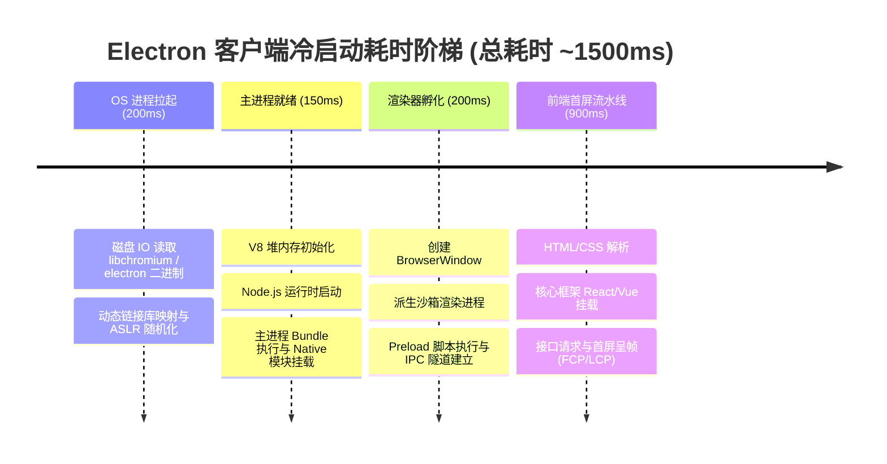
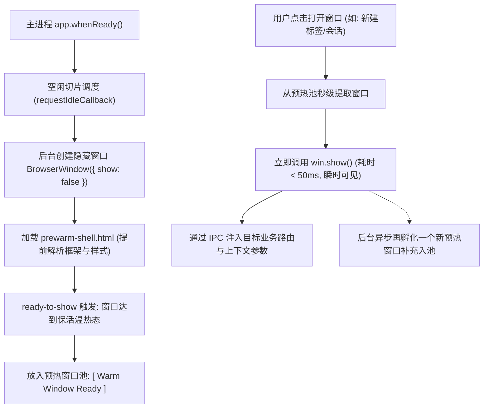
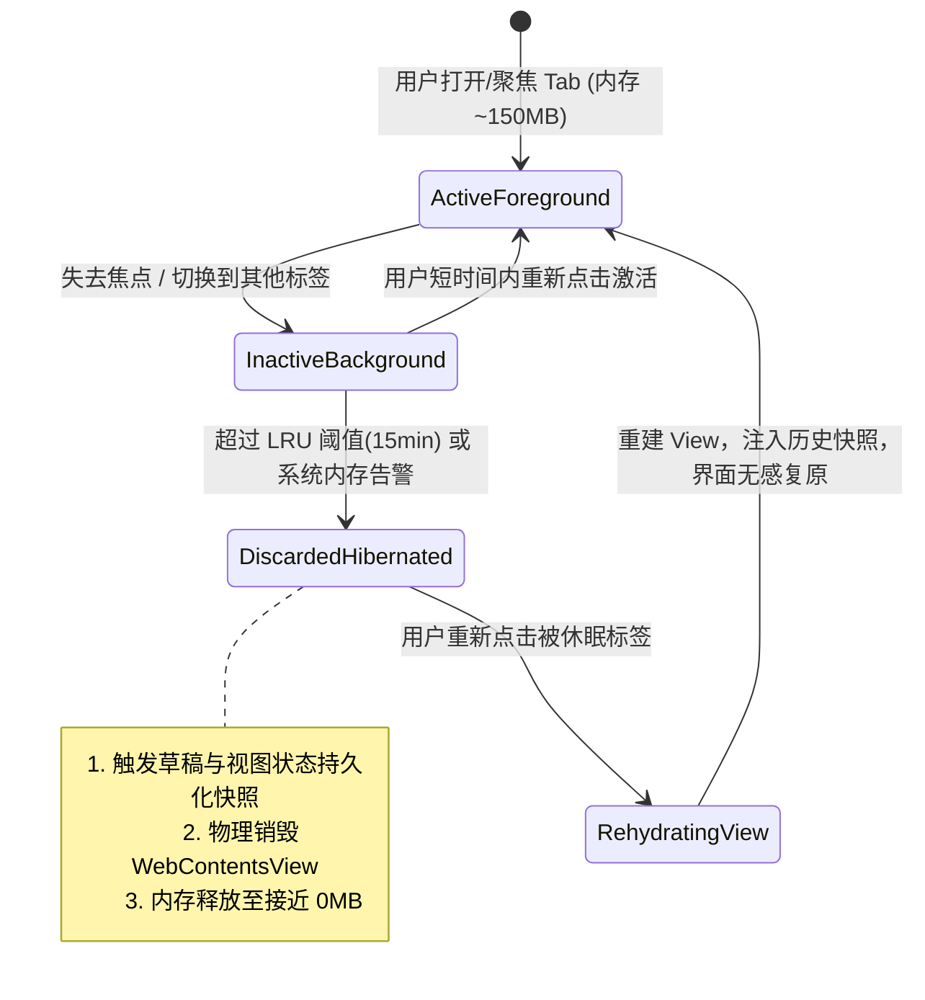

# 性能优化与自动更新

---

## Electron 桌面客户端渲染进程冷启动耗时分析、秒开优化与窗口预热（Prewarm）策略？ {#p0-electron-cold-start}

<Answer>

**核心概念 / 核心结论:**

桌面端用户的交互心智要求窗口在点击后能够“近瞬时出现（小于 200ms）”。然而，标准的 Electron 冷启动路径跨越操作系统、Node.js 与 Chromium 三大运行时，天然存在显著的时延瓶颈：
1. **冷启动关键链路耗时剖析**：
   - **OS 进程孵化与动态链接加载**：系统调用 `fork/exec` 派生进程，加载数百兆 Chromium 与 Node.js 动态链接库（约 150ms ~ 300ms）。
   - **主进程环境初始化**：V8 引擎堆栈分配、Node.js 运行时启动、读取并执行主进程打包脚本（Bundle）、加载 Native C++ 插件（约 100ms ~ 250ms）。
   - **渲染进程创建与 Blink 引擎启动**：创建 `BrowserWindow`、派生沙箱渲染进程、建立 Mojo IPC 管道、执行 Preload 脚本（约 150ms ~ 300ms）。
   - **Web 前端资源加载与首屏绘制**：HTML 解析、CSSOM 构建、React/Vue 巨型 Bundle 解析与 JIT 编译、组件树挂载、首屏数据拉取与绘制（约 300ms ~ 1000ms+）。
2. **核心秒开优化战术**：
   - **窗口预热池策略 (Window Prewarming Pool)**：在应用空闲或后台隐蔽阶段，提前创建一个处于隐藏状态（`show: false`）的空白/通用渲染窗口，预加载前端公共框架与通用样式。当用户触发打开时，秒级调用 `win.show()` 并注入业务上下文，消除 Blink 引擎初始化与框架挂载耗时。
   - **V8 Code Cache / 字节码预编译**：利用 V8 代码缓存跳过词法与语法分析，将庞大前端 Bundle 的执行耗时降低 40% 以上。
   - **原生外观平滑占位**：配置 `backgroundColor` 与系统主题或应用背景色严格一致，配合轻量内联原生骨架屏，杜绝启动白屏闪烁。

---

**原理解析:**

### 1. 冷启动各阶段时间消耗全景流



### 2. 窗口预热池（Prewarming Pool）生命周期状态机



---

**规范代码实现 / 选型对比:**

以下为工业级生产环境中标准的窗口预热管理器，具备单例容量控制、生命周期监听与状态安全重置：

```typescript
// main/window-prewarmer.ts
import { BrowserWindow, ipcMain } from 'electron';
import * as path from 'node:path';

export interface PrewarmConfig {
  preloadPath: string;
  shellHtmlPath: string;
}

export class WindowPrewarmer {
  private warmWindow: BrowserWindow | null = null;
  private isWarming = false;

  constructor(private readonly config: PrewarmConfig) {}

  /**
   * 在主进程启动空闲时调用，开始后台预热
   */
  public prepareWarmWindow(): void {
    if (this.warmWindow || this.isWarming) return;

    this.isWarming = true;
    const win = new BrowserWindow({
      width: 1024,
      height: 720,
      show: false, // 严禁前台展示
      backgroundColor: '#1e1e1e', // 保持与主题一致，防止白闪
      webPreferences: {
        preload: this.config.preloadPath,
        contextIsolation: true,
        nodeIntegration: false,
        sandbox: true,
      },
    });

    win.loadFile(this.config.shellHtmlPath);

    win.once('ready-to-show', () => {
      this.warmWindow = win;
      this.isWarming = false;
      console.info('[Prewarmer] Background window is warm and ready.');
    });

    win.on('closed', () => {
      if (this.warmWindow === win) {
        this.warmWindow = null;
      }
    });
  }

  /**
   * 业务方请求获取可用窗口（实现秒级展示）
   */
  public acquireWindow(targetRoute: string, initialProps: unknown): BrowserWindow {
    if (this.warmWindow && !this.warmWindow.isDestroyed()) {
      const win = this.warmWindow;
      this.warmWindow = null; // 移出预热池

      // 1. 通过 IPC 动态通知前端路由跳转与状态注水
      win.webContents.send('route-navigate', { route: targetRoute, props: initialProps });

      // 2. 瞬间展示窗口，实现瞬时秒开
      win.show();
      win.focus();

      // 3. 异步补充下一个预热窗口，保持池子常备
      setTimeout(() => this.prepareWarmWindow(), 2000);

      return win;
    }

    // 降级兜底：池中无可用预热窗口时走常规创建逻辑
    console.warn('[Prewarmer] No warm window available, creating fallback window.');
    const fallbackWin = new BrowserWindow({
      width: 1024,
      height: 720,
      show: false,
      backgroundColor: '#1e1e1e',
      webPreferences: {
        preload: this.config.preloadPath,
        contextIsolation: true,
        nodeIntegration: false,
        sandbox: true,
      },
    });

    fallbackWin.loadFile(this.config.shellHtmlPath).then(() => {
      fallbackWin.webContents.send('route-navigate', { route: targetRoute, props: initialProps });
      fallbackWin.show();
    });

    return fallbackWin;
  }
}
```

---

**面试官视角:**

- **核心考察点**:
  1. 能否系统性地将 Electron 启动耗时按 OS、Node.js、Chromium、Web 4 个层面进行量化归因；
  2. 深刻掌握预热池机制的设计要点与潜在边界问题（如内存受限、状态污染）；
  3. 对比不同秒开方案（V8 Code Cache vs 预热池 vs 骨架屏）的收益和复杂度。
- **加分项**:
  - 能准确指出：预热窗口不能无限创建，通常维持 1 个实例即可。在内存小于 8GB 的低端设备上，需动态关闭预热策略以节约 80MB 左右的物理常驻内存。
- **下探追问链**:
  - *追问 1*：预热窗口复用后，上一个业务如果注册了大量的全局事件监听器或存在内存泄漏，如何确保窗口状态洁净？
    - *回答要点*：预热窗口通常只作为“单次消费品”（Acquired 后不再放回池子，而是由后台重新创建一个全新纯净的预热窗口）。若要在同一个窗口内频繁切换路由，前端框架内必须具备严格的 `unmount` 清理生命周期或重载子视图。
  - *追问 2*：V8 Code Cache 的生成条件是什么？在打包发布时如何提前预热 Code Cache？
    - *回答要点*：Chromium 默认会在同一个 JS 脚本被加载执行多次（通常大于等于 2 次）后自动生成并持久化 Bytecode Cache。在工程化构建阶段，可以通过 Node.js 原生 `v8.compileFunction` 或打包插件（如 `v8-compile-cache`）在本地构建期将核心 Bundle 预编译为 `.cache` 二进制文件，直接随安装包分发。

---

**延伸阅读:**
- [Electron 官方性能指南](https://www.electronjs.org/docs/latest/tutorial/performance)
- [V8 Code Caching for Node.js Applications](https://v8.dev/blog/code-caching-for-devs)

</Answer>

---

## Electron 多 Tab 架构下的内存治理与页面挂起休眠（Tab Discarding）机制？ {#p0-electron-memory-tab-discarding}

<Answer>

**核心概念 / 核心结论:**

在桌面端多 Tab 协同工作台（如现代 IDE、通讯群组、跨窗口多任务平台）中，**内存膨胀是造成客户端崩溃和系统卡顿的首要诱因**。
- **内存底噪现实**：每个独立的渲染进程或视图组件（`WebContentsView`）的初始物理常驻内存（RSS）约为 60MB ~ 150MB。当用户打开数十个 Tab 且包含大量 DOM 节点和富文本时，应用常驻内存极易飙升突破 2GB。
- **Tab Discarding（页面挂起与休眠机制）**：借鉴 Google Chrome 内核的内存省电模式（Memory Saver）。基于 **LRU (Least Recently Used) 算法**，在系统内存水位告警或 Tab 长期处于后台不可见时，将非活跃 Tab 判定为休眠对象。
- **三步渐进式治理策略**：
  1. **状态持久化快照 (State Snapshots)**：在休眠前触发渲染端序列化存储未提交草稿、表单数据、阅读进度和视图路由；
  2. **物理卸载释放内存**：销毁非活跃页面的 `WebContentsView` 或让其导航至轻量空白页触发 V8 垃圾回收，将数十兆物理显存与堆内存直接交还操作系统；
  3. **无感热激活 (Transparent Re-hydration)**：当用户重新点击该 Tab 时，微秒级重建视图并注水恢复历史快照，实现视觉无感唤醒。

---

**原理解析:**

### 1. 页面挂起休眠流转状态机



### 2. 豁免休眠白名单判定规则

在执行 Tab 丢弃前，必须严格评估页面状态，防止中断正在进行的关键任务：
- **音频/视频正在播放**（通过 `webContents.isCurrentlyAudible()` 判定）；
- **后台正在进行文件传输或下载**；
- **正在进行 WebRTC 实时音视频或屏幕共享**；
- **包含未保存的高危表单或草稿**（若页面明确声明了 dirty 状态且未能完成自动持久化）；
- **包含保持心跳的关键网络 WebSocket 连接**。

---

**规范代码实现 / 选型对比:**

以下为工业级生产环境中，基于 LRU 队列和 `WebContentsView` 实现的智能 Tab 内存休眠控制器：

```typescript
// main/tab-memory-governor.ts
import { BaseWindow, WebContentsView, app } from 'electron';

export interface TabDescriptor {
  tabId: string;
  url: string;
  view: WebContentsView | null;
  lastActiveTime: number;
  isHibernated: boolean;
  stateSnapshot?: Record<string, unknown>;
}

export class TabMemoryGovernor {
  private tabs = new Map<string, TabDescriptor>();
  private readonly MAX_ACTIVE_TABS = 4; // 最多保持活跃的视图数量
  private readonly HIBERNATE_TIMEOUT_MS = 15 * 60 * 1000; // 15分钟无操作休眠

  constructor(private readonly mainWindow: BaseWindow) {
    this.startPeriodicMemoryCheck();
  }

  public registerTab(tabId: string, targetUrl: string): TabDescriptor {
    const view = new WebContentsView();
    view.webContents.loadURL(targetUrl);

    const descriptor: TabDescriptor = {
      tabId,
      url: targetUrl,
      view,
      lastActiveTime: Date.now(),
      isHibernated: false,
    };

    this.tabs.set(tabId, descriptor);
    return descriptor;
  }

  public activateTab(tabId: string): void {
    const target = this.tabs.get(tabId);
    if (!target) return;

    target.lastActiveTime = Date.now();

    // 如果处于休眠状态，执行无感唤醒恢复
    if (target.isHibernated || !target.view) {
      console.info('[MemoryGovernor] Re-hydrating hibernated tab: ' + tabId);
      target.view = new WebContentsView();
      target.view.webContents.loadURL(target.url);

      target.view.webContents.once('did-finish-load', () => {
        if (target.stateSnapshot) {
          target.view?.webContents.send('restore-tab-snapshot', target.stateSnapshot);
        }
      });
      target.isHibernated = false;
    }

    // 将视图挂载到主窗口内容区
    this.mainWindow.contentView.addChildView(target.view);
    this.enforceLruEviction();
  }

  /**
   * 基于 LRU 队列清理超过配额的非活跃 Tab
   */
  private enforceLruEviction(): void {
    const activeTabs = Array.from(this.tabs.values())
      .filter((tab) => !tab.isHibernated && tab.view !== null)
      .sort((a, b) => b.lastActiveTime - a.lastActiveTime);

    if (activeTabs.length > this.MAX_ACTIVE_TABS) {
      // 提取最后激活的超出配额的 Tab
      const victims = activeTabs.slice(this.MAX_ACTIVE_TABS);
      for (const victim of victims) {
        this.hibernateTab(victim);
      }
    }
  }

  private hibernateTab(tab: TabDescriptor): void {
    if (!tab.view || tab.isHibernated) return;

    // 检查豁免条件：正在播放音频则跳过休眠
    if (tab.view.webContents.isCurrentlyAudible()) {
      console.info('[MemoryGovernor] Skipping audible tab from hibernation: ' + tab.tabId);
      return;
    }

    console.warn('[MemoryGovernor] Discarding inactive tab: ' + tab.tabId);

    // 1. 尝试通知前端回传持久化快照
    tab.view.webContents.send('save-tab-snapshot');

    // 2. 从主视图容器中解绑并物理销毁视图，回收物理显存与 DOM 堆内存
    this.mainWindow.contentView.removeChildView(tab.view);
    // 显式销毁底层 WebContents
    (tab.view.webContents as unknown as { destroy: () => void }).destroy();

    tab.view = null;
    tab.isHibernated = true;
  }

  private startPeriodicMemoryCheck(): void {
    setInterval(() => {
      const now = Date.now();
      for (const tab of this.tabs.values()) {
        if (!tab.isHibernated && now - tab.lastActiveTime > this.HIBERNATE_TIMEOUT_MS) {
          this.hibernateTab(tab);
        }
      }
    }, 60000);
  }
}
```

---

**面试官视角:**

- **核心考察点**:
  1. 能否从架构高度理解客户端单机资源限制与多 Tab 业务膨胀之间的不可调和矛盾；
  2. 深刻掌握 Chromium 垃圾回收机制、操作系统 Working Set 分配机制与物理销毁的差异；
  3. 考虑周密的工程落地细节：后台任务豁免（音频播放、上传下载）、数据序列化备份与无感恢复体验。
- **加分项**:
  - 了解 Chrome 的 Page Lifecycle API（`freeze`, `resume`, `discard` 等状态事件），能够将 Web 标准状态模型融入 Electron 的桌面原生调度。
- **下探追问链**:
  - *追问 1*：为什么前端代码将变量置为 `null` 后，系统任务管理器显示的 Electron 进程内存往往没有明显下降？
    - *回答要点*：V8 的垃圾回收（Scavenge / Mark-Sweep-Compact）采用分代式延迟回收，仅在内存压力或空闲时触发。更关键的是，V8 向操作系统申请的虚拟内存（Page Allocator），即使在垃圾被回收后，内存管理器（如 glibc 的 `malloc` 或 Windows CRT）也会将其保留在私有空闲页链表中以便下次快速分配，并不会立即通过 `munmap` 释放回操作系统物理常驻内存池。
  - *追问 2*：如何排查 Electron 渲染进程中隐蔽的 C++ / Native 内存泄漏？
    - *回答要点*：普通的 Chrome DevTools Heap Snapshot 只能查看 V8 JS 堆内存。如果是底层 WebGL 纹理、Canvas 未调用上下文释放、或者第三方 Native Addon 分配的 `malloc` 内存泄漏，必须使用操作系统级工具，如 macOS 下的 Instruments（Leaks / Allocations），或 Windows 下的 VMMap 进行物理虚拟地址段分析。

---

**延伸阅读:**
- [Google Chrome Developers: Page Lifecycle API](https://developer.chrome.com/docs/web-platform/page-lifecycle-api)
- [Electron 架构指南：WebContentsView](https://www.electronjs.org/docs/latest/api/web-contents-view)

</Answer>

---

## Electron 跨平台自动更新（Auto-Updater）全流程架构设计与灰度回滚机制？ {#p1-electron-auto-updater}

<Answer>

**核心概念 / 核心结论:**

自动更新（Auto-Updater）是桌面端软件运维与持续交付（CI/CD）的核心生命线。相较于 Web 端的即时刷新，桌面应用具有**离线运行、跨平台底层差异显著、二进制文件存在系统级写保护锁定**等特殊性：
- **跨平台更新机制差异**：
  - **macOS**：依赖 `Squirrel.Mac`。强制要求有效的 Apple Developer ID 证书**代码签名 (Code Signing)** 与 **公证 (Notarization)**。更新包为完整的 `.zip`，底层通过切换 `.app` 目录指针并在重启时原子重命名完成替换。
  - **Windows**：基于 `Squirrel.Windows` 或现代化 `NSIS` 方案。核心瓶颈在于 **Windows 文件锁机制（File Locking）**——运行中的 `.exe` 与已加载的 `.dll` 绝对无法被覆盖写入。更新必须交由独立的辅助引导程序（如 `elevate.exe` / 安装引导器）在宿主主进程彻底退出后执行文件覆写。
- **现代自动更新四大核心支柱 (基于 electron-updater)**：
  1. **基于 Blockmap 的增量差量更新 (Differential Downloads)**：通过 64KB 粒度的哈希比对，仅拉取文件差异分块，包体下载体积降低 90% 以上。
  2. **灰度发布与分桶放量 (Staged Rollout)**：基于客户端设备指纹计算 Hash 取模，精准控制 1%、10%、50%、100% 渐进式放量比例。
  3. **数据完整性与防劫持签名**：更新元数据 SHA-512 校验与数字签名双重验证，阻断中间人劫持（MITM）。
  4. **崩溃熔断与双备份回滚 (Self-Healing Rollback)**：针对新版本启动即崩溃的致命灾难，设计启动健康度自检，异常时自动切换至备用版本目录。

---

**原理解析:**

### 1. Blockmap 增量差量更新机制与分块下载

```txt
[ 旧版本安装包 v1.0 (100MB) ]          [ 新版本安装包 v1.1 (105MB) ]
+-------+-------+-------+-------+     +-------+-------+-------+-------+
| Blk 1 | Blk 2 | Blk 3 | Blk 4 |     | Blk 1 | Blk 2*| Blk 3 | Blk 5*|
+-------+-------+-------+-------+     +-------+-------+-------+-------+
    │                                             │
    └────────────────── 哈希差异比对 ──────────────┘
                          │
                          ▼ (生成 v1.1.7z.blockmap)
      客户端发现仅 Blk 2* 与 Blk 5* 发生变动 (共 4MB)
                          │
                          ▼ (HTTP 1.1 范围请求)
      GET /app-v1.1.7z HTTP/1.1
      Range: bytes=65536-131071, 262144-327679
                          │
                          ▼
      从本地旧包拷贝未变更块 + 拼接下载的新增块 = 合成全新安装包
```

### 2. 自动更新全生命周期状态机

```mermaid
flowchart TD
    Idle["空闲待命 (Idle)"] -->|定时器或手动 checkForUpdates()| Checking["版本比对中 (Checking: 获取 latest.yml)"]
    Checking -->|未命中灰度或已是最新| NotAvailable["无可用更新 (Update Not Available)"]
    Checking -->|命中灰度且有新版本| Available["发现新版本 (Update Available)"]
    
    Available -->|自动静默后台启动下载| Downloading["增量下载中 (Downloading: 按 Blockmap 拉取差异块)"]
    Downloading -->|下载完成并校验 SHA-512 签名一致| Downloaded["下载就绪 (Downloaded: 提示用户重启)"]
    
    Downloaded -->|用户点击立即更新 / 退出应用| Installing["安装覆盖 (Helper 进程替换二进制)"]
    Installing -->|启动新版本进程| HealthCheck{"健康度自检 (启动 30s 内守护)"}
    HealthCheck -- 启动正常 --> Success["更新成功: 清理旧版本缓存"]
    HealthCheck -- 发生连续崩溃 --> Rollback["触发紧急回滚: 恢复旧版本备份二进制"]
```

---

**规范代码实现 / 选型对比:**

以下为工业级生产环境中，集成了设备指纹灰度放量判定、静默下载与启动自愈容灾的更新控制器：

```typescript
// main/auto-update-manager.ts
import { autoUpdater, UpdateInfo } from 'electron-updater';
import { app, dialog } from 'electron';
import * as crypto from 'node:crypto';

export class EnterpriseUpdateManager {
  private static instance: EnterpriseUpdateManager;
  private deviceUuid: string;

  private constructor(deviceUuid: string) {
    this.deviceUuid = deviceUuid;
    this.configureUpdater();
  }

  public static getInstance(deviceUuid: string): EnterpriseUpdateManager {
    if (!this.instance) {
      this.instance = new EnterpriseUpdateManager(deviceUuid);
    }
    return this.instance;
  }

  private configureUpdater(): void {
    // 1. 基础配置
    autoUpdater.autoDownload = false; // 严禁盲目下载，需先过灰度规则
    autoUpdater.autoInstallOnAppQuit = true;
    autoUpdater.allowDowngrade = true; // 支持紧急回滚降级

    // 2. 状态机事件监听
    autoUpdater.on('checking-for-update', () => {
      console.info('[AutoUpdater] Checking for available updates...');
    });

    autoUpdater.on('update-available', async (info: UpdateInfo) => {
      console.info('[AutoUpdater] Update found: v' + info.version);

      // 执行客户端灰度放量拦截
      const rolloutPercentage = this.extractRolloutPercentage(info);
      if (this.isDeviceInRolloutGroup(this.deviceUuid, info.version, rolloutPercentage)) {
        console.info('[AutoUpdater] Device is within the rollout bucket (' + rolloutPercentage + '%). Downloading...');
        await autoUpdater.downloadUpdate();
      } else {
        console.info('[AutoUpdater] Device skipped: outside rollout threshold (' + rolloutPercentage + '%).');
      }
    });

    autoUpdater.on('download-progress', (progressObj) => {
      console.info('[AutoUpdater] Download speed: ' + progressObj.bytesPerSecond + ' - ' + progressObj.percent.toFixed(1) + '%');
    });

    autoUpdater.on('update-downloaded', (info: UpdateInfo) => {
      console.info('[AutoUpdater] Update v' + info.version + ' downloaded and verified.');
      // 适时提示用户安装
      dialog.showMessageBox({
        type: 'info',
        title: '应用更新就绪',
        message: '新版本 v' + info.version + ' 已准备就绪，是否立即重启升级？',
        buttons: ['立即重启', '稍后提醒'],
      }).then(({ response }) => {
        if (response === 0) {
          // 退出并调用外部 Helper 执行原子替换
          autoUpdater.quitAndInstall(false, true);
        }
      });
    });

    autoUpdater.on('error', (err) => {
      console.error('[AutoUpdater] Update pipeline encountered error:', err.message);
    });
  }

  /**
   * 基于设备指纹与版本号进行 SHA-256 哈希取模，计算分桶比例
   */
  private isDeviceInRolloutGroup(uuid: string, targetVersion: string, percentage: number): boolean {
    if (percentage >= 100) return true;
    if (percentage <= 0) return false;

    const hashInput = uuid + ':' + targetVersion;
    const hash = crypto.createHash('sha256').update(hashInput).digest('hex');
    // 取哈希前 8 位转换为整数对 100 取模
    const bucket = parseInt(hash.slice(0, 8), 16) % 100;
    return bucket < percentage;
  }

  private extractRolloutPercentage(info: UpdateInfo): number {
    const customInfo = info as unknown as { stagingPercentage?: number };
    return typeof customInfo.stagingPercentage === 'number' ? customInfo.stagingPercentage : 100;
  }

  public checkForUpdates(): void {
    autoUpdater.checkForUpdates().catch((err) => {
      console.error('[AutoUpdater] Check for updates failed:', err);
    });
  }
}
```

---

**面试官视角:**

- **核心考察点**:
  1. 准确指出 macOS 与 Windows 更新机制的根本差异（代码签名与 Windows 文件锁）；
  2. 深入剖析 Blockmap 差量更新如何通过 HTTP Range Requests 降低 CDN 带宽成本；
  3. 全面覆盖工业级部署必考的安全性（防篡改签名校验）与高可用容灾（灰度控制与紧急回退）。
- **加分项**:
  - 清晰说明 Windows 下如果发生杀毒软件（360、火绒等）误将更新进程拦截导致文件替换到一半损坏时的应对策略：采用双槽位备份目录（A/B 双分区更新），先向未运行的槽位写入并校验完整，重启时仅切换快捷方式与注册表指针，保证替换失败时旧槽位绝对可用。
- **下探追问链**:
  - *追问 1*：如果线上推送了一个严重 Bug 的版本（如启动即抛致命异常直接退出），此时无法进入正常业务界面触发 `checkForUpdates`，如何实现版本回退与线上止血？
    - *回答要点*：
      1. 服务端止血：立即在 CDN 下线该版本的更新元数据（`latest.yml` / `latest-mac.yml`），阻止未下载用户继续受影响；
      2. 独立看门狗防护：在 Native Bootstrapper 中维护启动计数器，若进程启动 10 秒内连续崩溃超过 2 次，启动器直接静默回滚至上一备份版本目录并清除更新缓存，同时向监控端上报回滚事件。
  - *追问 2*：为什么 macOS 应用若没有进行 Apple Notarization（苹果公证），在自动更新替换后往往无法启动并弹出“应用已损坏，移至废纸篓”？
    - *回答要点*：macOS 内核的 Gatekeeper 会在应用首次拉起或发生文件修改后校验代码签名与公证票据（Ticket）。自动更新替换了 Bundle 资源，如果新安装包没有通过 Apple 线上公证服务并在二进制中装订（Staple）公证票据，Gatekeeper 会将其判定为被恶意篡改的不可信程序并强行拦截。

---

**延伸阅读:**
- [electron-updater 官方架构解析](https://www.electron.build/auto-update)
- [Apple Developer: Notarizing macOS Software Before Distribution](https://developer.apple.com/documentation/security/notarizing_macos_software_before_distribution)

</Answer>
