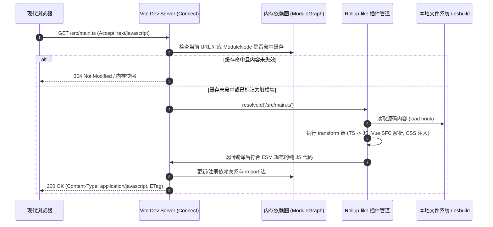
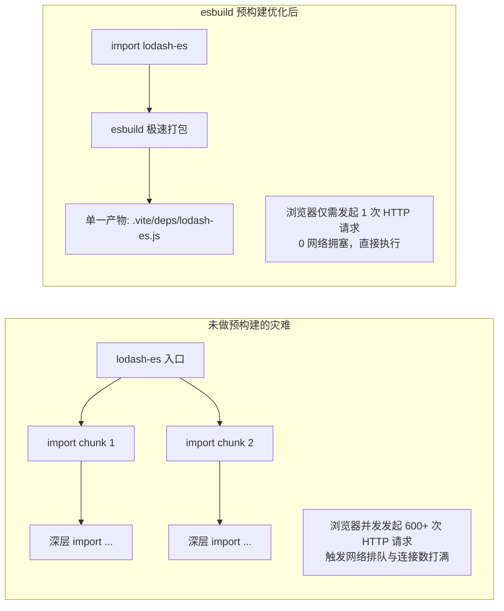
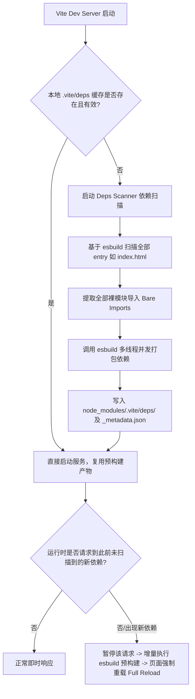
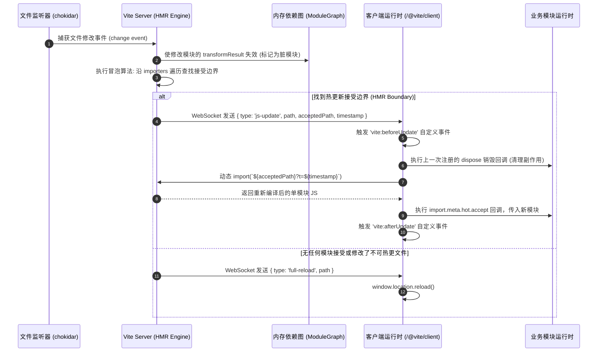
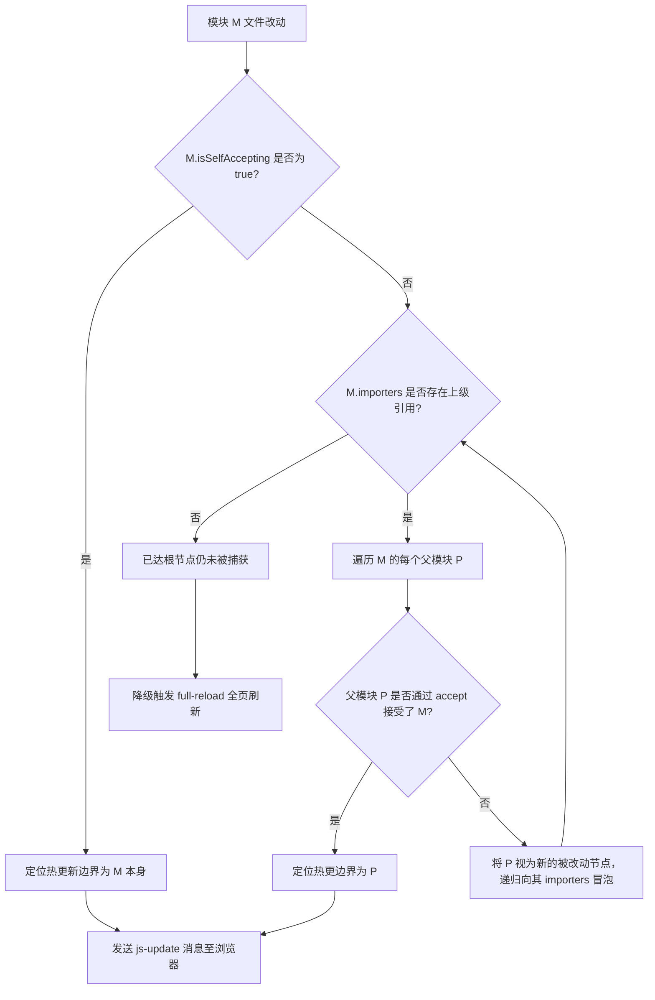
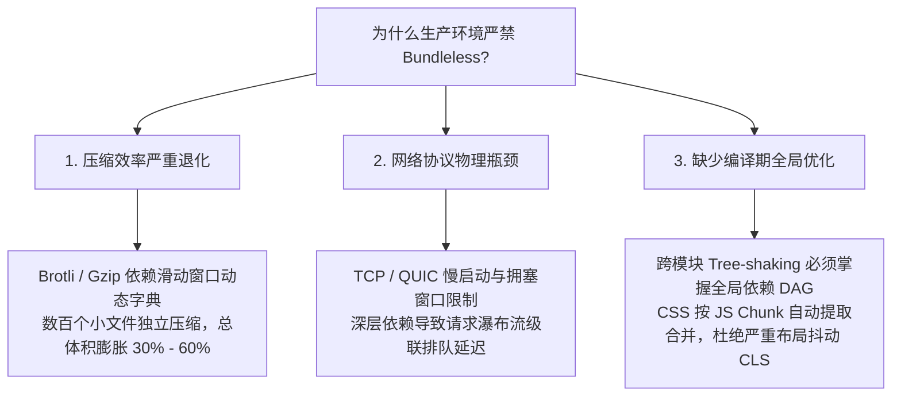
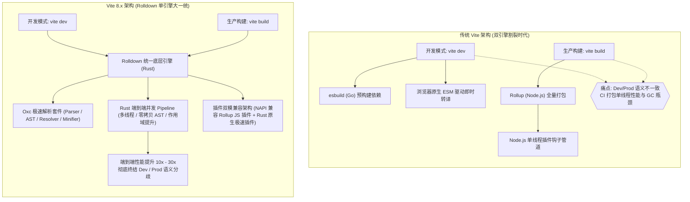
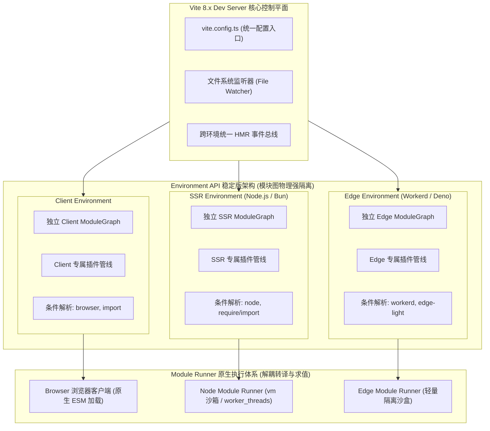
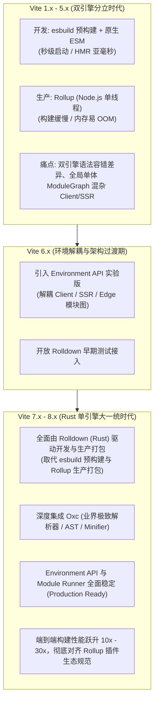

# Vite 核心原理与工程化实战✅

import vitePrebundleHtml from '!!raw-loader!./answers/p0-vite-esm-prebundling/index.html'
import vitePrebundleModule from '!!raw-loader!./answers/p0-vite-esm-prebundling/bundled-module.js'

<!-- 
Vite 核心原理、构建机制与生产迁移专题
包含：架构哲学对比、Dev Server 底层机制、esbuild 预构建、HMR 边界冒泡、双工具链权衡、Rolldown 统一工具链路线、大型 Webpack 项目双轨迁移落地
 -->

## Vite 和 Webpack 的核心设计哲学与架构差异？ {#p0-webpack-vite-difference}

<Answer>

**核心结论**

* **Webpack 是基于打包（Bundle-based）的传统构建体系**：其设计哲学是“先全量静态分析并打包，再启动本地服务”。无论应用大小，必须递归构建完整的模块依赖图（ModuleGraph -> ChunkGraph），将所有资源预先转译打包进内存 Bundle。其冷启动和局部重构耗时与项目模块总数呈 $O(N)$ 线性正相关。
* **Vite 是基于原生 ESM（Unbundled / ESM-based）的即时转译体系**：其设计哲学是“先秒级启动服务，由浏览器发起请求按需转译”。充分利用现代浏览器原生对 `<script type="module">` 的拓扑解析能力，将依赖拓扑分析与调度外包给浏览器，服务器仅负责请求拦截与单文件即时 Transform，开发服务器冷启动达到 $O(1)$ 常数级响应，与项目规模完全解耦。

---

**原理解析**

### 1. 构建范式与生命周期对比

```mermaid
graph TD
    subgraph Webpack 构建模式（Bundle-based）
        W1[Entry 入口] --> W2[全量 AST 分析与 Loader 递归转译]
        W2 --> W3[构建 ModuleGraph 与 ChunkGraph]
        W3 --> W4[输出内存 Bundle 产物]
        W4 --> W5[启动 Dev Server 监听端口]
        W5 --> W6[浏览器发起请求并加载全量 Bundle]
    end

    subgraph Vite 构建模式（ESM-based）
        V1[启动 Dev Server 监听端口] --> V2[极速预构建第三方依赖 esbuild]
        V2 --> V3[等待浏览器请求 HTTP Ready]
        V3 --> V4[浏览器解析 index.html 发起 ESM 请求]
        V4 --> V5[Vite 按需执行单文件 Resolve/Load/Transform]
        V5 --> V6[即时响应转译结果并利用浏览器强弱缓存]
    end
```

### 2. 核心架构维度的本质区别

1. **模块解析时机（Build-ahead vs Just-in-Time）**：
   * **Webpack**：在开发者能够看到页面之前，必须完成全量代码的静态扫描、AST 解析、依赖提取与代码拼接。随着业务模块膨胀到数千甚至数万个，冷启动时间常膨胀至数分钟。
   * **Vite**：仅在服务器启动阶段利用 Go 语言编写的高性能编译器 esbuild 对 `node_modules` 依赖进行预编译（Pre-bundling）。业务源码完全不提前转译，仅当浏览器解析并请求对应 URL 时，才通过中间件管道流式完成即时转换。
2. **热更新复杂度（HMR Complexity）**：
   * **Webpack**：修改某个文件后，Webpack 需在内存中重新分析该模块影响的所有 Chunks，重新生成 patch hash 与更新模块描述清单（`.hot-update.json` / `.hot-update.js`），复杂度随依赖链和 Chunk 体积增大而劣化。
   * **Vite**：内部维护一张精密的内存级 `ModuleGraph`。文件变动时，仅需将对应模块标记为失效，并通过 WebSocket 直接通知浏览器按需重新 `import` 该模块，热更新更新时间始终维持在 `< 50ms` 的亚毫秒级，与工程总体量完全脱钩。

---

**多维度深度对比**

| 对比维度 | Vite | Webpack |
| :--- | :--- | :--- |
| **底层核心范式** | 基于浏览器原生 ESM 的按需即时转译（Unbundled） | 基于全量依赖图的内存打包器（Bundle-based） |
| **开发环境语言栈** | Node.js（服务器框架） + Go（esbuild 预构建） | 纯 JavaScript / Node.js 运行时 |
| **冷启动性能** | 极快（毫秒级，仅预构建第三方依赖，与业务规模无关） | 缓慢（秒级至分钟级，随业务代码和依赖量线性递增） |
| **HMR 热更新效率** | 极快（精确更新单个模块，浏览器原生 Fetch，恒定亚毫秒） | 随项目规模增大变慢，存在重新打包 Chunk 计算开销 |
| **生产环境工具** | 正式采用 Rust 编写的 Rolldown 打包（Vite 8.x 全面统一底层引擎） | 依然使用 Webpack 自身（全生命周期工具链一致） |
| **模块规范支持** | 源码全面遵循现代 ESM 规范，依赖通过预构建转换为 ESM | 原生支持 CommonJS、AMD、ESM、Asset Modules 等全规范 |
| **配置复杂度** | 约定优于配置，内置 TypeScript、JSX、CSS Modules、PostCSS | 配置灵活度高但门槛陡峭，需组合大量 Loader 与 Plugin |
| **首屏网络请求** | 首次加载存在较多 HTTP 请求，依赖深可能出现轻微瀑布流 | 请求数量少（已被打包为单包或少数分包 Chunks） |

---

**面试官视角**

* **基础分（良）**：能说明 Webpack 是先打包后起服务、Vite 是先起服务由浏览器通过原生 ESM 按需请求，且知道 Vite 开发环境使用了 esbuild。
* **高分加分项（优）**：能从时间复杂度角度拆解 $O(1)$ 与 $O(N)$ 的本质原因；能指出 Vite 在超大规模单体工程中首屏大量未合并请求的网络开销风险；能准确分析生产环境 Vite 仍退回 Rollup 打包的原因及其双工具链的一致性权衡。

**延伸阅读**

* [Vite 官方文档：为什么选 Vite](https://vite.dev/guide/why.html)
* [Webpack 官方文档：Concepts & Under the Hood](https://webpack.js.org/concepts/under-the-hood/)

</Answer>

## Vite Dev Server 的底层工作机制是什么，为什么快，有哪些局限？ {#p0-vite-dev-work}

<Answer>

**核心结论**

* **Vite Dev Server 的底层核心是一个“以浏览器请求为驱动、以 Connect 中间件为管道、以内存依赖图为中枢”的即时编译引擎**。
* 其之所以快，在于**“将模块打包拓扑转移给浏览器、语法擦除转移给 Go 原生编译器 esbuild、静态资源转移给 HTTP 强弱缓存”**，绕过了昂贵的全工程 AST 遍历与打包合并。
* 其核心局限在于：在未命中山级预构建的大型应用中会面临**网络级联瀑布流（Waterfall Requests）延迟**、**无全量类型检查（Type-Stripping 盲区）**、以及**开发与生产双工具链差异**。

---

**原理解析**

### 1. Dev Server 整体请求处理管道架构



### 2. 为什么 Vite 开发服务器能做到极致极速？

1. **剥离构建依赖图的沉重算力**：传统打包器必须在内存中构建包含所有 Import/Export 引用关系的图谱并进行作用域提升（Scope Hoisting）。Vite 充分利用了现代浏览器自身的 Module Loader，浏览器在执行 `import from './Button.vue'` 时自动向服务器发起子请求，依赖拓扑的遍历被分摊到了浏览器的网络栈与 JS 引擎解析管线中。
2. **Go 编译器的降维打击（esbuild）**：源码中的 TypeScript、JSX、TSX 转译全部交由多线程、底层无垃圾回收暂停（No GC overhead）的 esbuild 处理，其编译吞吐量比 Babel 快 10 到 100 倍。
3. **两级缓存防御体系**：
   * **预构建依赖**：通过响应头 `Cache-Control: max-age=31536000, immutable` 强缓存于浏览器，除非配置文件或 lockfile 变更，否则浏览器直接使用磁盘/内存缓存，网络开销为 0。
   * **业务源码**：通过计算代码内容的 Hash 并在响应头中注入 `ETag`。未修改的业务代码直接响应 `304 Not Modified`，避免无意义的传输与重解析。

---

**局限与工程短板**

1. **深层依赖网络瀑布流（Network Waterfall）**：
   若业务代码存在深层嵌套导入链路（如 A 引用 B，B 引用 C，C 引用 D...），浏览器必须串行发起 HTTP 请求。在无本地代理的高延迟网络或 HTTP/1.1 环境下，整体首屏渲染延迟会被显著放大。
2. **缺乏类型检查的快速编译盲区**：
   esbuild 仅做纯粹的**类型擦除（Type Stripping）**，并不执行 TypeScript 的语义与类型校验。若代码中存在严重的类型契约违背，Vite Dev Server 依然能正常启动和渲染，开发者必须单独在后台运行 `tsc --noEmit` 或 `vue-tsc --noEmit` 来兜底静态类型安全性。
3. **首屏编译压力峰值（Cold Load Spike）**：
   若首次访问的页面非常庞大且未做路由懒加载，浏览器瞬间涌入成百上千个模块请求，可能导致 Dev Server 瞬时 CPU 负载拉满，首屏白屏时间反而短时间劣于优化良好的单包 Webpack 内存产物。

---

**面试官视角**

* **追问点 1**：Vite 在处理 CSS 文件时，是如何让浏览器通过原生 ESM 加载的？
  * *破局要点*：Vite 拦截 CSS 请求后，将其内部转换为一段 JS 代码，利用 `createHotContext` 注入一段动态向 DOM `<head>` 中插入或更新 `<style>` 标签的脚本，使 CSS 的导入在语法层面完全兼容 ESM 规范。
* **追问点 2**：既然 esbuild 这么快，为什么 Vite 不在生产环境也全面使用 esbuild 打包？
  * *破局要点*：引出双工具链权衡——esbuild 目前缺乏深度的 Chunk 代码分割算法、CSS 代码提取分割机制、以及灵活成熟的插件生态（见后续题目剖析）。

**延伸阅读**

* [Vite 源码架构：packages/vite/src/node/server](https://github.com/vitejs/vite/tree/main/packages/vite/src/node/server)

</Answer>

## Vite 开发环境原生 ESM 按需预构建（esbuild）底层工作机制与网络瀑布流消除原理？ {#p0-vite-esm-prebundling}

<Answer>

**核心结论**

* **依赖预构建（Dependency Pre-bundling）是 Vite 解决原生 ESM 落地痛点的核心基石**。它在开发服务器启动或首次遇到未收录依赖时，利用 **esbuild** 对 `node_modules` 第三方依赖执行高性能预打包。
* 其根本目标是解决两大工业级矛盾：
  1. **规范统一**：将社区海量存量的 CommonJS / UMD 依赖无缝转换为标准 ES Module 规范；
  2. **消除网络瀑布流爆炸**：将内部包含成百上千个微小嵌套模块的库（如 `lodash-es`、UI 组件库）归拢合并为单个或极少数 ESM 产物，彻底遏制浏览器并发网络风暴。

---

**原理解析**

**可运行沙盒：原生 ESM 加载与预构建消除瀑布流验证**

<CustomSandPack
  template="static"
  options={{
    showConsole: false,
    editorHeight: 380
  }}
  files={{
    "/index.html": vitePrebundleHtml,
    "/bundled-module.js": vitePrebundleModule
  }}
/>

### 1. 为什么必须进行依赖预构建？



1. **CommonJS / UMD 规范转换**：
   现代浏览器的 `<script type="module">` 仅识别标准 ESM（`import` / `export`）。但 npm 生态中仍有大量流行库（如 React、axios 等历史版本）采用 CommonJS（`module.exports`）导出。若直接在浏览器中原生运行，会抛出 `Uncaught ReferenceError: require is not defined`。esbuild 会在预构建阶段分析其静态导出，将其转换为具备具名导出与默认导出的合成 ESM 模块。
2. **消除内部碎片依赖的网络级联风暴**：
   以 `lodash-es` 为例，其内部拥有超过 600 个细碎小函数文件相互引用。如果浏览器直接以原生 ESM 方式导入 `import { debounce } from 'lodash-es'`，浏览器将递归发起 600 余个独立的 HTTP 请求。即便在 HTTP/2 多路复用环境下，浏览器对同一域名的调度开销、TCP 窗口扩展拥塞以及服务器并发解析依然会导致页面卡死数秒。预构建将其直接合成为单个 `lodash-es.js` 文件。

---

### 2. 预构建执行时机与全自动扫描策略（Auto Discovery）



1. **依赖自动扫描（Deps Scanner）**：
   * 服务启动时，Vite 调用内部的 `scanImports` 方法，基于 esbuild 创建一个特殊的虚拟打包上下文，以项目根目录的 `index.html`（或配置的 `entries`）为起点。
   * 该扫描过程跳过所有复杂的代码编译与生成，仅利用快速词法分析提取所有的**裸导入（Bare Imports）**，即形如 `import Vue from 'vue'`、`import axios from 'axios'` 的第三方模块名。
2. **运行时动态增量预构建**：
   * 若某些依赖通过动态拼接路径或深层条件分支导入（如在某个未被静态分析到的路由组件中调用了 `import('third-party-lib')`），Vite 拦截该请求后发现依赖未在预构建名单中，会立即触发增量预构建流程。
   * 打包完成后，Vite 会更新元数据并通过 WebSocket 通知浏览器执行一次全页强制刷新（Full Reload），使依赖图重新与新产物绑定。

---

### 3. 缓存校验模型与失效机制

Vite 预构建产物保存在 `node_modules/.vite/deps/` 目录下，并生成一份 `_metadata.json` 索引文件。其缓存有效性由**多重输入哈希（Combined Hash）**严格把控：

```text
DepHash = Hash(Lockfile + ConfigDeps + EnvVars + PkgDependencies)
```

* **校验因子包括**：
  1. 包管理器的锁定文件（`pnpm-lock.yaml` / `package-lock.json` / `yarn.lock`）；
  2. `package.json` 中的 `dependencies` 与 `devDependencies`；
  3. `vite.config.ts` 中的 `optimizeDeps` 配置（`include`, `exclude`, `esbuildOptions` 等）；
  4. 环境变量（如 `NODE_ENV`）。
* **强制失效**：当上述任意因子发生变动，Vite 判定缓存失效并自动重新构建。开发者也可执行 `vite --force` 或手动删除 `node_modules/.vite` 强行重新生成。

---

### 4. 浏览器端强缓存与动态路径重写

1. **动态路径重写（Bare Import Rewriting）**：
   浏览器无法解析裸模块导入（会报错：`Uncaught TypeError: Failed to resolve module specifier "react"`）。
   Vite 在 `transformMiddleware` 阶段，利用词法解析器（如 `es-module-lexer`）将源码中的裸导入重写为绝对路径：
   ```javascript
   // 源码编写
   import React from 'react'
   
   // Vite 重写后输出给浏览器
   import React from '/node_modules/.vite/deps/react.js?v=e3b0c442'
   ```
2. **HTTP 强缓存策略**：
   对于 `/node_modules/.vite/deps/` 下的预构建静态资源，Vite 服务器在响应时会写入极具侵略性的响应头：
   ```http
   Cache-Control: max-age=31536000, immutable
   ```
   只要 URL 上的版本 query（如 `?v=e3b0c442`）没有改变，浏览器将永远优先走本地强缓存（Memory Cache 或 Disk Cache），实现零延迟网络复用。
3. **工作区外部路径重写（`/@fs/` 机制）**：
   对于跨越项目根目录的 Monorepo 软链接包或磁盘绝对路径，Vite 会将其重写为 `/@fs/Users/...` 前缀，以沙箱受控的方式安全访问本地磁盘文件。

---

**配置与实践代码**

```typescript
// vite.config.ts
import { defineConfig } from 'vite'

export default defineConfig({
  optimizeDeps: {
    // 强制预构建某些可能被动态计算或深层嵌套导入的库，防止首屏加载时触发二次重新编译
    include: [
      'lodash-es',
      'element-plus/es/components/button/style/css',
      'my-monorepo-package > sub-dep'
    ],
    // 排除特定依赖，保持原生 ESM 链接（常用于内部正在频繁联调热更新的本地源码包）
    exclude: ['@my-company/shared-components'],
    // 针对特定 CommonJS 老库调整 esbuild 转译选项
    esbuildOptions: {
      target: 'esnext',
      define: {
        global: 'globalThis'
      }
    }
  }
})
```

---

**面试官视角**

* **核心评分项**：
  1. 是否深刻阐述了 CommonJS 转 ESM 和网络瀑布流消除这两个本质动机；
  2. 是否清楚从静态扫描（`scanImports`）到动态缺失捕获（`missing deps`）的完整闭环；
  3. 是否掌握浏览器强缓存（`immutable`）与 `?v=hash` 缓存失效的设计配合。
* **高难度追问**：如果在 Monorepo 中通过 `pnpm link` 链接了本地模块，为什么修改该模块代码有时不会触发更新或依然命中了预构建？
  * *破局要点*：默认情况下，Vite 将 `node_modules` 软链接的包视为第三方依赖并加入了预构建缓存。解决方案是在 `optimizeDeps.exclude` 中将其显式排除，或通过配置 `resolve.preserveSymlinks: false` 与修改别名直接重定向到其 `src` 源码目录。

**延伸阅读**

* [Vite 官方文档：依赖预构建](https://vite.dev/guide/dep-pre-bundling.html)
* [esbuild 官方文档：API & Content Types](https://esbuild.github.io/api/)

</Answer>

## Vite 模块热更新（HMR）底层原理与边界冒泡机制？ {#p0-vite-hmr-internals}

<Answer>

**核心结论**

* **Vite 的模块热替换（HMR）基于“服务端文件监听 -> 内存 ModuleGraph 拓扑检索 -> WebSocket 极简增量推送 -> 客户端原生 ESM 动态加载与边界执行”构建全链路闭环**。
* 当文件变动时，Vite 并非重新打包整个应用，而是沿着 ModuleGraph 的反向依赖边（`importers`）递归向上寻找最近的**接受边界（HMR Boundary）**。找到边界则触发局部的 `import()` 重载并调用回调；若冒泡至根节点仍未被任何模块接受，则安全降级回全页刷新（Full Reload）。

---

**原理解析**

<ViteHmrVisualizer />

### 1. HMR 核心通信链路与事件流水线



### 2. 服务端依赖图（ModuleGraph）的数据模型

Vite 在内存中维护了一套高度精简但完备的双向依赖拓扑图：

```typescript
// 简化的 ModuleNode 核心结构定义
class ModuleNode {
  url: string                     // 浏览器请求的相对路径（如 /src/components/Card.vue）
  id: string | null               // 文件系统绝对物理路径（如 /Users/.../Card.vue）
  file: string | null             // 关联文件物理路径
  type: 'js' | 'css'              // 资源分类
  importers: Set<ModuleNode>      // 引入此模块的父模块集合（反向依赖边，冒泡关键）
  importedModules: Set<ModuleNode>// 此模块引入的子模块集合（正向依赖边）
  isSelfAccepting: boolean        // 是否声明了自接受自身热更新
  transformResult: TransformResult | null // 编译缓存，文件改动时置为 null
  lastHMRTimestamp: number        // 上次热更时间戳
}
```

---

### 3. 边界冒泡算法（HMR Bubble Algorithm）深度剖析

当某一个业务模块 $M$ 的物理文件被修改时，Vite 触发冒泡遍历算法：



* **自接受（Self-accepting）**：模块内部显式调用了 `import.meta.hot.accept((newMod) => {})`，意味着该模块自包含状态处理或更新逻辑（如 Vue 组件、React 组件通过官方插件自动注入该代码）。更新止步于此，不影响父级。
* **父模块接受（Parent-accepting）**：父模块 $P$ 声明了 `import.meta.hot.accept('./M', (newChildMod) => {})`。此时更新边界为父模块，由父模块接管子模块的重新实例化。
* **冒泡衰竭与全页刷新（Full Reload）**：如果冒泡一路回溯到入口文件（如 `main.ts` 或 `index.html`）依然没有遇到任何有效的 accept 语句，或者修改了涉及全局拓扑的配置文件（如 `.env`、`vite.config.ts`），Vite 认为热更新无法安全局部应用，推送 `full-reload` 消息令页面整页重新加载。

---

### 4. 客户端 `import.meta.hot` 标准 API 交互范式

现代前端框架的 HMR 运行时（如 `@vitejs/plugin-react`、`@vitejs/plugin-vue`）完全建立在 Vite 暴露的标准 HMR API 之上：

```typescript
// src/counter.ts 纯原生 HMR 示例
export let count = 0

export function render() {
  const el = document.getElementById('app')!
  el.textContent = `当前点击次数: ${count}`
}

// 1. 跨热更新周期的状态持久化（利用 hot.data 跨版本传递状态）
if (import.meta.hot) {
  if (import.meta.hot.data.count !== undefined) {
    count = import.meta.hot.data.count
  }

  // 2. 声明自接受热更（Self-Acceptance）
  import.meta.hot.accept((newModule) => {
    if (newModule) {
      // 模块重新加载后，执行新的渲染逻辑
      newModule.render()
    }
  })

  // 3. 注册模块销毁清理函数（避免内存泄漏与事件重复绑定）
  import.meta.hot.dispose((data) => {
    // 将当前状态留存给下一任模块实例
    data.count = count
    // 移除全局监听器或定时器
    window.removeEventListener('resize', handleResize)
  })

  // 4. 处理无用模块卸载（Prune）
  import.meta.hot.prune(() => {
    console.log('模块被完全移出依赖图，彻底释放相关全局引用')
  })
}
```

---

**面试官视角**

* **核心评分项**：
  1. 能清晰画出 WebSocket 通知到客户端动态重新 `import` 带有时间戳 query 的过程；
  2. 能准确讲出 `ModuleGraph` 的反向指针 `importers` 机制与边界回溯冒泡逻辑；
  3. 能熟练解释 `import.meta.hot.accept`、`dispose`、`data` 的设计意义与防内存泄漏机制。
* **深度追问**：为什么 CSS 的热更新几乎能做到完美无感，而 JS 模块热更新经常导致页面状态被冲刷甚至报错？
  * *破局要点*：CSS 具有纯声明式特性，没有持久化运行时内部状态和闭包上下文。Vite 发现 CSS 更新后，仅需生成新的时间戳，替换页面上旧 `<link>` 标签的 `href` 或替换 `<style>` 标签的 `textContent`，旧样式即刻被替换且无任何副作用；而 JS 模块经常包含单例模式、事件监听器、全局 DOM 操作或框架状态树，若框架层未做精准的组件级 Virtual DOM 状态保留（如 React Fast Refresh），修改 JS 代码时清理不当就会导致旧闭包残留或被迫全页硬刷新。

**延伸阅读**

* [Vite 官方规范：HMR API](https://vite.dev/guide/api-hmr.html)
* [ESM HMR 规范草案](https://github.com/fediverse/esm-hmr)

</Answer>

## Vite 为什么开发和生产会采用不同工具链，带来了哪些权衡？ {#p1-vite-why-different-toolchain}

<Answer>

**核心结论**

* **Vite 采用“开发环境 esbuild + 生产环境 Rollup”的非对称双工具链设计，是工程实践中对“极致开发体验（DX）”与“严苛生产交付性能（UX）”进行深度权衡的实用主义产物**。
* 开发环境的核心矛盾是**反馈速度**：要求冷启动和编译必须近乎即时完成，此时基于 Go 的 esbuild 是唯一能够支撑极致开发吞吐量的选择；
* 生产环境的核心矛盾是**产物体积与运行效率**：要求深度 Tree-shaking、精确的 CSS 提取拆分、细粒度代码分割（Code Splitting）以及庞大的插件生态兼容，在当时 esbuild 的功能尚未能覆盖这些高级打包需求，因此选择了生态极为成熟的 Rollup。

---

**原理解析**

### 1. 开发与生产对立指标的技术拆解

```mermaid
graph TD
    subgraph 开发环境（DX 导向）
        D1[核心指标: 极速反馈]
        D1 --> D2[启动耗时必须 < 1s]
        D1 --> D3[HMR 响应必须 < 100ms]
        D1 --> D4[无须做复杂的跨模块 Dead-Code 深度计算]
        D2 & D3 & D4 --> Pick1[技术选型: esbuild + 浏览器原生 ESM]
    end

    subgraph 生产环境（UX 导向）
        P1[核心指标: 极致产物体积与稳定性]
        P1 --> P2[跨模块全局 Tree-shaking]
        P1 --> P3[按路由/组件的 CSS 提取与合并]
        P1 --> P4[复杂的通用依赖分包策略 SplitChunks]
        P1 --> P5[极高兼容性与完善的插件生命周期]
        P2 & P3 & P4 & P5 --> Pick2[技术选型: Rollup 打包]
    end
```

### 2. 为什么生产环境目前不能完全交由 esbuild 打包？

1. **高级代码分割（Code Splitting）与共享依赖合并能力的差距**：
   * Rollup 具备精细复杂的图算法，能够根据动态 `import()` 入口精准分析依赖交集，防止相同模块被重复内联在不同 Chunk 中，并避免生成过多极小碎片 Chunk。
   * esbuild 的生产打包算法更偏向纯粹的性能，在处理多入口、异步动态导入共享依赖的合并优化策略上，远未达到 Rollup 的成熟度与细粒度控制力。
2. **CSS 代码提取与级联分割（CSS Code Splitting）**：
   * 在现代单页应用中，不同路由应懒加载其专属的 CSS 文件。Rollup 配合 Vite 的内部插件系统能够精确追踪每个 JS Chunk 引入的 CSS 依赖，生成按需加载的 CSS 代码块。
   * esbuild 原生对 CSS 的处理模型相对基础，缺少对异步 JS Chunk 与 CSS 块深度级联绑定的高级优化支持。
3. **生态兼容性与定制化 Plugin 钩子深度**：
   * Rollup 拥有构建领域最精简却最完备的插件抽象模型（涵盖从 `options`、`buildStart` 到 `renderChunk`、`generateBundle` 等细粒度钩子）。诸如 PWA 生成、旧浏览器语法降级（Legacy Polyfill 注入）、精确 AST 替换等工具都深度依赖这套插件钩子体系。

---

**双架构带来的代价与工程痛点**

1. **环境一致性穿透缺陷（Dev/Prod Parity Gap）**：
   * **语法容错不一致**：esbuild 容错率极高，某些边缘非标语法（如错误的解构导入、CommonJS 与 ESM 混用、宽松的作用域引用）在开发环境下运行正常，但在生产环境执行 Rollup 构建时直接报错抛出异常。
   * **运行时 Bug 延迟暴露**：由于开发环境未打包而生产环境经过深度 Tree-shaking 与作用域提升，某些隐式依赖副作用（Side Effects 标记错误）的代码在开发环境下正常执行，部署上线后却被错误剪除引发白屏。
2. **插件作者的心智分裂**：
   * 编写 Vite 插件时，必须时常感知当前是 `command === 'serve'` 还是 `command === 'build'`。部分 Rollup 输出阶段的钩子（如 `renderChunk`）在开发环境下由于没有打包阶段而根本不会执行，导致插件开发者必须编写两套逻辑来对齐行为。
3. **CI/CD 构建时长的痛点**：
   * 尽管本地开发获得了毫秒级体验，但大型项目在持续集成（CI）流水线中的生产打包仍然受限于 Node.js 单线程与 Rollup 的 JavaScript 执行开销，构建耗时依然需要数分钟。

---

**面试官视角**

* **高分回答脉络**：
  先肯定其“在特定历史时空下兼顾 DX 与 UX 的最佳工程妥协”，再深入剖析两套引擎的技术能力差异（重点提 Tree-shaking 与 CSS 分割），最后指出双架构导致的环境不一致性问题，并顺理成章引出团队的终极解法——**Rolldown（Rust 原生统一工具链）**。

**延伸阅读**

* [Vite 官方文档：为什么生产构建仍需打包](https://vite.dev/guide/why.html#why-bundle-for-production)

</Answer>

## Vite 生产构建打包（Rollup / Rolldown）与未来 Rust 原生工具链统一演进路线？ {#p1-vite-production-rolldown}

<Answer>

**核心结论**

* **单引擎大一统（Unifying the Toolchain）**：Vite 8.x 彻底终结了自诞生以来延续多年的“开发 esbuild 即时预构建 + 生产 Rollup 静态打包”的双引擎割裂架构，正式全面采用 Rust 编写的高性能打包器 **Rolldown** 作为全生命周期统一底层打包基座，彻底消除了长期困扰前端工程的 Dev/Prod 行为与语义分歧（Parity Gap）。
* **Rust 原生性能飞跃与 Oxc 极致基座**：Rolldown 深度结合由 Boshen 主导开发的 **Oxc（The Oxidation Compiler）** 工具链，全链路采用 Rust 实现词法分析、AST 解析、作用域分析、Tree-shaking、代码分割与压缩混淆，消除跨语言 N-API 频繁调用的序列化开销，实现端到端生产构建与冷启动性能 **10x 至 30x** 的几何级跃升。
* **配置平滑过渡与 Rollup 插件生态 100% 兼容**：构建配置层全面由 `build.rollupOptions` 过渡为 `build.rolldownOptions`（保留兼容别名），Rolldown 底层高保真复刻了 Rollup 插件生命周期钩子规范（Hook Signatures）。既能零成本无缝复用海量存量 Rollup/Vite JavaScript 插件生态，又支持 Rust 原生插件以追求极致算力。
* **Environment API 稳定版与 Module Runner 原生执行机制**：Vite 8.x 将 **Environment API** 升级为正式稳定版（Production Ready），彻底打破过去将 `client` 与 `ssr` 硬编码在核心内的单体模块图限制，为 Client、Node.js SSR、Edge Worklets 等异构 Runtime 提供解耦隔离的独立 `ModuleGraph`、插件管道与条件解析规则；配合全新的 **Module Runner** 取代旧版易碎的 `ssrLoadModule`，为现代全栈元框架提供了工业级、高容错的跨环境原生模块执行与 HMR 通信底座。
* **生产环境严禁 Bundleless 的物理铁律**：生产环境必须打包绝非历史权宜之计，而是受网络协议物理特性（TCP 慢启动阶梯、拥塞窗口限制、标头开销）、全局压缩字典窗口效应（Gzip/Brotli/Zstandard 离散小文件压缩体积膨胀 30% 到 60%）以及全局作用域提升（Scope Hoisting）与跨模块死代码消除（Tree-shaking）共同决定的客观工程规律。

---

**原理解析**

### 1. 为什么即便有了 HTTP/2 和 HTTP/3，生产环境依然严禁 Bundleless？

在 HTTP/2 刚普及阶段，社区曾出现“生产无需打包，直接全量部署原生 ESM 文件”的设想，但在工业实践中被迅速推翻：



1. **Gzip / Brotli / Zstandard 数据压缩的“字典窗口”效应**：
   * 现代通用压缩算法基于 LZ77 算法与 Huffman 编码，其核心在于在连续字节流中滑动查找重复字符串并建立动态字典。
   * 单一或合并后的 Bundle 文件使跨文件、跨模块的重复长字符串（如常用库导出名、框架渲染模式、公共类型与 HTML 结构）能够命中庞大的全局滑动窗口字典，压缩比极高。
   * 若生产环境不打包，将应用拆散为数百甚至数千个微小 ESM 模块独立传输，每个文件只有几百字节至几 KB，滑动窗口根本无法展开，**离散传输的所有小文件压缩后体积总和，比合并打包产物体积暴增 30% 到 60%**。
2. **TCP / QUIC 慢启动与队头排队瓶颈**：
   * 尽管 HTTP/2 和 HTTP/3（QUIC）具备单连接多路复用能力，但在网络首屏握手阶段，每个连接都必须遵循拥塞控制算法中的慢启动（Slow Start）机制。
   * 初始拥塞窗口（Initial CWND）通常仅为 10 个 MSS（约 14.6 KB）。瞬间并发请求上百个 JS 资源会导致客户端与 CDN 之间的带宽利用率在初始阶段处于低谷。
   * 更严重的是深层模块拓扑引发的**级联请求瀑布流（Waterfall Requests）**：浏览器解析 `A.js` 发现导入 `B.js`，拉取并解析 `B.js` 后又发现依赖 `C.js`，请求网络延迟（RTT）沿依赖深度呈线性叠加，导致关键首屏渲染受阻。
3. **静态全图分析与全局优化的不可替代性**：
   * **跨模块死代码消除（Cross-Module Tree-Shaking）**：未打包的 ESM 只能依赖客户端运行时加载完整模块。第三方库（如 `lodash-es`）未被使用的数百个导出函数将被全量下载并解析，浪费移动端内存与 CPU。打包器掌握完整 AST 有向无环图，才能基于纯函数标记（`/*#__PURE__*/`）实现死代码彻底裁剪。
   * **作用域提升（Scope Hoisting）**：打包器将多个模块合并到同一闭包作用域内，消除大量函数闭包包装与模块导出对象（`exports`）的内存分配开销，显著提升 V8 引擎内联缓存（Inline Cache）的命中率。
   * **CSS 提取与级联分割（CSS Code Splitting & Aggregation）**：生产打包能够精确将各异步路由组件引用的 CSS 聚合成独立样式表并配合 `<link rel="stylesheet">` 预加载，避免浏览器在逐个加载离散 CSS 时引发页面累积布局偏移（CLS, Cumulative Layout Shift）。

---

### 2. Vite 8.x 架构演进：从“双引擎割裂”到“Rolldown + Oxc 单引擎大一统”

面对 Webpack 体系下的 Rust 重构（Rspack）以及 Next.js 体系的 Turbopack，Vite 团队选择打造自研的 **Rolldown** 作为终极基座，并在 Vite 8.x 中正式实现底层统一：



#### 双引擎架构的历史痛点（Dev/Prod Parity Gap）

1. **语法容错与解析语义不一致**：
   * esbuild 的设计目标是极速转译，对非标语法、宽松的作用域引用、部分 TypeScript 类型断言以及 CommonJS 与 ESM 互操作（Interop）采取了高容错策略；
   * Rollup 则是极其严苛的严格模式 AST 解析器。开发者经常遭遇“本地 `vite dev` 运行良好，一推到 CI 跑 `vite build` 就报语法或导出解析异常”的问题。
2. **副作用判定差异引发线上白屏**：
   * 开发环境为了速度完全不做 Tree-shaking，即便依赖库的 `package.json` 中的 `"sideEffects": false` 存在错误标记，业务代码依然能正常执行；
   * 生产环境 Rollup 严格执行死代码修剪，直接将隐式带有全局副作用或样式的模块裁剪掉，引发难以排查的线上样式丢失或逻辑白屏。
3. **插件作者的心智分裂与重复适配**：
   * 编写 Vite 插件时，作者必须通过 `command === 'serve'` 或 `command === 'build'` 编写两组甚至完全不同的代码路径；
   * Rollup 强大的 Chunk 输出阶段钩子（如 `renderChunk`、`generateBundle`）在开发环境下由于没有打包过程而根本不触发，使得产物级注入逻辑无法在开发期做同构验证。
4. **Node.js 运行时性能与内存天花板**：
   * 生产构建受限于 Node.js 单线程执行模型、V8 堆内存上限与频繁垃圾回收（GC Pause）。万级模块的大型商业单体项目，生产打包时间动辄 2 至 5 分钟，CI 甚至频繁触发 OOM（Out of Memory）崩溃。

#### Vite 8.x 的破局：Rolldown + Oxc 深度整合

1. **全生命周期统一底层引擎**：
   * 在 Vite 8.x 中，开发环境的依赖预构建（Pre-bundling）、按需单文件转换（On-demand Transform）与生产环境的全量打包、Tree-shaking、压缩全面交由 **Rolldown** 驱动。
   * 开发与生产使用同一套模块解析规范、同一套 AST、同一套 Scope Analysis 算法，彻底消除 Dev/Prod Parity Gap。
2. **底层核心依赖 Oxc（The Oxidation Compiler）**：
   * Rolldown 的词法分析、AST 生成、作用域分析、Minifier 与模块路径解析（Resolver）全面构建于 Boshen 领导的 **Oxc** 项目之上。
   * Oxc 采用基于连续内存池（Arena Allocation / Bumpalo）和全 AST 零拷贝（Zero-copy AST）的高性能架构，单核解析速度达 SWC 的近 3 倍、Babel 的 40 倍以上；
   * 作用域提升（Scope Hoisting）与 Tree-shaking 算法在 Rust 内部直接遍历紧凑的 Oxc AST，消除了传统跨语言序列化与反序列化开销。
3. **端到端 10x - 30x 性能飞跃**：
   * 利用 Rust 原生 Rayon 线程池实现全核并发调度，模块解析、代码转换、产物哈希生成全流程多线程并行；
   * 告别 V8 GC 暂停，内存占用直降 70% 以上，万级模块的复杂大型工程打包时间从分钟级压缩至数秒以内。

---

### 3. 配置体系演进与插件生态全景兼容（rolldownOptions 与 NAPI 桥接）

#### 配置平滑演进：由 `rollupOptions` 过渡为 `rolldownOptions`

Vite 8.x 在配置层正式将原有的 `build.rollupOptions` 升级为 `build.rolldownOptions`，同时在底层实现高保真兼容映射：

```typescript
// vite.config.ts
import { defineConfig } from 'vite'
import vue from '@vitejs/plugin-vue'

export default defineConfig({
  plugins: [vue()],

  build: {
    target: 'baseline', // 现代基线标准
    // Vite 8.x 正式采用 rolldownOptions（向后兼容别名 rollupOptions）
    rolldownOptions: {
      input: {
        main: './index.html'
      },
      output: {
        // 复用 Rolldown 高性能并发代码分割算法
        chunkFileNames: 'assets/js/[name]-[hash].js',
        entryFileNames: 'assets/js/[name]-[hash].js',
        assetFileNames: 'assets/[ext]/[name]-[hash].[ext]'
      },
      // 允许挂载针对生产打包阶段的专属插件
      plugins: []
    }
  }
})
```

> **平滑迁移保障**：在现存工程中，如果用户依然声明 `build.rollupOptions`，Vite 8.x 会自动将其属性平滑重定向至 `rolldownOptions`，并输出温和的弃用提醒，确保大型存量工程无需改动配置文件即可平稳升级。

#### 插件生态兼容架构：双模兼容机制

为了既继承 Rollup 多年沉淀的庞大生态，又释放 Rust 的极致性能，Vite 8.x 设计了双模插件架构：

1. **JavaScript 插件兼容层（Node-API / NAPI Bridge）**：
   * Rolldown 在 Rust 核心中完整实现了与 Rollup 插件规范一致的生命周期钩子（如 `resolveId`、`load`、`transform`、`buildStart`、`renderChunk`、`generateBundle` 等）；
   * 社区现存的海量 JavaScript/TypeScript 插件（如 `@vitejs/plugin-vue`、各类 CSS、SVG、PWA 插件）可以通过 NAPI 桥接层在 Rust 编译流水线中被无缝调用，实现 **100% 零修改迁移**。
2. **Rust 原生插件机制（Native Rust Plugins）**：
   * 纯 JS 插件在处理数万个模块时，频繁的跨语言边界调用（跨越 Node.js 与 Rust 内存边界）会产生 IPC 序列化与反序列化损耗；
   * 为此，Vite 8.x 与 Rolldown 提供了 Rust 原生插件接口。高频核心计算任务（如 CSS 预处理、原子化 CSS 解析、代码混淆、AST 宏替换）可直接以 Rust 编写并在 Rust 进程内部链式流水线执行，实现“零跨语言通信开销”的极速吞吐。

---

### 4. Environment API 稳定版与 Module Runner 原生执行体系

#### 为什么现代全栈工程必须解耦多环境 Runtime？

在传统 SPA 时代，构建工具只需关注浏览器一个运行环境；但随着以 Nuxt、Remix / React Router 7、Astro、SvelteKit 为代表的现代全栈框架成为主流，工程必须在同一个 Dev Server 中协同驱动多种异构 Runtime：
* **Client Runtime**：运行在现代浏览器环境中；
* **Node.js / Bun SSR Runtime**：运行在服务端用于首屏渲染；
* **Edge Runtime**：运行在 Cloudflare Workers、Vercel Edge Functions、Deno 等轻量 V8 沙盒环境中；
* **Worklet Runtime**：运行在 Web Worker 或 AudioWorklet 等独立子线程中。

旧版 Vite 将 `client` 和 `ssr` 硬编码在 Dev Server 核心中，共享同一张全局单体 `ModuleGraph`，导致**模块解析条件污染**（例如浏览器端的 `exports` 与 Node 端混淆）、**外部化策略冲突**（`ssr.external` 与客户端依赖打包策略冲突）以及 **HMR 边界串扰**。

#### Environment API 稳定版架构全景

Vite 8.x 将 Environment API 正式升级为 Production Ready 稳定版，将 Dev Server 抽象为多环境独立调度中心：



1. **Environment 一等公民与强隔离**：
   * 每个环境（Client、SSR、Edge 等）拥有独立正交的：
     * 独立的 `EnvironmentModuleGraph`：各个环境维护独立的依赖拓扑与模块缓存，绝不发生依赖引用串染；
     * 独立的插件流水线（`EnvironmentPluginContainer`）：可以针对 SSR 启用定制插件，而在 Client 禁用；
     * 独立的解析规则（`resolve.conditions`）：精确匹配 `package.json` 中的 `exports` 条件。
2. **多环境配置范式**：

```typescript
// vite.config.ts 中的多环境配置
import { defineConfig } from 'vite'

export default defineConfig({
  environments: {
    // 客户端环境
    client: {
      resolve: {
        conditions: ['browser', 'module', 'import']
      }
    },
    // Node 服务端渲染环境
    ssr: {
      resolve: {
        conditions: ['node', 'import'],
        external: ['fsevents']
      },
      build: {
        rolldownOptions: {
          output: { format: 'esm' }
        }
      }
    },
    // Edge 边缘计算环境
    edge: {
      resolve: {
        conditions: ['workerd', 'edge-light', 'module'],
        noExternal: true // Edge 端通常要求全内联无外置依赖
      }
    }
  }
})
```

#### Module Runner 原生执行机制：告别易碎的 `ssrLoadModule`

旧版 Vite 的 `server.ssrLoadModule()` 是直接在 Node.js 主线程中通过动态代码求值执行代码，存在致命局限：无法脱离 Node.js 主环境、无法在 Worker 线程或沙箱中运行、Source Map 映射脆弱易断裂。

Vite 8.x 推出了工业级的 **Module Runner 原生执行机制**，实现了**“代码转译（Transform Pipeline）”**与**“代码求值执行（Module Evaluation）”**的彻底解耦：

```typescript
// server.ts - 基于 Vite 8.x Module Runner 执行服务端代码
import { createServer } from 'vite'
import { ModuleRunner, ESModulesRunner } from 'vite/module-runner'

// 1. 创建 Vite Dev Server 实例
const server = await createServer({
  server: { middlewareMode: true },
  appType: 'custom'
})

// 2. 提取已解耦的 SSR 环境实例
const ssrEnvironment = server.environments.ssr

// 3. 构建标准化的 Module Runner 实例
const runner = new ModuleRunner(
  {
    root: server.config.root,
    transport: {
      // 通过环境专有的 Transport 协议按需获取已编译模块代码
      fetchModule: (id, importer) => ssrEnvironment.fetchModule(id, importer)
    },
    // 内置 Source Map 拦截器，完美恢复原始 TypeScript 源码错误栈
    sourcemapInterceptor: 'node'
  },
  // 可插拔的执行器：支持 ESModulesRunner、VM 沙箱或 Worker 线程沙盒
  new ESModulesRunner()
)

// 4. 原生动态导入服务端入口并执行
const { render } = await runner.import('/src/entry-server.ts')
const appHtml = await render({ url: '/dashboard' })
console.log(appHtml)
```

* **独立通信与 HMR 链路**：`ModuleRunner` 通过标准 `transport` 与 Dev Server 通信。当代码发生变更时，Dev Server 仅通知受影响环境的 `ModuleRunner` 进行精确局部失效并重新拉取，服务端无需重启进程即可实现热更新。
* **任意 Runtime 适配**：开发者可以在独立子进程、Worker 线程、甚至远程沙盒容器中实例化 `ModuleRunner`，只要实现轻量的 `fetchModule` 协议即可运行 Vite 编译后的现代前端代码。

---

### 5. Vite 全版本代际演进全景路线图（Roadmap）



#### Vite 代际演进多维度对比

| 架构维度 | Vite 1.x - 5.x（双引擎时代） | Vite 6.x（过渡探索时代） | Vite 8.x（Rolldown 单引擎大一统） |
| :--- | :--- | :--- | :--- |
| **底层打包基座** | 开发 esbuild + 生产 Rollup | 生产 Rollup（Rolldown 实验性接入） | **全生命周期统一由 Rolldown（Rust）驱动** |
| **AST 与解析器** | 开发 esbuild / 生产 Acorn | 开发 esbuild / 生产 Acorn | **全链路基于 Oxc（Rust 零拷贝 AST）** |
| **生产打包性能** | 较慢（Node.js 单线程，受限于 V8 GC） | 较慢（未全面换代） | **极快（较 Rollup 提升 10x - 30x，全核并行）** |
| **Dev/Prod 一致性** | 存在割裂（语法容错、Tree-shaking 语义差异） | 存在割裂（逐步对齐） | **完全一致（同一底层引擎与 AST 分析标准）** |
| **环境架构抽象** | 硬编码 Client / SSR，全局单体模块图 | 引入 Environment API 实验特性 | **Environment API 稳定版（多环境强隔离）** |
| **服务端执行机制** | 脆弱的 `server.ssrLoadModule` | 探索新版 Runtime 机制 | **解耦的 Module Runner（支持任意沙盒环境）** |
| **插件生态支持** | Rollup 插件（需区分 serve / build 钩子） | Rollup 插件（逐步支持 Rust 钩子） | **双模：100% 兼容 Rollup 插件 + Rust 原生插件** |
| **打包配置项** | `build.rollupOptions` | `build.rollupOptions` | **`build.rolldownOptions`（保留兼容别名）** |

---

**面试官视角**

* **核心评分项**：
  1. **底层物理与数学认知（良）**：能从数据压缩算法的滑动窗口字典效应（合并打包比离散小文件压缩体积节省 30% 到 60%）、网络传输的 TCP/QUIC 慢启动阶梯与拥塞窗口限制，以及全局编译优化（Tree-shaking、作用域提升、CSS 聚合）三个底层硬核维度，严谨论证“为什么生产环境依然严禁 Bundleless”。
  2. **Vite 8.x 单引擎架构精髓（优）**：能准确阐述 Vite 8.x 引入 Rolldown 的根本动因——彻底终结“开发 esbuild + 生产 Rollup”双引擎造成的语法容错差异、副作用剔除白屏与插件适配分裂痛点；能说明 Rolldown 深度整合 Oxc 实现 Rust 原生零拷贝 AST 分析，并通过多线程消除 GC 暂停实现 10x 至 30x 的性能跃升。
  3. **架构师级进阶视野（卓越）**：能系统阐明 Vite 8.x **Environment API** 稳定版对现代全栈框架异构 Runtime（Client、Node SSR、Edge Worklets）的解耦隔离机制，清晰剖析 **Module Runner** 取代 `ssrLoadModule` 实现“转译与求值完全解耦”的原生执行架构；并能从 NAPI 跨语言通信开销角度解析 Rollup JS 插件兼容与 Rust 原生插件的演进权衡。

**延伸阅读**

* [Rolldown 官方设计与架构规范](https://github.com/rolldown/rolldown)
* [The Oxidation Compiler (Oxc) 架构白皮书](https://oxc.rs/)
* [Vite 官方文档：Environment API 指南](https://vite.dev/guide/api-environment.html)
* [Vite 官方文档：Module Runner API 规范](https://vite.dev/guide/api-environment-frameworks.html#modulerunner)

</Answer>

## 大型复杂 Webpack 项目平滑迁移至 Vite 的架构方案、踩坑点与工程落地？ {#p1-webpack-to-vite-migration}

<Answer>

**核心结论**

* 大型企业级 Webpack 单体工程迁移至 Vite，最忌讳“一刀切式强推”，而应采取**“双轨并行构建策略（Dual-Engine Pipeline）”**渐进落地：保持原有 Webpack 配置与生产发布流水线稳定不变，优先接入 Vite 驱动日常本地开发；待开发环境稳定运行并完成全功能回归测试后，再逐步灰度切换生产构建。
* 迁移核心涉及四大关键技术攻坚点：
  1. **代码导入机制重构**：`require.context` 升级为 `import.meta.glob`、动态 `require` 规范化为静态或动态 `import()`；
  2. **环境变量体系映射**：统一处理 `process.env` 与 `import.meta.env` 的映射对齐；
  3. **存量非标 CommonJS 兼容**：借助插件与 `optimizeDeps` 兜底非规范第三方依赖；
  4. **老旧环境兼容保底**：集成 `@vitejs/plugin-legacy` 确保低版本浏览器产物可用性。

---

**工程实战架构方案**

### 1. 双轨并行架构设计（Dual-Engine Pipeline）

在同一个工程内共存 Webpack 与 Vite 两套构建体系，确保随时可无缝降级：

```mermaid
graph TD
    subgraph 共享业务源码空间
        SRC[src/ 源代码仓库]
    end

    subgraph 现有生产基线 (稳定第一)
        W_CONF[webpack.config.js] --> W_ENV[Node.js 运行时构建]
        W_ENV --> W_BUILD[生产稳定构建产物 dist/]
    end

    subgraph 研发效能加速 (体验第一)
        V_CONF[vite.config.ts] --> V_ENV[Vite Dev Server (开发环境)]
        V_ENV --> V_HOT[本地毫秒级启动与 HMR]
        V_CONF -.-> V_BUILD[灰度/验证生产构建]
    end

    SRC --> W_CONF
    SRC --> V_CONF
```

* **目录组织规范**：
  * 保留根目录原有的 `webpack.config.js`；
  * 在根目录新增 `vite.config.ts`；
  * 在根目录添加 `index.html`，并在其中包含指向源码入口的声明：`<script type="module" src="/src/main.ts"></script>`；
  * `package.json` 脚本解耦与无缝回退：
    ```json
    {
      "scripts": {
        "dev": "vite",
        "dev:webpack": "cross-env NODE_ENV=development webpack serve --config webpack.dev.js",
        "build": "cross-env NODE_ENV=production webpack --config webpack.prod.js",
        "build:vite": "vite build"
      }
    }
    ```

---

### 2. 核心迁移踩坑点与硬核解决方案

#### 踩坑 1：`require.context()` 动态批量导入报错

* **问题现象**：Webpack 专属宏 `require.context()` 在 Vite 运行时直接报语法错误 `require.context is not a function`。
* **解决方案**：使用 Vite 原生标准语法 `import.meta.glob` 进行重构。

```typescript
// ================= 原 Webpack 语法 =================
const modulesFiles = require.context('./modules', true, /\.ts$/)
const modules = modulesFiles.keys().reduce((acc, modulePath) => {
  const moduleName = modulePath.replace(/^\.\/(.*)\.\w+$/, '$1')
  const value = modulesFiles(modulePath)
  acc[moduleName] = value.default
  return acc
}, {})

// ================= 迁移为 Vite 现代化语法 =================
// eager: true 表示同步直接加载模块内容，相当于立即导入
const modulesFiles = import.meta.glob('./modules/*.ts', { eager: true })
const modules: Record<string, any> = {}

for (const path in modulesFiles) {
  const moduleName = path.replace(/^\.\/modules\/(.*)\.\w+$/, '$1')
  modules[moduleName] = (modulesFiles[path] as any).default
}
```

> **兼容双轨技巧**：若工程极度庞大无法短期修改所有业务文件，可在 `vite.config.ts` 中引入社区插件 `vite-plugin-require-context`，在 AST 层面自动转译兼容。

---

#### 踩坑 2：`process.env` 环境变量取值白屏

* **问题现象**：Webpack 通过 `DefinePlugin` 注入各种 `process.env.XXX`；而 Vite 仅识别以 `VITE_` 开头的变量并注入到 `import.meta.env` 中，代码中直接访问 `process.env` 会抛出 `Uncaught ReferenceError: process is not defined` 导致页面彻底白屏。
* **解决方案**：在 `vite.config.ts` 中通过 `define` 字段进行全局兜底映射，或引入兼容插件：

```typescript
// vite.config.ts
import { defineConfig, loadEnv } from 'vite'

export default defineConfig(({ mode }) => {
  const env = loadEnv(mode, process.cwd(), '')

  return {
    define: {
      // 解决老代码中直接读取 process.env.NODE_ENV 或特定变量的问题
      'process.env.NODE_ENV': JSON.stringify(mode),
      'process.env.VUE_APP_API_URL': JSON.stringify(env.VUE_APP_API_URL || env.VITE_API_URL),
      // 极端老项目兼容：兜底空对象防止 process.env.xxx 读取报错
      'process.env': {}
    }
  }
})
```

---

#### 踩坑 3：老旧 CommonJS 依赖与动态 `require()` 无法被浏览器识别

* **问题现象**：部分内部私有 npm 包或多年未维护的开源库使用 CommonJS 语法，甚至在方法内部执行 `const lib = require('dynamic-' + name)`，导致预构建失败或浏览器抛错。
* **解决方案**：
  1. 引入 `@originjs/vite-plugin-commonjs` 处理源码内部的 `require` 调用；
  2. 在 `optimizeDeps.include` 中显式指定该包以触发 esbuild 转换；
  3. 配置 `build.commonjsOptions` 扩展转换能力。

```typescript
import { defineConfig } from 'vite'
import { viteCommonjs } from '@originjs/vite-plugin-commonjs'

export default defineConfig({
  plugins: [
    viteCommonjs()
  ],
  optimizeDeps: {
    include: ['legacy-cjs-package']
  },
  build: {
    commonjsOptions: {
      include: [/legacy-cjs-package/, /node_modules/]
    }
  }
})
```

---

#### 踩坑 4：HTML 模板中的 EJS 插值与全局静态资源引用

* **问题现象**：Webpack 项目使用 `html-webpack-plugin`，`index.html` 中常写有 `<%= BASE_URL %>` 或 `<%= htmlWebpackPlugin.options.title %>`，Vite 默认只将 `index.html` 当作原生 HTML 解析而导致原样输出报错。
* **解决方案**：使用 `vite-plugin-html` 提供模板插值与环境注入支持：

```typescript
import { createHtmlPlugin } from 'vite-plugin-html'

export default defineConfig({
  plugins: [
    createHtmlPlugin({
      minify: true,
      inject: {
        data: {
          title: '企业级管理系统',
          injectScript: '<script src="/static/config.js"></script>'
        }
      }
    })
  ]
})
```

---

#### 踩坑 5：生产构建向低版本浏览器兼容保底

* **问题现象**：Vite 默认生产输出 `target` 面向支持原生 ESM 的现代浏览器（Chrome >= 87, Firefox >= 78, Safari >= 14 等）。若业务场景需强兼容旧版浏览器（如 Chrome 60、iOS 10 甚至部分内置嵌入式 WebView），构建产物将直接语法报错。
* **解决方案**：引入官方兼容插件 `@vitejs/plugin-legacy`，构建时同时产出 Modern 与 Legacy 两套脚本：

```typescript
import legacy from '@vitejs/plugin-legacy'

export default defineConfig({
  plugins: [
    legacy({
      targets: ['defaults', 'not IE 11', 'chrome >= 60'],
      additionalLegacyPolyfills: ['regenerator-runtime/runtime']
    })
  ]
})
```

> **底层机制**：HTML 会自动生成两组标签：现代浏览器通过 `<script type="module">` 加载极小的高版本产物；不支持原生 ESM 的旧浏览器则忽略 `type="module"` 并通过 `<script nomodule>` 自动回退加载经过 Babel 编译与 Polyfill 垫片包装的 Legacy 产物。

---

**生产级 `vite.config.ts` 完整迁移模版**

```typescript
import { defineConfig, loadEnv } from 'vite'
import vue from '@vitejs/plugin-vue'
import path from 'path'
import { createHtmlPlugin } from 'vite-plugin-html'
import legacy from '@vitejs/plugin-legacy'

export default defineConfig(({ mode }) => {
  const env = loadEnv(mode, process.cwd(), '')

  return {
    // 1. 路径别名严格对齐 Webpack 的 resolve.alias
    resolve: {
      alias: {
        '@': path.resolve(__dirname, './src'),
        'components': path.resolve(__dirname, './src/components')
      },
      extensions: ['.mjs', '.js', '.ts', '.jsx', '.tsx', '.json', '.vue']
    },

    // 2. 插件体系适配
    plugins: [
      vue(),
      createHtmlPlugin({
        inject: {
          data: {
            title: env.VITE_APP_TITLE || '业务系统'
          }
        }
      }),
      legacy({
        targets: ['chrome >= 65', 'safari >= 11']
      })
    ],

    // 3. 环境变量与全局变量兜底
    define: {
      'process.env.NODE_ENV': JSON.stringify(mode),
      'process.env': {}
    },

    // 4. CSS 预处理器对齐 (如全局 Less/Sass 变量注入)
    css: {
      preprocessorOptions: {
        scss: {
          additionalData: `@use "@/styles/variables.scss" as *;`
        }
      }
    },

    // 5. 依赖预构建加固，消除网络瀑布流与 CJS 陷阱
    optimizeDeps: {
      include: [
        'axios',
        'lodash-es',
        'element-plus'
      ]
    },

    // 6. 开发服务器代理对齐 Webpack devServer.proxy
    server: {
      port: 8080,
      open: true,
      proxy: {
        '/api': {
          target: 'https://api.test.example.com',
          changeOrigin: true,
          rewrite: (p) => p.replace(/^\/api/, '')
        }
      }
    },

    // 7. 生产构建打包调优
    build: {
      target: 'es2015',
      outDir: 'dist',
      assetsDir: 'static',
      chunkSizeWarningLimit: 1500,
      rollupOptions: {
        output: {
          // 细粒度分包策略，避免生成过大或过碎的 Chunk
          manualChunks(id) {
            if (id.includes('node_modules')) {
              if (id.includes('vue') || id.includes('pinia') || id.includes('vue-router')) {
                return 'vendor-vue'
              }
              if (id.includes('element-plus') || id.includes('@element-plus')) {
                return 'vendor-ui'
              }
              return 'vendor-common'
            }
          }
        }
      }
    }
  }
})
```

---

**面试官视角**

* **核心评分项**：
  1. 能否展现出作为架构师的“平稳过渡思维”（双轨构建、开发先行、生产保底、渐进式切换）；
  2. 对实际迁移中的高频真实痛点（`require.context`、`process.env`、CJS 第三方库、EJS 模板、旧浏览器兼容）能否给出生产级成熟解法，而非停留在官网玩具级配置；
  3. 能否结合团队收益（本地冷启动由 2 分钟降至 1 秒，热更新由 5 秒降至毫秒级）对工程化改造进行量化总结与复盘。

**延伸阅读**

* [Vite 官方文档：从其他构建工具迁移](https://vite.dev/guide/migration.html)
* [@vitejs/plugin-legacy 官方文档](https://github.com/vitejs/vite/tree/main/packages/plugin-legacy)

</Answer>
