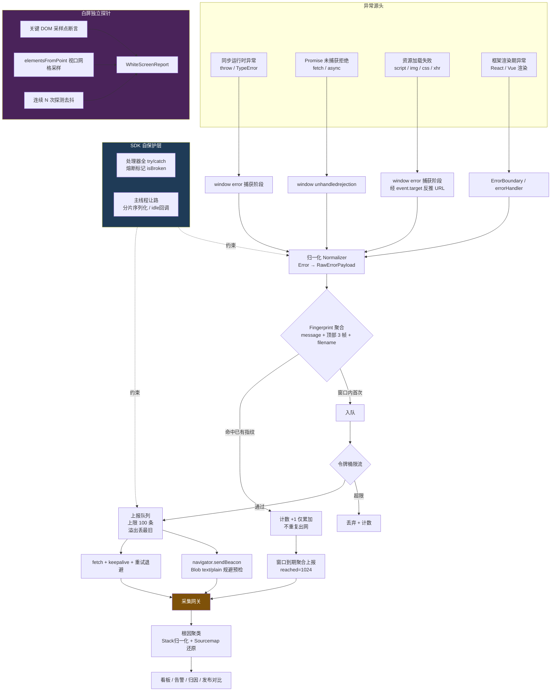
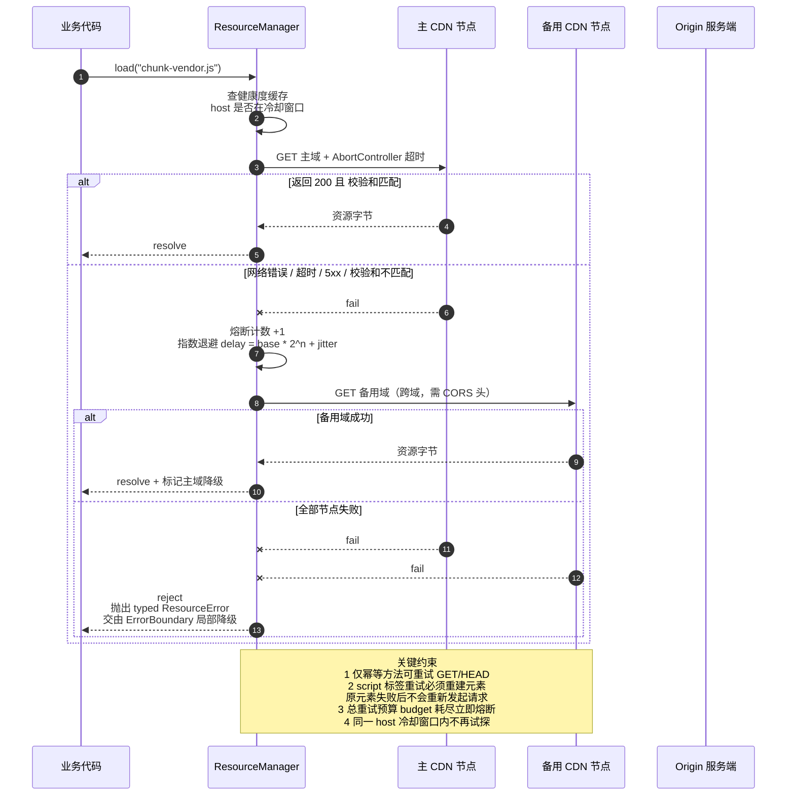
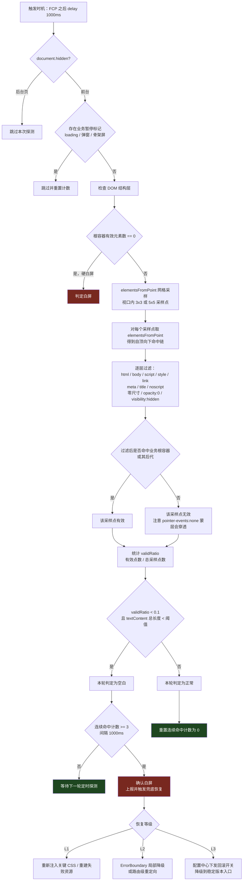

# 调试能力✅

## 如果用户说 web 应用感觉很反应慢或者卡顿，该如何排查？ {#p0-debug-jank-slow}

<Answer>

如果用户觉得 web 应用反应卡顿， 主要从哪几个方面来排查？

* 加载慢
* 资源下载慢
* 首屏并发请求资源过多
* 首屏接口慢
* 首屏对应的 JS 执行慢
* 首屏渲染慢
* 首屏加载静态资源过大
* .......
* 执行过程慢
* 接口慢
* long tasks 太多, 阻塞 JS 执行
* 内存泄漏
* 重绘重排 过多
* 关键节点没有加 节流防抖
* .......

 主要排查手段有哪些

* **通过建立性能监控指标**: 通过真实用户数据反馈， 来判断用户是否卡顿， 包含网络监控、运行时性能监控

* **Chrome devtools: NetWork** 主要排查网络问题
*

 

* **Chrome devtools: Performance** 主要细查性能运行时性能，包含了 long tasks、render 次数、重排重绘、执行时间线、阻塞场景


* **Chrome devtools: Performance monitor** 主要监控用户运行时性能，看看是否有内存泄露
  
 

* **React Developer Tools**: 可以用于追踪 react 应用性能、渲染次数、重排重绘


* **Lighthouse**: 全面分析网页性能的一个工具、支持浏览器插件


* **webpack-bundle-analyzer**: 进行产物依赖分析、包大小分析

* **抓包**: 通过抓包的方式， 看看线上请求分析、请求模拟、网络劫持之后仅仅看 JS 执行时间

* **E2E测试**: 通过 E2E 进行性能预检， 每次上线前进行一系列系统操作， 看看时间耗时和线上耗时波动

 主要解决办法和思路

**首屏加载慢的方向**

* 资源加载方向
* 使用 `tree shaking` 减少包体积
* 代码压缩和混淆
* 对于高版本浏览器， 直接使用 ES6 语法，低版本浏览器再使用 ES5（es6 语法代码量会比编译成 es5 代码量小很多， 且执行速度也快）
* 使用 `split chunks` 进行大包拆分、小包复用
* 使用 `gzip`
* 使用 图片压缩
* 使用 雪碧图
* 图标使用 `iconfont` 加载
* 懒加载， 仅加载首屏必要资源
* 使用 `tailwindcss` 等技术， 复用 css
* 使用 `微前端` 技术，首屏仅加载当前子应用页面，可以做到只加载整站很少的一部分代码
* 首屏非必要依赖尽量延后到 FMP 或者 TTI 之后再加载
* 组件微前端化

* 渲染方向
* 尽量减少重排重绘
* 减少重复渲染（useMemo、useCallback、memo 等）
* 减少 setState 次数（多次 setState 可以合并为一次）
* 尽量减少 dom 节点深度

* 网络方向
* 使用流式服务端渲染， 可以查看文档：[资料](https://juejin.cn/post/6953819275941380109)
* 使用服务端渲染， 减少首屏请求
* 使用 SSG 静态站点生成
* 首屏必要数据， 不作客户端请求， 用后端模板注入
* 使用 BFF 进行请求聚合
* 使用 CDN 进行网络请求分发
* DNS Prefetch
* 资源预加载（在闲暇时间加载后续页面所需要的资源和接口，例如：link rel preload）
* 启用 HTTP2 多路复用
* 在业务逻辑上， 首屏必要接口提前（例如在 html 加载的那一瞬间，利用一个非常小的 js 文件将首屏需要的请求发送出去, 然后缓存下来， 到业务使用的时候直接就使用即可）
* 使用缓存技术缓存资源与请求：强缓存、协商缓存、离线缓存、Service Worker 缓存、后端业务缓存

**运行时卡顿方向**

* 查看是否存在有有 `long tasks`， 有计划的拆解 `long tasks`
* 解决项目中复杂度问题： [资料](https://www.jianshu.com/p/ffbb25380904)
* 排查项目是否有内存泄露
* 排查特定业务流程是否有慢接口
* 高复杂计算逻辑放在 service worker 处理

 参考文档

**延伸阅读**

* [如何分析页面加载慢](https://www.jianshu.com/p/24b93b13e5a9)
* [前端性能优化指南](https://juejin.cn/post/7096144248713510943)
* [Web 性能监控实践](https://juejin.cn/post/6882936217609732110)
* [前端性能调试技巧](https://juejin.cn/post/7119074496610304031)
* [性能优化最佳实践](https://juejin.cn/post/7159807927908302884)

</Answer>

## 如何定位一个偶现的问题？ {#p2-debug-occasional}

<Answer>

**偶现问题的定位策略**

1. **日志分析**：第一时间查看现场日志和监控数据，寻找异常模式
2. **环境复现**：收集设备信息、时间戳、用户操作路径，尝试还原问题场景
3. **持续观察**：对于低频问题，建立监控和埋点，收集更多数据
4. **优先级判断**：根据问题严重程度和出现频率决定处理策略

**实用建议**

* 建立完善的日志系统和错误监控
* 使用用户行为录制工具（如 rrweb）
* 设置合理的错误报告机制
* 建立问题分级处理流程

**延伸阅读**

* [前端错误监控实践](https://web.dev/articles/monitoring-performance)
* [日志系统设计指南](https://developer.mozilla.org/zh-CN/docs/Web/API/Console_API)

</Answer>

## 如何禁止别人调试自己的前端页面代码？ {#p2-anti-debug}

<Answer>

* 前端页面防止调试的方法主要是通过不断 `debugger` 来疯狂输出断点，因为 `debugger` 在控制台被打开的时候就会执行
* 由于程序被 `debugger` 阻止，所以无法进行断点调试，所以网页的请求也是看不到的
* 基础代码如下：

```js
/**
* 基础禁止调试代码
*/
(() => {
  function ban () {
    setInterval(() => {
      // eslint-disable-next-line
      debugger
    }, 50)
  }
  try {
    ban()
  } catch (err) { }
})()
```

**无限 debugger 的对策**

* 如果仅仅是加上面那么简单的代码，对于一些技术人员而言作用不大
* 可以通过控制台中的 `Deactivate breakpoints` 按钮或者使用快捷键 `Ctrl + F8` 关闭无限 `debugger`
* 这种方式虽然能去掉碍眼的 `debugger`，但是无法通过左侧的行号添加 `breakpoint`

**禁止断点的对策**

* 如果将 `setInterval` 中的代码写在一行，就能禁止用户断点，即使添加 `logpoint` 为 `false` 也无用
* 当然即使有些人想到用左下角的格式化代码，将其变成多行也是没用的

```js
(() => {
  function ban () {
    setInterval(() => {
      // debugger
    }, 50)
  }
  try {
    ban()
  } catch (err) { }
})()
```

**忽略执行的代码**

* 通过添加 `add script ignore list` 需要忽略执行代码行或文件
* 也可以达到禁止无限 `debugger`

**忽略执行代码的对策**

* 那如何针对上面操作的恶意用户呢
* 可以通过将 `debugger`改写成 `Function("debugger")();` 的形式来应对
* `Function` 构造器生成的 `debugger` 会在每一次执行时开启一个临时 `js` 文件
* 当然使用的时候，为了更加的安全，最好使用加密后的脚本

```js
// 加密前
(() => {
  function ban () {
    setInterval(() => {
      // eslint-disable-next-line
      Function('debugger')()
    }, 50)
  }
  try {
    ban()
  } catch (err) { }
})()

// 加密后
// eslint-disable-next-line
eval(function (c, g, a, b, d, e) { d = String; if (!''.replace(/^/, String)) { for (;a--;)e[a] = b[a] || a; b = [function (f) { return e[f] }]; d = function () { return '\w+' }; a = 1 } for (;a--;)b[a] && (c = c.replace(new RegExp('\b' + d(a) + '\b', 'g'), b[a])); return c }('(()=>{1 0(){2(()=>{3("4")()},5)}6{0()}7(8){}})();', 9, 9, 'block function setInterval Function debugger 50 try catch err'.split(' '), 0, {}))
```

**终极增强防调试代码**

* 为了让自己写出来的代码更加的晦涩难懂，需要对上面的代码再优化一下
* 将 `Function('debugger').call()`改成 `(function(){return false;})['constructor']('debugger')['call']();`
* 并且添加条件，当窗口外部宽高和内部宽高的差值大于一定的值 ，我把 `body` 里的内容换成指定内容
* 当然使用的时候，为了更加的安全，最好加密后再使用

```js
(() => {
  function block () {
    if (window.outerHeight - window.innerHeight > 200 || window.outerWidth - window.innerWidth > 200) {
      document.body.innerHTML = '检测到非法调试,请关闭后刷新重试!'
    }
    setInterval(() => {
      (function () {
        return false
      }
        .constructor('debugger')
        .call())
    }, 50)
  }
  try {
    block()
  } catch (err) { }
})()
```

**延伸阅读**

* [前端反调试技术详解](https://juejin.cn/post/7262175454714626108)
* [Chrome DevTools 高级调试技巧](https://developer.chrome.com/docs/devtools/)

</Answer>

## 用户访问页面白屏了，原因是什么，如何排查？ {#p2-debug-white-screen}

<Answer>

用户访问页面白屏可能由多种原因引起，以下是一些可能的原因和排查步骤：

1. 网络问题：用户的网络连接可能存在问题，无法正确加载页面内容。可以要求用户检查网络连接，或者自己尝试在不同网络环境下测试页面的加载情况。

2. 服务端问题：服务器未正确响应用户请求，导致页面无法加载。可以检查服务器的状态、日志和错误信息，查看是否有任何异常。同时，可以确认服务器上的相关服务是否正常运行。

3. 前端代码问题：页面的前端代码可能存在错误或异常，导致页面无法正常渲染。可以检查浏览器的开发者工具，查看是否有任何错误信息或警告。同时，可以尝试将页面的JavaScript、CSS和HTML代码分离出来进行单独测试，以确定具体的问题所在。

4. 浏览器兼容性问题：不同浏览器对于某些代码的支持可能不一致，导致页面在某些浏览器中无法正常加载。可以尝试在不同浏览器中测试页面的加载情况，同时使用浏览器的开发者工具检查是否有任何错误或警告。

5. 第三方资源加载问题：页面可能依赖于某些第三方资源（如外部脚本、样式表等），如果这些资源无法加载，可能导致页面白屏。可以检查网络请求是否正常，是否有任何资源加载失败的情况。

6. 缓存问题：浏览器可能在缓存中保存了旧版本的页面或资源，导致新版本无法加载。可以尝试清除浏览器缓存，或者通过添加随机参数或修改文件名的方式强制浏览器重新加载页面和资源。

7. 其他可能原因：页面白屏问题还可能由于安全策略（如CSP、CORS等）限制、跨域问题、DNS解析问题等引起。可以使用浏览器的开发者工具检查网络请求和错误信息，查找可能的问题。

在排查问题时，可以根据具体情况逐步进行排查，并结合浏览器的开发者工具、服务器日志等工具来辅助定位问题所在，并且可以与用户进行进一步沟通以获取更多信息。如果问题无法解决，可以寻求专业的技术支持或咨询。

**延伸阅读**

* [前端白屏问题排查指南](https://web.dev/articles/debug-performance-in-the-field)
* [浏览器开发者工具使用指南](https://developer.chrome.com/docs/devtools/)
* [前端错误监控与排查](https://developer.mozilla.org/zh-CN/docs/Web/API/Window/error_event)

</Answer>

## 网页卡顿问题排查（Jank） {#p0-debug-jank}

<Answer>

排查网页卡顿问题时，可以按照以下步骤进行处理：

1. 验证用户反馈：首先，确认用户反馈的卡顿问题是否普遍存在，还是个别用户的特殊情况。可以与其他用户进行沟通或观察其他设备上的表现。

2. 检查网络连接：检查用户的网络连接是否稳定。卡顿问题可能由于网络延迟或不稳定导致。可以要求用户进行网络速度测试，或者与用户确认网络连接是否正常。

3. 检查服务器性能：确认服务器是否能够处理用户的请求。可以检查服务器的负载情况、处理请求的时间以及资源使用情况。如果服务器负载过高，可能导致网页卡顿。

4. 检查前端代码：检查网页的前端代码是否存在问题。主要看是否有内存泄露、long task 等情况；
关于内存泄露和 long task 可以看下面两个文档：

* [JS 内存泄露问题该如何排查？](https://github.com/pro-collection/interview-question/issues/76)

* [Long Tasks 了解多少？](https://github.com/pro-collection/interview-question/issues/255)

5. 优化网页性能：对于前端代码存在性能问题的情况，可以尝试优化网页性能。例如，压缩和合并CSS和JavaScript文件、减少网络请求次数、使用缓存等方法来提高页面加载速度。
可以参考下面文档文档：

* [从哪些方面可以对网站性能优化？](https://github.com/pro-collection/interview-question/issues/89)

6. 做好性能监控：持续监测网页的性能，并定期更新网页的代码和设计，以提升用户体验。

**延伸阅读**

* [JS 内存泄露问题排查](https://github.com/pro-collection/interview-question/issues/76)
* [Long Tasks 深入了解](https://github.com/pro-collection/interview-question/issues/255)
* [网站性能优化方案](https://github.com/pro-collection/interview-question/issues/89)
* [页面性能指标详解](https://github.com/pro-collection/interview-question/issues/515)

</Answer>

## Source Map 原理与应用 {#p0-source-map}

<Answer>

 Source Map（源映射）作用

Source Map（源映射）是一种文件，用于将压缩、混淆或编译后的代码映射回原始的源代码，以便在调试过程中能够直接查看和调试源代码。它提供了压缩文件和源文件之间的映射关系，包括每个压缩文件中的代码位置、原始文件的路径和行号等信息。

Source Map的主要作用如下：

1. 调试：在开发过程中，源代码经常会被压缩、合并或转换为其他形式的代码，这使得在调试时直接查看和调试源代码变得困难。Source Map提供了一种方式，通过将压缩代码映射回源代码，开发者可以在调试器中直接查看和调试原始的、易于理解的源代码。

2. 错误追踪：当发生错误或异常时，浏览器或运行环境会提供错误信息，其中包含了压缩后的代码行号和列号。Source Map可以将这些行号和列号映射回源代码的行号和列号，帮助开发者定位和追踪错误。

3. 性能分析：Source Map可以提供压缩文件中每个代码片段对应的原始文件位置信息，这对于性能分析工具来说非常有用。性能分析工具可以使用Source Map来将性能数据映射回源代码，以便更准确地分析和优化代码性能。

Source Map的原理是通过在压缩文件中添加特定的注释或者生成独立的.map文件来存储映射关系。在调试过程中，浏览器或调试器会读取Source Map，并根据其中的映射关系将压缩代码中的行号、列号等信息映射回源代码的对应位置。

 Source Map（源映射）实现原理

Source Map 的实现原理可以简单描述如下：

1. 生成 Source Map：在代码的压缩、混淆或编译过程中，生成器会创建一个 Source Map 对象，并收集相关的映射信息。这些信息包括原始文件路径、行号、列号以及对应的压缩文件中的位置信息。

2. 生成编码字符串：将收集到的映射信息使用 VLQ（Variable Length Quantity）编码进行压缩，将数字转换为可变长度的 Base64 编码字符串。VLQ 编码能够通过特定的规则将数字转换为可变长度的字符串，以减小 Source Map 的体积。

3. 关联 Source Map：在生成的压缩文件中，通过注释或独立的 .map 文件将 Source Map 关联到压缩文件。注释方式可以通过特定的注释语法将编码字符串直接嵌入到压缩文件中，而独立的 .map 文件则将编码字符串保存在一个独立的文件中。

4. 调试时使用 Source Map：在调试过程中，当开发者需要查看或调试源代码时，浏览器或调试工具会加载关联的 Source Map 文件，根据映射关系将压缩文件中的位置信息映射回源代码的对应位置。

通过这种方式，Source Map 实现了将压缩后的代码映射回原始源代码的功能，使得在调试、错误追踪和性能分析时能够更方便地操作和理解源代码。实际上，Source Map 的实现会有更多的细节和规范，但以上是其基本的实现原理概述。

**延伸阅读**

* [Source Map 详解](https://developer.mozilla.org/zh-CN/docs/Tools/Debugger/How_to/Use_a_source_map)
* [Webpack Source Map 配置](https://webpack.js.org/configuration/devtool/)
* [调试压缩代码最佳实践](https://web.dev/articles/source-maps)

</Answer>

## 内存泄漏定位与排查 {#p0-memory-debug}

<Answer>

> 该问题转载自：[资料](https://github.com/zhansingsong/js-leakage-patterns)

> **内存泄漏**指由于疏忽或错误造成程序未能释放已经不再使用的内存。内存泄漏并非指内存在物理上的消失，而是应用程序分配某段内存后，由于设计错误，导致在释放该段内存之前就失去了对该段内存的控制，从而造成了内存的浪费。内存泄漏通常情况下只能由获得程序源代码的程序员才能分析出来。然而，有不少人习惯于把任何不需要的内存使用的增加描述为内存泄漏，即使严格意义上来说这是不准确的。
> ————[wikipedia](https://zh.wikipedia.org/wiki/%E5%86%85%E5%AD%98%E6%B3%84%E6%BC%8F)

**⚠️ 注：下文中标注的 CG 是 Chrome 浏览器中 Devtools 的【Collect garbage】按钮缩写，表示回收垃圾操作。**


外的全局变量

JavaScript 对未声明变量的处理方式：在全局对象上创建该变量的引用(即全局对象上的属性，不是变量，因为它能通过`delete`删除)。如果在浏览器中，全局对象就是**window**对象。

如果未声明的变量缓存大量的数据，会导致这些数据只有在窗口关闭或重新刷新页面时才能被释放。这样会造成意外的内存泄漏。

```js
function foo (arg) {
  bar = 'this is a hidden global variable with a large of data'
}
```

等同于：

```js
function foo (arg) {
  window.bar = 'this is an explicit global variable with a large of data'
}
```

另外，通过**this**创建意外的全局变量：

```js
function foo () {
  this.variable = 'potential accidental global'
}

// 当在全局作用域中调用foo函数，此时this指向的是全局对象(window)，而不是'undefined'
foo()
```

 解决方法

在 JavaScript 文件中添加`'use strict'`，开启严格模式，可以有效地避免上述问题。

```js
function foo (arg) {
  'use strict' // 在foo函数作用域内开启严格模式
  bar = 'this is an explicit global variable with a large of data' // 报错：因为bar还没有被声明
}
```

如果需要在一个函数中使用全局变量，可以像如下代码所示，在**window**上明确声明：

```js
function foo (arg) {
  window.bar = 'this is a explicit global variable with a large of data'
}
```

这样不仅可读性高，而且后期维护也方便

> 谈到全局变量，需要注意那些用来临时存储大量数据的全局变量，确保在处理完这些数据后将其设置为 null 或重新赋值。全局变量也常用来做 cache，一般 cache 都是为了性能优化才用到的，为了性能，最好对 cache 的大小做个上限限制。因为 cache 是不能被回收的，越高 cache 会导致越高的内存消耗。

onsole.log

`console.log`：向 web 开发控制台打印一条消息，常用来在开发时调试分析。有时在开发时，需要打印一些对象信息，但发布时却忘记去掉`console.log`语句，这可能造成内存泄露。

在传递给`console.log`的对象是不能被垃圾回收 ♻️，因为在代码运行之后需要在开发工具能查看对象信息。所以最好不要在生产环境中`console.log`任何对象。

 实例

```html
<!DOCTYPE html>
<html lang="en">

<head>
 <meta charset="UTF-8">
 <meta name="viewport" content="width=device-width, initial-scale=1.0">
 <meta http-equiv="X-UA-Compatible" content="ie=edge">
 <title>Leaker</title>
</head>

<body>
 <input type="button" value="click">
 <script>
 !function () {
 function Leaker() {
 this.init();
 };
 Leaker.prototype = {
 init: function () {
 this.name = (Array(100000)).join('*');
 console.log("Leaking an object %o: %o", (new Date()), this);// this对象不能被回收
 },

 destroy: function () {
 // do something....
 }
 };
 document.querySelector('input').addEventListener('click', function () {
 new Leaker();
 }, false);
 }()
 </script>
</body>

</html>
```

这里结合 Chrome 的 Devtools–>Performance 做一些分析，操作步骤如下：

<u>**:warning:注：最好在隐藏窗口中进行分析工作，避免浏览器插件影响分析结果**</u>

1. 开启【Performance】项的记录
2. 执行一次 CG，创建基准参考线
3. 连续单击【click】按钮三次，新建三个 Leaker 对象
4. 执行一次 CG
5. 停止记录


可以看出【JS Heap】线最后没有降回到基准参考线的位置，显然存在没有被回收的内存。如果将代码修改为：

```js
!(function () {
  function Leaker () {
    this.init()
  }
  Leaker.prototype = {
    init: function () {
      this.name = Array(100000).join('*')
    },

    destroy: function () {
      // do something....
    }
  }
  document.querySelector('input').addEventListener(
    'click',
    function () {
      new Leaker()
    },
    false
  )
})()
```

去掉`console.log("Leaking an object %o: %o", (new Date()), this);`语句。重复上述的操作步骤，分析结果如下：


从对比分析结果可知，`console.log`打印的对象是不会被垃圾回收器回收的。因此最好不要在页面中`console.log`任何大对象，这样可能会影响页面的整体性能，特别在生产环境中。除了`console.log`外，另外还有`console.dir`、`console.error`、`console.warn`等都存在类似的问题，这些细节需要特别的关注。

losures(闭包)

当一个函数 A 返回一个内联函数 B，即使函数 A 执行完，函数 B 也能访问函数 A 作用域内的变量，这就是一个闭包——————本质上闭包是将函数内部和外部连接起来的一座桥梁。

```js
function foo (message) {
  function closure () {
    console.log(message)
  }
  return closure
}

// 使用
const bar = foo('hello closure!')
bar() // 返回 'hello closure!'
```

在函数 foo 内创建的函数 closure 对象是不能被回收掉的，因为它被全局变量 bar 引用，处于一直可访问状态。通过执行`bar()`可以打印出`hello closure!`。如果想释放掉可以将`bar = null`即可。

<u>**由于闭包会携带包含它的函数的作用域，因此会比其他函数占用更多的内存。过度使用闭包可能会导致内存占用过多。**</u>

 实例

```html
<!DOCTYPE html>
<html lang="en">

<head>
 <meta charset="UTF-8">
 <meta name="viewport" content="width=device-width, initial-scale=1.0">
 <meta http-equiv="X-UA-Compatible" content="ie=edge">
 <title>Closure</title>
</head>

<body>
 <p>不断单击【click】按钮</p>
 <button id="click_button">Click</button>
 <script>
 function f() {
 var str = Array(10000).join('#');
 var foo = {
 name: 'foo'
 }
 function unused() {
 var message = 'it is only a test message';
 str = 'unused: ' + str;
 }
 function getData() {
 return 'data';
 }
 return getData;
 }

 var list = [];

 document.querySelector('#click_button').addEventListener('click', function () {
 list.push(f());
 }, false);
 </script>
</body>

</html>
```

这里结合 Chrome 的 Devtools->Memory 工具进行分析，操作步骤如下：

<u>**:warning:注：最好在隐藏窗口中进行分析工作，避免浏览器插件影响分析结果**</u>

1. 选中【Record allocation timeline】选项
2. 执行一次 CG
3. 单击【start】按钮开始记录堆分析
4. 连续单击【click】按钮十多次
5. 停止记录堆分析


上图中蓝色柱形条表示随着时间新分配的内存。选中其中某条蓝色柱形条，过滤出对应新分配的对象：


查看对象的详细信息：


从图可知，在返回的闭包作用链(Scopes)中携带有它所在函数的作用域，作用域中还包含一个 str 字段。而 str 字段并没有在返回 getData()中使用过。为什么会存在在作用域中，按理应该被 GC 回收掉， why:question:

原因是在相同作用域内创建的多个内部函数对象是共享同一个[变量对象（variable object）](http://dmitrysoshnikov.com/ecmascript/chapter-2-variable-object/)。如果创建的内部函数没有被其他对象引用，不管内部函数是否引用外部函数的变量和函数，在外部函数执行完，对应变量对象便会被销毁。反之，如果内部函数中存在有对外部函数变量或函数的访问（可以不是被引用的内部函数），并且存在某个或多个内部函数被其他对象引用，那么就会形成闭包，外部函数的变量对象就会存在于闭包函数的作用域链中。这样确保了闭包函数有权访问外部函数的所有变量和函数。了解了问题产生的原因，便可以对症下药了。对代码做如下修改：

```js
function f () {
  const str = Array(10000).join('#')
  const foo = {
    name: 'foo'
  }
  function unused () {
    const message = 'it is only a test message'
    // str = 'unused: ' + str; //删除该条语句
  }
  function getData () {
    return 'data'
  }
  return getData
}

const list = []

document.querySelector('#click_button').addEventListener(
  'click',
  function () {
    list.push(f())
  },
  false
)
```

getData()和 unused()内部函数共享 f 函数对应的变量对象，因为 unused()内部函数访问了 f 作用域内 str 变量，所以 str 字段存在于 f 变量对象中。加上 getData()内部函数被返回，被其他对象引用，形成了闭包，因此对应的 f 变量对象存在于闭包函数的作用域链中。这里只要将函数 unused 中`str = 'unused: ' + str;`语句删除便可解决问题。


查看一下闭包信息：


OM 泄露

在 JavaScript 中，DOM 操作是非常耗时的。因为 JavaScript/ECMAScript 引擎独立于渲染引擎，而 DOM 是位于渲染引擎，相互访问需要消耗一定的资源。如 Chrome 浏览器中 DOM 位于 WebCore，而 JavaScript/ECMAScript 位于 V8 中。假如将 JavaScript/ECMAScript、DOM 分别想象成两座孤岛，两岛之间通过一座收费桥连接，过桥需要交纳一定“过桥费”。JavaScript/ECMAScript 每次访问 DOM 时，都需要交纳“过桥费”。因此访问 DOM 次数越多，费用越高，页面性能就会受到很大影响。[了解更多:information_source:](http://www.phpied.com/dom-access-optimization/)


为了减少 DOM 访问次数，一般情况下，当需要多次访问同一个 DOM 方法或属性时，会将 DOM 引用缓存到一个局部变量中。<u>但如果在执行某些删除、更新操作后，可能会忘记释放掉代码中对应的 DOM 引用，这样会造成 DOM 内存泄露。</u>

 实例------>

```html
<!DOCTYPE html>
<html lang="en">
<head>
 <meta charset="UTF-8">
 <meta name="viewport" content="width=device-width, initial-scale=1.0">
 <meta http-equiv="X-UA-Compatible" content="ie=edge">
 <title>Dom-Leakage</title>
</head>
<body>
 <input type="button" value="remove" class="remove" style="display:none;">
 <input type="button" value="add" class="add">

 <div class="container">
 <pre class="wrapper"></pre>
 </div>
 <script>
 // 因为要多次用到pre.wrapper、div.container、input.remove、input.add节点，将其缓存到本地变量中，
 var wrapper = document.querySelector('.wrapper');
 var container = document.querySelector('.container');
 var removeBtn = document.querySelector('.remove');
 var addBtn = document.querySelector('.add');
 var counter = 0;
 var once = true;
 // 方法
 var hide = function(target){
 target.style.display = 'none';
 }
 var show = function(target){
 target.style.display = 'inline-block';
 }
 // 回调函数
 var removeCallback = function(){
 removeBtn.removeEventListener('click', removeCallback, false);
 addBtn.removeEventListener('click', addCallback, false);
 hide(addBtn);
 hide(removeBtn);
 container.removeChild(wrapper);
 }
 var addCallback = function(){
 wrapper.appendChild(document.createTextNode('\t' + ++counter + '：a new line text\n'));
 // 显示删除操作按钮
 if(once){
 show(removeBtn);
 once = false;
 }
 }
 // 绑定事件
 removeBtn.addEventListener('click', removeCallback, false);
 addBtn.addEventListener('click', addCallback, false);
 </script>
</body>
</html>
```

这里结合 Chrome 浏览器的 Devtools–>Performance 做一些分析，操作步骤如下：

<u>**:warning:注：最好在隐藏窗口中进行分析工作，避免浏览器插件影响分析结果**</u>

1. 开启【Performance】项的记录
2. 执行一次 CG，创建基准参考线
3. 连续单击【add】按钮 6 次，增加 6 个文本节点到 pre 元素中
4. 单击【remove】按钮，删除刚增加 6 个文本节点和 pre 元元素
5. 执行一次 CG
6. 停止记录堆分析


从分析结果图可知，虽然 6 次 add 操作增加 6 个 Node，但是 remove 操作并没有让 Nodes 节点数下降，即 remove 操作失败。尽管还主动执行了一次 CG 操作，Nodes 曲线也没有下降。因此可以断定内存泄露了！那问题来了，如何去查找问题的原因呢？这里可以通过 Chrome 浏览器的 Devtools–>Memory 进行诊断分析，执行如下操作步骤：

<u>**:warning:注：最好在隐藏窗口中进行分析工作，避免浏览器插件影响分析结果**</u>

1. 选中【Take heap snapshot】选项
2. 连续单击【add】按钮 6 次，增加 6 个文本节点到 pre 元素中
3. 单击【Take snapshot】按钮，执行一次堆快照
4. 单击【remove】按钮，删除刚增加 6 个文本节点和 pre 元元素
5. 单击【Take snapshot】按钮，执行一次堆快照
6. 选中生成的第二个快照报告，并将视图由"Summary"切换到"Comparison"对比模式，在[class filter]过滤输入框中输入关键字：**Detached**


从分析结果图可知，导致整个 pre 元素和 6 个文本节点无法别回收的原因是：代码中存在全局变量`wrapper`对 pre 元素的引用。知道了产生的问题原因，便可对症下药了。对代码做如下就修改：

```js
// 因为要多次用到pre.wrapper、div.container、input.remove、input.add节点，将其缓存到本地变量中，
let wrapper = document.querySelector('.wrapper')
const container = document.querySelector('.container')
const removeBtn = document.querySelector('.remove')
const addBtn = document.querySelector('.add')
let counter = 0
let once = true
// 方法
const hide = function (target) {
  target.style.display = 'none'
}
const show = function (target) {
  target.style.display = 'inline-block'
}
// 回调函数
const removeCallback = function () {
  removeBtn.removeEventListener('click', removeCallback, false)
  addBtn.removeEventListener('click', addCallback, false)
  hide(addBtn)
  hide(removeBtn)
  container.removeChild(wrapper)

  wrapper = null // 在执行删除操作时，将wrapper对pre节点的引用释放掉
}
var addCallback = function () {
  wrapper.appendChild(
    document.createTextNode('\t' + ++counter + '：a new line text\n')
  )
  // 显示删除操作按钮
  if (once) {
    show(removeBtn)
    once = false
  }
}
// 绑定事件
removeBtn.addEventListener('click', removeCallback, false)
addBtn.addEventListener('click', addCallback, false)
```

在执行删除操作时，将 wrapper 对 pre 节点的引用释放掉，即在删除逻辑中增加`wrapper = null;`语句。再次在 Devtools–>Performance 中重复上述操作：


 小试牛刀

再来看看网上的一个实例，代码如下：

```html
<!DOCTYPE html>
<html lang="en">
<head>
 <meta charset="UTF-8">
 <meta name="viewport" content="width=device-width, initial-scale=1.0">
 <meta http-equiv="X-UA-Compatible" content="ie=edge">
 <title>Practice</title>
</head>
<body>
 <div id="refA"><ul><li><a href="#"></a></li><li><a href="#"></a></li><li><a href="#" id="refB"></a></li></ul></div>
 <div></div>
 <div></div>

 <script>
 var refA = document.getElementById('refA');
 var refB = document.getElementById('refB');
 document.body.removeChild(refA);

 // #refA不能GC回收，因为存在变量refA对它的引用。将其对#refA引用释放，但还是无法回收#refA。
 refA = null;

 // 还存在变量refB对#refA的间接引用(refB引用了#refB，而#refB属于#refA)。将变量refB对#refB的引用释放，#refA就可以被GC回收。
 refB = null;
 </script>
</body>
</html>
```

整个过程如下图所演示：


有兴趣的同学可以使用 Chrome 的 Devtools 工具，验证一下分析结果，实践很重要~~~:high_brightness:

imers

在 JavaScript 常用`setInterval()`来实现一些动画效果。当然也可以使用链式`setTimeout()`调用模式来实现：

```js
setTimeout(function () {
  // do something. . . .
  setTimeout(arguments.callee, interval)
}, interval)
```

如果在不需要`setInterval()`时，没有通过`clearInterval()`方法移除，那么`setInterval()`会不停地调用函数，直到调用`clearInterval()`或窗口关闭。如果链式`setTimeout()`调用模式没有给出终止逻辑，也会一直运行下去。因此再不需要重复定时器时，确保对定时器进行清除，避免占用系统资源。另外，在使用`setInterval()`和`setTimeout()`来实现动画时，无法确保定时器按照指定的时间间隔来执行动画。为了能在 JavaScript 中创建出平滑流畅的动画，浏览器为 JavaScript 动画添加了一个新 API-requestAnimationFrame()。[关于 setInterval、setTimeout 与 requestAnimationFrame 实现动画上的区别 ➹ 猛击 😊](https://github.com/zhansingsong/js-leakage-patterns/blob/master/requestAnimationFrame/requestAnimationFrame.md)

 实例

如下通过`setInterval()`实现一个 clock 的小实例，不过代码存在问题的，有兴趣的同学可以先尝试找一下问题的所在~~~~~😎
操作：

* 单击【start】按钮开始 clock，同时 web 开发控制台会打印实时信息
* 单击【stop】按钮停止 clock，同时 web 开发控制台会输出停止信息

```html
<!DOCTYPE html>
<html lang="en">
<head>
 <meta charset="UTF-8">
 <meta name="viewport" content="width=device-width, initial-scale=1.0">
 <meta http-equiv="X-UA-Compatible" content="ie=edge">
 <title>setInterval</title>
</head>
<body>
 <input type="button" value="start" class="start">
 <input type="button" value="stop" class="stop">

 <script>
 var counter = 0;
 var clock = {
 start: function () {
 setInterval(this.step.bind(null, ++counter), 1000);
 },
 step: function (flag) {
 var date = new Date();
 var h = date.getHours();
 var m = date.getMinutes();
 var s = date.getSeconds();
 console.log("%d-----> %d:%d:%d", flag, h, m, s);
 }
 }
 document.querySelector('.start').addEventListener('click', clock.start.bind(clock), false);
 document.querySelector('.stop').addEventListener('click', function () {
 console.log('----> stop <----');
 clock = null;
 }, false);
 </script>
</body>
</html>
```

上述代码存在两个问题：

1. 如果不断的单击【start】按钮，会断生成新的 clock。

2. 单击【stop】按钮不能停止 clock。

输出结果:


针对暴露出的问题，对代码做如下修改：

```js
let counter = 0
const clock = {
  timer: null,
  start: function () {
    // 解决第一个问题
    if (this.timer) {
      clearInterval(this.timer)
    }
    this.timer = setInterval(this.step.bind(null, ++counter), 1000)
  },
  step: function (flag) {
    const date = new Date()
    const h = date.getHours()
    const m = date.getMinutes()
    const s = date.getSeconds()
    console.log('%d-----> %d:%d:%d', flag, h, m, s)
  },
  // 解决第二个问题
  destroy: function () {
    console.log('----> stop <----')
    clearInterval(this.timer)
    node = null
    counter = void 0
  }
}
document
  .querySelector('.start')
  .addEventListener('click', clock.start.bind(clock), false)
document
  .querySelector('.stop')
  .addEventListener('click', clock.destroy.bind(clock), false)
```

ventListener

做移动开发时，需要对不同设备尺寸做适配。如在开发组件时，有时需要考虑处理横竖屏适配问题。一般做法，在横竖屏发生变化时，需要将组件销毁后再重新生成。而在组件中会对其进行相关事件绑定，如果在销毁组件时，没有将组件的事件解绑，在横竖屏发生变化时，就会不断地对组件进行事件绑定。这样会导致一些异常，甚至可能会导致页面崩掉。

 实例

```html
<!DOCTYPE html>
<html lang="en">
<head>
 <meta charset="UTF-8">
 <meta name="viewport" content="width=device-width, initial-scale=1.0">
 <meta http-equiv="X-UA-Compatible" content="ie=edge">
 <title>callbacks</title>
</head>
<body>
 <div class="container"></div>
 <script>
 var container = document.querySelector('.container');
 var counter = 0;
 var createHtml = function (n, counter) {
 var template = `${(new Array(n)).join(`<div>${counter}: this is a new data <input type="button" value="remove"></div>`)}`
 container.innerHTML = template;
 }

 var resizeCallback = function (init) {
 createHtml(10, ++counter);
 // 事件委托
 container.addEventListener('click', function (event){
 var target = event.target;
 if(target.tagName === 'INPUT'){
 container.removeChild(target.parentElement)
 }
 }, false);
 }
 window.addEventListener('resize', resizeCallback, false);
 resizeCallback(true);
 </script>
</body>
</html>
```

页面是存在问题的，这里结合 Devtools–>Performance 分析一下问题所在，操作步骤如下：

<u>**:warning:注：最好在隐藏窗口中进行分析工作，避免浏览器插件影响分析结果**</u>

1. 开启 Performance 项的记录
2. 执行一次 CG，创建基准参考线
3. 对窗口大小进行调整
4. 执行一次 CG
5. 停止记录


如分析结果所示，在窗口大小变化时，会不断地对`container`添加代理事件。

同一个元素节点注册了多个相同的 EventListener，那么重复的实例会被抛弃。这么做不会让得 EventListener 被重复调用，也不需要用 removeEventListener 手动清除多余的 EventListener，因为重复的都被自动抛弃了。而这条规则只是针对于命名函数。[对于匿名函数，浏览器会将其看做不同的 EventListener](https://triangle717.wordpress.com/2015/12/14/js-avoid-duplicate-listeners/)，所以只要将匿名的 EventListener，命名一下就可以解决问题：

```js
const container = document.querySelector('.container')
let counter = 0
const createHtml = function (n, counter) {
  const template = `${new Array(n).join(
 `<div>${counter}: this is a new data <input type="button" value="remove"></div>`
 )}`
  container.innerHTML = template
}
//
const clickCallback = function (event) {
  const target = event.target
  if (target.tagName === 'INPUT') {
    container.removeChild(target.parentElement)
  }
}
const resizeCallback = function (init) {
  createHtml(10, ++counter)
  // 事件委托
  container.addEventListener('click', clickCallback, false)
}
window.addEventListener('resize', resizeCallback, false)
resizeCallback(true)
```

在 Devtools–>Performance 中再重复上述操作，分析结果如下：


在开发中，开发者很少关注事件解绑，因为浏览器已经为我们处理得很好了。不过在使用第三方库时，需要特别注意，因为一般第三方库都实现了自己的事件绑定，如果在使用过程中，在需要销毁事件绑定时，没有调用所解绑方法，就可能造成事件绑定数量的不断增加。如下链接是我在项目中使用 jquery，遇见到类似问题：[jQuery 中忘记解绑注册的事件，造成内存泄露 ➹ 猛击 😊](https://github.com/zhansingsong/js-leakage-patterns/blob/master/%E5%86%85%E5%AD%98%E6%B3%84%E9%9C%B2%E4%B9%8BListeners/%E5%86%85%E5%AD%98%E6%B3%84%E9%9C%B2%E4%B9%8BListeners.md)

结

本文主要介绍了几种常见的内存泄露。在开发过程，需要我们特别留意一下本文所涉及到的几种内存泄露问题。因为这些随时可能发生在我们日常开发中，如果我们对它们不了解是很难发现它们的存在。可能在它们将问题影响程度放大时，才会引起我们的关注。不过那时可能就晚了，因为产品可能已经上线，接着就会严重影响产品的质量和用户体验，甚至可能让我们承受大量用户流失的损失。作为开发的我们必须把好这个关，让我们开发的产品带给用户最好的体验。

考文章

* [An interesting kind of JavaScript memory leak](https://blog.meteor.com/an-interesting-kind-of-JavaScript-memory-leak-8b47d2e7f156)
* [Memory Leaks in Microsoft Internet Explorer](http://isaacschlueter.com/2006/10/msie-memory-leaks/trackback/index.html)
* [Memory leak when logging complex objects](https://stackoverflow.com/questions/12996129/memory-leak-when-logging-complex-objects)

内存泄漏主要是指的是内存持续升高，但是如果是正常的内存增长的话，不应该被当作内存泄漏来排查。排查内存泄漏，我们可以借助`Chrome DevTools`的`Performance`和`Memory`选项。举个栗子：

我们新建一个`memory.html`的文件，完整代码如下：

```html
<!DOCTYPE html>
<html lang="en">
<head>
 <meta charset="UTF-8">
 <meta http-equiv="X-UA-Compatible" content="IE=edge">
 <meta name="viewport" content="width=device-width, initial-scale=1.0">
 <title>Document</title>
 <style>
 body {
 text-align: center;
 }
 </style>
</head>
<body>
 <p>检测内存变化</p>
 <button id="btn">开始</button>
 <script>
 const arr = [];
 // 数组中添加100万个数据
 for (let i = 0; i < 10010000; i++) {
 arr.push(i)
 }
 function bind() {
 const obj = {
 str: JSON.stringify(arr) // 浅拷贝的方式创建一个比较大的字符串
 }
 // 每次调用bind函数，都在全局绑定一个onclick监听事件，不一定非要执行
 // 使用绑定事件，主要是为了保持obj被全局标记
 window.addEventListener('click', () => {
 // 引用对象obj
 console.log(obj);
 })
 }
 let n = 0;
 function start() {
 setTimeout(() => {
 bind(); // 调用bind函数
 n++; // 循环次数增加
 if (n < 50) {
 start(); // 循环执行50次，注意这里并没有使用setInterval定时器
 } else {
 alert('done');
 }
 }, 200);
 }
 document.getElementById('btn').addEventListener('click', () => {
 start();
 })
 </script>
</body>
</html>

```

页面上有一个按钮用来开始函数调用，方便我们控制。点击按钮，每个200毫秒执行一次bind函数，即在全局监听click事件，循环次数为50次。

在无法确定是否发生内存泄漏时，我们可以先使用Performance来录制一段页面加载的性能变化，先判断是否有内存泄漏发生。

 Performance

本次案例仅以Chrome浏览器展开描述，其他浏览器可能会有些许差异。首先我们鼠标右键选择检查或者直接F12进入DevTools页面，面板上选择`Performance`，选择后应该是如下页面：

在开始之前，我们先点击一下`Collect garbage`和`clear`来保证内存干净，没有其他遗留内存的干扰。然后我们点击`Record`来开始录制，并且同时我们也要点击页面上的`开始`按钮，让我们的代码跑起来。等到代码结束后，我们再点击`Record`按钮以停止录制，录制的时间跟代码执行的时间相比会有出入，只要保证代码是完全执行完毕的即可。停止录制后，我们会得到如下的结果：

`Performance`的内容很多，我们只需要关注内存的变化，由此图可见，内存这块区域的曲线是在一直升高的并且到达顶点后并没有回落，这就有可能发生了内存泄漏。因为正常的内存变化曲线应该是类似于“锯齿”，也就是有上有下，正常增长后会有一定的回落，但不一定回落到和初始值一样。而且我们还可以隐约看到程序运行结束后，内存从初始的6.2MB增加到了差不多351MB，这个数量级的增加还是挺明显的。我们只是执行了50次循环，如果执行的次数更多，将会耗尽浏览器的内存空间，导致页面卡死。

虽然是有内存泄漏，但是如果我们想进一步看内存泄漏发生的地方，那么`Performance`就不够用了，这个时候我们就需要使用`Memory`面板。

 Memory

DevTools的Memory选项主要是用来录制堆内存的快照，为的是进一步分析内存泄漏的详细信息。有人可能会说，为啥不一开始就直接使用`Memory`呢，反而是先使用`Performance`。因为我们刚开始就说了，内存增长不表示就一定出现了内存泄漏，有可能是正常的增长，直接使用Memory来分析可能得不到正确的结果。

我们先来看一下怎么使用`Memory`：

首先选择`Memory`选项，然后清除缓存，在配置选项中选择堆内存快照。内存快照每次点击录制按钮都会记录当前的内存使用情况，我们可以在程序开始前点击一下记录初始的内存使用，代码结束后再点一下记录最终的内存使用，中间可以点击也可以不点击。最后在快照列表中至少可以得到两个内存记录：

初始内存我们暂时不深究，我们选择列表的最后一条记录，然后在筛选下拉框选择最后一个，即第一个快照和第二个快照的差异。

这里我们重点说一下`Shallow Size`和`Retained Size`的区别：

* Shallow Size：对象自身占用的内存大小，一般来说字符串、数组的Shallow Size都会比较大
* Retained Size：这个是对象自身占用的内存加上无法被GC释放的内存的大小，如果Retained Size和Shallow Size相差不大，基本上可以判定没有发生内存泄漏，但是**如果相差很大**，例如上图的`Object`，这就表明发生了内存泄漏。

我们再来细看一下`Object`，任意展开一个对象，可以在树结构中发现每一个对象都有一个全局事件绑定，并且占用了较大的内存空间。解决本案例涉及的内存泄漏也比较简单，就是及时释放绑定的全局事件。

关于`Performance`和`Memory`的详细使用可以参考：[手把手教你排查Javascript内存泄漏](https://link.juejin.cn?target=https%3A%2F%2Fzhuanlan.zhihu.com%2Fp%2F322356761 "https://zhuanlan.zhihu.com/p/322356761")

大多数情况下，垃圾回收器会帮我们及时释放内存，一般不会发生内存泄漏。但是有些场景是内存泄漏的高发区，我们在使用的时候一定要注意：

* 我们在开发的时候经常会使用`console`在控制台打印信息，但这也会带来一个问题：被`console`使用的对象是不能被垃圾回收的，这就可能会导致内存泄漏。因此在生产环境中不建议使用`console.log()`的理由就又可以加上一条避免内存泄漏了。

* 被全局变量、全局函数引用的对象，在Vue组件销毁时未清除，可能会导致内存泄漏

 ```js
 // Vue3
 <script setup>
 import {onMounted, onBeforeUnmount, reactive} from 'vue'
 const arr = reactive([1,2,3]);
 onMounted(() => {
 window.arr = arr; // 被全局变量引用
 window.arrFunc = () => {
 console.log(arr); // 被全局函数引用
 }
 })
 // 正确的方式
 onBeforeUnmount(() => {
 window.arr = null;
 window.arrFunc = null;
 })
 </script>
 
 ```

* 定时器未及时在Vue组件销毁时清除，可能会导致内存泄漏

 ```js
 // Vue3
 <script setup>
 import {onMounted, onBeforeUnmount, reactive} from 'vue'
 const arr = reactive([1,2,3]);
 const timer = reactive(null);
 onMounted(() => {
 setInterval(() => {
 console.log(arr); // arr被定时器占用，无法被垃圾回收
 }, 200);
 // 正确的方式
 timer = setInterval(() => {
 console.log(arr);
 }, 200);
 })
 // 正确的方式
 onBeforeUnmount(() => {
 if (timer) {
 clearInterval(timer);
 timer = null;
 }
 })
 </script>
 
 ```

 `setTimeout`和`setInterval`两个定时器在使用时都应该注意是否需要清理定时器，特别是`setInterval`，一定要注意清除。

* 绑定的事件未及时在Vue组件销毁时清除，可能会导致内存泄漏

 绑定事件在实际开发中经常遇到，我们一般使用`addEventListener`来创建。

 ```js
 // Vue3
 <script setup>
 import {onMounted, onBeforeUnmount, reactive} from 'vue'
 const arr = reactive([1,2,3]);
 const printArr = () => {
 console.log(arr)
 }
 onMounted(() => {
 // 监听事件绑定的函数为匿名函数，将无法被清除
 window.addEventListener('click', () => {
 console.log(arr); // 全局绑定的click事件，arr被引用，将无法被垃圾回收
 })
 // 正确的方式
 window.addEventListener('click', printArr);
 })
 // 正确的方式
 onBeforeUnmount(() => {
 // 注意清除绑定事件需要前后是同一个函数，如果函数不同将不会清除
 window.removeEventListener('click', printArr);
 })
 </script>
 
 ```

* 被自定义事件引用，在Vue组件销毁时未清除，可能会导致内存泄漏

 自定义事件通过`emit/on`来发起和监听，清除自定义事件和绑定事件差不多，不同的是需要调用`off`方法

 ```js
 // Vue3
 <script setup>
 import {onMounted, onBeforeUnmount, reactive} from 'vue'
 import event from './event.js'; // 自定义事件
 const arr = reactive([1,2,3]);
 const printArr = () => {
 console.log(arr)
 }
 onMounted(() => {
 // 使用匿名函数，会导致自定义事件无法被清除
 event.on('printArr', () => {
 console.log(arr)
 })
 // 正确的方式
 event.on('printArr', printArr)
 })
 // 正确的方式
 onBeforeUnmount(() => {
 // 注意清除自定义事件需要前后是同一个函数，如果函数不同将不会清除
 event.off('printArr', printArr)
 })
 </script>
 
 ```

除了及时清除监听器、事件等，对于全局变量的引用，我们可以选择`WeakMap`、`WeakSet`等弱引用数据类型。这样的话，即使我们引用的对象数据要被垃圾回收，弱引用的全局变量并不会阻止GC。

监控前端页面内存持续增长可以帮助我们及时发现内存泄漏和其他内存问题，从而优化前端页面的性能和稳定性。以下是一些监控前端页面内存持续增长的方法：

1. 使用浏览器开发工具：现代浏览器的开发工具提供了内存监控功能。您可以使用 Chrome 开发者工具、Firefox 开发者工具等浏览器工具来监控内存的使用情况，并在内存使用超过阈值时进行警报。

2. 手动检查页面代码：您可以手动检查页面的代码，特别是 JavaScript 代码和其他 DOM 操作，以查找可能导致内存泄漏的问题。例如，可能存在未清理的定时器、事件监听器、未释放的 DOM 元素等。

3. 使用性能监测工具：性能监测工具，例如 New Relic、AppDynamics 等，可以监测前端页面的性能，并提供关于内存使用的警报和报告。

4. 使用内存检测工具：内存检测工具，例如 memoryjs、heapdump.js 等，可以帮助检测内存泄漏和内存问题。这些工具可以生成内存快照，分析内存使用情况，以及识别潜在的内存泄漏问题。

通过以上方法的一些组合使用，可以帮助您监控前端页面内存持续增长的情况，及时发现和解决内存问题，提升用户体验和网站可靠性。

**延伸阅读**

* [JavaScript 内存泄漏模式详解](https://github.com/zhansingsong/js-leakage-patterns)
* [Chrome DevTools 内存调试](https://developer.chrome.com/docs/devtools/memory/)
* [前端内存泄漏排查指南](https://web.dev/articles/memory-debugging)
* [Vue.js 内存泄漏防范](https://vuejs.org/guide/best-practices/performance.html)

</Answer>

## 页面崩溃监控与排查 {#p0-crash}

<Answer>

对于 web 页面线上监控，如果页面崩溃了，通常会出现 500 或 404 状态码，或者页面停止响应或显示白屏等情况。

以下是一些监控崩溃的方法：

1. 使用网站性能监测工具：这些工具可以检测页面的状态码和响应时间，如果页面崩溃了，就会发出警报。一些流行的性能监测工具包括 New Relic, Pingdom, 和 UptimeRobot 等。

2. 设置异常检测：异常检测可以监测页面异常的行为，例如页面响应时间超过特定时间限制，或者页面元素加载失败等。通过设置这些异常检测，可以在页面崩溃时自动触发警报。

3. 实时用户行为监测：实时监测用户行为可以帮助识别用户在页面上的行为，例如页面停留时间，点击按钮的位置等，以便检测页面异常行为。这些监测可以使用 Google Analytics, Mixpanel 等网站分析工具实现。

4. 前端代码错误监测：使用前端监测工具，例如 Sentry, Raygun, 和 Bugsnag 等，可以监测前端代码错误，包括 JavaScript 和 CSS 错误，以便快速识别和解决问题。

通过以上方法的一些组合使用，可以帮助您监控 web 页面的崩溃，及时发现和解决问题，提升用户体验和网站可靠性。

 如果是页面运行时页面崩溃， 如何监控？

如果在运行时发生页面崩溃，可以使用以下方法进行监控：

1. 实时监控日志：可以设置日志监控，将日志实时发送到日志收集工具，例如 ELK Stack、Splunk 等。这些工具可以分析和提取有关页面崩溃的信息，例如错误消息、堆栈跟踪等，以便快速识别和解决问题。

2. 页面截图：当页面崩溃时，可以使用截图工具进行截屏，以捕获页面的当前状态。这些截图可以用于快速检查页面崩溃的根本原因。

3. 人工检测：可以雇用专业的质量测试人员或专业服务公司进行页面质量测试，以便在页面崩溃时进行手动检测和识别。

4. 实时异常检测：实时监测页面异常的行为，例如页面响应时间超过特定时间限制，或者页面元素加载失败等。通过设置这些异常检测，可以在页面崩溃时自动触发警报。

通过以上方法的一些组合使用，可以帮助您在运行时监控 web 页面的崩溃，及时发现和解决问题，提升用户体验和网站可靠性。

**延伸阅读**

* [Sentry 前端错误监控](https://sentry.io/for/javascript/)
* [Web 页面崩溃检测技术](https://web.dev/articles/monitor-performance)
* [前端异常监控最佳实践](https://developer.mozilla.org/zh-CN/docs/Web/API/Window/error_event)

</Answer>


## 前端全链路高可用稳定性保障与白屏监控体系：JS Runtime 异常捕获、资源加载容灾重试、白屏检测算法与线上热修复？ {#p0-frontend-stability-white-screen-monitoring}

<Answer>

**核心结论:**

1. **异常捕获的本质是"多逃逸路径互补"，不存在单一全能钩子。** 同步运行时异常走 `window.onerror`（等价 `addEventListener('error', h, true)`），Promise 拒绝走 `unhandledrejection`，资源加载失败只能靠**捕获阶段**的 `error` 事件从 `event.target` 反推 URL，框架渲染期异常走 React `componentDidCatch` / Vue `app.config.errorHandler`。四者捕获集合互不覆盖，这是35K+ 面试的第一个采分点。

2. **监控 SDK自身必须是"故障不放大"的旁路。** 线上事故的经典形态是：错误风暴把上报通道打满 → 上报接口超时 → 页面雪崩。防御手段是 fingerprint 聚合去重 + 令牌桶限流 + 上报队列上限 + `sendBeacon` 异步投递 + 处理器内部全 `try/catch` 与熔断降级。**任何 `JSON.stringify` 循环引用、任何 SDK 未捕获异常，都会把监控变成压垮业务的最后一根稻草。**

3. **白屏是"渲染结果断言"，不是"错误事件"的子集。** 报错不等于白屏（错误被 try/catch 吞掉、CSS 布局塌陷、路由渲染空组件）；白屏也不等于报错（JS 全部成功但接口返回空、骨架屏永久滞留）。因此必须有独立探针：`elementsFromPoint` 视口多点命中采样 + 关键 DOM 采样点断言 + 时序去抖（连续 N 次探测才判定），三者缺一不可。

4. **恢复能力要分三级降级，而非"重试一切"。** 资源级：指数退避 + 抖动 + 主备 CDN 跨域切换（仅幂等 GET/HEAD）；局部级：ErrorBoundary + 骨架屏 + 接口降级占位；全局级：配置中心秒级回滚开关 + Service Worker 拦截重写 + AST 热修复（必须带 TTL 与产物 hash 对账，防止长期分叉）。热修复本质是**用可控风险换不可控风险**，默认答案是开关回滚而非补丁。

**原理解析:**

**（一）全链路异常监控采集链路**



**（二）CDN 自动跨域重试链路**



**（三）`elementsFromPoint` 白屏判定决策树**



**规范实现:**

```ts
/* ============================================================================
 * 1. 完整类型声明层
 * ========================================================================== */

export type ErrorCategory =
  | 'js_error'          // window.onerror 捕获的同步异常
  | 'promise_rejection' // unhandledrejection
  | 'resource_error'    // script/img/link/css 等静态资源加载失败
  | 'http_error'        // XHR / fetch 非 2xx
  | 'framework_error'   // React/Vue 渲染期
  | 'custom';           // 业务主动上报

export type Level = 'debug' | 'info' | 'warning' | 'error' | 'fatal';

export interface Breadcrumb {
  type: 'navigation' | 'click' | 'xhr' | 'console' | 'custom';
  timestamp: number;
  category: string;
  message: string;
  /** 上报前主动脱敏，避免把 token / 手机号打进日志 */
  scrubbed: boolean;
}

/**归一化后的统一上报载荷 */
export interface MonitorReport {
  category: ErrorCategory;
  level: Level;
  message: string;
  stack: string;
  fingerprint: string;
  /** 归因用：哪一次发布引入 */
  appId: string;
  release: string;
  url: string;
  userAgent: string;
  timestamp: number;
  /** 资源/HTTP 类专有字段 */
  resourceUrl?: string;
  resourceType?: string;
  status?: number;
  elapsedMs?: number;
  /** 白屏专有字段 */
  whiteScreen?: WhiteScreenEvidence;
  breadcrumbs: Breadcrumb[];
  /** 命中已有指纹时的聚合计数 */
  reached?: number;
}

/** 白屏判定证据链，缺了它看板无法归因 */
export interface WhiteScreenEvidence {
  validRatio: number;
  samplePoints: number;
  validPoints: number;
  domElementCount: number;
  textLength: number;
  consecutiveHits: number;
  /** 命中的无效元素签名，便于聚类 */
  blankSignature: string;
  stage: 'first_screen' | 'route_change';
}

export interface ResourceReport {
  url: string;
  type: string;
  nodeTag: string;
}

export interface ExceptionInterceptorOptions {
  appId: string;
  release: string;
  reportUrl: string;
  /** 0< sampleRate <= 1，仅对"新错误"采样，重复错误始终上报 */
  sampleRate?: number;
  /** 指纹聚合窗口，默认 60s */
  fingerprintWindowMs?: number;
  /** 同指纹窗口内最多出网次数，默认 3 */
  maxReportPerFingerprint?: number;
  /** 令牌桶容量与补充速率 */
  tokenBucketCapacity?: number;
  tokenBucketRefillPerSecond?: number;
  /** 上报队列硬上限 */
  maxQueueSize?: number;
  maxBreadcrumbs?: number;
  collectResourceErrors?: boolean;
  collectHttpErrors?: boolean;
  /** 采样上报的前置过滤，返回 false 丢弃 */
  beforeSend?: (report: MonitorReport) => boolean;
  /** 自定义脱敏 */
  scrub?: (value: string) => string;
}

export interface TokenBucket {
  take(now: number): boolean;
}

/* ============================================================================
 * 2. 基础设施：令牌桶 +指纹 + 脱敏
 * ========================================================================== */

/** 令牌桶限流：把错误风暴限制在可控的出网速率内 */
export function createTokenBucket(capacity: number, refillPerSecond: number): TokenBucket {
  let tokens = capacity;
  let lastRefill = Date.now();
  return {
    take(now: number): boolean {
      const deltaSec = Math.max(0, (now - lastRefill) / 1000);
      tokens = Math.min(capacity, tokens + deltaSec * refillPerSecond);
      lastRefill = now;
      if (tokens >= 1) {
        tokens -= 1;
        return true;
      }
      return false;
    },
  };
}

/**
 * 指纹必须稳定且低基数：
 * 只取 message + 栈顶 3 帧（忽略行号抖动）+ 文件名，剔除 hash 化的 chunk 序号。
 * 这是"同一次发布同一根因聚成一类"的前提。
 */
export function computeFingerprint(message: string, stack: string, filename?: string): string {
  const file = (filename ?? 'anonymous')
    .replace(/[?#].*$/, '')
    .replace(/[0-9a-f]{8,}/gi, '~'); // 抹掉 build hash
  const frames = stack
    .split('\n')
    .slice(1, 4)
    .map((f) => f.replace(/:\d+:\d+/g, ':?:?').trim())
    .join('|');
  const raw = `${message}::${file}::${frames}`;
  // FNV-1a 32 位，稳定且无依赖
  let hash = 0x811c9dc5;
  for (let i = 0; i < raw.length; i += 1) {
    hash ^= raw.charCodeAt(i);
    hash = Math.imul(hash, 0x01000193) >>> 0;
  }
  return hash.toString(36);
}

/** 默认脱敏：避免把鉴权信息、用户标识打进上报体 */
const DEFAULT_SCRUB = (value: string): string =>
  value
    .replace(/(token|authorization|cookie|password|secret)(["'\s:=]+)([^\s"',&}]+)/gi, '$1$2***')
    .replace(/\b1[3-9]\d{9}\b/g, '***PHONE***')
    .replace(/\b\d{17}[\dXx]\b/g, '***ID***');

/* ============================================================================
 * 3. 异常拦截器主体
 * ========================================================================== */

export class ExceptionInterceptor {
  private readonly opts: Required<Omit<ExceptionInterceptorOptions, 'beforeSend'>> &
    Pick<ExceptionInterceptorOptions, 'beforeSend'>;

  private readonly bucket: TokenBucket;
  private readonly breadcrumbs: Breadcrumb[] = [];
  private readonly queue: MonitorReport[] = [];

  /** fingerprint -> { count, lastReportAt, inWindowReports } */
  private readonly fingerprintRegistry = new Map<
    string,
    { count: number; windowStart: number; reports: number }
  >();

  /** SDK 自身熔断标记：一旦 SDK 抛错，全链路降级为静默 */
  private broken = false;
  private installed = false;

  private readonly onWindowError: (event: ErrorEvent) => void;
  private readonly onUnhandledRejection: (event: PromiseRejectionEvent) => void;
  private readonly onFlush: () => void;

  constructor(options: ExceptionInterceptorOptions) {
    this.opts = {
      appId: options.appId,
      release: options.release,
      reportUrl: options.reportUrl,
      sampleRate: options.sampleRate ?? 1,
      fingerprintWindowMs: options.fingerprintWindowMs ?? 60_000,
      maxReportPerFingerprint: options.maxReportPerFingerprint ?? 3,
      tokenBucketCapacity: options.tokenBucketCapacity ?? 20,
      tokenBucketRefillPerSecond: options.tokenBucketRefillPerSecond ?? 3,
      maxQueueSize: options.maxQueueSize ?? 100,
      maxBreadcrumbs: options.maxBreadcrumbs ?? 20,
      collectResourceErrors: options.collectResourceErrors ?? true,
      collectHttpErrors: options.collectHttpErrors ?? false,
      beforeSend: options.beforeSend,
      scrub: options.scrub ?? DEFAULT_SCRUB,
    };
    this.bucket = createTokenBucket(
      this.opts.tokenBucketCapacity,
      this.opts.tokenBucketRefillPerSecond
    );

    // 预先 bind，避免 removeEventListener 时无法解绑
    this.onWindowError = (event) => this.handleWindowError(event);
    this.onUnhandledRejection = (event) => this.handleRejection(event);
    this.onFlush = () => this.flush();
  }

  /** 必须在业务脚本执行之前同步调用，否则首批解析期异常会漏采 */
  install(): void {
    if (this.installed || typeof window === 'undefined') return;
    try {
      // capture = true 是资源错误能被捕获的唯一方式
      window.addEventListener('error', this.onWindowError, true);
      window.addEventListener('unhandledrejection', this.onUnhandledRejection);
      // 页面隐藏 / 卸载前强制冲刷队列，避免丢数据
      document.addEventListener('visibilitychange', this.onFlush);
      window.addEventListener('pagehide', this.onFlush);
      this.installed = true;
    } catch {
      this.broken = true;
    }
  }

  destroy(): void {
    if (!this.installed) return;
    window.removeEventListener('error', this.onWindowError, true);
    window.removeEventListener('unhandledrejection', this.onUnhandledRejection);
    document.removeEventListener('visibilitychange', this.onFlush);
    window.removeEventListener('pagehide', this.onFlush);
    this.installed = false;
  }

  /* --------------------事件处理 -------------------- */

  private handleWindowError(event: ErrorEvent): void {
    try {
      // 分支一：资源加载失败。冒泡阶段资源不派发 error，只能靠捕获阶段，
      // 且 ErrorEvent 上的 message/filename 为空，必须从 target 反推。
      const target = event.target as Element | null;
      if (target && target !== window && isReportableNode(target)) {
        if (!this.opts.collectResourceErrors) return;
        const resource = extractResourceInfo(target);
        // 阻止默认行为，避免浏览器再往 console 打一条，减少主线程负担
        event.preventDefault?.();
        event.stopPropagation?.();
        this.capture({
          category: 'resource_error',
          level: 'error',
          message: `Resource load failed: ${this.opts.scrub(resource.url)}`,
          stack: '',
          fingerprint: computeFingerprint('resource_error', '', resource.url),
          resourceUrl: resource.url,
          resourceType: resource.type,
        });
        return;
      }

      // 分支二：同步运行时异常。
      // 跨域脚本未声明 crossorigin="anonymous" 时，浏览器出于安全策略
      // 会把 message 与 stack 统一替换为 "Script error." —— 这是采集不到
      // 根因的最常见原因，必须在构建产物上强制加上 crossorigin + CORS 头。
      const isCrossOriginOpaque = event.message === 'Script error.';
      this.capture({
        category: 'js_error',
        level: 'fatal',
        message: this.opts.scrub(event.message || 'Unknown script error'),
        stack: event.error instanceof Error ? String(event.error.stack ?? '') : '',
        fingerprint: computeFingerprint(
          event.message || 'unknown',
          event.error instanceof Error ? String(event.error.stack ?? '') : '',
          event.filename
        ),
        sourceHint: isCrossOriginOpaque ? 'cross-origin-opaque' : undefined,
      });
    } catch {
      // 处理器自身异常绝不允许冒泡，否则会污染宿主页面
      this.broken = true;
    }
  }

  private handleRejection(event: PromiseRejectionEvent): void {
    try {
      const reason = event.reason as unknown;
      let message: string;
      let stack: string;

      if (reason instanceof Error) {
        message = this.opts.scrub(reason.message);
        stack = String(reason.stack ?? '');
      } else if (typeof reason === 'string') {
        message = this.opts.scrub(reason);
        stack = '';
      } else if (reason && typeof reason === 'object') {
        // 常见于 axios 错误或自定义 reject 对象
        const record = reason as Record<string, unknown>;
        message = this.opts.scrub(
          String(record.message ?? record.msg ?? 'Rejected with non-Error object')
        );
        stack = String(record.stack ?? '');
      } else {
        message = 'Promise rejected with undefined/null';
        stack = '';
      }

      this.capture({
        category: 'promise_rejection',
        level: 'error',
        message,
        stack,
        fingerprint: computeFingerprint(message, stack),
      });
    } catch {
      this.broken = true;
    }
  }

  /** 业务侧主动上报，框架 ErrorBoundary 也应走这里 */
  capture(input: {
    category: ErrorCategory;
    level: Level;
    message: string;
    stack: string;
    fingerprint: string;
    resourceUrl?: string;
    resourceType?: string;
    sourceHint?: string;
  }): void {
    if (this.broken) return;

    try {
      const now = Date.now();
      const fp = input.fingerprint;

      // ---- 指纹聚合窗口 ----
      const record = this.fingerprintRegistry.get(fp);
      if (record && now - record.windowStart < this.opts.fingerprintWindowMs) {
        record.count += 1;
        if (record.reports < this.opts.maxReportPerFingerprint) {
          record.reports += 1;
        } else {
          return; // 窗口内同根因已上报足够次数，只累加不出网
        }
      } else {
        this.fingerprintRegistry.set(fp, { count: 1, windowStart: now, reports: 1 });
      }
      const aggregate = this.fingerprintRegistry.get(fp)!;

      // 采样只作用于"新出现的指纹"，重复错误必须全额上报，
      // 否则一个刷屏型错误会被采样成零星几条，失去告警价值
      if (aggregate.count === 1 && Math.random() > this.opts.sampleRate) return;

      if (this.opts.beforeSend && !this.opts.beforeSend(this.buildReport(input, now, aggregate.count))) {
        return;
      }

      // ---- 令牌桶限流：最后一道出网闸门 ----
      if (!this.bucket.take(now)) return;

      const report = this.buildReport(input, now, aggregate.count);

      // ---- 队列上限：溢出丢最旧，保证新错误优先送达 ----
      if (this.queue.length >= this.opts.maxQueueSize) {
        this.queue.shift();
      }
      this.queue.push(report);

      // 队列过半立即发送一次，降低卸载丢失风险
      if (this.queue.length >= Math.floor(this.opts.maxQueueSize / 2)) {
        this.flush();
      }
    } catch {
      this.broken = true;
    }
  }

  private buildReport(
    input: {
      category: ErrorCategory;
      level: Level;
      message: string;
      stack: string;
      resourceUrl?: string;
      resourceType?: string;
      sourceHint?: string;
    },
    timestamp: number,
    reached: number
  ): MonitorReport {
    return {
      category: input.category,
      level: input.level,
      message: input.message,
      stack: input.stack,
      fingerprint: input.fingerprint,
      appId: this.opts.appId,
      release: this.opts.release,
      url: location.href,
      userAgent: navigator.userAgent,
      timestamp,
      resourceUrl: input.resourceUrl,
      resourceType: input.resourceType,
      breadcrumbs: this.breadcrumbs.slice(-this.opts.maxBreadcrumbs),
      reached,
    };
  }

  /* -------------------- 发送 -------------------- */

  private flush(): void {
    if (this.broken || this.queue.length === 0) return;
    try {
      const batch = this.queue.splice(0, this.queue.length);
      const body = JSON.stringify(batch);

      // 首选 sendBeacon：浏览器保证发送，不阻塞卸载，且 Blob 用      // text/plain 可规避 CORS 预检（application/json 会触发 OPTIONS）
      if (typeof navigator !== 'undefined' && navigator.sendBeacon) {
        const blob = new Blob([body], { type: 'text/plain;charset=UTF-8' });
        const ok = navigator.sendBeacon(this.opts.reportUrl, blob);
        if (ok) return;
      }

      void fetch(this.opts.reportUrl, {
        method: 'POST',
        body,
        //避免预检；采集网关需正确设置 CORS 响应头
        headers: { 'Content-Type': 'text/plain;charset=UTF-8' },
        keepalive: true,
        mode: 'cors',
        credentials: 'omit',
      }).catch(() => {
        /* 上报失败静默丢弃，绝不向上抛 */
      });
    } catch {
      this.broken = true;
    }
  }

  pushBreadcrumb(crumb: Omit<Breadcrumb, 'timestamp' | 'scrubbed'>): void {
    try {
      this.breadcrumbs.push({
        ...crumb,
        timestamp: Date.now(),
        scrubbed: true,
        message: this.opts.scrub(crumb.message),
      });
      if (this.breadcrumbs.length > this.opts.maxBreadcrumbs) {
        this.breadcrumbs.shift();
      }
    } catch {
      /* 忽略 */
    }
  }

  /** React / Vue 等框架边界捕获后统一入口 */
  reportFrameworkError(error: unknown, componentStack?: string): void {
    try {
      const err = error instanceof Error ? error : new Error(String(error));
      this.capture({
        category: 'framework_error',
        level: 'fatal',
        message: this.opts.scrub(err.message),
        stack: componentStack ? `${err.stack ?? ''}\n${componentStack}` : String(err.stack ?? ''),
        fingerprint: computeFingerprint(err.message, String(err.stack ?? '')),
      });
    } catch {
      this.broken = true;
    }
  }
}

/* -------------------- 辅助：节点判定与资源信息提取 -------------------- */

const RESOURCE_TAGS = new Set([
  'SCRIPT',
  'LINK',
  'IMG',
  'IFRAME',
  'SOURCE',
  'VIDEO',
  'AUDIO',
  'OBJECT',
  'EMBED',
  'INPUT',
]);

function isReportableNode(node: Element): boolean {
  return RESOURCE_TAGS.has(node.tagName);
}

function extractResourceInfo(node: Element): ResourceReport {
  const tag = node.tagName.toLowerCase();
  const anyNode = node as unknown as Record<string, string | undefined>;
  let url =
    (tag === 'link' ? anyNode.href : anyNode.src) ??
    anyNode['data-src'] ??
    '';
  if (tag === 'input') url = anyNode.src ?? '';
  if (tag === 'object' || tag === 'embed') url = anyNode.data ?? '';
  return {
    url: url || String(node.outerHTML?.slice(0, 200) ?? tag),
    type: tag === 'link' ? String(anyNode.rel ?? 'stylesheet') : tag,
    nodeTag: tag,
  };
}

/* ============================================================================
 * 4. 基于 elementsFromPoint 的智能白屏检测器
 * ========================================================================== */

export interface WhiteScreenProbeOptions {
  /** 根容器选择器，业务渲染完成后应至少有一棵子树 */
  rootSelector: string;
  /** 首屏首次探测延迟，需大于 FCP 时间 */
  firstDelayMs?: number;
  /** 后续轮询间隔 */
  intervalMs?: number;
  /** 连续命中多少次才确认白屏，抵御慢网与骨架屏误判 */
  confirmThreshold?: number;
  /** 视口网格密度：rows x cols */
  gridRows?: number;
  gridCols?: number;
  /** 有效命中占比低于该值判定为空白 */
  validRatioThreshold?: number;
  /** 全页可见文本总长度下限 */
  minTextLength?: number;
  onWhiteScreen: (evidence: WhiteScreenEvidence) => void;
}

/** 结构性标签永远不构成"已渲染"证据 */
const NON_CONTENT_TAGS = new Set([
  'HTML',
  'BODY',
  'SCRIPT',
  'STYLE',
  'LINK',
  'META',
  'TITLE',
  'NOSCRIPT',
  'TEMPLATE',
  'HEAD',
]);

export class WhiteScreenDetector {
  private readonly opts: Required<Omit<WhiteScreenProbeOptions, 'onWhiteScreen'>> &
    Pick<WhiteScreenProbeOptions, 'onWhiteScreen'>;

  private timer: number | null = null;
  private consecutiveHits = 0;
  private stage: WhiteScreenEvidence['stage'] = 'first_screen';
  private started = false;

  /** 业务主动暂停：弹出全屏 loading、路由切换中、骨架屏展示期 */
  private paused = false;

  constructor(options: WhiteScreenProbeOptions) {
    this.opts = {
      rootSelector: options.rootSelector,
      firstDelayMs: options.firstDelayMs ?? 1000,
      intervalMs: options.intervalMs ?? 1000,
      confirmThreshold: options.confirmThreshold ?? 3,
      gridRows: options.gridRows ?? 3,
      gridCols: options.gridCols ?? 3,
      validRatioThreshold: options.validRatioThreshold ?? 0.1,
      minTextLength: options.minTextLength ?? 10,
      onWhiteScreen: options.onWhiteScreen,
    };
  }

  start(stage: WhiteScreenEvidence['stage'] = 'first_screen'): void {
    if (this.started || typeof window === 'undefined') return;
    this.started = true;
    this.stage = stage;
    this.consecutiveHits = 0;
    window.setTimeout(() => {
      this.timer = window.setInterval(() => this.probe(), this.opts.intervalMs);
    }, this.opts.firstDelayMs);
  }

  /** 路由切换时重置窗口，重新建立基线，避免把上一屏的空白带入新页面 */
  restart(stage: WhiteScreenEvidence['stage'] = 'route_change'): void {
    this.stop();
    this.start(stage);
  }

  stop(): void {
    if (this.timer !== null) {
      window.clearInterval(this.timer);
      this.timer = null;
    }
    this.started = false;
  }

  /** 业务在关键渲染阶段主动屏蔽探测 */
  pause(): void {
    this.paused = true;
  }

  resume(): void {
    this.paused = false;
    this.consecutiveHits = 0;
  }

  private probe(): void {
    try {
      if (this.paused) return;
      // 后台标签页 rAF 与定时器被节流，探测结果不可信，直接跳过
      if (document.visibilityState !== 'visible') return;

      const root = document.querySelector(this.opts.rootSelector);
      const rootRect = root?.getBoundingClientRect();

      // ---- 第一层：结构断言（硬白屏）----
      const domElementCount = root ? root.getElementsByTagName('*').length : 0;
      if (!root || domElementCount === 0) {
        this.confirm({
          validRatio: 0,
          samplePoints: 0,
          validPoints: 0,
          domElementCount: 0,
          textLength: 0,
          consecutiveHits: this.consecutiveHits,
          blankSignature: 'EMPTY_ROOT',
          stage: this.stage,
        });
        return;
      }

      // 容器存在但被隐藏，同样是白屏
      const style = getComputedStyle(root);
      if (style.display === 'none' || style.visibility === 'hidden' || Number(style.opacity) === 0) {
        this.confirm({
          validRatio: 0,
          samplePoints: 0,
          validPoints: 0,
          domElementCount,
          textLength: 0,
          consecutiveHits: this.consecutiveHits,
          blankSignature: `HIDDEN_ROOT:${style.display}:${style.visibility}:${style.opacity}`,
          stage: this.stage,
        });
        return;
      }

      // ---- 第二层：视口命中采样 ----
      const { samplePoints, validPoints, blankTags } = this.sampleViewport(rootRect!);

      // ---- 第三层：内容密度 ----
      const textLength = (document.body.innerText ?? '').trim().length;

      const validRatio = samplePoints > 0 ? validPoints / samplePoints : 0;
      const isBlank =
        validRatio < this.opts.validRatioThreshold && textLength < this.opts.minTextLength;

      this.confirm({
        validRatio,
        samplePoints,
        validPoints,
        domElementCount,
        textLength,
        consecutiveHits: this.consecutiveHits,
        blankSignature: `HIT:${validPoints}/${samplePoints}|TXT:${textLength}|TOP:${blankTags
          .slice(0, 3)
          .join(',')}`,
        stage: this.stage,
      });
    } catch {
      // 探测逻辑自身异常必须静默，绝不能把异常抛进业务主线程
      this.stop();
    }
  }

  /**
   * elementsFromPoint 返回自顶向下、自里向外的完整命中链（含 html/body）。
   * 判定语义：某个采样点只要命中了根容器或其子树中的"可见内容元素"，
   * 就认为该位置不是空白。
   *
   *关键陷阱：pointer-events: none 的蒙层会被 API 直接穿透，
   * 所以必须逐层回溯到根容器，而不是只看 elements[0]。
   */
  private sampleViewport(rootRect: DOMRect): {
    samplePoints: number;
    validPoints: number;
    blankTags: string[];
  } {
    const { gridRows, gridCols } = this.opts;
    const vw = window.innerWidth;
    const vh = window.innerHeight;

    // 采样点内缩到视口 10%~90% 区间，避开滚动条、悬浮吸底元素、边缘裁剪
    const padX = vw * 0.1;
    const padY = vh * 0.1;
    const cellW = (vw - padX * 2) / (gridCols - 1 || 1);
    const cellH = (vh - padY * 2) / (gridRows - 1 || 1);

    let samplePoints = 0;
    let validPoints = 0;
    const blankTags: string[] = [];
    const rootEl = document.querySelector(this.opts.rootSelector) as HTMLElement | null;

    for (let r = 0; r < gridRows; r += 1) {
      for (let c = 0; c < gridCols; c += 1) {
        const x = padX + cellW * c;
        const y = padY + cellH * r;

        // 采样点落在根容器之外时，视为该区域本就无内容，不计入分母
        if (
          x < rootRect.left ||
          x > rootRect.right ||
          y < rootRect.top ||
          y > rootRect.bottom
        ) {
          continue;
        }

        samplePoints += 1;
        const chain = document.elementsFromPoint(x, y);
        if (chain.length === 0) continue;

        const hit = this.findMeaningfulElement(chain, rootEl);
        if (hit) {
          validPoints += 1;
        } else {
          const first = chain[0];
          blankTags.push(`${first.tagName.toLowerCase()}.${first.className?.toString().slice(0, 20) ?? ''}`);
        }
      }
    }

    return { samplePoints, validPoints, blankTags };
  }

  /** 在命中链中回溯查找第一个"有意义"的内容元素 */
  private findMeaningfulElement(chain: Element[], root: HTMLElement | null): Element | null {
    for (const el of chain) {
      if (NON_CONTENT_TAGS.has(el.tagName)) continue;

      const rect = el.getBoundingClientRect();
      // 零尺寸元素（未布局、display:contents、空 img）不算内容
      if (rect.width === 0 || rect.height === 0) continue;

      const cs = getComputedStyle(el);
      if (cs.visibility === 'hidden' || Number(cs.opacity) === 0) continue;

      // 根容器或其后代才构成"本页已渲染"的证据；
      // 若命中的是 body 之外的固定定位层（遮罩、toast），不算有效渲染
      if (root && root !== el && root.contains(el)) return el;
 }
    return null;
  }

  /** 连续命中确认，抵御骨架屏与慢网络导致的瞬时空白 */
  private confirm(evidence: WhiteScreenEvidence): void {
    const isBlank =
      evidence.validRatio < this.opts.validRatioThreshold &&
      evidence.textLength < this.opts.minTextLength;

    if (!isBlank) {
      this.consecutiveHits = 0;
      return;
    }

    this.consecutiveHits += 1;
    evidence.consecutiveHits = this.consecutiveHits;

    if (this.consecutiveHits >= this.opts.confirmThreshold) {
      this.stop();
      try {
        this.opts.onWhiteScreen(evidence);
      } catch {
        /* 回调异常隔离 */
      }
    }
  }
}

/* ============================================================================
 * 5. 资源容灾重试：主备 CDN + 指数退避 + 熔断
 * ========================================================================== */

export interface ResourceResilienceOptions {
  /** 主备节点，index 0 为主 */
  hosts: string[];
  /** 单次请求超时 */
  timeoutMs?: number;
  /** 最大尝试次数（含首次） */
  maxAttempts?: number;
  baseDelayMs?: number;
  maxDelayMs?: number;
  /** 每个 host 的熔断冷却时长 */
  circuitCooldownMs?: number;
}

interface CircuitState {
  failures: number;
  openUntil: number;
}

export class ResourceResilience {
  private readonly opts: Required<ResourceResilienceOptions>;
  private readonly circuits = new Map<string, CircuitState>();

  constructor(options: ResourceResilienceOptions) {
    if (options.hosts.length === 0) {
      throw new Error('ResourceResilience requires at least one host');
    }
    this.opts = {
      hosts: options.hosts,
      timeoutMs: options.timeoutMs ?? 5000,
      maxAttempts: options.maxAttempts ?? 3,
      baseDelayMs: options.baseDelayMs ?? 300,
      maxDelayMs: options.maxDelayMs ?? 2000,
      circuitCooldownMs: options.circuitCooldownMs ?? 30_000,
    };
  }

  /** 只对幂等资源做跨域重试；非幂等请求必须由业务层显式声明重试语义 */
  async load(path: string, init: RequestInit = {}): Promise<Response> {
    if ((init.method ?? 'GET').toUpperCase() !== 'GET' && !init.method) {
      //保持与调用方意图一致，此处仅拦截未显式声明幂等的写操作
    }
    let lastError: unknown;

    for (let attempt = 0; attempt < this.opts.maxAttempts; attempt += 1) {
      const host = this.pickHost();
      if (!host) {
        // 全部节点处于熔断窗口，直接失败，不做无意义试探
        throw new Error('All CDN hosts are circuit-broken');
      }
      const url = `${host}${path.startsWith('/') ? path : `/${path}`}`;
      try {
        const response = await this.fetchWithTimeout(url, init);
        if (response.ok) {
          this.onSuccess(host);
          return response;
        }
        // 4xx 属于确定性错误，重试无意义，直接抛出
        if (response.status >= 400 && response.status < 500) {
          throw new ResourceError(url, response.status, false);
        }
        throw new ResourceError(url, response.status, true);
      } catch (error) {
        lastError = error;
        this.onFailure(host, error instanceof ResourceError && error.retryable !== false);
        if (error instanceof ResourceError && !error.retryable) break;
        if (attempt < this.opts.maxAttempts - 1) {
          await this.sleep(this.backoff(attempt));
        }
      }
    }
    throw lastError;
  }

  private async fetchWithTimeout(url: string, init: RequestInit): Promise<Response> {
    const controller = new AbortController();
    const timer = window.setTimeout(() => controller.abort(), this.opts.timeoutMs);
    try {
      return await fetch(url, { ...init, signal: controller.signal, mode: 'cors' });
    } finally {
      window.clearTimeout(timer);
    }
  }

  /** 指数退避 + 抖动，防止大量客户端同步重试形成二次冲击 */
  private backoff(attempt: number): number {
    const raw = Math.min(this.opts.baseDelayMs * 2 ** attempt, this.opts.maxDelayMs);
    return raw * (0.5 + Math.random() * 0.5);
  }

  private pickHost(): string | null {
    const now = Date.now();
    for (const host of this.opts.hosts) {
      const state = this.circuits.get(host);
      if (!state || state.openUntil <= now) return host;
    }
    return null;
  }

  private onSuccess(host: string): void {
    this.circuits.set(host, { failures: 0, openUntil: 0 });
  }

  private onFailure(host: string, retryable: boolean): void {
    if (!retryable) return;
    const state = this.circuits.get(host) ?? { failures: 0, openUntil: 0 };
    state.failures += 1;
    state.openUntil = Date.now() + this.opts.circuitCooldownMs;
    this.circuits.set(host, state);
  }

  private sleep(ms: number): Promise<void> {
    return new Promise((resolve) => window.setTimeout(resolve, ms));
  }
}

export class ResourceError extends Error {
  constructor(
    message: string,
    public readonly status: number,
    public readonly retryable: boolean
  ) {
    super(message);
    this.name = 'ResourceError';
  }
}

/* ============================================================================
 * 6. 接入示例
 * ========================================================================== */

declare global {
  interface Window {
    __appMonitor__?: ExceptionInterceptor;
    __whiteScreen__?: WhiteScreenDetector;
  }
}

// 必须在 index.html 的第一个 script之前同步引入，保证不漏采首屏解析期异常
const monitor = new ExceptionInterceptor({
  appId: 'demo-app',
  release: '2026.10.10-rc1',
  reportUrl: 'https://collect.example.com/v1/ingest',
  sampleRate: 0.2,
  tokenBucketCapacity: 20,
  tokenBucketRefillPerSecond: 3,
  beforeSend(report) {
    // 已知噪声直接丢弃，减少无效入库
    if (report.message.includes('[ScriptWeChat]')) return false;
    return true;
  },
});
monitor.install();
window.__appMonitor__ = monitor;

// React 18 渲染期异常边界统一转接入主通道
const onCaught = (error: unknown, info: { componentStack?: string }) =>
  monitor.reportFrameworkError(error, info.componentStack);

// 白屏探针挂在首屏渲染完成后启动，路由切换时 restart 建立新基线
const detector = new WhiteScreenDetector({
  rootSelector: '#app',
  firstDelayMs: 1500,
  intervalMs: 1000,
  confirmThreshold: 3,
  gridRows: 3,
  gridCols: 3,
  onWhiteScreen(evidence) {
    monitor.capture({
      category: 'custom',
      level: 'fatal',
      message: `White screen detected: ${evidence.blankSignature}`,
      stack: '',
      fingerprint: computeFingerprint('white_screen', evidence.blankSignature),
    });
    // L3 兜底：从配置中心拉取降级开关，跳转稳定版本入口
    window.location.replace(`/fallback?from=${encodeURIComponent(location.pathname)}`);
  },
});
detector.start('first_screen');
window.__whiteScreen__ = detector;
```

**面试官视角:**

**必答要点（缺一即判不通过）**

- 能说出 `window.addEventListener('error', h, true)` 中 `true`（捕获阶段）的必要性，并解释"资源错误不冒泡"这一底层原因。
- 能区分 `window.onerror` 与 `addEventListener('error')` 的行为差异，以及 `ErrorEvent` 上的 `message / filename / lineno / colno / error` 五个字段语义。
- 知道 `unhandledrejection` 单独存在，Promise 异常**不会**触发 `window.onerror`。
- 知道跨域脚本必须声明 `crossorigin="anonymous"` **且** CDN 返回 `Access-Control-Allow-Origin`，否则只会拿到 `"Script error."`。
- 能说明白屏检测为什么不能靠"有没有报错"来判断，并给出至少一种独立的渲染结果探针。
- 能说出至少两种采样防雪崩手段（指纹去重、令牌桶/限流、队列上限）。

**高阶加分项（区分30K 与 35K+）**

- 能解释 `elementsFromPoint` 返回的是**命中链数组**而非单个元素，以及 `pointer-events: none` 蒙层会被穿透这一实战陷阱，并说明为何要回溯到根容器而非只看 `elements[0]`。
- 能讲清白屏误判的三个真实来源：慢网络首屏未到、骨架屏永久滞留、全屏 loading 蒙层；并给出"连续 N 次 + 业务暂停标记 + document.hidden 跳过"三重防御。
- 能讲采样应只作用于新指纹而非全量随机，否则刷屏型错误被采成零星几条会直接打掉告警能力。
- 知道 `sendBeacon` + `Blob('text/plain')` 是规避 CORS 预检的标准做法，`application/json` 会触发 `OPTIONS` 使上报在跨域场景直接失败。
- 知道重试必须有指数退避 + 抖动 + 熔断冷却窗口，否则客户端同步重试会对 CDN 形成二次冲击（重试风暴）。
- 知道 `<script>` 标签加载失败后**原元素不会重新发起请求**，重试必须销毁重建元素或改用 `fetch`。
- 知道 `Error` 堆栈信息只能定位到已压缩产物，必须配 Sourcemap 且 SourceMap 不公开部署，否则根因聚类无从谈起。
- 能论述"热修复 vs 配置开关"的取舍：热修复应带 TTL 与产物 hash 对账，防止线上代码与仓库长期分叉。
- 能说出 `document.visibilitychange` / `pagehide` 时机冲刷队列，以及 `fetch` 的 `keepalive` 限制（64KB 量级）。
- 能量化监控闭环指标：异常率（`用户维度 JS Error Rate`）、白屏率、PV 影响面与发布 diff 对比。

**常见踩坑点（面试官常用来反问）**

- **处理器内异常导致递归上报。** 在 `onerror` 里直接 `JSON.stringify` 一个含循环引用的对象会抛 `TypeError`，若这个新异常又被同一个 handler 捕获，就形成上报死循环。必须全链路 `try/catch` + `broken` 熔断位。
- **把资源错误当 JS 错误处理。** 未判断 `event.target` 就读 `event.message`，资源错误时该字段为空，会产生大量 `message: undefined` 的脏数据。
- **在捕获阶段不区分 target 而对所有错误 `preventDefault()`**，导致真实的 JS 错误在浏览器控制台被吞掉，本地开发失去调试线索。
- **白屏只看 `document.body.children.length === 0`。** 骨架屏、自定义 loading、iframe 场景全部误判；iframe 内部白屏时外层 `body` 结构完好，永远检测不到。
- **只判定一次立即上报。** 网络抖动与渲染延迟会瞬时产生空白，必须连续命中确认。
- **把 `visibilitychange` 里直接同步 `xhr` 发送大 payload**，主线程被阻塞，反而放大了卸载期的卡顿。
- **重试无退避、无幂等约束。** 对写接口重试会产生重复下单；对 4xx 错误重试纯属浪费配额。
- **采样率在 handler 内做重活。** 每个错误都同步做深拷贝、脱敏正则、堆栈解析，在低端机上会显著拖慢首屏，应分片或让到 `requestIdleCallback`。
- **只上报不聚类。** 一万个 `Script error.` 无法归因，根因聚类必须做栈帧归一化并区分发布版本。

**延伸阅读:**

- MDN `Window:error_event`、`GlobalEventHandlers.onerror`、`Window:unhandledrejection_event`、`Document.elementsFromPoint()`、`Navigator.sendBeacon()`
- WHATWG HTML Living Standard — Script error跨域屏蔽规则相关章节
- Sentry JavaScript SDK 源码中 `handlers.ts`（全局事件分发）与 `client.ts`（采样、限流、传输）的实现
- 阿里云 ARMS / 字节跳动 APM 前端监控公开分享：白屏检测与资源加载成功率实践
- 《你不知道的 JavaScript（上卷）》异步错误处理章节
- GoogleChrome/web-vitals 与 W3C Performance Timeline（`performance.getEntriesByType('resource')` 取资源真实传输耗时）
- W3C Community Group「Error Reporting」提案，理解跨域错误可观测性的标准演进方向
- Vue 3 `app.config.errorHandler` 源码、React 18 `createRoot` 的 `onUncaughtError` / `onCaughtError` 参数

</Answer>
