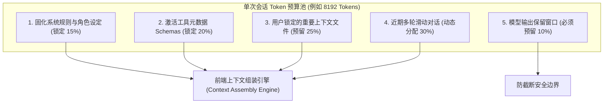

# 核心概念与交互范式 (Core Concepts)✅

本模块涵盖大模型自回归概率生成机制与传统前端确定性状态管理的范式冲突、结构化输出（Structured Outputs）与模式约束（JSON Schema / Zod）契约、Token 计量机制与上下文预算管理等学科基石概念。

---

## 大模型自回归机制（Next-Token Prediction）给传统前端状态管理与交互带来了什么根本挑战？ {#p0-llm-autoregressive-vs-frontend-state}

<Answer>

**核心结论:**

大语言模型（LLM）底层本质上是**基于概率分布的自回归生成器（Autoregressive Next-Token Predictor）**，这一物理特性与传统前端工程基于“确定性状态机（Deterministic State Machine）”的交互模型存在三大本质冲突：
1. **输入与输出的非确定性（Non-deterministic Output）**：传统前端以“输入确定的 State，渲染确定的 UI”（$UI = f(state)$）为基石；而大模型对完全相同的输入可能产生语义相同但字面、长度、甚至格式不同的输出，导致前端断言、模板匹配与表单验证机制失效；
2. **状态流转从“状态变更”退化为“微观时间流（Streaming Time-Series）”**：传统状态变更是离散且瞬时的（Action -> Store Update -> Re-render）；大模型响应是一个持续数十秒、按 Token 吐出、中间状态不完整的动态流，传统状态管理库（如 Redux、Pinia）若对每个 Token 触发派发会导致性能崩溃；
3. **界面容错从“崩溃防御”转向“幻觉引导与对齐”**：传统前端只需防范 `TypeError: Cannot read property of undefined`；AI 交互界面则必须防范“语义合理但事实虚构”的幻觉，前端必须建立契约校验、证据回溯与实时纠错引导能力。

---

**原理解析:**

**1. 传统前端响应式模型 vs 大模型自回归交互模型**

| 对比维度 | 传统前端状态模型 (React/Vue) | 大模型自回归交互模型 (LLM Native) |
| :--- | :--- | :--- |
| **状态确定性** | 严格确定。纯函数、单向数据流、$UI = f(state)$ | **概率性分布**。由采样参数（Temperature/Top_P）控制随机度 |
| **数据到达粒度** | 离散完整包（JSON Payload 整体返回） | **连续不完整微块（逐 Token 流式吐出）** |
| **错误模式** | 协议报错（404/500）、语法报错、类型报错 | **逻辑幻觉（Hallucination）、隐式降级、格式漂移** |
| **状态生命周期** | `idle` -> `loading` -> `success` / `error` | **`idle` -> `streaming` -> `reasoning` -> `requires_action` -> `completed`** |
| **用户控制权** | 用户点击驱动状态变更（命令式/声明式） | **人机协同（Human-in-the-Loop）：用户可随时打断、插话、重试分支** |

**2. 前端架构应对策略**

- **流式缓冲解耦**：在网络传输层与视图渲染层之间建立“时间序列平滑缓冲区”，网络层负责尽可能快地吸收 `ReadableStream` 分块，渲染层基于 `requestAnimationFrame` 以人类舒适的阅读速率（如 30~50 字/秒）消费；
- **状态快照多版本化**：会话不再是一维数组，而是由于用户打断重试、重新生成演变而成的“状态分支树（State Tree）”，支持时光旅行（Time-Travel Debugging）。

---

**规范代码实现:**

以下展示在 TypeScript 中如何用强类型状态机建模自回归流式生命周期，消除非确定性状态带来的悬挂状态：

```typescript
// types/ai-interaction.ts
export type LlmGenerationPhase = 
  | 'idle'               // 空闲
  | 'connecting'         // 连接建立中
  | 'thinking'           // 思考链推理中 (如 DeepSeek-R1 / o1)
  | 'streaming_text'     // 文本流式吐字中
  | 'tool_calling'       // 触发结构化工具调用
  | 'awaiting_approval'  // 挂起等待人工确认 (HITL)
  | 'interrupted'        // 用户主动打断
  | 'completed'          // 本轮生成完成
  | 'error';             // 发生异常

export interface LlmStreamChunk {
  type: 'thought_delta' | 'text_delta' | 'tool_call_delta' | 'finish';
  content?: string;
  toolCall?: {
    id: string;
    name: string;
    argumentsDelta: string;
  };
}

export class LlmInteractionStateMachine {
  private phase: LlmGenerationPhase = 'idle';
  private abortController: AbortController | null = null;

  public transition(to: LlmGenerationPhase): void {
    const validTransitions: Record<LlmGenerationPhase, LlmGenerationPhase[]> = {
      idle: ['connecting'],
      connecting: ['thinking', 'streaming_text', 'error', 'interrupted'],
      thinking: ['streaming_text', 'tool_calling', 'error', 'interrupted'],
      streaming_text: ['thinking', 'tool_calling', 'completed', 'error', 'interrupted'],
      tool_calling: ['awaiting_approval', 'streaming_text', 'completed', 'error'],
      awaiting_approval: ['tool_calling', 'interrupted', 'error'],
      interrupted: ['idle'],
      completed: ['idle'],
      error: ['idle'],
    };

    if (!validTransitions[this.phase].includes(to)) {
      console.warn(`[AI-FSM] 非法状态跳转: 从 ${this.phase} 到 ${to}`);
      return;
    }
    this.phase = to;
  }

  public get currentPhase(): LlmGenerationPhase {
    return this.phase;
  }

  public interrupt(): void {
    if (this.abortController) {
      this.abortController.abort();
      this.transition('interrupted');
    }
  }
}
```

---

**面试官视角:**

- **考察深度**:
  1. 候选人是否真正思考过大模型与传统 Web 业务在系统架构和交互范式上的“本质断裂”；
  2. 能否从自回归生成的概率物理特性出发，推导出流式渲染、状态机设计、打断机制等一系列工程手段的必然性；
  3. 是否具备高并发、高频重渲染下的性能防御心智。
- **下探追问链**:
  - *追问 1*：若模型在吐出第 500 个 Token 时网络连接意外中断，前端如何在不丢失已生成文本的前提下，让用户能够“无缝接着断点继续生成”？
  - *追问 2*：为什么现代大模型 UI 普遍将“停止生成（Stop Generating）”作为最高优先级的全局交互按钮？

---

**延伸阅读:**

- Andrej Karpathy: State of GPT & Autoregressive Mechanics
- Vercel AI SDK: Core Concepts & The Stream Protocol
</Answer>

---

## 什么是结构化输出（Structured Outputs）？为什么基于 JSON Schema / Zod 约束比纯自然语言 Prompt 更可靠？ {#p0-ai-structured-outputs-json-schema}

<Answer>

**核心结论:**

**结构化输出（Structured Outputs）** 是大模型与现代前端应用进行工业级集成的生命线。传统依靠在 Prompt 中写“*请以 JSON 格式输出*”存在致命的**格式崩溃概率（Format Drift）**，而现代大模型厂商（如 OpenAI、Anthropic、DeepSeek）提供的原生 Structured Outputs 机制，在解码器底层采用了**受约束生成（Constrained Decoding / Context-Free Grammar, CFG）**技术：
- **从语义建议到语法强制**：模型在采样下一个 Token 时，底层推理引擎根据前端提交的 JSON Schema 动态屏蔽不合法的 Token 概率分布（将其 Logit 设为负无穷大 -Infinity），在数学层面上保证生成的输出 **100% 符合 JSON 语法与 Schema 类型契约**；
- **前端确定性消费**：结合 TypeScript 与 **Zod** 运行时类型验证，前端可以直接将模型的输出反序列化为类型强安全的实体对象，直接喂给组件或图表，彻底告别脆弱的 `try...catch(JSON.parse)` 与正则截取（Regex Scraping）。

---

**原理解析:**

**1. 传统自然语言提示 vs 结构化输出底层原理**

```mermaid
graph TD
    subgraph Traditional ["传统 Prompt 提示 (脆弱，易产生幻觉)"]
        P1["Prompt: '请以 JSON 格式返回，不要包含 markdown 反引号'"] --> M1["大模型自由采样推理"]
        M1 --> Out1["输出: '好的，这是您的数据：```json
{ name: ...'"]
        Out1 --> ParseErr["前端 JSON.parse() 抛出 SyntaxError 崩溃"]
    end

    subgraph Constrained ["底层受约束生成 (Constrained Decoding)"]
        ZodSchema["前端定义 Zod / JSON Schema 契约"] --> EngineMask["推理引擎构建 CFG 有限状态自动机 (FSM)"]
        EngineMask --> Sampling["采样每一步屏蔽非法 Token (Logit Masking)"]
        Sampling --> Guaranteed["100% 确定性合规 JSON 字符串输出"]
        Guaranteed --> TSObject["直接映射为强类型 TypeScript 对象消费"]
    end
```



**2. 核心架构收益**

- **零代码块包装污染**：彻底避免了模型随意加上 ` ```json ` 或前后夹带客套话（如“好的，这是为您计算的结果”）；
- **字段类型与必填校验（Strict Mode）**：如果 Schema 规定 `age: number`，模型在解码该字段位置时绝不会吐出字符串或布尔值；
- **枚举安全（Enum Enforcement）**：前端组件的下拉状态、主题色、操作指令仅限预定义的 Enum，杜绝模型自创无效状态。

---

**规范代码实现:**

以下展示在前端/全栈 BFF 层，基于 Zod 定义业务组件 Schema 并强制模型输出结构化数据的生产范式：

```typescript
// schema/weather-card.schema.ts
import { z } from 'zod';

// 1. 定义前端 UI 组件所需的严格数据契约
export const WeatherDashboardSchema = z.object({
  city: z.string().describe('城市名称'),
  temperature: z.number().describe('摄氏度气温'),
  condition: z.enum(['sunny', 'rainy', 'cloudy', 'snowy']).describe('天气状况类型'),
  humidity: z.number().min(0).max(100).describe('相对湿度百分比'),
  weeklyForecast: z.array(
    z.object({
      day: z.string().describe('星期几'),
      tempHigh: z.number(),
      tempLow: z.number(),
    })
  ).max(7).describe('未来 7 天天气预报'),
});

export type WeatherDashboardData = z.infer<typeof WeatherDashboardSchema>;

// 2. 将 Zod 转换为大模型支持的标准 JSON Schema
export function getModelConstraint() {
  return {
    type: 'json_schema',
    json_schema: {
      name: 'weather_dashboard_response',
      strict: true,
      schema: {
        type: 'object',
        properties: {
          city: { type: 'string' },
          temperature: { type: 'number' },
          condition: { type: 'string', enum: ['sunny', 'rainy', 'cloudy', 'snowy'] },
          humidity: { type: 'number' },
          weeklyForecast: {
            type: 'array',
            items: {
              type: 'object',
              properties: {
                day: { type: 'string' },
                tempHigh: { type: 'number' },
                tempLow: { type: 'number' },
              },
              required: ['day', 'tempHigh', 'tempLow'],
              additionalProperties: false,
            },
          },
        },
        required: ['city', 'temperature', 'condition', 'humidity', 'weeklyForecast'],
        additionalProperties: false,
      },
    },
  };
}
```

---

**面试官视角:**

- **考察深度**:
  1. 候选人是否具备从“业余 Prompt 调优”向“工业级可靠性工程”跃迁的架构意识；
  2. 能否讲清底层受约束生成（Constrained Decoding / CFG 状态机）的数学原理，而不是只停留在 SDK 的 API 调用；
  3. 对前端数据契约（Zod -> JSON Schema -> TypeScript Type -> Component Props）端到端类型闭环的理解。
- **下探追问链**:
  - *追问 1*：如果模型处于流式输出过程中（Chunk 正在到达），此时 JSON 尚未闭合，前端如何做到增量安全解析并实时渲染部分字段？
  - *追问 2*：为什么某些轻量端侧开源模型在开启受约束生成后，整体的首字延迟（TTFT）会有所上升？

---

**延伸阅读:**

- OpenAI Guide: Introducing Structured Outputs
- Outlines: Fast and Reliable Neural Text Generation with Grammar Constraints
</Answer>

---

## Token 计量机制与上下文窗口预算对前端架构有何决定性影响？ {#p0-ai-token-budget-context-limits}

<Answer>

**核心结论:**

**Token** 是大语言模型世界中的“基本算力与计量货币”，而**上下文窗口（Context Window）**则是模型单次推理能够兼顾的“易失性显存上限”：
- **前端计费与成本敏感度**：传统 Web 页面请求以 HTTP 次数计费，而 AI 交互严格按 Token（Input Token + Output Token）收费。若前端在多轮会话中无节制地将全量历史回传，单次用户请求的计费成本与推理耗时将呈二次方 $O(N^2)$ 级爆炸；
- **性能与注意力稀释（Needle In A Haystack / Lost in the Middle）**：即便模型宣称支持 128K 或 1M 的超长上下文，当上下文塞入大量无关网页内容时，模型的推理检索准确率会发生断崖式下跌，且首字延迟（TTFT）从百毫秒级恶化至数秒；
- **前端架构责任**：前端绝不能充当盲目的消息转发器，必须在端侧构建**Token 预算动态分配器（Token Budget Allocator）**与轻量分词计数（Tokenizer）预估，实现动态分流、关键锚点保护与滑动截断。

---

**原理解析:**

**1. Token 预算动态配比与分层流转**



**2. 前端高频踩坑点**

- **字符数（Character Count）≠ Token 数**：
  - 英文场景下 1 个单词约 1.3 个 Token；而在未经专项分词优化的旧模型中，1 个汉字可能被 BPE（字节对编码）切分为 2~3 个 Token。若仅按 `string.length` 截断，极易在中文环境下瞬间撑爆上下文窗口；
- **未预留 `max_tokens` 导致回答腰斩**：
  - 上下文窗口总大小 = 输入 Tokens + 输出 Tokens。若给模型喂了 8000 Tokens 的上下文，而总上限为 8192 Tokens，则模型最多只能输出 192 Tokens 就会被硬性切断（finish_reason: `length`），导致代码块截断、语法错误。

---

**规范代码实现:**

以下展示在前端端侧，利用轻量分词估算器实现的防溢出 Token 预算控制器：

```typescript
// utils/token-budget.ts
export class TokenBudgetController {
  private readonly maxContextTokens: number;
  private readonly reservedOutputTokens: number;

  constructor(maxContextTokens = 8192, reservedOutputTokens = 2048) {
    this.maxContextTokens = maxContextTokens;
    this.reservedOutputTokens = reservedOutputTokens;
  }

  // 前端轻量快速 Token 估算 (中英混合经验模型)
  public static fastEstimateTokens(text: string): number {
    let tokenCount = 0;
    for (let i = 0; i < text.length; i++) {
      const code = text.charCodeAt(i);
      // ASCII 字符 (大多英文字符/标点) 约 0.25~0.3 token
      if (code <= 127) {
        tokenCount += 0.3;
      } else {
        // CJK 汉字/复杂字符 约 0.8~1.2 token
        tokenCount += 1.0;
      }
    }
    return Math.ceil(tokenCount);
  }

  // 校验当前上下文是否在安全预算之内
  public checkBudget(
    systemPrompt: string,
    historyMessages: Array<{ role: string; content: string }>
  ): { isSafe: boolean; currentTokens: number; maxAllowedInput: number } {
    const maxAllowedInput = this.maxContextTokens - this.reservedOutputTokens;
    
    let totalInput = TokenBudgetController.fastEstimateTokens(systemPrompt);
    for (const msg of historyMessages) {
      totalInput += TokenBudgetController.fastEstimateTokens(msg.content);
    }

    return {
      isSafe: totalInput <= maxAllowedInput,
      currentTokens: totalInput,
      maxAllowedInput,
    };
  }
}
```

---

**面试官视角:**

- **考察深度**:
  1. 候选人是否具备大模型落地时的真实成本意识与网络算力资源敏感度；
  2. 是否清楚字符长度与 Token 的非线性映射关系，以及长上下文导致的注意力下降问题；
  3. 能否在端侧架构上做出合理的“静态规则保护 + 动态滑动截断”的弹性设计。
- **下探追问链**:
  - *追问 1*：现代模型厂商推出的 Prompt Caching（提示词缓存）机制要求上下文必须“前缀静态匹配”，这如何颠覆了前端传统向头部插入最新消息的状态管理习惯？
  - *追问 2*：在长文本生成中，若检测到模型的 `finish_reason` 是 `length`，前端如何提示用户并触发平滑接续？

---

**延伸阅读:**

- Greg Kamradt: Needle In A Haystack - Pressure Testing LLMs
- Tiktoken: Fast BPE Tokeniser for OpenAI Models
</Answer>
