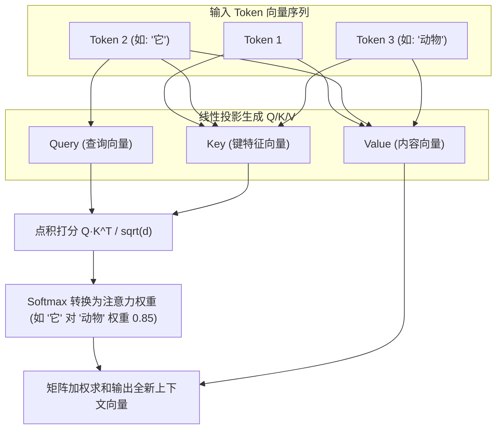
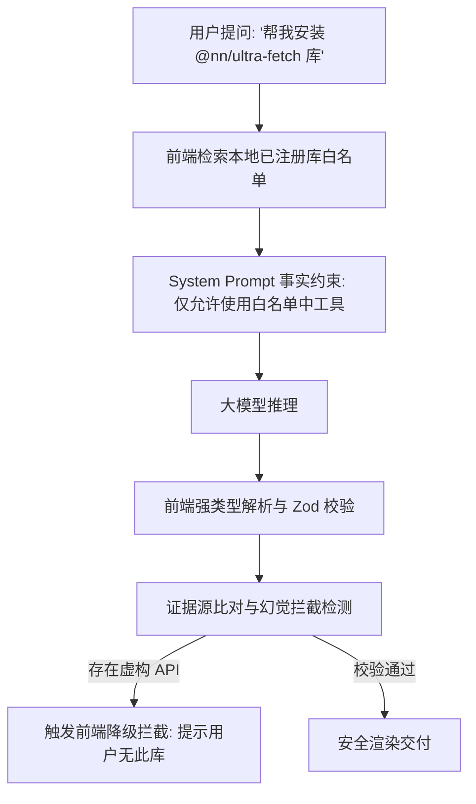
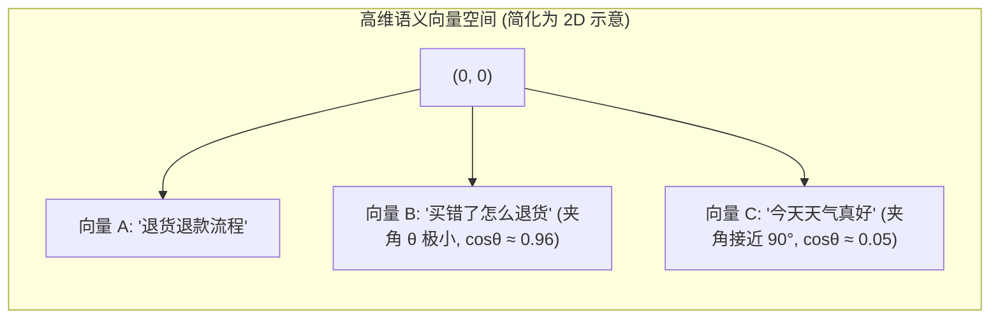

# 大模型原理与前端认知 (LLM Architecture & Mental Models)✅

本模块聚焦前端工程师必须建立的大模型底层机制认知：Transformer 架构的通俗机理、Self-Attention 自注意力与多头注意力、大模型幻觉成因与工程防御门禁、结构化输出（Structured Outputs）与模式契约，以及 Embedding 向量空间与余弦相似度计算。

---

## 前端工程师需要了解的 Transformer 架构：什么是 Self-Attention（自注意力机制）？多头注意力（Multi-Head Attention）解决了什么？ {#p0-transformer-self-attention-for-fe}

<Answer>

**核心结论:**

在现代 AI 技术栈中，Transformer 是当今几乎所有主流大模型（GPT-4、Claude、DeepSeek、Llama）的基础骨架架构。前端工程师无需深入推导反向传播偏导数，但必须深刻理解其**核心信息路由引擎——Self-Attention（自注意力机制）与 Multi-Head Attention（多头注意力机制）**：
1. **彻底终结 RNN 的时序串行依赖**：传统的循环神经网络（RNN）必须按字逐个串行计算，无法利用现代 GPU 进行大规模并行计算；Transformer 抛弃了循环连接，直接将整个上下文序列同时输入，通过**自注意力矩阵一次性并行计算序列中任意两个 Token 之间的关联权重**；
2. **Self-Attention 的本质（查询 Query、键 Key、值 Value 的动态路由）**：每个 Token 转化为 $Q$（我想找什么）、$K$（我有什么特征）、$V$（我的具体内容）。通过计算 $Q$ 与所有 $K$ 的点积内积并经 Softmax 归一化，得到注意力权重分数，最后对 $V$ 进行加权求和，实现上下文信息的动态聚合；
3. **多头注意力（Multi-Head Attention）的工程价值**：如同前端组件的多重观察者（View / State / Props），单个注意力头只能捕捉一种全局语义关系；多头机制通过将高维向量投影到多个独立的低维子空间（如 8 个或 32 个 Head），使模型能**同时在不同视角关注语法依赖、代词指代、长程逻辑因果与专业实体关联**。

---

**原理解析:**

**1. Self-Attention 核心数学原理通俗推导**

```text
Attention(Q, K, V) = Softmax((Q * K^T) / sqrt(d_k)) * V
```

- **点积打分 (`Q * K^T`)**：计算当前 Token 与上下文中所有其他 Token 的相似度矩阵；
- **缩放因子 (`sqrt(d_k)`)**：随着向量维度 $d_k$ 变大，点积结果方差增大，Softmax 容易进入梯度饱和区，因此除以 `sqrt(d_k)` 保持数值稳定；
- **Softmax 归一化**：将点积分数转化为和为 1 的概率分布（Attention Map 权重）；
- **加权求和 (`V`)**：根据权重把相关 Token 的信息融入当前 Token 的表示中。



**2. 前端为什么需要懂这个？**
- **长文本注意力稀释**：注意力矩阵大小为 $N \times N$（$O(N^2)$ 复杂度）。文本越长，注意力权重被摊得越薄，模型容易产生“迷失在中间（Lost in the middle）”现象，因此前端在构造 RAG 或 Agent Prompt 时，必须将核心约束置于开头（System）或结尾（最新指令）；
- **计算与显存开销直观感知**：理解了 $O(N^2)$ 就能理解为什么长上下文推理费用昂贵、首字延迟（TTFT）高，以及为什么端侧小模型难以直接跑 128K 超长上下文。

---

**规范代码实现:**

在 TypeScript 中纯数学模拟缩放点积自注意力的计算过程，直观展现注意力权重的生成与聚合：

```typescript
// utils/attention-demo.ts
export class ScaledDotProductAttention {
  // 计算单头自注意力
  public static compute(
    Q: number[][], // [seqLen, dK]
    K: number[][], // [seqLen, dK]
    V: number[][]  // [seqLen, dV]
  ): { output: number[][]; attentionWeights: number[][] } {
    const seqLen = Q.length;
    const dK = Q[0].length;
    const dV = V[0].length;
    const scale = Math.sqrt(dK);

    // 1. Q * K^T 计算点积得分矩阵 [seqLen, seqLen]
    const scores: number[][] = Array.from({ length: seqLen }, () => Array(seqLen).fill(0));
    for (let i = 0; i < seqLen; i++) {
      for (let j = 0; j < seqLen; j++) {
        let dot = 0;
        for (let k = 0; k < dK; k++) {
          dot += Q[i][k] * K[j][k];
        }
        scores[i][j] = dot / scale;
      }
    }

    // 2. 逐行应用 Softmax 得到注意力权重矩阵
    const attentionWeights: number[][] = scores.map(row => {
      const maxVal = Math.max(...row);
      const exps = row.map(val => Math.exp(val - maxVal));
      const sumExp = exps.reduce((acc, v) => acc + v, 0);
      return exps.map(v => v / sumExp);
    });

    // 3. AttentionWeights * V 加权求和输出 [seqLen, dV]
    const output: number[][] = Array.from({ length: seqLen }, () => Array(dV).fill(0));
    for (let i = 0; i < seqLen; i++) {
      for (let j = 0; j < dV; j++) {
        let sum = 0;
        for (let k = 0; k < seqLen; k++) {
          sum += attentionWeights[i][k] * V[k][j];
        }
        output[i][j] = sum;
      }
    }

    return { output, attentionWeights };
  }
}
```

---

**面试官视角:**

**考察意图:**
评估应试者是只停留在 API 搬运工，还是对底层基础科学模型有清晰的架构认知。能够通俗、准确讲清 Q/K/V 物理含义与多头注意力的前端工程师，在团队内对技术选型与性能边界有更深刻的判断力。

**深度追问链:**
1. **追问 1**: 传统 Transformer 的注意力是全向的（双向关注），为什么大语言模型（如 GPT/DeepSeek）大多是 Decoder-Only 架构？
   - *答题切入点*: 文本生成任务本质是自回归预测未来 Token，生成第 $i$ 个词时绝对不能看到第 $i+1$ 个词（否则作弊泄露答案）；因此通过下三角因果掩码（Causal Masking）把未来 Token 遮盖住，Decoder-Only 架构对自回归生成任务结构最精简、参数利用率最高。

---

**延伸阅读:**
- [Attention Is All You Need (Vaswani et al., 2017 原始论文)](https://arxiv.org/abs/1706.03762)
- [The Illustrated Transformer (Jay Alammar 经典图解)](https://jalammar.github.io/illustrated-transformer/)

</Answer>

---

## 为什么大模型会产生幻觉（Hallucination）？前端能从工程上做什么来防范和降低幻觉？ {#p0-llm-hallucination-mitigation}

<Answer>

**核心结论:**

大模型的“幻觉（Hallucination）”是指**模型生成的文本表面流畅合理、符合语法逻辑，但内容与事实严重相悖或完全虚构**（例如编造不存在的 npm 库、捏造不存在的 API 参数）。

大模型产生幻觉的本质原因：
1. **统计概率采样而非真实世界逻辑推理**：大模型本质是自回归条件概率预测器，它优化的是“哪个 Token 接下来出现最顺畅”，而非“这句话是否是客观真理”；
2. **知识过时与记忆压缩损耗**：训练数据截止后新发生的事件模型不可知；海量知识压缩在权重参数中，存在特征混淆与模式过度拟合；
3. **谄媚性（Sycophancy）与强行补全倾向**：模型倾向于迎合用户的预设立场，并在遇到不确定问题时“宁可编造也不承认不知道”。

**前端在工程防御层面的四大防线（Mitigation Strategies）**：
- **防线 1：RAG 事实注入（Grounding）**：不让模型凭空记忆，而是从可信私域数据检索真实上下文喂给模型；
- **防线 2：强制拒答协议（Fallback on Unknown）**：在 System Prompt 注入“当证据不足时，必须明确回答不知道，禁止推理虚构”；
- **防线 3：结构化模式约束与链式校验（Schema Validation & Citations）**：要求返回引用源（Source IDs），前端高亮比对并进行 JSON Schema 强类型断言；
- **防线 4：Human-in-the-Loop 门禁**：对高风险判断由人类介入复核。

---

**原理解析:**

**1. 幻觉防御全链路漏斗模型**



---

**规范代码实现:**

前端通过封装带有“证据来源溯源（Source Citation）”与自动置信度过滤的校验拦截器：

```typescript
// utils/hallucination-guard.ts
import { z } from 'zod';

// 定义带事实来源的强类型响应契约
export const FactualResponseSchema = z.object({
  answer: z.string().min(1),
  confidenceScore: z.number().min(0).max(1),
  citations: z.array(z.object({
    documentId: z.string(),
    snippet: z.string()
  })),
  hasSufficientContext: z.boolean()
});

export type FactualResponse = z.infer<typeof FactualResponseSchema>;

export class HallucinationGuard {
  public static validate(rawJson: unknown, trustedDocIds: Set<string>): {
    valid: boolean;
    data?: FactualResponse;
    warning?: string;
  } {
    const parseResult = FactualResponseSchema.safeParse(rawJson);
    if (!parseResult.success) {
      return { valid: false, warning: '响应数据不符合事实契约模式' };
    }

    const { data } = parseResult;
    
    // 检查模型是否承认上下文不足
    if (!data.hasSufficientContext) {
      return { valid: true, data, warning: '模型明确标记私域知识库不足以支撑结论' };
    }

    // 检查模型编造的引用 ID 是否在真实检索召回集内 (防编造假证据)
    const forgedCitations = data.citations.filter(c => !trustedDocIds.has(c.documentId));
    if (forgedCitations.length > 0) {
      return {
        valid: false,
        warning: `检测到严重幻觉：模型虚构了不存在的证据 ID [${forgedCitations.map(c => c.documentId).join(', ')}]`
      };
    }

    return { valid: true, data };
  }
}
```

---

**面试官视角:**

**考察意图:**
评估候选人是否具备生产级 AI 系统落地的防御性编程思维。AI 工业落地最大的阻碍就是幻觉导致业务不敢上线，懂得使用 RAG Grounding、模式约束与置信度熔断的前端工程师能够有效规避企业级合规风险。

**深度追问链:**
1. **追问 1**: 在大模型生成前端代码（如 React 组件）时，经常幻觉引入不存在的 UI 组件属性（Props），前端在工程流程上如何彻底拦截？
   - *答题切入点*: 结合 AST 静态分析与 TypeScript 编译（`tsc --noEmit` 或 SWC 内存编译）；前端或 CI 流程收到代码后立即在 Worker 内进行类型检查，若报错直接把 TS 错误回传给模型执行自动自我修复（Self-Correction Loop）。

---

**延伸阅读:**
- [Survey on Hallucination in Large Language Models (Ji et al., 2023)](https://arxiv.org/abs/2309.01219)
- [Anthropic: Reducing Hallucinations with Grounding and Citations](https://docs.anthropic.com/en/docs/build-with-claude/citations)

</Answer>

---

## 什么是结构化输出（Structured Outputs）？为什么基于 JSON Schema / Zod 约束比纯自然语言 Prompt 更可靠？ {#p0-structured-outputs-json-schema}

<Answer>

**核心结论:**

结构化输出（Structured Outputs）是大模型提供商（如 OpenAI、Anthropic、DeepSeek）在引擎推理层提供的能力：**保证模型返回的数据 100% 严格符合开发者提供的 JSON Schema，杜绝缺字段、键名拼写错误或额外无关废话**。

在传统 Prompt 中，开发者通常在 Prompt 里写“请返回纯 JSON，不要输出 Markdown 标记”。这种方式在工业界存在严重缺陷：
1. **Prompt 约束是脆弱的弱约束（Soft Constraint）**：大模型本质是概率采样，遇到特殊输入极易输出 ```json 前缀、截断逗号或在末尾附带解释性文字，导致前端 `JSON.parse()` 频繁崩溃；
2. **引擎级结构化输出是强约束（Grammar-Constrained Decoding / CFG）**：在 GPU 生成下一个 Token 时，推理引擎会根据 JSON Schema 动态构建上下文无关文法（Context-Free Grammar, CFG）状态机，**直接在 Logits 采样阶段把不符合语法规范的候选 Token 概率强制置为 0**，在物理层面杜绝了非法 Token 的生成；
3. **配合前端 Zod 强类型库打造端到端类型安全闭环**：通过 `z.infer<typeof Schema>` 实现 TypeScript 编译期类型推导与运行时数据校验的完美统一。

---

**原理解析:**

**1. 软约束 Prompt vs 语法掩码约束解码 (Grammar-Constrained Decoding)**

```mermaid
flowchart TD
    subgraph SoftPrompt["纯自然语言 Prompt 弱约束"]
        P1["Prompt: '请仅输出标准 JSON'"] --> P2["大模型自由概率采样"]
        P2 --> P3["输出: '好的，这是为您提取的 JSON: ```json {\"name\": ...'"]
        P3 --> P4["前端 JSON.parse() 发生 SyntaxError 崩溃"]
    end

    subgraph HardGrammar["引擎层结构化输出 (Grammar Masking)"]
        G1["传入 JSON Schema (如要求必须输出数字 key: age)"] --> G2["GPU 自回归采样阶段"]
        G2 --> G3["基于状态机动态计算当前合法 Token 掩码 (Logit Bias)"]
        G3 --> G4["只有符合 Schema 格式的 Token 才能被选中"]
        G4 --> G5["输出 100% 合法 JSON，零解析容灾成本"]
    end
```

---

**规范代码实现:**

在 TypeScript 前端工程中，使用 Zod 定义契约并通过标准适配器自动生成 JSON Schema，并实现全自动重试解析器：

```typescript
// services/structured-output.ts
import { z } from 'zod';
import { zodToJsonSchema } from 'zod-to-json-schema';

// 1. 定义业务所需的强类型 Schema
export const UserInsightCardSchema = z.object({
  title: z.string().describe('卡片主标题，控制在 15 字以内'),
  sentiment: z.enum(['positive', 'neutral', 'negative']).describe('用户情感极性'),
  tags: z.array(z.string()).max(5).describe('核心特征标签'),
  actionRequired: z.boolean().describe('是否需要运营跟进')
});

export type UserInsightCard = z.infer<typeof UserInsightCardSchema>;

// 2. 转换为 OpenAI / Anthropic 兼容的严格 JSON Schema
export function getModelStructuredSchema() {
  return {
    name: 'user_insight_card',
    strict: true,
    schema: zodToJsonSchema(UserInsightCardSchema, { target: 'openAi' })
  };
}

// 3. 前端安全解析器
export function parseModelOutput(rawText: string): UserInsightCard {
  try {
    // 若模型未开启严格语法模式，前端做自动剥离 Markdown 围栏兜底
    const cleaned = rawText.replace(/```json\s*|\s*```/g, '').trim();
    const json = JSON.parse(cleaned);
    return UserInsightCardSchema.parse(json);
  } catch (error) {
    console.error('[SchemaValidation] 结构化解析失败:', error);
    throw new Error('模型输出未能满足业务强契约');
  }
}
```

---

**面试官视角:**

**考察意图:**
评估应聘者是否了解大模型最新的工程化发展趋势。在 2026 年，如果还在用正则匹配大模型返回的 JSON、还在忍受频繁的 `JSON.parse` 报错，说明缺乏对现代大模型 Structured Outputs / Json Mode 与语法掩码特性的掌握。

**深度追问链:**
1. **追问 1**: 开启 Structured Outputs 之后，会影响大模型的推理速度或成本吗？
   - *答题切入点*: 第一次生成该 Schema 时，服务端引擎需要将 JSON Schema 编译为上下文无关文法（CFG）的有限状态机，可能产生短暂的首字延迟（编译开销）；但随后该状态机会被服务端缓存复用，不仅不会降低生成速度，甚至因为消除了 Markdown 样板废话输出，减少了总 Token 消耗与网络传输延迟。

---

**延伸阅读:**
- [OpenAI: Introducing Structured Outputs in the API](https://openai.com/index/introducing-structured-outputs-in-the-api/)
- [Zod 官方文档与 TypeScript 运行时类型推导](https://zod.dev/)

</Answer>

---

## 什么是 Embedding（向量嵌入）？向量空间与余弦相似度在前端语义搜索中是如何工作的？ {#p1-embedding-vector-search-basics}

<Answer>

**核心结论:**

在人工智能中，**Embedding（向量嵌入）是将高维离散的文本、代码或多媒体信息，映射为一个固定长度的连续浮点数密集向量（Dense Vector，如 384、768 或 1536 维）的数学转换过程**。

其核心价值与前端落地原理：
1. **将“字面匹配”升级为“语义匹配”**：传统前端模糊搜索（如正则、Levenshtein 编辑距离）只能匹配字符字面；而 Embedding 模型把语义相近的句子映射在多维向量空间中距离相近的区域（例如“如何退款”与“我想把买的东西退掉”即便无一字相同，其向量夹角依然极小）；
2. **余弦相似度（Cosine Similarity）是最高频的相似度度量公式**：通过计算两个向量夹角的余弦值（范围在 -1 到 1 之间，1 表示方向完全相同），消除了文本长度造成的向量范数绝对大小影响，只衡量语义方向契合度；
3. **端侧轻量向量计算的现实可行性**：随着 WebAssembly 与 Float32Array 在现代浏览器的极致优化，在前端进行千级向量的点积计算仅需数毫秒，使得完全不依赖云端向量库的纯本地轻量 RAG 与文档智能问答成为可能。

---

**原理解析:**

**1. 向量空间与余弦夹角几何直觉**



**2. 余弦相似度数学公式推导**

```text
CosineSimilarity(A, B) = (A · B) / (||A|| * ||B||) = sum(A_i * B_i) / (sqrt(sum(A_i^2)) * sqrt(sum(B_i^2)))
```

如果在将向量存入前端索引时预先进行了**L2 归一化（L2 Normalization，使得 $\|A\| = 1$）**，那么余弦相似度计算将直接退化为最极速的**两个 Float32Array 点积（Dot Product）**：

```text
CosineSimilarity_normalized(A, B) = A · B = sum(A_i * B_i)
```

---

**规范代码实现:**

以下展示在前端利用强类型 `Float32Array` 实现纳秒级余弦相似度检索器：

```typescript
// utils/vector-math.ts
export class VectorMath {
  // 1. L2 归一化：将向量长度缩放为 1
  public static normalize(vec: Float32Array): Float32Array {
    let sumSquares = 0;
    for (let i = 0; i < vec.length; i++) {
      sumSquares += vec[i] * vec[i];
    }
    const norm = Math.sqrt(sumSquares);
    if (norm === 0) return vec;
    
    const normalized = new Float32Array(vec.length);
    for (let i = 0; i < vec.length; i++) {
      normalized[i] = vec[i] / norm;
    }
    return normalized;
  }

  // 2. 归一化向量的点积即为余弦相似度 (极致性能)
  public static dotProduct(a: Float32Array, b: Float32Array): number {
    let dot = 0;
    const len = a.length;
    for (let i = 0; i < len; i++) {
      dot += a[i] * b[i];
    }
    return dot;
  }
}

export interface VectorDocument {
  id: string;
  content: string;
  embedding: Float32Array; // 归一化后的向量
}

export class ClientVectorStore {
  private docs: VectorDocument[] = [];

  public addDocument(doc: VectorDocument): void {
    this.docs.push({
      ...doc,
      embedding: VectorMath.normalize(doc.embedding)
    });
  }

  public searchTopK(queryEmbedding: Float32Array, k = 3): { doc: VectorDocument; score: number }[] {
    const normalizedQuery = VectorMath.normalize(queryEmbedding);
    
    const results = this.docs.map(doc => ({
      doc,
      score: VectorMath.dotProduct(normalizedQuery, doc.embedding)
    }));

    // 按相似度降序排序，取前 K 个
    return results.sort((a, b) => b.score - a.score).slice(0, k);
  }
}
```

---

**面试官视角:**

**考察意图:**
评估应试者是否理解现代 RAG、智能客服、语义搜索的核心底层算法。从纯 JavaScript/TypeScript 数据结构（如 Float32Array）的内存连续性到余弦相似度 L2 预归一化优化，能体现出候选人优良的计算性能直觉。

**深度追问链:**
1. **追问 1**: 在前端浏览器做千级文档向量检索时，使用 `Float32Array` 比纯 JavaScript 原生数组 `number[]` 性能好在哪里？
   - *答题切入点*: `Float32Array` 是连续的二进制内存缓冲区（TypedArray），无对象指针间接寻址开销，内存占用仅为原生的 1/4 到 1/8；且连续内存具有极高的 CPU L1/L2 缓存命中率，V8 引擎能自动对其循环进行 SIMD 向量指令优化，提升 5~10 倍点积计算速度。

---

**延伸阅读:**
- [HuggingFace: What are embeddings?](https://huggingface.co/blog/getting-started-with-embeddings)
- [Transformers.js: Run embeddings inside browser web workers](https://huggingface.co/docs/transformers.js)

</Answer>
