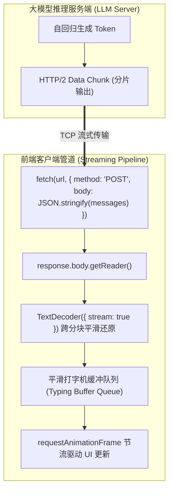
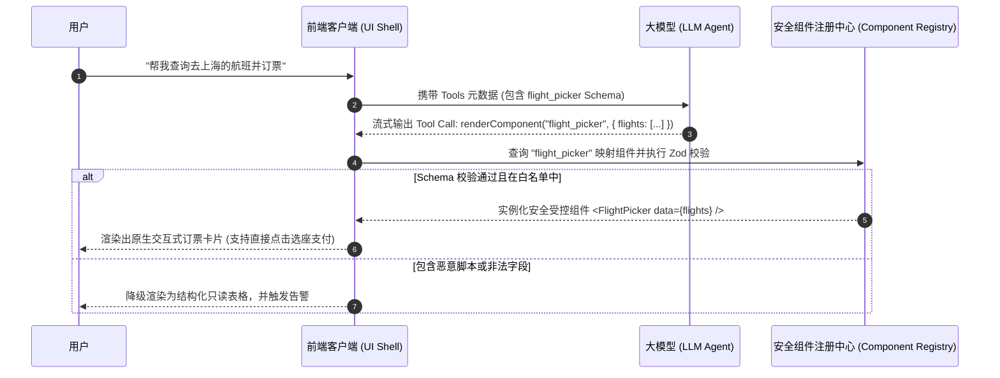
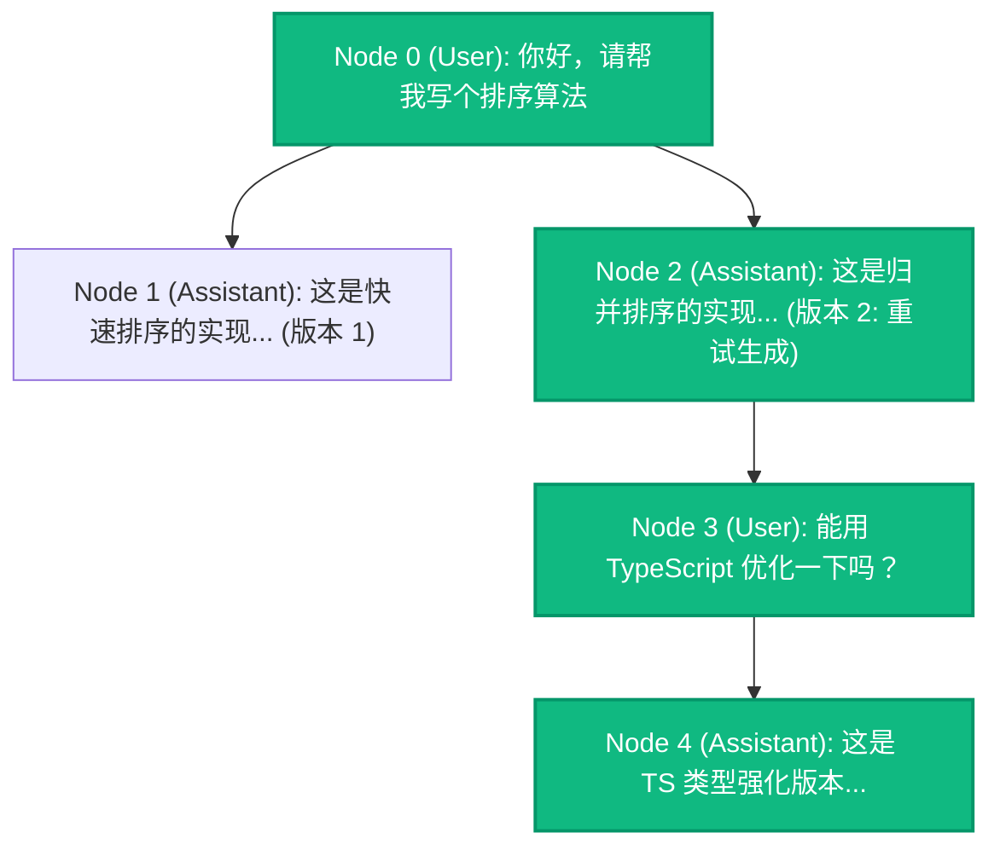

# 流式交互与生成式 UI (Streaming & Generative UI)✅

本模块涵盖大语言模型（LLM）端到端流式响应协议选型、TextDecoder 增量流解析、长文本打字机平滑排版、Markdown AST 容错增量渲染防抖、生成式 UI（Generative UI）动态组件安全沙箱隔离以及多轮分支会话树状态机设计。

---

## 前端如何实现类似 ChatGPT 的打字机流式响应？SSE 与 Fetch ReadableStream 该如何选择？ {#p0-ai-streaming-render}

<Answer>

**核心结论:**

在现代大模型前端交互中，**基于 Fetch API 与 ReadableStream 的自定义流式协议是当今工业界（如 ChatGPT、Claude、Vercel AI SDK）的绝对首选**，而传统原生 `EventSource`（SSE）由于底层功能局限正逐渐退居次要地位：
- **请求灵活性**：大模型对话通常需要提交包含数万 Token 的历史上下文（System Prompt + Messages 数组），原生 `EventSource` 仅支持 HTTP GET 请求且无法自定义 Request Body 与 Authorization Header，难以承载大型 Payload；Fetch API 则原生支持 `POST`、自定义头以及 `ReadableStream` 响应体读取；
- **传输控制与性能**：通过 `response.body.getReader()` 配合 `TextDecoder({ stream: true })` 进行增量分块解码，结合前端“平滑打字机缓冲队列（Smooth Typing Buffer Queue）”算法，既能避免微任务高频触发 React 重新渲染（Re-render 抖动），又能保证视觉上的连贯吐字动效。

---

**原理解析:**

**1. 传输协议全方位架构选型矩阵**

| 选型维度 | 原生 SSE (`EventSource`) | Fetch API (`ReadableStream`) | WebSocket |
| :--- | :--- | :--- | :--- |
| **HTTP 动词支持** | 仅限 `GET`（需依赖 URL Query 传参） | **支持 `POST`**（完整承载大体积 Payload） | 握手为 `GET`，后续双向全双工帧传输 |
| **自定义 Header** | ❌ 规范不支持（无法灵活传鉴权 Token） | **✅ 完全支持自定义 Header 与 Cookie** | 仅握手阶段支持部分 Header |
| **取消与中止** | `eventSource.close()` | **原生 `AbortController.abort()`** | `socket.close()` |
| **网络协议兼容性** | 基于标准 HTTP/1.1 或 HTTP/2 单向事件流 | **完美适配 HTTP/2 多路复用与边缘计算** | 需代理网关特殊支持长连接保持与升级 |
| **断线重连机制** | 引擎内置原生重连机制 | 需前端应用层手写指数退避重试 | 需前端心跳保活与手动重连 |
| **工业级定位** | 传统服务端单向广播通知 | **大模型流式推理对话的绝对标准范式** | 强实时双向协同（如在线多人白板、即时通讯） |

**2. 端到端流式读取与 TextDecoder 边界机制**

网络传输中的 TCP 分包或 HTTP/2 Data Frame 是按任意字节分片传输的。中文字符在 UTF-8 编码中占用 3 个字节：
若网络切片恰好将一个 3 字节的中文字符截断在第 1 或第 2 个字节处，如果直接调用 `decoder.decode(chunk)`，引擎会因遇到非法字节序列而输出替换字符 ``（乱码）。
因此必须开启 **`new TextDecoder('utf-8', { fatal: false, stream: true })`**：
当 `stream: true` 时，解码器会在内部保留未凑齐完整 Unicode 码点的悬挂字节，并在下一个 Data Chunk 到达时自动拼接还原，杜绝字符乱码。



---

**规范 TypeScript 代码实现:**

```typescript
// 生产级 LLM 流式拉取与平滑打字机渲染控制器
export interface StreamChunkCallback {
  onChunk: (deltaText: string, fullText: string) => void;
  onError: (error: Error) => void;
  onFinish: (fullText: string) => void;
}

export class ChatStreamClient {
  private abortController: AbortController | null = null;
  private bufferQueue: string[] = [];
  private fullResponse = '';
  private isConsuming = false;

  public async fetchChatStream(
    url: string,
    payload: Record<string, unknown>,
    callbacks: StreamChunkCallback
  ): Promise<void> {
    this.abortController = new AbortController();
    this.fullResponse = '';
    this.bufferQueue = [];

    try {
      const response = await fetch(url, {
        method: 'POST',
        headers: {
          'Content-Type': 'application/json',
          'Accept': 'text/event-stream, application/x-ndjson',
        },
        body: JSON.stringify(payload),
        signal: this.abortController.signal,
      });

      if (!response.ok || !response.body) {
        throw new Error('网络响应异常: ' + response.status + ' ' + response.statusText);
      }

      const reader = response.body.getReader();
      // 开启 stream: true 保持跨分块的多字节字符状态
      const decoder = new TextDecoder('utf-8', { stream: true });

      // 启动平滑打字渲染调度循环
      this.startSmoothTyping(callbacks);

      while (true) {
        const { done, value } = await reader.read();
        if (done) break;

        const decodedChunk = decoder.decode(value, { stream: true });
        this.processSSELines(decodedChunk);
      }

      // 刷新解码器中可能残留的尾部数据
      const finalChunk = decoder.decode();
      if (finalChunk) this.processSSELines(finalChunk);

    } catch (err: unknown) {
      if ((err as Error).name === 'AbortError') {
        console.log('用户主动中断大模型流式输出');
        return;
      }
      callbacks.onError(err instanceof Error ? err : new Error(String(err)));
    }
  }

  // 基础 SSE 行解析协议（支持 data: {"delta": "..."} 结构）
  private processSSELines(rawText: string): void {
    const lines = rawText.split('\n');
    for (const line of lines) {
      const trimmed = line.trim();
      if (!trimmed || trimmed.startsWith(':')) continue; // 忽略心跳注释

      if (trimmed.startsWith('data: ')) {
        const dataStr = trimmed.slice(6);
        if (dataStr === '[DONE]') break;
        try {
          const parsed = JSON.parse(dataStr);
          const delta = parsed.choices?.[0]?.delta?.content || parsed.delta || '';
          if (delta) {
            this.bufferQueue.push(delta);
          }
        } catch {
          // 容错纯文本传输场景
          this.bufferQueue.push(dataStr);
        }
      }
    }
  }

  // 利用 rAF 实现自适应消费速率的平滑打字机动效
  private startSmoothTyping(callbacks: StreamChunkCallback): void {
    if (this.isConsuming) return;
    this.isConsuming = true;

    const tick = () => {
      if (this.bufferQueue.length > 0) {
        // 动态调速：若积压过多则加大步长，避免界面落后于网络
        const step = Math.max(1, Math.floor(this.bufferQueue.length / 5));
        const drained = this.bufferQueue.splice(0, step).join('');
        this.fullResponse += drained;
        callbacks.onChunk(drained, this.fullResponse);
      }

      if (this.bufferQueue.length > 0 || this.abortController) {
        requestAnimationFrame(tick);
      } else {
        this.isConsuming = false;
        callbacks.onFinish(this.fullResponse);
      }
    };

    requestAnimationFrame(tick);
  }

  // 用户点击“停止生成”按钮
  public stop(): void {
    if (this.abortController) {
      this.abortController.abort();
      this.abortController = null;
    }
    this.bufferQueue = [];
    this.isConsuming = false;
  }
}
```

---

**面试官视角:**

- **核心考察点**：能否从协议底层（GET/POST 限制、Header 注入、双向通道）讲透原生 SSE 与 Fetch Stream 的选型依据；是否具备生产级网络健壮性意识（TextDecoder 乱码防范、AbortController 中断、打字机队列防抖）。
- **下探追问**：
  - *追问*：如果大模型吐字速度极快（如每秒 100+ Token），直接 `setState(fullText)` 会引发什么性能问题？如何优化？
  - *回答要点*：频繁更新会导致高频重新渲染（触发虚拟 DOM Diff 与样式重排），引起主线程掉帧卡顿。优化方案：（1）建立**字符缓冲池**，使用 `requestAnimationFrame` 限制每 16ms 最多触发一次状态更新；（2）对于长文本历史消息，使用**静态不可变节点（Memoization）**避免整棵消息树重复渲染；（3）仅在最新一条流式消息内部维护局部更新，隔离渲染脏区。

---

**延伸阅读:**

- [WHATWG: Streams API Living Standard](https://streams.spec.whatwg.org/)
- [MDN Web Docs: TextDecoder API](https://developer.mozilla.org/en-US/docs/Web/API/TextDecoder)
- [Vercel AI SDK Core Architecture](https://sdk.vercel.ai/docs)

</Answer>

---

## 大模型流式输出 Markdown 时，如何避免代码块、公式与 Mermaid 图表解析闪烁？ {#p0-ai-stream-markdown-flicker}

<Answer>

**核心结论:**

在流式接收文本时，Markdown 解析器面临的核心挑战是**中间态语法的非闭合性（Incomplete Syntax Block）**：
- **闪烁成因**：例如当流式只传输了三个反引号 ```` ```typescript ```` 但闭合反引号尚未到达时，普通 Markdown 解析器会将其误判为普通文本段落，造成代码高亮容器瞬间塌陷为纯文本；下一时刻闭合标签到达，又突然闪跳渲染为代码框，带来极其严重的视觉抖动（Layout Shift）与白屏闪烁；
- **工业级解决方案**：
  1. **语法块预补全（Virtual Closing / Autocompletion）**：在将流式文本喂入 Remark/Markdown 词法解析器之前，通过轻量扫描预编译器，检测未闭合的代码块（```` ``` ````）、LaTeX 公式块（`$$`）、加粗强调（`**`），并在 AST 输入前临时补齐闭合标记；
  2. **状态稳定化防抖（Stabilized Lexer & Scoped Debounce）**：对于 Mermaid 图表或 KaTeX 复杂富媒体，未闭合期间渲染骨架占位加载态（Skeleton），只在内容完整闭合后再调用重排渲染引擎。

---

**原理解析:**

```mermaid
flowchart TD
    subgraph Stream["流式到达的原始增量文本"]
        direction TB
        RawText["```typescript\ninterface User {\n  id: number; (未闭合)"]
    end

    subgraph Preprocess["词法预处理层 (AST Preprocessor)"]
        direction TB
        Scan["正则扫描未闭合的 ``` 代码块与 $$ 公式"]
        Patch["内存补全临时闭合符号: \n```"]
        Scan --> Patch
    end

    subgraph Parser["Markdown 渲染引擎 (Remark / Markdown-it)"]
        direction TB
        AST["构建稳定 AST 树 (无断层结构)"]
        Highlight["Prism / Shiki 局部高亮"]
        AST --> Highlight
    end

    subgraph DOM["渲染展现层 (Stable DOM)"]
        direction TB
        CodeContainer["稳定代码高亮框 (零高度跳跃/零白屏闪烁)"]
    end

    RawText --> Scan
    Patch --> AST
    Highlight --> CodeContainer
```

---

**规范 TypeScript 代码实现:**

```typescript
// 流式 Markdown 语法闭合补全器
export class StreamMarkdownSanitizer {
  /**
   * 自动闭合流式传输中尚未到达结尾的代码块、数学公式与强调语法
   */
  public static patchIncompleteMarkdown(rawText: string): string {
    let patched = rawText;

    // 1. 检查未闭合的代码块（检测反引号 ``` 的奇偶性）
    const codeFenceMatches = patched.match(/```/g);
    if (codeFenceMatches && codeFenceMatches.length % 2 !== 0) {
      // 存在未闭合代码块，临时补齐换行与闭合标记
      patched += '\n```';
    }

    // 2. 检查未闭合的独立数学公式块（检测 $$ 的奇偶性）
    const mathBlockMatches = patched.match(/\$\$/g);
    if (mathBlockMatches && mathBlockMatches.length % 2 !== 0) {
      patched += '$$';
    }

    // 3. 检查行尾未闭合的行内代码（单个反引号 `）
    const inlineCodeMatches = patched.match(/(?<!`)`(?!`)/g);
    if (inlineCodeMatches && inlineCodeMatches.length % 2 !== 0) {
      patched += '`';
    }

    return patched;
  }
}

// 配合 React/Vue 的渲染中间件示例
export function useSafeStreamMarkdown(streamingText: string): string {
  // 实时返回经过语法修复的安全文本喂给 Markdown 渲染组件
  return StreamMarkdownSanitizer.patchIncompleteMarkdown(streamingText);
}
```

---

**面试官视角:**

- **核心考察点**：考查候选人对前端复杂富文本渲染管线、AST 抽象语法树解析机制及用户体验细腻度的深度掌控。
- **加分项**：能够指出对 Mermaid 流程图或 ECharts 等高渲染成本组件，绝对不能在流式输出的每个 Token 都执行 `mermaid.render()`，必须在未闭合期间展示带有 Loading 动画的**占位容器**，并在检测到正式闭合后使用 `requestIdleCallback` 异步生成 SVG。

---

**延伸阅读:**

- [Unified.js / Remark 生态 AST 规范](https://github.com/remarkjs/remark)
- [KaTeX Streaming Rendering Guidelines](https://katex.org/docs/supported.html)

</Answer>

---

## 什么是生成式 UI（Generative UI）？如何安全渲染模型动态生成的 React/Vue 组件？ {#p0-generative-ui-sandbox}

<Answer>

**核心结论:**

生成式 UI（Generative UI）是指**大模型不再仅仅输出单调的纯文本或 Markdown，而是直接在对话流中按需驱动前端渲染出交互式富 UI 组件**（如订单卡片、航班选座表单、支付弹窗、交互式图表）：
- **实现机制**：通过**结构化输出（JSON Schema / Tool Calling）**或服务组件流（如 Vercel AI SDK 的 RSC Flight 协议），将大模型决策映射为受控的组件契约，而非让模型随意编写任意 JavaScript 脚本；
- **安全防注入铁律**：严禁使用 `eval()`、`new Function()` 或脆弱的 `dangerouslySetInnerHTML` 执行模型代码；必须采用**白名单组件工厂（Component Factory Pattern）**配合严格的 **Props 参数校验（Zod Schema）**以及 **Shadow DOM 样式隔离**，彻底阻断 XSS 注入与样式污染。

---

**原理解析:**



---

**规范 TypeScript 代码实现:**

```typescript
import React from 'react';

// 1. 定义安全组件的 JSON Schema 协议
export interface GenerativeUIAction {
  componentType: 'FlightCard' | 'WeatherWidget' | 'OrderConfirmModal';
  props: Record<string, unknown>;
}

// 2. 声明白名单安全组件注册表
const ComponentRegistry: Record<string, React.FC<any>> = {
  FlightCard: ({ flightNo, price, destination }) => (
    <div className="p-4 border rounded-lg bg-surface shadow-sm">
      <h4 className="font-bold">航班信息: {flightNo}</h4>
      <p>目的地: {destination} | 价格: ¥{price}</p>
      <button className="btn-primary mt-2">立即预订</button>
    </div>
  ),
  WeatherWidget: ({ city, temp, condition }) => (
    <div className="p-3 bg-blue-50 text-blue-900 rounded">
      <span>{city}: {temp}°C {condition}</span>
    </div>
  ),
};

// 3. 安全渲染引擎：严格白名单校验与防 XSS 拦截
export const SafeGenerativeUIRenderer: React.FC<{ action: GenerativeUIAction }> = ({ action }) => {
  const TargetComponent = ComponentRegistry[action.componentType];

  if (!TargetComponent) {
    console.warn('拦截未授权组件渲染请求:', action.componentType);
    return (
      <div className="p-3 bg-red-50 text-red-600 rounded text-sm">
        [安全提示] 无法渲染未受信任的动态组件: {action.componentType}
      </div>
    );
  }

  // 严格过滤 Props，禁止传入带有危险协议的字符串 (如 javascript:...)
  const sanitizedProps = Object.entries(action.props).reduce((acc, [key, value]) => {
    if (typeof value === 'string' && value.trim().toLowerCase().startsWith('javascript:')) {
      acc[key] = '#';
    } else {
      acc[key] = value;
    }
    return acc;
  }, {} as Record<string, unknown>);

  return <TargetComponent {...sanitizedProps} />;
};
```

---

**面试官视角:**

- **核心考察点**：掌握现代前端交互从“纯文本聊天”向“组件级交互（Generative UI）”演进的架构脉络，具备严密的前端安全防范意识（XSS 过滤、属性消毒、沙箱隔离）。
- **下探追问**：
  - *追问*：如果业务场景确实需要模型动态生成任意 Tailwind 样式或自由布局，如何防止样式破坏宿主页面的布局与全局主题？
  - *回答要点*：使用 **Shadow DOM（Web Components）** 或隔离的 **`iframe[sandbox]`** 容器承载该动态区域。Shadow DOM 内部的所有 CSS 规则具有天然的作用域隔离（Scoped CSS），外部样式无法穿透，内部样式也不会泄漏污染主系统。

---

**延伸阅读:**

- [Vercel AI SDK: Generative UI Guide](https://sdk.vercel.ai/docs/concepts/ai-rsc)
- [OWASP Top 10 for Large Language Model Applications](https://owasp.org/www-project-top-10-for-large-language-model-applications/)

</Answer>

---

## 在大模型多轮分支对话交互中，复杂会话树状态机与撤销重试是如何设计的？ {#p1-ai-chat-tree-state}

<Answer>

**核心结论:**

随着大模型对话从单一线性序列演化为支持**“重试回答（Regenerate）”、“编辑上文分叉（Branching）”与“版本切换（Step Back/Forward）”**的高级交互形态，传统的扁平数组结构（`Message[]`）已无法满足需求：
- **树状有向无环图数据结构（Conversation Tree DAG）**：将每个节点抽象为包含 `id`、`parentId`、`childrenIds` 与 `activeChildIndex` 的树节点，通过计算从根节点到当前激活叶子节点的遍历路径（Active Path），即可精确投影出当前视口的消息流；
- **状态流转与本地持久化**：结合不可变状态更新（Immer / Zustand），支持在任意历史节点发起编辑派生全新分支，且保留此前所有版本的历史回答，极大提升了候选人面对复杂业务交互时的状态架构能力。

---

**原理解析:**



---

**规范 TypeScript 代码实现:**

```typescript
// 分支会话树节点定义
export interface ChatTreeNode {
  id: string;
  parentId: string | null;
  childrenIds: string[];
  activeChildIndex: number;
  role: 'user' | 'assistant' | 'system';
  content: string;
  createdAt: number;
}

export class ConversationTreeManager {
  private nodes: Map<string, ChatTreeNode> = new Map();
  private rootId: string | null = null;
  private currentLeafId: string | null = null;

  // 派生新分支或追加消息
  public appendMessage(role: 'user' | 'assistant', content: string, branchParentId?: string): string {
    const parentId = branchParentId ?? this.currentLeafId;
    const newNodeId = 'msg_' + Math.random().toString(36).slice(2, 9);

    const newNode: ChatTreeNode = {
      id: newNodeId,
      parentId,
      childrenIds: [],
      activeChildIndex: 0,
      role,
      content,
      createdAt: Date.now(),
    };

    this.nodes.set(newNodeId, newNode);

    if (parentId && this.nodes.has(parentId)) {
      const parent = this.nodes.get(parentId)!;
      parent.childrenIds.push(newNodeId);
      // 默认切换到最新创建的分支
      parent.activeChildIndex = parent.childrenIds.length - 1;
    } else {
      this.rootId = newNodeId;
    }

    this.currentLeafId = newNodeId;
    return newNodeId;
  }

  // 切换指定历史节点的子分支版本（例如查看版本 1 / 版本 2）
  public switchBranch(nodeId: string, childIndex: number): void {
    const node = this.nodes.get(nodeId);
    if (node && childIndex >= 0 && childIndex < node.childrenIds.length) {
      node.activeChildIndex = childIndex;
      // 重新寻址激活叶子节点
      this.currentLeafId = this.findDeepestActiveLeaf(node.childrenIds[childIndex]);
    }
  }

  // 获取从根到当前激活叶子节点的线性消息序列（供 UI 直接遍历渲染）
  public getActiveConversationPath(): ChatTreeNode[] {
    if (!this.rootId) return [];
    const path: ChatTreeNode[] = [];
    let currentId: string | null = this.rootId;

    while (currentId && this.nodes.has(currentId)) {
      const node = this.nodes.get(currentId)!;
      path.push(node);

      if (node.childrenIds.length > 0) {
        const nextIdx = Math.min(node.activeChildIndex, node.childrenIds.length - 1);
        currentId = node.childrenIds[nextIdx];
      } else {
        currentId = null;
      }
    }

    return path;
  }

  private findDeepestActiveLeaf(startId: string): string {
    let curr = startId;
    while (this.nodes.has(curr)) {
      const node = this.nodes.get(curr)!;
      if (node.childrenIds.length === 0) return curr;
      const idx = Math.min(node.activeChildIndex, node.childrenIds.length - 1);
      curr = node.childrenIds[idx];
    }
    return curr;
  }
}
```

---

**面试官视角:**

- **核心考察点**：考查候选人在面对非线性树状复杂交互时的底层数据结构抽象能力与状态机设计思维。

---

**延伸阅读:**

- [Tree-structured Conversation Models in Agent Workflows](https://github.com/langchain-ai/langchain)

</Answer>
