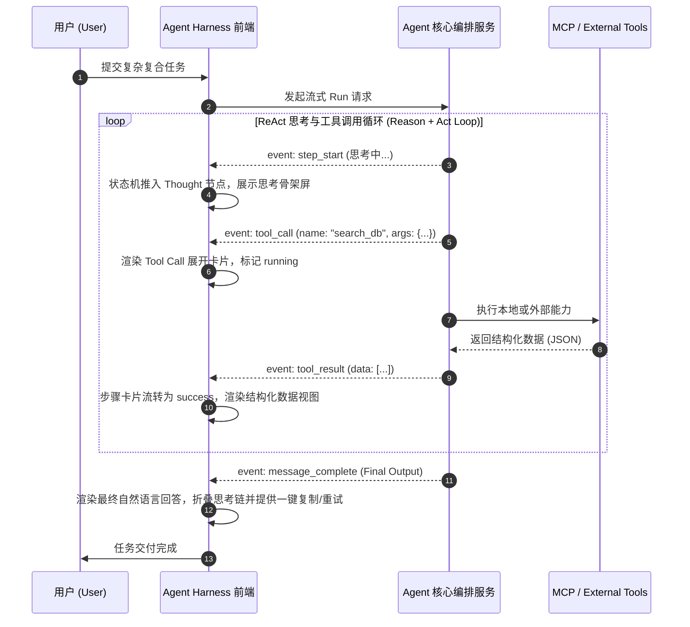
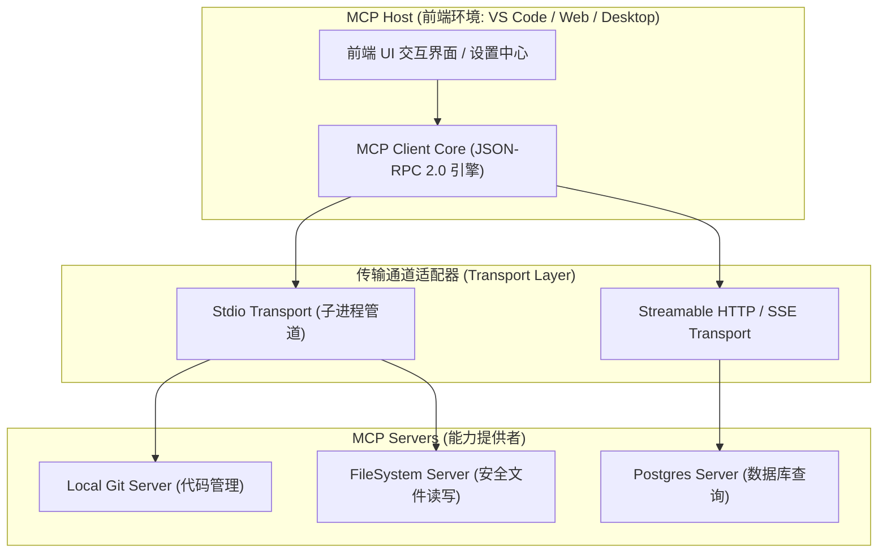
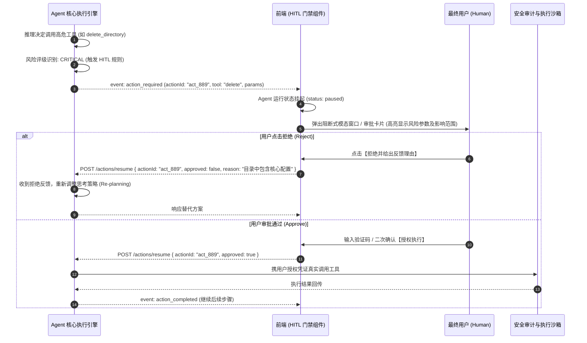

# Agent 架构与 MCP 协议生态 (Agent Harness & MCP)✅

本模块涵盖大模型智能体（Agent）前端宿主（Harness）交互界面架构、ReAct 规划思考链动态可视化、Anthropic Model Context Protocol (MCP) 跨生态工具调用协议底层机制以及高危工具执行时的 Human-in-the-Loop (HITL) 人工介入与权限安全门禁设计。

---

## 前端如何架构大模型 Agent 交互界面？ReAct 规划决策轨迹与思考链如何可视化？ {#p0-agent-frontend-harness}

<Answer>

**核心结论:**

大模型 Agent（智能体）前端交互界面绝非普通的即时聊天框（Chatbot），而是一个**基于有限状态机（FSM）的异步决策流水线宿主（Agent Frontend Harness）**：
- **认知负荷分层**：ReAct（Reasoning + Acting）架构下，Agent 会在单次任务中循环经历“思考（Thought） -> 规划与工具调用（Action / Tool Call） -> 环境反馈观察（Observation） -> 最终回答（Final Answer）”。前端必须对冗长嘈杂的中间推理链进行折叠降噪，提供“渐进式展开（Progressive Disclosure）”与实时步骤指示器；
- **状态驱动渲染**：前端将流式事件解析为由树形/时间线构成的步骤状态机（Step State Machine），每个步骤具备独立的状态（`idle` | `running` | `streaming` | `success` | `error` | `requires_action`）；
- **动态组件注入**：工具调用产生结构化数据（如查询股票、绘制图表、操作文件）时，前端需将原始 JSON 映射为对应的富交互可插拔 UI 卡片，而不是纯文本堆砌。

---

**原理解析:**

**1. ReAct 决策流水线在前端的生命周期映射**



**2. 核心架构设计关键考量**

- **流式事件总线规范**：服务端需基于 SSE 或 NDJSON 协议下发细粒度事件协议，例如：
  - `workflow_started`: 初始化会话轨迹树；
  - `node_started` / `node_finished`: 节点生命周期标记；
  - `tool_call_chunk`: 工具参数增量流（应对长 JSON 参数生成过程）；
  - `tool_call_finished`: 工具输入就绪，进入执行阶段；
  - `thought_delta`: 思考链 Token 流（如 DeepSeek-R1、o1 等推理模型的高密输出）；
- **虚拟化与性能防抖**：长任务 Agent 执行可能产生数百个细分 Step 与数万 Token。如果每个 SSE Chunk 直接触发根组件 `setState`，会导致严重卡顿。必须通过**分片局部订阅（Zustand Slice / Jotai Atom）**配合 `requestAnimationFrame` 批量调度更新，仅使发生变更的步骤卡片重新渲染；
- **异常恢复与单步重试**：Agent 工具链调用可能在某一环节超时失败（如网络中断、接口 500）。优秀的前端 Harness 允许用户针对单步失败进行“原位重试（In-place Retry）”或“修改参数后继续（Edit & Resume）”，无需让整个大任务从头执行。

---

**规范代码实现:**

以下为工业级生产环境中，基于 TypeScript 实现的 Agent 步骤状态机与 ReAct 轨迹管理器：

```typescript
// types/agent-harness.ts
export type StepType = 'thought' | 'tool_call' | 'tool_result' | 'final_answer' | 'approval_required';

export type StepStatus = 'pending' | 'running' | 'success' | 'failed' | 'waiting_approval';

export interface AgentStep {
  id: string;
  type: StepType;
  title: string;
  status: StepStatus;
  content?: string; // 思考链文字或最终回答
  toolName?: string;
  toolArgs?: Record<string, unknown>;
  toolResult?: unknown;
  startTime: number;
  endTime?: number;
  error?: string;
}

export interface AgentRunState {
  runId: string;
  status: 'idle' | 'executing' | 'paused' | 'completed' | 'failed';
  steps: AgentStep[];
  activeStepId: string | null;
  totalTokensUsed: number;
}

// store/agentRunner.ts
export class AgentTrajectoryManager {
  private state: AgentRunState;
  private listeners = new Set<(state: AgentRunState) => void>();
  private renderScheduled = false;

  constructor(runId: string) {
    this.state = {
      runId,
      status: 'idle',
      steps: [],
      activeStepId: null,
      totalTokensUsed: 0,
    };
  }

  public subscribe(listener: (state: AgentRunState) => void): () => void {
    this.listeners.add(listener);
    listener(this.state);
    return () => this.listeners.delete(listener);
  }

  private notify(): void {
    if (this.renderScheduled) return;
    this.renderScheduled = true;
    // 使用 requestAnimationFrame 批处理通知，避免高频流式推送阻塞主线程
    requestAnimationFrame(() => {
      this.renderScheduled = false;
      this.listeners.forEach((listener) => listener({ ...this.state }));
    });
  }

  // 处理开始思考事件
  public onThoughtStart(stepId: string, title = '正在思考解决方案...'): void {
    const newStep: AgentStep = {
      id: stepId,
      type: 'thought',
      title,
      status: 'running',
      content: '',
      startTime: Date.now(),
    };
    this.state.steps.push(newStep);
    this.state.activeStepId = stepId;
    this.state.status = 'executing';
    this.notify();
  }

  // 处理思考流增量输出
  public onThoughtChunk(stepId: string, delta: string): void {
    const step = this.state.steps.find((s) => s.id === stepId);
    if (step && step.type === 'thought') {
      step.content = (step.content || '') + delta;
      this.notify();
    }
  }

  // 工具调用声明到达
  public onToolCall(stepId: string, toolName: string, args: Record<string, unknown>): void {
    // 自动闭合上一个思考步骤
    if (this.state.activeStepId) {
      const prevStep = this.state.steps.find((s) => s.id === this.state.activeStepId);
      if (prevStep && prevStep.status === 'running') {
        prevStep.status = 'success';
        prevStep.endTime = Date.now();
      }
    }

    const toolStep: AgentStep = {
      id: stepId,
      type: 'tool_call',
      title: `调用工具: ${toolName}`,
      status: 'running',
      toolName,
      toolArgs: args,
      startTime: Date.now(),
    };
    this.state.steps.push(toolStep);
    this.state.activeStepId = stepId;
    this.notify();
  }

  // 工具执行结果回传
  public onToolResult(stepId: string, result: unknown, isError = false): void {
    const step = this.state.steps.find((s) => s.id === stepId);
    if (step) {
      step.status = isError ? 'failed' : 'success';
      step.toolResult = result;
      step.endTime = Date.now();
      if (isError) {
        step.error = String(result);
      }
    }
    this.notify();
  }

  // 任务最终完成
  public onFinalAnswer(stepId: string, answer: string): void {
    const finalStep: AgentStep = {
      id: stepId,
      type: 'final_answer',
      title: '执行完成',
      status: 'success',
      content: answer,
      startTime: Date.now(),
      endTime: Date.now(),
    };
    this.state.steps.push(finalStep);
    this.state.activeStepId = null;
    this.state.status = 'completed';
    this.notify();
  }
}
```

---

**面试官视角:**

- **考察深度**:
  1. 候选人是否具备现代复合型 AI 原生应用（AI Native Apps）的架构设计经验，是否清楚传统聊天机器人（Chatbot）与 Agent Harness 界面在交互状态机上的本质差异；
  2. 针对推理模型（如 DeepSeek-R1、OpenAI o1）万字思考链输出的高并发渲染，能否答出 RAF 节流、虚拟滚动（Virtual List）、Zustand 局部订阅切片等性能优化方案；
  3. 是否理解 Agent 长期运行中的中断、回滚、原位修复等工程闭环设计。
- **下探追问链**:
  - *追问 1*：如果模型输出的思考链中夹杂着未完结的 Markdown 代码块或数学公式，界面在实时展开时如何保证不发生高度剧烈跳变（Layout Shift）？
  - *追问 2*：当 Agent 需要并发调用 3 个工具（Parallel Tool Calling）时，你的前端状态机与 UI 树结构如何组织？

---

**延伸阅读:**

- LangChain LangGraph Studio: Agent 状态机与工作流拓扑可视化设计
- Vercel AI SDK Core: Tool Calling 与 Agent UI 组件设计最佳实践
- AutoGPT / Claude Artifacts 交互架构深度剖析
</Answer>

---

## Model Context Protocol (MCP) 协议在前端是如何工作的？它与传统 Function Calling 有什么区别？ {#p0-mcp-protocol-frontend}

<Answer>

**核心结论:**

**Model Context Protocol (MCP)** 是由 Anthropic 牵头开源的大模型上下文开放协议标准，旨在**终结过去不同大模型平台私有 Function Calling（工具调用）硬编码生态割裂的局面**，成为大模型时代的“USB-C 接口”：
- **解耦模型与工具**：传统 Function Calling 需要宿主将所有可用工具的 JSON Schema 硬编码写死在单次请求的 Payload 中，模型每换一个平台或工具更新就需要改动核心代码；MCP 抽象出标准的 **Host（宿主）- Client（客户端）- Server（能力服务端）** 三层架构；
- **核心能力三要素**：MCP 统一规范了三大基准能力：
  1. **Tools（工具）**：具有副作用的动作执行器（Actionable Functions），支持动态发现与参数校验；
  2. **Resources（上下文资源）**：只读数据文件/知识文档（如本地文件、数据库记录、API Schema），供模型挂载检索；
  3. **Prompts（提示词模板）**：预设的工作流模板与角色指导；
- **前端定位**：在桌面前端（Electron / Tauri / VS Code 插件）或 Web 浏览器中，前端通常作为 **MCP Host** 运行 MCP Client 实例，通过 `stdio`（子进程）或 `SSE / Streamable HTTP`（远程网络服务）与本地/云端各类 MCP Server 建立动态双向 RPC 通信。

---

**原理解析:**

**1. 传统 Function Calling vs MCP 架构对比**

| 对比维度 | 传统 Function Calling (如 OpenAI Tools) | Model Context Protocol (MCP) |
| :--- | :--- | :--- |
| **架构耦合度** | 强耦合。前端需硬编码定义全部工具 Schema 并注入请求体 | **解耦。客户端动态向 MCP Server 发现（`tools/list`）并注册** |
| **生态扩展性** | 每新增一个工具需重新部署核心业务代码 | **即插即用。用户添加 MCP Server 配置即可无缝扩充能力** |
| **通信协议** | 无独立协议，依赖各大厂商各自私有的 REST API 规范 | **标准 JSON-RPC 2.0 协议规范**（跨语言、跨传输层统一） |
| **支持能力范围** | 仅支持可执行函数（Tool Execution） | **涵盖 Tools（调用）、Resources（数据）与 Prompts（模版）** |
| **传输通道** | 仅限 HTTP POST Payload | **支持 Local Stdio（进程输入输出）、SSE、WebSockets 等** |
| **权限与安全隔离** | 权限由后端集中托管，前端感知弱 | **支持细粒度的 Client 授权批准门禁与本地进程沙箱隔离** |

**2. MCP 客户端-服务端协议调用拓扑**



**3. 前端集成 MCP 的核心工作流**

1. **连接初始化（Handshake）**：Client 发送 `initialize` 请求，携带客户端信息及协议版本，Server 响应支持的协议特性（Capabilities）；
2. **能力动态发现（Discovery）**：Client 发送 `tools/list` 与 `resources/list`，动态获取当前 MCP Server 支持的全部工具清单及对应 JSON Schema；
3. **动态 Schema 注入**：前端将发现的 MCP 工具 Schema 转换为大模型支持的 Tool 格式，注入对话上下文；
4. **模型决策与 RPC 派发**：模型触发工具调用时，MCP Client 拦截请求，解析出目标 MCP Server 名称及工具参数，发起 `tools/call` RPC 请求；
5. **执行与安全门禁**：若工具标注为危险操作，MCP Client 挂起执行，唤起前端授权弹窗；获批后将真实调用结果回传给大模型。

---

**规范代码实现:**

以下为前端基于 TypeScript 实现的轻量标准 MCP 客户端核心（JSON-RPC 2.0 消息抽象与工具调用协议调度）：

```typescript
// mcp/types.ts
export interface JsonRpcRequest<T = Record<string, unknown>> {
  jsonrpc: '2.0';
  id: string | number;
  method: string;
  params?: T;
}

export interface JsonRpcResponse<T = unknown> {
  jsonrpc: '2.0';
  id: string | number;
  result?: T;
  error?: {
    code: number;
    message: string;
    data?: unknown;
  };
}

export interface McpToolSchema {
  name: string;
  description?: string;
  inputSchema: {
    type: 'object';
    properties: Record<string, unknown>;
    required?: string[];
  };
}

// mcp/client.ts
export interface IMcpTransport {
  send(message: JsonRpcRequest): Promise<void>;
  onMessage(handler: (message: JsonRpcResponse) => void): void;
  close(): Promise<void>;
}

export class McpClient {
  private transport: IMcpTransport;
  private pendingRequests = new Map<string | number, {
    resolve: (value: unknown) => void;
    reject: (reason: unknown) => void;
  }>();
  private requestId = 0;
  private cachedTools: McpToolSchema[] = [];

  constructor(transport: IMcpTransport) {
    this.transport = transport;
    this.transport.onMessage(this.handleIncomingMessage.bind(this));
  }

  private handleIncomingMessage(res: JsonRpcResponse): void {
    const handler = this.pendingRequests.get(res.id);
    if (!handler) return;

    this.pendingRequests.delete(res.id);
    if (res.error) {
      handler.reject(new Error(`MCP RPC Error [${res.error.code}]: ${res.error.message}`));
    } else {
      handler.resolve(res.result);
    }
  }

  private sendRpc<T>(method: string, params?: Record<string, unknown>): Promise<T> {
    const id = ++this.requestId;
    const request: JsonRpcRequest = {
      jsonrpc: '2.0',
      id,
      method,
      params,
    };

    return new Promise((resolve, reject) => {
      this.pendingRequests.set(id, { resolve: resolve as (v: unknown) => void, reject });
      this.transport.send(request).catch(reject);
    });
  }

  // 1. 初始化握手
  public async initialize(): Promise<void> {
    const handshakeResult = await this.sendRpc<{ protocolVersion: string }>('initialize', {
      protocolVersion: '2024-11-05',
      capabilities: {
        roots: { listChanged: true },
        sampling: {},
      },
      clientInfo: {
        name: 'web-interview-mcp-client',
        version: '1.0.0',
      },
    });
    console.log(`[MCP] Initialized with protocol: ${handshakeResult.protocolVersion}`);
  }

  // 2. 动态发现工具清单
  public async listTools(): Promise<McpToolSchema[]> {
    const response = await this.sendRpc<{ tools: McpToolSchema[] }>('tools/list');
    this.cachedTools = response.tools;
    return this.cachedTools;
  }

  // 3. 执行特定工具
  public async callTool(toolName: string, args: Record<string, unknown>): Promise<unknown> {
    return await this.sendRpc('tools/call', {
      name: toolName,
      arguments: args,
    });
  }
}
```

---

**面试官视角:**

- **考察深度**:
  1. 候选人是否紧跟 2025-2026 年大模型体系最前沿的标准演进（Anthropic MCP 协议对整个行业标准格局的统一推动）；
  2. 能否从本质原理上讲清楚“为什么硬编码 Function Calling 会让复杂多工具系统难以维护”，以及 MCP 如何通过三层解耦解决问题；
  3. 对 JSON-RPC 2.0、基于流的传输通道（stdio / SSE）、客户端动态能力发现有无深入理解。
- **下探追问链**:
  - *追问 1*：在 Web 纯浏览器环境中，由于浏览器沙箱限制，前端无法直接派生子进程开启 `stdio` 管道连接本地 MCP Server，这种情况下前端通常如何集成 MCP？
  - *追问 2*：如果多个 MCP Server 提供了重名的 Tool（命名空间冲突），前端 Client 应该如何设计命名隔离与路由转发？

---

**延伸阅读:**

- Model Context Protocol (MCP) Official Documentation (Anthropic)
- Claude Desktop MCP Architecture & Open-Source Server Catalog
- JSON-RPC 2.0 Specification Standard
</Answer>

---

## Agent 执行高风险工具（如删除文件、对外转账）时，前端如何设计 Human-in-the-Loop 授权门禁？ {#p0-agent-hitl-guardrail}

<Answer>

**核心结论:**

**Human-in-the-Loop (HITL，人机协同授权门禁)** 是大模型从“只读聊天”走向“真实世界自治执行（Agentic Workflow）”的生命线工程。大模型天然存在幻觉与不可控性，赋予其写入、删除或资金操作权限必须设立安全防护堤：
- **挂起与恢复协议（Suspend & Resume）**：Agent 在调用高危工具时，执行流不可静默直接运行，必须主动触发状态**挂起（Suspension）**，在前端向用户呈现清晰直观的操作意图、影响范围与参数详情；
- **权限安全分级矩阵**：根据操作风险等级（Safe 只读查询 -> Moderate 局部文件写入 -> Critical 批量删除/对外网络通讯/资金转移）实施差异化防御；
- **防窜改与会话锁定**：授权请求必须携带签名与有效时效，严禁前端仅靠无状态 Boolean 变量绕过授权；后端服务在等待授权期间应对目标资源实施悲观锁或状态快照校验，防止产生并发竞态或中间人劫持。

---

**原理解析:**

**1. HITL 挂起-确认-恢复时序流**



**2. 前端设计四大防御准则**

1. **零歧义影响面可视化（Impact Preview）**：
   - 严禁将复杂的原始 JSON 裸露给用户；必须进行**语义化参数翻译**。例如：删除文件时，明确高亮显示路径、影响文件总数及不可逆警告；
2. **差异比对视图（Diff View）**：
   - 对于代码修改、文档重写类工具，前端必须内嵌 Monaco / CodeMirror 原生 Side-by-Side Diff 视图，让用户逐行直观审查变更；
3. **临时提权（Ephemeral Escalation）与单次有效**：
   - 授权只能针对当前的 `actionId` 单次生效，过期自动失效（如 5 分钟未确认自动超时取消），严禁持久保留全量危险权限；
4. **会话级回滚黑匣子**：
   - 记录每一次用户授权事件的操作人、时间戳与当时的参数快照，形成完整的不可篡改审计日志链。

---

**规范代码实现:**

以下为前端基于 React + Promise 控制反转模式实现的通用的 HITL 授权挂起门禁核心管理器：

```typescript
// security/hitl-guard.ts
export type RiskLevel = 'low' | 'moderate' | 'critical';

export interface PendingAction {
  actionId: string;
  toolName: string;
  riskLevel: RiskLevel;
  description: string;
  params: Record<string, unknown>;
  createdAt: number;
  resolve: (decision: ActionDecision) => void;
}

export interface ActionDecision {
  approved: boolean;
  rejectReason?: string;
  modifiedParams?: Record<string, unknown>;
}

export class HitlGuardManager {
  private pendingQueue: PendingAction[] = [];
  private listeners = new Set<(queue: PendingAction[]) => void>();

  public subscribe(listener: (queue: PendingAction[]) => void): () => void {
    this.listeners.add(listener);
    listener([...this.pendingQueue]);
    return () => this.listeners.delete(listener);
  }

  private notify(): void {
    this.listeners.forEach((fn) => fn([...this.pendingQueue]));
  }

  // 评估工具风险级别
  public evaluateRisk(toolName: string, params: Record<string, unknown>): RiskLevel {
    const criticalTools = ['delete_file', 'drop_database', 'transfer_funds', 'execute_bash'];
    const moderateTools = ['write_file', 'update_record', 'git_push'];

    if (criticalTools.includes(toolName)) return 'critical';
    if (moderateTools.includes(toolName)) return 'moderate';
    return 'low';
  }

  // 拦截工具调用：若为高风险则返回挂起的 Promise 等待用户确认
  public async interceptToolCall(
    actionId: string,
    toolName: string,
    params: Record<string, unknown>
  ): Promise<ActionDecision> {
    const riskLevel = this.evaluateRisk(toolName, params);

    // 低风险工具无需阻断，自动放行
    if (riskLevel === 'low') {
      return { approved: true };
    }

    // 高风险工具进入挂起队列，返回未决 Promise
    return new Promise<ActionDecision>((resolve) => {
      const actionItem: PendingAction = {
        actionId,
        toolName,
        riskLevel,
        description: `Agent 正在申请执行高危操作: [${toolName}]，需要您的审查授权。`,
        params,
        createdAt: Date.now(),
        resolve,
      };

      this.pendingQueue.push(actionItem);
      this.notify();
    });
  }

  // 用户点击批准
  public approve(actionId: string, modifiedParams?: Record<string, unknown>): void {
    const index = this.pendingQueue.findIndex((item) => item.actionId === actionId);
    if (index === -1) return;

    const [action] = this.pendingQueue.splice(index, 1);
    action.resolve({
      approved: true,
      modifiedParams: modifiedParams || action.params,
    });
    this.notify();
  }

  // 用户点击拒绝并附带指导意见
  public reject(actionId: string, reason: string): void {
    const index = this.pendingQueue.findIndex((item) => item.actionId === actionId);
    if (index === -1) return;

    const [action] = this.pendingQueue.splice(index, 1);
    action.resolve({
      approved: false,
      rejectReason: reason,
    });
    this.notify();
  }
}
```

---

**面试官视角:**

- **考察深度**:
  1. 候选人是否具备真实严肃场景下的 AI 安全治理思维，不仅关注 AI“能做什么”，更清楚如何控制其“不能破坏什么”；
  2. 能否优雅设计前端与服务端的异步挂起唤醒模式（Promise 控制反转、WebSocket / SSE 长连接阻断通知）；
  3. 是否理解“人在回路（HITL）”对提升大模型自主任务成功率的战略价值（用户提供的拒绝理由直接作为下一轮思考的上下文，引导 Agent 自我纠错）。
- **下探追问链**:
  - *追问 1*：如果用户在弹窗挂起阶段直接刷新了网页或关闭了标签页，后端的 Agent 任务该如何安全处置？如何防止任务变成孤儿进程？
  - *追问 2*：如何支持用户在授权弹窗中“直接修改模型传入的危险参数”后再执行（Edit-in-the-Loop）？

---

**延伸阅读:**

- OpenAI Assistants API: Required Actions & Human Tool Approvals
- Anthropic Claude 计算机控制（Computer Use）安全防护基线
- NIST AI Risk Management Framework (AI RMF): Human-AI Teaming
</Answer>
