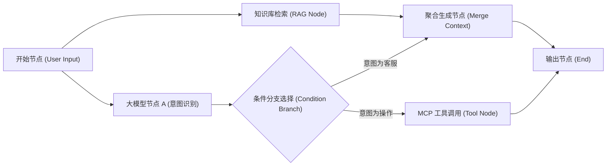
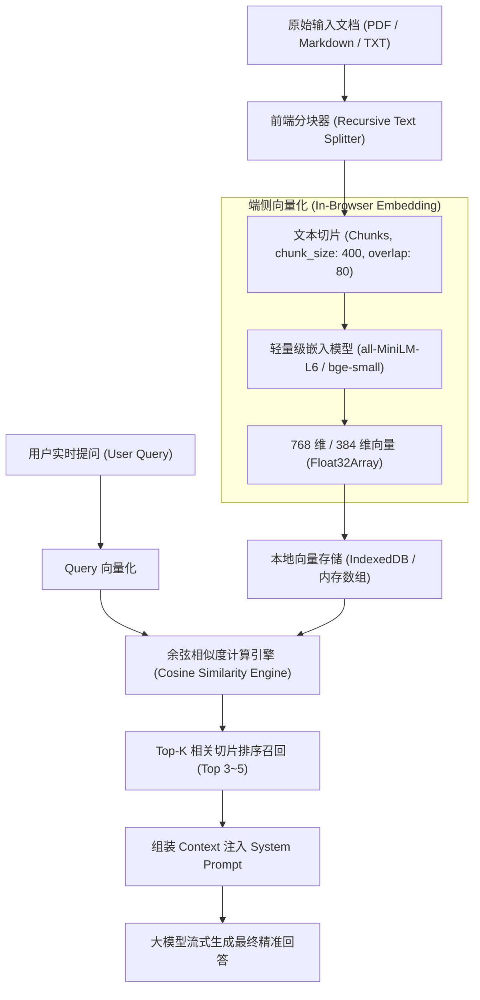
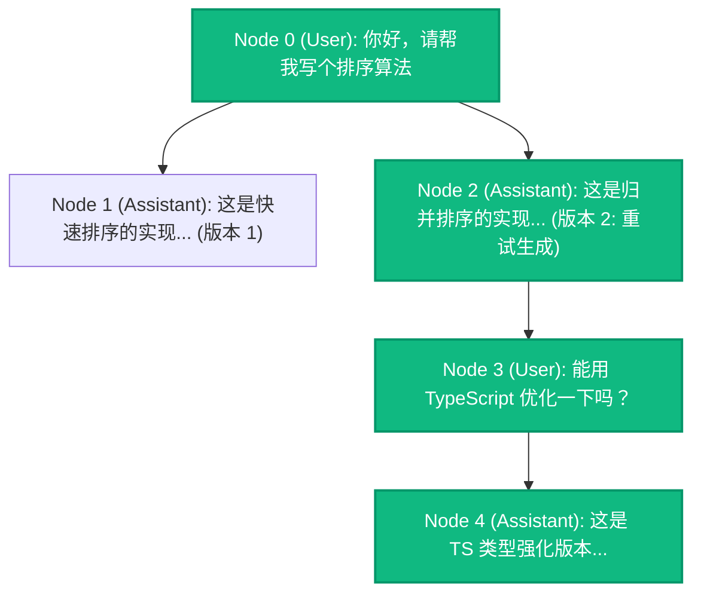

# 业务使用与场景集成 (Business Usage & Scenarios)✅

本模块涵盖大模型能力在生产级前端业务中的三大杀手级复合场景：可视化 DAG 智能体工作流画布编排（拓扑调度与调试）、多轮分支会话树状态机与时光机撤销重试，以及企业私域本地 RAG 知识检索系统落地。

---

## 如何设计类似 Dify / Coze 的可视化 DAG 工作流编排画布？拓扑排序与流式执行调试如何落地？ {#p0-ai-workflow-dag-canvas}

<Answer>

**核心结论:**

在复杂大模型与自主智能体（Agent）产品中，**基于有向无环图（DAG, Directed Acyclic Graph）的可视化工作流编排画布（如 Dify、Coze、LangFlow）已成为取代单调聊天框的战略级交互形态**：
- **混合渲染架构**：千万级坐标系与视口平移缩放（Pan & Zoom）下，纯 DOM/React 组件会导致严重的重绘重排；工业界采用**“底层 Canvas / SVG 绘制连线与网格背景 + 顶层 HTML/DOM 挂载交互节点（Node UI）”的混合分层架构**，兼顾渲染性能与表单交互能力；
- **确定性执行调度（Topological Scheduling）**：编排数据结构本质是邻接表（Adjacency List）；执行前必须通过 **Kahn 算法或深度优先搜索（DFS）进行环路检测与拓扑排序**，确保上游依赖节点先于下游节点执行；
- **分步流式观察与断点调试**：每个工作流节点作为独立的状态机（`idle` | `running` | `streaming` | `success` | `failed`），支持流式 Token 实时打字输出与局部单步重试（In-place Retry）。

---

**原理解析:**

**1. DAG 工作流节点依赖拓扑与执行生命周期**



**2. 核心架构关键考量**

1. **虚拟视口裁剪（Viewport Culling）**：
   - 面对上百个复杂节点，前端仅渲染当前可见视口（Viewport）内的节点 DOM；视口外的节点使用空白轻量占位，滚动缩放时动态复用节点容器；
2. **贝塞尔平滑连线（Cubic Bezier Curves）与吸附（Snap-to-Grid）**：
   - 端口（Handle）坐标通过 `ResizeObserver` 动态采集并转换为全局画布坐标系；连线控制点沿端口法线方向延伸，保证连线美观流畅且自动避让遮挡；
3. **环路死锁实时防御**：
   - 用户拖拽连线（Edge Connect）时，前端实时运行环路检测算法。若连线会导致环路闭合（Cycle detected），立即给出视觉阻断红线提示，禁止提交非法连线。

---

**规范代码实现:**

以下展示在前端基于 TypeScript 实现的 DAG 拓扑排序调度器与环路检测算法核心：

```typescript
// workflow/dag-scheduler.ts
export interface WorkflowNode {
  id: string;
  type: string;
  data: Record<string, unknown>;
}

export interface WorkflowEdge {
  id: string;
  source: string; // 上游节点 ID
  target: string; // 下游节点 ID
}

export interface WorkflowGraph {
  nodes: WorkflowNode[];
  edges: WorkflowEdge[];
}

export class DagWorkflowScheduler {
  // 1. 基于 Kahn 算法实现拓扑排序与环路检测
  public static getExecutionPlan(graph: WorkflowGraph): {
    executionBatches: string[][];
    hasCycle: boolean;
  } {
    const inDegree = new Map<string, number>();
    const adjacencyList = new Map<string, string[]>();

    // 初始化入度与邻接表
    graph.nodes.forEach((node) => {
      inDegree.set(node.id, 0);
      adjacencyList.set(node.id, []);
    });

    graph.edges.forEach((edge) => {
      inDegree.set(edge.target, (inDegree.get(edge.target) || 0) + 1);
      adjacencyList.get(edge.source)?.push(edge.target);
    });

    // 收集所有入度为 0 的节点作为第一批可并行执行批次
    let currentBatch: string[] = [];
    inDegree.forEach((deg, nodeId) => {
      if (deg === 0) currentBatch.push(nodeId);
    });

    const executionBatches: string[][] = [];
    let visitedCount = 0;

    while (currentBatch.length > 0) {
      executionBatches.push(currentBatch);
      visitedCount += currentBatch.length;

      const nextBatch: string[] = [];
      for (const nodeId of currentBatch) {
        const neighbors = adjacencyList.get(nodeId) || [];
        for (const neighbor of neighbors) {
          const currentDeg = (inDegree.get(neighbor) || 1) - 1;
          inDegree.set(neighbor, currentDeg);
          if (currentDeg === 0) {
            nextBatch.push(neighbor);
          }
        }
      }
      currentBatch = nextBatch;
    }

    // 若处理的节点数小于总节点数，说明图中存在闭环 (Cycle)
    const hasCycle = visitedCount !== graph.nodes.length;

    return {
      executionBatches,
      hasCycle,
    };
  }
}
```

---

**面试官视角:**

- **考察深度**:
  1. 候选人是否具备现代 AI 原生平台化产品的深度自研能力，而非仅仅拼装现成的 UI 库；
  2. 对图论算法（拓扑排序、有向图环路检测）与前端图形学（坐标系转换、矩阵平移变换 Matrix Transform）的综合驾驭能力；
  3. 分布式工作流状态流转（并行节点并发控制、状态持久化落盘）的工程素养。
- **下探追问链**:
  - *追问 1*：当画布缩放到 20% 时，文字已不可读，如何从性能和用户体验角度做 LOD（Level of Detail）细节层次渲染？
  - *追问 2*：若上游某个分支节点报错失败，下游多个依赖节点的级联取消与容灾该如何设计？

---

**延伸阅读:**

- React Flow: The Inner Workings of Node-Based UIs
- Dify.ai Workflow Engine Open Source Architecture
</Answer>

---

## 前端如何构建端侧本地 RAG 系统？文档分块与余弦相似度检索是如何落地的？ {#p0-rag-frontend-vector-search}

<Answer>

**核心结论:**

**端侧本地 RAG（Client-Side Local RAG）** 是指在前端浏览器内，不依赖任何第三方向量数据库（如 Pinecone、Milvus）或服务端接口，纯靠本地 JavaScript 引擎与 WebWorker 完成私有文档的**解析、分块（Chunking）、向量嵌入（Embedding）、语义相似度检索（Vector Retrieval）与 Prompt 组装**的全套闭环：
- **核心应用场景**：本地 Markdown 知识库助手、离线 PDF 划词问答、用户个人浏览历史搜索等，具备极致的私密性与即时响应能力；
- **标准落地链路**：
  1. **文档加载与分块**：采用带重叠窗口（Overlap）的递归分块算法，保留段落上下文完整性，避免关键语义在切分点被截断；
  2. **端侧轻量嵌入**：利用 Transformers.js 加载极轻量级嵌入模型（如 `bge-small-zh-v1.5` 或 `all-MiniLM-L6-v2`，模型仅约 20MB~40MB）；
  3. **向量计算与 Top-K 召回**：使用 `Float32Array` 类型化数组存储向量，利用**余弦相似度（Cosine Similarity）**算法并行比对，召回相关度最高的上下文片段注入大模型。

---

**原理解析:**

**1. 前端端侧本地 RAG 全链路数据流**



**2. 核心算法原理推导**

- **重叠切分窗口（Overlap）的必要性**：
  - 设切片大小为 S，重叠大小为 O。若不设重叠，切片 A 与切片 B 的交界处刚好存在一个核心实体关系（例如：“...张三出生于北京市朝阳区。[切分点] 毕业于清华大学...”），该实体关系就会被撕裂，导致模型无法检索到“张三的母校是清华”。引入 15%~20% 的 Overlap，能确保边界实体语义连贯；
- **余弦相似度（Cosine Similarity）计算**：
  - 给定查询向量 A 与文档切片向量 B，两者的余弦相似度定义为两向量点积与模长乘积之比：
    `Cosine(A, B) = (A · B) / (||A|| * ||B||) = sum(A_i * B_i) / (sqrt(sum(A_i^2)) * sqrt(sum(B_i^2)))`
  - 在前端工程优化中，如果我们在存入向量库时已将向量做过**L2 范数归一化（Normalize to unit length）**，则分母恒等于 1，余弦相似度直接简化为**两个数组的点积（Dot Product）**，极大节省运行时 CPU 算力开销。

---

**规范代码实现:**

以下为纯 TypeScript 实现的高性能前端本地 RAG 核心（包含递归分块算法、归一化点积计算与 Top-K 召回）：

```typescript
// rag/local-rag-engine.ts
export interface DocumentChunk {
  id: string;
  text: string;
  embedding?: Float32Array;
  metadata?: Record<string, unknown>;
}

export class LocalRagEngine {
  private chunks: DocumentChunk[] = [];

  // 1. 递归文本分块器 (Recursive Character Text Splitter)
  public chunkText(
    text: string,
    chunkSize = 300,
    chunkOverlap = 50
  ): DocumentChunk[] {
    const separators = ['

', '
', '。', '！', '？', ' ', ''];
    const result: string[] = [];

    const splitRecursively = (currentText: string, sepIndex: number): string[] => {
      if (currentText.length <= chunkSize || sepIndex >= separators.length) {
        return [currentText.trim()].filter(Boolean);
      }

      const sep = separators[sepIndex];
      const parts = currentText.split(sep);
      const subChunks: string[] = [];
      let currentAcc = '';

      for (const part of parts) {
        const piece = currentAcc ? `${currentAcc}${sep}${part}` : part;
        if (piece.length <= chunkSize) {
          currentAcc = piece;
        } else {
          if (currentAcc) subChunks.push(currentAcc.trim());
          if (part.length > chunkSize) {
            // 继续往下用更小颗粒度的分隔符递归切分
            subChunks.push(...splitRecursively(part, sepIndex + 1));
            currentAcc = '';
          } else {
            currentAcc = part;
          }
        }
      }
      if (currentAcc) subChunks.push(currentAcc.trim());
      return subChunks;
    };

    const rawChunks = splitRecursively(text, 0);

    // 叠加 Overlap 窗口并生成带 ID 的结构
    this.chunks = rawChunks.map((chunk, index) => ({
      id: `chunk_${index}`,
      text: chunk,
    }));

    return this.chunks;
  }

  // 2. 向量点积/余弦相似度计算 (假设向量已完成 L2 归一化)
  public static dotProduct(a: Float32Array, b: Float32Array): number {
    let dot = 0;
    const len = a.length;
    for (let i = 0; i < len; i++) {
      dot += a[i] * b[i];
    }
    return dot;
  }

  // 3. 注册带 Embedding 的文档切片
  public registerChunksWithEmbeddings(chunksWithVectors: DocumentChunk[]): void {
    this.chunks = chunksWithVectors;
  }

  // 4. 执行 Top-K 向量相似度检索
  public retrieveTopK(
    queryEmbedding: Float32Array,
    k = 3,
    minSimilarity = 0.5
  ): Array<{ chunk: DocumentChunk; similarity: number }> {
    const scoredChunks = this.chunks
      .map((chunk) => {
        if (!chunk.embedding) return null;
        const similarity = LocalRagEngine.dotProduct(queryEmbedding, chunk.embedding);
        return { chunk, similarity };
      })
      .filter((item): item is { chunk: DocumentChunk; similarity: number } => 
        item !== null && item.similarity >= minSimilarity
      );

    // 按相似度降序排序并截取 Top-K
    scoredChunks.sort((a, b) => b.similarity - a.similarity);
    return scoredChunks.slice(0, k);
  }

  // 5. 动态构建带有证据引用的增强上下文 Prompt
  public buildPrompt(query: string, retrieved: Array<{ chunk: DocumentChunk; similarity: number }>): string {
    const contextBlock = retrieved
      .map((item, idx) => `[参考切片 ${idx + 1}]:
${item.chunk.text}`)
      .join('

');

    return `你是一个专业的本地知识助手。请严格结合以下参考切片回答用户问题，若参考内容未提及，请诚实告知未知，切勿编造。

【参考上下文】:
${contextBlock}

【用户问题】:
${query}

请给出严谨的解答并标注参考来源。`;
  }
}
```

---

**面试官视角:**

- **考察深度**:
  1. 候选人是否真正动手实践过 RAG 检索增强架构，而非仅仅知晓名词概念；
  2. 能否从数学逻辑（点积、L2 范数归一化）和内存效率（TypedArray 连续内存块）层面优化前端大量向量运算的执行性能；
  3. 对分块尺寸（Chunk Size）与重叠（Overlap）超参数的选型敏感度，以及如何防止幻觉注入。
- **下探追问链**:
  - *追问 1*：如果本地文档有上万个切片，在前端做全量线性比对（$O(N)$ 暴力搜索）会出现明显的卡顿，前端如何在不借助后端的情况下实现高效近似近邻检索（ANN）？
  - *追问 2*：单纯依靠向量余弦检索时，遇到精确的工单编号（如 `BUG-2026-9901`）往往检索召回率极低，前端如何结合 BM25 关键词检索做混合加权排序（Hybrid Search）？

---

**延伸阅读:**

- LangChain: Concepts of Text Splitters & Embedding Chunking
- Hugging Face Transformers.js Feature Extraction Pipeline
- In-Memory Vector Search with HNSW in WebAssembly
</Answer>

---

---

## 在大模型多轮分支对话交互中，复杂会话树状态机与撤销重试是如何设计的？ {#p1-ai-chat-tree-state}

<Answer>

**核心结论:**

随着大模型对话从单一线性序列演化为支持**“重试回答（Regenerate）”、“编辑上文分叉（Branching）”与“版本切换（Step Back/Forward）”**的高级交互形态，传统的扁平数组结构（`Message[]`）已无法满足需求：
- **树状有向无环图数据结构（Conversation Tree DAG）**：将每个节点抽象为包含 `id`、`parentId`、`childrenIds` 与 `activeChildIndex` 的树节点，通过计算从根节点到当前激活叶子节点的遍历路径（Active Path），即可精确投影出当前视口的消息流；
- **状态流转与本地持久化**：结合不可变状态更新（Immer / Zustand），支持在任意历史节点发起编辑派生全新分支，且保留此前所有版本的历史回答，极大提升了候选人面对复杂业务交互时的状态架构能力。

---

**原理解析:**



---

**规范 TypeScript 代码实现:**

```typescript
// 分支会话树节点定义
export interface ChatTreeNode {
  id: string;
  parentId: string | null;
  childrenIds: string[];
  activeChildIndex: number;
  role: 'user' | 'assistant' | 'system';
  content: string;
  createdAt: number;
}

export class ConversationTreeManager {
  private nodes: Map<string, ChatTreeNode> = new Map();
  private rootId: string | null = null;
  private currentLeafId: string | null = null;

  // 派生新分支或追加消息
  public appendMessage(role: 'user' | 'assistant', content: string, branchParentId?: string): string {
    const parentId = branchParentId ?? this.currentLeafId;
    const newNodeId = 'msg_' + Math.random().toString(36).slice(2, 9);

    const newNode: ChatTreeNode = {
      id: newNodeId,
      parentId,
      childrenIds: [],
      activeChildIndex: 0,
      role,
      content,
      createdAt: Date.now(),
    };

    this.nodes.set(newNodeId, newNode);

    if (parentId && this.nodes.has(parentId)) {
      const parent = this.nodes.get(parentId)!;
      parent.childrenIds.push(newNodeId);
      // 默认切换到最新创建的分支
      parent.activeChildIndex = parent.childrenIds.length - 1;
    } else {
      this.rootId = newNodeId;
    }

    this.currentLeafId = newNodeId;
    return newNodeId;
  }

  // 切换指定历史节点的子分支版本（例如查看版本 1 / 版本 2）
  public switchBranch(nodeId: string, childIndex: number): void {
    const node = this.nodes.get(nodeId);
    if (node && childIndex >= 0 && childIndex < node.childrenIds.length) {
      node.activeChildIndex = childIndex;
      // 重新寻址激活叶子节点
      this.currentLeafId = this.findDeepestActiveLeaf(node.childrenIds[childIndex]);
    }
  }

  // 获取从根到当前激活叶子节点的线性消息序列（供 UI 直接遍历渲染）
  public getActiveConversationPath(): ChatTreeNode[] {
    if (!this.rootId) return [];
    const path: ChatTreeNode[] = [];
    let currentId: string | null = this.rootId;

    while (currentId && this.nodes.has(currentId)) {
      const node = this.nodes.get(currentId)!;
      path.push(node);

      if (node.childrenIds.length > 0) {
        const nextIdx = Math.min(node.activeChildIndex, node.childrenIds.length - 1);
        currentId = node.childrenIds[nextIdx];
      } else {
        currentId = null;
      }
    }

    return path;
  }

  private findDeepestActiveLeaf(startId: string): string {
    let curr = startId;
    while (this.nodes.has(curr)) {
      const node = this.nodes.get(curr)!;
      if (node.childrenIds.length === 0) return curr;
      const idx = Math.min(node.activeChildIndex, node.childrenIds.length - 1);
      curr = node.childrenIds[idx];
    }
    return curr;
  }
}
```

---

**面试官视角:**

- **核心考察点**：考查候选人在面对非线性树状复杂交互时的底层数据结构抽象能力与状态机设计思维。

---

**延伸阅读:**

- [Tree-structured Conversation Models in Agent Workflows](https://github.com/langchain-ai/langchain)

</Answer>
