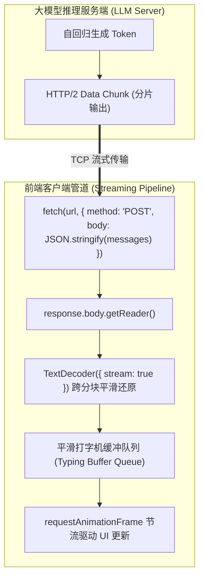
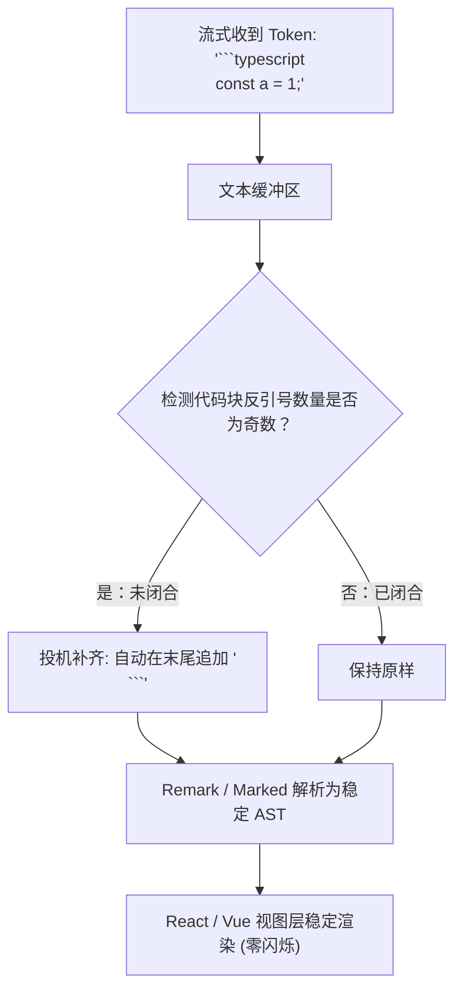
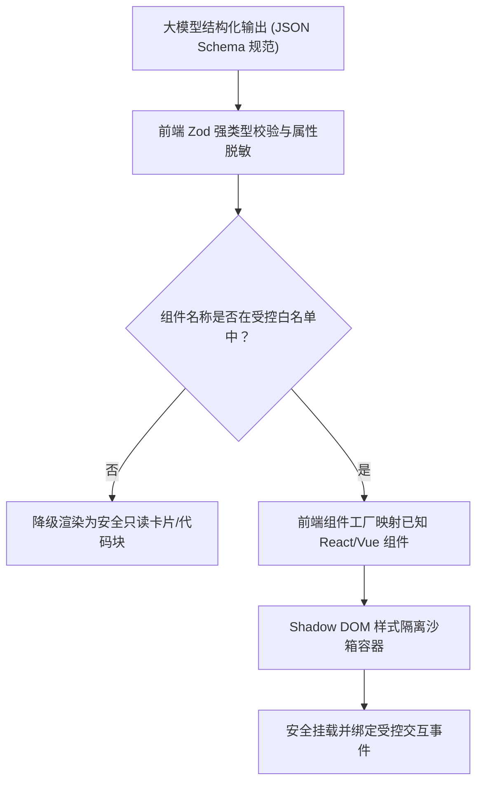
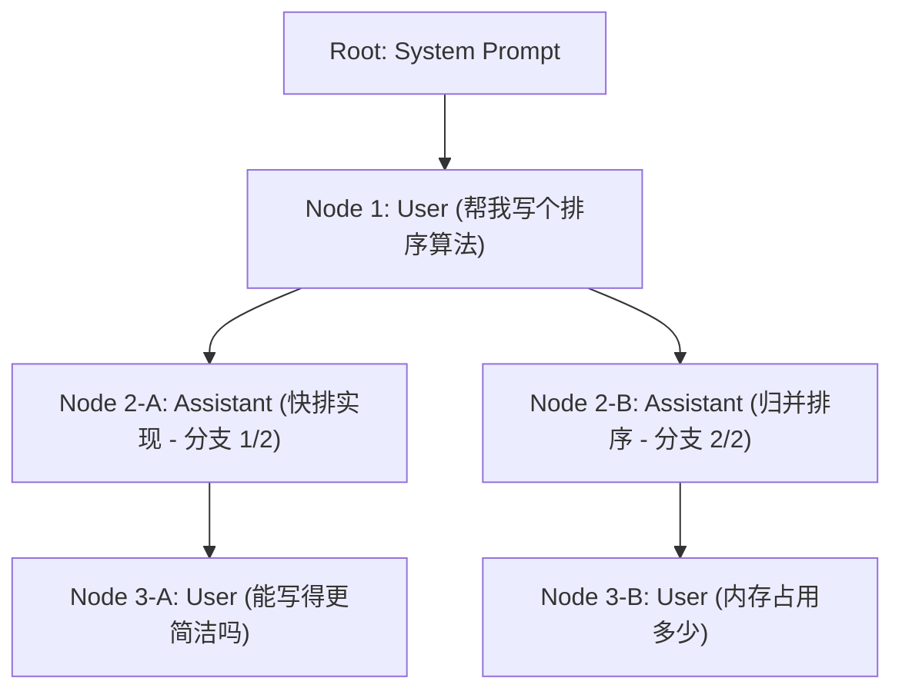

# 大模型流式交互与生成式 UI (Streaming Interaction & Generative UI)✅

本模块聚焦前端直面用户的核心交互体验层：端到端流式通信协议与打字机缓冲队列、Markdown AST 容错增量排版防抖、生成式 UI（Generative UI）动态组件沙箱与 XSS 防御，以及多轮会话分支树状态机。

---

## 前端如何实现类似 ChatGPT 的打字机流式响应？SSE 与 Fetch ReadableStream 该如何选择？ {#p0-ai-streaming-render}

<Answer>

**核心结论:**

在现代大模型前端交互中，**基于 Fetch API 与 ReadableStream 的自定义流式协议是当今工业界（如 ChatGPT、Claude、Vercel AI SDK）的绝对首选**，而传统原生 `EventSource`（SSE）由于底层功能局限正逐渐退居次要地位：
- **请求灵活性**：大模型对话通常需要提交包含数万 Token 的历史上下文（System Prompt + Messages 数组），原生 `EventSource` 仅支持 HTTP GET 请求且无法自定义 Request Body 与 Authorization Header，难以承载大型 Payload；Fetch API 则原生支持 `POST`、自定义头以及 `ReadableStream` 响应体读取；
- **传输控制与性能**：通过 `response.body.getReader()` 配合 `TextDecoder({ stream: true })` 进行增量分块解码，结合前端“平滑打字机缓冲队列（Smooth Typing Buffer Queue）”算法，既能避免微任务高频触发 React 重新渲染（Re-render 抖动），又能保证视觉上的连贯吐字动效。

---

**原理解析:**

**1. 传输协议全方位架构选型矩阵**

| 选型维度 | 原生 SSE (`EventSource`) | Fetch API (`ReadableStream`) | WebSocket |
| :--- | :--- | :--- | :--- |
| **HTTP 动词支持** | 仅限 `GET`（需依赖 URL Query 传参） | **支持 `POST`**（完整承载大体积 Payload） | 握手为 `GET`，后续双向全双工帧传输 |
| **自定义 Header** | ❌ 规范不支持（无法灵活传鉴权 Token） | **✅ 完全支持自定义 Header 与 Cookie** | 仅握手阶段支持部分 Header |
| **取消与中止** | `eventSource.close()` | **原生 `AbortController.abort()`** | `socket.close()` |
| **网络协议兼容性** | 基于标准 HTTP/1.1 或 HTTP/2 单向事件流 | **完美适配 HTTP/2 多路复用与边缘计算** | 需代理网关特殊支持长连接保持与升级 |
| **断线重连机制** | 引擎内置原生重连机制 | 需前端应用层手写指数退避重试 | 需前端心跳保活与手动重连 |
| **工业级定位** | 传统服务端单向广播通知 | **大模型流式推理对话的绝对标准范式** | 强实时双向协同（如在线多人白板、即时通讯） |

**2. 端到端流式读取与 TextDecoder 边界机制**

网络传输中的 TCP 分包或 HTTP/2 Data Frame 是按任意字节分片传输的。中文字符在 UTF-8 编码中占用 3 个字节：
若网络切片恰好将一个 3 字节的中文字符截断在第 1 或第 2 个字节处，如果直接调用 `decoder.decode(chunk)`，引擎会因遇到非法字节序列而输出替换字符乱码。
因此必须开启 **`new TextDecoder('utf-8', { fatal: false, stream: true })`**：
当 `stream: true` 时，解码器会在内部保留未凑齐完整 Unicode 码点的悬挂字节，并在下一个 Data Chunk 到达时自动拼接还原，杜绝字符乱码。



---

**规范代码实现:**

在 TypeScript 中实现可取消、带 TextDecoder 状态流与 RAF 平滑消费的端到端完整流式客户端：

```typescript
// services/llm-stream-client.ts
export interface StreamChunkCallback {
  onChunk: (text: string) => void;
  onError?: (err: Error) => void;
  onFinish?: () => void;
}

export class LlmStreamClient {
  private abortController: AbortController | null = null;

  public async fetchStream(
    url: string,
    payload: Record<string, unknown>,
    callbacks: StreamChunkCallback
  ): Promise<void> {
    this.abortController = new AbortController();

    try {
      const response = await fetch(url, {
        method: 'POST',
        headers: {
          'Content-Type': 'application/json',
          'Authorization': `Bearer ${localStorage.getItem('token') || ''}`
        },
        body: JSON.stringify(payload),
        signal: this.abortController.signal
      });

      if (!response.ok || !response.body) {
        throw new Error(`[StreamError] HTTP 响应异常状态: ${response.status}`);
      }

      const reader = response.body.getReader();
      // 核心要点：开启 stream: true 保证多字节字符切分不产生乱码
      const decoder = new TextDecoder('utf-8', { fatal: false, stream: true });

      while (true) {
        const { done, value } = await reader.read();
        if (done) {
          // 刷出解码器剩余缓存
          const finalChunk = decoder.decode();
          if (finalChunk) callbacks.onChunk(finalChunk);
          callbacks.onFinish?.();
          break;
        }

        const decodedText = decoder.decode(value, { stream: true });
        callbacks.onChunk(decodedText);
      }
    } catch (error: any) {
      if (error.name === 'AbortError') {
        console.warn('[StreamClient] 用户主动中断流式生成');
      } else {
        callbacks.onError?.(error);
      }
    } finally {
      this.abortController = null;
    }
  }

  public cancel(): void {
    if (this.abortController) {
      this.abortController.abort('Client cancelled');
    }
  }
}
```

---

**面试官视角:**

**考察意图:**
评估应试者是否真正亲手做过生产级大模型流式对话。初级前端常把 `EventSource` 当标准答案，但一旦涉及鉴权头、POST 长 Payload、UTF-8 跨包乱码与 React 频繁 re-render，就会暴露出无实战经验。

**深度追问链:**
1. **追问 1**: 后端返回的是 `data: {"text": "xxx"}\n\n` 格式的 SSE 文本流，前端如何从 ReadableStream 读取的数据中精准按行解析，避免由于 TCP 分包把一条 JSON 拦腰截断？
   - *答题切入点*: 必须实现行缓冲区（Line Buffer）：把收到的 chunk 拼接到 buffer 中，按 `\n\n` 切割事件，最后未以换行符结尾的不完整行保留在 buffer 中留给下一次 chunk 到达时继续拼接。

---

**延伸阅读:**
- [WHATWG: Streams API Living Standard](https://streams.spec.whatwg.org/)
- [MDN: TextDecoder stream option](https://developer.mozilla.org/en-US/docs/Web/API/TextDecoder/decode)

</Answer>

---

## 大模型流式输出 Markdown 时，如何避免代码块、公式与 Mermaid 图表解析闪烁？ {#p0-ai-stream-markdown-flicker}

<Answer>

**核心结论:**

大模型在流式逐字输出 Markdown 时，中间状态必然经历语法不闭合阶段（如刚输出 ````typescript` 但没有闭合四个反引号、输出了 `$$` 但未闭合公式、输出了 `flowchart TD` 但图表连线尚未结束）。如果直接将不完整文本送入标准的 Markdown AST 解析器（如 Remark/Markdown-it），会导致严重的**“界面排版闪烁与抖动（Layout Thrashing & Flickering）”**。

工业级三大解法：
1. **未闭合代码块与语法围栏的客户端投机补齐（Speculative Closure）**：在交给 AST 解析器前，检测到奇数个代码围栏（```）时，在内存字符串副本末尾预先补齐关闭标记（```），使 AST 始终生成稳定的代码块节点；
2. **重型渲染组件（代码高亮、KaTeX 公式、Mermaid 图表）的流式挂起（Stream Debounce / Hydration Suspension）**：对于 Mermaid、SVG 或复杂交互公式，在检测到其完全闭合前，渲染轻量纯文本占位骨架，流结束或完全闭合后再进行昂贵的高亮或图表绘制；
3. **内容锚定与虚拟滚动对齐（Scroll Pinning & ResizeObserver）**：自回归吐字导致页面高度高频变动，必须通过滚动锁定锚定用户当前阅读位置，避免页面自动跳屏。

---

**原理解析:**

**1. Markdown 流式 AST 容错修补时序**



---

**规范代码实现:**

在 TypeScript 中实现流式 Markdown 语法自动修补处理器：

```typescript
// utils/markdown-stream-patcher.ts
export class MarkdownStreamPatcher {
  public static patchUnclosedMarkdown(raw: string): string {
    let patched = raw;

    // 1. 统计代码围栏 ``` 的数量
    const codeBlockMatches = patched.match(/```/g);
    const codeBlockCount = codeBlockMatches ? codeBlockMatches.length : 0;
    
    // 如果为奇数，说明代码块正在流式输出中且未闭合
    if (codeBlockCount % 2 === 1) {
      patched += '\n```';
    }

    // 2. 统计行内代码 ` 的数量 (排除 ``` 的情况)
    const inlineCodeCount = (patched.replace(/```/g, '').match(/`/g) || []).length;
    if (inlineCodeCount % 2 === 1) {
      patched += '`';
    }

    // 3. 统计 KaTeX 独立公式块 $$ 的数量
    const mathBlockMatches = patched.match(/\$\$/g);
    const mathBlockCount = mathBlockMatches ? mathBlockMatches.length : 0;
    if (mathBlockCount % 2 === 1) {
      patched += '\n$$';
    }

    return patched;
  }
}
```

---

**面试官视角:**

**考察意图:**
检验候选人对大模型 C 端/B 端前端交互细节的极致打磨能力。普通的“调个第三方库展示 Markdown”在大模型场景下必定出现光标跳动、公式解析报错卡死、Mermaid 重绘 CPU 100% 等严重缺陷，懂得“投机闭合 + 重型图表闭合前占位”体现高级工程师的工艺水准。

**深度追问链:**
1. **追问 1**: Mermaid 图表在流式输出到一半时，如果直接调用 `mermaid.render()` 会报 Syntax Error 导致控制台疯狂红字，前端最佳工程实践是什么？
   - *答题切入点*: 实现“语法就绪门禁”：流式过程中将 ````mermaid` 块渲染为优雅的“图表生成中...”带有骨架屏脉动的代码预览框；仅当检测到该 block 拥有配对闭合的 ```` 且流结束（或语法通过静态预检）时，才触发真实的 Mermaid SVG 渲染。

---

**延伸阅读:**
- [GitHub: react-markdown custom components guide](https://github.com/remarkjs/react-markdown)
- [KaTeX: Handling incomplete math expressions](https://katex.org/docs/error.html)

</Answer>

---

## 什么是生成式 UI（Generative UI）？如何安全渲染模型动态生成的 React/Vue 组件并防止 XSS？ {#p0-generative-ui-sandbox}

<Answer>

**核心结论:**

生成式 UI（Generative UI）是大语言模型交互范式的重大跃迁：**模型不再仅仅返回单调的自然语言文本，而是能够根据业务上下文和用户意图，在对话流中动态生成、编排并渲染强交互、高可用的前端组件（如订票日历卡片、数据可视化仪表盘、交互式表单）**。

在生产环境中实现 Generative UI，前端必须兼顾**“动态表现力”**与**“安全沙箱防御（XSS Defense）”**：
1. **严禁直接执行模型生成的原始 HTML / JavaScript（杜绝 eval / dangerouslySetInnerHTML）**：大模型极易受提示词注入（Prompt Injection）诱导生成包含 `<script>` 或恶意外部资源加载的脚本；
2. **基于受控组件白名单（Component Registry Pattern）与 JSON Schema 驱动**：模型只负责输出组件名称（如 `FlightBookingCard`）和严格强类型的属性参数（Props Payload）；前端组件工厂（Component Factory）根据白名单映射本地安全组件，实现确定性渲染；
3. **样式与 DOM 边界隔离（Shadow DOM / Scoped CSS）**：动态渲染的组件样式必须通过 Shadow DOM 或 CSS Modules 严格隔离，防止模型污染宿主页面全局样式与全局变量。

---

**原理解析:**

**1. Generative UI 生产级安全渲染管线**



---

**规范代码实现:**

在 TypeScript/React 中实现白名单驱动的 Generative UI 安全渲染沙箱：

```typescript
// components/generative-ui-renderer.tsx
import React, { FC, useMemo } from 'react';
import { z } from 'zod';

// 1. 本地定义安全受控组件
const FlightCard: FC<{ flightNo: string; price: number }> = ({ flightNo, price }) => (
  <div className="flight-card p-4 border rounded shadow">
    <div className="font-bold">航班号: {flightNo}</div>
    <div className="text-red-500">票价: ¥{price}</div>
    <button onClick={() => alert(`预订: ${flightNo}`)}>立即预订</button>
  </div>
);

// 2. 注册表与白名单映射
const COMPONENT_REGISTRY: Record<string, FC<any>> = {
  FlightCard
};

// 3. Schema 验证结构
const GenerativeComponentPayloadSchema = z.object({
  componentName: z.string(),
  props: z.record(z.any())
});

export const GenerativeUISandbox: FC<{ rawPayload: unknown }> = ({ rawPayload }) => {
  const parsed = useMemo(() => {
    return GenerativeComponentPayloadSchema.safeParse(rawPayload);
  }, [rawPayload]);

  if (!parsed.success) {
    return <div className="text-gray-400">组件参数解析失败，已降级展示</div>;
  }

  const { componentName, props } = parsed.data;
  const TargetComponent = COMPONENT_REGISTRY[componentName];

  if (!TargetComponent) {
    return (
      <div className="text-amber-500 p-2 border border-amber-300 rounded">
        未知组件 [{componentName}]，安全沙箱已拦截动态加载
      </div>
    );
  }

  // 安全渲染：纯属性驱动，绝无代码字符串动态 eval
  return (
    <div className="generative-sandbox-container">
      <TargetComponent {...props} />
    </div>
  );
};
```

---

**面试官视角:**

**考察意图:**
评估应聘者是否接触过前沿 AI UI 体系（如 Vercel AI SDK RSC/Generative UI、ChatGPT Canvas）。能否清晰阐述为什么不能直接执行模型吐出的 JSX 代码字符串、如何通过 JSON Schema + Registry 实现安全解耦，是衡量高级前端架构师的分水岭。

**深度追问链:**
1. **追问 1**: 如果业务确实要求渲染模型动态生成的任意 HTML/CSS（如网页原型预览），前端沙箱应如何做到最高级别防御？
   - *答题切入点*: 必须采用独立子域名、跨域隔离的 `iframe` 沙箱，配置严格的 `sandbox="allow-scripts"`（禁止 `allow-same-origin`，彻底阻断 Cookie 与 localStorage 读取），并结合严格的 Content Security Policy (CSP)，禁止向非法第三方域发送网络请求。

---

**延伸阅读:**
- [Vercel AI SDK: Generative User Interfaces](https://sdk.vercel.ai/docs/ai-sdk-rsc/streaming-react-components)
- [MDN: Content Security Policy (CSP)](https://developer.mozilla.org/en-US/docs/Web/HTTP/CSP)

</Answer>

---

## 在大模型多轮分支对话交互中，复杂会话树状态机与撤销重试是如何设计的？ {#p1-ai-chat-tree-state}

<Answer>

**核心结论:**

在真实大模型交互中，用户的思维不是单一线性的。用户经常会在第 3 轮回答后点击“重新生成”，或者“编辑第 2 轮的提问”。此时，会话数据模型**由传统的一维线性数组（Linear Array）演进为有向树状拓扑（Conversation Branch Tree）**。

前端架构设计核心要点：
1. **数据结构设计（Node-Parent-Children 树拓扑）**：每个节点具备全局唯一 `id`、指向父节点的 `parentId`、子节点数组 `childrenIds` 以及当前激活的分支索引 `activeChildIndex`；
2. **状态快照与时光旅行（Time Travel）**：切换任一节点的分支版本，前端状态机能够快速回溯计算出从 Root 到当前叶子节点的完整线性对话栈（Linear Projection），将其作为上下文准确发送给大模型；
3. **并发编辑与乐观撤销隔离**：分支树使得撤销、重试与对比不同模型的生成结果（A/B Test 对比卡片）具备天然的数据隔离，互不污染。

---

**原理解析:**

**1. 对话分支树拓扑结构模型**



- 用户在第 2 轮切换版本（1/2 或 2/2），下级对话树跟随切换，实现上下文精准隔离；
- 向服务端提交上下文时，只需从当前活动节点沿 `parentId` 向上递归收集到根节点，再将数组 `reverse()` 即可得到当前分支的完整输入链。

---

**规范代码实现:**

在 TypeScript 中实现工业级会话分支树状态机与线性回溯投影算法：

```typescript
// store/conversation-tree.ts
export interface MessageNode {
  id: string;
  parentId: string | null;
  childrenIds: string[];
  role: 'system' | 'user' | 'assistant';
  content: string;
  activeChildIndex: number;
}

export class ConversationTreeManager {
  private nodes: Map<string, MessageNode> = new Map();
  private rootId: string | null = null;
  private currentActiveLeafId: string | null = null;

  // 1. 追加新消息节点
  public appendMessage(role: 'user' | 'assistant', content: string): string {
    const newId = `msg_${Date.now()}_${Math.random().toString(36).substr(2, 9)}`;
    const parentId = this.currentActiveLeafId;

    const newNode: MessageNode = {
      id: newId,
      parentId,
      childrenIds: [],
      role,
      content,
      activeChildIndex: 0
    };

    this.nodes.set(newId, newNode);

    if (parentId && this.nodes.has(parentId)) {
      const parent = this.nodes.get(parentId)!;
      parent.childrenIds.push(newId);
      parent.activeChildIndex = parent.childrenIds.length - 1;
    } else {
      this.rootId = newId;
    }

    this.currentActiveLeafId = newId;
    return newId;
  }

  // 2. 重新生成：在指定父节点下派生新分支
  public forkBranchAt(parentId: string, content: string): string {
    this.currentActiveLeafId = parentId;
    return this.appendMessage('assistant', content);
  }

  // 3. 线性投影：自底向上追溯获取当前激活的完整上下文链路
  public getLinearProjection(): MessageNode[] {
    if (!this.currentActiveLeafId) return [];

    const path: MessageNode[] = [];
    let currId: string | null = this.currentActiveLeafId;

    while (currId) {
      const node = this.nodes.get(currId);
      if (!node) break;
      path.push(node);
      currId = node.parentId;
    }

    return path.reverse();
  }
}
```

---

**面试官视角:**

**考察意图:**
评估应试者在处理复杂大前端状态机与高阶数据结构时的设计功底。初学者习惯一维数组 `messages.map()`，一旦产品经理提出“支持编辑提问并切换历史版本”或“多模型横向对比”，一维数组模型将彻底重构报废；具备树形状态机设计经验能够展现优异的架构前瞻性。

**深度追问链:**
1. **追问 1**: 会话分支树持久化到本地 IndexedDB 或后端时，如何设计数据库表结构，避免深层递归查询？
   - *答题切入点*: 采用邻接表模型（Adjacency List）配合路径物化路径（Materialized Path，如 `/root/node1/node2`），一次索引查询即可取出整棵树，避免递归全表扫描。

---

**延伸阅读:**
- [ChatGPT Interface Analysis: Tree Structure in Modern Conversational UI](https://chatgpt.com)
- [Redux / Zustand: Tree State Management Patterns](https://zustand-demo.pmnd.rs/)

</Answer>
