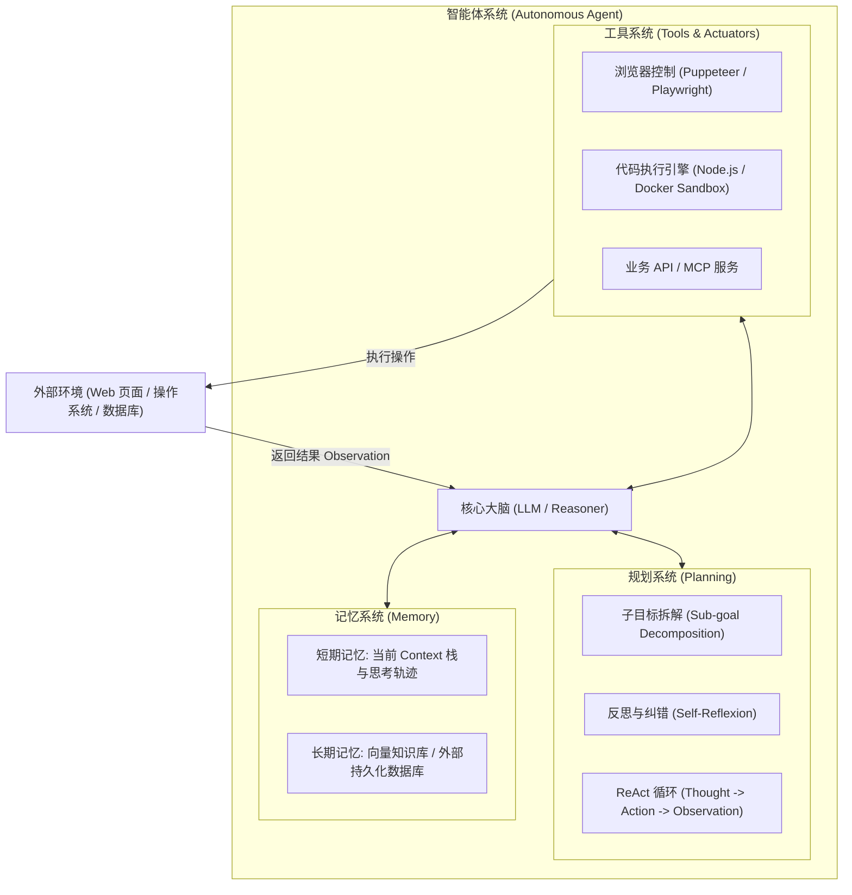
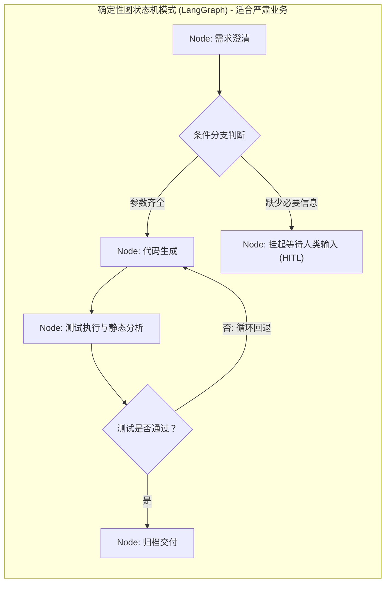
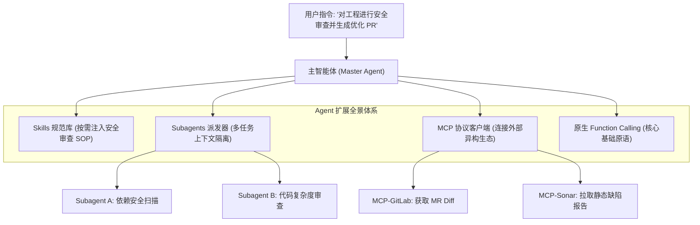
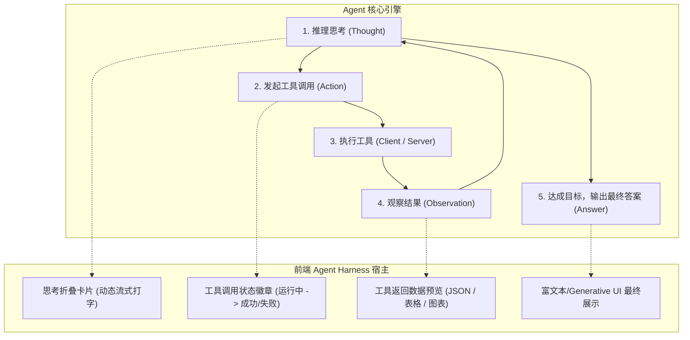
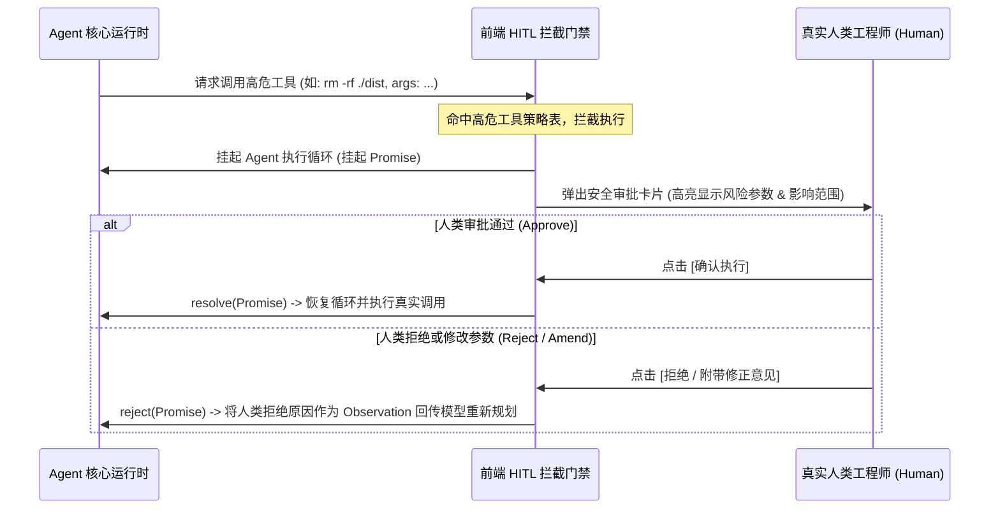
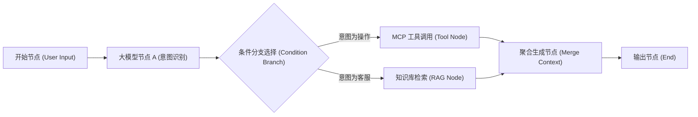

# 智能体工程与前端载体 (Agent Engineering & Frontend Harness)✅

本模块系统性梳理大模型智能体（Agent）在前端与全栈领域的全套工业级技能栈：Agent 四大核心要素、业界主流 Agent 框架与产品横向选型对比、扩展手段（Tools、MCP、Skills、Subagents）、前端 Agent Harness 宿主与思考链可视化、Human-in-the-Loop (HITL) 授权门禁，以及大型可视化 DAG 工作流编排画布。

---

## 什么是智能体（Agent）？Agent 的四大核心要素（LLM 大脑、规划 Planning、记忆 Memory、工具 Tools）是什么？ {#p0-what-is-agent-core-elements}

<Answer>

**核心结论:**

在现代 AI 工程体系中，**智能体（Autonomous Agent）是基于大语言模型作为核心控制器、具备感知环境、自主规划目标、调用工具行动并根据反馈持续迭代的自主计算系统**。

传统的大模型交互是“一问一答的被动生成（Passive Completion）”，而 Agent 则是“自主达成目标的闭环行动（Goal-Driven Autonomous Action）”。现代 Agent 架构公认由**四大核心要素（Four Pillars）**构成：
1. **大脑（Brain / LLM）**：负责全局语义理解、意图识别、复杂推理与下一步行动决断的核心大模型；
2. **规划系统（Planning）**：将复杂总目标分解为可执行子任务链的能力（如 Sub-goal Decomposition、ReAct 思考-行动-观察循环、反思与自我纠错 Reflexion）；
3. **记忆系统（Memory）**：涵盖会话短期工作记忆（Short-term Working Memory）与外部向量库/知识图谱长期记忆（Long-term Episodic Memory）；
4. **工具体系（Tools / Actuators）**：Agent 与物理世界及业务系统交互的“手和脚”（如浏览器控制、文件读写、API 请求、代码执行沙箱）。

---

**原理解析:**

**1. 智能体经典认知架构模型（Lilian Weng 经典拓扑）**



---

**规范代码实现:**

在 TypeScript 中定义标准工业级 Agent 认知状态机构型：

```typescript
// types/agent-architecture.ts
export interface AgentMemory {
  shortTermHistory: Array<{ role: 'user' | 'assistant' | 'tool'; content: string }>;
  workingScratchpad: string; // 当前推理草稿纸
  queryLongTermMemory: (query: string) => Promise<string[]>;
}

export interface AgentTool {
  name: string;
  description: string;
  parametersSchema: Record<string, unknown>; // JSON Schema
  execute: (args: Record<string, unknown>) => Promise<unknown>;
}

export interface AgentAction {
  toolName: string;
  args: Record<string, unknown>;
  thought: string;
}

export interface AgentStepResult {
  thought: string;
  action?: AgentAction;
  observation?: unknown;
  finalAnswer?: string;
  isComplete: boolean;
}
```

---

**面试官视角:**

**考察意图:**
评估候选人是否理解从“Chat Completion”向“Agent”演进的范式转移。能够清晰背书 Agent 四大要素并指出每个要素在工程实现中的卡点（如 Planning 的死循环、Memory 的窗口超限、Tools 的执行超时），展现出成熟的系统性架构视野。

**深度追问链:**
1. **追问 1**: 在规划（Planning）过程中，如果大模型陷入了反复调用同一个失败工具的死循环，架构上如何防范？
   - *答题切入点*: 引入最大重试步数（`maxSteps` 阈值熔断）、循环调用指纹检测（Hash 检查连续 N 次调用的 Tool+Args 是否完全相同）、引入批评者（Critic / Evaluator）自我反思机制，强制模型重新规划路线。

---

**延伸阅读:**
- [Lilian Weng: LLM Powered Autonomous Agents (OpenAI 经典博客)](https://lilianweng.github.io/posts/2023-06-23-agent/)
- [ReAct: Synergizing Reasoning and Acting in Language Models (Yao et al., 2022)](https://arxiv.org/abs/2210.03629)

</Answer>

---

## 业界主流的 Agent 产品与框架有哪些（Cursor / Claude Code / AutoGen / LangGraph / CrewAI）？它们的架构选型与适用场景是什么？ {#p0-mainstream-agents-comparison}

<Answer>

**核心结论:**

随着 Agent 技术的爆发，业界在**“编码助手垂直 Agent（Vertical Coding Agents）”**与**“通用应用编排框架（General Orchestration Frameworks）”**两个阵营涌现出代表性方案。前端与全栈架构师必须根据业务复杂度与控制力需求精准选型：
- **编码与生产力 Agent（端到端产品级）**：
  - **Cursor**：深度结合 VS Code 客户端 Fork 与本地 LSP（Language Server Protocol），将代码库 AST 索引、本地向量检索与模型推理极致融合，擅长即时上下文补全与多文件原子编辑；
  - **Claude Code (Anthropic)**：以命令行终端（CLI / REPL）为载体、以系统原生工具（Bash、Read/Write、Grep）为原语的极简自主代理，采用无虚拟层的宿主系统直接交互，代表了“Bash is all you need”的强效能终端哲学；
- **Agent 开发与编排框架（底层 SDK 级）**：
  - **LangGraph (LangChain 体系)**：基于**有向图（Graph）、循环状态机（StateGraph）与持久化检查点（Checkpointer）**设计，支持人类在环（HITL）与时光旅行，是目前构建复杂确定性生产 Agent 的事实标准；
  - **AutoGen (Microsoft)**：以**多智能体对话（Multi-Agent Conversation）与角色扮演（Role-Playing）**为核心哲学，擅长头脑风暴、代码生成与交叉评审；
  - **CrewAI**：基于任务分工角色扮演的高层封装框架，上手极快，适合轻量级任务流自动化。

---

**原理解析:**

**1. 主流 Agent 框架与产品核心架构选型全景矩阵**

| 框架 / 产品 | 核心设计哲学 | 控制流模型 | 状态持久化机制 | 前端结合度与适用场景 |
| :--- | :--- | :--- | :--- | :--- |
| **LangGraph** | 图与状态机 (Cycles & Branches) | 显式有向图 (StateGraph)，支持条件分支与并发 | 原生 Checkpointer 数据库，支持时光旅行 | **极高**。前端可直接将 Graph 状态映射为可视化画布与分支状态机 |
| **AutoGen** | 多智能体对话总线 (Conversational) | 隐式对话传递 (GroupChat / RoundRobin) | 会话消息日志持久化 | **中**。适合多模型会话互审，但复杂分支确定性控制力较弱 |
| **CrewAI** | 职能团队分工 (Role / Crew / Process) | 顺序式或层次式任务分派 (Sequential / Hierarchical) | 内存状态与简单 Hook | **中**。快速搭建概念验证（PoC）与固定业务审批流 |
| **Claude Code** | 终端极简原生行动 (CLI / Bash Native) | Agentic Loop + 原生系统工具执行 | 会话上下文文件日志 | **极高 (研发效能)**。前端工程资产化（Skills/Commands）与 CLI 自动化演进标杆 |
| **Cursor** | IDE 深度集成 (LSP + AST + Context) | 混合式 Agent (Tab 补全 + Composer 多文件) | 本地 SQLite 向量与文件快照 | **极高 (开发者体验)**。前端业务代码实时编写与架构重构 |

**2. 状态机图驱动 (LangGraph) vs 自由多智能体对话 (AutoGen)**



---

**规范代码实现:**

在 TypeScript 中展示如何借鉴 LangGraph 的状态图思想，实现一个具备确定性状态流转与检查点回滚的极简图执行引擎：

```typescript
// engine/state-graph.ts
export interface GraphState {
  messages: Array<{ role: string; content: string }>;
  currentStep: string;
  retryCount: number;
  isCompleted: boolean;
}

export type StateNodeHandler = (state: GraphState) => Promise<Partial<GraphState>>;

export class MinimalStateGraph {
  private nodes: Map<string, StateNodeHandler> = new Map();
  private edges: Map<string, (state: GraphState) => string> = new Map();
  private entryPoint: string = '';

  public addNode(name: string, handler: StateNodeHandler): this {
    this.nodes.set(name, handler);
    return this;
  }

  public addConditionalEdge(fromNode: string, router: (state: GraphState) => string): this {
    this.edges.set(fromNode, router);
    return this;
  }

  public setEntryPoint(nodeName: string): this {
    this.entryPoint = nodeName;
    return this;
  }

  public async run(initialState: GraphState): Promise<GraphState> {
    let state = { ...initialState };
    let currentNode = this.entryPoint;

    while (currentNode && !state.isCompleted) {
      console.log(`[StateGraph] 执行节点: ${currentNode}`);
      const handler = this.nodes.get(currentNode);
      if (!handler) break;

      const patch = await handler(state);
      state = { ...state, ...patch, currentStep: currentNode };

      const router = this.edges.get(currentNode);
      if (!router) break;
      currentNode = router(state);
    }

    return state;
  }
}
```

---

**面试官视角:**

**考察意图:**
评估应试者是否真正沉浸在当前大模型前沿技术生态中。初级应聘者仅知道“调用 ChatGPT 写个 prompt”，而高级架构师能够清晰对比不同 Agent 框架的设计哲学（图状态机 vs 多角色对话），并能为企业选择最合适的技术路线。

**深度追问链:**
1. **追问 1**: 为什么在严肃企业生产场景（如银行审批、工单流转）中，工业界更推崇 LangGraph 这种图状态机，而不是让多个 Agent 自由自由对话的 AutoGen？
   - *答题切入点*: 自由多智能体对话存在“不可控的死循环、话题漂移、执行路径不可预测”的严重风险；而 LangGraph 提供了明确的状态转换约束、检查点持久化、确定性回滚以及严格的条件判断，符合企业软件高可靠、可审计的合规要求。

---

**延伸阅读:**
- [LangChain: LangGraph Documentation](https://langchain-ai.github.io/langgraph/)
- [Microsoft AutoGen: Multi-agent Conversation Framework](https://microsoft.github.io/autogen/)
- [Anthropic: Claude Code Architecture & Philosophy](https://docs.anthropic.com/en/docs/claude-code)

</Answer>

---

## Agent 主要的扩展手段有哪些？除了 Function Calling / Tool Use，MCP 协议、Skills 机制与 Subagent 多智能体协作是如何扩展 Agent 能力的？ {#p0-agent-extension-mechanisms}

<Answer>

**核心结论:**

大语言模型的能力边界受限于其预训练权重中的静态参数知识。为了让 Agent 能够操作企业内部系统、调用私有 API、甚至自我进化，业界发展出了四大层次分明的**Agent 扩展手段（Extension Mechanisms）**：
1. **第一代基石扩展：Function Calling / Tool Use（单点工具调用）**：
   - 开发者在请求中提供工具的 JSON Schema，模型根据意图决定调用哪个函数并返回结构化参数；本质是**点对点的硬编码接入**，新增工具必须修改客户端代码；
2. **协议化生态扩展：Model Context Protocol (MCP，模型上下文协议)**：
   - Anthropic 推出的开放标准。将工具（Tools）、数据源（Resources）和提示词模板（Prompts）抽象为跨语言、跨进程的标准化 Client-Server 协议，实现**工具解耦与即插即用（USB-C 标准）**；
3. **经验与规约沉淀：Skills 机制（技能化演进）**：
   - 将专业领域工作流规范、排查步骤、前置依赖与最佳实践以结构化文档或脚本集合封装（如 `SKILL.md` + 辅助脚本）；Agent 按需加载技能，避免将所有 Prompt 塞入上下文导致注意力崩溃；
4. **横向能力倍增：Subagents 多智能体编排协作（Multi-Agent System）**：
   - 主智能体（Parent Agent）作为指挥官，将复杂任务拆解并派发给专注垂直领域的子智能体（如 Research Agent、Code Review Agent），子智能体独立运行并只汇报最终结论，实现**上下文窗口物理隔离与算力并发**。

---

**原理解析:**

**1. 四大 Agent 扩展机制演进对比矩阵**

| 扩展机制 | 耦合度 | 上下文消耗 | 动态扩展能力 | 核心适用场景 |
| :--- | :--- | :--- | :--- | :--- |
| **Function Calling** | 强耦合（客户端硬编码工具定义） | 随工具数量线性暴增 | 差（需发版修改调用代码） | 单一系统内部 2~5 个高频核心业务 API |
| **MCP 协议** | **完全解耦（标准化 Client-Server RPC）** | 支持动态发现与按需挂载 | **极高（配置 JSON 即可接入第三方工具）** | 跨部门系统互联、IDE 与桌面端工具打通 |
| **Skills 机制** | 低耦合（轻量文本元数据索引） | 渐进式披露（按需检索加载正文） | 高（只需添加规范 Markdown/脚本） | 沉淀工程经验、特定库最佳实践、复杂排错 SOP |
| **Subagents 编排** | 完全隔离（独立会话上下文） | **零污染（子 Agent 上下文独立闭环）** | 极高（可并发分发、递归派生） | 复杂大型工程战役、跨模块并行重构、深度调研 |

**2. 四大扩展机制协同工作全景拓扑**



---

**规范代码实现:**

在 TypeScript 中实现支持 Skills 按需加载与 Subagent 上下文隔离派发的模块化 Agent 扩展调度器：

```typescript
// core/agent-extension-dispatcher.ts
export interface AgentSkill {
  name: string;
  description: string;
  loadInstruction: () => Promise<string>;
}

export interface SubagentConfig {
  role: string;
  prompt: string;
  tools: string[];
}

export class AgentExtensionDispatcher {
  private skills: Map<string, AgentSkill> = new Map();

  public registerSkill(skill: AgentSkill): void {
    this.skills.set(skill.name, skill);
  }

  // 1. 技能渐进式披露：主 Agent 仅需在 Prompt 里注入技能清单与一句话描述
  public getSkillsIndexPrompt(): string {
    const list = Array.from(this.skills.values())
      .map(s => `- ${s.name}: ${s.description}`)
      .join('\n');
    return `当前可用专业技能库 (根据任务需要可申请加载具体技能):\n${list}`;
  }

  // 2. 派发隔离的子智能体执行 (Subagent Context Isolation)
  public async dispatchSubagent(config: SubagentConfig): Promise<string> {
    console.log(`[Subagent] 派发独立工作单元: ${config.role}`);
    // 独立实例化一个没有历史杂质的新会话上下文
    const isolatedMessages = [
      { role: 'system', content: `你是 ${config.role}。独立专注完成以下任务，只输出最终结论。` },
      { role: 'user', content: config.prompt }
    ];
    
    // 执行完成后销毁中间状态，只将最终结果作为 Observation 汇入主 Agent
    const result = await fakeExecuteLlm(isolatedMessages);
    return `[Subagent: ${config.role} 报告]: ${result}`;
  }
}

async function fakeExecuteLlm(messages: any[]): Promise<string> {
  return '子任务执行完毕，无安全隐患。';
}
```

---

**面试官视角:**

**考察意图:**
评估候选人对构建复杂 Agent 系统的扩展能力与演化路径认知。只有做过真实复杂 Agent 的工程师，才深刻明白把几十个工具硬编码进 System Prompt 会导致注意力彻底崩溃，必须依靠“MCP 协议标准接入 + Skills 渐进披露 + Subagent 物理隔离”来实现大规模工业落地。

**深度追问链:**
1. **追问 1**: 为什么在长周期开发任务中，单 Agent 往往越做越慢甚至胡言乱语，而采用 Subagent 派发后成功率大幅提高？
   - *答题切入点*: 单 Agent 随着任务推进，历史日志中充斥着海量的中间输出与工具错误，上下文被大量噪声污染（Context Rotting）；Subagent 独立开辟干净的上下文执行专注子任务，完成后只回传高密度的结构化总结，彻底保护了主 Agent 的注意力黄金带宽。

---

**延伸阅读:**
- [Anthropic: Model Context Protocol (MCP) Official Spec](https://modelcontextprotocol.io/)
- [OpenAI: Swarm & Multi-Agent Orchestration Patterns](https://github.com/openai/swarm)

</Answer>

---

## 前端如何架构大模型 Agent 交互界面（Agent Harness）？ReAct 规划决策轨迹与思考链流式可视化？ {#p0-agent-frontend-harness}

<Answer>

**核心结论:**

在现代 AI 应用中，前端不再是一个简单的聊天窗口，而是**智能体（Agent）运行与人机协作的物理宿主环境（Agent Harness）**。

前端承接 Agent 交互必须解决三大核心诉求：
1. **ReAct 认知生命周期状态机（Reasoning and Acting State Machine）**：精确建模并流式响应 Agent 的思考（Thought）、行动（Action/Tool Call）、观察（Observation/Tool Result）与终态输出（Answer）；
2. **思考链（Chain-of-Thought）与工具调用的防抖排版与折叠**：区分“面向机器的中间思考/工具日志”与“面向用户的最终交互内容”；默认将推理链与工具调用折叠为紧凑卡片，支持用户展开查看细节；
3. **全双工事件驱动总线**：通过标准化协议事件（如 `thought_delta`、`tool_call_start`、`tool_result`）驱动视图细粒度增量更新，杜绝全屏刷新。

---

**原理解析:**

**1. ReAct 决策循环与前端视图状态流转**



---

**规范代码实现:**

在 TypeScript/React 中实现标准 ReAct 轨迹时间轴组件，支持流式思考与工具结果插槽展示：

```typescript
// components/agent-trajectory-viewer.tsx
import React, { FC, useState } from 'react';

export interface TrajectoryStep {
  id: string;
  thought?: string;
  toolCall?: {
    name: string;
    args: Record<string, unknown>;
    status: 'running' | 'success' | 'failed';
    result?: unknown;
  };
  answer?: string;
}

export const AgentTrajectoryViewer: FC<{ steps: TrajectoryStep[] }> = ({ steps }) => {
  const [expandedIds, setExpandedIds] = useState<Record<string, boolean>>({});

  const toggleExpand = (id: string) => {
    setExpandedIds(prev => ({ ...prev, [id]: !prev[id] }));
  };

  return (
    <div className="agent-harness-timeline space-y-4 p-4">
      {steps.map((step, idx) => (
        <div key={step.id} className="border-l-2 border-indigo-500 pl-4 space-y-2">
          {/* 1. 思考链展示 */}
          {step.thought && (
            <div className="text-sm text-gray-500 italic bg-gray-50 p-2 rounded">
              <span className="font-semibold text-indigo-600 mr-2">💭 思考 #{idx + 1}:</span>
              {step.thought}
            </div>
          )}

          {/* 2. 工具调用轨迹与状态徽章 */}
          {step.toolCall && (
            <div className="tool-call-box p-3 bg-white border rounded shadow-sm">
              <div className="flex items-center justify-between cursor-pointer" onClick={() => toggleExpand(step.id)}>
                <span className="font-mono text-sm font-bold text-gray-800">
                  🛠️ 工具调用: {step.toolCall.name}
                </span>
                <span className={`text-xs px-2 py-1 rounded font-bold ${
                  step.toolCall.status === 'running' ? 'bg-blue-100 text-blue-700 animate-pulse' :
                  step.toolCall.status === 'success' ? 'bg-green-100 text-green-700' : 'bg-red-100 text-red-700'
                }`}>
                  {step.toolCall.status}
                </span>
              </div>

              {expandedIds[step.id] && (
                <div className="mt-2 space-y-2 text-xs font-mono">
                  <pre className="bg-gray-100 p-2 rounded overflow-x-auto">
                    参数: {JSON.stringify(step.toolCall.args, null, 2)}
                  </pre>
                  {step.toolCall.result && (
                    <pre className="bg-emerald-50 p-2 rounded text-emerald-800 overflow-x-auto">
                      返回值: {JSON.stringify(step.toolCall.result, null, 2)}
                    </pre>
                  )}
                </div>
              )}
            </div>
          )}

          {/* 3. 最终答案输出 */}
          {step.answer && (
            <div className="final-answer text-gray-900 bg-emerald-50 p-4 border border-emerald-200 rounded">
              {step.answer}
            </div>
          )}
        </div>
      ))}
    </div>
  );
};
```

---

**面试官视角:**

**考察意图:**
评估候选人设计复杂人机协作界面的架构功底。许多开发者停留在“聊天对话框”级别，缺乏处理长时间运行（几十步工具调用）、中间执行失败重试、中间过程排版折叠的工业级 Agent 前端架构能力。

**深度追问链:**
1. **追问 1**: 在 Agent 执行了 20 步工具调用、生成了极其冗长的 DOM 节点时，前端如何保证页面滚动和性能不卡顿？
   - *答题切入点*: 采用虚拟列表（Virtual List / React Window）对历史步骤按窗口渲染；已完成的历史步骤仅保留折叠概要，展开时动态加载；将工具调用的高频 JSON 解码与状态计算放入 Web Worker。

---

**延伸阅读:**
- [Vercel AI SDK: Tool Calling & UI Components](https://sdk.vercel.ai/docs/ai-sdk-ui/chatbot-tool-usage)
- [Anthropic: Building Systems with Claude (Agent Pattern)](https://www.anthropic.com/research/building-effective-agents)

</Answer>

---

## Agent 执行高风险工具（如删除文件、对外转账）时，前端如何设计 Human-in-the-Loop (HITL) 动态授权拦截门禁？ {#p0-agent-hitl-guardrail}

<Answer>

**核心结论:**

在智能体拥有执行真实操作权限的时代，**人类在环（Human-in-the-Loop, HITL）是防止大模型发生灾难性破坏、确保企业资产安全的生死底线**。

当 Agent 意图执行可能造成不可逆破坏的危险工具（如 `delete_database_records`、`execute_shell_rm`、`transfer_funds`）时，前端与运行时架构必须实施**异步授权拦截门禁（Asynchronous Action Interceptor）**：
1. **工具风险等级分级矩阵（Risk Tiering）**：分为只读级（Safe Read，免审批自动执行）、普通写（Low-Risk Write，被动记录日志）与高危破坏级（High-Risk Mutating，强制挂起审批）；
2. **基于 Promise 控制反转的状态机挂起（Suspension via Inverted Promise）**：Agent 循环在触发高危工具时立即暂停推理，向前端派发 `awaiting_approval` 事件并呈现实时差异对比（Diff）与操作上下文；
3. **超时保护与上下文隔离**：若用户超过限定时间未批准，默认触发超时拒绝（Safe Default: Reject on Timeout），防止模型上下文无限期挂起引发连接泄漏。

---

**原理解析:**

**1. HITL 动态授权时序与控制反转流**



---

**规范代码实现:**

在 TypeScript 中实现可取消、带超时熔断的通用 Human-in-the-Loop 异步安全拦截器：

```typescript
// security/hitl-interceptor.ts
export interface DangerousActionRequest {
  id: string;
  toolName: string;
  parameters: Record<string, unknown>;
  dangerLevel: 'CRITICAL' | 'HIGH';
  description: string;
}

export type ApprovalDecision = 
  | { approved: true; modifiedParams?: Record<string, unknown> }
  | { approved: false; reason: string };

export class HitlActionInterceptor {
  private pendingResolvers: Map<string, (decision: ApprovalDecision) => void> = new Map();
  private readonly defaultTimeoutMs = 120000; // 2 分钟未响应自动拒绝

  // 1. Agent 引擎调用此方法：若为高危操作则异步挂起，等待前端用户点击
  public async interceptAction(request: DangerousActionRequest): Promise<ApprovalDecision> {
    return new Promise<ApprovalDecision>((resolve) => {
      // 超时安全兜底：防止悬挂
      const timer = setTimeout(() => {
        if (this.pendingResolvers.has(request.id)) {
          this.pendingResolvers.delete(request.id);
          resolve({ approved: false, reason: '用户审批超时，系统已自动拦截操作' });
        }
      }, this.defaultTimeoutMs);

      this.pendingResolvers.set(request.id, (decision) => {
        clearTimeout(timer);
        resolve(decision);
      });

      // 触发前端 UI 弹窗挂起
      window.dispatchEvent(new CustomEvent('ai:hitl_requested', { detail: request }));
    });
  }

  // 2. 前端弹窗组件中的“同意/拒绝”按钮回调此方法
  public submitDecision(requestId: string, decision: ApprovalDecision): void {
    const resolver = this.pendingResolvers.get(requestId);
    if (resolver) {
      resolver(decision);
      this.pendingResolvers.delete(requestId);
    }
  }
}
```

---

**面试官视角:**

**考察意图:**
评估候选人对企业级安全生产与权限控制的敬畏之心。让大模型直接在生产环境“跑命令、改数据”是极不负责的架构设计；懂得使用 HITL 门禁、风险分级、超时自动熔断的工程师才具备主导企业核心系统的资质。

**深度追问链:**
1. **追问 1**: 用户点击“拒绝”后，如何把拒绝理由传回给大模型，让大模型不报错并懂得“换一种方式实现”？
   - *答题切入点*: 将拦截视为一次特殊的工具执行结果（Tool Result），内容为“操作已被操作员拒绝，理由是：权限不足，请采用只读方案重新规划”，大模型读取此 Observation 后会自动进入下一次 ReAct 思考，实现业务优雅自愈。

---

**延伸阅读:**
- [LangChain: Human-in-the-loop with LangGraph](https://langchain-ai.github.io/langgraph/how-tos/human-in-the-loop/)
- [OWASP Top 10 for Large Language Model Applications: Excessive Agency](https://owasp.org/www-project-top-10-for-large-language-model-applications/)

</Answer>

---

## 如何设计类似 Dify / Coze 的可视化 DAG 工作流编排画布？拓扑排序与流式执行调试如何落地？ {#p0-ai-workflow-dag-canvas}

<Answer>

**核心结论:**

在复杂大模型与自主智能体（Agent）产品中，**基于有向无环图（DAG, Directed Acyclic Graph）的可视化工作流编排画布（如 Dify、Coze、LangFlow）已成为取代单一聊天框的战略级交互形态**：
- **混合渲染架构**：千万级坐标系与视口平移缩放（Pan & Zoom）下，纯 DOM/React 组件会导致严重重绘重排；工业界采用**“底层 Canvas / SVG 绘制连线与网格背景 + 顶层 HTML/DOM 挂载交互节点（Node UI）”的混合分层架构**，兼顾渲染性能与表单交互能力；
- **确定性执行调度（Topological Scheduling）**：编排数据结构本质是邻接表（Adjacency List）；执行前必须通过 **Kahn 算法或深度优先搜索（DFS）进行环路检测与拓扑排序**，确保上游依赖节点先于下游节点执行；
- **分步流式观察与断点调试**：每个工作流节点作为独立的有限状态机（`idle | running | streaming | success | failed`），支持流式 Token 实时打字输出与局部单步重试（In-place Retry）。

---

**原理解析:**

**1. DAG 工作流节点依赖拓扑与执行生命周期**



---

**规范代码实现:**

在 TypeScript 中实现工业级 DAG 拓扑排序算法与依赖环路检测引擎：

```typescript
// engine/dag-scheduler.ts
export interface WorkflowNode {
  id: string;
  name: string;
  execute: (inputs: Record<string, unknown>) => Promise<Record<string, unknown>>;
}

export interface WorkflowEdge {
  from: string; // 上游节点 ID
  to: string;   // 下游节点 ID
}

export class DagWorkflowEngine {
  // Kahn 算法拓扑排序与有向环检测
  public static getExecutionPlan(nodes: WorkflowNode[], edges: WorkflowEdge[]): string[][] {
    const inDegree = new Map<string, number>();
    const graph = new Map<string, string[]>();

    nodes.forEach(n => {
      inDegree.set(n.id, 0);
      graph.set(n.id, []);
    });

    edges.forEach(e => {
      inDegree.set(e.to, (inDegree.get(e.to) || 0) + 1);
      graph.get(e.from)!.push(e.to);
    });

    const executionStages: string[][] = [];
    let readyNodes = nodes.filter(n => inDegree.get(n.id) === 0).map(n => n.id);

    let visitedCount = 0;

    while (readyNodes.length > 0) {
      executionStages.push([...readyNodes]);
      visitedCount += readyNodes.length;

      const nextBatch: string[] = [];
      for (const nodeId of readyNodes) {
        for (const neighbor of graph.get(nodeId) || []) {
          const currentDeg = inDegree.get(neighbor)! - 1;
          inDegree.set(neighbor, currentDeg);
          if (currentDeg === 0) {
            nextBatch.push(neighbor);
          }
        }
      }
      readyNodes = nextBatch;
    }

    if (visitedCount !== nodes.length) {
      throw new Error('[DAG-Scheduler] 流程图存在循环依赖环路（Cycle detected），无法执行！');
    }

    return executionStages;
  }
}
```

---

**面试官视角:**

**考察意图:**
评估应试者是否具备大型图形学、复合数据流引擎与前端高性能可视化的跨界实战力。在大模型时代，AI 应用工程师如果不仅会做 Chat，还能独立架构 DAG 工作流画布与调度器，是极具溢价的核心竞争力。

**深度追问链:**
1. **追问 1**: 在节点并发合流场景（如两个平行分支同时输出结果输入给下一个节点），状态如何在前端实时汇聚并保证流式渲染？
   - *答题切入点*: 采用集中式状态总线（Node Output Bus），下游节点通过响应式监听器等待所有前置依赖的 `status === 'success'`，当所有上游就绪后自动启动触发，数据通过输入映射管道精准注入。

---

**延伸阅读:**
- [React Flow: Building Node-Based UIs](https://reactflow.dev/)
- [Dify: Open-Source LLM App Development Platform](https://dify.ai/)

</Answer>
