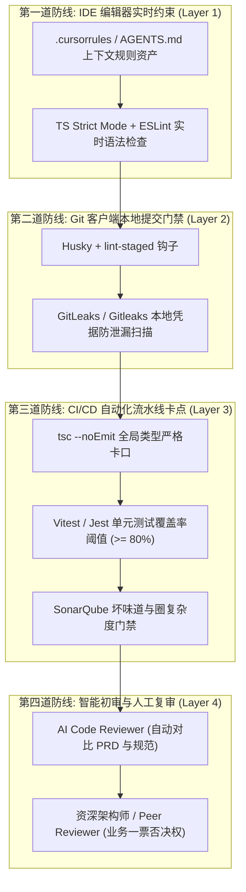
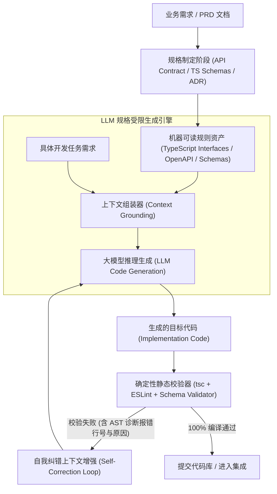
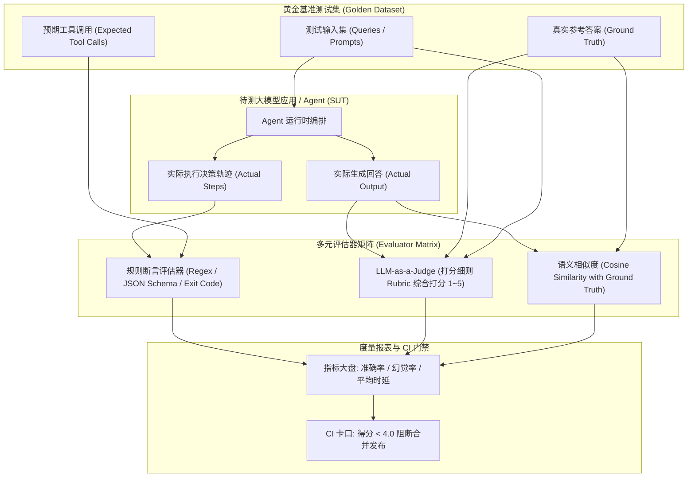

# 工程化质量门禁与评测体系 (Engineering Quality Gate & Eval)✅

本模块涵盖团队规模化引入 Cursor / Copilot / Claude Code 等 AI 编程助手后的四层质量门禁体系与防幻觉工程防护、规格驱动开发（Spec-Driven Development, SDD）与规则资产库架构，以及大模型应用与自主 Agent 的自动化量化评测（Eval）体系设计。

---

## 团队引入 Cursor / Copilot / Claude Code 后，如何建立代码质量门禁（Quality Gate）与防范幻觉？ {#p0-ai-coding-quality-gate}

<Answer>

**核心结论:**

在研发团队全员引入 Cursor、Copilot、Claude Code 等 AI 编程助手后，虽然整体代码产出速度提升了 30%~50%，但同时也引入了**三大隐蔽工程风险**：
1. **API 虚构与幻觉（Hallucination）**：模型频繁使用已被废弃（Deprecated）或凭空捏造的私有方法；
2. **代码风格与架构模式漂移**：缺少全局架构感知的碎片化生成导致圈复杂度飙升、类型注解退化为 `any`；
3. **安全漏洞与凭证泄露**：模型在补全时可能引入未校验的输入注入漏洞，甚至误将开发者的本地 Token 写入代码；
因此，**建立一套端到端的四层质量纵深防御门禁（Quality Gate）是防止代码库快速腐化的关键护城河**。

---

**原理解析:**

**1. AI 编程代码质量四层纵深防御拓扑**



**2. 核心防御机制拆解**

- **Layer 1: IDE 实时约束与上下文供给**：
  - 在项目根目录维护 `.cursorrules`、`CLAUDE.md` 或统一的 Agent 规则清单，明确规定技术栈版本（如 Vue 3.5 / React 19 / Vite 8）、禁止使用的库（如禁用 Moment.js）、代码结构规范。从源头缩小大模型的采样空间，抑制幻觉产生；
- **Layer 2: Git Hook 增量安全卡口**：
  - 通过 `lint-staged` 对暂存区变更文件执行严格类型检查与 ESLint 校验；同时引入开源工具（如 `gitleaks`）拦截任何匹配 AWS Key、OpenAI Token、私钥特征的文本提交；
- **Layer 3: CI/CD 绝对确定性自动化卡点**：
  - 大模型生成的单元测试常常存在“为了通过测试而伪造断言（Trivial Assertions）”的欺骗行为。CI 流水线必须执行真实的突变测试（Mutation Testing）并设置刚性代码覆盖率阈值（如核心业务行覆盖率必须大于等于 80%）；若未通过，直接阻断合并权限；
- **Layer 4: AI 初审 + 人工关键决策**：
  - 接入自动化 AI Review 机器人（如 CodeRabbit、GitHub Copilot PR Reviewer），在 PR 提交后 30 秒内完成常规排版、潜在边界溢出初筛；人类工程师将精力聚焦于核心业务逻辑与数据流向设计。

---

**规范代码实现:**

以下为生产级规范中，集成在 GitHub Actions 中的 AI 代码质量防幻觉门禁自动化工作流：

```yaml
# .github/workflows/ai-quality-gate.yml
name: AI Code Quality Gate

on:
  pull_request:
    branches: [main, master, develop]

jobs:
  quality-gate:
    name: 质量门禁检查
    runs-on: ubuntu-latest
    steps:
      - name: 检出代码
        uses: actions/checkout@v4
        with:
          fetch-depth: 0

      - name: 配置 pnpm 环境
        uses: pnpm/action-setup@v3
        with:
          version: 9

      - name: 安装 Node.js
        uses: actions/setup-node@v4
        with:
          node-version: 22
          cache: 'pnpm'

      - name: 安装项目依赖
        run: pnpm install --frozen-lockfile

      - name: 1. 凭证与敏感信息扫描 (防误传 Token)
        uses: gitleaks/gitleaks-action@v2
        env:
          GITHUB_TOKEN: ${{ secrets.GITHUB_TOKEN }}

      - name: 2. 全局严格类型检查 (防虚构类型与 API 幻觉)
        run: pnpm run typecheck

      - name: 3. 静态代码分析与架构规则约束
        run: pnpm run lint

      - name: 4. 自动化单元测试与覆盖率硬性卡口
        run: |
          pnpm run test:coverage --coverage.thresholds.lines=80 --coverage.thresholds.functions=80
```

---

**面试官视角:**

- **考察深度**:
  1. 候选人是否具备研发团队工程治理（Engineering Governance）大局观，是否意识到 AI 研发效能提升背后的隐性维护成本；
  2. 能否指出 AI 生成代码最典型的隐蔽缺陷（如浮点数边界未保护、时间日期跨时区计算错误、假单元测试）；
  3. 对企业级 CI/CD 流水线设计与自动化质量卡口的实战落地经验。
- **下探追问链**:
  - *追问 1*：很多开发者习惯让 AI“帮我给这段代码写单测”，AI 常常顺应错误逻辑反向写出全绿的单测，团队如何防范这种“自我证明的虚假单测”？
  - *追问 2*：如果大模型生成的新代码大量使用了外部第三方库，如何从安全合规角度防范恶意依赖抢注（Dependency Confusion / Typosquatting）攻击？

---

**延伸阅读:**

- ThoughtWorks Technology Radar: Mitigating Risks of AI-Generated Code
- OWASP Top 10 for Large Language Model Applications (LLM02: Sensitive Information Disclosure)
- GitLeaks: Automated Secret Scanning in Developer Pipelines
</Answer>

---

## 什么是 Spec-Driven Development (SDD)？如何通过规则资产库约束大模型生成符合架构的代码？ {#p0-spec-driven-development}

<Answer>

**核心结论:**

**Spec-Driven Development（SDD，规格驱动开发）** 是企业级研发团队让大模型从“非确定性概率生成玩具”演变为“生产级工业软件工程”的核心范式跃迁：
- **从 Prompt Engineering 到 Spec Enforcement**：口头或自然语言提示词（Prompt）具有天然的歧义性与不稳定性；SDD 强调**契约与规格先行**——在让大模型编写一行业务实现代码之前，必须先确立严谨完备的机器可读规格（OpenAPI 规范、TypeScript 类型契约、JSON Schema、设计系统 Token、ADR 架构决策记录）；
- **系统上下文强注入（Context Grounding）**：将这些 Spec 转换为标准化的结构化规则资产（Rules / Schemas），在调用大模型时作为 System Context 强约束其自由度，使模型只能在既定的类型边界与接口定义内“做填空题”；
- **自闭环纠错（Self-Correction Loop）**：若模型生成代码违反 Spec，编译器与类型检查器输出的精准报错信息直接作为反馈注入下一轮推理，直至 100% 满足规格才被接纳。

---

**原理解析:**

**1. 规格驱动开发（SDD）自闭环生成架构**



**2. 企业级规则资产库（Rules Asset Hub）三层拓扑**

1. **底层平台基线（Platform Baseline）**：
   - 全局编码规范、安全基线、性能门槛、禁用的旧 API 映射表（如全局禁止使用 `localStorage` 存敏感数据，必须走统一加密存储服务）；
2. **领域架构契约（Domain Architecture Contracts）**：
   - 包含业务领域核心 Entity、聚合根类型定义、全局错误码枚举。大模型生成代码必须直接 `import` 权威契约，不允许在业务组件中私自 duplicate 类型；
3. **任务级执行清单（Task-Level Execution Plan）**：
   - 将大型任务分解为有序细粒度的步骤清单（Checklist），每一步要求模型仅修改指定文件并产出对应验证指令，杜绝模型产生“大跨步幻觉”。

---

**规范代码实现:**

以下为生产级架构中，基于 TypeScript 实现的自动化“规格校验-自我纠错”执行器核心：

```typescript
// sdd/self-correction-runner.ts
import { exec } from 'node:child_process';
import { promisify } from 'node:util';

const execAsync = promisify(exec);

export interface GenerationTask {
  taskId: string;
  specFiles: string[]; // 权威接口契约文件路径
  targetFile: string;
  prompt: string;
}

export class SpecDrivenCodeGenerator {
  private maxRetries = 3;

  // 1. 模拟调用 LLM (实际调用 Claude / GPT-4o / 本地模型)
  private async callLlm(prompt: string, errorContext?: string): Promise<string> {
    let finalPrompt = prompt;
    if (errorContext) {
      finalPrompt += `

【上轮生成代码静态类型校验失败，请针对以下报错精准修复，严禁变更接口契约】:
${errorContext}`;
    }
    // 返回模型生成的代码内容...
    return `// LLM Generated implementation conforming to spec
`;
  }

  // 2. 确定性静态编译校验
  private async verifyCode(filePath: string): Promise<{ success: boolean; errors?: string }> {
    try {
      // 触发严格类型编译校验
      await execAsync(`pnpm tsc --noEmit ${filePath}`);
      return { success: true };
    } catch (err: any) {
      return {
        success: false,
        errors: err.stdout || err.stderr || err.message,
      };
    }
  }

  // 3. SDD 自我纠错自愈循环
  public async executeWithSpec(task: GenerationTask): Promise<boolean> {
    let attempts = 0;
    let lastError: string | undefined;

    while (attempts < this.maxRetries) {
      attempts++;
      console.log(`[SDD] 正在执行任务 ${task.taskId}，第 ${attempts} 次生成尝试...`);

      // 获取大模型根据规格生成的代码
      const generatedCode = await this.callLlm(task.prompt, lastError);

      // 写入目标文件 (假定 writeCodeToFile 为安全落盘函数)
      // await writeCodeToFile(task.targetFile, generatedCode);

      // 执行规格与静态类型严格验证
      const verification = await this.verifyCode(task.targetFile);
      if (verification.success) {
        console.log(`[SDD] 任务 ${task.taskId} 成功通过规格与类型检查！`);
        return true;
      }

      console.warn(`[SDD] 第 ${attempts} 次编译校验未通过，捕获编译器报错，触发自愈重试...`);
      lastError = verification.errors;
    }

    throw new Error(`[SDD] 任务 ${task.taskId} 经历 ${this.maxRetries} 次自愈重试仍未能满足规格契约，已阻断！`);
  }
}
```

---

**面试官视角:**

- **考察深度**:
  1. 候选人是否具备现代 AI-Native 软件工程方法论认知，能否区分普通 Prompt 工程与体系化规格驱动（SDD）的本质边界；
  2. 是否清楚如何通过确定性工具（TypeScript Compiler、JSON Schema Validator、Linters）作为大模型概率不确定性的“校准锚点”；
  3. 对大模型自我纠错循环（Self-Correction Loop）的收敛性与 Token 消耗控制有无深度考量。
- **下探追问链**:
  - *追问 1*：如果模型在自我纠错重试中陷入了死循环（每次修复一个报错却引入另一个新报错），工程管道应该设计怎样的熔断与逃生机制？
  - *追问 2*：如何设计一套自动化机制，当后端的 OpenAPI 接口发生变更时，自动驱动前端规则资产库更新并触发相关组件的自愈更新？

---

**延伸阅读:**

- Martin Fowler: Specification by Example & Contract-Driven Design
- TypeScript AST & Compiler API in Automated Code Verification
- Anthropic: Structured Information Extraction with JSON Schema Constraints
</Answer>

---

## 如何搭建大模型应用或 Agent 的自动化评测（Eval）体系？指标如何量化？ {#p1-ai-eval-benchmark}

<Answer>

**核心结论:**

大语言模型（LLM）与自主智能体（Agent）天然具有**非确定性（Non-deterministic）输出**的特征，使得传统的“预期返回值等于实际返回值”的确定性单元测试完全失效。**自动化评测（Evaluation / Eval）体系是保障 AI 应用在功能迭代、模型切换与 Prompt 调优过程中不发生劣化（Regression）的唯一科学度量准绳**：
- **评测三大支柱**：
  1. **黄金基准数据集（Golden Benchmark Dataset）**：涵盖典型高频场景与极限边界 Case（Edge Cases）的不可动摇测试集；
  2. **多维度量化指标**：涵盖事实性与幻觉率（Faithfulness）、工具调用准确率（Tool Calling Accuracy）、上下文相关度（Context Relevancy）与工程指标（时延 P95 Latency、Token 成本 Cost）；
  3. **多元评估器矩阵（Evaluator Matrix）**：综合运用“确定性规则断言”、“LLM-as-a-Judge（以更强模型充当裁判）”与“嵌入相似度（Embedding Distance）”进行综合量化打分。

---

**原理解析:**

**1. 自动化评测（Eval Pipeline）数据流拓扑**



**2. 核心量化评估维度指标卡**

| 评估维度 | 度量对象 | 评测方式 | 达标红线建议 |
| :--- | :--- | :--- | :--- |
| **Tool Calling Accuracy** | 工具选择是否正确，参数 JSON 是否符合 Schema | 确定性代码校验（严格比对参数类型与值） | 必须达到 99% 以上 |
| **Faithfulness (抗幻觉度)** | 模型回答的内容是否严格来源于给定的检索上下文 | LLM-as-a-Judge 逐句断言是否有上下文依据 | 幻觉率必须小于 2% |
| **Answer Relevance** | 回答应答是否紧扣用户核心诉求，有无答非所问 | 语义相似度嵌入计算 + 裁判模型打分 | 综合评分必须大于等于 4.2 / 5.0 |
| **Task Completion Rate** | 复杂多步骤 Agent 任务是否成功达成预期终态 | 端到端沙箱断言（如文件是否成功创建） | 核心链路需达到 95% 以上 |
| **工程性能与成本** | 首字输出延迟（TTFT）、总耗时与 Token 消耗 | 原生 Performance API 耗时打点度量 | P95 TTFT 小于 800ms |

---

**规范代码实现:**

以下为生产级架构中，基于 TypeScript 实现的轻量自动化评测器（包含打分细则 Rubric 与 LLM-as-a-Judge 裁判执行流）：

```typescript
// eval/eval-judge-runner.ts
export interface TestCase {
  id: string;
  query: string;
  context: string;
  groundTruth: string;
}

export interface EvalResult {
  testId: string;
  score: number; // 1 ~ 5 分
  passed: boolean;
  critique: string; // 裁判模型的评语
}

export class LlmJudgeEvaluator {
  // 结构化评测打分细则 (Evaluation Rubric)
  private evaluationRubric = `
你是一名极其严格的 AI 输出质量评估专家。请根据以下维度对【模型回答】进行 1 到 5 分的综合量化评分：
- 5分（卓越）：回答完全忠实于参考上下文，无任何虚构事实，逻辑清晰且彻底解决了用户问题；
- 4分（良好）：回答准确，解决了核心诉求，但在措辞或细节上有极其轻微的不完善；
- 3分（及格）：回答基本正确，但遗漏了关键要点，或者包含了模糊表述；
- 2分（不及格）：包含明显的事实性幻觉，或者遗漏了核心必须信息；
- 1分（完全不可用）：完全脱离上下文胡编乱造，或者严重答非所问。

输出格式要求：请严格返回 JSON 格式，包含 "score"（数字 1-5）和 "critique"（简短评析原因）。
`;

  // 调用高阶裁决模型 (如 GPT-4o 或 Claude 3.5 Sonnet)
  private async callJudgeModel(prompt: string): Promise<{ score: number; critique: string }> {
    // 模拟裁判模型返回 JSON 评测结果
    return {
      score: 5,
      critique: '模型回答完全忠实于参考切片，且结构化罗列了所有要点，无任何多余幻觉。',
    };
  }

  public async evaluateCase(testCase: TestCase, actualOutput: string): Promise<EvalResult> {
    const judgePrompt = `
${this.evaluationRubric}

【用户问题】: ${testCase.query}
【参考上下文】: ${testCase.context}
【黄金参考答案】: ${testCase.groundTruth}
【待评测的模型回答】: ${actualOutput}
`;

    const judgment = await this.callJudgeModel(judgePrompt);

    return {
      testId: testCase.id,
      score: judgment.score,
      passed: judgment.score >= 4,
      critique: judgment.critique,
    };
  }

  // 批量运行基准测试集并计算整体通过率
  public async runBenchmark(testCases: TestCase[], outputs: Map<string, string>): Promise<{
    total: number;
    passRate: number;
    avgScore: number;
    failures: EvalResult[];
  }> {
    const results: EvalResult[] = [];

    for (const testCase of testCases) {
      const output = outputs.get(testCase.id) || '';
      const result = await this.evaluateCase(testCase, output);
      results.push(result);
    }

    const passedCount = results.filter((r) => r.passed).length;
    const avgScore = results.reduce((sum, r) => sum + r.score, 0) / results.length;
    const failures = results.filter((r) => !r.passed);

    return {
      total: testCases.length,
      passRate: (passedCount / testCases.length) * 100,
      avgScore,
      failures,
    };
  }
}
```

---

**面试官视角:**

- **考察深度**:
  1. 候选人是否具备工业级 AI 应用全生命周期治理意识，能否讲出“没有 Eval 的大模型调优如同盲人摸象”的本质；
  2. 能否客观辩证分析 LLM-as-a-Judge 的常见偏置问题（如位置偏置 Position Bias、长度偏置 Verbosity Bias、自恋偏置 Self-Enhancement Bias），以及如何通过随机打乱顺序、Few-Shot 校准来消偏；
  3. 对线上真实流量采样反哺离线评测集（Flywheel 飞轮效应）的数据闭环构建能力。
- **下探追问链**:
  - *追问 1*：如果使用更高级模型做裁判，评测数千条数据的 API 费用非常高昂，团队如何构建分级评测策略来平衡评测成本与准确度？
  - *追问 2*：当线上真实用户产生了一条点踩（Dislike）反馈，工程系统如何自动化将其归因转化为黄金基准测试集中的一条回归用例？

---

**延伸阅读:**

- OpenAI Evals: Open-source framework for evaluating LLMs
- Ragas (Retrieval Augmented Generation Assessment) Architecture
- Anthropic: Evaluating Large Language Models for Alignment & Quality
</Answer>
