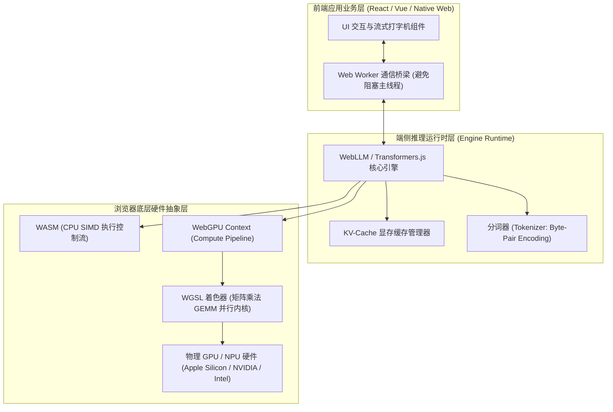
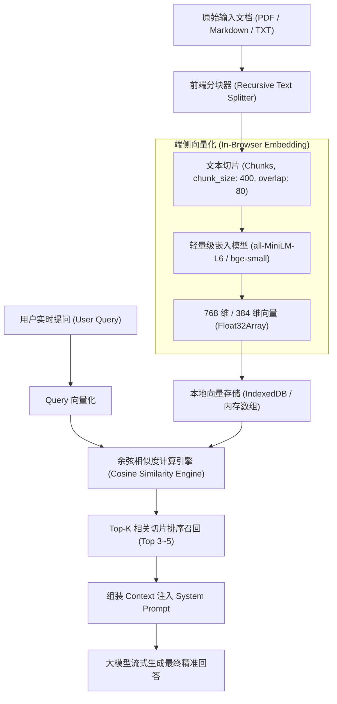
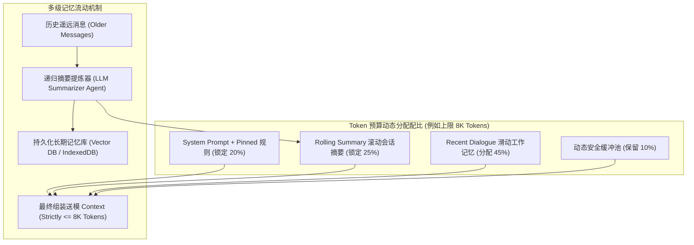
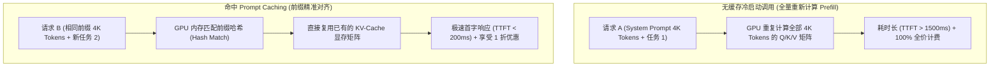

# 端侧推理与底层运行机制 (Runtime & Internals) ✅

本模块深挖大模型在前端与端侧落地的底层运行原理与极限性能机制：浏览器端 WebGPU Compute Shader 硬件加速与模型推理管线、前端私域 RAG 本地向量知识库混合检索、长会话上下文预算与多级记忆管理收敛机制，以及从 GPU 显存注意力机制到前端编排的 Prompt Caching 与 KV-Cache 状态优化。

---

## 浏览器端侧如何运行轻量大模型？WebGPU 与 Transformers.js / WebLLM 的工作原理是什么？ {#p1-browser-webgpu-llm}

<Answer>

**核心结论:**

随着现代浏览器对 **WebGPU** 标准的全面普及与模型量化技术的突破，在浏览器端侧（In-Browser / Client-Side）直接加载并运行轻量大语言模型与多模态模型（如 Qwen2.5-0.5B/1.5B、Llama-3.2-1B、Phi-3.5、Whisper Web 等）已成为高可用前端的前沿生产实践：
- **三大战略收益**：
  1. **数据隐私不出域**：医疗、金融、企业内网敏感文档完全在用户本机内存中推理，零数据回传风险；
  2. **零服务端 GPU 算力成本**：将原本昂贵的服务端推理算力（A100/H100）分摊至数十万客户端的本地 GPU/NPU 芯片；
  3. **离线可用与零网络抖动**：无惧弱网或网络中断，首字延迟（TTFT）不受网络往返（RTT）影响；
- **核心底层技术栈**：
  - **WebGPU**：取代过去仅面向图形渲染的 WebGL，直接提供底层通用 GPU 计算接口（**Compute Shader**），支持张量并行计算（Tensor Parallelism）；
  - **WebLLM（MLC-LLM）**：基于 Apache TVM 深度学习编译器，将大模型编译为针对 WebGPU 定制的 WGSL（WebGPU Shading Language）着色器与高效 WASM 运行时；
  - **Transformers.js**：Hugging Face 官方推出的 JavaScript 机器学习库，基于 **ONNX Runtime Web**，兼顾 CPU（WASM + SIMD）与 GPU（WebGPU）多后端自动降级；
  - **模型轻量化与量化**：通过 AWQ、GPTQ 或 4-bit 量化（q4f16_1），将 1B~3B 参数的模型显存占用压缩至 500MB~1.8GB，结合 Cache API 避免重复下载。

---

**原理解析:**

**1. 浏览器端侧 AI 执行引擎分层拓扑**



**2. 核心执行流程与技术瓶颈突破**

- **流式分块下载与持久化缓存**：
  - 模型权重通常被切分为数十个 50MB~100MB 的分片（Shards）。引擎利用 Service Worker 与浏览器原生的 **Cache API** 或 **IndexedDB** 将权重持久化落盘；首次下载完成后，后续访问直接命中本地磁盘缓存，秒级加载；
- **Web Worker 隔离机制**：
  - 大模型分词（Tokenization）与推理循环属于极度密集的计算任务。若在 Window 主线程执行，哪怕 10ms 的轻微阻塞也会造成页面白屏或滚动掉帧。因此，**所有模型推理必须严格置于 Web Worker 内运行**，主线程仅通过 `postMessage` 接收生成出的增量 Token；
- **显存保护与 OOM 容灾降级**：
  - 浏览器对单个标签页的 GPU 显存分配有严格限制（如移动端 Safari 限制在 1GB~2GB 左右）。若用户显卡显存不足，WebGPU 上下文会丢失（Context Lost）。工业级架构必须具备优雅降级机制：优先申请 WebGPU 运行；若初始化失败或 OOM，自动切换为云端 API 兜底或降级为小体积 CPU WASM 嵌入模型。

---

**规范代码实现:**

以下为生产级架构中，在独立 Web Worker 中初始化端侧大模型并流式生成文本的完整 TypeScript 实现：

```typescript
// worker/llm.worker.ts
// 需引入 @mlc-ai/web-llm
import { MLCEngine, InitProgressReport } from '@mlc-ai/web-llm';

class InBrowserLlmWorker {
  private engine: MLCEngine | null = null;
  // 选用端侧极速量化模型：Qwen2.5-0.5B-Instruct-q4f16_1-MLC (约 350MB)
  private selectedModel = 'Qwen2.5-0.5B-Instruct-q4f16_1-MLC';

  constructor() {
    this.engine = new MLCEngine();
    this.engine.setInitProgressCallback((report: InitProgressReport) => {
      // 向主线程上报模型下载与编译进度
      self.postMessage({
        type: 'progress',
        data: {
          progress: report.progress,
          text: report.text,
          timeElapsed: report.timeElapsed,
        },
      });
    });
  }

  public async init(): Promise<void> {
    if (!this.engine) return;
    try {
      await this.engine.reload(this.selectedModel);
      self.postMessage({ type: 'ready', model: this.selectedModel });
    } catch (err) {
      self.postMessage({ type: 'error', message: (err as Error).message });
    }
  }

  public async generate(prompt: string): Promise<void> {
    if (!this.engine) {
      throw new Error('LLM Engine not initialized');
    }

    const messages = [
      { role: 'system', content: 'You are a helpful and concise browser-native AI assistant.' },
      { role: 'user', content: prompt },
    ];

    // 流式响应推理
    const chunks = await this.engine.chat.completions.create({
      messages: messages as any,
      temperature: 0.7,
      stream: true,
    });

    for await (const chunk of chunks) {
      const delta = chunk.choices[0]?.delta?.content || '';
      if (delta) {
        self.postMessage({ type: 'delta', text: delta });
      }
    }

    self.postMessage({ type: 'done' });
  }
}

const workerInstance = new InBrowserLlmWorker();

self.onmessage = async (e: MessageEvent) => {
  const { action, payload } = e.data;
  if (action === 'init') {
    await workerInstance.init();
  } else if (action === 'generate') {
    await workerInstance.generate(payload.prompt);
  }
};
```

---

**面试官视角:**

- **考察深度**:
  1. 候选人是否了解前端在 AI 时代的算力边界拓展，是否清楚端侧 AI 的适用场景（离线表单自动填充、敏感代码脱敏、实时语音翻译、前端数据清洗）与不适用场景（数万字深度多步规划、长文档深度阅读）；
  2. 能否从系统工程角度解答大体积模型权重的冷启动与网络下载瓶颈（Cache API 分块缓存、渐进式进度提示）；
  3. 对 Web Worker 线程隔离与 WebGPU 显存限制有无实战防坑经验。
- **下探追问链**:
  - *追问 1*：如果用户的设备不支持 WebGPU（如低版本 Chrome 或老款安卓手机），前端如何做到优雅无缝降级？
  - *追问 2*：端侧模型虽然零服务器成本，但在用户笔记本上可能引起发热与耗电增加，前端在架构上应如何控制推理的触发频次？

---

**延伸阅读:**

- W3C WebGPU Specification & WGSL Overview
- WebLLM (MLC-LLM) In-Browser High-Performance Acceleration
- Transformers.js v3 WebGPU Pipeline Architecture
</Answer>

---

---

---

## 前端如何构建端侧本地 RAG 系统？文档分块与余弦相似度检索是如何落地的？ {#p0-rag-frontend-knowledge-base}

<Answer>

**核心结论:**

**端侧本地 RAG（Client-Side Local RAG）** 是指在前端浏览器内，不依赖任何第三方向量数据库（如 Pinecone、Milvus）或服务端接口，纯靠本地 JavaScript 引擎与 WebWorker 完成私有文档的**解析、分块（Chunking）、向量嵌入（Embedding）、语义相似度检索（Vector Retrieval）与 Prompt 组装**的全套闭环：
- **核心应用场景**：本地 Markdown 知识库助手、离线 PDF 划词问答、用户个人浏览历史搜索等，具备极致的私密性与即时响应能力；
- **标准落地链路**：
  1. **文档加载与分块**：采用带重叠窗口（Overlap）的递归分块算法，保留段落上下文完整性，避免关键语义在切分点被截断；
  2. **端侧轻量嵌入**：利用 Transformers.js 加载极轻量级嵌入模型（如 `bge-small-zh-v1.5` 或 `all-MiniLM-L6-v2`，模型仅约 20MB~40MB）；
  3. **向量计算与 Top-K 召回**：使用 `Float32Array` 类型化数组存储向量，利用**余弦相似度（Cosine Similarity）**算法并行比对，召回相关度最高的上下文片段注入大模型。

---

**原理解析:**

**1. 前端端侧本地 RAG 全链路数据流**



**2. 核心算法原理推导**

- **重叠切分窗口（Overlap）的必要性**：
  - 设切片大小为 S，重叠大小为 O。若不设重叠，切片 A 与切片 B 的交界处刚好存在一个核心实体关系（例如：“...张三出生于北京市朝阳区。[切分点] 毕业于清华大学...”），该实体关系就会被撕裂，导致模型无法检索到“张三的母校是清华”。引入 15%~20% 的 Overlap，能确保边界实体语义连贯；
- **余弦相似度（Cosine Similarity）计算**：
  - 给定查询向量 A 与文档切片向量 B，两者的余弦相似度定义为两向量点积与模长乘积之比：
    `Cosine(A, B) = (A · B) / (||A|| * ||B||) = sum(A_i * B_i) / (sqrt(sum(A_i^2)) * sqrt(sum(B_i^2)))`
  - 在前端工程优化中，如果我们在存入向量库时已将向量做过**L2 范数归一化（Normalize to unit length）**，则分母恒等于 1，余弦相似度直接简化为**两个数组的点积（Dot Product）**，极大节省运行时 CPU 算力开销。

---

**规范代码实现:**

以下为纯 TypeScript 实现的高性能前端本地 RAG 核心（包含递归分块算法、归一化点积计算与 Top-K 召回）：

```typescript
// rag/local-rag-engine.ts
export interface DocumentChunk {
  id: string;
  text: string;
  embedding?: Float32Array;
  metadata?: Record<string, unknown>;
}

export class LocalRagEngine {
  private chunks: DocumentChunk[] = [];

  // 1. 递归文本分块器 (Recursive Character Text Splitter)
  public chunkText(
    text: string,
    chunkSize = 300,
    chunkOverlap = 50
  ): DocumentChunk[] {
    const separators = ['

', '
', '。', '！', '？', ' ', ''];
    const result: string[] = [];

    const splitRecursively = (currentText: string, sepIndex: number): string[] => {
      if (currentText.length <= chunkSize || sepIndex >= separators.length) {
        return [currentText.trim()].filter(Boolean);
      }

      const sep = separators[sepIndex];
      const parts = currentText.split(sep);
      const subChunks: string[] = [];
      let currentAcc = '';

      for (const part of parts) {
        const piece = currentAcc ? `${currentAcc}${sep}${part}` : part;
        if (piece.length <= chunkSize) {
          currentAcc = piece;
        } else {
          if (currentAcc) subChunks.push(currentAcc.trim());
          if (part.length > chunkSize) {
            // 继续往下用更小颗粒度的分隔符递归切分
            subChunks.push(...splitRecursively(part, sepIndex + 1));
            currentAcc = '';
          } else {
            currentAcc = part;
          }
        }
      }
      if (currentAcc) subChunks.push(currentAcc.trim());
      return subChunks;
    };

    const rawChunks = splitRecursively(text, 0);

    // 叠加 Overlap 窗口并生成带 ID 的结构
    this.chunks = rawChunks.map((chunk, index) => ({
      id: `chunk_${index}`,
      text: chunk,
    }));

    return this.chunks;
  }

  // 2. 向量点积/余弦相似度计算 (假设向量已完成 L2 归一化)
  public static dotProduct(a: Float32Array, b: Float32Array): number {
    let dot = 0;
    const len = a.length;
    for (let i = 0; i < len; i++) {
      dot += a[i] * b[i];
    }
    return dot;
  }

  // 3. 注册带 Embedding 的文档切片
  public registerChunksWithEmbeddings(chunksWithVectors: DocumentChunk[]): void {
    this.chunks = chunksWithVectors;
  }

  // 4. 执行 Top-K 向量相似度检索
  public retrieveTopK(
    queryEmbedding: Float32Array,
    k = 3,
    minSimilarity = 0.5
  ): Array<{ chunk: DocumentChunk; similarity: number }> {
    const scoredChunks = this.chunks
      .map((chunk) => {
        if (!chunk.embedding) return null;
        const similarity = LocalRagEngine.dotProduct(queryEmbedding, chunk.embedding);
        return { chunk, similarity };
      })
      .filter((item): item is { chunk: DocumentChunk; similarity: number } => 
        item !== null && item.similarity >= minSimilarity
      );

    // 按相似度降序排序并截取 Top-K
    scoredChunks.sort((a, b) => b.similarity - a.similarity);
    return scoredChunks.slice(0, k);
  }

  // 5. 动态构建带有证据引用的增强上下文 Prompt
  public buildPrompt(query: string, retrieved: Array<{ chunk: DocumentChunk; similarity: number }>): string {
    const contextBlock = retrieved
      .map((item, idx) => `[参考切片 ${idx + 1}]:
${item.chunk.text}`)
      .join('

');

    return `你是一个专业的本地知识助手。请严格结合以下参考切片回答用户问题，若参考内容未提及，请诚实告知未知，切勿编造。

【参考上下文】:
${contextBlock}

【用户问题】:
${query}

请给出严谨的解答并标注参考来源。`;
  }
}
```

---

**面试官视角:**

- **考察深度**:
  1. 候选人是否真正动手实践过 RAG 检索增强架构，而非仅仅知晓名词概念；
  2. 能否从数学逻辑（点积、L2 范数归一化）和内存效率（TypedArray 连续内存块）层面优化前端大量向量运算的执行性能；
  3. 对分块尺寸（Chunk Size）与重叠（Overlap）超参数的选型敏感度，以及如何防止幻觉注入。
- **下探追问链**:
  - *追问 1*：如果本地文档有上万个切片，在前端做全量线性比对（$O(N)$ 暴力搜索）会出现明显的卡顿，前端如何在不借助后端的情况下实现高效近似近邻检索（ANN）？
  - *追问 2*：单纯依靠向量余弦检索时，遇到精确的工单编号（如 `BUG-2026-9901`）往往检索召回率极低，前端如何结合 BM25 关键词检索做混合加权排序（Hybrid Search）？

---

**延伸阅读:**

- LangChain: Concepts of Text Splitters & Embedding Chunking
- Hugging Face Transformers.js Feature Extraction Pipeline
- In-Memory Vector Search with HNSW in WebAssembly
</Answer>

---

## Agent 长会话场景下，面对有限的上下文窗口，如何设计多级记忆管理与滑动压缩机制？ {#p1-agent-memory-context-compression}

<Answer>

**核心结论:**

在复杂自主智能体（Agent）或数十轮以上深度长对话场景中，**上下文窗口（Context Window）的无节制膨胀是导致系统雪崩的致命隐患**：
- **长上下文的“三重危机”**：
  1. **经济成本飙升**：大模型通常按 Token 计费，全量上下文每轮重送会导致调用成本呈平方级 $O(N^2)$ 爆炸；
  2. **推理时延（Latency）剧增**：Prefill（首字预填充）耗时线性甚至超线性上升，用户感知卡顿加剧；
  3. **模型注意力稀释与“中间遗忘（Lost in the Middle）”**：模型在超长上下文中对处于中段的关键信息检索准确率大幅下滑，严重影响决策可靠度；
- **分级记忆管理体系**：工业级系统通过构建由 **工作记忆（Working Memory）、滚动摘要记忆（Rolling Summary Memory）、固定系统锚点（Pinned Anchors）与长期向量记忆（Long-Term Archival Memory）** 构成的多级存储层，实现上下文 Token 预算的恒定收敛与高质量信息无损流转。

---

**原理解析:**

**1. 多级上下文内存分层金字塔**



**2. 核心滑动压缩四大关键机制**

1. **不可退化锚点锁定（Immutable Anchor Pinning）**：
   - 系统提示词（System Prompt）、开发者注入的角色规则、当前激活的 MCP 工具定义 Schema，在任何情况下均享有“最高优先级保护”，永远不被压缩或滑动剔除；
2. **滚动递归摘要压缩（Recursive Rolling Summarization）**：
   - 设定阈值（如工作记忆达到 4000 Tokens 时触发）。从最旧的几轮对话开始，提取关键事实、用户决策、已获变量并生成简短摘要，合并入 `summary` 字段，随后丢弃原始的详细对话对象；
3. **KV-Cache 命中率保护策略（Prompt Caching Optimization）**：
   - 现代顶级模型厂商（Anthropic Claude、DeepSeek、OpenAI）支持 Prompt Caching（前缀缓存命中）。若每次请求频繁改动 Prompt 顶端内容，会导致整个服务端的 KV-Cache 彻底击穿失效。因此，**System Prompt 与稳定上下文必须严格保持在前缀静态不变**，动态变化的摘要与近期对话置于后部，从而大幅降低延迟与账单成本；
4. **意图检索激活长期记忆（Episodic Retrieval on Demand）**：
   - 对于早先被截断的超长业务细节，将其转存至长期向量数据库；仅当后续对话意图检测命中特定历史关键词或实体时，才按需将单条记忆片段召回至工作上下文中。

---

**规范代码实现:**

以下为生产级架构中，具备 Token 预算控制与滑动窗口摘要能力的上下文管理器实现：

```typescript
// memory/context-budget-manager.ts
export interface ChatMessage {
  id: string;
  role: 'system' | 'user' | 'assistant' | 'tool';
  content: string;
  tokensEstimate: number;
  isPinned?: boolean; // 关键信息锁定保护
}

export class ContextBudgetManager {
  private maxAllowedTokens: number;
  private pinnedMessages: ChatMessage[] = [];
  private rollingSummary = '';
  private recentMessages: ChatMessage[] = [];

  constructor(maxTokens = 8000) {
    this.maxAllowedTokens = maxTokens;
  }

  // 粗略估算 Token 数量 (中英混合场景经验估算: 1 token ≈ 1.5 字符)
  public static estimateTokens(text: string): number {
    return Math.ceil(text.length / 1.5);
  }

  public setSystemPrompt(prompt: string): void {
    const tokens = ContextBudgetManager.estimateTokens(prompt);
    this.pinnedMessages = [
      {
        id: 'system_core',
        role: 'system',
        content: prompt,
        tokensEstimate: tokens,
        isPinned: true,
      },
    ];
  }

  public addMessage(role: 'user' | 'assistant' | 'tool', content: string, pin = false): void {
    const tokens = ContextBudgetManager.estimateTokens(content);
    const msg: ChatMessage = {
      id: `msg_${Date.now()}_${Math.random().toString(36).slice(2, 6)}`,
      role,
      content,
      tokensEstimate: tokens,
      isPinned: pin,
    };

    if (pin) {
      this.pinnedMessages.push(msg);
    } else {
      this.recentMessages.push(msg);
    }

    // 检查并执行滑动压缩
    this.enforceBudgetConstraints();
  }

  // 强制 Token 预算收敛控制
  private enforceBudgetConstraints(): void {
    const calculateTotalTokens = () => {
      const pinnedSum = this.pinnedMessages.reduce((sum, m) => sum + m.tokensEstimate, 0);
      const summarySum = ContextBudgetManager.estimateTokens(this.rollingSummary);
      const recentSum = this.recentMessages.reduce((sum, m) => sum + m.tokensEstimate, 0);
      return pinnedSum + summarySum + recentSum;
    };

    // 当超出预算且近期消息大于 4 轮时，滑动挤出最老的消息进入待摘要队列
    while (calculateTotalTokens() > this.maxAllowedTokens && this.recentMessages.length > 4) {
      const oldestMsg = this.recentMessages.shift();
      if (!oldestMsg) break;

      // 提取核心信息注入滚动摘要
      this.rollingSummary += `
[历史记录]: ${oldestMsg.role} 曾提到 "${oldestMsg.content.slice(0, 100)}..."`;
    }
  }

  // 组装最终提交给大模型的标准化上下文消息数组
  public assembleContext(): ChatMessage[] {
    const finalPayload: ChatMessage[] = [...this.pinnedMessages];

    // 若存在滚动摘要，以系统补充信息形式插入
    if (this.rollingSummary) {
      finalPayload.push({
        id: 'rolling_summary_block',
        role: 'system',
        content: `【前序对话背景与要点摘要】:${this.rollingSummary}`,
        tokensEstimate: ContextBudgetManager.estimateTokens(this.rollingSummary),
      });
    }

    finalPayload.push(...this.recentMessages);
    return finalPayload;
  }
}
```

---

**面试官视角:**

- **考察深度**:
  1. 候选人是否具备大模型系统长效稳定运行的高阶工程认知，是否把 Token 视作和内存、网络带宽同等珍贵的工程资源；
  2. 能否讲清楚现代模型厂商底层 KV-Cache 与 Prompt Caching 机制对上下文编排结构提出的具体约束（静态前缀不变性）；
  3. 对信息丢失（Information Loss）与预算压缩之间的权衡（Trade-off）掌控能力。
- **下探追问链**:
  - *追问 1*：如果使用另一个轻量小模型（如 GPT-4o-mini 或端侧模型）对历史对话进行递归摘要，何时触发摘要最合理？如何避免摘要本身产生新的事实性幻觉？
  - *追问 2*：当用户在第 50 轮对话中突然问及“在第 3 轮里我给你的那个订单号是多少”，滑动窗口已经被丢弃，系统应该如何保证关键实体的记忆追溯？

---

**延伸阅读:**

- Anthropic Claude Prompt Caching Architecture & Cost Optimization
- MemGPT: LLMs as Operating Systems with Virtual Context Management
- Attention with Linear Biases (ALiBi) & Long-Context Attention Mechanics
</Answer>

---

---

## 什么是 Prompt Caching（前缀缓存）与 KV-Cache 状态优化？静态与动态上下文编排如何降低时延与成本？ {#p0-prompt-caching-kv-cache-optimization}

<Answer>

**核心结论:**

在现代高并发大模型应用与长任务 Agent 中，**Prompt Caching（前缀提示词缓存）与底层 KV-Cache 状态复用是决定系统首字延迟（TTFT）与计费成本的胜负手**：
- **物理机制（KV-Cache 复用）**：大模型自回归生成时，前序所有 Token 经过自注意力（Self-Attention）计算生成的 Key 与 Value 矩阵（KV 向量）会被保存在 GPU 显存中；**Prompt Caching 允许跨请求复用这些已计算好的前缀 KV 向量**，跳过昂贵的预填充计算（Prefill Phase）；
- **巨额降本增效**：主流模型服务商（Anthropic Claude、DeepSeek、OpenAI）对命中 Prompt Cache 的 Token 给予 **50%~90% 的价格折扣**，同时首字延迟降低 **80% 以上**；
- **前端编排铁律：前缀静态对齐（Static Prefix Alignment）**：Prompt Caching 严格要求**从第 0 个 Token 起的前缀必须绝对完全一致**。若前端随意在上下文头部插入动态时间戳、动态递增的消息序号或打乱 System Prompt，将导致全局 KV-Cache 彻底击穿失效。

---

**原理解析:**

**1. 传统无缓存推理 vs Prompt Caching 命中机制**



**2. 前端上下文编排的三大黄金准则**

1. **绝对静态顶置（Static-First Layout）**：
   - 上下文严格分为“静态区（Static Zone）”与“动态区（Dynamic Zone）”。全局系统角色声明、版本信息、MCP 工具定义 JSON Schema 必须焊死在 Prompt 的最前端；
2. **严禁在静态前缀中注入动态时间戳**：
   - 错误做法：`System: 你是助手，当前时间是 2026-09-12 12:15:30...`（每秒都在变，永远击穿缓存）；
   - 正确做法：将当前时间作为最后一条 User 消息的尾随元数据传入；
3. **最小变更边界（Append-Only History）**：
   - 历史消息必须采用“仅追加（Append-Only）”模式；一旦中间插入或删除了某轮对话，该位置之后的所有 KV-Cache 缓存全部失效。

---

**规范代码实现:**

以下展示在前端上下文组装器中，严格遵循 Prompt Caching 静态前缀对齐原则的架构实现：

```typescript
// prompt/caching-assembler.ts
export interface PromptMessage {
  role: 'system' | 'user' | 'assistant';
  content: string;
  cacheControl?: { type: 'ephemeral' }; // Anthropic 等支持显式缓存断点
}

export class PromptCachingContextAssembler {
  // 1. 恒定不变的静态前缀 (必须保证字节级全等)
  private static readonly IMMUTABLE_SYSTEM_PROMPT = 
    `You are an enterprise AI architecture assistant.
` +
    `You strictly follow the company engineering standards and never hallucinate.
` +
    `Rules: Always use TypeScript; Do not invent external APIs.`;

  // 2. 稳定的 MCP 工具元数据前缀
  private toolsSchemaPrefix: string;

  constructor(toolsSchemaJson: string) {
    this.toolsSchemaPrefix = toolsSchemaJson;
  }

  // 3. 组装具备高命中率的上下文 Payload
  public buildCacheOptimizedMessages(
    historyMessages: Array<{ role: 'user' | 'assistant'; content: string }>,
    currentQuery: string,
    dynamicContextMetadata?: { currentTime: string; userId: string }
  ): PromptMessage[] {
    const payload: PromptMessage[] = [];

    // [Block 1: 永久静态区] System Prompt + Tool Schemas (必须打上缓存锚点)
    payload.push({
      role: 'system',
      content: `${PromptCachingContextAssembler.IMMUTABLE_SYSTEM_PROMPT}

[Available Tools]:
${this.toolsSchemaPrefix}`,
      cacheControl: { type: 'ephemeral' }, // 显式标记在此处固化 KV-Cache
    });

    // [Block 2: 线性追加对话历史] 严禁在中间任意插入时间戳破坏前缀
    for (const msg of historyMessages) {
      payload.push({
        role: msg.role,
        content: msg.content,
      });
    }

    // [Block 3: 动态元数据与当前提问] 动态变量永远置于最尾部
    let finalUserMessage = currentQuery;
    if (dynamicContextMetadata) {
      finalUserMessage += `

[Runtime Context Metadata]:
- CurrentTime: ${dynamicContextMetadata.currentTime}
- UserId: ${dynamicContextMetadata.userId}`;
    }

    payload.push({
      role: 'user',
      content: finalUserMessage,
    });

    return payload;
  }
}
```

---

**面试官视角:**

- **考察深度**:
  1. 候选人是否具备大模型系统设计的高级优化经验，能否把 GPU 显存注意力机制与前端应用层编排无缝贯通；
  2. 能否指出日常开发中最容易误杀 Prompt Cache 的典型前端坏味道（如随机 ID、随手注入的全局动态时间）；
  3. 对成本控制（Token Economics）与首字延迟（TTFT）极致优化的工程敏感度。
- **下探追问链**:
  - *追问 1*：在多轮分支对话树（Session Tree）中，当用户回滚到第 3 轮并发起新分支时，原先分支的 KV-Cache 是否会被复用？如何最大化利用已缓存的前缀？
  - *追问 2*：为什么在某些大模型 API 中，Prompt Cache 存在“最短 Token 门槛”（例如至少需要 1024 Tokens 才能触发缓存机制）？

---

**延伸阅读:**

- Anthropic Claude Official Guide: Prompt Caching Architecture & Best Practices
- DeepSeek-V2/V3 Multi-head Latent Attention (MLA) & KV Cache Compression
</Answer>
