# AI 智能工程 (AI Engineering) 体系导读✅

在大模型（LLM）与智能体（Agent）深度重塑软件工业的 2026 年，**AI 智能工程已成为现代高级前端架构师与全栈技术专家的核心分水岭**。根据头部大厂与高薪技术岗位（35K~160K+）的真实画像，现代工程师已全面跳出“简单的 Chat 对话框接入”这一原始阶段，深度进入**“交互体验重构（流式/Generative UI）、Agent 运行载体（Harness/MCP/Skills/Subagents）、端侧异构推理（WebGPU/本地 RAG）以及效能规范守卫（Spec-Driven/质量门禁）”**四大核心战役。

本项目严格遵循**布鲁姆修订版认知分类学（Bloom's Taxonomy）与“技术问题域高内聚 × 认知深度递进”的双轴信息架构（IA）**，为前端与全栈工程师构建了一套自底向上、由浅入深的专业知识与能力测评体系。

---

## 知识架构与认知演进全景图 (Dual-Axis Architecture)

```mermaid
graph TB
    subgraph Tier0["Tier 0: 概念基石与底层假设 (00.concept.md)"]
        T0_1["Token 的物理本质与 BPE 算法原理"]
        T0_2["自回归 Next-Token 机制 vs 确定性 UI 状态机"]
        T0_3["Prompt Engineering 体系与采样参数 (Temperature/Top-P)"]
        T0_4["Token 计量与长上下文动态预算管理 (Context Budget)"]
    end

    subgraph Tier1["Tier 1: 大模型原理与前端认知 (01.llm-basics.md)"]
        T1_1["前端视角的 Transformer: Self-Attention 与多头注意力机制"]
        T1_2["大模型幻觉根因 (Hallucination) 与前端工程防范降低机制"]
        T1_3["结构化输出与模式契约 (Structured Outputs / JSON Schema / Zod)"]
        T1_4["Embedding 向量嵌入原理、高维向量空间与余弦相似度"]
    end

    subgraph Tier2["Tier 2: 流式交互与生成式 UI (02.ui-interaction.md)"]
        T2_1["流式响应通信链路 (Fetch ReadableStream / SSE / TextDecoder)"]
        T2_2["Markdown AST 容错增量排版与代码块/公式防抖"]
        T2_3["生成式 UI (Generative UI) 动态组件与 Shadow DOM 沙箱"]
        T2_4["多轮复杂分支会话树状态机 (Branch Tree / 时光旅行 / 撤销重试)"]
    end

    subgraph Tier3["Tier 3: 智能体工程与前端载体 (03.agent-engineering.md)"]
        T3_1["Agent 核心四要素 (LLM 大脑 / 规划 Planning / 记忆 Memory / 工具 Tools)"]
        T3_2["主流 Agent 产品与框架对比 (Cursor / Claude Code / AutoGen / LangGraph / CrewAI)"]
        T3_3["Agent 扩展手段体系 (Function Calling / MCP / Skills / Subagents)"]
        T3_4["智能体宿主 (Agent Harness) 状态机与思考链流式可视化"]
        T3_5["高风险工具 Human-in-the-Loop (HITL) 动态授权拦截门禁"]
        T3_6["DAG 工作流编排画布 (AI Workflow Canvas / 拓扑排序 / 流式执行)"]
    end

    subgraph Tier4["Tier 4: 协议生态与质量工程 (04.protocols-ecosystem.md)"]
        T4_1["Model Context Protocol (MCP) 客户端规范与工具发现"]
        T4_2["团队级 AI 编程工具链落地与代码审查安全质量门 (Quality Gate)"]
        T4_3["Spec-Driven Development (SDD) 规约驱动工程体系"]
        T4_4["大模型应用自动化评测 (Eval Benchmark) 与回归防护"]
    end

    subgraph Tier5["Tier 5: 端侧推理与底层运行机制 (05.runtime-internals.md)"]
        T5_1["端侧硬件加速与 WebGPU / WASM 模型推理 (Transformers.js / WebLLM)"]
        T5_2["前端端侧本地 RAG 知识库系统 (递归重叠分块 / 余弦检索 / Prompt 组装)"]
        T5_3["长会话滑动窗口递归摘要与多级记忆管理 (Working Memory)"]
        T5_4["服务端 Prompt Caching 前缀对齐与端到端 KV-Cache 复用机制"]
    end

    subgraph Tier6["Practical Capstone: 白板手写实战 (coding.md)"]
        T6_1["手写 Agent 核心驱动循环 (ReAct Agent Loop)"]
        T6_2["手写 RAF 打字机平滑字符缓冲队列"]
        T6_3["手写纯前端轻量余弦相似度 RAG 检索器"]
        T6_4["手写 Human-in-the-Loop 异步安全拦截器"]
    end

    Tier0 ==> Tier1 ==> Tier2 ==> Tier3 ==> Tier4 ==> Tier5 ==> Tier6
```

---

## 核心能力矩阵与测评阶梯 (Assessment Rubrics)

结合**米勒能力金字塔（Miller's Pyramid）**与大厂职级定级标准，AI 智能工程能力阶梯划分如下：

| 认知阶梯 | 考核层级 (Bloom / Miller) | 初中级工程师 (20-30K) | 高级工程师 / 专家 (35-60K) | 资深架构师 / TL (70-150K+) |
| :--- | :--- | :--- | :--- | :--- |
| **Tier 0: 概念基石** | 记忆/理解 *Knows* | 知道 Token 大致代表单词，会简单调用 OpenAI API | 深刻理解 BPE 算法本质与 Next-Token 机制对状态机的影响，精通采样参数调优 | 掌握 Token 预算全局分配策略与长上下文降本增效架构设计 |
| **Tier 1: 大模型原理** | 理解/应用 *Knows How* | 了解 Transformer 名词，知道大模型有时会胡说八道 | 掌握 Self-Attention 与多头注意力原理，精通 JSON Schema 严格模式与幻觉工程防御 | 掌握端侧向量空间与 Embedding 算法体系，设计高维表征与检索协议 |
| **Tier 2: 流式交互** | 应用/分析 *Shows How* | 使用原生 EventSource 接收字符串并直接拼接 innerHTML | 掌握 `ReadableStream` 增量解码、Markdown AST 容错修补与平滑打字队列 | 架构大型 Generative UI 动态组件工厂，实现 Shadow DOM 样式沙箱与防 XSS 注入 |
| **Tier 3: 智能体工程** | 分析/综合 *Does* | 仅能把 Agent 当作普通对话助手调用 | 熟练架构 Agent Harness 前端宿主，掌握 MCP/Skills/Subagents 扩展体系与 HITL 门禁 | 主导设计企业级复杂 AI DAG 工作流画布、支持多智能体协同、条件分支与分布式状态持久化 |
| **Tier 4: 协议与质量** | 评价 (Evaluate) *Does* | 会使用 Cursor / Copilot 辅助编写日常业务代码 | 熟练落地 MCP 协议客户端，设计严格的 Human-in-the-Loop 授权门禁 | 建立团队 Rules 规范资产库，推行 SDD 体系，在 CI 流水线落地 Eval 自动化评测 |
| **Tier 5: 端侧底层** | 评价/创造 *DOK 4* | 了解端侧 AI 概念 | 掌握浏览器端 WebGPU / Transformers.js 推理，优化会话滑动窗口摘要 | 深入理解 Prompt Caching 前缀对齐与 KV-Cache 复用，实现纳秒级端云协同推理 |
| **Capstone 实战** | 白板演示 *Shows How* | 了解 Agent 大致概念 | 能在 20 分钟内手写出可运行的 RAF 打字机队列与向量检索器 | 能够从零白板手写工业级 ReAct Agent Loop 状态机与 HITL 拦截管道 |

---

## 核心主题与考题索引 (Topic Index)

### [00. 核心概念与基石认知 (Core Concepts)](./00.concept.md)
- `{#p0-what-is-token-and-why}`：什么是 Token？为什么计算机与大模型不能直接处理字符，而要有 Token 的概念？
- `{#p0-what-is-llm-autoregressive}`：什么是大语言模型（LLM）？什么是自回归机制（Next-Token Prediction）？给传统前端带来了什么根本挑战？
- `{#p0-prompt-engineering-parameters}`：什么是 Prompt Engineering？System Prompt 与 User Prompt 有何区别？采样参数（Temperature / Top-P）如何影响输出？
- `{#p1-token-budget-window-management}`：前端在处理多轮长上下文交互时，如何设计合理的 Token 计量与动态预算管理机制？

### [01. 大模型原理与前端认知 (LLM Basics & Principles)](./01.llm-basics.md)
- `{#p0-transformer-self-attention-for-fe}`：前端工程师需要了解的 Transformer 架构：什么是 Self-Attention（自注意力机制）？多头注意力（Multi-Head Attention）解决了什么？
- `{#p0-llm-hallucination-mitigation}`：为什么大模型会产生幻觉（Hallucination）？前端能从工程上做什么来防范和降低幻觉？
- `{#p0-structured-outputs-json-schema}`：什么是结构化输出（Structured Outputs）？为什么基于 JSON Schema / Zod 约束比纯自然语言 Prompt 更可靠？
- `{#p1-embedding-vector-search-basics}`：什么是 Embedding（向量嵌入）？向量空间与余弦相似度在前端语义搜索中是如何工作的？

### [02. 流式交互与生成式 UI (Streaming & Generative UI)](./02.ui-interaction.md)
- `{#p0-ai-streaming-render}`：前端如何实现类似 ChatGPT 的打字机流式响应？SSE 与 Fetch ReadableStream 该如何选择？
- `{#p0-ai-stream-markdown-flicker}`：大模型流式输出 Markdown 时，如何避免代码块、公式与 Mermaid 图表解析闪烁？
- `{#p0-generative-ui-sandbox}`：什么是生成式 UI（Generative UI）？如何安全渲染模型动态生成的 React/Vue 组件并防止 XSS？
- `{#p1-ai-chat-tree-state}`：在大模型多轮分支对话交互中，复杂会话树状态机与撤销重试是如何设计的？

### [03. 智能体工程与前端载体 (Agent Engineering & Harness)](./03.agent-engineering.md)
- `{#p0-what-is-agent-core-elements}`：什么是智能体（Agent）？Agent 的四大核心要素（LLM 大脑、规划 Planning、记忆 Memory、工具 Tools）是什么？
- `{#p0-mainstream-agents-comparison}`：业界主流的 Agent 产品与框架有哪些（Cursor / Claude Code / AutoGen / LangGraph / CrewAI）？它们的架构选型与适用场景是什么？
- `{#p0-agent-extension-mechanisms}`：Agent 主要的扩展手段有哪些？除了 Function Calling / Tool Use，MCP 协议、Skills 机制与 Subagent 多智能体协作是如何扩展 Agent 能力的？
- `{#p0-agent-frontend-harness}`：前端如何架构大模型 Agent 交互界面（Agent Harness）？ReAct 规划决策轨迹与思考链流式可视化？
- `{#p0-agent-hitl-guardrail}`：Agent 执行高风险工具（如删除文件、对外转账）时，前端如何设计 Human-in-the-Loop (HITL) 动态授权拦截门禁？
- `{#p0-ai-workflow-dag-canvas}`：如何设计类似 Dify / Coze 的可视化 DAG 工作流编排画布？拓扑排序与流式执行调试如何落地？

### [04. 协议生态与质量工程 (Protocols & Ecosystem)](./04.protocols-ecosystem.md)
- `{#p0-mcp-protocol-frontend}`：Model Context Protocol (MCP) 协议在前端是如何工作的？它与传统 Function Calling 有什么区别？
- `{#p0-ai-coding-quality-gate}`：团队引入 Cursor / Copilot / Claude Code 后，前端团队如何建立代码质量审查门禁（Quality Gate）与防范幻觉？
- `{#p0-spec-driven-development}`：什么是规格驱动开发（Spec-Driven Development, SDD）？如何通过规则资产库约束大模型生成符合架构的代码？
- `{#p1-ai-eval-benchmark}`：如何搭建大模型应用与 Agent 的自动化评测（Eval）体系？指标如何量化与持续回归？

### [05. 端侧推理与底层运行机制 (Runtime & Internals)](./05.runtime-internals.md)
- `{#p1-browser-webgpu-llm}`：浏览器端侧如何运行轻量大模型？WebGPU 与 Transformers.js / WebLLM 的底层推理机制是什么？
- `{#p0-rag-frontend-knowledge-base}`：前端如何构建端侧本地 RAG 系统？文档分块、客户端 Embedding 与余弦相似度检索是如何落地的？
- `{#p1-agent-memory-context-compression}`：Agent 长会话场景下，面对有限的上下文窗口，如何设计多级记忆管理与滑动压缩机制？
- `{#p0-prompt-caching-kv-cache-optimization}`：什么是 Prompt Caching（前缀缓存）与 KV-Cache 状态优化？静态与动态上下文编排如何降低首字时延（TTFT）与成本？

### [实战白板与综合手写 (Coding Practice)](./coding.md)
- `{#p0-coding-agent-loop}`：手写实现一个包含工具调用与终止条件的最小 Agent 运行时循环（Agent Loop）？
- `{#p0-coding-typing-buffer}`：手写实现一个平滑打字机缓冲队列（Smooth Typing Buffer Queue）？
- `{#p0-coding-rag-cosine-search}`：手写实现纯前端带重叠窗口（Overlap）的递归文档切分与余弦相似度检索器？
- `{#p0-coding-hitl-interceptor}`：手写实现基于 Promise 控制反转模式的 Human-in-the-Loop 授权拦截管理器？
