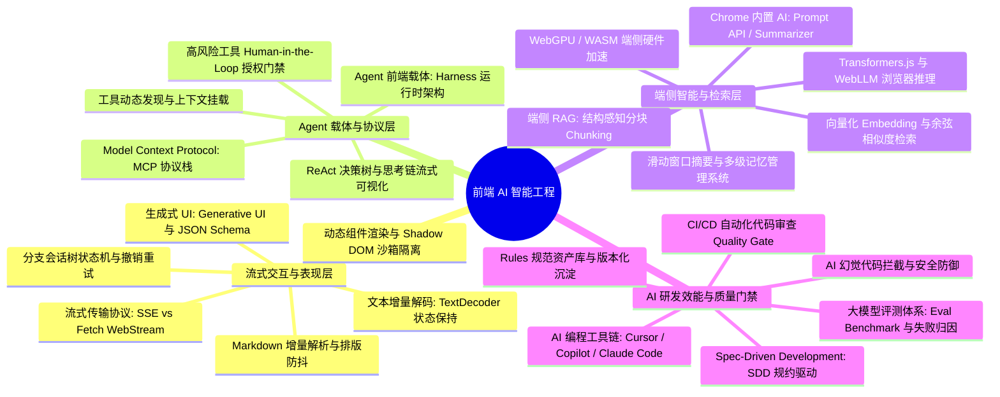

# AI 智能工程 (AI Engineering) 体系导读✅

在大模型（LLM）与智能体（Agent）重塑软件工业的 2026 年，**AI 智能工程已成为现代高级前端架构师与全栈专家的核心分水岭**。根据头部大厂与高薪技术岗位（35K~160K+）的真实画像，前端工程师已全面跳出“简单的 Chat 对话框接入”这一原始阶段，深度进入**“交互体验重构（流式/Generative UI）、Agent 运行载体（Harness/MCP）、端侧异构推理（WebGPU/本地 RAG）以及效能规范守卫（Spec-Driven/质量门禁）”**四大核心战役。

本学科科目系统性沉淀大模型工程化在前端落地的最佳实践，严格对齐真实面试考察深度与生产级代码标准。

---

## 知识图谱 (Knowledge Map)

---

## 核心技能矩阵 (Skill Matrix)

| 领域模块 | 初中级工程师标准 (20-30K) | 高级工程师 / 专家标准 (35-60K) | 资深架构师 / TL 标准 (70-150K+) |
| :--- | :--- | :--- | :--- |
| **流式交互与表现** | 熟悉 Fetch Stream 基本调用，能简单拼接文本输出 | 掌握 TextDecoder 增量解码、Markdown AST 不完整容错、解决代码块/公式解析闪烁与虚拟滚动 | 主导大型 Generative UI 动态组件工厂，设计严格的样式沙箱与防 XSS 注入体系，支持分支会话状态回滚 |
| **Agent 载体与协议** | 理解 Function Calling 概念，能解析模型返回的 JSON 参数 | 熟练落地 MCP 协议客户端，封装企业内部系统工具链，实现 ReAct 规划与思考链的可视化排版 | 架构高可用 Agent Harness 运行时，设计严格的高风险操作 Human-in-the-Loop 拦截确认门禁与会话权限隔离 |
| **端侧计算与 RAG** | 能调用云端 Embedding API 并通过向量库完成基础查询 | 掌握浏览器端 WebGPU / Transformers.js 推理，实现端侧纯本地 RAG、文档分块策略与上下文预算压缩 | 深入自研端侧混合检索系统（端云协同），优化 KV-Cache 内存复用与纳秒级张量计算管线 |
| **工程效能与质量门禁** | 会使用 Cursor / Copilot 编写日常代码与 Prompt 提效 | 建立团队级 Rules 资产库，推行 Spec-Driven 开发模式，在 CI 流水线落地 AI 代码自动化质量门禁 | 搭建企业级 Agent 自动化评测体系（Eval Benchmark），量化模型采纳率、遵循率与缺陷率，构建持续反馈闭环 |

---

## 题目索引与导读

- **[01. 流式交互与生成式 UI (Streaming & Generative UI)](./01.streaming-generative-ui.md)**
  - `{#p0-ai-streaming-render}`：前端如何实现类似 ChatGPT 的打字机流式响应？SSE 与 Fetch ReadableStream 该如何选择？
  - `{#p0-ai-stream-markdown-flicker}`：大模型流式输出 Markdown 时，如何避免代码块、公式与 Mermaid 图表解析闪烁？
  - `{#p0-generative-ui-sandbox}`：什么是生成式 UI（Generative UI）？如何安全渲染模型动态生成的 React/Vue 组件？
  - `{#p1-ai-chat-tree-state}`：在大模型多轮分支对话交互中，复杂会话树状态机与撤销重试是如何设计的？

- **[02. Agent 前端载体与 MCP 协议 (Agent Harness & MCP)](./02.agent-harness-mcp.md)**
  - `{#p0-agent-frontend-harness}`：前端如何架构大模型 Agent 交互界面？ReAct 规划决策轨迹与思考链如何可视化？
  - `{#p0-mcp-protocol-frontend}`：Model Context Protocol (MCP) 协议在前端是如何工作的？它与传统 Function Calling 有什么区别？
  - `{#p0-agent-hitl-guardrail}`：Agent 执行高风险工具（如删除文件、对外转账）时，前端如何设计 Human-in-the-Loop 授权门禁？

- **[03. 端侧模型推理与本地 RAG (Browser AI & Local RAG)](./03.browser-ai-rag.md)**
  - `{#p1-browser-webgpu-llm}`：浏览器端侧如何运行轻量大模型？WebGPU 与 Transformers.js / WebLLM 的工作原理是什么？
  - `{#p0-rag-frontend-vector-search}`：前端如何构建端侧本地 RAG 系统？文档分块与余弦相似度检索是如何落地的？
  - `{#p1-agent-memory-context-compression}`：Agent 长会话场景下，面对有限的上下文窗口，如何设计多级记忆管理与滑动压缩机制？

- **[04. AI 研发工程化与质量审查门禁 (Engineering & Quality Gate)](./04.engineering-quality-gate.md)**
  - `{#p0-ai-coding-quality-gate}`：团队引入 Cursor / Copilot / Claude Code 后，如何建立代码质量门禁（Quality Gate）与防范幻觉？
  - `{#p0-spec-driven-development}`：什么是 Spec-Driven Development (SDD)？如何通过规则资产库约束大模型生成符合架构的代码？
  - `{#p1-ai-eval-benchmark}`：如何搭建大模型应用或 Agent 的自动化评测（Eval）体系？指标如何量化？
