# AI 智能工程 (AI Engineering) 体系导读✅

在大模型（LLM）与智能体（Agent）深度重塑软件工业的 2026 年，**AI 智能工程已成为现代高级前端架构师与全栈技术专家的核心分水岭**。根据头部大厂与高薪技术岗位（35K~160K+）的真实画像，现代工程师已全面跳出“简单的 Chat 对话框接入”这一原始阶段，深度进入**“交互体验重构（流式/Generative UI）、Agent 运行载体（Harness/MCP）、端侧异构推理（WebGPU/本地 RAG）以及效能规范守卫（Spec-Driven/质量门禁）”**四大核心战役。

本项目严格遵循**布鲁姆修订版认知分类学（Bloom's Taxonomy）与黄金五阶认知架构元模型（Five-Tier Cognitive Architecture）**，为前端与全栈工程师构建了一套自底向上、由浅入深的专业知识与能力测评体系。

---

## 黄金五阶认知全景图 (Five-Tier Cognitive Architecture)

```mermaid
graph TB
    subgraph Tier1["Tier 1: 概念基石与底层假设 (00.concept.md)"]
        T1_1["自回归 Next-Token 机制 vs 确定性 UI 状态机"]
        T1_2["结构化输出与模式契约 (Structured Outputs / JSON Schema / Zod)"]
        T1_3["Token 计量与动态上下文窗口预算管理 (Context Window Budget)"]
    end

    subgraph Tier2["Tier 2: 核心原语与关键构建块 (01.core-modules.md)"]
        T2_1["流式响应通信链路 (Fetch ReadableStream / SSE / TextDecoder)"]
        T2_2["Markdown AST 容错增量排版与代码块/公式防抖"]
        T2_3["生成式 UI (Generative UI) 动态组件与 Shadow DOM 沙箱"]
        T2_4["智能体宿主 (Agent Harness) 状态机与思考链流式可视化"]
    end

    subgraph Tier3["Tier 3: 业务场景与系统设计 (02.business-scenarios.md)"]
        T3_1["DAG 工作流编排画布 (AI Workflow Canvas / 并发/分支/状态流转)"]
        T3_2["前端企业级私域 RAG 知识库问答系统 (端云混合检索 / 重排)"]
        T3_3["多轮复杂分支会话树状态机 (Branch Tree / 时光旅行 / 撤销重试)"]
    end

    subgraph Tier4["Tier 4: 协议生态与质量治理 (03.ecosystem-tooling.md)"]
        T4_1["Model Context Protocol (MCP) 客户端规范与工具发现"]
        T4_2["高风险工具 Human-in-the-Loop (HITL) 动态授权拦截门禁"]
        T4_3["团队级 AI 编程工具链落地与代码审查安全质量门 (Quality Gate)"]
        T4_4["Spec-Driven Development (SDD) 规约驱动工程体系"]
        T4_5["大模型应用自动化评测 (Eval Benchmark) 与回归防护"]
    end

    subgraph Tier5["Tier 5: 底层原理与运行时机制 (04.theory-internals.md)"]
        T5_1["端侧硬件加速与 WebGPU / WASM 模型推理 (Transformers.js / WebLLM)"]
        T5_2["长会话滑动窗口递归摘要与多级记忆管理 (Working Memory)"]
        T5_3["服务端 Prompt Caching 前缀对齐与端到端 KV-Cache 复用机制"]
    end

    subgraph Tier6["Practical Capstone: 白板手写实战 (coding.md)"]
        T6_1["手写 Agent 核心驱动循环 (ReAct Agent Loop)"]
        T6_2["手写 RAF 打字机平滑字符缓冲队列"]
        T6_3["手写纯前端轻量余弦相似度 RAG 检索器"]
        T6_4["手写 Human-in-the-Loop 异步安全拦截器"]
    end

    Tier1 ==> Tier2 ==> Tier3 ==> Tier4 ==> Tier5 ==> Tier6
```

---

## 核心能力矩阵与测评阶梯 (Assessment Rubrics)

结合**米勒能力金字塔（Miller's Pyramid）**与大厂职级定级标准，AI 智能工程能力阶梯划分如下：

| 认知阶梯 | 考核层级 (Bloom / Miller) | 初中级工程师 (20-30K) | 高级工程师 / 专家 (35-60K) | 资深架构师 / TL (70-150K+) |
| :--- | :--- | :--- | :--- | :--- |
| **Tier 1: 概念基石** | 理解 (Understand) *Knows* | 知道大模型是概率生成的，会简单调用 API | 深刻理解 Next-Token 机制对状态机的影响，精通 JSON Schema 严格模式 | 掌握 Token 预算分配策略，设计跨端多模型的统一契约协议 |
| **Tier 2: 核心原语** | 应用 (Apply) *Knows How* | 使用原生 EventSource 接收字符串并直接拼接 innerHTML | 掌握 `ReadableStream` 增量解码、Markdown AST 容错修补与平滑打字队列 | 架构大型 Generative UI 动态组件工厂，实现 Shadow DOM 样式沙箱与防 XSS 注入 |
| **Tier 3: 业务场景** | 分析 (Analyze) *Shows How* | 能够完成一问一答的线性 Chat 对话界面 | 能够实现复杂多轮会话树（时光旅行）与端侧轻量 RAG 知识检索 | 设计企业级复杂 AI DAG 工作流画布、支持条件分支、并发合流与状态持久化 |
| **Tier 4: 协议生态** | 评价 (Evaluate) *Does* | 会使用 Cursor / Copilot 辅助编写日常业务代码 | 熟练落地 MCP 协议客户端，设计严格的 Human-in-the-Loop 授权门禁 | 建立团队 Rules 规范资产库，推行 SDD 体系，在 CI 流水线落地 Eval 自动化评测 |
| **Tier 5: 底层原理** | 评价/创造 *DOK 4* | 了解端侧 AI 概念 | 掌握浏览器端 WebGPU / Transformers.js 推理，优化会话滑动窗口摘要 | 深入理解 Prompt Caching 前缀对齐与 KV-Cache 复用，实现纳秒级端云协同推理 |
| **Capstone 实战** | 白板演示 *Shows How* | 了解 Agent 大致概念 | 能在 20 分钟内手写出可运行的 RAF 打字机队列与向量检索器 | 能够从零白板手写工业级 ReAct Agent Loop 状态机与 HITL 拦截管道 |

---

## 核心主题与考题索引 (Topic Index)

### [00. 核心概念与交互范式 (Core Concepts)](./00.concept.md)
- `{#p0-llm-autoregressive-vs-frontend-state}`：大模型自回归机制（Next-Token Prediction）给传统前端状态管理与交互带来了什么根本挑战？
- `{#p0-structured-outputs-json-schema}`：如何保障大模型输出符合业务强类型契约？结构化输出（Structured Outputs）与模式约束（JSON Schema / Zod）是如何工作的？
- `{#p1-token-budget-window-management}`：前端在处理多轮长上下文交互时，如何设计合理的 Token 计量与动态预算管理机制？

### [01. 关键技术模块 (Key Technical Modules)](./01.core-modules.md)
- `{#p0-ai-streaming-render}`：前端如何实现类似 ChatGPT 的打字机流式响应？SSE 与 Fetch ReadableStream 该如何选择？
- `{#p0-ai-stream-markdown-flicker}`：大模型流式输出 Markdown 时，如何避免代码块、公式与 Mermaid 图表解析闪烁？
- `{#p0-generative-ui-sandbox}`：什么是生成式 UI（Generative UI）？如何安全渲染模型动态生成的 React/Vue 组件？
- `{#p0-agent-frontend-harness}`：前端如何架构大模型 Agent 交互界面？ReAct 规划决策轨迹与思考链如何可视化？

### [02. 业务使用与场景集成 (Business Scenarios)](./02.business-scenarios.md)
- `{#p0-ai-workflow-dag-canvas}`：如何设计与实现一个支持大模型与 Agent 编排的可视化 DAG 工作流画布？
- `{#p0-rag-frontend-knowledge-base}`：前端如何构建企业级私域知识库 RAG 系统？端云混合检索与重排策略是如何设计的？
- `{#p1-ai-chat-tree-state}`：在大模型多轮分支对话交互中，复杂会话树状态机与撤销重试是如何设计的？

### [03. 生态链与配套解决方案 (Ecosystem & Tooling)](./03.ecosystem-tooling.md)
- `{#p0-mcp-protocol-frontend}`：Model Context Protocol (MCP) 协议在前端是如何工作的？它与传统 Function Calling 有什么区别？
- `{#p0-agent-hitl-guardrail}`：Agent 执行高风险工具（如删除文件、对外转账）时，前端如何设计 Human-in-the-Loop 授权门禁？
- `{#p0-ai-coding-quality-gate}`：团队引入 Cursor / Copilot / Claude Code 后，如何建立代码质量门禁（Quality Gate）与防范幻觉？
- `{#p0-spec-driven-development}`：什么是 Spec-Driven Development (SDD)？如何通过规则资产库约束大模型生成符合架构的代码？
- `{#p1-ai-eval-benchmark}`：如何搭建大模型应用或 Agent 的自动化评测（Eval）体系？指标如何量化？

### [04. 底层原理与机制 (Underlying Theory & Internals)](./04.theory-internals.md)
- `{#p1-browser-webgpu-llm}`：浏览器端侧如何运行轻量大模型？WebGPU 与 Transformers.js / WebLLM 的工作原理是什么？
- `{#p1-agent-memory-context-compression}`：Agent 长会话场景下，面对有限的上下文窗口，如何设计多级记忆管理与滑动压缩机制？
- `{#p0-prompt-caching-kv-cache-optimization}`：大模型服务端的 Prompt Caching（提示词缓存）与 KV-Cache 复用对前端请求策略有什么启发与要求？

### [实战白板与综合手写 (Coding Practice)](./coding.md)
- **手写 1**：极简大模型 Agent 核心循环与工具调用分发器 (`ReAct Agent Loop`)
- **手写 2**：基于 `requestAnimationFrame` 的平滑打字机缓冲队列 (`Smooth Typing Queue`)
- **手写 3**：纯前端轻量 RAG 向量切分与余弦相似度检索器 (`Local Vector Search`)
- **手写 4**：Human-in-the-Loop (HITL) 异步授权拦截与确认流 (`Action Interceptor`)
