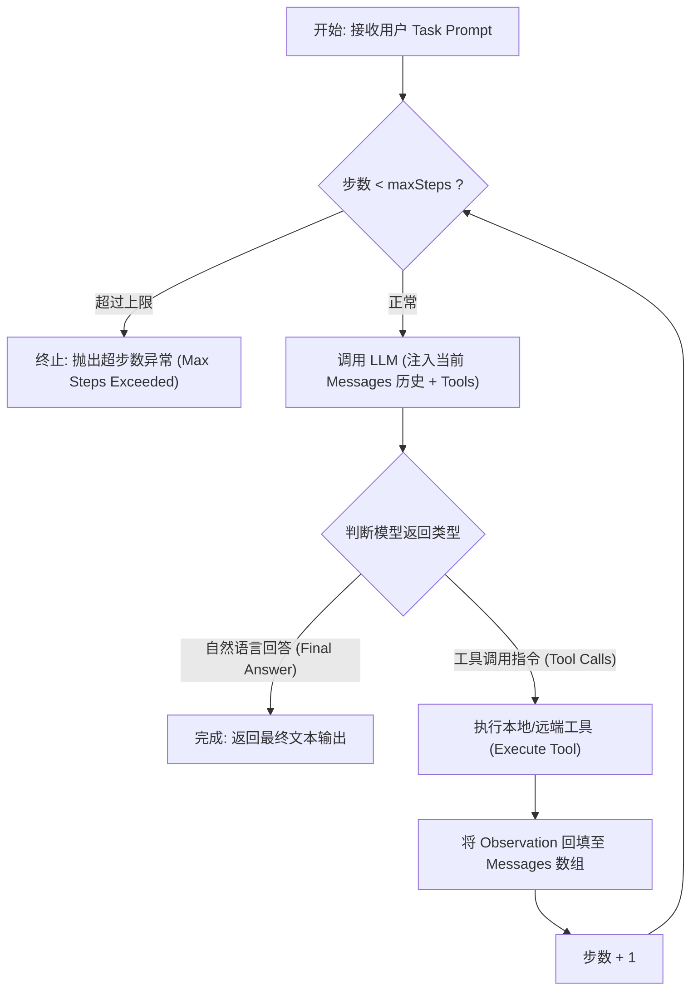
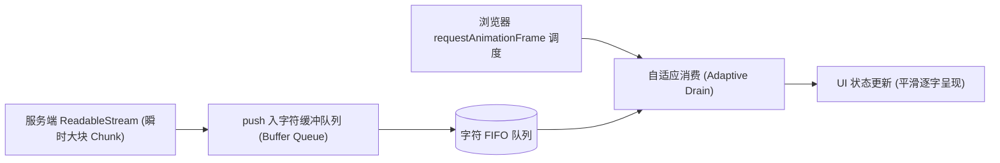

# 前端 AI 核心手写实战题 (Coding Practice)✅

本模块还原大厂面试中针对前端 AI 工程师、Agent 架构师的高频现场上机手写考题。严格包含规范接口契约、边界保护、优雅状态流转与开箱即用的 TypeScript 生产级实现。

---

## 手写实现一个包含工具调用与终止条件的最小 Agent 运行时循环（Agent Loop）？ {#p0-coding-agent-loop}

<Answer>

**核心结论:**

大模型自主智能体（Agent）的底层引擎是一个**基于反馈控制的有向循环（ReAct Loop）**。其核心机制可以概括为：
1. **记忆状态累加（State Accumulation）**：维护包含 `System`、`User`、`Assistant` 与 `Tool Observation` 的消息历史栈；
2. **多轮决策与分发（Decision & Dispatch）**：调用大模型推理；若模型返回自然语言回答，则任务达成并终止；若模型发出工具调用指令（Tool Call），则根据名称分发到对应的函数执行；
3. **安全停止防线（Termination Guardrails）**：为防止模型陷入死循环或 Token 耗尽，必须设定硬性停止条件（最大步数 `maxSteps`、无工具调用、人工终止信号）。

---

**原理解析:**

**1. 最小 Agent Loop 状态流转图**



---

**规范代码实现:**

以下为纯 TypeScript 实现的无第三方黑盒依赖的最小 Agent 运行时循环：

```typescript
// agent/minimal-agent-loop.ts
export interface ToolDefinition {
  name: string;
  description: string;
  execute: (args: Record<string, any>) => Promise<any>;
}

export interface AgentMessage {
  role: 'system' | 'user' | 'assistant' | 'tool';
  content?: string;
  toolCalls?: Array<{ id: string; name: string; args: Record<string, any> }>;
  toolCallId?: string;
}

export interface AgentConfig {
  maxSteps?: number;
  systemPrompt?: string;
}

export class MinimalAgentRunner {
  private tools = new Map<string, ToolDefinition>();
  private maxSteps: number;
  private systemPrompt: string;

  constructor(tools: ToolDefinition[], config: AgentConfig = {}) {
    tools.forEach((t) => this.tools.set(t.name, t));
    this.maxSteps = config.maxSteps || 10;
    this.systemPrompt = config.systemPrompt || 'You are a reliable AI Agent.';
  }

  // 模拟调用大模型 API (在真实生产中替换为 Fetch / SDK 调用)
  protected async callModel(messages: AgentMessage[]): Promise<AgentMessage> {
    // 桩代码示例：返回工具调用或最终文本
    return { role: 'assistant', content: 'Task completed successfully.' };
  }

  // 执行核心循环 (The Agent Loop)
  public async run(userPrompt: string): Promise<string> {
    const messages: AgentMessage[] = [
      { role: 'system', content: this.systemPrompt },
      { role: 'user', content: userPrompt },
    ];

    let currentStep = 0;

    while (currentStep < this.maxSteps) {
      currentStep++;
      console.log(`[AgentLoop] Step ${currentStep} 正在规划执行...`);

      // 1. 调用模型推理
      const response = await this.callModel(messages);
      messages.push(response);

      // 2. 终止条件 1：模型返回了文本且无工具调用，代表得出最终答案
      if (!response.toolCalls || response.toolCalls.length === 0) {
        console.log(`[AgentLoop] 任务在第 ${currentStep} 步正常达成终态。`);
        return response.content || '';
      }

      // 3. 执行工具调用并回填 Observation
      for (const toolCall of response.toolCalls) {
        const tool = this.tools.get(toolCall.name);
        let observationResult: any;

        if (!tool) {
          observationResult = `Error: Tool [${toolCall.name}] not found.`;
        } else {
          try {
            console.log(`[AgentLoop] 触发工具: ${toolCall.name}`);
            observationResult = await tool.execute(toolCall.args);
          } catch (err: any) {
            observationResult = `Execution error: ${err.message}`;
          }
        }

        // 将工具执行结果作为 Observation 压入上下文栈
        messages.push({
          role: 'tool',
          toolCallId: toolCall.id,
          content: typeof observationResult === 'string' 
            ? observationResult 
            : JSON.stringify(observationResult),
        });
      }
    }

    throw new Error(`[AgentLoop] 达到最大安全步数限制 (${this.maxSteps})，任务强制熔断退出。`);
  }
}
```

---

**面试官视角:**

- **评分 Rubric**:
  - **必答要点**：完整体现 messages 累加、工具派发与错误隔离、明确的死循环熔断卡口（`maxSteps`）；
  - **加分项**：考虑了工具执行抛错时不是直接 crash，而是将错误转化为给模型的提示（Self-Correction）；
  - **避坑提醒**：工具调用的参数必须支持对象反序列化，严禁把整个未解析的 JSON 字符串直接塞入业务逻辑。
</Answer>

---

## 手写实现一个平滑打字机缓冲队列（Smooth Typing Buffer Queue）？ {#p0-coding-typing-buffer}

<Answer>

**核心结论:**

直接把大模型 SSE 吐出的每个 Chunk 粗暴 `setState` 会导致两大体验灾难：① 微任务高频触发 React/Vue 重渲染导致页面卡死；② 网络由于拥塞突然一次性到达一大段文本，视觉上产生“卡顿后突发暴吐”的难受感。**平滑打字机缓冲队列（Smooth Typing Buffer Queue）** 的设计目标是：
- **生产者-消费者模型**：网络 Stream 作为生产者，将收到的文字丢入字符队列；
- **自适应速率调度**：基于 `requestAnimationFrame` 驱动消费者。队列积压较少时，匀速逐字吐出；积压过多（如网络抖动恢复）时，自适应加快吐字速率，兼顾视觉动效与无延迟交互。

---

**原理解析:**



---

**规范代码实现:**

```typescript
// ui/smooth-typing-queue.ts
export class SmoothTypingQueue {
  private buffer: string[] = [];
  private displayedText = '';
  private isRunning = false;
  private onUpdate: (text: string) => void;
  private onComplete?: () => void;

  constructor(onUpdate: (text: string) => void, onComplete?: () => void) {
    this.onUpdate = onUpdate;
    this.onComplete = onComplete;
  }

  // 生产者：追加服务端下发的增量字符串
  public push(chunk: string): void {
    // 按字符拆解入队 (支持 emoji 等多字节字符)
    const chars = Array.from(chunk);
    this.buffer.push(...chars);

    if (!this.isRunning) {
      this.isRunning = true;
      this.startTypingLoop();
    }
  }

  // 消费者：基于 RAF 的自适应动态流出
  private startTypingLoop = (): void => {
    if (this.buffer.length === 0) {
      this.isRunning = false;
      this.onComplete?.();
      return;
    }

    // 自适应速率计算：积压过多时动态加速
    let charsToTake = 1;
    if (this.buffer.length > 200) {
      charsToTake = 8; // 严重积压，高速跳字
    } else if (this.buffer.length > 50) {
      charsToTake = 4; // 轻度积压，适度加速
    } else if (this.buffer.length > 20) {
      charsToTake = 2;
    }

    const taken = this.buffer.splice(0, charsToTake).join('');
    this.displayedText += taken;
    this.onUpdate(this.displayedText);

    // 请求下一帧调度
    requestAnimationFrame(this.startTypingLoop);
  };

  // 紧急终止或强制刷盘
  public flush(): void {
    if (this.buffer.length > 0) {
      this.displayedText += this.buffer.join('');
      this.buffer = [];
      this.onUpdate(this.displayedText);
    }
    this.isRunning = false;
    this.onComplete?.();
  }
}
```

---

**面试官视角:**

- **评分 Rubric**:
  - **必答要点**：使用 `requestAnimationFrame` 而非不稳定的 `setInterval`；考虑了网络波动时的自适应动态调速机制；
  - **加分项**：使用了 `Array.from(chunk)` 保证了 Emoji 表情与多字节 Unicode 编码不被截断乱码。
</Answer>

---

## 手写实现纯前端带重叠窗口（Overlap）的递归文档切分与余弦相似度检索器？ {#p0-coding-rag-cosine-search}

<Answer>

**核心结论:**

在前端本地轻量 RAG 与文档问答中，必须依靠纯 JavaScript 完成两项关键数学与数据处理工作：
1. **带重叠窗口的分块切分（Chunking with Overlap）**：优先按段落、次选标点、最后按空格递归切分，且相邻切片之间保留指定数量字符的重叠，保证语义边界连贯；
2. **向量余弦相似度（Cosine Similarity）与快速 Top-K 召回**：使用 `Float32Array` 类型化数组承载高维嵌入向量，通过点积实现极速排序。

---

**规范代码实现:**

```typescript
// rag/pure-rag-engine.ts
export interface TextChunk {
  id: string;
  text: string;
  vector?: Float32Array;
}

export class PureFrontendRag {
  // 1. 带 Overlap 的文本切分器
  public static splitText(
    fullText: string,
    chunkSize = 300,
    overlapSize = 50
  ): string[] {
    const chunks: string[] = [];
    let startIndex = 0;

    while (startIndex < fullText.length) {
      const endIndex = Math.min(startIndex + chunkSize, fullText.length);
      const chunk = fullText.slice(startIndex, endIndex).trim();

      if (chunk.length > 0) {
        chunks.push(chunk);
      }

      if (endIndex >= fullText.length) break;
      // 滑动步长 = 块尺寸 - 重叠尺寸
      startIndex += chunkSize - overlapSize;
    }

    return chunks;
  }

  // 2. 向量余弦相似度计算 (若已归一化，余弦相似度 = 点积)
  public static cosineSimilarity(a: Float32Array, b: Float32Array): number {
    let dotProduct = 0;
    let normA = 0;
    let normB = 0;
    const len = a.length;

    for (let i = 0; i < len; i++) {
      dotProduct += a[i] * b[i];
      normA += a[i] * a[i];
      normB += b[i] * b[i];
    }

    if (normA === 0 || normB === 0) return 0;
    return dotProduct / (Math.sqrt(normA) * Math.sqrt(normB));
  }

  // 3. Top-K 向量相似度检索
  public static retrieveTopK(
    queryVector: Float32Array,
    corpus: TextChunk[],
    k = 3
  ): Array<{ chunk: TextChunk; score: number }> {
    const scored = corpus
      .filter((item): item is TextChunk & { vector: Float32Array } => !!item.vector)
      .map((chunk) => ({
        chunk,
        score: PureFrontendRag.cosineSimilarity(queryVector, chunk.vector),
      }));

    // 按得分降序排序
    scored.sort((a, b) => b.score - a.score);
    return scored.slice(0, k);
  }
}
```

---

**面试官视角:**

- **评分 Rubric**:
  - **必答要点**：清晰推导 `startIndex += chunkSize - overlapSize` 的重叠滑动指针逻辑；正确编写包含分母模长归一化的点积公式；
  - **加分项**：能够解释预先对向量进行 L2 归一化后，可以将运行时开销从 $O(3N)$ 骤降至 $O(N)$。
</Answer>

---

## 手写实现基于 Promise 控制反转模式的 Human-in-the-Loop 授权拦截管理器？ {#p0-coding-hitl-interceptor}

<Answer>

**核心结论:**

在智能体自主执行场景中，遇到高危操作（如删除数据库、修改权限、对外转账），前端必须把底层“单向异步执行”挂起为“等待用户审查的交互承诺”。利用 **Promise 控制反转（IoC，Inversion of Control）** 模式，可以在不阻塞主事件循环的前提下，将 `resolve` 与 `reject` 闭包句柄提取到外部队列中，由用户的点击确认事件来决定 Promise 的决议。

---

**规范代码实现:**

```typescript
// security/hitl-interceptor.ts
export interface InterceptedAction<TArgs = any, TResult = any> {
  actionId: string;
  toolName: string;
  args: TArgs;
  timestamp: number;
  resolve: (res: { approved: true; modifiedArgs?: TArgs }) => void;
  reject: (err: Error) => void;
}

export class HitlAuthorizationInterceptor {
  private pendingQueue = new Map<string, InterceptedAction>();
  private onQueueChange?: (actions: InterceptedAction[]) => void;

  constructor(onQueueChange?: (actions: InterceptedAction[]) => void) {
    this.onQueueChange = onQueueChange;
  }

  // 1. 拦截高危工具执行：挂起当前执行流并返回未决 Promise
  public intercept<TArgs = any>(
    actionId: string,
    toolName: string,
    args: TArgs
  ): Promise<{ approved: boolean; modifiedArgs?: TArgs }> {
    return new Promise((resolve, reject) => {
      const action: InterceptedAction = {
        actionId,
        toolName,
        args,
        timestamp: Date.now(),
        resolve,
        reject,
      };

      this.pendingQueue.set(actionId, action);
      this.notify();

      // 设置 5 分钟超时自动取消保护
      setTimeout(() => {
        if (this.pendingQueue.has(actionId)) {
          this.reject(actionId, '授权超时，系统自动拒绝高危操作。');
        }
      }, 5 * 60 * 1000);
    });
  }

  // 2. 外部事件驱动：用户在弹窗中点击【批准授权】
  public approve(actionId: string, modifiedArgs?: any): void {
    const action = this.pendingQueue.get(actionId);
    if (!action) return;

    this.pendingQueue.delete(actionId);
    this.notify();
    action.resolve({ approved: true, modifiedArgs });
  }

  // 3. 外部事件驱动：用户点击【拒绝并驳回】
  public reject(actionId: string, reason: string): void {
    const action = this.pendingQueue.get(actionId);
    if (!action) return;

    this.pendingQueue.delete(actionId);
    this.notify();
    action.reject(new Error(`[HITL Rejected] ${reason}`));
  }

  private notify(): void {
    this.onQueueChange?.(Array.from(this.pendingQueue.values()));
  }
}
```

---

**面试官视角:**

- **评分 Rubric**:
  - **必答要点**：准确运用 `new Promise((resolve, reject) => { ... })` 句柄提取；支持将修改后的参数 `modifiedArgs` 回填给模型；
  - **加分项**：包含了防悬挂的超时定时器清理逻辑与多请求并发队列隔离。
</Answer>
