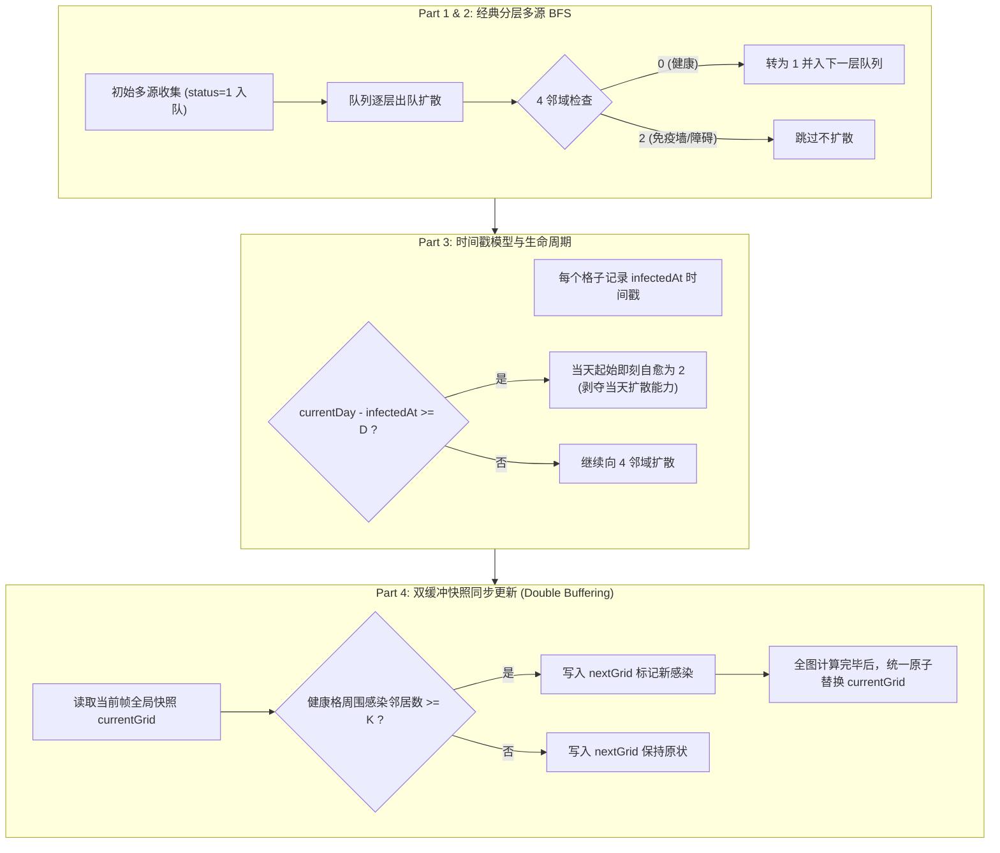

# 图✅

## 图的遍历 {#p0-graph-traversal}

<Answer>

图的遍历主要有两种方式：深度优先搜索（DFS）和广度优先搜索（BFS）。

**深度优先搜索（DFS）**

```js
function dfs (graph, start) {
  const visited = new Set()
  function traverse (node) {
    if (visited.has(node)) return
    visited.add(node)
    console.log(node)
    for (const neighbor of graph[node]) {
      traverse(neighbor)
    }
  }
  traverse(start)
}

const graph = {
  A: ['B', 'C'],
  B: ['D', 'E'],
  C: ['F'],
  D: [],
  E: ['F'],
  F: []
}

dfs(graph, 'A') // A B D E F C
```

**广度优先搜索（BFS）**

```js
function bfs (graph, start) {
  const visited = new Set()
  const queue = [start]

  while (queue.length > 0) {
    const node = queue.shift()
    if (visited.has(node)) continue
    visited.add(node)
    console.log(node)
    for (const neighbor of graph[node]) {
      if (!visited.has(neighbor)) {
        queue.push(neighbor)
      }
    }
  }
}

bfs(graph, 'A') // A B C D E F
```

</Answer>

## 最短路径算法 {#p0-shortest-path}

给定一个加权有向图，找到从起点到终点的最短路径。

```js
const graph = {
  A: { B: 1, C: 4 },
  B: { C: 2, D: 5 },
  C: { D: 1 },
  D: {}
}

function dijkstra (graph, start) {

}
```

<Answer>

import dijkstra from '!!raw-loader!./answers/graph/dijkstra.js';
import dijkstraTest from '!!raw-loader!./answers/graph/dijkstra.test.js';

<TestCode
   files={{
      "/dijkstra.js": dijkstra,
      "/dijkstra.test.js": dijkstraTest,
   }}
/>

</Answer>

## 最小生成树 {#p0-minimum-spanning-tree}

给定一个加权无向图，找到其最小生成树。

```js
const graph = {
  A: { B: 1, C: 4 },
  B: { A: 1, C: 2, D: 5 },
  C: { A: 4, B: 2, D: 1 },
  D: { B: 5, C: 1 }
}

function kruskal (graph) {

}
```

<Answer>

import kruskal from '!!raw-loader!./answers/graph/kruskal.js';
import kruskalTest from '!!raw-loader!./answers/graph/kruskal.test.js';

<TestCode
   files={{
      "/kruskal.js": kruskal,
      "/kruskal.test.js": kruskalTest,
   }}
/>

</Answer>

## 拓扑排序 {#p0-topological-sort}

给定一个有向无环图，找到其拓扑排序。

```js
const graph = {
  A: ['B', 'C'],
  B: ['D'],
  C: ['D'],
  D: []
}

function topologicalSort (graph) {

}
```

<Answer>

import topologicalSort from '!!raw-loader!./answers/graph/topologicalSort.js';
import topologicalSortTest from '!!raw-loader!./answers/graph/topologicalSort.test.js';

<TestCode
   files={{
      "/topologicalSort.js": topologicalSort,
      "/topologicalSort.test.js": topologicalSortTest,
   }}
/>

</Answer>

## 网格多源扩散传播问题（Infection Spread）如何从多源 BFS 逐步演进到带状态自愈与阈值同步更新？ {#p0-multi-source-bfs-infection-spread}

```text
给定一个二维网格，0 代表健康易感个体，1 代表感染者。
每天每个感染者可同时向上下左右 4 邻域扩散感染相邻的健康个体。
请分析从经典多源 BFS 出发，如何逐步应对免疫障碍物、自愈时间戳窗口、邻居阈值协同激活与全局消杀决策优化等一系列连续演进场景？
```

<Answer>

import infectionSpread from '!!raw-loader!./answers/graph/infectionSpread.js';
import infectionSpreadTest from '!!raw-loader!./answers/graph/infectionSpread.test.js';

**核心结论**

网格多源扩散传播问题（Infection Spread）是顶级 AI 机构（如 OpenAI）用于考核工程代码架构弹性与复杂状态演进的战役级题目。其本质是 LeetCode 994（腐烂的橘子）的高维扩展，核心演进脉络如下：
1. **Part 1 基础传播**：多源广度优先搜索（Multi-Source BFS），将所有初始感染源一次性入队作为第 0 层，按波前逐层推进，时间与空间复杂度均为 $O(R \times C)$。
2. **Part 2 免疫阻隔**：引入静态免疫墙（2=immune），本质为图的不可穿越障碍物节点。BFS 遇墙直接跳过；若遍历结束后仍存在无法被波前覆盖的健康个体，判定不可达并返回 -1。
3. **Part 3 自愈生命周期（时间戳标记）**：节点在感染第 $D$ 天自愈为 immune 不再扩散。关键陷阱在于 **时钟与状态流转顺序（Off-by-one 陷阱）**：在当天传播判定前，必须先执行自愈判定（`currentDay - infectedAt >= D` 立即转为免疫），剥夺其当天继续感染邻居的资格。
4. **Part 4 阈值协同感染与死亡（双缓冲快照更新）**：健康格必须满足周围感染邻居数量 &ge; $K$ 才会被感染，伴随死亡倒计时。此时图的分层 BFS 骨架被打破，必须采用**双缓冲快照（Double Buffering）同步演化机制**：基于当前时钟全局快照统一计算所有格子在新时钟的瞬时状态，禁止原地（in-place）修改导致后续遍历格子产生状态竞争与时序污染。
5. **Part 5 全局行/列消杀灭火决策（优化问题）**：每天允许消杀整行或整列，目标为最小化最终死亡/感染规模。通过单步受影响感染源边际贡献评估与贪心剪枝策略，实现全局最优防控。

---

**算法演化架构与状态流转拓扑**



---

**交互沙箱与测试套件验证**

在下方交互式测试套件中，可直接运行与调试涵盖 Part 1 至 Part 5 的 5 个递进阶段完整工程级实现与 Jest 单元测试用例：

<TestCode
   files={{
      "/infectionSpread.js": infectionSpread,
      "/infectionSpread.test.js": infectionSpreadTest,
   }}
/>

---

**核心分阶段实现解析**

**1. Part 1 基础传播：多源 BFS 起手**
- 统计健康格子总数 `freshCount`，将所有初态为 1 的坐标压入队列；
- 若 `freshCount === 0`，直接返回 0 天；
- 每次按当前层队列长度 `size` 批量出队，向 4 个方向扩散，将相邻的 0 置为 1，`freshCount--`，并压入队列；
- 当队列为空后，检查 `freshCount === 0`：若全覆盖则返回经历的天数，否则返回 -1。

**2. Part 2 增加免疫墙：障碍物阻隔与可达性死区**
- 免疫墙值为 2，在初始扫描时跳过墙体；
- 扩散遍历过程中，若邻居格为 2 则视为阻断障碍；
- 若存在被免疫墙完全环绕孤立的健康个体，多源 BFS 波前永远无法触达，最终 `freshCount > 0` 自动触发返回 -1。

**3. Part 3 自愈生命周期：规避 Off-by-one 时钟陷阱**
- 数据结构：网格中存储状态与感染日元组 `{ state: 1, infectedAt: t }`；
- **时序核心**：若某格子在第 $t$ 天感染，自愈周期为 $D$。在第 $currentDay$ 天：
  - 如果先扩散再自愈：该格子在第 $t+D$ 天仍会向外扩散一次，导致其实际具备传染力的天数变为 $D+1$ 天；
  - 正确时序：在第 $currentDay$ 天启动时，必须**先结算自愈**：若 `currentDay - infectedAt >= D`，立即将状态置为 2，当日不再具备传播力。

**4. Part 4 阈值协同感染与死亡：双缓冲同步更新**
- 为什么纯队列 BFS 骨架不再适用？因为协同感染要求“同时观察当前时钟下周围活跃感染源数量是否满足 $\ge K$”。如果边遍历边就地（in-place）修改网格，先被计算的格子感染后会错误地成为同一时钟周期内后续邻居的“感染源”，引发时钟脏读；
- 解决方案：**双缓冲快照（Double Buffering）**：
  ```javascript
  const nextGrid = currentGrid.map(row => row.map(cell => ({ ...cell })));
  // 遍历所有坐标 (r, c)，只读读取 currentGrid，只写写入 nextGrid
  // 计算完成一整天所有格子的瞬时变化后，再原子赋值 currentGrid = nextGrid
  ```

**5. Part 5 消杀决策优化：全局行/列剪枝**
- 每一轮在执行传播与生命周期更新前，评估消杀每一行或每一列能立即清除的活跃感染源总数；
- 选取边际收益最大的轴向进行整行/整列置 2（彻底阻断），使后续传播链条在最短周期内收敛。

---

**面试官视角与下探考察点**

1. **架构扩展性（Refactorability）**：
   - 面试官通常会在前 15 分钟让候选人快速写完 Part 1。许多候选人会写出与状态值 1/0 强耦合的死逻辑；当面试官追问 Part 3（引入时间戳自愈）与 Part 4（引入阈值）时，原本基于数组就地修改的代码全部推倒重写，直接超时失败。
   - 具备 Staff / Senior 架构意识的候选人会从一开始就将“邻居探查”、“状态转移合法性校验”、“时钟步进”抽离为独立纯函数。
2. **状态更新时序（Clock Semantics）**：
   - 针对 Part 3 的 `currentDay - infectedAt >= D`，面试官会重点考察边界用例（如 $D=1$ 时，第 0 天感染的个体在第 1 天是否还能扩散）。清楚指出“先自愈注销传播权，再执行波前扩散”是拿到 Strong Hire 的关键证明。
3. **并发更新与无副作用（In-place vs Double Buffering）**：
   - 深入解释 Cellular Automata（元胞自动机，如康威生命游戏）与双缓冲快照的必要性，体现从单纯算法刷题到系统状态机工程建模的跨越。

---

**延伸阅读**

- LeetCode 994. 腐烂的橘子（Rotting Oranges）
- 康威生命游戏（Conway's Game of Life）与双缓冲渲染机制
- 图论多源最短路算法与波前传播模型（Wavefront Propagation）

</Answer>

