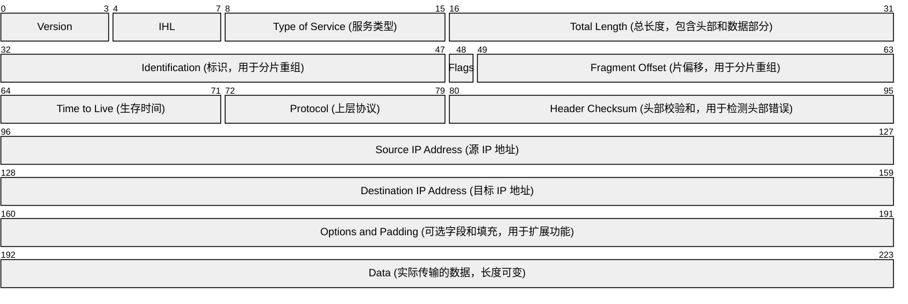

# IP✅

## 什么是 MAC 地址？ {#p0-mac-address}

<Answer>

1. **是什么**  
   MAC 地址（Media Access Control Address，介质访问控制地址）是网络设备的物理地址，用于在局域网中唯一标识设备。它由网卡制造商分配，通常不可更改。

2. **特点**  
   - 长度为 48 位（二进制），通常表示为 12 位十六进制格式（如 `00:1A:2B:3C:4D:5E`）。
   - 前 24 位为厂商标识符（OUI），后 24 位为设备标识符。
   - 工作在数据链路层，用于局域网内的通信。

3. **作用**  
   - 唯一标识局域网中的设备。
   - 用于以太网通信中确定数据帧的源地址和目标地址。

4. **分类**  
   - **单播地址**：用于一对一通信。
   - **多播地址**：用于一对多通信，MAC 地址的最低有效位为 1。
   - **广播地址**：用于向网络中所有设备发送数据，地址为 `FF:FF:FF:FF:FF:FF`。

</Answer>

## 什么是 IP 地址？ {#p0-ip-address}

<Answer>

1. **是什么**  
   IP 地址（Internet Protocol Address）是网络设备在网络中标识其位置的唯一标识符。它用于在网络中定位设备并实现设备之间的通信。

2. **分类**  
   - **IPv4 地址**：由 32 位二进制组成，通常表示为点分十进制格式（如 `192.168.1.1`）。
   - **IPv6 地址**：由 128 位二进制组成，通常表示为冒号分隔的十六进制格式（如 `2001:0db8:85a3:0000:0000:8a2e:0370:7334`）。

3. **作用**  
   - 唯一标识网络中的设备。
   - 支持设备间的路由和通信。

4. **分类方式**  
   - **按用途**：
     - 公网地址：用于互联网通信，全球唯一。
     - 私网地址：用于局域网通信，不能直接访问互联网（如 `192.168.0.0/16`）。
   - **按类型**：
     - 单播地址：用于一对一通信。
     - 多播地址：用于一对多通信。
     - 广播地址：用于向网络中所有设备发送数据（仅适用于 IPv4）。

</Answer>

## IP 地址的分类和子网划分 {#p1-ip-classification}

<Answer>

1. **IP 地址分类**  
   IPv4 地址根据网络规模和用途分为以下几类：
   - **A 类地址**：范围 `0.0.0.0` - `127.255.255.255`，默认子网掩码为 `255.0.0.0`，适用于大型网络。
   - **B 类地址**：范围 `128.0.0.0` - `191.255.255.255`，默认子网掩码为 `255.255.0.0`，适用于中型网络。
   - **C 类地址**：范围 `192.0.0.0` - `223.255.255.255`，默认子网掩码为 `255.255.255.0`，适用于小型网络。
   - **D 类地址**：范围 `224.0.0.0` - `239.255.255.255`，用于多播。
   - **E 类地址**：范围 `240.0.0.0` - `255.255.255.255`，保留地址。

2. **子网划分**  
   子网划分通过调整子网掩码将一个网络划分为多个子网，主要目的是提高地址利用率和网络管理效率。
   - **子网掩码**：用于区分网络部分和主机部分。例如，`255.255.255.0` 表示前 24 位为网络部分，后 8 位为主机部分。
   - **CIDR 表示法**：使用斜线后跟网络位数表示子网掩码，例如 `192.168.1.0/24`。

3. **计算方法**  
   - 子网数量：`2^n`，其中 `n` 为借用的主机位数。
   - 每个子网的主机数量：`2^m - 2`，其中 `m` 为剩余的主机位数，减去 2 是因为需要保留网络地址和广播地址。

</Answer>

## 什么是 IPv4 和 IPv6？ {#p0-ipv4-ipv6}

<Answer>

1. **IPv4**  
   - **是什么**：IPv4 是第四版互联网协议，使用 32 位地址空间，最多支持约 42 亿个唯一地址。
   - **地址格式**：点分十进制表示，例如 `192.168.1.1`。
   - **特点**：
     - 地址数量有限，已接近耗尽。
     - 支持广播通信。
     - 使用 ARP 协议解析 IP 地址到 MAC 地址。

2. **IPv6**   IPv4 使用 32 位地址空间，地址数量有限，已无法满足全球设备的增长需求。IPv6 使用 128 位地址空间，能够为每个设备分配唯一地址，支持物联网（IoT）等场景。

   - **是什么**：IPv6 是第六版互联网协议，使用 128 位地址空间，支持几乎无限的地址数量。
   - **地址格式**：冒号分隔的十六进制表示，例如 `2001:0db8:85a3:0000:0000:8a2e:0370:7334`。
   - **特点**：
     - 地址数量极大，解决了 IPv4 地址耗尽问题。
     - 支持多播通信，不支持广播。
     - 使用邻居发现协议（NDP）替代 ARP。

3. **IPv4 和 IPv6 的区别**  

   | 特性             | IPv4                          | IPv6                          |
   |------------------|-------------------------------|-------------------------------|
   | 地址长度         | 32 位                        | 128 位                       |
   | 地址数量         | 约 42 亿                     | 几乎无限                     |
   | 地址表示         | 点分十进制                   | 冒号分隔十六进制             |
   | 广播支持         | 支持                         | 不支持                       |
   | 安全性           | 无内置安全机制               | 内置 IPsec 支持              |
   | 配置方式         | 手动或 DHCP                  | 自动配置（无状态地址自动配置）|

</Answer>

## IP 报文的组成和结构  {#p2-ip-protocol}

<Answer>

**其他未标注字段含义如下**

1. **Version** (0-3): 指定 IP 协议版本号，IPv4 为 4，IPv6 为 6。  
2. **IHL** (4-7): 指定 IP 头部的长度，单位为 4 字节，用于定位数据部分的起始位置。  
3. **Type of Service** (8-15): 指定服务类型，用于区分数据包的优先级和服务质量。  
4. **Total Length** (16-31): 指定整个 IP 数据包的总长度（头部 + 数据部分），单位为字节。  
5. **Identification** (32-47): 用于标识数据包，分片时所有分片具有相同的标识值。  
6. **Flags** (48): 包含 3 位标志位，用于控制分片行为：
   - 第 1 位：保留位，必须为 0。
   - 第 2 位：DF（Don't Fragment），禁止分片标志。
   - 第 3 位：MF（More Fragments），表示是否有更多分片。  
7. **Fragment Offset** (49-63): 指定当前分片在原始数据包中的位置，单位为 8 字节。  
8. **Time to Live** (64-71): 指定数据包的生存时间，经过每个路由器时减 1，减为 0 时丢弃数据包。  
9. **Protocol** (72-79): 指定上层协议类型，例如 TCP（6）、UDP（17）。  
10. **Header Checksum** (80-95): 用于检测 IP 头部的传输错误。  
11. **Options and Padding** (160-191): 可选字段用于扩展功能，填充字段用于对齐到 4 字节边界。  
12. **Data** (192-...): 实际传输的应用层数据，长度可变。

</Answer>

## 什么是 NAT？NAT 的作用是什么？ {#p2-nat}

<Answer>

1. **是什么**  
   NAT（Network Address Translation，网络地址转换）是一种将私有 IP 地址转换为公有 IP 地址的技术，通常用于路由器或防火墙。

2. **作用**  
   - **节省 IP 地址**：通过 NAT，多个设备可以共享一个公网 IP 地址访问互联网。
   - **提高安全性**：隐藏内部网络结构，防止外部直接访问内部设备。
   - **支持网络重用**：允许私有地址在不同网络中重复使用。

3. **类型**  
   - **静态 NAT**：一个私有 IP 地址映射到一个固定的公网 IP 地址。
   - **动态 NAT**：从一组公网 IP 地址中动态分配一个地址给私有 IP 地址。
   - **PAT（端口地址转换）**：多个私有 IP 地址通过不同的端口共享一个公网 IP 地址。

4. **应用场景**  
   - 家庭网络：通过路由器的 NAT 功能共享一个公网 IP 地址。
   - 企业网络：通过 NAT 隐藏内部网络结构，增强安全性。

</Answer>

## 什么是 IP 分片？ {#p3-ip-fragmentation}

<Answer>

1. **是什么**  
   IP 分片是指当数据包的大小超过网络的 MTU（最大传输单元）时，将数据包拆分为多个较小的片段进行传输。

2. **为什么需要分片**  
   - 不同网络的 MTU 大小可能不同（如以太网的 MTU 通常为 1500 字节）。
   - 为了确保数据包能够通过所有网络链路，必须将超过 MTU 的数据包进行分片。

3. **分片过程**  
   - 每个分片都包含原始数据包的 IP 头部和部分数据。
   - 分片通过以下字段标识和重组：
     - **标识字段（Identification）**：标识属于同一数据包的所有分片。
     - **片偏移字段（Fragment Offset）**：标识分片在原始数据包中的位置。
     - **更多分片标志（MF）**：指示是否还有更多分片。

4. **重组过程**  
   - 接收方根据标识字段和片偏移字段将分片重新组装为完整的数据包。
   - 如果某个分片丢失，整个数据包将被丢弃。

5. **问题与优化**  
   - 分片可能导致性能下降和丢包率增加。
   - 优化方法：尽量避免分片，使用路径 MTU 发现（PMTUD）技术确定最小 MTU。

</Answer>

## 什么是 ARP 和 RARP？ {#p4-arp-rarp}

<Answer>

1. **ARP（Address Resolution Protocol）**  
   - **是什么**：ARP 是一种协议，用于通过 IP 地址解析对应的 MAC 地址。
   - **工作原理**：
     1. 主机发送广播 ARP 请求，询问某个 IP 地址对应的 MAC 地址。
     2. 目标主机接收到请求后，发送 ARP 响应，告知其 MAC 地址。
   - **应用场景**：局域网内的通信需要通过 ARP 获取目标设备的 MAC 地址。

2. **RARP（Reverse Address Resolution Protocol）**  
   - **是什么**：RARP 是一种协议，用于通过 MAC 地址解析对应的 IP 地址。
   - **工作原理**：
     1. 主机发送广播 RARP 请求，询问某个 MAC 地址对应的 IP 地址。
     2. RARP 服务器接收到请求后，返回对应的 IP 地址。
   - **应用场景**：无盘工作站通过 RARP 获取 IP 地址。

3. **区别**  
   - ARP：IP 地址 -> MAC 地址。
   - RARP：MAC 地址 -> IP 地址。

</Answer>
