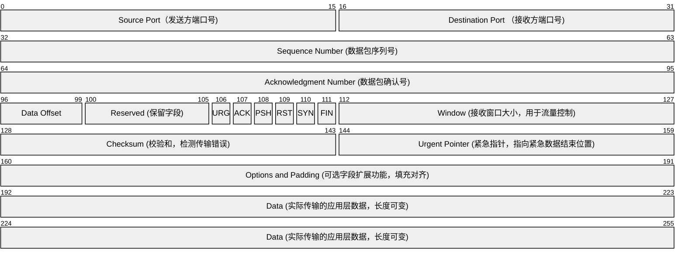
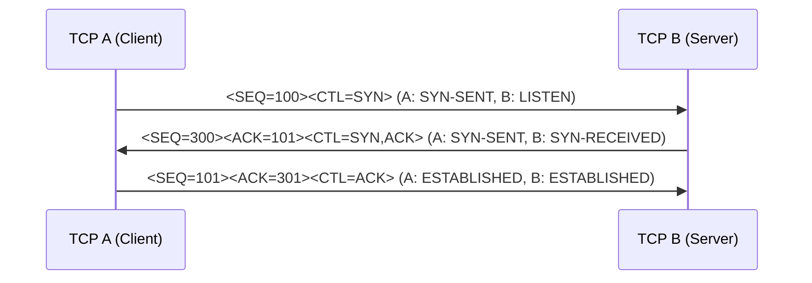
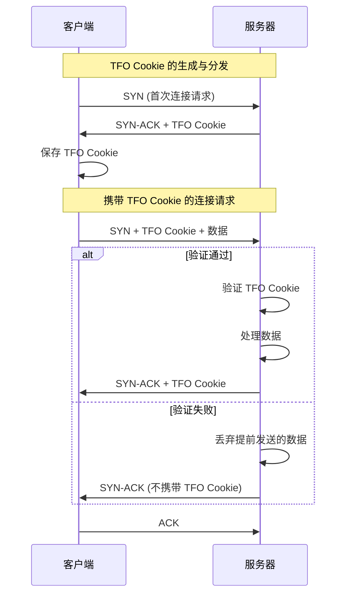
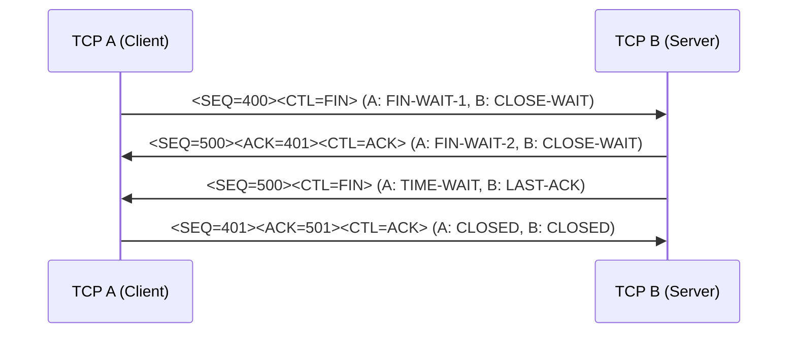
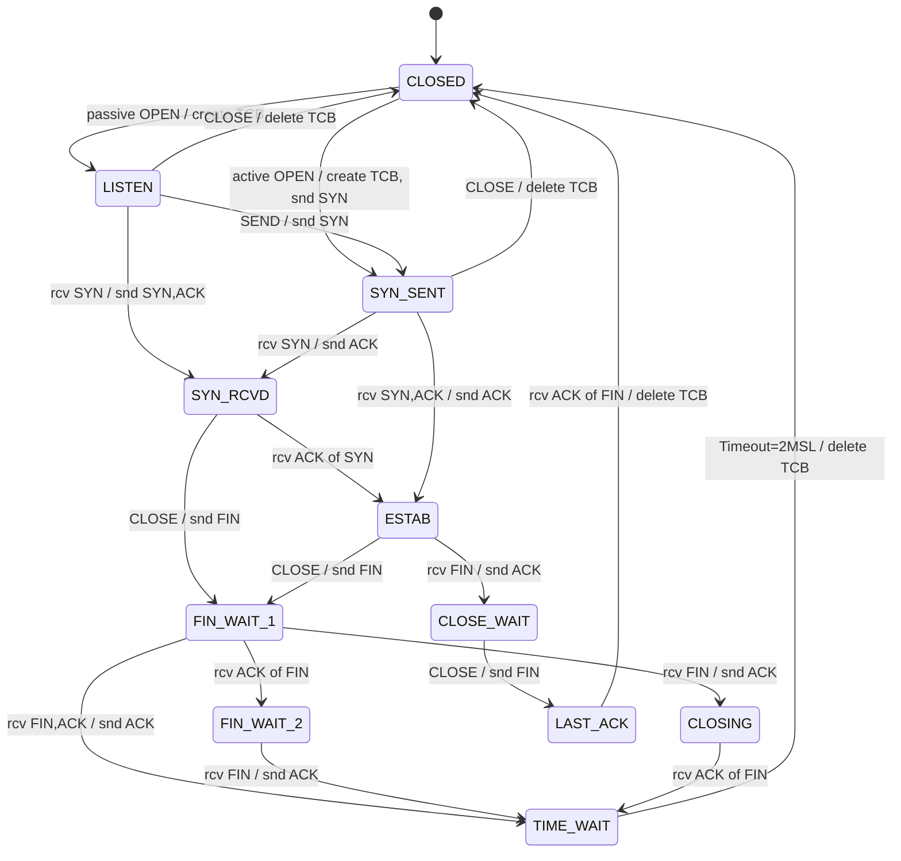

# udp tcp✅

## 概述下 UDP 的功能 {#p1-udp-concept}

<Answer>

UDP (用户数据包协议 user datagram protocol) 是一种无连接的传输层协议，主要功能包括：

1. **无连接性** 不需要建立连接，直接发送数据包。
2. **支持一对多通信**，支持单播、多播、广播
3. **面向报文** - 每个数据包都是独立的，不需要等待其他数据包，不会出现 TCP 中拆包、粘包等问题

UDP 适用于 对实时性要求高的场景，如视频直播、在线游戏、语音通话等。

<Tabs>
<TabItem value="基础使用">

import basic from '!!raw-loader!./answers/udp/basic.js'

<CodeBlock language="js">{basic}</CodeBlock>

</TabItem>

<TabItem value="多播">

import multicast from '!!raw-loader!./answers/udp/multicast.js'

<CodeBlock language="js">{multicast}</CodeBlock>

</TabItem>

<TabItem value="广播">

import broadcast from '!!raw-loader!./answers/udp/broadcast.js'

<CodeBlock language="js">{broadcast}</CodeBlock>

</TabItem>

</Tabs>

</Answer>

## 概述下 tcp 的功能 {#p0-tcp-concept}

<Answer>

TCP（传输控制协议 transmission control protocol）是一种面向连接的传输层协议，主要功能包括：

1. **可靠数据传输**  
   - 通过序列号、确认机制和超时重传，确保数据包按顺序到达且不丢失。
   - 适用于对数据完整性要求较高的场景。

2. **流量控制**  
   - 采用滑动窗口机制，动态调整发送方的发送速率，防止接收方因处理能力不足而丢包。

3. **拥塞控制**  
   - 使用慢启动、拥塞避免、快重传和快恢复等算法，优化传输效率并避免网络拥塞。

4. **全双工通信**  
   - 支持双向数据传输，双方可以同时发送和接收数据。

5. **数据完整性**  
   - 通过校验和检测数据包的传输错误，确保数据的完整性。

TCP 的这些功能使其适用于对可靠性要求较高的场景，如文件传输、电子邮件和网页浏览。

<!-- 补充一个基本的 node socket tcp 协议示例 -->
</Answer>

## TCP 和 UDP 的区别和应用场景 {#p1-tcp-udp-differences}

<Answer>

| 特性           | TCP（传输控制协议）                          | UDP（用户数据报协议）                     |
|----------------|---------------------------------------------|------------------------------------------|
| **是否连接**   | 面向连接，需要建立连接（三次握手）            | 面向非连接，直接发送数据                  |
| **传输可靠性** | 可靠，通过确认机制、重传、序列号保证数据完整性 | 不可靠，无确认机制，可能丢包或乱序         |
| **传输效率**   | 较慢，因可靠性机制增加了延迟                 | 高效，无需建立连接，适合实时传输           |
| **数据顺序**   | 保证数据按顺序到达                          | 不保证数据顺序                           |
| **应用场景**   | 文件传输、电子邮件、网页浏览等对可靠性要求高的场景 | 视频直播、在线游戏、语音通话等对实时性要求高的场景 |

TCP 适用于需要高可靠性和数据完整性的场景，而 UDP 则适用于对实时性要求高但对可靠性要求较低的场景。

</Answer>

## tcp 报文的组成和结构

<Answer>

**其他未标注字段含义如下**
  
1. **Data Offset** (96-99): 指定 TCP 报文段的头部长度，单位为 4 字节，用于定位数据部分的起始位置。  
2. **Reserved** (100-105): 保留字段，当前未使用，必须设置为 0。  
3. **URG** (106): 紧急标志，指示 Urgent Pointer 字段是否有效，用于标记紧急数据。  
4. **ACK** (107): 确认标志，指 Acknowledgment Number 是否有效，用于确认已接收的数据。  
5. **PSH** (108): 推送标志，提示接收方立即将数据交付给应用层，而无需等待缓冲区填满。  
6. **RST** (109): 重置标志，用于重置连接，通常在连接出错或异常时使用。  
7. **SYN** (110): 同步标志，用于建立连接，在三次握手的初始阶段发送。  
8. **FIN** (111): 结束标志，用于释放连接，在四次挥手的过程中使用。  

</Answer>

## TCP 三次握手流程，为什么需要三次握手？

<Answer>

参考 [RFC 793 中 TCP 建立连接过程](https://www.rfcreader.com/#rfc793_line1336)，以下是 TCP 三次握手的详细流程及优化描述：



**详细流程**

1. **第一次握手**  
   客户端发送一个 SYN 报文，表示请求建立连接，并携带一个初始序列号（ISN）100。状态变化如下：
   - **客户端**：从 `CLOSED` 状态进入 `SYN-SENT` 状态。
   - **服务器**：保持在 `LISTEN` 状态，等待报文到达。

2. **第二次握手**  
   服务器收到 SYN 报文后，回复一个 SYN+ACK 报文，表示同意建立连接，并确认客户端的序列号，同时携带自己的初始序列号（ISN）300。状态变化如下：
   - **客户端**：保持在 `SYN-SENT` 状态，等待服务器的确认。
   - **服务器**：从 `LISTEN` 状态进入 `SYN-RECEIVED` 状态。

3. **第三次握手**  
   客户端收到服务器的 SYN+ACK 报文后，回复一个 ACK 报文，确认服务器的序列号，同时携带确认号 301。状态变化如下：
   - **客户端**：从 `SYN-SENT` 状态进入 `ESTABLISHED` 状态。
   - **服务器**：从 `SYN-RECEIVED` 状态进入 `ESTABLISHED` 状态。

**核心机制**

1. **同步初始序列号（ISN）**  
  双方通过三次握手同步各自的初始序列号，确保数据传输的起点明确。

2. **确认机制**  
  每次握手都携带对对方序列号的确认，确保双方能够正确接收和理解数据。

3. **防止旧连接干扰**  
  通过三次握手，可以有效避免旧的重复 SYN 报文导致的错误连接。

**3 次握手原因**

1. **同步序列号**：三次交互确保双方明确彼此的ISN，为可靠传输打下基础。  
2. **阻止历史连接**：客户端通过第三次握手判断是否接受过期请求，避免数据错乱。  
3. **验证双向通信**：三次握手分别验证客户端发送、服务器收发、客户端接收能力。  
4. **资源与安全性**：延迟服务器资源分配至第三次握手，防止资源耗尽攻击。  

</Answer>

## 什么是 TCP 快速启动 {#p1-tcp-fast-start}

<Answer>

TCP 快速启动（TCP Fast Open, TFO）是一种优化 TCP 握手过程的技术，旨在减少网络延迟，提高数据传输效率。它通过在 TCP 握手阶段允许数据的提前传输，减少了传统三次握手的延迟。



**核心流程**

1. **TFO Cookie 的生成与分发**  
   - 客户端首次与服务器通信时，发送普通的 SYN 报文请求建立连接。
   - 服务器在响应的 SYN-ACK 报文中附带一个 TFO Cookie（通过加密算法生成，与客户端 IP 地址绑定），并发送给客户端。
   - 客户端保存该 Cookie，用于后续连接请求。
   - TFO Cookie 是通过加密算法生成的，绑定客户端的 IP 地址，防止被伪造。
   - 服务器可以通过定期更新 Cookie 的加密密钥来增强安全性。
2. **携带 TFO Cookie 的连接请求**  
   - 客户端在后续的连接请求中，将 TFO Cookie 附加到 SYN 报文中，同时可以携带应用层数据。
     - 客户端发送的应用层数据必须小于一个 TCP 数据段的大小（通常为 1460 字节）。
     - 如果服务器验证失败，提前发送的数据会被丢弃。
   - 服务器验证 TFO Cookie 的有效性。如果验证通过，服务器直接处理数据，无需等待三次握手完成。

**优缺点说明**

1. 有点
   - **降低延迟** 通过减少握手等待时间，加快数据传输的启动速度。
   - **提升性能** 特别适用于短连接场景，如网页加载和移动应用请求。
2. 缺点
   - **兼容性问题** 需要客户端和服务器都支持 TFO。
   - **安全性风险** 如果 TFO Cookie 被窃取，可能导致重放攻击。

**延伸阅读**

- [RFC 7413](https://www.rfcreader.com/#rfc7413)

</Answer>

## TCP 四次挥手流程，为什么需要四次挥手？

<Answer>

TCP 四次挥手是指在 TCP 连接关闭时，双方通过四次报文交互来释放连接资源的过程。以下是详细流程：



**详细流程**

1. **第一次挥手**  
   - 主动关闭方（如客户端 A）发送一个 FIN 报文，表示不再发送数据，但仍可以接收数据。
   - 状态变化：
     - **A**：从 `ESTABLISHED` 进入 `FIN-WAIT-1` 状态。
     - **B**：从 `ESTABLISHED` 进入 `CLOSE-WAIT` 状态。

2. **第二次挥手**  
   - 被动关闭方（如服务器 B）收到 FIN 报文后，回复一个 ACK 报文，确认已收到关闭请求。
   - 状态变化：
     - **A**：从 `FIN-WAIT-1` 进入 `FIN-WAIT-2` 状态，等待 B 的 FIN 报文。
     - **B**：保持在 `CLOSE-WAIT` 状态。

3. **第三次挥手**  
   - 被动关闭方（如服务器 B）发送一个 FIN 报文，表示不再发送数据。
   - 状态变化：
     - **A**：从 `FIN-WAIT-2` 进入 `TIME-WAIT` 状态。
     - **B**：从 `CLOSE-WAIT` 进入 `LAST-ACK` 状态。

4. **第四次挥手**  
   - 主动关闭方（如客户端 A）收到 FIN 报文后，回复一个 ACK 报文，确认已收到关闭请求。
   - 状态变化：
     - **A**：从 `TIME-WAIT` 进入 `CLOSED` 状态。
     - **B**：从 `LAST-ACK` 进入 `CLOSED` 状态。

**核心机制**

1. **双向关闭**  
   - TCP 是全双工协议，双方都需要单独关闭发送和接收通道，因此需要四次报文交互。

2. **TIME-WAIT 状态**  
   - 主动关闭方在发送最后一个 ACK 报文后，进入 `TIME-WAIT` 状态，等待一段时间（通常为 2 倍的最大报文段寿命，2MSL）。
   - 目的：
     - 确保被动关闭方收到 ACK 报文。
     - 防止旧连接的报文干扰新连接。

**为什么需要四次挥手？**

1. **全双工通信**  
   - TCP 连接是全双工的，双方需要分别关闭发送和接收通道，确保数据传输的完整性。

2. **异步关闭**  
   - 双方的关闭操作是独立的，可能存在延迟，因此需要单独确认每个方向的关闭状态。

3. **可靠性保障**  
   - 通过四次交互，确保双方都能正确释放资源，避免资源泄漏或数据丢失。

:::tip
4 次挥手并不代表整个动作是串行的，实际上 A 和 B 的关闭操作是异步的，它们可以同时进行，而不需要等待对方完成关闭操作。
:::

**延伸阅读**

- [RFC 793](https://www.rfcreader.com/#rfc793_line1360)
- [TCP TIME-WAIT 状态的意义](https://tools.ietf.org/html/rfc1337)

</Answer>

## TCP 如何保证数据包传输的有序可靠 {#p1-sequence}

<Answer>

TCP 通过以下机制保证数据包传输的有序性和可靠性：

1. **序列号（Sequence Number）**  
   - 每个数据包都带有唯一的序列号，用于标识数据在整个传输流中的位置。
   - 接收方根据序列号对数据包进行排序，即使数据包乱序到达，也能重新组装成正确的顺序。

2. **确认机制（Acknowledgment）**  
   - 接收方在成功接收数据包后，会发送一个带有确认号（ACK）的报文，告知发送方已接收到的数据范围。
   - 如果发送方未收到确认，则会触发重传机制。

3. **超时重传（Timeout Retransmission）**  
   - 发送方在发送数据包后启动定时器，如果在指定时间内未收到确认，则认为数据丢失并重新发送。

4. **滑动窗口（Sliding Window）**  
   - 发送方和接收方通过滑动窗口机制控制数据的发送和接收速率。
   - 滑动窗口确保接收方有足够的缓冲区处理数据，避免数据丢失。

5. **校验和（Checksum）**  
   - 每个数据包都包含校验和，用于检测传输过程中是否发生数据损坏。
   - 如果校验和验证失败，接收方会丢弃数据包并请求重传。

6. **重复数据丢弃**  
   - 接收方会丢弃重复的数据包，确保每个数据只被处理一次。

通过以上机制，TCP 能够确保数据包按顺序到达且不丢失，满足可靠传输的要求。

</Answer>

## TCP 的重传机制是怎样的 {#p2-TCP-Retransmission}

## TCP粘包了解多少 {#p0-packet-sticking}

<Answer>

1. **是什么** TCP 粘包是指发送方连续发送的多个小数据包在接收方被合并为一个数据块接收的现象。由于 TCP 是面向流的协议，数据在传输过程中可能被拆分或合并，导致粘包问题。
2. **为什么**
   1. **数据包过小**：发送方发送的小数据包不足以填满一个 TCP 数据段，多个数据包被合并发送。  
   2. **速率不一致**：发送方发送速率快于接收方处理速率，多个数据包在接收方缓冲区中合并。
3. **如何解决**
   1. **固定长度协议**：在数据包中添加固定长度头部，接收方按长度拆分数据。  
   2. **分隔符协议**：在数据包间添加特殊字符或标记符，接收方通过分隔符解析数据。  
   3. **长度字段协议**：在数据包中添加消息长度字段，接收方根据长度读取数据。

</Answer>

## TCP 拆包了解多少 {#p0-packet-splitting}

<Answer>

1. **是什么**  
   TCP 拆包是指发送方发送的一个较大的数据包在传输过程中被拆分成多个小数据包，接收方需要将这些小数据包重新组装成完整的数据。由于 TCP 是面向流的协议，数据的边界信息不会被保留，因此可能出现拆包现象。

2. **为什么**  
   1. **数据量过大**：发送方发送的数据包超过了 TCP 数据段的最大传输单元（MTU），需要拆分成多个小数据包进行传输。  
   2. **网络限制**：网络设备对数据包大小有限制，导致较大的数据包被拆分。  
   3. **缓冲区限制**：接收方的缓冲区无法一次性容纳完整的数据包，导致数据被分段接收。

3. **如何解决**  
   1. **固定长度协议**：在数据包中添加固定长度头部，接收方按长度组装数据。  
   2. **分隔符协议**：在数据包间添加特殊字符或标记符，接收方通过分隔符解析并组装数据。  
   3. **长度字段协议**：在数据包中添加消息长度字段，接收方根据长度字段组装完整数据。  
   4. **应用层协议**：通过应用层协议定义数据包的边界和组装规则，确保数据完整性。

</Answer>

## 什么是 TCP 流量控制，如何配置？ {#p1-tcp-flow-control}

<Answer>

1. **是什么**  
   TCP 流量控制是一种机制，用于动态调整发送方的数据发送速率，以防止接收方因处理能力不足而丢包。它通过滑动窗口协议实现，确保发送方不会发送超过接收方缓冲区容量的数据。

2. **为什么**  
   - **接收方处理能力有限**：接收方的缓冲区大小有限，如果发送方发送数据过快，可能导致缓冲区溢出，数据丢失。  
   - **网络资源优化**：通过流量控制，可以避免网络拥塞，提高数据传输的效率和稳定性。  
   - **可靠性保障**：流量控制确保数据在接收方能够被正确处理，避免因丢包导致的重传和性能下降。

3. **如何解决**  
   TCP 使用滑动窗口机制实现流量控制，具体包括以下步骤：  

   - **接收窗口（Receive Window）**  
     - 接收方在每次发送 ACK 报文时，会在窗口字段中告知发送方当前可用的接收窗口大小（即接收方缓冲区剩余容量）。  
     - 发送方根据接收窗口大小调整发送速率，确保不会发送超过接收方处理能力的数据。  

   - **滑动窗口协议**  
     - 滑动窗口是一个动态调整的窗口，表示发送方可以发送但尚未被确认的数据范围。  
     - 当接收方确认数据后，窗口向前滑动，允许发送方继续发送新的数据。  

   - **零窗口探测（Zero Window Probe）**  
     - 如果接收方的接收窗口大小为 0，发送方会暂停发送数据，并定期发送探测报文（Zero Window Probe）以检查接收窗口是否恢复。  
     - 当接收窗口恢复后，接收方会通过 ACK 报文通知发送方，发送方继续传输数据。  

4. **配置方法**  
   - **调整缓冲区大小**  
     - 在操作系统中，可以通过配置 TCP 的接收缓冲区和发送缓冲区大小来优化流量控制。例如，在 Linux 中可以通过以下命令调整：  

       ```bash
       sysctl -w net.ipv4.tcp_rmem="4096 87380 6291456"  # 接收缓冲区
       sysctl -w net.ipv4.tcp_wmem="4096 16384 4194304"  # 发送缓冲区
       ```

   - **启用窗口缩放（Window Scaling）**  
     - 对于高带宽延迟产品（BDP）场景，可以启用窗口缩放选项（Window Scaling Option），扩展窗口大小以支持更大的数据传输量。  
     - 在 Linux 中，可以通过以下命令启用：  

       ```bash
       sysctl -w net.ipv4.tcp_window_scaling=1
       ```

   - **监控和优化**  
     - 使用工具（如 `netstat` 或 `ss`）监控 TCP 连接的窗口大小和流量控制状态，及时调整配置以优化性能。

通过以上机制和配置，TCP 流量控制能够有效避免数据丢失和网络拥塞，确保数据传输的可靠性和稳定性。

</Answer>

## 什么是 TCP 拥塞控制，如何配置？ {#p1-tcp-congestion-control}

<Answer>

1. **是什么**  
   TCP 拥塞控制是一种机制，用于防止网络因过载而发生拥塞。它通过动态调整发送方的数据发送速率，确保网络资源的高效利用，同时避免因过多数据注入网络而导致的性能下降。拥塞控制主要在网络层和传输层之间协作完成。

2. **为什么**  
   - **网络资源有限**：网络带宽和路由器缓冲区是有限的，如果发送方发送数据过快，可能导致网络拥塞，出现丢包和延迟增加的情况。  
   - **可靠性需求**：拥塞控制确保数据能够被可靠传输，而不会因网络拥塞导致大量数据丢失或重传。  
   - **公平性**：通过拥塞控制，多个 TCP 连接可以公平地共享网络资源，避免某些连接占用过多带宽。

3. **如何解决**  
   TCP 拥塞控制通过以下四种算法实现：

   - **慢启动（Slow Start）**  
     - 在连接开始或网络恢复时，发送方以较低的速率发送数据，逐步增加发送速率，直到检测到网络拥塞。  
     - 初始拥塞窗口（cwnd）通常为 1 个 MSS（最大报文段大小），每次收到 ACK 后，cwnd 翻倍增长，直到达到慢启动阈值（ssthresh）。  

   - **拥塞避免（Congestion Avoidance）**  
     - 当 cwnd 达到 ssthresh 后，进入拥塞避免阶段，发送速率以线性增长的方式逐步增加。  
     - 每个 RTT（往返时间）内，cwnd 增加 1 个 MSS，避免过快增长导致网络拥塞。  

   - **快重传（Fast Retransmit）**  
     - 当接收方检测到数据包丢失（通过重复 ACK 报文），发送方无需等待超时，立即重传丢失的数据包。  
     - 快重传减少了因超时导致的传输延迟。  

   - **快恢复（Fast Recovery）**  
     - 在快重传后，发送方进入快恢复阶段，将 ssthresh 设置为当前 cwnd 的一半，并将 cwnd 设置为 ssthresh。  
     - 发送方以线性增长的方式恢复发送速率，避免网络拥塞进一步恶化。  

4. **配置方法**  
   - **调整拥塞控制算法**  
     - 不同操作系统支持多种拥塞控制算法（如 Reno、Cubic、BBR 等），可以根据场景选择合适的算法。例如，在 Linux 中可以通过以下命令查看和设置：  

       ```bash
       sysctl net.ipv4.tcp_congestion_control  # 查看当前拥塞控制算法
       sysctl -w net.ipv4.tcp_congestion_control=cubic  # 设置为 Cubic 算法
       ```

   - **优化网络参数**  
     - 调整 TCP 缓冲区大小和窗口缩放选项，确保拥塞控制算法能够充分利用网络带宽。例如：  

       ```bash
       sysctl -w net.ipv4.tcp_rmem="4096 87380 6291456"  # 接收缓冲区
       sysctl -w net.ipv4.tcp_wmem="4096 16384 4194304"  # 发送缓冲区
       ```

   - **监控网络状态**  
     - 使用工具（如 `netstat`、`ss` 或 `tc`）监控网络拥塞状态和 TCP 连接的性能指标，及时调整配置以优化传输效率。

通过以上机制和配置，TCP 拥塞控制能够有效避免网络拥塞，提高数据传输的可靠性和效率。

</Answer>

## TCP 状态机 {#TCP-state-machine}

<Answer>



| 当前状态       | 事件/操作                          | 下一状态       | 动作说明                                   |
|----------------|------------------------------------|----------------|------------------------------------------|
| **CLOSED**     | passive OPEN                      | **LISTEN**     | 创建 TCB，进入监听状态                   |
| **CLOSED**     | active OPEN                       | **SYN_SENT**   | 创建 TCB，发送 SYN 报文                  |
| **LISTEN**     | rcv SYN                           | **SYN_RCVD**   | 接收 SYN 报文，发送 SYN+ACK 报文          |
| **LISTEN**     | SEND                              | **SYN_SENT**   | 主动发送 SYN 报文                        |
| **LISTEN**     | CLOSE                             | **CLOSED**     | 删除 TCB，关闭连接                       |
| **SYN_RCVD**   | rcv ACK of SYN                    | **ESTAB**      | 接收对 SYN 的确认，连接建立              |
| **SYN_RCVD**   | CLOSE                             | **FIN_WAIT_1** | 发送 FIN 报文，开始关闭连接              |
| **SYN_SENT**   | rcv SYN,ACK                       | **ESTAB**      | 接收 SYN+ACK 报文，发送 ACK，连接建立    |
| **SYN_SENT**   | CLOSE                             | **CLOSED**     | 删除 TCB，关闭连接                       |
| **SYN_SENT**   | rcv SYN                           | **SYN_RCVD**   | 接收 SYN 报文，发送 ACK 报文             |
| **ESTAB**      | CLOSE                             | **FIN_WAIT_1** | 发送 FIN 报文，开始关闭连接              |
| **ESTAB**      | rcv FIN                           | **CLOSE_WAIT** | 接收 FIN 报文，发送 ACK 报文             |
| **FIN_WAIT_1** | rcv ACK of FIN                    | **FIN_WAIT_2** | 接收对 FIN 的确认，等待对方关闭          |
| **FIN_WAIT_1** | rcv FIN                           | **CLOSING**    | 接收 FIN 报文，发送 ACK 报文             |
| **FIN_WAIT_1** | rcv FIN,ACK                       | **TIME_WAIT**  | 接收 FIN+ACK 报文，发送 ACK，进入等待状态|
| **FIN_WAIT_2** | rcv FIN                           | **TIME_WAIT**  | 接收 FIN 报文，发送 ACK，进入等待状态    |
| **CLOSING**    | rcv ACK of FIN                    | **TIME_WAIT**  | 接收对 FIN 的确认，进入等待状态          |
| **CLOSE_WAIT** | CLOSE                             | **LAST_ACK**   | 发送 FIN 报文，等待对方确认              |
| **LAST_ACK**   | rcv ACK of FIN                    | **CLOSED**     | 接收对 FIN 的确认，删除 TCB，关闭连接    |
| **TIME_WAIT**  | Timeout=2MSL                      | **CLOSED**     | 超时 2MSL 后，删除 TCB，关闭连接         |

**说明**：

1. **CLOSED**：初始状态或连接关闭后的状态。
2. **LISTEN**：服务器端等待连接请求的状态。
3. **SYN_SENT**：客户端发送 SYN 报文后等待确认的状态。
4. **SYN_RCVD**：服务器端接收到 SYN 报文并发送 SYN+ACK 后的状态。
5. **ESTAB**：连接建立后的状态，双方可以正常传输数据。
6. **FIN_WAIT_1** 和 **FIN_WAIT_2**：主动关闭方发送 FIN 报文后的状态。
7. **CLOSE_WAIT**：被动关闭方接收到 FIN 报文后的状态。
8. **CLOSING**：双方几乎同时关闭连接的状态。
9. **LAST_ACK**：被动关闭方发送 FIN 报文后等待确认的状态。
10. **TIME_WAIT**：主动关闭方等待 2MSL 时间以确保对方收到 ACK 的状态。

</Answer>
