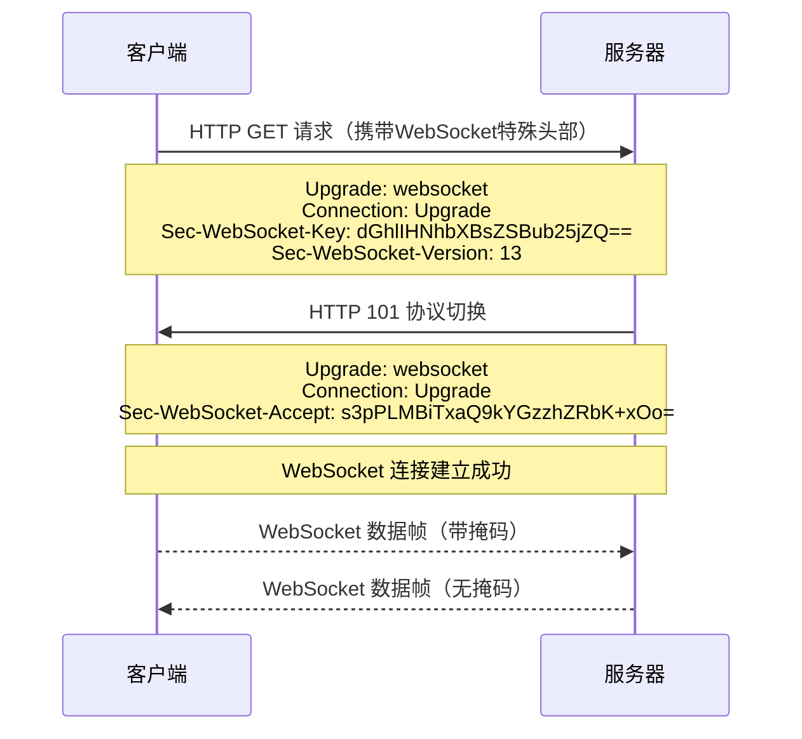
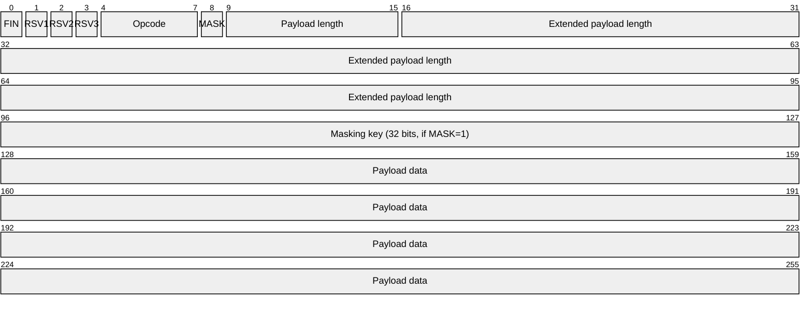

# WebSocket✅

## 什么是 WebSocket？它与 HTTP 的主要区别是什么？ {#p0-websocket-vs-http}

<Answer>

WebSocket 是一种在单个 TCP 连接上进行全双工通信的协议，允许在浏览器和服务器之间建立持久性的连接，实现实时双向数据传输。

**WebSocket 与 HTTP 的主要区别**

| 特性 | WebSocket | HTTP |
|------|-----------|-----------|
| **连接方式** | 建立单个持久连接，保持长时间开放 | 每次请求-响应都需要建立新连接，响应后立即关闭 |
| **通信模式** | 全双工，双向实时通信 | 半双工，客户端请求/服务器响应模式 |
| **数据开销** | 建立连接后，头部信息小，传输效率高 | 每次请求都包含完整的 HTTP 头信息，开销较大 |
| **服务器推送** | 原生支持服务器主动向客户端推送数据 | 需要通过轮询或长轮询等技术模拟 |
| **协议标识** | ws:// 或 wss:// (加密) | http:// 或 https:// (加密) |
| **应用场景** | 实时应用（聊天、游戏、股票行情等） | 传统网页内容加载和数据交换 |
| **握手过程** | 以 HTTP 握手开始，然后升级到 WebSocket 协议 | 每次都是完整的 HTTP 请求-响应流程 |
| **状态保持** | 有状态 - 连接会持续保持 | 无状态 - 每次请求相互独立 |

WebSocket 特别适用于需要低延迟、高频率数据交换的场景：

1. **实时聊天应用** - 消息实时发送接收
2. **在线协作工具** - 文档同步编辑
3. **金融交易平台** - 股票价格实时更新
4. **在线游戏** - 实时游戏状态同步
5. **物联网应用** - 设备状态实时监控

**工作原理简述**

1. **连接建立**: WebSocket 通过 HTTP 升级机制建立连接，之后协议从 HTTP 切换到 WebSocket
2. **双向通信**: 一旦连接建立，客户端和服务器可以随时相互发送消息，不需要重新建立连接
3. **数据格式**: 支持文本和二进制数据传输
4. **连接关闭**: 任何一方都可以主动关闭连接

**答案解析**

WebSocket 协议解决了 Web 应用中实时通信的核心问题，避免了 HTTP 轮询带来的延迟和资源浪费。理解 WebSocket 与 HTTP 的区别，有助于在适当的场景选择正确的通信协议，提高应用性能和用户体验。

**面试官视角**

- **核心考察点**: WebSocket 协议的基本概念、与 HTTP 的区别、适用场景理解
- **评分标准**:
  - **良**: 能正确描述 WebSocket 的基本特性和与 HTTP 的主要区别
  - **优**: 能详细分析两种协议的性能差异、适用场景，并结合实际项目经验讨论选型考虑因素

</Answer>

## 请详细描述 WebSocket 握手过程及数据帧格式? {#p1-websocket-handshake}

<Answer>

WebSocket 通过 HTTP 协议升级机制建立连接，握手完成后通信协议从 HTTP 转换为 WebSocket。



1. 客户端握手请求， 客户端发送标准的 HTTP 请求，但包含特殊的头部信息：

   ```http
   GET /chat HTTP/1.1
   Host: server.example.com
   Upgrade: websocket
   Connection: Upgrade
   Sec-WebSocket-Key: dGhlIHNhbXBsZSBub25jZQ==
   Origin: http://example.com
   Sec-WebSocket-Protocol: chat, superchat
   Sec-WebSocket-Version: 13
   ```

   **关键头部说明**：
      - `Upgrade: websocket` - 请求升级到 WebSocket 协议
      - `Connection: Upgrade` - 表示要升级连接
      - `Sec-WebSocket-Key` - 随机生成的 Base64 编码字符串，用于验证服务器
      - `Sec-WebSocket-Protocol` - 客户端支持的子协议列表（可选）
      - `Sec-WebSocket-Version` - WebSocket 协议版本

2. 服务器握手响应，服务器接受升级请求后，返回特殊响应：

   ```http
   HTTP/1.1 101 Switching Protocols
   Upgrade: websocket
   Connection: Upgrade
   Sec-WebSocket-Accept: s3pPLMBiTxaQ9kYGzzhZRbK+xOo=
   Sec-WebSocket-Protocol: chat
   ```

   **关键头部说明**：
      - `HTTP/1.1 101 Switching Protocols` - 状态码 101 表示协议切换成功
      - `Sec-WebSocket-Accept` - 根据客户端的 Sec-WebSocket-Key 计算得出的值
      - 计算方法：将 Sec-WebSocket-Key 与固定 GUID `258EAFA5-E914-47DA-95CA-C5AB0DC85B11` 拼接
      - 计算 SHA-1 哈希，然后进行 Base64 编码

3. 连接建立， 握手完成后，HTTP 连接升级为 WebSocket 连接，数据传输使用 WebSocket 协议的二进制帧格式。

**WebSocket 数据帧格式**



1. **FIN (1 bit)**:
   - 1 = 消息的最后一个分片
   - 0 = 后续还有分片

2. **RSV1, RSV2, RSV3 (各1 bit)**:
   - 保留位，默认为0，用于协议扩展
3. **Opcode (4 bits)**:
   - 0x0: 继续前一个分片
   - 0x1: 文本帧
   - 0x2: 二进制帧
   - 0x8: 连接关闭
   - 0x9: Ping (心跳检查)
   - 0xA: Pong (心跳响应)
4. **MASK (1 bit)**:
   - 1 = 数据已被掩码处理（客户端发送的帧必须设置为1）
   - 0 = 数据未被掩码处理（服务器发送的帧必须设置为0）
5. **Payload length**:
   - 0-125: 数据的实际长度
   - 126: 后续2字节表示实际长度（16位无符号整数）
   - 127: 后续8字节表示实际长度（64位无符号整数）
6. **Masking-key (32 bits)**:
   - 仅当MASK=1时存在
   - 用于对负载数据进行异或运算
7. **Payload Data**:
   - 实际传输的数据内容

**其他细节**

1. 掩码处理，客户端发送到服务器的所有帧必须使用掩码处理，防止缓存污染攻击：

   ```
   masked_data[i] = original_data[i] XOR masking_key[i % 4]
   ```

   服务器必须解码掩码数据，而服务器发送到客户端的帧不应使用掩码。

2. 安全性考虑
   1. **掩码机制**: 客户端强制掩码可防止基于Web的代理缓存投毒攻击
   2. **同源策略**: 浏览器实施WebSocket的同源安全策略
   3. **TLS加密**: 推荐使用wss://（WebSocket Secure）而非ws://
   4. **握手验证**: 服务器计算Sec-WebSocket-Accept确保握手真实性

</Answer>
